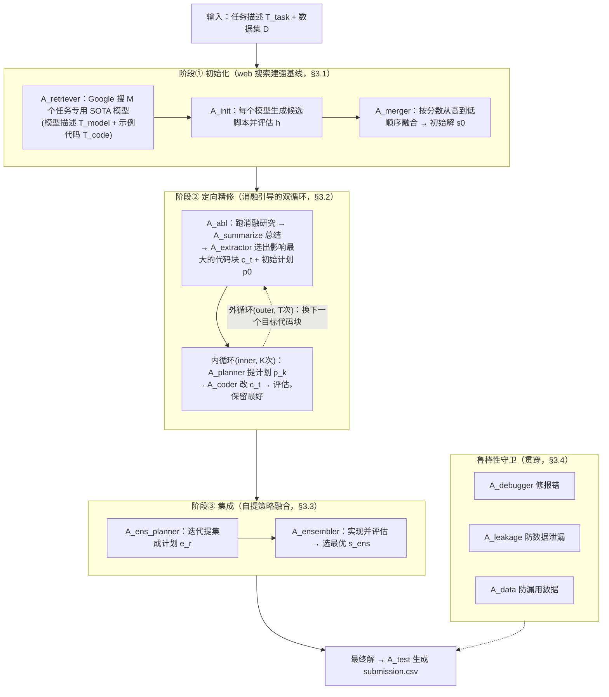
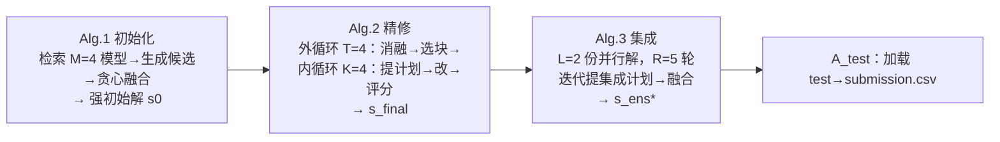

# 组会汇报 · MLE-STAR (Google Cloud, NeurIPS 2025)

> 主讲提示：这是主题组 B（端到端 ML 工程 agent）里**最务实**的一篇。它不谈「自动科学家」的宏大叙事，只回答一个很窄但很硬的问题——**「怎么让一个 LLM agent 真的在 Kaggle 上多拿奖牌？」**。开场就把它和 [`2408.06292` AI Scientist](2408.06292-ai-scientist-v1.md) 的定位差讲清：AI Scientist 是「自己定问题、写论文、自评审」的开环旗舰；MLE-STAR 是「问题已给定（Kaggle 赛题），只把执行力做到极致」的闭环工程师。一句话钉死全场记忆锚：**「先 web 搜建强基线 + 消融引导的定向精修」把 AIDE 的 25.8% 抬到 63.6%。**

---

## 1. 封面 · TL;DR

- **标题 / 出处**：MLE-STAR: Machine Learning Engineering Agent via Search and Targeted Refinement。Jaehyun Nam¹²、Jinsung Yoon¹、Jiefeng Chen¹、Jinwoo Shin²、Sercan Ö. Arık¹、Tomas Pfister¹（¹Google Cloud，²KAIST；一作在 Google Cloud 做学生研究员期间完成）。arXiv 2506.15692，**NeurIPS 2025**。开源仓库 `github.com/jaehyun513/MLE-STAR`（附录多处脚注指向其 `example_intermediate_outputs/` 与 `example_final_solutions/`）。
- **权威性来源**：**大厂出品（Google Cloud）+ 顶会接收（NeurIPS 2025）**；评测基座直接用 OpenAI 的 [`2410.07095` MLE-bench](2410.07095-mle-bench-openai.md)（ICLR 2025），结果数字大量直接取自 MLE-bench 论文的官方 GitHub 仓库（原文 Table 1 题注），可对齐、可复核。
- **一段话**：MLE-STAR 是一个**ML 工程 (machine learning engineering, MLE) 多智能体框架**。它的两个核心 intention 都在反 AIDE 的两个毛病：(1) **初始解不靠 LLM 拍脑袋，而是用 Google Search 当工具**，把任务专用的、当下 SOTA 的模型（描述 + 示例代码）检索回来，建一个真正强的起点（原文 §3.1）；(2) **精修不整体重写代码，而是先做一次消融研究 (ablation study) 找出「哪个代码块对性能影响最大」，再用 inner/outer 双循环只对那个块定向打磨**（原文 §3.2）。最后再用一个**自提集成策略 (ensembling)** 把并行跑出的多个解融成一个（原文 §3.3）。外加防数据泄漏 (data leakage)、防漏用数据 (data usage)、debug 三个鲁棒性模块（原文 §3.4）。
- **三条带走的结论**：
  1. **「搜索建基线 + 定向精修」是真的有效**：用同一个底座 Gemini-2.0-Flash，MLE-STAR 把 AIDE 的任意奖牌率从 **25.8% 抬到 43.9%**（+18 个百分点）；换上更强的 Gemini-2.5-Pro，奖牌率冲到 **63.6%、其中金牌 36.4%**（原文 Abstract / §4.1 / Table 1）。
  2. **它专吃模型代差红利**：AIDE 偏爱 2015 年的 ResNet，MLE-STAR 通过搜索用上 EfficientNet/ViT，图像分类拿牌率 37% vs AIDE 的 26%（原文 §5 / Figure 4）。「随着外部 SOTA 模型更新，它的解会自动变强」是它设计上的卖点（原文 §6 / Appendix I）。
  3. **集成方法本身也是一个贡献**：让 agent **自己迭代提集成策略**（而非简单 best-of-N 或平均投票），把单解的 37.9% 抬到 43.9%（原文 §4.2 / Table 4）——尤其金牌数明显增加。

> 主讲提示：开场把「两反 AIDE」讲清——反「LLM 凭记忆选老模型」（→web 搜），反「整体改写、过早跳步」（→消融定向精修）。这两点是后面所有 how 的源头，也是组会最该让大家记住的「设计层 why」。

---

## 2. 问题与动机（why —— 本篇最该讲透的一节）

> 主讲提示：这一节把「为什么 AIDE 这类 agent 不够好」拆成两个具体病灶。讲透了，MLE-STAR 的两个核心组件就是「对症下药」，后面顺理成章。

### 2.1 问题层 why：MLE agent 的两个真实病灶

ML 仍然是劳动密集的迭代过程（数据工程 + 反复试错），所以业界想用 LLM 当 **MLE agent**——把 ML 任务建模成「代码优化问题」，给定任务描述与数据集，自动产出可执行的 Python 脚本（原文 §1 / Figure 1）。但作者点出现有 agent（以 AIDE 为代表）有两个会卡住性能的硬伤：

- **病灶一：过度依赖 LLM 内部知识 → 偏向「熟悉但未必最优」的方法。** LLM 在预训练里见 scikit-learn、logistic regression 见得最多，于是即便面对一个文本分类赛（如 jigsaw-toxic-comment-classification），它也倾向于掏出 logistic regression，而不是当下任务专用的 SOTA（原文 §1 / §3.1）。**证据**：作者明说「我们观察到 LLM 即使对文本分类也提议 logistic regression……可能因为它们偏好预训练数据里的熟悉模式而非最新信息」。
- **病灶二：探索策略是「一次性改写整份代码」 → 过早跳步、深度不足。** AIDE 这类 agent 每轮迭代都**修改整个代码结构**，结果常常「还没把特征工程这一步试透，就慌忙跳到换模型或调超参」——缺乏在**单个 pipeline 组件内部做深度探索**的能力（原文 §1）。

### 2.2 设计层 why：为什么这两个病灶值得专门设计来治

**不解决会怎样**：你得到的是一个「博览群书但守旧」的工程师——它能跑通流程，但永远用不上为这个任务量身定制的新模型，也永远在各个 pipeline 阶段之间浅尝辄止。两者叠加，天花板就卡在 AIDE 那个 25.8%。

**为什么「web 搜索」是对病灶一的正解（而非朴素替代）**：
> **Why（设计层）**：朴素做法 A = 让 LLM 直接「凭记忆推荐模型」→ 会因为预训练偏好而退化到 logistic regression / ResNet 这类老套路（原文 §1 / §5 实测 AIDE 75% 的图像赛在用 ResNet）。朴素做法 B = 给一个**人工维护的「案例库 (case bank)」**（DS-Agent 的路线）→ 需要大量人力收集 Kaggle 方案、易过拟合到案例的源模式、且对新任务类型（多模态）覆盖不到（原文 §2 对 DS-Agent 的批评）。MLE-STAR 改用 **search-as-a-tool**，因为它「不需要人工维护搜索空间，又能突破固定案例库的约束去检索贴合任务的有效模型」（原文 §2 末）。

**为什么「消融引导的定向精修」是对病灶二的正解**：
> **Why（设计层）**：朴素做法 = AIDE 式「每轮重写整个 code 结构」→ 探索面铺得太广，单个组件挖不深，容易过早 pivot（原文 §1）。MLE-STAR 改成「**先用消融研究定位最该改的那个代码块，再只对它做 inner-loop 深挖**」——把有限的探索预算集中投到「实证上影响最大」的组件上（原文 §3.2）。这就是标题里 **Targeted Refinement** 的含义。

> 主讲提示：把动机讲成「两病两药」的对仗结构：病①守旧→药①web 搜；病②浅尝→药②消融定向精修。并强调对 DS-Agent 的批评（案例库要人力、会过拟合）——这是「为什么不用更显而易见的案例库方案」的关键论证。

---

## 3. 研究问题 / 核心 intention（形式化成一句话）

把要解决的问题压成一句：

> **给定任务描述与数据集，能否让一个多智能体系统，先用外部搜索建一个强初始解、再用消融研究指引对特定代码块做定向精修、并自动集成多个解，从而在真实 Kaggle 任务上显著超过「整体改写」式的最强基线（AIDE）？**

形式化目标（原文 §3 Problem setup，先给符号再给式）：

> 直觉：MLE 任务本质是「在所有可能的 Python 脚本里，找到验证分数最高的那一份」——把「做 ML」变成「在程序空间里做优化」。

记号（先定义，后用式）：
- $\mathcal{S}$：所有可能解的空间（即所有合法的 Python 脚本）；
- $s\in\mathcal{S}$：一个具体解（一份 Python 脚本）；
- $h:\mathcal{S}\to\mathbb{R}$：**打分函数 (score function)**，例如验证集准确率；$h(s)$ 封装了「把数据集 $\mathcal{D}$ 切成训练/验证、用 $s$ 指定的模型在训练集上训练、再在验证集上算指标」这一整套流程；
- $s^\*$：最优解。

$$ s^\* \;=\; \arg\max_{s\in\mathcal{S}}\, h(s) $$

读出什么：这个式子把整篇论文的目标钉死成「最大化 $h$」。注意 $h$ 是**任务专用 (task-specific)** 的（这赛是 AUROC、那赛是 RMSLE），所以后文所有「improve / refine」都是在抬同一个 $h$。

它隐含的**关键假设**：
- (a) **外部知识假设**：当下任务专用的有效模型，**很可能不在 LLM 的「默认偏好」里，但能被 web 搜索检索到**（原文 §3.1 的核心前提）。
- (b) **局部性假设**：ML pipeline 的性能瓶颈，往往**集中在某一个代码块**（如特征工程、imputation），所以「定向打磨那一个块」比「均匀改写全部」更高效（原文 §3.2 / Figure 8 的早期增益陡峭佐证）。
- (c) **互补性假设**：并行跑出的多个次优解**含有互补的长处**，融合它们能超过任何单一解（原文 §3.3，类比模型集成）。

---

## 4. 相关工作定位（站在谁肩上、和谁不同）

| 方向 | 代表 | 与 MLE-STAR 的关系（原文 §2） |
|------|------|------------------------------|
| 通用 LLM agent | ReAct (Yao 2023)、HuggingGPT (Shen 2023) | 用外部工具解通用问题；MLE-STAR 是**专精 ML 任务**的特化 agent |
| AutoML / NAS / 自动特征工程 | Auto-WEKA、TPOT、AutoGluon (Erickson 2020) | 在**预定义搜索空间**里推进，搜索空间要领域专家手定；MLE-STAR 直接在**代码空间**探索，无需手定空间 |
| **AIDE**（主基线） | Jiang 2025 | 在「解」上做**树搜索**生成候选；但**重度依赖 LLM 内部知识**（→选老/简单模型）、且精修会**在 pipeline 各阶段间过早跳步**（原文 §2 直接点名这两条） |
| DS-Agent | Guo 2024 | 用**案例推理 (case-based reasoning)** 从人工 Kaggle 案例库取策略；但**案例库要人力维护、易过拟合源模式、对新任务类型（多模态）受限**（原文 §2） |
| 调工具型 ML agent | MLAB (Huang 2024a)、OpenHands (Wang 2024) | 靠调用通用工具行动；MLE-STAR 在 Table 1 里**全面超越**二者 |
| **本篇** | MLE-STAR | **search-as-a-tool 建强基线 + 消融引导的定向精修 + 自提集成**，针对性修复 AIDE 的两病、绕过 DS-Agent 的案例库依赖 |

> 主讲提示：一句话定位——**「它站在 AIDE 肩上，专治 AIDE 两病；它绕开 DS-Agent，因为不想要人工案例库」**。这张表里最该展开的两行是 AIDE（主基线，两病）和 DS-Agent（被它当反面的「另一种引入外部知识但更笨重」的路线）。

---

## 5. 方法总览（big picture，先直觉后数学）

MLE-STAR 是一个由 $n$ 个 LLM agent 组成的多智能体框架 $\mathcal{A}=(\mathcal{A}_1,\dots,\mathcal{A}_n)$（原文 §3）。整条流水线分三大阶段，外加鲁棒性守卫：

**直觉（三步走）**：
1. **建强基线**（初始化）：像一个会上网查「2024 年这个任务现在大家用什么模型」的工程师——把检索到的几个候选都跑一遍，再把它们融合成一个强起点。
2. **定向打磨**（精修）：先做一次「消融实验」问自己「我这套 pipeline 里，哪一步动一下分数变化最大？」，然后**只盯着那一步反复试不同方案**；试透了再换下一步。
3. **博采众长**（集成）：并行跑出几份解，让 agent 自己想「怎么把这几份的优点合到一起」，而不是简单平均或选最高分。

> 主讲提示：让听众记住三阶段对应的三个动词——**搜（search）→ 磨（refine）→ 合（ensemble）**，以及三个守卫——**debug / 防泄漏 / 防漏用数据**。后面 §7-§12 逐个拆。

---

## 6. 符号与术语表（后文统一用）

| 记号 / 术语 | 含义（原文出处） |
|------------|------------------|
| $\mathcal{S},\ s,\ h(\cdot)$ | 解空间 / 一个解（Python 脚本）/ 打分函数（§3 Problem setup） |
| $\mathcal{D},\ \mathcal{T}_{\text{task}}$ | 数据集（可含多文件）/ 任务描述（含任务类型、数据模态、打分函数等）（§3） |
| $\mathcal{A}=(\mathcal{A}_1,\dots,\mathcal{A}_n)$ | 多智能体框架；每个 $\mathcal{A}_i$ 是一个有特定职能的 LLM agent（§3） |
| $M$ | 检索回来的模型数（初始化阶段）；实验取 **4**（§4 Common setup） |
| $\mathcal{A}_{\text{retriever}}$ | 检索 agent：用 web 搜返回 $M$ 对 $\{\mathcal{T}_{\text{model}},\mathcal{T}_{\text{code}}\}$（§3.1） |
| $\mathcal{T}_{\text{model}}^i,\ \mathcal{T}_{\text{code}}^i$ | 第 $i$ 个检索模型的**描述**与**示例代码**（示例代码必给，因 LLM 可能不会写新模型的可执行代码）（§3.1） |
| $\mathcal{A}_{\text{init}},\ s_{\text{init}}^i$ | 候选评估 agent / 用第 $i$ 个模型生成的候选脚本（§3.1） |
| $\mathcal{A}_{\text{merger}},\ s_0$ | 融合 agent / 融合后的**初始解**（§3.1） |
| $\pi$ | 把候选按分数降序排列的**排列 (permutation)**：$h(s_{\text{init}}^{\pi(1)})\ge\cdots\ge h(s_{\text{init}}^{\pi(M)})$（§3.1） |
| $T,\ t$ | 外循环 (outer loop) 总步数 / 当前步，$t=0,\dots,T-1$；实验取 $T=4$（§3.2 / §4） |
| $K,\ k$ | 内循环 (inner loop) 总步数 / 当前步；实验取 $K=4$（§3.2 / §4） |
| $\mathcal{A}_{\text{abl}},\ a_t,\ r_t$ | 消融 agent / 它生成的消融脚本 / 该脚本的运行结果（§3.2） |
| $\mathcal{A}_{\text{summarize}},\ \mathcal{T}_{\text{abl}}^t$ | 消融总结 agent / 第 $t$ 步的消融摘要（§3.2） |
| $\mathcal{A}_{\text{extractor}},\ c_t,\ p_0$ | 提取 agent / 被选中要精修的**目标代码块** / 该块的**初始精修计划**（§3.2） |
| $\mathcal{A}_{\text{planner}},\ p_k$ | 计划 agent / 内循环第 $k$ 步提出的精修计划（§3.2） |
| $\mathcal{A}_{\text{coder}},\ c_t^k$ | 编码 agent / 按计划 $p_k$ 把 $c_t$ 改写成的精修块（§3.2） |
| `s.replace(a,b)` | 把脚本 $s$ 里的代码块 $a$ 替换成 $b$（§3.2 的核心操作） |
| $L,\ \{s_l\}_{l=1}^L$ | 并行得到的解个数 / 这组解；实验取 **2**（§3.3 / §4） |
| $R,\ e_r,\ \mathcal{A}_{\text{ens\_planner}},\ \mathcal{A}_{\text{ensembler}}$ | 集成循环步数 / 第 $r$ 个集成计划 / 集成计划 agent / 集成实现 agent；实验取 $R=5$（§3.3 / §4） |
| $\mathcal{A}_{\text{debugger}},\ \mathcal{T}_{\text{bug}}$ | debug agent / 报错记录（如 traceback）（§3.4） |
| $\mathcal{A}_{\text{leakage}},\ c_{\text{data}}$ | 数据泄漏检查 agent / 做数据预处理的代码块（§3.4） |
| $\mathcal{A}_{\text{data}}$ | 数据使用检查 agent（确保所有提供的数据都被用上）（§3.4） |
| $\mathcal{A}_{\text{test}}$ | 测试提交 agent：把最终解加上「读测试集 + 生成 submission」（§4 Common setup / Appendix E） |

---

## 7. 方法细节 ① 初始化：用 web 搜索建强基线（§3.1，本篇重点之一）

> 主讲提示：这是 MLE-STAR 的第一个「招」，也是它和 AIDE 拉开差距的根源。核心就一句：**别让 LLM 凭记忆选模型，让它上网查。**

### 7.1 Why 三连：为什么初始解必须靠搜索

- **问题层 why**：选对模型是 ML 高性能的头等大事；但只靠 LLM 推荐，会因预训练偏好退化到 logistic regression / ResNet 这类老套路（原文 §1 / §3.1 / §5）。
- **设计层 why**：见 §2.2——朴素的「LLM 自荐」会守旧，「人工案例库」（DS-Agent）要人力且易过拟合；search-as-a-tool 两者都避开。
- **结果层 why**：§5 / Figure 4 实测，AIDE 在 ~75% 的图像分类赛上用 2015 年的 ResNet，而 MLE-STAR 靠搜索用上 EfficientNet/ViT，图像分类拿牌率 37% vs 26%——**搜索直接把「用什么模型」这件事的天花板抬高了**。

### 7.2 检索（先直觉，再符号，再公式）

> 直觉：先去 web 上把「这个任务现在有效的 $M$ 个模型」连同「怎么用的示例代码」一起拉回来，作为后续生成初始解的「弹药」。**示例代码是必需的**——因为 LLM 可能对新模型不熟、写不出能跑的代码（原文 §3.1 明确这一点）。

记号（先定义）：$\mathcal{T}_{\text{task}}$ 为任务描述；$\mathcal{T}_{\text{model}}^i$、$\mathcal{T}_{\text{code}}^i$ 为第 $i$ 个检索模型的描述与示例代码；$M$ 为检索数量。检索 agent：

$$ \{\mathcal{T}_{\text{model}}^i,\ \mathcal{T}_{\text{code}}^i\}_{i=1}^{M} \;=\; \mathcal{A}_{\text{retriever}}(\mathcal{T}_{\text{task}}) \tag{1} $$

读出什么：检索的产物是 $M$ 张「模型卡（model card）」。附录 A.1（Figure 9）给了 prompt：要求 LLM「列出 $M$ 个最近的有效模型及其示例代码以赢下该赛」，且**必须给可跑的示例代码、不能只甩 GitHub 链接或论文**，输出为 JSON。

### 7.3 候选评估与融合（Eq.2 / Eq.3 / Algorithm 1）

> 直觉：把每张模型卡都变成一份能跑的候选脚本、打分；然后**从最高分那份开始，逐个把后面的合进来**，只要合进来分数没降就保留——本质是「贪心地堆叠一个简单平均集成」。

**候选生成（先定义符号，再式）**：$s_{\text{init}}^i$ 为用第 $i$ 个模型解题的候选脚本。

$$ s_{\text{init}}^i \;=\; \mathcal{A}_{\text{init}}\big(\mathcal{T}_{\text{task}},\ \mathcal{T}_{\text{model}}^i,\ \mathcal{T}_{\text{code}}^i\big) \tag{2} $$

每个 $s_{\text{init}}^i$ 用 $h$ 在 $\mathcal{D}$ 上评分得 $h(s_{\text{init}}^i)$。附录 A.2（Figure 10）的 prompt 细节值得一提：要求「**首版方案要相对简单、不做集成或调参**」「若训练样本 > 30000 则下采样到 30000 以加速」「只用 `./input` 里的 train 数据、不许碰 test」——这些约束保证候选评估**快且不泄漏**。

**融合（先定义符号，再式）**：$\pi$ 为按分数降序的排列；$s_{(k)}\equiv s_{\text{init}}^{\pi(k)}$。初始化 $s_0\leftarrow s_{(1)}$、$h_{\text{best}}\leftarrow h(s_0)$，然后对 $k=2,\dots,M$ 顺序尝试把 $s_{(k)}$ 合进当前 $s_0$：

$$ s_0 \;\leftarrow\; \mathcal{A}_{\text{merger}}(s_0,\ s_{(k)}),\qquad h_{\text{best}}\leftarrow h(s_0) \tag{3} $$

读出什么：$\mathcal{A}_{\text{merger}}$ 被引导「引入一个**简单平均集成 (simple average ensemble)**」来融合多模型，直到验证分 $h_{\text{best}}$ 不再提升为止（原文 §3.1 末 + Algorithm 1 第 12 行的 `if h(candidate) ≥ h_best then ... else break`）。附录 A.3（Figure 11）的 merger prompt 要求「把 reference 解集成进 base 解、相似功能的代码放一起（预处理都放前面、训练都放后面）」。

**Algorithm 1（初始解生成）骨架**（原文 Appendix B.1）：检索 $M$ 个模型 → 逐个生成候选并评分 → 取最高分为 $s_0$ → 对 $k=2..M$ 贪心融合，融进去分不降则保留、否则 break → 输出 $s_0$。

> 主讲提示：这一节讲两个动作——「**搜并跑**」（Eq.1/2）和「**贪心堆叠平均集成**」（Eq.3 + Alg.1 的 break 条件）。强调 merger 不是无脑全合，而是**分数不升就停**，所以初始解已经是一个「按需集成的强基线」。

---

## 8. 方法细节 ② 定向精修之「找哪块」：消融引导的代码块提取（§3.2，本篇重点之二）

> 主讲提示：这是 MLE-STAR 的灵魂招式，对应标题的 **Targeted Refinement**。核心：**不靠拍脑袋决定改哪里，靠一次消融实验用数据说话。**

### 8.1 Why 三连：为什么用消融研究来选目标代码块

- **问题层 why**：AIDE 式「整体改写」会在 pipeline 各阶段间过早跳步、单组件挖不深（§2.1 病灶二）。要「定向」，就得先知道「该定向到哪」。
- **设计层 why**：
  > **Why（设计层）**：朴素做法 A = 让 LLM「自己猜哪个组件最该改」→ 又落回「靠内部知识猜」，没有客观依据。朴素做法 B = 「均匀地每个组件都改一遍」→ 退化成 AIDE 的广撒网，预算被稀释。MLE-STAR 改用 **agent 生成并运行一段消融脚本，实测每个组件对性能的贡献，再据此选最该改的块**（原文 §3.2 / Figure 2b）。这把「改哪里」从主观猜测变成了**实证测量**——这正是它能「深挖」的前提（假设 (b) 局部性）。
- **结果层 why**：原文 §「Progressive improvement」+ Figure 8 显示，精修**早期增益最陡**（spaceship-titanic 上 Step0→1 验证提升 12.6%，到 Step4 累计 22.3%），作者把这归因于「消融模块帮我们先改了影响最大的块」——即**先改对地方，收益就前置**。

### 8.2 消融脚本生成与总结（Eq.4 / Eq.5）

> 直觉：让一个 agent 写一段「把 pipeline 里某几个组件分别关掉/换掉，看验证分各掉多少」的脚本并跑出来；为了不重复试同一个组件，把**历史消融摘要**也喂给它。

记号（先定义）：$s_t$ 为第 $t$ 个外循环步的当前解；$a_t$ 为本步的消融脚本；$\{\mathcal{T}_{\text{abl}}^i\}_{i=0}^{t-1}$ 为之前各步的消融摘要；$r_t$ 为 $a_t$ 的运行结果。

$$ a_t \;=\; \mathcal{A}_{\text{abl}}\big(s_t,\ \{\mathcal{T}_{\text{abl}}^i\}_{i=0}^{t-1}\big) \tag{4} $$

附录 A.4（Figure 12）的 prompt 要求：「生成对 train.py 做消融的简单代码，**改/禁 2–3 个部分**，**集中在之前没考虑过的部分**，对每个消融打印它对性能的影响，**只在验证集上评、不许碰 test**」。

**总结（先定义符号，再式）**：因为运行结果 $r_t$ 常含无关内容（如逐 epoch 的 loss 日志，见附录 C.2 / Figure 23 的原始 LightGBM 日志），用一个总结 agent 把它压成干净摘要 $\mathcal{T}_{\text{abl}}^t$：

$$ \mathcal{T}_{\text{abl}}^t \;=\; \mathcal{A}_{\text{summarize}}(a_t,\ r_t) \tag{5} $$

读出什么：附录 C.3（Figure 24）给了摘要样例——它会得出「OneHotEncoder 影响最大、StandardScaler 次之、Imputation 几乎无影响」这种**有序的组件重要性结论**。

### 8.3 提取目标代码块 + 初始计划（Eq.6）

> 直觉：拿着这份「哪个组件最重要」的摘要，挑出对应的代码块作为本轮精修目标；同时为了不老盯着同一个块，把**已经精修过的块集合**也作为上下文喂进去（鼓励换没改过的块）。

记号（先定义）：$\{c_i\}_{i=0}^{t-1}$ 为之前已精修过的代码块集合；$c_t$ 为本轮选出的目标代码块；$p_0$ 为对 $c_t$ 的初始精修计划。

$$ c_t,\ p_0 \;=\; \mathcal{A}_{\text{extractor}}\big(\mathcal{T}_{\text{abl}}^t,\ s_t,\ \{c_i\}_{i=0}^{t-1}\big) \tag{6} $$

读出什么：提取 agent 一箭双雕——**既选出目标块 $c_t$，又顺手给出初始改进计划 $p_0$**（因为分析消融本身就提示了「这个组件该怎么改更好」）。附录 A.6（Figure 14）的 prompt 明确要求「优先提取**之前没改过**的块」「计划要避免会让运行时间过长的方案（如超大搜索空间调参）」，输出 JSON `{'code_block', 'plan'}`。

> 主讲提示：这三式串起来就是「**跑消融（Eq.4）→ 清洗结果（Eq.5）→ 选块+给初始计划（Eq.6）**」。强调两个「防重复」机制：消融时避开旧组件、提取时避开旧代码块——保证外循环每步都在**啃新骨头**。

---

## 9. 方法细节 ③ 定向精修之「怎么改」：代码块精修的内/外双循环（§3.2 续）

> 主讲提示：上一节解决「改哪块」，这一节解决「怎么把这块改好」。关键词：**inner loop 探多个计划、outer loop 换多个块。**

### 9.1 内循环：对同一个块探索 K 个精修计划（Eq.7 / Eq.8）

> 直觉：拿到目标块 $c_t$ 和初始计划 $p_0$ 后，先按 $p_0$ 改一版、评分；然后让计划 agent **参考「之前试过的计划及其得分」反复提新计划**，每个新计划都改一版、评分，最后取最好的。这就是在「单个组件内部做深度探索」。

记号（先定义）：$\mathcal{A}_{\text{coder}}$ 为编码 agent；$c_t^0=\mathcal{A}_{\text{coder}}(c_t,p_0)$ 为按初始计划改出的精修块；`s.replace` 为代码替换。候选解：

$$ s_t^0 \;=\; s^t.\texttt{replace}(c_t,\ c_t^0) \tag{7} $$

附录 A.7（Figure 15）的 coder prompt 有个关键约束：「**若存在下采样 (subsampling) 就别移除它**」「别引入 dummy 变量（因为你只看到一个代码块，其他变量在别处已定义）」——保证替换后脚本仍可跑。

**迭代提计划（先定义符号，再式）**：对 $k=1,\dots,K-1$，计划 agent 参考当前外循环步里**之前 $k$ 个计划及其得分** $\{(p_j,h(s_t^j))\}_{j=0}^{k-1}$ 提出下一个计划 $p_k$：

$$ p_k \;=\; \mathcal{A}_{\text{planner}}\big(c_t,\ \{(p_j,\ h(s_t^j))\}_{j=0}^{k-1}\big) \tag{8} $$

每个 $p_k$ 经 $c_t^k=\mathcal{A}_{\text{coder}}(c_t,p_k)$、$s_t^k=s_t.\texttt{replace}(c_t,c_t^k)$ 得候选并评分 $h(s_t^k)$。探完 $K$ 个后取最优 $k^\*=\arg\max_{k\in\{0,\dots,K-1\}}h(s_t^k)$，**仅当 $s_t^{k^\*}$ 优于 $s_t$ 才更新** $s_{t+1}\leftarrow s_t^{k^\*}$。

读出什么：内循环是一个「**有记忆的爬山**」——每个新计划都看着历史计划的成败来提（附录 A.8 / Figure 16 的 planner prompt 要求「新计划必须 novel、与之前不同、且应拿更高分」）。附录给的真实计划样例（cabin 特征工程：从「简单 split」升级到「k-NN imputation + Deck×Side 交互特征」再到「Cabin_num 分箱 + 交互」）展示了它确实在**逐步加深**对同一组件的探索。

### 9.2 外循环：换下一个目标代码块（Algorithm 2）

> 直觉：一个块磨透了，就把它加进「已精修集合」，回到 §8 重新跑消融、选下一个最该改的块。如此 $T$ 步，逐个组件深挖。

外循环把 §8 + §9.1 串起来重复 $T$ 次（原文 §3.2 + Algorithm 2）。**Algorithm 2（精修）骨架**：初始化 $s_{\text{final}}\leftarrow s_0$；对 $t=0..T-1$：跑消融 $a_t$→总结→提取 $c_t,p_0$→按 $p_0$ 改并评分（不降则更新 best）→ inner loop 对 $k=1..K-1$ 提计划改并评分（不降则更新 best）→ 把本步消融摘要并入 $\mathcal{T}_{\text{abl}}$、把 $c_t$ 并入已精修集合 $C$；输出 $s_{\text{final}}$。

读出什么：**outer = 探索哪些组件（广度），inner = 每个组件探索哪些方案（深度）**。这正是对 §2.1 病灶二的精准修复——AIDE 只有「广度」（整体改写）却没有「在一个组件里的深度」，MLE-STAR 用双循环把深度补上。

> 主讲提示：把内外循环的分工讲成「**外循环管广度（换块），内循环管深度（换方案）**」。并强调「只在改进时才更新解」（Alg.2 的两处 `if h ≥ h_best`）——保证精修单调不退化。这是和 AIDE「整体改写可能改坏」的另一处关键区别。

---

## 10. 方法细节 ④ 集成：让 agent 自己提集成策略（§3.3）

> 主讲提示：这是论文的第三个贡献。核心：**集成不靠人定（平均/投票），靠 agent 像精修代码块那样「迭代提集成计划」。**

### 10.1 Why 三连：为什么要 agent 自提集成策略

- **问题层 why**：并行跑出的多个次优解各有所长，简单选最高分（best-of-N）会丢掉其他解的互补优势（原文 §3.3，类比模型集成）。
- **设计层 why**：
  > **Why（设计层）**：朴素做法 = 标准实践的 **best-of-N（选验证分最高的那个）** 或 **简单平均**（原文引 Ichihara 2025）。但这两者是**固定的、人定的**融合方式，未必最优。MLE-STAR 改用「让 planning agent **自己提集成计划并迭代改进**」——把「怎么合」也变成一个被搜索的对象（镜像 §9 的代码块精修结构）。
- **结果层 why**：Table 4 实测，MLE-STAR 自提集成（43.9%）> 平均集成（43.9% 但金牌更少）> best-of-N（42.4%）> 无集成（37.9%）——尤其**金牌率**，自提策略明显更高（原文 §4.2）。

### 10.2 集成循环（Eq.9 / Algorithm 3）

> 直觉：给定 $L$ 份并行解，先用一个初始集成计划 $e_0$（如简单平均）融一版、评分；然后集成计划 agent 参考「历史集成计划及其得分」迭代提新计划，每版都融、评分，取最优。

记号（先定义）：$\{s_l\}_{l=1}^L$ 为并行得到的 $L$ 份解；$e_r$ 为第 $r$ 个集成计划；$s_{\text{ens}}^r$ 为按 $e_r$ 融出的解。集成实现：

$$ s_{\text{ens}}^r \;=\; \mathcal{A}_{\text{ensembler}}(e_r,\ \{s_l\}_{l=1}^L) \tag{9} $$

集成计划由 $e_r=\mathcal{A}_{\text{ens\_planner}}(\{s_l\}_{l=1}^L,\ \{(e_j,h(s_{\text{ens}}^j))\}_{j=0}^{r-1})$ 提出（参考历史计划得分）。探完 $R$ 步取最优 $s_{\text{ens}}^\*=s_{\text{ens}}^{r^\*}$，$r^\*=\arg\max_{r\in\{0,\dots,R\}}h(s_{\text{ens}}^r)$。

读出什么：集成阶段在结构上**完全镜像**了 §9 的代码块精修（都是「初始计划→迭代提计划参考历史得分→取最优」），只是对象从「单个代码块」换成「整组解的融合方式」。附录给的集成计划样例从「简单平均概率」一路进化到「stacking + 元学习器」「网格搜索最优加权」——agent 确实在探索越来越复杂的融合法。

> 主讲提示：一句话总结——**「精修是搜索『怎么改一个块』，集成是搜索『怎么合多份解』，同一套迭代-评分-取优的骨架用了两次」**。Algorithm 3 就是这套骨架在集成上的实例化。

---

## 11. 方法细节 ⑤ 三个鲁棒性守卫：debug / 防泄漏 / 防漏用数据（§3.4）

> 主讲提示：这一节是「让 LLM 生成的代码别犯低级但致命错误」的三道保险。组会上值得强调的是**数据泄漏检查**——它直接关系到「验证分高但测试崩」的经典翻车。

### 11.1 Debug agent（Eq.10）

> 直觉：脚本跑出错（如 traceback）就让一个 debug agent 反复改，直到跑通或到上限。

记号：$\mathcal{T}_{\text{bug}}$ 为报错记录。

$$ s \;\leftarrow\; \mathcal{A}_{\text{debugger}}(s,\ \mathcal{T}_{\text{bug}}) \tag{10} $$

读出什么：迭代 debug 直到脚本成功或达预设轮数；若仍修不好，就回退到「已知能跑」的上一版（原文 §3.4）。附录 A.11（Figure 19）prompt 要求「别移除下采样」「记得打印 `Final Validation Performance: {...}` 以便解析」。

### 11.2 数据泄漏检查 agent（Data leakage checker）

> **Why（设计层）**：朴素做法 = 让 leakage 检查器读**整份脚本**找泄漏→对长代码低效。MLE-STAR 改用**靶向**做法：先抽出做数据预处理的代码块 $c_{\text{data}}$，只把它送检（原文 §3.4）。

机制：若检测到泄漏，生成修正版 $c_{\text{data}}^\*=\mathcal{A}_{\text{leakage}}(c_{\text{data}})$，再 $s\leftarrow s.\texttt{replace}(c_{\text{data}},c_{\text{data}}^\*)$；**所有解在评估执行前都先过这一关**。典型场景（附录 Figure 6）：把 train 和 test 拼在一起算 median 来 impute——这会让 test 信息泄进训练。修正后改成「**只用训练集统计量、用它去处理 test**」。

**证据（原文 Table 5，spaceship-titanic）**：不启用 leakage 检查时，验证准确率 0.8188→0.8677（升），但**测试准确率 0.8033→0.7343（崩）**——因为 LLM 拿目标变量 `Transported` 做了特征工程，而 test 里没有该变量。这是「不防泄漏会怎样」的铁证。

### 11.3 数据使用检查 agent（Data usage checker，Eq.11）

> **Why（设计层）**：LLM 常只读 CSV、忽略其他模态的数据文件（如 `.xyz` 几何文件）（原文 §3.4 / Figure 7）。

机制：精修开始前，用 $\mathcal{A}_{\text{data}}$ 检查初始解 $s_0$ 是否用上了 $\mathcal{T}_{\text{task}}$ 里所有相关数据，没用上就改：

$$ s_0 \;\leftarrow\; \mathcal{A}_{\text{data}}(s_0,\ \mathcal{T}_{\text{task}}) \tag{11} $$

**证据（原文 Table 6，nomad2018）**：不启用时 RMSLE 0.0591，启用（用上被忽略的 geometry 数据）后 **0.0559**（更好，RMSLE 越低越好）。

> 主讲提示：三个守卫一句话各记一个翻车场景：debug=「跑不通」；leakage=「拿 test 统计量/目标变量做预处理→验证高测试崩」（Table 5 是杀手锏证据）；data usage=「只读 CSV 漏了 geometry 文件」（Table 6）。

---

## 12. 算法全景（把三个 Algorithm 串起来）

> 主讲提示：用这一页把 Alg.1/2/3 拼成完整流程，方便组会查表。

| 阶段 | 算法 | 关键超参（实验取值） | 核心循环不变量 |
|------|------|----------------------|----------------|
| 初始化 | Algorithm 1 | $M=4$ 个检索模型 | 融进去分不降则保留，否则 break |
| 精修 | Algorithm 2 | $T=4$ 外循环 × $K=4$ 内循环 | 仅当新解 $\ge h_{\text{best}}$ 才更新（单调不退化） |
| 集成 | Algorithm 3 | $L=2$ 并行解，$R=5$ 轮 | 取历史最优集成计划 |

读出什么：三个算法是**同一套「生成-评分-择优」骨架的三次复用**——初始化择优「用哪些模型」、精修择优「怎么改每个块」、集成择优「怎么合多份解」。这种结构统一性是论文工程美感的来源。

---

## 13. 实验设置（setting / metrics / parameters，写全）

> 主讲提示：这是「把 setting 一次性钉死」的幻灯片。重点交代评测基座（MLE-bench Lite）、底座模型、双循环超参、算力、奖牌率定义。

### 13.1 基准、底座、基线

- **基准**：**MLE-bench Lite**（[`2410.07095`](2410.07095-mle-bench-openai.md) 的低复杂度子集），共 **22 个 Kaggle 竞赛**（原文 §4 / Appendix E.1 Table 7 逐个列出，覆盖 Image Classification / Image-to-Image / Text Classification / Tabular / Seq→Seq / Audio Classification / Image Regression 等多模态）。
- **底座 LLM**：默认 **Gemini-2.0-Flash**；另测 **Gemini-2.5-Pro**（更强推理）与 **Claude-Sonnet-4**（验证跨模型通用性）（原文 §4 / §4.2 / Table 3）。
- **主基线**：**AIDE**（Jiang 2025），因其在 MLE-bench 上是 SOTA（原文 §4）。另比 MLAB、OpenHands（Table 1）、DS-Agent（Table 2）、AutoGluon（Table 9）。
- **随机性**：每个实验 **3 个随机种子 (3 seeds)** 取均值 ± 标准误；**例外**：AIDE 的 o1-preview 用 16 seeds、GPT-4o(AIDE) 用 36 seeds（原文 Table 1 题注，这些数取自 MLE-bench 官方仓库）。

### 13.2 关键超参与算力

- **MLE-STAR 双循环配置**：$M=4$ 检索模型、内循环 4 步、外循环 4 步；集成 $L=2$ 份并行解、探索 $R=5$ 轮（原文 §4 Common setup）。
- **时限**：每赛 **最多 24 小时**（沿用 MLE-bench 设定，公平对比）（原文 §4）。
- **算力（原文 Appendix F）**：主实验用 **96 vCPU（Intel Xeon）+ 360GB 内存 + 8× Nvidia V100 (16GB)**。
- **单解耗时（原文 Appendix F）**：上述配置下，MLE-STAR 生成一个最终解平均 **14.1 小时**（在 22 任务 × 3 种子 = **66 次实验**上平均）；AIDE 为 **15.4 小时**——**MLE-STAR 并不比最强基线更慢**。
- **下采样细节（原文 Appendix F）**：精修时用训练子集（≤30000）加速；但**生成 submission 时移除下采样、用全量训练数据**（附录 Figure 26/27 的 prompt 专门抽出下采样块并改成用全量）。

### 13.3 评测指标（给定义式或精确定义）

> 主讲提示：奖牌率是这篇的 headline，组会必被问「铜银金怎么判」。直接引 MLE-bench 的定义。

MLE-STAR 直接采用 MLE-bench 的奖牌制（原文 Table 1 的列就是这些指标）。先定义符号：设某赛参赛队伍数为 $T$，agent 成绩在该赛**真实私有排行榜 (Private Leaderboard)** 上的名次为 $\text{rank}$（1 为最好）。

- **奖牌率 / 任意奖牌率 (Any Medal %)**：拿到任意奖牌（**铜及以上**）的尝试占比——**本篇 headline metric**。奖牌阈值随队伍数 $T$ 分段（MLE-bench Table 1）：
  - $T\in[0,99]$：铜 Top 40% / 银 Top 20% / 金 Top 10%；
  - $T\in[100,249]$：铜 Top 40% / 银 Top 20% / 金 Top 10（绝对名次）；
  - $T\in[250,999]$：铜 Top 100 / 银 Top 50 / 金 Top 10+0.2%；
  - $T\ge 1000$：铜 Top 10% / 银 Top 5% / 金 Top 10+0.2%（金牌名额每多 500 队再放宽 1 名）。
- **金牌率 (Gold %)**：达到上述金牌阈值的尝试占比（同理有 Bronze % / Silver %）。
- **过中位数 (Above Median %)**：成绩超过该赛排行榜**中位数**的尝试占比——比奖牌更宽松的进度指标。
- **有效提交率 (Valid Submission %) / 提交率 (Made Submission %)**：产出格式合法的 / 任何 submission 的比例。
- **平均相对误差缩减 (average relative error reduction, %)**（仅用于精修轨迹分析，原文 §「Progressive improvement」/ Figure 8）：因各赛指标不同，用「相对初始解的误差缩减百分比」在 22 赛上平均，衡量精修把误差压低了多少。

读出什么：奖牌阈值**随赛规模分段**，所以「拿金」在大赛上接近「真·前十」，难度天然更高；而 headline 的 Any Medal 是个**故意设难**的指标（天花板=人类顶尖 Kaggler）——所以 63.6% 是相当高的成绩。

---

## 14. 主要结果（数字 + 解读，别只贴表）

> 主讲提示：三块结果——主表（奖牌率翻倍）、对 DS-Agent/Claude 的补充、跨模型通用性。每块都先报数再解读「为什么」。

### 14.1 主表：MLE-STAR 大幅超越所有基线（原文 §4.1 / Table 1）

| 配置 | Above Median % | Bronze % | Silver % | Gold % | **Any Medal %** |
|------|----------------|----------|----------|--------|-----------------|
| **MLE-STAR + Gemini-2.5-Pro** | 83.3±4.6 | 6.1±3.0 | 21.2±5.1 | **36.4±6.0** | **63.6±6.0** |
| **MLE-STAR + Gemini-2.0-Flash** | 63.6±6.0 | 9.1±3.6 | 4.5±2.6 | 30.3±5.7 | **43.9±6.2** |
| AIDE + o1-preview | 58.2±2.6 | 4.8±1.1 | 11.1±1.7 | 20.7±2.2 | 36.6±2.6 |
| AIDE + gpt-4o | 39.4±6.0 | 4.5±2.6 | 9.1±3.5 | 12.1±4.0 | 25.8±5.4 |
| AIDE + gemini-2.0-flash | 39.4±6.0 | 4.5±2.6 | 9.1±3.5 | 12.1±4.0 | 25.8±5.4 |
| AIDE + claude-3-5-sonnet | 33.3±5.8 | 3.0±2.1 | 6.1±2.9 | 10.6±3.8 | 19.7±4.9 |
| MLAB + gpt-4o | 7.6±3.3 | 3.0±2.1 | 1.5±1.5 | 1.5±1.5 | 6.1±2.9 |
| OpenHands + gpt-4o | 16.7±4.6 | 3.0±2.1 | 3.0±2.1 | 6.1±2.9 | 12.1±4.0 |

> 注：上表 AIDE+gemini-2.0-flash 与 AIDE+gpt-4o 的奖牌率在原文 Table 1 中均为 25.8%（Abstract 的「25.8%→63.6%」对比的是「top-performing baseline」即 AIDE 与 MLE-STAR+Gemini-2.5-Pro）。

**读出什么（机制解读）**：
- **同底座对比最公平**：固定 Gemini-2.0-Flash，MLE-STAR **43.9% vs AIDE 25.8%**（+18.1 个百分点），过中位率 39.4%→63.6%——这 18 个点纯粹来自**框架差异**（搜索建基线 + 定向精修 + 集成），不是换了更强的模型。
- **超越「更强模型 + 弱框架」**：MLE-STAR+Gemini-2.0-Flash（43.9%）甚至**压过 AIDE+o1-preview（36.6%，用了强推理模型）**——尤其金牌率 30.3% vs 20.7%。作者解读（§4.1）：好框架能让弱模型打过「强模型+差框架」。
- **吃推理红利**：换 Gemini-2.5-Pro，奖牌率冲到 63.6%、金牌 36.4%——说明 MLE-STAR **被设计成能吃 LLM 进步的红利**（§4.2：denoising-dirty-documents 赛上，Flash 全 3 种子都拿不到牌、Pro 拿到 2 金 1 银）。

### 14.2 对 DS-Agent / AutoGluon 的补充对比（原文 §4.1 / Table 2 / Table 9）

因 DS-Agent 需人工案例库、无法在多模态赛上直接对比，作者在 DS-Agent 开发期用过的 4 个**表格赛**上比（原文 Table 2，均 5 seeds）：

| 任务 | 指标 | DS-Agent | **MLE-STAR** |
|------|------|----------|--------------|
| wild-blueberry-yield (WBY) | MAE ↓ | 213 | **166** |
| media-campaign-cost (MCC) | RMSLE ↓ | 0.2964 | **0.2911** |
| spaceship-titanic (ST) | Accuracy ↑ | 0.7982 | **0.8091** |
| enzyme-substrate (ES) | AUROC ↑ | 0.8727 | **0.9101** |

**读出什么**：MLE-STAR 用 Gemini-2.0-Flash **四项全胜 DS-Agent，且无需任何人工案例库**。Table 9 进一步显示它在这些表格赛上也高出 AutoGluon 较多（虽然 AutoGluon 是表格专用、非直接竞品）。这印证 §2.2 的设计层 why——**search-as-a-tool 不仅省了人力，效果还更好**。

### 14.3 跨模型通用性（原文 §4.2 / Table 3）

换 Claude-Sonnet-4 在 4 类不同任务上测（3 seeds）：denoising-dirty-documents (DDD, RMSE↓) 0.0681→**0.0155**、dog-breed-identification (DBI, LogLoss↓) 0.4535→**0.3114**、spooky-author (SAI, LogLoss↓) 0.2797→**0.2610**（均相对 Gemini-2.0-Flash 提升），whale-redux (WCR, AUROC↑) 0.9903 vs 0.9888。**读出什么**：MLE-STAR **不绑定 Gemini**，换 Claude 同样有效——框架与底座解耦，通用性好。

> 主讲提示：三块结果的「一句话各记」——主表：同底座 +18 点、且弱模型+好框架能打赢强模型+差框架；DS-Agent：无案例库还全胜；Claude：换模型照样行。最该强调「同底座 +18 点」——它把「提升来自框架而非模型」这件事钉死了。

---

## 15. 消融与分析（哪个部件贡献多少）

> 主讲提示：这一节回答「集成方法到底值不值」「精修为什么早期增益最大」。

### 15.1 集成策略消融（原文 §4.2 / Table 4，Gemini-2.0-Flash，3 seeds）

| 集成策略 | Above Median % | Gold % | **Any Medal %** |
|----------|----------------|--------|-----------------|
| AIDE（None） | 39.4±6.0 | 12.1±4.0 | 25.8±5.4 |
| MLE-STAR · None（不集成） | 57.6±6.1 | 25.8±5.4 | 37.9±6.0 |
| MLE-STAR · Best-of-N | 62.1±6.0 | 28.8±5.6 | 42.4±6.1 |
| MLE-STAR · Average ensemble | 60.6±6.1 | 25.8±9.4 | 43.9±6.2 |
| **MLE-STAR · Ours（自提集成）** | 63.6±6.0 | **30.3±5.7** | **43.9±6.2** |

**读出什么**：
- **即便不集成，MLE-STAR 已 37.9% ≫ AIDE 25.8%**——证明「搜索建基线 + 定向精修」本身就是主力（+12 点来自精修框架）。
- **集成再加约 6 点**（37.9%→43.9%）。自提集成与平均集成的 Any Medal 同为 43.9%，但**自提集成的金牌率更高（30.3% vs 25.8%）**——这是作者主张「自提策略更强」的依据（原文 §4.2：「leading to a higher number of gold medals」）。

### 15.2 精修轨迹分析（原文 §「Progressive improvement」/ Figure 8）

在全部 22 赛上看「平均相对误差缩减 (%)」随精修步的变化（spaceship-titanic 示例）：**Step0=0 → Step1=12.6 → Step2=17.7 → Step3=20.8 → Step4=22.3**。

**读出什么**：**增益在早期最陡**（Step0→1 一下提 12.6%）。作者归因（§ 该段）：**消融模块帮我们先改了影响最大的代码块**——即「先改对地方」让收益前置。这是对假设 (b) 局部性 + §8 设计层 why 的直接验证。

### 15.3 鲁棒性守卫消融

如 §11 所述：leakage 检查避免了 spaceship-titanic 上「验证升 / 测试崩」（Table 5）；data usage 检查让 nomad2018 RMSLE 0.0591→0.0559（Table 6）。两者都证明守卫不是摆设。

> 主讲提示：消融的核心结论两句——①「**不集成已 37.9% 远超 AIDE**，说明精修框架是主力，集成是锦上添花（+6 点、主要加金牌）」；②「**精修早期增益最陡，因为消融先帮我们改对了地方**」。

---

## 16. 局限与批判（诚实，区分宣称 vs 边界）

> 主讲提示：把「论文自承的局限」和「可补充的社区质疑」分开讲。这一节是组会该有的克制。

**原文自承（§6 Limitation + Appendix H）**：
1. **数据污染风险（作者自承）**：Kaggle 赛公开，LLM 预训练可能见过相关讨论/获胜方案，从而「跟着背好的讨论走」。**缓解**：用 Gemini-2.5-Pro 当 judge，把 MLE-STAR 的解与 Kaggle top discussion 比对（附录 H / Figure 28，7 个赛 25 条讨论），结论是「**所有 Gemini-2.0-Flash 的解都被判为足够 novel**」。但这只是 LLM-as-judge 的自评，**不能完全排除高层策略复用式污染**。

**可补充的批判（社区视角 / 与本库其它论文对照）**：
2. **「搜索」的可靠性未量化**：$\mathcal{A}_{\text{retriever}}$ 检索到的模型质量直接决定初始解上限，但论文**未报告检索本身的成功率/失败模式**（搜到不相关模型、示例代码跑不通时怎样）——原文未给出。
3. **消融研究的成本未单列**：每个外循环步都要**生成并运行一段消融脚本**，这部分算力开销被算进了总 14.1h，但「消融占多少」原文未拆分；当 pipeline 很大时，消融脚本本身可能很贵。
4. **LLM-as-judge 评 novelty 的循环性**：附录 H 用 Gemini-2.5-Pro 判「解是否抄了讨论」——**这与 [`m9.3`](../m9.3-ideation-and-tournament/) 揭示的「评委只看文案、被热词骗」是同一类风险**：judge 自己也可能看走眼。这条 novelty 结论应谨慎对待。
5. **仅在 Lite（低复杂度）子集上验证**：22 个赛是 MLE-bench 的**低复杂度**split。在 High-complexity 赛（>10h 人类工作量）上是否仍有效，**原文未给出**。
6. **奖牌率掩盖能力不均**：单一 Any Medal 数字会掩盖「哪些任务类型强、哪些为 0」的画像（这是 MLE-bench 论文 Table 10 已警示的张力，MLE-STAR 未逐类别拆报）。

> 主讲提示：把第 1 条（污染靠 LLM-judge 自证，不够硬）和第 4 条（judge 的循环性，直连 m9.3）单独强调——这是「论文宣称 novel」与「方法学上能否真信」的分界。再点第 2 条：**整个方法的地基是「搜索能搜到好模型」，但这一步的可靠性恰恰没被量化**。

---

## ★ 对我们的启发（Inspires Us）

> 这一节回答：MLE-STAR 对我（们）接下来的研究，**到底能用上什么**。落点在 [`2410.07095` MLE-bench](2410.07095-mle-bench-openai.md)（它用的评测）、[`m9.3-ideation-and-tournament`](../m9.3-ideation-and-tournament/) 与 [`m9.6-evaluating-research-agents`](../m9.6-evaluating-research-agents/)。

- ➤ **可直接借用的招（reuse）**：
  1. **消融引导的定向精修（ablation-guided targeted refinement）**——「**先用一段可运行的消融脚本实测每个组件的贡献，再把精修预算集中投到影响最大的那个块**」。这是一个能从论文里**整块拆下来**的机制：任何「生成-然后-改进」的管线（包括我们 [`m9.2-research-agent-core`](../m9.2-research-agent-core/) 的迭代改进环）都能加一步「消融定位」，把盲目的全局改写换成有依据的局部深挖。
  2. **search-as-a-tool 建强基线**——别让 agent 凭内部知识选方法，先 web 检索「当下任务专用 SOTA + 示例代码」。关键细节是**示例代码必给**（Figure 9 的 prompt），因为 LLM 对新模型可能写不出可跑代码。
  3. **「迭代提计划 + 参考历史得分」的统一骨架**——MLE-STAR 把同一套「初始计划→看历史成败提新计划→取最优」用在了**代码块精修**和**集成策略**两处（Eq.8 与 Eq.9 同构）。这是一个可复用的 agent 设计模式：**凡是「怎么做某事」本身有多种方案、且每种方案可被评分，就让 agent 把它当搜索对象迭代**。

- ➤ **可迁移到我们课题（transfer）**：
  - **迁到 [`m9.6-evaluating-research-agents`](../m9.6-evaluating-research-agents/)**：m9.6 的核心教训是「**弱 rubric 被刷、强 heldout 抗刷**」，且评测地基是「先能安全真跑候选」。MLE-STAR 的 **data leakage checker** 正是这条线在「生成侧」的对偶——它防的是 agent **自己制造**「验证高/测试崩」的泄漏（Table 5 实测验证 0.8188→0.8677 但测试 0.8033→0.7343）。**迁移做法**：把 m9.6 的 `heldout` rubric 和 MLE-STAR 的 leakage 守卫接起来，做一个「生成端防泄漏 + 评测端 heldout 验证」的双保险闭环。**迁移时要改的前提**：MLE-STAR 假设「有干净的 validation 可信」，而 m9.6 假设「validation 可能被刷」——两者拼起来才完整。
  - **迁到 [`m9.3-ideation-and-tournament`](../m9.3-ideation-and-tournament/)**：m9.3 的铁律是 **novelty ≠ feasibility**（评委只看文案选出的冠军，真跑是全场最差）。MLE-STAR 给了一个**正面解药的实例**——它的内循环 planner 提的每个计划**都被真跑、真评分**（Eq.8 的 $h(s_t^j)$），所以「听着新但跑不动」的计划会被 $h$ 自然淘汰。这恰好印证 m9.3 Hands-on 里那句「**对抗 ideation gap 的唯一解药就是执行**」。

- ➤ **它暴露的开放问题 = 我们的机会（opportunity）**：
  - **机会一（检索可靠性没人量化）**：MLE-STAR 整个方法的地基是「$\mathcal{A}_{\text{retriever}}$ 能搜到好模型」，但**检索的成功率/失败模式原文未报**（§16 批判 2）。→ **可下手的第一步**：在 m9.6 里加一个「检索质量」评测维度——给定任务，量化「检索回的模型与该任务真实 SOTA 的吻合度」，以及「示例代码可跑率」。这是把 MLE-STAR 的隐性假设变成可测指标。
  - **机会二（消融自己也可能被骗）**：消融脚本由 LLM 生成，若它**漏关了某个真正重要的组件**或**消融实现有 bug**，整个「定向」就指错方向。→ 第一步：做一个「消融脚本的元评测」——注入一个已知最重要的组件，看 $\mathcal{A}_{\text{abl}}$ 能否稳定把它排到最重要。

- ➤ **与本库其它论文/模块的连接（connect the dots）**：
  - **与 [`2410.07095` MLE-bench](2410.07095-mle-bench-openai.md) 正向呼应**：MLE-bench 造「体温计」（奖牌率），MLE-STAR 是**第一个把这支体温计读数从 ~16.9%/25.8% 大幅推高（→63.6%）的 agent**——它证明了「scaffold 实现差异能造成数量级奖牌率差异」（MLE-bench §3.1 的论点）在正面方向同样成立：**好框架 > 强模型**（MLE-STAR+Flash 43.9% > AIDE+o1-preview 36.6%）。
  - **与 [`2408.06292` AI Scientist](2408.06292-ai-scientist-v1.md) 形成对照**：AI Scientist 是「自定问题 + 写论文 + **自评审**」的开环旗舰，瓶颈是「自评不可信」；MLE-STAR 把问题域**收窄到「有外部可对齐评分」的 Kaggle**，于是能用真实 $h$ 当选择压力——这正是「**有可验证评分时，执行力可以做到很强**」的又一例证（与 [`2506.13131` AlphaEvolve](2506.13131-alphaevolve-deepmind.md) 的「$h$ 可自动验证是命门」同一逻辑）。
  - **与 m9.3 互为正反**：m9.3 是「只评文案→选错」的冷水；MLE-STAR 的内循环是「**每个计划都真跑真评分**」的正解。

- ➤ **如果我来做下一步（my next move）**：我会在 [`m9.6`](../m9.6-evaluating-research-agents/) 里加一个**「检索质量 + 消融忠实度」双探针**最小实验——(1) 给 3 个已知 SOTA 明确的任务，量化一个 retriever agent 搜回模型的「命中率」和「示例代码可跑率」；(2) 注入一个已知最重要的组件，测一个 ablation agent 能否把它稳定排第一。一周内能出最小结论，验证「MLE-STAR 的两个隐性假设（搜得准、消融测得准）在我们的沙箱里到底有多稳」。

> 主讲提示：这一节是全场高潮——前面讲「Google 做了什么」，这里讲「**我们下周就能试什么**」。落点是 m9.6 的双探针、m9.3 的「执行是 ideation gap 解药」、以及 MLE-bench 的「好框架 > 强模型」。每条都能被同组同学直接接力。

---

## 17. 在 auto-research 版图的位置（相对已有论文的增量）

- **阶梯定位**：在本库 Tool→Analyst→Scientist 阶梯里，MLE-STAR 是一个**做到极致的 Tool/Analyst 层执行体**——它**不自定义研究问题**（问题由 Kaggle 赛题给定），但把「端到端 ML 工程执行力」推到了新高度。它和 [`2506.13131` AlphaEvolve](2506.13131-alphaevolve-deepmind.md) 共享同一条命脉：**只在「有自动可验证评分 $h$」的域里发力**（AlphaEvolve 的 `evaluate`、MLE-STAR 的验证分），离开这个域都不灵。
- **它把谁向前推了一步**：
  - **相对 AIDE**：同基准、同底座，把奖牌率从 25.8% 推到 43.9%——**证伪了「MLE agent 的瓶颈在底座模型」**，把瓶颈重新定位到「框架设计」（搜索 + 定向精修 + 集成）。
  - **相对 DS-Agent**：用 search-as-a-tool **去掉了人工案例库**这一重负担，且效果更好（Table 2 四项全胜）——把「如何给 agent 注入外部知识」从「人工策展」推进到「自动检索」。
  - **相对 [`2410.07095` MLE-bench](2410.07095-mle-bench-openai.md) 的基线读数**：MLE-bench 当时报告的 SOTA（o1-preview+AIDE 16.9% 在全集 / AIDE 25.8% 在 Lite）被 MLE-STAR 大幅刷新——它是这支体温计上**第一个把读数推到 60%+ 的系统**。
- **时间/能力增量**：2025 年的工作，把「ML 工程 agent」从「整体改写 + 靠内部知识」（AIDE 范式）推进到「**外部检索建基线 + 消融引导的局部深挖 + 自提集成**」范式。

> 主讲提示：一句话定位——**「别的论文造 agent 或造尺子，这篇是把尺子的读数真正推高的那个 agent」**。它最大的版图价值是用同基准同底座的对照，把「好框架 > 强模型」这件事做实了。

---

## 18. 复现与可用性

- **开源**：`github.com/jaehyun513/MLE-STAR`。附录大量脚注指向其 `example_intermediate_outputs/`（retriever / candidate evaluation / merger / ablation / code block / coder 各阶段的真实中间产物）与 `example_final_solutions/`（每个赛的 `mle_star.py` vs `aide.py`，同用 Gemini-2.0-Flash）——**中间产物全公开**，对理解 pipeline 极有帮助。
- **所有 prompt 都在附录 A**（Figure 9–25，13 个 agent 的完整 prompt）——**可直接照抄复刻**。算法在附录 B（Alg.1–3），消融原始输出/摘要样例在附录 C。
- **能不能单卡跑**：评测基座 MLE-bench Lite 单赛本就设计成单卡可跑（MLE-bench 用单张 A10）；MLE-STAR 主实验用 8×V100，但**单个赛的单次运行**可在单卡完成（精修阶段用 ≤30000 下采样加速）。**满量 22 赛 × 3 种子很贵**（单解平均 14.1h）。
- **坑**：① 需要可用的 **Google Search 工具**（retriever 依赖它）+ frontier LLM（Gemini/Claude）API；② 检索到的示例代码不一定能跑，依赖 debug agent 兜底；③ 必须保留 data leakage / data usage 守卫，否则会出现「验证高测试崩」（Table 5）这类翻车；④ 生成 submission 时记得移除下采样、用全量数据（附录 Figure 26/27）。

> 主讲提示：强调它**复现友好**——13 个 agent 的完整 prompt + 全部中间产物都开源，这在 agent 论文里相当难得。坑里最该提的是「检索工具 + 防泄漏守卫」缺一不可。

---

## 19. 组会讨论问题（5–8 个，引发讨论）

1. **「搜索建基线」的天花板在哪？** MLE-STAR 的初始解上限由 $\mathcal{A}_{\text{retriever}}$ 决定，但检索可靠性原文未量化（§16 批判 2）。如果检索系统性地搜不到某类任务的 SOTA，整个框架会怎样？怎么设计实验测「检索命中率」？
2. **消融研究会不会指错方向？** 消融脚本由 LLM 生成、可能有 bug 或漏关键组件。「定向精修」的前提是「消融测得准」——这个前提有多脆弱？（联想 m9.6 的「先能真跑候选」第一性原理。）
3. **「好框架 > 强模型」能外推多远？** MLE-STAR+Flash（43.9%）打赢 AIDE+o1-preview（36.6%）。但若把 MLE-STAR 的框架套到更弱的开源模型上，这个优势还在吗？框架增益和模型能力是加性还是乘性的？
4. **自提集成 vs 平均集成**：Table 4 里两者 Any Medal 同为 43.9%，只有金牌率不同（30.3% vs 25.8%）。这点差异够支撑「自提集成是一个贡献」吗？需要什么更强的证据？
5. **污染问题的自证够硬吗？** 附录 H 用 Gemini-2.5-Pro 判 MLE-STAR 的解「足够 novel」——但这是 LLM-as-judge 自评（与 m9.3 的「评委被文案骗」同类风险）。怎么设计一个**不依赖 LLM-judge** 的污染检验？
6. **只在 Lite 子集验证**：22 个低复杂度赛上有效，能推断在 High-complexity（>10h）赛上也有效吗？消融引导的局部深挖在「需要从零设计 pipeline」的难赛上会不会失灵？
7. **与 AI Scientist 的边界**：MLE-STAR 靠「问题已给定 + 有可验证 $h$」做到很强执行力。若要它像 AI Scientist 那样**自定义研究问题**（没有现成 $h$），它的哪些组件会立刻失效？

---

## 20. 一页速记（汇报当天速览）

- **是什么**：Google Cloud 的 ML 工程 agent（NeurIPS 2025）。三招治 AIDE 两病——**①web 搜建强基线**（反「LLM 凭记忆选老模型」）、**②消融引导的定向精修**（反「整体改写、过早跳步」）、**③自提集成**融合多解；外加 debug / 防泄漏 / 防漏用数据三守卫。
- **核心式子**：目标 $s^\*=\arg\max_{s}h(s)$；检索 Eq.1、候选 Eq.2、贪心融合 Eq.3（Alg.1）；消融 Eq.4→总结 Eq.5→选块 Eq.6；内循环提计划 Eq.8、外循环 Alg.2；集成 Eq.9（Alg.3）；守卫 Eq.10/11。
- **关键数（全来自 PDF）**：
  - **奖牌率**：同底座 Gemini-2.0-Flash，MLE-STAR **43.9%** vs AIDE **25.8%**（+18 点）；换 Gemini-2.5-Pro **63.6%、金牌 36.4%**；甚至 Flash 版（43.9%）> AIDE+o1-preview（36.6%）。
  - **消融**：不集成已 **37.9%**（≫AIDE 25.8%，精修是主力）；集成 +6 点→43.9%（自提集成金牌率 30.3% 最高，Table 4）。
  - **守卫**：防泄漏避免 spaceship-titanic「验证 0.8188→0.8677 但测试 0.8033→**0.7343**崩」（Table 5）；防漏用数据 nomad2018 RMSLE 0.0591→**0.0559**（Table 6）。
  - **精修轨迹**：误差缩减 Step1 就 **12.6%**、Step4 累计 22.3%（早期最陡，Figure 8）。
  - **配置/算力**：$M=4$、内 4 外 4、$L=2$、$R=5$、24h；96 vCPU + 8×V100；单解 **14.1h**（vs AIDE 15.4h）。
- **三句话结论**：① **「搜索建基线 + 定向精修」把 AIDE 奖牌率几乎翻倍**（同底座 +18 点），证明「好框架 > 强模型」；② **精修是主力、集成是锦上添花**（不集成已 37.9%）；③ **命门是「需有可验证 $h$」**，且检索可靠性 / 消融忠实度 / 污染自证三处留有未量化的开放问题。
- **在课里的位置**：把 [`MLE-bench`](2410.07095-mle-bench-openai.md) 体温计读数**首次推到 60%+** 的 agent；与 [`AlphaEvolve`](2506.13131-alphaevolve-deepmind.md) 共享「靠可验证评分发力」的命脉，与 [`AI Scientist`](2408.06292-ai-scientist-v1.md) 形成「问题给定 vs 自定问题」的对照。

> 主讲提示：结尾回到一句话——**「它不解决『AI 能不能当科学家』，它解决『给定题目，AI 工程师能不能把活干到顶尖』——答案是：靠先搜后磨，能从 25.8% 干到 63.6%。」**

---

## 附：质量自检（对照 _STYLE-GUIDE.md §5 + v2 §ΔD）

- [x] 每个公式（Eq.1–11 + 目标 $\arg\max$）前都有直觉、逐符号定义在前、公式后有「读出什么」；奖牌率/金牌率/过中位率/pass 类指标均给精确定义。
- [x] setting/metrics/params 写全（§13：22 赛 MLE-bench Lite、底座 3 款、$M$=4/内 4 外 4/$L$=2/$R$=5、24h、96 vCPU+8×V100、单解 14.1h、3 seeds 及例外）。
- [x] 数字/公式标注出处（§/Table/Figure/Eq/Algorithm/Appendix 编号）；区分「论文宣称」（解 novel、集成更优）与「批判/局限」（污染靠 LLM-judge 自证、检索可靠性未量化、消融可能指错、仅 Lite 子集）；原文未给出处均标注。
- [x] **每个核心组件补了设计层 why（朴素替代→为何失败→本文为何更优）**：初始化（LLM 自荐/案例库 vs web 搜）、精修选块（自己猜/均匀改 vs 消融实测）、集成（best-of-N/平均 vs 自提）、leakage 守卫（查整份 vs 靶向抽块）。
- [x] 有且仅有一节 `## ★ 对我们的启发（Inspires Us）`，a/b/c 齐全且条条落到具体模块（m9.2/m9.3/m9.6），并给出第一人称、可执行的「下一步」（m9.6 双探针，一周出结论）。
- [x] TL;DR 与版图定位点明权威性来源（Google Cloud + NeurIPS 2025 + 用 MLE-bench 评测）与相对已有工作的增量（首个把 MLE-bench 读数推到 60%+、证伪「瓶颈在模型」）。
- [x] PPT 风格：小标题 + 要点 + 表格（含主表/消融/对比多张）+ 2 个 mermaid（§5 方法总览 / §12 算法全景）+ 关键式单独成块 + 每个二级标题配 `> 主讲提示`；约 20 页骨架，中文，术语首次中英对照。
