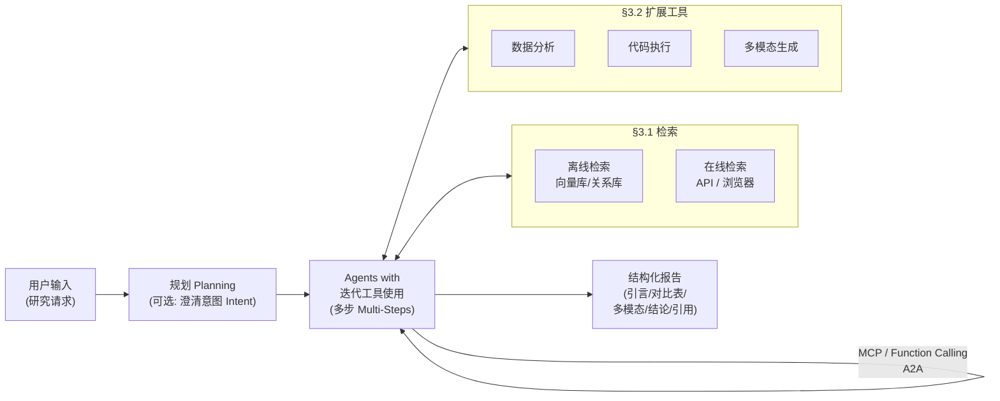
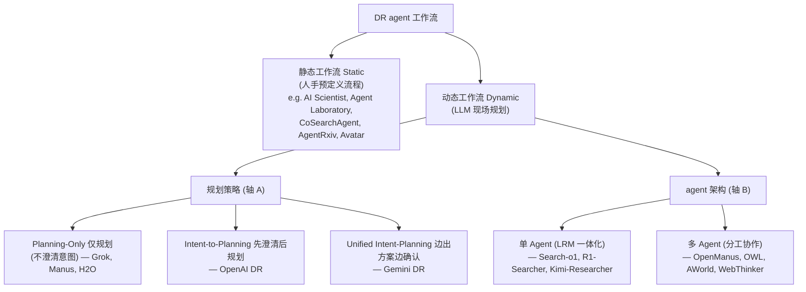

# 组会汇报 · Deep Research Agents：系统综述与路线图

> 主讲提示：这是一篇**综述**，不是一个系统。读它的目的不是学某个 trick，而是拿到一张
> **「deep research agent 的能力地图」**——五条坐标轴 + 一张把 OpenAI/Gemini/STORM/GPT-Researcher
> 等几十个系统都填进去的大表。开场先把「DR agent 是什么、和 RAG 差在哪」这一刀切清楚，全场就立住了。

---

## 1. 封面 · TL;DR

- **作者/出处**：Yuxuan Huang, Yihang Chen, Haozheng Zhang 等（利物浦大学、华为诺亚方舟实验室、牛津、UCL），arXiv 2506.18096v2，2025-09-03。配套维护一个持续更新的开源库 `github.com/ai-agents-2030/awesome-deep-research-agent`。
- **一段话**：大模型催生了一类新的自主系统——**深度研究智能体 (Deep Research agents, DR agents)**：它们以 LLM 为「认知核心」，把**动态推理 (dynamic reasoning)、自适应规划 (adaptive planning)、迭代式工具调用 (iterative tool use)** 拧成一条流水线，去做「需要多轮检索—综合—产出结构化报告」的开放式研究任务。本文系统梳理其**基础技术与架构组件**，提出一套**统一分类框架**，把代表系统填进去，再批判性地评估现有基准、列出开放问题与路线图。
- **三条带走的结论**：
  1. **DR ≠ RAG**：传统 RAG 靠**预定义流水线**做事实增强，DR agent 多了**自主性 + 持续深度推理 + 动态任务规划 + 实时交互**（§1、§3 开头）；这是全篇的立论基点。
  2. **五维能力 + 两根主轴**：DR agent 被拆成**检索 / 工具 / 工作流 / 调优 / 非参数持续学习**五大组件（§3.1–3.5）；分类法的两根主轴是**静态 vs 动态工作流**与**单 agent vs 多 agent**（Figure 4）。
  3. **瓶颈在「信息源 + 串行执行 + 评测错位」**：原文把开放问题收敛成两大类——①可达信息被「静态语料 / 公开网页」**锁死**；②**线性规划 + 单体 agent**导致执行低效（§6）。评测则普遍**用 Wikipedia 来源的 QA 题**，competitive agent 能「背答案」绕过研究流程，虚高分数（§6 Benchmark Misalignment）。

> 主讲提示：把第 1 条（DR vs RAG）当全场的「定义锚点」，第 3 条（三大瓶颈）当结尾的「路线图钩子」——开头和结尾就这样首尾呼应。

---

## 2. 问题与动机（why —— 本篇最该讲透的一节）

**领域发生了什么？** LLM 的能力沿一条清晰的阶梯往上爬（§1）：早期 GPT-3 只做**孤立任务**（问答、翻译）→ 接上外部工具后能像 WebGPT 那样**自主上网检索**→ 最近冒出一批**工业旗舰**：OpenAI DR、Gemini DR、Grok DeepSearch、Perplexity DR。这批新系统不再是「检索增强一下答案」，而是能**自己规划、动态用工具、跨多轮把信息聚合成一份带引用的报告**。综述要回答的第一个问题就是：**这类系统到底是什么、边界在哪。**

**为什么 RAG 不够、非得叫它一个新名字？**（§1、§2.2、§3 开头）这是全篇 why 的核心，必须讲透：
- **传统 RAG**（检索增强生成）：检索器从 Wikipedia / 搜索引擎拉回相关文档，生成器只**基于这些段落**作答。早期是**静态流水线**——检索一次、生成一次，处理不了复杂的多跳 (multi-hop) 查询（§2.2）。
- **Agentic RAG**：把 RAG 套进 agent 范式，加了迭代检索、自适应查询、动态工作流（如 FLARE、Self-RAG、IAG、ToC），多步推理强了不少。但它仍**受制于「预先存在或周期性更新的语料」**，对**实时、快变、长尾**信息无能为力（§2.2 末）。
- **传统工具使用 (Tool Use, TU) 系统**：严重依赖**预定义工作流**，灵活性差（§1）。
- **DR agent 的赌注**：把**动态检索 + 实时工具使用 + 自适应推理**统一进一个系统，让 agent 自主管理**复杂、演化、知识密集**的端到端研究流程（§3 开头）。一句话——

> **不是再优化检索的某一步，而是让 agent 像一个研究助理那样「自己定计划、自己上网、自己用工具核对、自己写报告」，并能在过程中随新证据改主意。**

**不做会怎样 / 为什么是现在？** 不把这条线梳理清楚，社区就会把「会调搜索 API 的聊天机器人」和「能做多阶段研究的 agent」混为一谈——评测、对比、路线全乱。而「现在」做综述的契机是：2024 下半年到 2025 年，工业界（OpenAI/Google/xAI/Perplexity/微软/阿里/月之暗面）和学术界（STORM、GPT-Researcher、AI Scientist、Agent Laboratory……）在**同一年内井喷**（见 Figure 5 的时间线），亟需一张统一地图来定位彼此。

> 主讲提示：这一节是 why 的核心。把「静态 RAG → agentic RAG → DR agent」三级跳讲清，听众就懂了「为什么要造一个新词」。强调 DR 的四个新增维度：自主性、持续深度推理、动态规划、实时交互。

---

## 3. 研究问题 / 核心 intention（形式化成一句话）

综述把「什么是 DR agent」**正式定义**为（§1 原文斜体）：

> **由 LLM 驱动的智能体，整合动态推理、自适应规划与迭代式工具使用，去获取、聚合、分析外部信息，最终为「开放式信息研究任务」产出综合性输出。**
>
> *(AI agents powered by LLMs, integrating dynamic reasoning, adaptive planning, and iterative tool use to acquire, aggregate, and analyse external information, culminating in comprehensive outputs for accomplishing open-ended informational research tasks.)*

它隐含的**研究问题**（即本综述要交付的东西，见 §1「Contribution」四条）：
1. 能不能给 DR 系统一套**统一分类框架 (unified classification framework)**？（→ Figure 4：静态/动态 × 单/多 agent × 规划策略）
2. 代表性 DR 系统在**架构、检索机制、工具调用、调优范式**上各是什么样？（→ Table 1/2/3 三张大表）
3. 现有**基准**怎么评 DR、漏了什么？（→ §5、Table 4/5/6）
4. **开放挑战与路线图**是什么？（→ §6）

**核心 intention 一句话**：给「deep research」这一支做一次**能力维度的解剖 + 系统对照 + 路线规划**，让后来者知道「这条赛道有哪几根轴、谁站在哪、下一步往哪走」。

---

## 4. 相关工作定位（它站在谁肩上、和谁不同）

综述自己的定位（§1、§2）是「站在 reasoning / RAG / 互操作协议三条线的交汇处」。下表把 DR agent 和它的三个前身/邻居做对照（综述观点，依据 §1、§2.1–2.3、§3 开头）：

| 范式 | 代表 | 检索 | 推理 | 规划 | 与 DR agent 的差别 |
|------|------|------|------|------|------|
| 大型推理模型 (LRM) | CoT [116]、SCoT [99]、Toolformer [87] | 内部知识为主 | 强（链式/结构化） | 弱 | 推理强但**内部知识静态、对快变信息不响应**（§2.1） |
| 静态 RAG | 早期 RAG [95] | 一次检索 | 弱 | 无 | **单次检索-单次生成**，处理不了多跳（§2.2） |
| Agentic RAG | FLARE [133]、Self-RAG [7]、IAG、ToC、RAG-RL [44] | 迭代检索 | 中 | 自适应查询 | 已 agent 化，但**仍困于「预存/周期更新语料」**，无实时/长尾（§2.2 末） |
| 传统工具使用 (TU) | WebGPT [73] 一类 | 工具触发 | 中 | **预定义工作流** | 流程写死、泛化差（§1） |
| **DR agent** | OpenAI/Gemini/Grok/Perplexity DR 等 | **实时检索（API+浏览器）** | **持续深度** | **动态任务规划** | **自主性 + 实时交互 + 多阶段端到端研究**（§3 开头） |

**互操作底座（§2.3，DR agent 的「管道层」）**：
- **MCP (Model Context Protocol，模型上下文协议)**：Anthropic 提出的统一通信层，让 agent 用**标准化接口**安全一致地接外部服务与数据源，解决「API 不一致、维护贵、生态割裂」的数据孤岛问题。
- **A2A (Agent-to-Agent，智能体间协议)**：Google 提出，把 agent 发现抽象成 **Agent Cards**、把任务协调抽象成 **Tasks / Artefacts**，支持去中心化的多 agent 协作。
- 两者**互补**：MCP 管「agent↔工具」的标准接口，A2A 管「agent↔agent」的协作编排，共同搭起模块化、可扩展的开放 agent 生态。

> 主讲提示：一句话概括定位——「LRM 给它脑子、(agentic) RAG 给它查资料的习惯、MCP/A2A 给它接线的插座；DR agent 把这些拼成一个能自己跑完整研究的助理」。

---

## 5. 方法总览（big picture：分类法是综述的「方法」）

综述没有「一个算法」，它的「方法」就是**分类法本身**。整篇把 DR agent 拆成**五大组件（§3.1–3.5）**，并用**两根坐标轴**组织代表系统（Figure 4）。先看组件流水线（依据 Figure 1）：

**两根坐标轴 + 三套子分类（Figure 4，这是全篇骨架）**：

**直觉**：把 DR agent 想成一支「研究小队」。**检索 (§3.1)** 是「上网/查库的腿」；**工具 (§3.2)** 是「会写代码、画图、读图的手」；**工作流 (§3.3)** 是「队长怎么排活、记没记笔记」；**调优 (§3.4)** 是「这支队伍是天生会干（prompt）还是练过（SFT/RL）」；**非参数持续学习 (§3.5)** 是「不改大脑权重、靠攒经验本变强」。

> 主讲提示：这一张分类图就是整场汇报的「目录」。建议把它先投出来，后面每讲一节就回指这张图的一个分支——听众永远知道「现在讲到地图的哪块」。

---

## 6. 符号与术语表（后文统一用）

综述公式极少（符合「综述：公式少则聚焦定义与判据」），核心是**术语**。一次性定义清楚：

| 术语 (中/英) | 含义 | 出处 |
|------|------|------|
| DR agent（深度研究智能体） | LLM 为核心、整合动态推理+自适应规划+迭代工具使用的研究 agent | §1 定义 |
| RAG（检索增强生成） | 检索外部知识库再生成答案；早期为静态单次流水线 | §2.2 |
| Agentic RAG（智能体式 RAG） | 把 RAG 套进 agent，迭代检索/自适应查询/动态工作流 | §2.2 |
| LRM（大型推理模型, Large Reasoning Model） | 经强化推理训练的 LLM，擅长 CoT/符号推理 | §2.1 |
| MCP（模型上下文协议） | Anthropic 提出的「agent↔工具」标准接口 | §2.3 |
| A2A（智能体间协议） | Google 提出的「agent↔agent」协作协议 | §2.3 |
| SE（搜索引擎, Search Engine） | DR agent 更新知识的入口，分 API 型 / 浏览器型 | §3.1 |
| TIR（工具集成推理, Tool-Integrated Reasoning） | 推理与工具调用深度交织，按中间结果自适应调整推理路径 | §6 |
| CBR（基于案例的推理, Case-Based Reasoning） | 检索-复用历史轨迹做在线适应，不更新权重 | §3.5 |
| GRPO（组相对策略优化） | 用「组内相对优势」替代价值网络的 RL 算法 | §3.4.2 |
| Static / Dynamic Workflow | 流程是「人手写死」还是「LLM 现场规划」 | §3.3.1 |
| Single- / Multi-Agent | 单个一体化 agent vs 多个分工 agent | §3.3.3 |
| GAIA / HLE / BrowseComp | 三个关键基准：通用助理任务 / 专家级多轮 / 难找信息检索 | §5 |

---

## 7. 方法细节 ① 检索：API vs 浏览器（§3.1）

**why**：DR agent 要靠**与外部环境交互**来更新知识、提升推理深度与准确性。问题是「怎么上网」有两条路，各有取舍——这决定了延迟、覆盖面、能不能读到动态内容。

**两类搜索引擎 (SE) 的对照**（依据 §3.1、Figure 2、Table 1）：

| 维度 | API 型检索 | 浏览器型检索 |
|------|-----------|-------------|
| 流程 | 构造 HTTP 请求→收 JSON/XML→抽关键信息→回传 | 启动 headless 浏览器→模拟点击/滚动→等 JS 渲染→爬 DOM→抽信息→回传 |
| 优点 | **快、高效、结构化、可扩展**、低延迟低开销 | **动态、灵活、能读非结构化与多模态**内容 |
| 短板 | 读不了深度嵌套/JS 渲染/交互组件/需登录的内容 | **高延迟、资源重、易被反爬打断、并行难** |
| 代表 | Gemini DR（Google Search + arXiv API）、Agent Laboratory（arXiv API）、AI Scientist（Semantic Scholar API 查新颖性）、CoSearch-Agent（SerpApi）、DeepRetrieval（PubMed/ClinicalTrials API） | Manus（沙箱化 Chromium、滚动到内容阈值、下载 PDF）、AutoAgent（BrowserGym）、DeepResearcher（专用 Web Browsing Agent，逐段判定是否继续）、AgenticSeek（隐身浏览器、抗反爬） |

**关键判据（why 浏览器仍不可替代）**：API 虽快，但**结构化高吞吐**的代价是够不着「客户端 JS 渲染内容 / 交互组件 / 登录墙」；浏览器能补上这块「动态与非结构化」的覆盖（§3.1）。综述据此给出**混合架构 (hybrid architecture)** 的建议——结合 API 的效率与浏览器的全面性（OpenAI DR / Grok / Gemini 虽未公开实现，强烈暗示底层用了 headless 浏览器框架）。

> 主讲提示：一句话讲清取舍——「**API 像点外卖（快、规整，但只能点菜单上有的）；浏览器像自己进厨房（什么都拿得到，但慢且容易被门卡住）**」。结论是成熟系统几乎都「两条腿走路」。

---

## 8. 方法细节 ② 工具：把 agent 武装到端到端（§3.2）

**why**：光会检索只是「读」，要做研究还得会「算、画、读图」。综述把扩展工具归为**三大模块 + 一个新边界**（Table 2 的三列）。

| 工具模块 | 作用 | 代表系统（Table 2 中 ■=具备） |
|------|------|------|
| 代码解释器 (Code Interpreter) | 推理时执行脚本：数据处理、算法验证、模型仿真。**除 CoSearchAgent 外几乎都有**，多用 Python (Aider) / Java | 绝大多数 DR agent |
| 数据分析 (Data Analytics) | 把原始检索变成结构化洞见：统计、可视化、定量评估。多数商用系统**未公开技术细节** | CoSearchAgent（SQL 查询+报告）、AutoGLM（结构化数据集分析） |
| 多模态处理与生成 (Multimodal) | 统一处理文本/图像/音视频，丰富上下文与输出。**只有一部分成熟系统**支持（学术原型常因算力高而缺席） | Manus、OWL、AutoAgent、AutoGLM、OpenAI DR、Perplexity DR、Grok DeepSearch |

**新边界：Computer Use（计算机操作，§3.2 末）**。最新一批把工具边界推向「直接操作电脑」：智谱 **AutoGLM Rumination** 用 RL + 自反思，自主操作 Web 环境、执行代码、调 API，并能接入 **CNKI、小红书、微信公众号**等「需登录认证」的资源——这正是纯浏览/搜索够不着的部分。综述点评：相比 OpenAI DR 侧重「推理 + 信息检索」，AutoGLM Rumination 在「把分析转成实际操作」上**自主性更高**。

> 主讲提示：强调「**多模态 + Computer Use 是当前分水岭**」——能不能读图、能不能登录私域操作，把「玩具 demo」和「能干活的产品」区分开了。

---

## 9. 方法细节 ③ 工作流：静态/动态 + 规划 + 单/多 agent + 记忆（§3.3，核心）

这是分类法的**主干**。逐根轴讲。

### 9.1 静态 vs 动态工作流（§3.3.1）

- **静态工作流 (Static)**：人手预定义流程，把研究拆成**固定的串行子任务**。适合**良定义、结构化**的场景。代表：**AI Scientist**（ideation→实验→报告三阶段）、**Agent Laboratory**（文献综述→实验→综合）、**AgentRxiv**（在静态基础上加 agent 间协作、共享中间成果做增量知识复用）。**短板**：泛化差——每个新任务都要专门定制流水线。
- **动态工作流 (Dynamic)**：支持**自适应任务规划**，按迭代反馈和演化上下文**实时重构任务结构**。泛化与适应性更强，适合**复杂、知识密集**的研究。

> 直觉：静态像「按 SOP 流水线作业」，动态像「老研究员见招拆招」。综述明确：**静态易实现、清晰，但限于良定义任务；动态泛化强，是 DR 的主流方向。**

### 9.2 动态工作流的规划策略（§3.3.2，轴 A —— 关键在「要不要先问清楚」）

**why**：用户的初始 prompt 往往含糊。「先不先澄清意图」直接影响最终报告对不对路。三种策略（Figure 4(2)）：

| 规划策略 | 做法 | 代表 |
|------|------|------|
| **仅规划 (Planning-Only)** | 直接拿初始 prompt 出计划，**不追问** | 多数 DR agent：Grok [124]、H2O [39]、Manus [66] |
| **意图到规划 (Intent-to-Planning)** | **先用针对性问题澄清意图**，再据澄清结果生成任务序列 | **OpenAI DR** [78] |
| **统一意图-规划 (Unified Intent-Planning)** | 由初始 prompt **先给一版方案**，再请用户确认/修订 | **Gemini DR** [33] |

> 主讲提示：这是「用户体验差异」的根。OpenAI DR 开局那几个澄清问题，本质就是 Intent-to-Planning；Gemini DR 上来先甩一份大纲让你改，就是 Unified Intent-Planning。**why 比 how 重要**——澄清意图是把「答非所问」风险前移消化。

### 9.3 动态工作流的 agent 架构：单 vs 多（§3.3.3，轴 B）

| 架构 | 机制 | 优点 | 短板 | 代表 |
|------|------|------|------|------|
| **单 Agent** | 规划+工具调用+执行**全揉进一个 LRM**（ReAct 式：推理→行动→反思循环） | **端到端 RL 优化顺畅**、推理-规划-工具一体连贯 | 对底座模型推理/工具选择**要求极高**；模块化差、难独立扩展 | Search-o1 [58]、R1-Searcher [96]、DeepResearcher、WebDancer、Agent-R1、Search-R1、Kimi-Researcher [70] |
| **多 Agent** | 多个专精 agent 协作；中心 manager 按实时反馈**分配/重分配**子任务（层次化/中心化规划） | 处理**复杂、可并行**任务，灵活可扩展 | 协调多个独立 agent 复杂，**端到端 RL 难做** | OpenManus、Manus（层次化 planner-toolcaller）、OWL（中心 manager 编排）、AWorld、Webwalker（explore-critic）、WebThinker [59] |

> 主讲提示：一句话——「单 agent 好训难扩，多 agent 好扩难训」。这条「端到端 RL 训练 vs 多 agent 协调」的张力，会在 §6 路线图里以「分层强化学习 (HRL)」的形式被提为解法。

### 9.4 记忆机制：给长上下文减负（§3.3.4）

**why**：DR 过程常做**多轮检索**，动辄几十万甚至上百万 token，超出上下文窗口。三种策略：

| 策略 | 思路 | 代表 | 代价 |
|------|------|------|------|
| **扩窗 (Expand Context Window)** | 直接把窗口做大 | Gemini（百万 token 窗口 + RAG） | 计算成本高、利用率低 |
| **压缩中间步 (Compress Intermediate Steps)** | 摘要/压缩中间推理，降 token | AI Scientist、CycleResearcher（阶段间总结）、Search-o1（"Reason-in-Documents" 文档压缩）、WebThinker（辅助模型压缩） | 损失细节，可能伤后续精度 |
| **外部结构化存储 (External Structured Storage)** | 把历史存到外部系统按需取回 | Manus/OWL/OpenManus/Avatar（外部文件系统）、AutoAgent（向量库）、Agentic Reasoning（知识图谱）、AgentRxiv（类 arXiv 仓库）、Agent-KB/Alita（共享知识库） | 数据结构设计与维护成本高 |

> 主讲提示：记忆三策略对应三种「省内存」哲学——**买更大内存（扩窗）/ 压缩数据（压缩）/ 换页到磁盘（外部存储）**。综述倾向外部结构化存储 + 知识图谱，因为语义检索效率与精度更高。

---

## 10. 方法细节 ④ 调优：从 prompt 到 SFT/RL（§3.4）

**why**：纯 prompt（参数化方法）虽能快速适配，但**性能受底座 LLM 天花板限制**、复杂任务上很快触顶（§3.4 开头、Parametric Approaches）。要突破就得 SFT / RL。综述把调优分两大范式，并在 **Table 3** 把 ~30 个系统按 `SFT / RL / 数据 / 奖励设计` 列齐。

### 10.1 SFT 优化（§3.4.1）

针对**查询构造、结构化报告生成、外部工具利用**三处做监督微调，目标是提升检索质量、抑制幻觉、做可靠的长篇证据接地生成。代表里程碑：
- **Open-RAG** [47]：用多样监督信号（retrieval/relevance/grounding/utility tokens）+ 对抗训练，提升「过滤无关信息」的能力。
- **AUTO-RAG** [131]：构造**推理接地的指令数据**，让模型自主规划检索查询、多轮交互、攒够证据再合成答案。
- **DeepRAG** [36]：**二叉树搜索**递归生成子查询，平衡「内部参数知识 vs 外部检索」，减冗余查询。
- **降数据依赖**：CoRAG [112]（拒绝采样抽检索链）、ATLAS [18]（只在专家轨迹的**关键步**上训练，显著提升泛化）。

**SFT 的根本局限**：仍**困于离线、静态检索流水线**——这正是要上 RL 的理由。

### 10.2 RL 优化（§3.4.2，重点）

**why**：RL 用**实时奖励**学「怎么形成有效查询、何时调工具」，能克服合成示范数据的分布漂移，在开放环境里更稳更自适应。

研究脉络（§3.4.2）：DeepRetrieval（优化查询生成）→ ReSearch（对检索内容自适应推理）→ R1-Searcher（精心设计奖励函数）→ Search-R1（结构化整合搜索与推理）→ **Agent-R1**（把 RL 融进**端到端**训练，自主多步任务执行+动态工具协调，是这条线的集大成）。另有 WebThinker（**DPO**，把搜索/导航/写作交织进推理）、Pangu DeepDiver（两阶段 SFT+RL 课程，引入**搜索强度缩放 SIS**，按需调检索深度与频率）。

**Table 3 读出三种 RL 实现模式**：
1. **工业闭源**（Gemini DR、Grok DeepSearch）：自研 RL，**细节不公开**。
2. **学术开源**：偏好 **GRPO** [92] / Reinforce++ [43]，**奖励透明**（多为 Rule-Outcome 规则结果奖励）。
3. **新兴混合**：SimpleDeepSearcher 用**过程奖励 (process-based reward)** + 跨 6 个 QA 数据集多任务训练。
- 底座偏好：**Qwen2.5 与 LLaMA3 家族**最常被选作 RL 起点。

**为什么是 GRPO 而非 PPO？**（§3.4.2 Reward/Policy Model）
> 直觉：PPO 要额外训一个「价值网络」来估计每步好不好，既贵又容易和策略网络打架。GRPO 改用「同一组里的相对名次」当优势信号，省掉价值网络。

记号（先定义）：**优势 (advantage)** = 某个回答比「基线」好多少；GRPO 的基线取自**同一提示下采样出的一组回答**的组内统计（组内归一化）。综述给出的经验结论：GRPO 把稀疏二元奖励变换成**跨更宽范围的连续优势**，提供更密的高奖励梯度信息；用「按推理深度/工具用法聚类的动态分组」做方差抑制；去掉独立价值网络后，**每个训练 epoch 的梯度方向冲突从 12 降到 3**，显著加速收敛、KL 散度更稳。

> 读出什么：GRPO 在「更宽奖励分布覆盖 + 更快稳定」上胜过 PPO——这解释了为什么 2025 年这批开源 DR agent 几乎清一色用 GRPO。
> 主讲提示：这是全篇少有的「带数字的方法论判据」，组会上值得展开：把「12→3 梯度冲突」当成 GRPO 受宠的硬证据。

---

## 11. 方法细节 ⑤ 非参数持续学习：不改权重也能变强（§3.5）

**why**：SFT/RL 要**改模型权重**，需要海量结构化经验数据 + 越来越复杂的训练算法，对动辄上百万 token、层次化工作流的 DR agent 是重负。**非参数持续学习 (non-parametric continual learning)** 反其道——**运行时**通过优化**外部记忆、工作流、工具配置**来变强，不碰内部权重，数据与算力开销小、适合复杂架构。

主线是 **基于案例的推理 (CBR)**：
- 从外部「案例库 (case bank)」**检索-适配-复用**结构化问题求解轨迹；与传统 RAG 不同，CBR 在**轨迹层面**操作、强调「以推理为中心的记忆组织」。
- 代表：**DS-Agent**（首个把 CBR 引入自动数据科学，近似检索复用）、**LAM**（轨迹级检索 + LLM 规划做功能测试生成）、**Agent K**（动态外部案例检索 + 奖励驱动记忆策略，实现自演化）、**AgentRxiv**（多 agent 共享中央预印本仓库，像在线更新的 arXiv）、**Kaggle Grandmaster Agent**（LLM + 模块化推理 + 持久记忆达专家级）。
- **自演化的另一来源**：动态基础设施适配——**Alita** 在运行时按任务需求**临时 provision 并配置新的 MCP 服务器**，按需扩展工具集。

> 主讲提示：把 §3.5 当成「省钱版的持续学习」——不重训，靠「攒经验本 + 现场配工具」。综述明说它**尚未获广泛关注但很有前景**，是路线图里「自演化」的技术底座（呼应 §6）。

---

## 12. 实验设置（setting / 覆盖范围 / 分类维度精确定义）

> 主讲提示：综述没有自己跑实验，它的「实验」= **梳理了多少系统、按什么维度分类、汇总了哪些基准成绩**。这一节把「覆盖面」量化清楚（硬性要求④）。

**梳理规模与时间范围**：
- **代表系统数**：综述贯穿三张大表，**Table 1 收录约 60 个 DR agent**（从 Avatar、CoSearch-Agent 一路到 MiroRL），**时间跨度 2024-02 → 2025-08**（见 Figure 5 演化时间线）。涵盖工业旗舰（OpenAI/Gemini/Grok/Perplexity/微软 Copilot/阿里 Qwen/Kimi）与学术系统（STORM、AI Scientist、Agent Laboratory、AgentRxiv、各类 *-R1/*-Searcher）。
- **三张系统对照表的维度（精确定义）**：
  - **Table 1**（检索）：`API / 浏览器`（■ 主用、▨ 次要、□ 无）× `GAIA / HLE / 其他 QA` 基准 × `底座模型` × `发布月份`。
  - **Table 2**（工具）：`代码解释器 / 数据分析 / 多模态`（■ 具备、▨ 未公开、□ 无）× `发布月份`。
  - **Table 3**（调优）：`SFT / RL`（■ 是、▨ 是但细节未知、□ 无）× `底座模型` × `训练数据` × `奖励设计`（Rule-Outcome / Process-based）× `发布月份`。

**基准评测覆盖（§5，两大类）**：
- **问答 (QA) 基准**：从简到难——SimpleQA / TriviaQA / PopQA（单跳事实）→ NQ / TELEQnA（长文/领域抽取）→ HotpotQA / 2WikiMultihopQA / Bamboogle（多跳）→ **Humanity's Last Exam (HLE)**（专家级、开放域、多学科、含多模态）。另有 **BrowseComp**（OpenAI 提出，专门**过滤掉「LLM 联网就能轻松答」的题**，逼 agent 去找难找信息）。Table 6 列出 **9 个常用 QA 数据集**的规模/领域/跳数（如 NQ 307k、HotpotQA 113k、HLE 2.5k）。
- **任务执行 (Task Execution) 基准**：
  - 通用助理类：**GAIA**（最重要，真实、人易解但 agent 难）、AssistantBench、Magnetic-One。
  - 研究/代码类：SWE-bench、MLGym、MLE-bench、MLAgentBench、ScienceAgentBench；多角色科研协作类 RE-Bench、RESEARCHTOWN。
  - GUI/具身类（未来方向）：OSWorld、WebArena、SpaBench。

---

## 13. 主要结果（关键表与数字 + 解读，别只贴数）

> 主讲提示：综述本身不产新数，但它**汇总了别人的成绩**（Table 4 QA、Table 5 GAIA）。挑能讲故事的几组。

**Table 4（QA 基准，列：Hotpot / 2Wiki / NQ / TQ / GPQA）——关键数字**：
- **Search-o1** 在 2Wiki 达 **71.4**；**SimpleDeepSearch** 在 Hotpot 达 **73.5**；**DeepResearcher** 在 NQ **61.9**、TQ **85.0**（均为该列最佳/次佳级别）；**Grok DeepSearch** 在 **GPQA 84.6**（该列最高）。
- 读出什么：**没有单一系统通吃所有 QA 列**——专攻多跳的（Search-o1）、专攻开放检索的（DeepResearcher）、闭源强推理的（Grok）各擅一摊，说明 DR 能力是**多维**的，单一分数会误导。

**Table 5（GAIA，分 Level-1/2/3 + 均分）——关键数字**：
- 测试集：**H2O.ai DR** 总均分 **79.73**（Level-1 89.25 / L2 79.87 / L3 61.22），是 GAIA 测试集的标杆；**Agent-KB** 75.42。
- 验证集：**Genspark Super Agent** 均分 **73.1**（L1 87.8）；**OWL** 69.7；**Manus** 71.4。
- 读出什么：**Level 越高（越需多步规划+工具）掉分越狠**（H2O 从 L1 的 89 掉到 L3 的 61）——印证「长程多步」仍是硬骨头。

**综述的关键定性结论（§5 末，必须强调）**：尽管进步明显，**领先 DR agent 在 HLE 与 BrowseComp 上相对人类专家仍明显偏弱**——综述点名这两个基准是「**DR 评测中最关键、最未解的挑战**」。

> 主讲提示：把「GAIA Level 越高越崩」+「HLE/BrowseComp 远未达人类」两条并讲——前者说「多步执行难」，后者说「真·难找信息 + 专家级推理难」，正好引出 §6 的两大瓶颈。

---

## 14. 消融与分析（综述视角：哪类设计贡献大）

综述没有逐部件消融，但散落着「哪种设计更优」的判据，汇总如下（均为**综述观点**，标注出处）：

- **检索**：混合（API+浏览器）> 单一（§3.1）。纯 API 够不着动态/登录内容；纯浏览器慢且脆。
- **调优**：RL > SFT > 纯 prompt（§3.4）。prompt 受底座天花板限制；SFT 困于离线静态；RL 用实时奖励最自适应。其中 **GRPO**「梯度冲突 12→3」是可量化的优势（§3.4.2）。
- **TIR（工具集成推理）的增益（§6，少有的硬数字）**：带**细粒度奖励**（不只看最终答案对错，还看**工具选择是否得当、参数是否准、推理是否高效**）的 RL 训练，让 TIR 优化的 agent 在多个基准上**性能提升 15–17%**，且对未见工具/任务泛化更好、工具调用更克制理性 [83]。
- **架构**：单 agent 训练顺、多 agent 扩展强（§3.3.3）——没有免费午餐。

> 主讲提示：把「TIR +15–17%」当成本节的金句——它是综述里**最具体的「某设计贡献多少」的量化证据**，组会上最容易被记住。

---

## 15. 局限与批判（原文承认的 + 社区质疑，诚实）

**综述自陈的开放问题（§6 + Limitation 节，按主题）**：
1. **信息源被锁死**：DR agent 困于「静态语料」或「仅公开网页」，**够不着企业软件 / 专有接口 / 订阅库**（如 Bloomberg Terminal 的实时市场情报）。解法：用 **MCP** 接更细粒度的专有工具/数据库。
2. **浏览器交互是瓶颈**：传统「人本浏览器」为视觉渲染优化，页面加载慢、元素定位脆、反爬强→高延迟、会话不稳、并行差。解法：**AI 原生浏览器**（Browserbase、Browser Use、Comet）暴露稳定结构化 DOM、显式 API 钩子、异步 headless、可并行调度几十个标签页。
3. **串行执行低效**：多数 DR agent **线性规划**（串行执行子任务）。解法：**异步并行架构（DAG 有向无环图建模任务依赖）** + **RL 训练的调度 agent**（按运行时延迟动态调执行顺序）。
4. **评测错位 (Benchmark Misalignment)**（最尖锐的一条）：现有 QA 题多采自 **Wikipedia**，内容**已嵌进底座模型参数**——competitive agent 能**直接背答案、绕过研究流程**，虚高分数。两条解法：① **BrowseComp** 这类「过滤掉可背诵题」的开放网、时效性基准；② **持续刷新的榜单**，杜绝参数化记忆刷分。更深一层：现有指标把「开放式研究」**塌缩成窄域 QA 或简陋 GUI 操作**，**没评**「结构化多模态报告（叙事+表+图+引用）」的端到端生成质量。
5. **多 agent 端到端优化难**：当前多用单 agent，逼底座同时扛规划+工具+写报告，效率与鲁棒性差；多 agent 协调难、端到端训练难。解法：**分层强化学习 (HRL)**（分层内部奖励促进 agent 间反馈传播）或专门的多阶段后训练流水线。
6. **自演化欠发达**：AgentRxiv/CycleResearcher 等只是初步，且窄聚焦于 CBR。解法沿两条线扩展：① **完整 CBR 框架**（层次化经验轨迹 + 细粒度检索）；② **自主工作流演化**（把工作流当成可变的树/图，用进化算法/自适应图优化动态改）。

**社区/批判视角（区分「综述观点 vs 系统宣称」）**：
- 工业系统（OpenAI/Gemini/Grok DR）的能力描述多来自**官方博客/发布说明**，综述如实标注「实现细节未公开 (not publicly disclose)」「强烈暗示用了 headless 浏览器」——属于**系统宣称**而非综述实测，组会引用时务必区分。
- 综述自身的 Limitation 节坦承：**跨任务泛化差、工作流不灵活、细粒度外部工具集成难、算力开销大**仍是普遍短板。

> 主讲提示：第 4 条「评测错位」是全篇最该引发讨论的批判——「**当前榜单可能在奖励『背书』而非『研究』**」。把它和 §13 的「HLE/BrowseComp 远未达人类」连起来讲，杀伤力最大。

---

## 16. 在 auto-research 版图的位置

- **它是一张「地图」而非「一个系统」**：本库其它论文多是**单个系统**（AI Scientist、co-scientist）或**单个批判**；这篇是**综述/坐标系**，用来**给所有系统定位**。读完它，再回看本库的 AI Scientist v1（2408.06292）就能一句话归类——它在本综述里属于**静态工作流 + arXiv/Semantic Scholar API 检索 + 多阶段**（Table 1/2 里 AI Scientist 行的 ■ 分布印证）。
- **与 Tool→Analyst→Scientist 阶梯的关系**：本综述聚焦的是更广义的「deep research」（含大量「问答/检索型」DR agent，偏 **Tool/Analyst** 层），而非只盯「能自定问题的 Scientist」。它的五维分类法可当作**给阶梯每一层做能力打分的量表**：检索强弱、工具广度、工作流静/动、调优深度、能否自演化。
- **承上启下**：
  - ← 上游能力来自本库的 RAG/推理/工具线（agentic RAG、ReAct、Toolformer）。
  - → 下游路线图（HRL 多 agent、DAG 异步、自演化 CBR）正对接本库的 co-scientist（多 agent 生成-辩论-进化）与 AI Scientist v2（agentic 树搜索）。
  - 与批判线（Wishful Thinking、Hidden Pitfalls）共鸣：本综述 §6「评测错位」= 批判线「自评/刷分」担忧的**评测学版本**。

---

## 17. 复现与可用性

- **不是可复现的系统，是可复用的「地图 + 清单」**：核心资产是 `github.com/ai-agents-2030/awesome-deep-research-agent`——一个**持续更新**的 DR agent 论文/系统清单（§1 摘要、Figure 4 脚注）。组会后可直接拿它做「最新系统跟踪」。
- **被它收录的系统能不能跑**：差异极大。**开源可跑**：STORM、GPT-Researcher（注：综述正文以 STORM 等学术系统入表，GPT-Researcher 属同类开源栈）、OpenManus、OWL、AutoAgent、DeerFlow、各类 *-R1/*-Searcher（多基于 Qwen2.5/LLaMA3，单/多卡可训）。**闭源仅 API/产品**：OpenAI DR、Gemini DR、Grok DeepSearch、Perplexity DR、微软 Copilot Researcher/Analyst、Qwen DR、Kimi K2——**实现细节不公开**。
- **坑**：①工业系统数据多来自官方说明，**不可当实测**；②基准成绩（Table 4/5）来自各自原文，口径未必齐；③想自建 DR agent，综述的实践含义是「**API+浏览器混合检索 + 代码/数据/多模态工具 + GRPO 训练 + 外部结构化记忆**」这套组合最稳。

---

## 18. 组会讨论问题

1. 综述把 DR 与 RAG 的根本差别定为「自主性+实时交互+动态规划」。这条界线清晰吗？**Agentic RAG 和 DR agent 到底有没有本质区别**，还是程度之差？
2. 三种规划策略里，**Intent-to-Planning（OpenAI）vs Unified Intent-Planning（Gemini）**哪种更好？是否取决于任务类型（开放探索 vs 明确交付）？
3. 「**单 agent 好训难扩、多 agent 好扩难训**」——HRL 真能两全吗？分层奖励会不会引入新的 credit assignment 难题？
4. §6 最尖锐的批判：现有 QA 基准在「奖励背书而非研究」。**BrowseComp + 持续刷新榜单**够不够堵住「参数化记忆刷分」？还能怎么设计防刷？
5. GRPO「梯度冲突 12→3」是它压过 PPO 的关键证据。这个优势在**多 agent / 长程 DR** 设定下还成立吗？
6. **TIR 带细粒度奖励 +15–17%**——细粒度奖励（工具选择/参数/效率）怎么自动化打分而不引入新的 reward hacking？
7. 综述对工业系统大量依赖**官方未公开说明**。作为读者，如何在「系统宣称」和「可验证事实」之间画线？这对综述的可信度有多大影响？
8. 「非参数持续学习/自演化」被说成省钱且有前景，但「窄聚焦 CBR」。把工作流当**可进化的图**去优化，最大的工程风险是什么？

---

## 19. 一页速记（汇报当天速览）

- **是什么**：deep research 这一支的**系统综述 + 路线图**（arXiv 2506.18096，利物浦/华为诺亚/牛津/UCL，2025-09）。定义：LLM 为核心、**动态推理+自适应规划+迭代工具**做开放式研究、产出带引用的结构化报告。
- **DR vs RAG**：RAG 靠预定义流水线；DR 多了**自主性 + 持续深度推理 + 动态规划 + 实时交互**。
- **五维能力**：①检索（API vs 浏览器，趋势=混合）②工具（代码/数据/多模态 + Computer Use）③工作流（**静态 vs 动态** × **单 vs 多 agent** × 3 种规划策略 × 3 种记忆）④调优（prompt→SFT→**RL/GRPO**，GRPO 梯度冲突 12→3）⑤非参数持续学习（CBR/自演化）。
- **代表系统**：工业=OpenAI DR(o3, Intent-to-Planning)、Gemini DR(2.0 Flash, Unified, 百万 token)、Grok DeepSearch(GPQA 84.6)、Perplexity DR、微软 Copilot、Qwen DR、Kimi K2；学术=STORM、AI Scientist、Agent Laboratory、AgentRxiv、各 *-R1/*-Searcher。规模：**Table 1 约 60 系统，2024-02→2025-08**。
- **关键数**：GAIA 测试集 H2O.ai DR 均分 **79.73**（L3 仅 61）；GPQA Grok **84.6**；TIR 细粒度奖励 **+15–17%**；HLE/BrowseComp **仍远逊人类专家**。
- **三大瓶颈/路线**：①信息源锁死→MCP 接专有工具 + AI 原生浏览器；②串行执行→DAG 异步 + RL 调度 agent；③**评测错位（背书刷分）**→BrowseComp + 持续刷新榜单 + 端到端报告质量评测；外加 HRL 多 agent、CBR 自演化。
- **一句话结论**：**「它给 deep research 画了第一张能力地图——五条轴定位所有系统，三处瓶颈指明下一步；最该记住的是『当前榜单可能在奖励背书而非研究』这记警钟。」**

> 主讲提示：结尾回到这张「地图」的价值——**这门 auto-research 课里，凡是出现一个新 DR 系统，都能用这五条轴秒速归类、用这三处瓶颈秒速体检。**

---

## 20. 自检（对照风格规范第 5 节）

- [x] **中文 + 术语首次中英对照**（DR agent / RAG / LRM / MCP / A2A / TIR / CBR / GRPO 等均给英文）。
- [x] **公式/判据前先直觉→后定义符号→再读出什么**：GRPO（§10.2，优势/组内归一化，读出「12→3 梯度冲突」）、novelty 类判据以分类法判据替代（综述公式少，聚焦定义与判据，符合规范第 4 节「综述」侧重）。
- [x] **分类法与坐标轴为核心 + 代表系统填进框架大表**：两根主轴（静/动 × 单/多）+ 3 子分类 mermaid 图；§7–11 每节配系统对照表（对应原文 Table 1/2/3）。
- [x] **setting/metrics 覆盖**：论文数（Table 1 约 60 系统）、时间范围（2024-02→2025-08）、分类维度精确定义（§12 三张表的列定义 + 9 个 QA 数据集）。
- [x] **忠于原文、标编号**：全文标注 §2.1–§7、Figure 1–5、Table 1–6；数字（GAIA 79.73 / GPQA 84.6 / TIR +15–17% / GRPO 12→3）均来自 PDF；**区分「综述观点 vs 系统宣称」**（§15 明确工业系统数据来自官方未公开说明）。
- [x] **why > how**：每节先讲动机（为何要混合检索/为何 RL>SFT/为何评测错位），再讲做法。
- [x] **PPT 风格**：小标题 + 要点 + 大表 + 2 张 mermaid（流水线 + 分类法）+ 每个二级标题配 `> 主讲提示`。
- [x] **篇幅约 20 页**（≈ 6000–9000 中文字 + 表格 + 图）。
