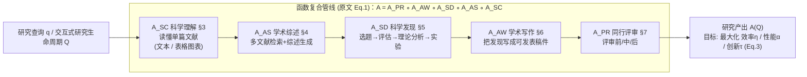

# 组会汇报 · AI4Research 综述（2507.01903）

> 主讲提示：本库其它综述大多聚焦「ML 内部的某段流程」（如 ideation、自动评审、agent 系统）。
> 这一篇是**全景地图**——它的价值不在某个 trick，而在「**用一套统一的函数复合 + 五任务分类法，把整条科研链从理解一直串到评审，再横向铺到物理/生物/社科**」。
> 读它就是为了拿到一张「坐标系」，把我们读过的所有点系统（AI Scientist、co-scientist、AutoSurvey…）各归各位。

---

## 1. 封面 · TL;DR

- **作者/出处**：Qiguang Chen, Mingda Yang, Libo Qin, …, Wanxiang Che（哈工大 LARG 等八家机构，第一作者与车万翔团队），arXiv 2507.01903，2025；配套 GitHub `LightChen233/Awesome-AI4Research`、项目页 `ai-4-research.github.io`（原文封面页）。
- **一段话**：论文提出 **AI4Research（AI 用于科研，Artificial Intelligence for Scientific Research）** 这一统称，并给出第一份**系统化综述**。它把科研全流程拆成**五大主流任务**——**科学理解 (Scientific Comprehension)、学术综述 (Academic Survey)、科学发现 (Scientific Discovery)、学术写作 (Academic Writing)、学术同行评审 (Academic Peer Reviewing)**（原文 §2、Figure 1/2），为每个任务给出**形式化定义 + 目标函数**，把代表系统填进一棵分类树，再横向展开到**自然科学 / 应用科学与工程 / 社会科学**三大学科群（§8、Figure 8），最后给出**七条未来方向**（§10、Figure 9）与一份**资源清单**（§9，Table 6–9）。
- **三条带走的结论**：
  1. **一个「函数复合」骨架统起全场**：整套系统被写成 $\mathcal{A}=A_{\text{PR}}\circ A_{\text{AW}}\circ A_{\text{SD}}\circ A_{\text{AS}}\circ A_{\text{SC}}$（原文 Eq.(1)）——理解的输出喂给综述、综述喂给发现、发现喂给写作、写作喂给评审。这是它区别于「只讲一段」的综述的核心抽象。
  2. **广度是它的最大卖点，也是最大代价**：覆盖 5 任务 × 3 学科群 × 7 前沿，引用近千篇（参考文献编号到 900+）；但**每个子任务只能点到为止**，深度上不及本库聚焦单点的专题综述（详见 §16 批判）。
  3. **它明确区分 AI4Science 与 AI4Research**（原文 Table 1）：前者瞄准「具体科学发现 + 数据分析」（材料/药物/基因，面向专家），后者是「更广的科研工作流 + 学术基础设施」（理解/写作/评审，**同时面向资深研究者与新手**）——这条区分是全篇的立论起点。

> 主讲提示：开场先把「五任务 + 一条函数复合链 + 三学科群」三件事写到白板上，后面所有内容都挂在这棵树上。

---

## 2. 问题与动机（why —— 本节讲透）

**领域缺口在哪？** 论文开篇（§1）指出：以 DeepSeek-R1、OpenAI-o1 为代表的推理大模型，在数学推理、编程、跨学科知识上已逼近甚至在某些设定下超过图灵测试水平（原文引 [354]），于是「让 AI 自主做科研」的系统井喷——从 The AI Scientist [509]（idea→实验→写作三阶段），到 Carl [332]、Zochi [12]、AgentArxiv [668]、AgentLab [669]（多 agent 模拟科研团队），再到 Swanson 等的 Virtual Lab [735]（人-AI 平台设计纳米抗体结合 SARS-CoV-2 变体）。**但缺一份系统综述去梳理「关键因素 + 最新进展」**，这阻碍了领域继续推进。

**为什么现在做、不做会怎样？** 作者在 §11（Related work）说明：已有综述大多**只覆盖「科学发现 + 学术写作」**，且常被归到 AI4Science 名下或只谈「有限的几个研究阶段」（如只谈 ideation [445]、只谈 hypothesis lifecycle [320]、只谈 LLM-driven discovery 架构 [642]）。**没有一份把「科学理解 + 学术综述 + 同行评审」也纳入、并跨学科铺开的全流程地图。** 不做的代价是：研究者无法快速定位「哪段流程已被自动化到什么程度、用什么系统、在哪个学科验证过」，重复造轮子、错失跨学科迁移。

**这篇的赌注（核心 intention）**：用**一套统一的形式化语言（任务集合 + 函数复合 + 目标函数）**，把分散在 NLP、ML、物理、化学、生物、社科里的「AI 帮科研」工作收编进**同一坐标系**，让它既是**导航图**（taxonomy）又是**资源索引**（tools/benchmarks/datasets）。一句话：

> **不是再深耕科研的某一环，而是先画一张「能放下整条科研链 + 整个学科版图」的总图，让后来者按图索骥。**

**为什么「广度」本身是论点**：作者在贡献列表（§1 末）把「Systematic Taxonomy / Emerging Future Areas / Key Applications & Resources」三项并列——**广度（cross-discipline）+ 系统性（taxonomy）+ 可用性（resources）** 正是它相对单点综述的差异化主张，也是它甘愿牺牲单点深度的原因。

> 主讲提示：这一节是 why 的核心。把「已有综述只覆盖发现+写作 / 只谈单阶段」与「本篇要补齐理解+综述+评审、并跨学科」对照讲，动机就立住了。

---

## 3. 研究问题 / 核心 intention（形式化成一句话）

把要回答的问题压成一句：

> **能否用「五个科研任务 + 一条函数复合管线 + 每任务一个目标函数」的统一框架，把「AI 用于科研」的全流程与跨学科应用，组织成一张既可导航、又可索引资源的系统地图？**

它隐含的**假设**（原文 §2.2）：(a) 五个任务**可被解耦又可串接**——既能各自定义目标、又能用 $\circ$ 复合成端到端管线；(b) AI4Science（具体科学问题）与 AI4Research（科研方法论/基础设施）虽侧重不同，但随 LLM 推理/生成能力增强，**正在融合成一个统一工作流**，AI4Science 工具越来越多地作为「可调用组件」嵌入 AI4Research 系统（原文 §2.2 末）。

---

## 4. 相关工作定位（站在谁肩上、和谁不同）

论文 §11 自我定位：承认 AI4Research/AI4Science 已有多篇综述，但**自己是唯一覆盖「全研究生命周期 + 跨学科应用 + 资源」的那一份**。下表据 §11 原文梳理（区分**被引综述的侧重** vs **本篇主张**）：

| 已有综述（原文 §11 所引） | 它们覆盖的范围 | 本篇相对它们补了什么 |
|------|------|------|
| Yu & Jin [878]；早期综述 [10,640,918,762,913] | LLM 如何变革「科学发现」 | 补齐**理解 / 综述 / 评审**三段，并跨学科 |
| Li et al. [445]；Alkan [15]、Bazgir [51] | 只聚焦 **ideation / 假设生成** | 把 ideation 放回**五任务全链**里定位 |
| Kulkarni [394]、Ren et al. [642] | LLM-driven discovery 的**架构与基准** | 不止架构，补**应用 + 资源 + 前沿** |
| Chen et al. [113]（Science-of-Science） | 从**多 agent 仿真**视角看 AI4Science | 从**研究流程**视角，且含写作/评审 |
| Huang [320]、Zhou [945]、Luo [519] | 从**假设生命周期 / 三阶段**看流程 | 扩成**五任务**且含同行评审 |
| Kim [376]、Bolanos [69]、Zhuang [956] | 聚焦**自动同行评审**单点 | 把评审接回全链上下游 |
| **本篇 AI4Research** | **理解+综述+发现+写作+评审 × 三学科群 × 七前沿 × 资源** | —— |

> 主讲提示：一句话概括——「别人各画一段路，它画了一张含全程+岔路+加油站的全国地图」。这正是它的定位：**总图 + 索引**，不是某段路的高清航拍。

---

## 5. 方法总览（big picture，先直觉后数学）

整篇的「方法」其实是**一棵分类树 + 一条复合管线**（原文 Figure 1/2）。先看 pipeline 直觉：

**直觉**：把「做研究」想成一条流水线——先**读懂**别人的论文（理解）→ **盘点**整个领域（综述）→ **想新点子并验证**（发现）→ **写成论文**（写作）→ **投出去被审**（评审）。每一段都是一个可被 AI 替代/增强的「函数」$A_i$，整条链就是这些函数的复合。关键抽象有三层：

1. **任务集合**：$\mathcal{T}=\{T_{\text{SC}},T_{\text{AS}},T_{\text{SD}},T_{\text{AW}},T_{\text{PR}}\}$（原文 §2），每个任务 $T_i$ 配一个专用模型 $A_i$。
2. **函数复合**：$\mathcal{A}=A_{\text{PR}}\circ A_{\text{AW}}\circ A_{\text{SD}}\circ A_{\text{AS}}\circ A_{\text{SC}}$（Eq.1），$\circ$ 表示「前一个的输出是后一个的输入」。
3. **目标**：对研究查询 $q$（或交互式研究生命周期 $\mathcal{Q}$），最大化三件事——效率、性能、创新（Eq.3，符号见 §6）。

> 主讲提示：强调这条链是**有方向**的（理解→…→评审），但**也支持反馈回路**（评审反馈回选题，正如 AI Scientist 的 open-ended 循环）——综述用 $\circ$ 把它画成「主干」，回路藏在各 agent 系统里。

---

## 6. 符号与术语表（后文统一用）

下表汇总原文 §2 引入的全部记号（公式见 §7 逐条展开）：

| 记号 / 术语 | 含义（原文 §2） |
|------|------|
| $\mathcal{T}=\{T_{\text{SC}},T_{\text{AS}},T_{\text{SD}},T_{\text{AW}},T_{\text{PR}}\}$ | 五个研究任务：科学理解 / 学术综述 / 科学发现 / 学术写作 / 同行评审 |
| $A_i$ | 针对任务 $T_i$ 定制的 AI 模型 |
| $\mathcal{A}=A_{\text{PR}}\circ A_{\text{AW}}\circ A_{\text{SD}}\circ A_{\text{AS}}\circ A_{\text{SC}}$ | 整个 AI4Research 系统（函数复合，Eq.1） |
| $q$ / $\mathcal{Q}$ | 单条研究查询 / 交互式研究查询生命周期 |
| $\eta(\cdot),\alpha(\cdot),\tau(\cdot)$ | 对产出评估**效率 / 性能 / 创新**的三个泛函（Eq.3） |
| $\hat{\mathcal{K}}=A_{\text{SC}}(\mathcal{K})$ | 理解后获得的知识；$D_{SC}=\{D_T,D_F,D_M\}$ = 文本/图/元数据；$f_{\text{TSC}}$ 文本理解、$f_{\text{TCSC}}$ 表图理解（Eq.4） |
| $\hat{\mathcal{S}}=A_{\text{AS}}(\mathcal{S})$ | 生成的综述；$f_{\text{Retrieval}}$ 检索 + $f_{\text{Gen}}$ 主题聚类与摘要（Eq.6） |
| $\hat{\mathcal{I}}=A_{\text{SD}}(\mathcal{I})$ | 生成并验证的科学创新；$K_{SD}=\{K_D,K_{AS}\}$ = 领域知识+上游综述知识；$f_{\text{IM}}$ 选题、$f_{\text{NSA}}$ 新颖性显著性、$f_{\text{TA}}$ 理论分析、$f_{\text{ED}}$ 实验（Eq.8） |
| $\hat{\mathcal{M}}=A_{\text{AW}}(\mathcal{M})$ | 可发表稿件；$\text{Info}_I$ = 发现阶段全部信息（含代码/数据）；$f_{\text{DWP}}$ 写前准备、$f_{\text{DMW}}$ 写作、$f_{\text{AWC}}$ 写后润色（Eq.10） |
| $\hat{\mathcal{R}}=A_{\text{PR}}(\mathcal{R})$ | 结构化评审；$f_{\text{PreP}}$ 评审前、$f_{\text{InP}}$ 评审中、$f_{\text{PostP}}$ 评审后（Eq.12） |

> 主讲提示：这张表是「看懂 §7 所有目标函数」的钥匙。组会上不必逐符号念，但要让大家知道**每个任务都被写成「输入→若干子函数复合→输出」+ 一个最大化目标**，这是综述少见的「形式化自觉」。

---

## 7. 方法细节：五任务的分类法与目标函数（核心）

> 主讲提示：综述的「方法」= 分类法。本节按五任务逐个展开**坐标轴（怎么分类）+ 目标函数（优化什么）+ 代表工作**。公式都遵循「直觉→定义符号→公式→读出什么」。

### 7.1 任务一：科学理解 AI4SC（§3）

**why**：科研第一步是**读懂单篇文献**——抽取、解释、综合其中信息，既加速人也加速下游自动分析。坐标轴（原文 Figure 3）：**文本理解 vs 表格图表理解**；文本理解再按**自动化程度**分**半自动 / 全自动**。

**目标函数（Eq.5）**——直觉：理解得好 = 抽出的知识既**逻辑自洽**又**概念覆盖全**。
记号：$\hat{\mathcal{K}}$ 抽取知识，$D_{SC}$ 原文档，$\text{Coherence}(\cdot)$ 逻辑一致性，$\text{Coverage}(\cdot)$ 概念完整度，$\mathbb{E}_{\mathcal{K}\sim A_{SC}}$ 对理解模型产出的期望。
$$\max\{\sigma\}=\max\{\mathbb{E}_{\mathcal{K}\sim A_{SC}}[\text{Coherence}(\hat{\mathcal{K}},D_{SC})+\text{Coverage}(\hat{\mathcal{K}},D_{SC})]\}$$
读出什么：理解质量 $\sigma$ 同时奖励「不自相矛盾」和「没漏概念」——这正是评判一份 AI 阅读理解好坏的两把尺。

代表分类与工作（§3.1–3.2）：
- **半自动·人类引导 (Human-Guided)**：研究者与模型迭代对话，如 **LaMAI [591]**（先反问澄清再回答）。
- **半自动·工具增强 (Tool-Augmented)**：超出模型知识/上下文时调外部工具——知识检索（**Graphusion [862]** 建科学知识图）、事实核查（**PaperQA2 [699]** 文献综述任务上匹配/超过专家、无需联网）、推理增强（**SciAgent [524]** 动态选计算器/公式评估器）。
- **半自动·自引导 (Self-guided)**：单轮深答（§3.1.1 末）。
- **全自动·摘要引导 / 自我提问与反思**：如 **SciQAG [774]**（问题生成器 + 答案评估器协作）、SciInstruct [896]（自反思标注）。
- **表格理解**：数据增强（**Table-LLaVA [936]** / MMTab）、推理范式增强（**Chain-of-Table [815]**、**Tree-of-Table [340]**、**TableMaster [88]**）。
- **图表理解**：多模态直接读图（**ChartInstruct [538]**、**ChartGemma [539]**、**FDV [865]** 把图表转结构化文本）。

### 7.2 任务二：学术综述 AI4AS（§4）

**why**：好研究始于扎实的「前期调研」。坐标轴（原文 Figure 4）：**相关工作检索 (Related Work Retrieval) → 综述报告生成 (Overview Report Generation)** 两阶段。

**目标函数（Eq.7）**——直觉：好综述 = **相关 + 覆盖广深 + 表达清晰**。
记号：$\hat{\mathcal{S}}$ 生成综述，$R_{AS}$ 综述需求，$\text{Relevance}/\text{Coverage}/\text{Clarity}$ 三项。
$$\max\{\rho\}=\max\{\mathbb{E}_{\hat{\mathcal{S}}\sim A_{AS}}[\text{Relevance}(\hat{\mathcal{S}},R_{AS})+\text{Coverage}(\hat{\mathcal{S}},R_{AS})+\text{Clarity}(\hat{\mathcal{S}},R_{AS})]\}$$
读出什么：综述质量 $\rho$ 把「切题 / 广度深度 / 可读性」三者相加——对应下方 Table 2 的三类评测指标。

代表分类（§4.1–4.2）：
- **检索三范式**：语义引导（**SPLADE V2 [213]**、**GTSLNet [514]**）、图引导（作者图/论文引用图/实体图，如 **CitationSum [518]**）、LLM 增强（单 agent **PaperWeaver [422]**、多 agent **LitLLMs [9]**、Deep Research 如 **PaSa [287]** 主动遍历引文网、**CuriousLLM [868]** 好奇心驱动提问）。
- **综述生成三步**：研究路线图谱（**CHIME [301]**、**HiReview [311]** 树状层级）、节级 related work（抽取式 vs 生成式，生成式再分人类引导/图引导/模型引导）、文档级综述（**AutoSurvey [807]**、**SurveyForge [855]**、**STORM [676]**、**SurveyX [464]**）。

**关键数据（原文 Table 2，SurveyBench，数据源 Yan et al. [855]）**——文档级综述生成三指标对比（Reference / Outline / Content 三类质量，Content 给 Avg）：

| 方法 | 模型 | Outline 质量 | Content-Avg |
|------|------|------|------|
| 人工撰写 | - | 87.62 | - |
| AutoSurvey [807] | Claude-3-Haiku | 82.18 | 73.87 |
| SurveyForge [855] | Claude-3-Haiku | 86.85 | 76.34 |
| AutoSurvey [807] | GPT-4o-mini | 83.10 | 75.05 |
| SurveyForge [855] | GPT-4o-mini | 86.62 | 77.06 |
| SurveyForge [855] | DeepSeek-v3 | **87.42** | **80.15** |

读出什么：SurveyForge + DeepSeek-v3 的 Outline 质量（87.42）已**逼近人工**（87.62），Content-Avg（80.15）为表中最高——说明文档级综述生成在「结构」上接近人类，但原文未给出与人工 Content 的直接同栏对比（人工行 Content 列为「-」）。

### 7.3 任务三：科学发现 AI4SD（§5，全篇最厚）

**why**：这是「产生并验证新假设」的环节，最接近「AI 当独立研究者」。坐标轴（原文 Figure 5）：**选题挖掘 (Idea Mining) → 新颖性与显著性评估 (Novelty & Significance) → 理论分析 (Theory Analysis) → 实验执行 (Experiment Conduction) → 全自动发现 (Full-Automatic Discovery)** 五段。

**目标函数（Eq.9）**——直觉：好发现 = **新 + 站得住 + 有影响**。
记号：$\hat{\mathcal{I}}$ 生成的创新，$\text{Novelty}$ 创新性、$\text{Validity}$ 实验与理论可靠性、$\text{Significance}$ 后续影响。
$$\max\{\delta\}=\max\{\mathbb{E}_{\hat{\mathcal{I}}\sim A_{SD}}[\text{Novelty}(\hat{\mathcal{I}})+\text{Validity}(\hat{\mathcal{I}})+\text{Significance}(\hat{\mathcal{I}})]\}$$
读出什么：发现质量 $\delta$ 同时要「新、对、重要」——单有 novelty 不够（呼应本库「novelty≠validity」批判线）。

代表分类（§5.1–5.5，挑骨架）：
- **选题挖掘三来源**：内部知识（调温度/约束 prompt 拓「idea 空间」[543]）、外部信号（外部知识 KG/引文 + 环境反馈，把 ideation 当与实验环境的交互回路）、团队讨论（AI-AI 协作如 **VirSci [720]** 虚拟研究团队、**Chain-of-Ideas [435]** 把文献排成历史链；人-AI 协作如 **Scideator [626]** 选 facet 重组、**IRIS [228]**）。⚠ 原文 §5.1.3 末引 [396] 警示：LLM 辅助短期提创意，但长期**可能削弱人类独立创造力**（同质化效应）。
- **新颖性&显著性三法**：传统（**SAPPhIRE [692]** 因果本体量化新颖度、Wang [782] 用「surprise」即论文词分布 vs 模型分布的差异）、LLM 增强（**GraphEval [207]** 把推理拆成可解释 viewpoint 节点）、人-AI 协作（纯 LLM 评新颖**会高估、致同质化**，故需人介入）。
- **理论分析四件**：科学主张形式化（自然语言→可验证模板，**PCFG 框架 [221]**）、证据收集（**SciClaims [580]** 抽取+检索+验证一体）、验证分析（**HiSS [911]**、**ProToCo [891]** 多线索校验；GX-Chen [271] 指 LLM 继承训练数据的推理启发式偏差，提推理时缩放采样降隐含因果假设）、定理证明（**LEGO-Prover [779]** 增长库、**Lean Copilot [706]**、**DeepSeek-Prover [846]** 合成数据微调）。
- **实验执行**：实验设计（半自动如 **Arlt et al. [25]** 自动生成量子实验协议；全自动如 **Liu et al. [487]** 端到端 generative-agent、**Roohani [651]** 基因扰动 biodiscovery agent，超传统贝叶斯方法）、预实验估计（评估式预测 / 探索式预测，**DeepMind GNoME [41]** 预测约 38 万个稳定材料结构、Wen et al. [822] 微调 GPT-4.1+检索 agent **超过 25 位人类专家**）、实验管理（「自驱动实验室」，开环 vs 闭环，**Functional Genomics Explorer [381]** 首个全自主研究平台；报道称此类系统可把「材料发现 20 年、1 亿美元」压缩到数月）、实验执行（AutoML 如 **AIDE [176]** 树搜索拿 Kaggle 铜牌、多 agent 如 **MechAgent [567]**、外部工具如 **ChemCrow [520]**/**Crispr-GPT [316]**）、实验分析（自动评测指标 / 理论一致性如 **AutoReproduce [929]** / 探索式分析 **HeLM [62]**）。

**关键数据（原文 Table 4，ScienceAgentBench，数据源 Chen et al. [127]）**——全自动发现能力，分「无知识 / 有知识」两栏，指标 SR（成功率）/CBS / VER / Cost↓：

| 框架 | 模型 | SR(无知识) | SR(有知识) |
|------|------|------|------|
| Direct Prompting | Claude-3.5-Sonnet | 17.7 | 21.6 |
| Direct Prompting | o1-preview | **34.3** | 31.4 |
| OpenHands CodeAct | Claude-3.5-Sonnet | 21.6 | 24.5 |
| OpenHands CodeAct | o1-preview | 33.4 | 35.3 |
| Self-Debug | o1-preview | **42.2** | 41.2 |

读出什么：即便最强 o1-preview + Self-Debug，全自动发现成功率也只到 **~42%**——说明**端到端自动科研离可靠还远**（呼应 §5.4 引 Zhu et al. [951]：当前 AI scientist 缺严格实验的验证能力）。另原文亮点：**Zochi [12]** 产出的论文已被 **ACL 2025** 接收（§5.5 末）。

**LiveIdeaBench 选题打分（原文 Table 3，数据源 Ruan et al. [658]）**——五维（Fluency/Feasibility/Clarity/Originality/Flexibility）平均分，挑代表模型：

| 模型 | Feasibility | Originality | Average |
|------|------|------|------|
| DeepSeek-R1 | **6.52** | **7.84** | **7.18** |
| Claude-3.7-Sonnet | 5.46 | 7.81 | 7.12 |
| Gemini-2.0-Flash-Exp | 6.02 | 7.37 | 7.18 |
| o1 | 5.88 | 7.23 | 6.61 |
| GPT-4o | 5.58 | 7.64 | 6.69 |

读出什么：推理模型 **DeepSeek-R1** 在 idea 生成上综合最强（Average 7.18，Feasibility/Originality 双高）；注意 **Originality 普遍 >7 但 Feasibility 多在 5–6**——AI 的点子「够新但未必可行」，正是「novelty≠feasibility」的量化证据。

### 7.4 任务四：学术写作 AI4AW（§6）

**why**：科研产出是**可交流的稿件**而非一堆数字。坐标轴（原文 Figure 6）：**半自动 (Semi-Automatic) vs 全自动 (Full-Automatic)**；半自动再按**写前准备 / 写作中 / 写后完成**三阶段。

**目标函数（Eq.11）**——直觉：好稿件 = **逻辑连贯 + 可读 + 合规**。
记号：$\hat{\mathcal{M}}$ 稿件，$\text{Consistency}$ 逻辑流/内部一致、$\text{Readability}$ 语言清晰、$\text{Compliance}$ 符合格式与风格。
$$\max\{\omega\}=\max\{\mathbb{E}_{\hat{\mathcal{M}}\sim A_{AW}}[\text{Consistency}(\hat{\mathcal{M}})+\text{Readability}(\hat{\mathcal{M}})+\text{Compliance}(\hat{\mathcal{M}})]\}$$
读出什么：写作质量 $\omega$ 把「连贯 / 可读 / 合规」三者相加——比单看语法更接近「能不能投出去」。

代表分类（§6.1–6.2）：
- **写前准备**：标题生成优化（生成 5–10 个候选按新颖/复杂/影响打分 [63]）、整体逻辑结构引导。
- **写作中**：画图（**FigGen [646]**、SVG/tikz 直接生成 [54]，**SciCapenter [302]** 生成多候选图注打分）、公式转写（ViT 把手写/图片公式转 LaTeX [732]，**Jiang et al. [345]** 迭代对照原图纠错）、引文推荐与集成（**ScholarCopilot [813]** 实时检索 token 嵌引用、**PaSa [287]** 超过 Google+GPT-4o）。
- **写后完成**：语法纠错、表达与逻辑修订（自引导 / 人引导 / 人在环，**OverleafCopilot [821]** 浏览器扩展实时润色）。
- **全自动写作**：多 agent + 自反馈，如 **The AI Scientist [509]**（把评审当 pipeline 模块打分改稿）、**Agent Laboratory [669]**、**Zochi [12]**、加 VLM 看图的 **AI Scientist-v2 [854]**。原文 §6.2 末诚实指出：**尚无系统完全去掉人类编辑，尤其在「引用正确性」上**。

### 7.5 任务五：学术同行评审 AI4PR（§7）

**why**：有效的科学共同体靠**评审**自我筛选；评审却苦于延迟、工作量、稿量暴涨。坐标轴（原文 Figure 7）：**评审前 (Pre-Review) → 评审中 (In-Review) → 评审后 (Post-Review)** 三阶段。

**目标函数（Eq.13）**——直觉：好评审 = **判断对 + 反馈有用 + 与标准一致**。
记号：$\hat{\mathcal{R}}$ 评审，$\hat{\mathcal{M}}$ 稿件，$\text{Correctness}$ 正确反映优劣、$\text{Helpfulness}$ 反馈深度与建设性、$\text{Consistency}$ 与评审标准/领域规范一致。
$$\max\{\theta\}=\max\{\mathbb{E}_{\hat{\mathcal{R}}\sim A_{PR}}[\text{Correctness}(\hat{\mathcal{R}},\hat{\mathcal{M}})+\text{Helpfulness}(\hat{\mathcal{R}},\hat{\mathcal{M}})+\text{Consistency}(\hat{\mathcal{R}},\hat{\mathcal{M}})]\}$$
读出什么：评审质量 $\theta$ 把「对 / 有用 / 合规」相加——这也是 Table 5 用「focus 相似度 + 文本相似度」去逼近的目标。

代表分类（§7.1–7.3）：
- **评审前**：Desk-Review（**AnnotateGPT [171]** 生成标注助编辑快速判断；Elsevier EVISE、IEEE Manuscript Central、Springer SNAPP、Nature AI triage）、Reviewer Matching（整数规划 [100]、共享隐空间嵌入 [99]、COI 利益冲突检测、**LCM [428]** 大会匹配、跨学科组队 [217,13]）。
- **评审中**：Peer-Review 生成（打分预测 / 评论生成 / 统一生成，单 agent vs 迭代精化 vs 多 agent 如 **MARG [159]**、**AgentReview [351]**；**CycleResearcher [825]**、**TreeReview [98]** 用 RL）、Meta-Review 生成（**PeerArg [723]** 多方论证框架降偏见、**MetaWriter [728]** 抽关键论点、**ContraSciView [397]** 检测评审间矛盾）。
- **评审后**：影响力分析（**HLM-Cite [277]** 两阶段检索+重排预测引用、Zhao et al. [926] 用标题摘要回归预测影响、解冷启动）、推广增强（**P2P [731]** 自动生成学术海报、Markowitz [534] GPT-4 写 lay summary **语言简洁度超人**、**SciTalk [593]** 多 agent 生成科普视频）。

**关键数据（原文 Table 5，数据源 Shin et al. [682]）**——专家 vs LLM 评审对比：focus 相似度（KL 散度↓、Overall/Strength/Weakness F1）+ 文本相似度（ROUGE-L/BERTScore/BLEU-4）：

| 模型 | KL 散度↓ | Overall F1 | BERTScore |
|------|------|------|------|
| GPT-4o-mini | **0.081** | 0.344 | 0.883 |
| GPT-4o | 0.082 | 0.348 | 0.885 |
| o1 | 0.097 | 0.355 | 0.869 |
| DeepSeek-R1 | 0.120 | **0.373** | 0.874 |
| GPT-4o-Finetuned | 0.022 | 0.306 | 0.882 |
| MARG [159] | 0.113 | 0.346 | 0.854 |

读出什么：微调后 GPT-4o（KL 0.022）与专家 focus 分布最接近，但 **Overall F1 仍只 ~0.3**——AI 评审能模仿「评审关注点的分布」，**却难精确命中具体优缺点对**。原文 §7.2.1 还引 Shin et al. [682] 一条要害发现：现成 LLM 评审**偏重技术效度、轻视新颖性**（与人类评审侧重不同）。

---

## 8. 跨学科应用：广度优势的集中体现（§8，Figure 8）

> 主讲提示：这是本篇相对「ML-only」综述最不同的一块——它把上面五任务**横向铺到三大学科群**。组会上重点讲「同一套 AI4Research 能力，如何在不同学科落地」。

| 学科群 | 子领域 | 代表方向与系统（原文 §8） |
|------|------|------|
| **自然科学**（§8.1） | 物理 | 物理世界仿真（**PINNs [631]**、Hamiltonian/Lagrangian NN 守恒量约束）；自动定律发现（**AI-Newton [196]** 自主推导牛顿定律/守恒律、**LLM-Feynman [709]** 符号回归出可解释表达式） |
|  | 生物医学 | 蛋白发现（**AlphaFold 2 [355]** 原子级精度、**AlphaFold 3 [2]** 扩散架构预测复合物）；细胞基因建模（**Roohani [651]** agent 设计实验）；药物发现（多 agent **DrugAgent [495]**、药物重定位在 800 万患者库模拟 1000+ 试验找 14 个候选 [420]）；临床诊断（LLM 达执照考试水平、**Agent Hospital [195]** 模拟） |
|  | 化学材料 | 自动分析（**MEGNet [102]** 图网络达 DFT 精度、Szymanski [737] 机器人 17 天发现 41 种新无机材料）；自动发现（闭环机器人化学家、Zhu [952] 在火星陨石样本上做催化剂优化）；全人-AI 流程管理（**AILA [531]** 嵌 AFM 工作流） |
| **应用科学与工程**（§8.2） | 机器人控制 | 自主设计优化（**OptoMate [766]** 云端光学实验室）；端到端视觉控制（Guided Policy Search [426]、域随机化 [758]）；Sim-to-Real 鲁棒与安全；多任务多 agent 控制 |
|  | 软件工程 | 代码生成（**Codex [106]**/CodeGen [571]）；端到端软件开发（**ChatDev [615]**、**HyperAgent [599]**、Experiential Co-Learning [614]） |
| **社会科学**（§8.3） | 社会学 | AI 辅助实验与访谈（**MimiTalk [484]** 自动访谈、Manning [532] 结构因果模型自动验证社科假设）；大规模社会现象仿真（多 agent 文化演化 [890]、GPT 三模块框架在 319 个经济实验上预测一致 [121]）。⚠ 潜在风险：LLM 在社科**能预测效应方向、却难可靠预测量级** [532]，存系统性偏差 [512] |
|  | 心理学 | 实验工作流自动化（**RAISE pipeline [890]** 自动生成验证视觉刺激、全自动在线 RCT 1193 人复现 8 个经典假设 [141]、GPT-4 模拟 154 个经典实验复现 76% 主效应但 71.6% 出意外显著结果 [733]）；人-AI 信任与安全设计（Chandra [96] 提 19 类风险 AI 行为 + 21 类负面心理影响的分类法）；心理干预（Therabot RCT 显著降症状 [289]、Friend 危机支持效果媲美面对面 [712]） |

> 主讲提示：可挑两三个「最反直觉的数字」讲——AlphaFold 改变结构生物学、机器人 17 天发现 41 种材料、AI 在 800 万患者库里模拟千次试验。这些正是「广度地图」上最亮的几个点，但**注意区分「综述转述的被引成果」与「综述自身的判断」**。

---

## 9. 资源清单：综述的「索引」价值（§9，Table 6–9）

论文 §9 给出按五任务组织的**工具 / benchmark / 数据集**索引，这是它作为「Awesome 列表」的实用面：

| 任务 | 代表 benchmark / 数据集（原文 §9） | 代表工具（原文 Table 6/7/8/9） |
|------|------|------|
| 科学理解（§9.1） | ScienceQA、SciBench、TheoremQA [115]、M3CoT、SPIQA、MultimodalArxiv；图表 ChartQA/CharXiv/TableBench | SciSpace Copilot、Elicit、Scholarcy、PDFMathTranslate |
| 学术综述（§9.2） | Cochrane、MSLR 2022、MS²、OARelatedWork；评测 SciReviewGen、**SurveyBench [855]**、AutoSurvey、SurveyX、SurveyEval [786] | Semantic Scholar、Research Rabbit、Connected Papers、Scite.ai、Consensus |
| 科学发现（§9.3） | **LiveIdeaBench [658]**、ResearchBench、HypoGen、BLADE [257]、OAG-Bench（10 任务/20 数据集/70+ 基线）、**ScienceAgentBench [127]**、**DiscoveryBench [529]**（264 真实+903 合成任务/6 域）、DiscoveryWorld、Curie [384] | AgentLabs、AutoGPT、OpenDevin、AI-Scientist/Zochi、ChatGPT/Claude/Gemini |
| 学术写作（§9.4） | MoDeST、LLM-Rubric、FigGen、CITEWORTH、CiteBART、ScholarCopilot、FutureGen [35]、AWE/AAAR-1 | EndNote、Mathpix Snip、Writefull/Grammarly/Overleaf Copilot |
| 同行评审（§9.5） | ReviewCritique、PeerRead、NLPeer、ReviewMT、MOPRD、PeerArg、AAAR-1、ORB；AI 评审检测 AI-Peer-Review-Detection-Benchmark [882]、TRIED [492] | （评审多以 benchmark 与框架为主） |

> 主讲提示：这张表是论文的「带走即用」部分。要做某段流程时，可直接来这查「有哪些 benchmark 能评、哪些工具能用」。这是综述区别于 idea 论文的**长尾价值**。

---

## 10. 七条未来方向（§10，Figure 9）

论文 §10 给出七个前沿，每条都点出**两难/核心挑战**（this is the "frontier" 的真正信息量）：

| 方向（原文 §10.x） | 核心主张 | 关键张力 / 挑战 |
|------|------|------|
| 1 跨学科 AI 模型（10.1） | 用基础模型 + 图模型打通多领域知识流 | **异构数据融合** + **跨域知识迁移**（异构设定下负迁移持续） |
| 2 伦理与安全（10.2） | 公平训练 / 免训练去偏 / 建伦理框架 | **性能 vs 公平** 张力；**AI 抄袭**致「剽窃奇点」；text-similarity 匹配可被串通操纵评审 |
| 3 协作式 AI（10.3） | 协作 agent + 联邦学习/分布式建模 | **交互复杂度**（三失败模式：失调/冲突/合谋）+ **隐私 vs 可及性** |
| 4 可解释与透明（10.4） | 白盒（看内部 circuit）+ 黑盒（看推理轨迹）分析 | **缺标准化框架** + **透明-性能权衡**；novel 输出究竟是真发现还是已有数据重组 [477] |
| 5 动态实时实验（10.5） | Agentic 实时 AI + 自驱动实验室协调 | **异构设备可靠集成** + **低延迟决策与动态优化**（毫秒级摄取多传感数据） |
| 6 多模态整合（10.6） | 严格多源数据摄取 + 人在环精修 | **跨模态数据/标注稀缺** + **跨模态不确定性量化** |
| 7 多语言整合（10.7） | 术语对齐 + 均衡多语性能 | **能力 vs 覆盖**（语言广度不能牺牲研究深度）+ **跨语言学术修辞保真** |

> 主讲提示：这一节最适合引出组会讨论。每条「未来方向」其实都对应本库的一条批判线（安全/合谋→对齐；可解释→「真发现 vs 重组」；多语言→长尾公平）。

---

## 11. 实验设置与「setting/metrics」精确定义（综述视角）

> 主讲提示：综述没有自己的实验，但它**汇编了多个 benchmark 的设定与指标**。本节把「论文覆盖了多少、用什么维度分类、引用了哪些评测」讲清，对应风格规范的「setting/metrics 写全」。

- **覆盖规模**：参考文献编号到 **900+**（正文末参考文献起于 page 49，编号见正文如 [958]）；横跨 **5 任务 × 3 学科群（自然/应用/社会）× 7 前沿方向**；资源表 Table 6–9 罗列数十个工具与数十个 benchmark。
- **分类维度（taxonomy 的坐标轴）**：
  - 顶层：**五任务**（理解/综述/发现/写作/评审）。
  - 每任务的二级轴各不同：理解=「文本 vs 表图」×「半自动 vs 全自动」；综述=「检索 vs 生成」；发现=「选题→评估→理论→实验→全自动」五段；写作=「半自动（写前/中/后）vs 全自动」；评审=「前/中/后」。
- **被汇编的核心评测（区分「综述自身 vs 被引 benchmark」）**：
  - **SurveyBench [855]**（Table 2）：Reference/Outline/Content 三类质量，含 Input Cov.（检索论文与基准引用的重叠）、Reference Cov.（引用与基准的对齐）。
  - **LiveIdeaBench [658]**（Table 3）：Fluency/Feasibility/Clarity/Originality/Flexibility 五维打分。
  - **ScienceAgentBench [127]**（Table 4）：SR（成功率）/CBS/VER/Cost，分「有/无知识」。
  - **Shin et al. [682]**（Table 5）：focus 相似度（四类 focus 分布的 KL 散度 + Overall/Strength/Weakness F1）+ 文本相似度（ROUGE-L/BERTScore/BLEU-4）。
- **注意**：以上**所有数字均为综述转引**（Table 2 源 Yan et al. [855]、Table 3 源 Ruan et al. [658]、Table 4 源 Chen et al. [127]、Table 5 源 Shin et al. [682]），论文自身**未跑新实验**——这是综述类文章的常态，引用时务必标「数据源自原作」。

---

## 12. 主要结论（论文的「读出什么」）

把全篇的判断提炼为几条（区分**综述观点** vs **被引证据**）：

1. **综述观点**：AI4Research 可被统一为「五任务 + 函数复合 + 三目标（效率/性能/创新）」（§2、Eq.1/3），且 AI4Science 正作为可调用组件融入 AI4Research（§2.2）。
2. **被引证据·能力上限**：文档级综述结构逼近人工（Table 2，87.42 vs 87.62），但全自动发现成功率仅 ~42%（Table 4），AI 评审 Overall F1 仅 ~0.3（Table 5）——**「写/综述」比「发现/评审」成熟**。
3. **被引证据·里程碑**：AlphaFold 2/3 改变结构生物学（§8.1.2）；Zochi 论文被 ACL 2025 接收（§5.5）；机器人 17 天发现 41 种新材料（§8.1.3）——**单点突破已出现，但分布在不同学科、未连成可靠的端到端链**。
4. **综述观点·能力短板**：AI 的 idea「够新但未必可行」（Table 3，Originality≫Feasibility）；AI 评审偏技术效度、轻新颖性（§7.2.1 引 [682]）；社科预测「能判方向、难判量级」（§8.3.1 引 [532]）。

---

## 13. 局限与批判（诚实，含原文承认 + 社区视角）

**原文自陈/明示的局限（散落各节）**：
- **全自动发现尚不可靠**：§5.4 引 Zhu et al. [951] 直言 AI scientist 缺严格实验所需的验证能力；Table 4 成功率仅 ~42% 佐证。
- **写作仍离不开人**：§6.2 末明说**无系统完全去掉人类编辑，尤其引用正确性**。
- **AI 评审有系统性偏差**：§7.2.1 引 [682]，偏技术效度、轻新颖性，且 Tyser [765] 指出存在 score inflation/overconfident。
- **创造力的长期反噬**：§5.1.3 引 [396]，LLM 辅助短期提创意但**长期削弱人类独立创造力**（同质化）。
- **社科能力受限**：§8.3.1 引 [532][512]，难预测效应量级、存系统性偏差。
- **七大前沿即七大未解张力**：§10 每条都点出尚未解决的核心矛盾（性能 vs 公平、透明 vs 性能、能力 vs 覆盖…）。

**社区/方法学视角的质疑（本库读者应补的批判）**：
- **「广度换深度」的固有代价**：每个子任务通常只 1–2 段、点到代表系统为止；想真正动手做某段流程，仍需回到该段的专题综述/原论文。**它是「地图」不是「教程」**。
- **分类法的边界模糊**：五任务用 $\circ$ 串成线性链，但真实科研是**强反馈循环**（评审反哺选题）；线性复合（Eq.1）对回路的刻画偏弱。
- **目标函数是「形式化包装」而非可优化对象**：Eq.5/7/9/11/13 里的 Coherence/Novelty/Helpfulness 等都**没给可计算定义**，更像「该优化什么」的概念声明，不能直接拿来训练或评测——这是综述形式化的常见局限，需明示。
- **数字全为转引**：所有 benchmark 数字来自被引原作，综述未独立复现，**横向可比性存疑**（不同表的模型/设定不一致，不能跨表直接比）。

> 主讲提示：把「广度换深度」这条单独强调——它不是缺点，是**定位选择**。要让组里明白：这篇当**索引和坐标系**极好，当**某段流程的实现指南**则不够，得顺着它给的引用往下挖。

---

## 14. 在 auto-research 版图的位置

- **它是本库的「总目录 / 坐标系」**：本库其它论文几乎都能在它的五任务树上找到位置——
  - **AI Scientist (2408.06292)** = AI4SD 全自动发现（§5.5）+ AI4AW 全自动写作（§6.2）+ AI4PR 评审中（§7.2），被本篇多次当 landmark 引（[509]）。
  - **AI Scientist-v2 [854]**、**co-scientist**、**Zochi [12]**、**Agent Laboratory [669]** 都落在「§5.5 全自动发现 + §6.2 全自动写作」。
  - **AutoSurvey/SurveyForge/STORM** 落在 §4.2 文档级综述（且本篇 Table 2 给了它们的对比数）。
- **与本库其它综述的关系（广度 vs 深度光谱）**：
  - 本篇 = **最广端**（5 任务 × 3 学科 × 7 前沿），但每点浅。
  - 聚焦 ML/ideation/自动评审的专题综述 = **较深端**，但只覆盖链条一段。
  - 两者**互补**：先用本篇定位「我在科研链的哪一段、该读哪条引用」，再切到专题综述/原论文深挖。
- **阶梯定位（Tool→Analyst→Scientist）**：本篇本身是**地图，不参与阶梯**；但它给的 benchmark（ScienceAgentBench ~42%、评审 F1 ~0.3）正好量化了「为什么自称 Scientist 的系统多数实测仍在 Analyst 段」——可与本库 9.1/9.5 模块互证。

---

## 15. 复现与可用性

- **是否开源**：论文本体是综述，无代码；但配套 **GitHub `LightChen233/Awesome-AI4Research`** 与项目页 `ai-4-research.github.io`（封面页给出），维护其引用与资源清单。
- **「能不能在单卡跑」**：不适用（无模型训练）。其价值是**查阅式**——把 §9 的 Table 6–9 当「按任务索引的工具/benchmark 速查表」。
- **坑**：①所有数字需回溯被引原作核对，勿跨表直接比较；②分类树是「一种」组织方式，遇到强反馈/跨任务系统（如同时做发现+写作+评审的 AI Scientist）需自行判断主归类；③引用编号极多（900+），定位某条主张时建议直接按正文 § 号 + 引用号去 GitHub 清单查原文。

---

## 16. 组会讨论问题

1. 论文用线性函数复合 $\mathcal{A}=A_{\text{PR}}\circ A_{\text{AW}}\circ A_{\text{SD}}\circ A_{\text{AS}}\circ A_{\text{SC}}$（Eq.1）刻画科研链，但真实科研有强反馈（评审反哺选题）。**如果改写成带回路的不动点 / 循环形式，会改变哪些结论？** 哪些系统其实是「环」而非「链」？
2. Eq.5/7/9/11/13 的目标里 Coherence/Novelty/Helpfulness 都没给可计算定义。**这套「形式化」到底带来了什么——是真约束，还是漂亮的概念包装？** 能不能把其中一个落成可评测指标？
3. 三张能力表给出「写/综述成熟（~87 接近人工）、发现/评审不成熟（~42% / F1~0.3）」。**这个梯度是「任务本质难度」还是「评测设计/数据」造成的？** 怎么设计实验区分？
4. 本篇 vs 本库某篇「ML-only 深度综述」：**同一个子问题（如自动评审），两者给你的信息量差在哪？** 什么场景该读哪一篇？
5. §5.1.3 引 [396]：LLM 辅助短期提创意、长期削弱人类独立创造力。**这对「AI4Research 该做成 copilot 还是 autopilot」意味着什么？** 怎么用实验检验长期效应？
6. §10.2 提到 text-similarity 评审匹配可被「串通环」操纵、AI 致「剽窃奇点」。**当 AI 同时写论文又评论文，怎么从机制上防自评/合谋？**
7. 它把 AI4Science 当「可调用组件」融入 AI4Research（§2.2）。**这个「融合」叙事成立吗？** 物理/化学的湿实验闭环，和 NLP 的写作/评审，真能用同一套抽象统起来吗？
8. 跨学科应用（§8）里最亮的几个数字（AlphaFold、17 天 41 种材料、800 万患者模拟千次试验）**全是被引成果**。综述把它们并列，是否会造成「全流程都很成熟」的错觉？该如何在汇报时如实区分？

---

## 17. 一页速记（汇报当天速览）

- **是什么**：第一份**全流程 + 跨学科**的 AI4Research 系统综述；把科研拆成**五任务**（理解→综述→发现→写作→评审），形式化为函数复合 $\mathcal{A}=A_{\text{PR}}\circ A_{\text{AW}}\circ A_{\text{SD}}\circ A_{\text{AS}}\circ A_{\text{SC}}$（Eq.1），目标 = 最大化效率/性能/创新（Eq.3）。
- **结构**：§2 定义 + AI4Science/AI4Research 之辨（Table 1）→ §3–7 五任务分类法 + 各自目标函数（Eq.5/7/9/11/13）+ 代表系统 → §8 三学科群应用（Figure 8）→ §9 资源索引（Table 6–9）→ §10 七前沿（Figure 9）。
- **关键数（均为转引）**：文档级综述 Outline 87.42 逼近人工 87.62（Table 2）；idea 五维最高 DeepSeek-R1 7.18，Originality≫Feasibility（Table 3）；全自动发现 SR 最高 ~42%（o1-preview+Self-Debug，Table 4）；AI 评审 Overall F1 ~0.3、微调后 focus-KL 0.022（Table 5）。
- **里程碑（转引）**：AlphaFold 2/3、Zochi 论文中 ACL 2025、机器人 17 天发现 41 种新材料。
- **三句话结论**：① 一套「五任务 + 函数复合」骨架统起 AI for science 全场；② 广度是卖点也是代价——是地图不是教程；③ 写/综述已近人，发现/评审仍远，跨学科突破已现但未连成可靠端到端链。
- **在课里的位置**：本库的**总目录与坐标系**——先用它定位「我在科研链哪一段、该读哪条引用」，再切专题综述/原论文深挖。

> 主讲提示：结尾回到一句话——**「它给了我们一张能放下整条科研链和整个学科版图的地图；但地图不是路本身，真要走某段路，得顺着它标的引用往深里挖。」**
