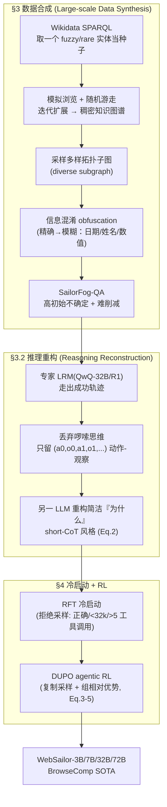

# 组会汇报 · WebSailor：把开源 Web Agent 训到「超人类」推理

> 主讲提示：本篇属于主题组 D（Deep Research）。一句话钩子——
> **「BrowseComp 上开源模型几乎全军覆没（准确率近 0），而 OpenAI DeepResearch 能到 50+。WebSailor 说：差距不在模型大小，而在一种开源模型从没被教过的推理模式——系统性地削减极端不确定性。补上这一课，72B 开源模型就能从 0 干到 30。」**
> 全场记忆锚点：**BrowseComp-zh 0.6%(开源旧 SOTA) → 30.1%(WebSailor-72B)，逼近闭源 Doubao 26.0 / DeepResearch 42.9**；核心三件套 = **SailorFog-QA + 推理重构冷启动 + DUPO**。

---

## 1. 封面 · TL;DR

- **标题**：WebSailor: Navigating Super-human Reasoning for Web Agent
- **作者/机构**：Kuan Li、Zhongwang Zhang、Huifeng Yin 等（共同核心作者 + 项目负责人），通讯作者 Huifeng Yin、Yong Jiang。**Tongyi Lab, Alibaba Group**，2025-07，arXiv 2507.02592。代码：`github.com/Alibaba-NLP/WebAgent`。
- **权威性来源**：阿里**通义**大厂出品，与 WebDancer / WebWalker 同属 `WebAgent` 系列；底座是自家 **Qwen-2.5**（3B/7B/32B/72B 全家桶）；在 OpenAI 主推的高难基准 **BrowseComp-en/zh** 上给出**开源新 SOTA**，并首次让开源 agent 在中文 BrowseComp 上与闭源产品**打平**（见原文 Fig.1 / Table 1）。

**这篇在干什么（一段话）**：作者认为，闭源 DeepResearch 之所以能在 BrowseComp 这种「在浩瀚信息里找一根针」的任务上达到**超人类**水平，靠的是一种开源模型普遍缺失的推理模式——**在高度不确定的信息地形中，系统性地、一步步把不确定性降下来**。WebSailor 是一整套**后训练方法论 (post-training methodology)**，目标就是把这个能力**灌进**开源模型：① 用随机游走在真实网站上构图、采子图、再做**信息混淆 (obfuscation)**，合成「天生高不确定、且难以削减」的 QA（**SailorFog-QA**）；② 借专家大推理模型 (LRM) 走出成功轨迹，但**丢掉它啰嗦的思维、只保留动作，再重构出干净的『为什么』**做监督；③ 用一个轻量 **RFT 冷启动**打底，再用高效 agentic RL 算法 **DUPO (Duplicating Sampling Policy Optimization)** 把推理能力练强。

**3 条带走的结论**：
1. **能力来自训练范式，不是模型规模**：WebSailor-7B 在 BrowseComp-en 上 **6.7**，反超 WebDancer-32B(2.5)、WebThinker-RL(2.8) 等更大的模型（原文 §5.2）——证明吃的是「复杂高不确定数据 + 针对性 RL」的红利。
2. **冷启动不可省**：直接 RL 与「先 RFT 冷启动再 RL」对比，**冷启动版最终收敛显著更高**（原文 Fig.6）；没有冷启动，模型靠自探索几乎学不会 LRM 才有的复杂推理模式。
3. **逼近闭源、且向下兼容**：BrowseComp-zh 上 WebSailor-72B(30.1) **与闭源 Doubao(26.0) 持平甚至更高**；且只在难数据上训练，却在简单的 SimpleQA / GAIA 上**反而更强**（原文 Fig.4），说明「难推理」能力可向下迁移。

> 主讲提示：开场就把「**差距=缺一种推理模式**」这个核心赌注抛出来，并用「7B 反超 32B」「0.6→30」两个数字钉住注意力。全篇的 why 都绕着「不确定性削减」转。

---

## 2. 问题与动机（why —— 本篇最该讲透的一节）

> 这一节对应原文 §1 Introduction + §2 Problem Definition，是全篇 why 的根。

**问题层 why（为什么这事值得解决）**：信息检索 (information seeking) 是人类「消解不确定性」的根本驱动（原文引 Wilson 1999、Jurado 2015）。但人受限于**有限记忆、脆弱注意力、无法并行多路探索**。闭源 agentic 系统（DeepResearch）已经在 BrowseComp 这类复杂网页基准上展示了**超越人类**的表现——靠的是「内部或工具中介的、系统性削减不确定性」的复杂推理。**而开源模型在 BrowseComp-en 上准确率近乎 0**（原文 Fig.1：开源最好的 WebDancer-QwQ 也只有 3.8，多数 <3）。这道鸿沟就是论文要填的坑。

**鸿沟从哪来？——任务难度的三级分类（原文 §3.1 / Fig.2，全篇地基）**：作者按「**不确定性高低**」和「**削减不确定性的难易**」两个维度，把信息检索任务分三级：

| 级别 | 不确定性 | 削减难度 | 典型任务 | 例子（原文 Fig.2） |
|------|---------|---------|---------|------|
| **Level 1** | 低 | 易 | 单跳、内部知识或一次搜索可答 | 「谁获得了 2004 年 Richard Dawkins 奖？」 |
| **Level 2** | 高（初始） | 易（路径清晰） | 多跳 QA，沿固定推理链可解 | 「赢得 2004 奥运最多金牌的美国运动员，家乡在哪个州？」 |
| **Level 3（本文焦点）** | 高 | **难** | 实体以复杂涌现方式耦合、**无预定义路径**，需创造性探索 | 见 §5 那两道被故意混淆的题 |

**设计层 why（为什么现有数据教不出 Level 3）**：朴素做法是「拿现成的多跳 QA（HotpotQA / Musique）继续训」。**会失败**，因为这些数据集本质是 **Level 1/2**——要么低不确定，要么有一条「结构化、可按部就班走完」的清晰解题路径。它们**从不让模型见到 Level 3 的挑战**（实体非线性耦合、无预定义路径、需要组合泛化 (compositional generalization)）。于是模型永远学不会「在没有脚本的信息丛林里，自己动态合成局部信息、剪掉没希望的分支、整合零散事实收敛到答案」的复杂多步推理（原文 §2 末段）。

**不做会怎样**：你得到的开源 web agent 只会按 ReAct 走「搜一下→看一下」的浅套路，碰到 BrowseComp 这种「暴力穷举要上千次工具调用、撑爆任何上下文窗口」的题就崩——原文说，有些题难到连 **o3 都要多达 40 次工具调用**才能解（§1）。

> 主讲提示：把 Fig.2 这张「Level 1/2/3」图画在白板上。**全篇所有设计都在回答一个问题：怎么造出 Level 3 的题、怎么让模型学会解 Level 3。** Level 2 与 Level 3 的区别（有没有预定义路径）是理解整篇的钥匙。

---

## 3. 研究问题 / 核心 intention（形式化成一句话）

把问题压成一句：

> **能否设计一套完整的后训练流程，把『系统性削减高且难削减的不确定性』这一超人类推理能力，灌进开源 LLM，使其在 BrowseComp 等 Level 3 基准上逼近闭源 DeepResearch？**

**ReAct 形式化（原文 §2, Eq.1）**：agent 采用 ReAct 框架（Yao et al. 2023），每轮做一次「思考-行动-观察 (Thought-Action-Observation)」。

记号（先定义，后用式）：
- $\tau_i$：第 $i$ 轮的**思考 (thought)**——模型生成的内部推理文本；
- $a_i$：第 $i$ 轮的**行动 (action)**——一次可解析的工具调用（`search`/`visit`）或「最终答案」；
- $o_i$：第 $i$ 轮的**观察 (observation)**——环境对 $a_i$ 的返回（搜索结果 10 条标题+摘要+URL，或网页摘要）；
- $T$：总轮数；$\mathcal{H}_T$：一条完整**轨迹 (trajectory)**。

$$ \mathcal{H}_T = (\tau_0, a_0, o_0, \dots, \tau_i, a_i, o_i, \dots, \tau_T, a_T) \tag{1} $$

在第 $t$ 步，思考 $\tau_t$ 和行动 $a_t$ 由策略**基于此前全部上下文**采样：$\pi(a, \tau \mid \mathcal{H}_{t-1})$。

读出什么：这就是一条「思考→动作→看结果→再思考」的链。多跳 QA 通常 1–2 轮 ReAct 就够（每步动作清晰）；而 BrowseComp 把 agent 扔进一个**巨大、无结构、解题路径未预定义**的信息空间——「把组合爆炸的搜索空间压缩成几十步可行轨迹」本身就需要复杂思维链。**这正是本文要 elicit 的超人类推理。**

**隐含假设**：(a) 闭源系统的超人类表现，可归因于一种**可被数据与 RL 复刻**的推理模式（而非不可知的黑魔法）；(b) 在「人造的、高保真模拟 Level 3」数据上训练，能泛化到真实 Level 3 基准（BrowseComp）。

---

## 4. 相关工作定位（站在谁肩上、和谁不同）

> 对应原文 §6 Related Work。下表把本篇放进 Deep Research 的坐标系。

| 方向 | 代表 | 训练范式 | 与 WebSailor 的关系 |
|------|------|---------|------|
| 信息检索基准（旧） | NQ, TriviaQA, HotpotQA, Musique | — | **Level 1/2**：结构化查询或参数知识可解；WebSailor 说它们教不出 Level 3 |
| 信息检索基准（新/难） | GAIA, Xbench-DeepSearch, **BrowseComp-en/zh** | — | **Level 3 主战场**：实体非线性耦合 + 信息混淆，WebSailor 的试金石 |
| 开源 web agent（SFT/ReAct） | **WebDancer** (2505), **WebThinker** (2504.21776), R1-Searcher (2503), Search-o1 | SFT + ReAct | **同赛道直接对手**：简单任务有进展，但 Level 3 上差距巨大；纯 SFT 泛化差 |
| 开源 web agent（RL） | **DeepResearcher** (2504.03160), R1-Searcher | 真实网络 GRPO | **方法同源**（GRPO 系 RL），但 WebSailor 主打**数据的高不确定性** + **DUPO 的采样效率** |
| 闭源 agentic 系统 | OpenAI **DeepResearch**, Doubao, Grok-3 | 不公开 | **要追平的天花板**：BrowseComp 上的超人类标杆 |
| 训练动力学 / 后训练 | DAPO, GRPO, SFT-vs-RL 研究 | — | DUPO 站在 **DAPO+GRPO** 肩上做 agentic 提速 |

**一句话差异**：别人要么**只在简单任务上做 SFT**（WebDancer/WebThinker，Level 1/2 强但 Level 3 弱），要么**用 RL 但数据本身不够难**（DeepResearcher 在真实网络做 RL，但任务多为多跳）。**WebSailor 的赌注是「数据难度」+「RL 效率」两手抓**：先用 SailorFog-QA 把 Level 3 难度造出来，再用 DUPO 让 agentic RL 跑得动。

> 主讲提示：和组里读过的 [`2504.21776` WebThinker]、[`2504.03160` DeepResearcher] 对照——WebThinker 强在「推理内边想边查边写」，DeepResearcher 强在「真实网络 RL + 涌现认知行为」，**WebSailor 强在「数据合成把不确定性拉满 + DUPO 把 agentic RL 提速 2-3 倍」**。三者是 D 组的三块拼图。

---

## 5. 方法总览（big picture，先直觉后数学）

WebSailor 是一条**两段式后训练流水线**：先**造难数据 + 重构推理**，再**冷启动 + RL**。一图流（对应原文 §3–§4）：

**直觉（四句话）**：
1. **造题**：在真实网络上「随机游走」长出一张实体关系稠密交织的图，采子图当题面骨架——这保证「多个实体复杂耦合、无预定义路径」（Level 3 结构）。
2. **加雾**：把题面里的精确信息**故意模糊化**（「2008 年」→「2000 年代末」，「Frank」→「以 F 开头的人创办的机构」）——这把「初始不确定性」直接拉满（SailorFog = Sailor + Fog，给信息「加雾」）。
3. **重构推理**：专家 LRM 能解题但思维又臭又长、还有风格污染；只偷它的**成功动作序列**，再请另一个模型补一段**干净、目标导向的简短推理**当监督——「学解法逻辑，不学坏文风」。
4. **训练**：先用少量高质量轨迹 **RFT 冷启动**（教会工具调用 + 长程推理骨架），再用 **DUPO** 做 agentic RL 把能力练强、采样练快。

> 主讲提示：让听众记住四个动词——**构图 → 加雾 → 重构 → 冷启动+RL**。SailorFog 这个名字本身就是记忆点：给信息「扬帆穿雾」。

---

## 6. 符号与术语表（后文统一用）

| 记号 / 术语 | 含义 |
|------------|------|
| $\tau_i, a_i, o_i$ | 第 $i$ 轮的思考 / 行动 / 观察（见 Eq.1） |
| $\mathcal{H}_T$ | $T$ 轮的完整轨迹 |
| $\hat{\tau}_t$ | **重构后**的思考（由 $\pi^*$ 生成，Eq.2） |
| $\pi^*$ | 用于重构推理的、强指令遵循模型 |
| $\pi_\theta,\ \pi_{\theta_{old}}$ | 当前策略 / 旧策略（采样用） |
| $\mathcal{J}(\theta)$ | DUPO 训练目标（Eq.3） |
| $G$ | 一个组 (group) 内的 rollout 数（论文设 8） |
| $o_i$（RL 语境） | 第 $i$ 个 rollout 中**模型生成的 token**（不含工具返回；Eq.4 注） |
| $r_{i,t}(\theta)$ | 重要性采样比 (importance sampling ratio)，Eq.4 |
| $\hat{A}_{i,t}$ | 第 $i$ rollout、第 $t$ token 的**优势估计** (advantage)，Eq.4 |
| $R_i$ | 第 $i$ rollout 的总奖励（Eq.5） |
| $R_i^{format}, R_i^{answer}$ | 格式奖励 / 答案奖励 |
| $\varepsilon_{low}, \varepsilon_{high}$ | DAPO 式**非对称裁剪 (clip)** 上下界 |
| `is_equivalent(y, o_i)` | 判断 rollout 答案与标准答案 $y$ 是否等价（LLM as judge） |
| RFT | 拒绝采样微调 (Rejection sampling Fine-Tuning)，即冷启动 SFT |
| SailorFog-QA | 本文合成的图-混淆训练数据 |
| LRM | 大推理模型 (Large Reasoning Model)，如 QwQ-32B、DeepSeek-R1 |
| pass@1 / pass@k | 评测指标（Eq.6） |

---

## 7. 方法细节 ① SailorFog-QA：图合成 + 信息混淆造 Level 3 数据

> 对应原文 §3.1 + 附录 A.2。这是「为什么 WebSailor 能学会 Level 3」的源头。

**Why（设计层）——为什么要「构图 + 混淆」而不是直接写难题？**
朴素做法 A「人工写难题」→ **不可扩展**，且人写的题往往有迹可循（人想得到的耦合是有限的）。朴素做法 B「拿现成多跳 QA」→ **是 Level 2**，有清晰解题链，教不出无路径探索。WebSailor 改用「**真实网络随机游走构图 → 采子图 → 信息混淆**」三步，原因有三（原文 §3.1 列的 SailorFog-QA 三大优势）：
1. **接地真实互联网**：图从真实网页长出，镜像 agent 实战会遇到的挑战；
2. **拓扑多样自然产难题**：不同子图拓扑天然对应「从多步演绎到比较分析」的多种复杂推理；
3. **高度可扩展**：潜在子图数量随图规模**非线性增长**，可高效大规模合成。

**怎么构图（原文 §3.1「Structural Foundation」+ 附录 A.2 五步）**：
1. 用 **Wikidata SPARQL** 按规则取一个 **rare/fuzzy 实体**当种子（保证起点就有挑战性）；
2. 用 search/visit 工具**模拟浏览**，抓该实体的非结构化文本与特征，作为初始扩展节点；
3. 基于扩展节点的特征，找出**相关实体与连接关系**，形成初始节点和边；
4. **关键的迭代扩展**：以一定概率，要么把某个**新相关实体**设为下一扩展节点，要么**从已有节点里选**一个——这个随机过程**刻意避免简单线性链**（Level 2 特征），转而长出**稠密互联、关系路径重叠**的图；
5. 重复 3–4，直到图的边数达到预定值。

得到的图，是「**缺乏预定义推理路径、迫使 agent 在信息网里穿行而非走直线**」的结构基础（这正是 Level 3 的「结构性高不确定」）。

**怎么加雾（信息混淆 obfuscation，原文 §3.1「via Subgraph Sampling and Obfuscation」）**：先在图上采样**拓扑多样的子图**（每个子图=一组耦合实体与关系），据此写出一问一答；**关键一步是混淆**——不给清晰事实，而把题面里的特征与关系**故意模糊化**：
- 精确日期 → 模糊时段（「in the early 2010s」）；
- 姓名 → 部分遮蔽（「an institution founded by someone with the initial 'F'」）；
- 定量属性 → 定性描述（「a market share of less than 1%」）。

**读出什么**：混淆**直接抬高初始不确定性**，逼 agent 去**推理、比较、综合**，而不是简单查一下就完事。作者称这是「**hard-to-reduce uncertainty**」——既高，又难削减。人类研究者在两小时内通常**做不出来**这些题（原文 §3.1 自评：缺清晰起点、需大量非线性探索）。

**两道样例题（原文 §3.1 框）**，体会「多实体耦合 + 故意模糊」：
> Q: 一首早期基督教诗体赞美诗，由一位约公元 5 世纪中叶去世的晚期古典作家创作。这位作家的卒年，恰好与某个「重建数个世纪前环境状况的科学年表」的最后一年相同。这个年表叫什么名字？ —— A: *Estimated Tree-Ring Chronology: 300-450 A.D.*

注意它怎么把「卒年」「年表最后一年」两个数值用「恰好相同」耦合起来，又用「约 5 世纪中叶」「某科学年表」做模糊——**这就是 SailorFog 的指纹**。

> 主讲提示：强调「构图保证**结构难**、混淆保证**信息难**，二者叠加 = Level 3」。SailorFog-QA 的复杂度有量化证据：原文 Fig.3 显示其**工具调用数分布是长尾**（大量 >5 次、延伸到 >20 次），与 BrowseComp 高度同形；而 WebDancer 数据 **50% 只需 2 次**、几乎不超 10 次——**这是「数据够不够难」最直接的一张图**。

---

## 8. 方法细节 ② 推理重构：偷动作、弃文风、补「为什么」

> 对应原文 §3.2 + Eq.2。这是冷启动监督信号的来源，也是本篇一个精巧的设计。

**Why（设计层）——为什么不直接拿专家 LRM 的输出做 SFT？**
朴素做法是「QwQ-32B / DeepSeek-R1 能解出一些复杂 QA，直接拿它们的完整输出微调」。原文点名**两个致命问题**（§3.2）：
1. **风格污染 (Stylistic Contamination)**：这些 LRM 有强烈、啰嗦的思维风格先验；直接模仿会**过度规定**，扼杀 agent 自己发展灵活探索策略的能力。
2. **上下文过载 (Context Overload)**：长程 web 任务动辄几十次工具调用，LRM 又臭又长的推理链很快把上下文撑爆，导致性能退化、可读性差。

**怎么重构（原文 §3.2 + Eq.2）**：分两步——
- **第一步**：提示专家 LRM 生成完整轨迹（含其原生思维），然后**只保留成功的「动作-观察」序列** $(a_0, o_0, a_1, o_1, \dots)$，**丢弃 LRM 原始的啰嗦思维**。这条 trace 只有「做了什么 (what)」「怎么做 (how)」，**没有「为什么 (why)」**。
- **第二步**：把缺失的「为什么」补回来。对动作序列里每一步 $t$，已知到上一步的历史 $\mathcal{H}_{t-1}=(\hat{\tau}_0, a_0, o_0, \dots, \hat{\tau}_{t-1}, a_{t-1}, o_{t-1})$、专家选的动作 $a_t$、以及随后的观察 $o_t$，请另一个强指令遵循模型 $\pi^*$ 生成一段**简洁、逻辑化的理由**当新思考 $\hat{\tau}_t$：

直觉：我们要的是「**为这个动作给出干净的、目标导向的解释**」，而不是 LRM 原本那段跑题的内心戏。给定「前文 + 这一步动作 + 动作后看到了什么」，反推出「一个清醒的人为什么会这么做」。

$$ \hat{\tau}_t \sim \pi^*\big(\tau \mid \mathcal{H}_{t-1},\, a_t,\, o_t\big) \tag{2} $$

逐符号读：$\pi^*$ 是重构模型；条件里既有**历史** $\mathcal{H}_{t-1}$、又有**当前动作** $a_t$、还有**该动作的观察** $o_t$——即「**事后**」为动作配一个合理的简短解释。逐步施加后，得到完整的高质量轨迹 $\hat{\mathcal{H}}_T=(\hat{\tau}_0, a_0, o_0, \dots, \hat{\tau}_T, a_T, o_T)$，推理干净、目标导向。重构时**强制 short-CoT 风格**——这是关键设计，确保最终推理链**足够紧凑、撑得起长程任务**。

读出什么：这招让作者能**可扩展地**生成「带复杂推理模式、却没有直接模仿副作用」的监督数据。本质是**「学解法的逻辑骨架，不学专家的文字皮肤」**。

> 主讲提示：这是个反直觉但漂亮的点——**保留动作、丢弃原思维、再合成新思维**。对比 [`2504.03160` DeepResearcher] 不蒸馏、纯 RL 涌现行为；WebSailor 选择「**蒸馏动作 + 重构思维**」做冷启动，再上 RL。两条路线在 §10 冷启动消融里见高下。

---

## 9. 方法细节 ③ RFT 冷启动 + DUPO（核心 RL，6 页里最该懂的）

> 对应原文 §4 + Eq.3/4/5。这是「why > how」最该展开的地方。

### 9.1 为什么要 RFT 冷启动（不能直接 RL）？

**Why（设计层）**：近期不少工作主张**跳过 SFT 直接 RL**（Guo 2025 等）。WebSailor **反对**，理由两条（原文 §1 + §4）：
1. **RL 奖励极稀疏**：复杂 web 任务初期反馈常常**近乎零**——模型一开始根本解不出来，RL 没有梯度信号可学。
2. **复杂推理模式难自发涌现**：Level 3 需要的精巧策略往往只存在于强 LRM 里，**靠自探索 (self-exploration) 几乎学不到**。

所以先用一个**适度的 RFT 冷启动**，给模型装上**基础工具调用能力 + 长程推理骨架**，再用 RL 精炼。注意：作者强调**不重度依赖蒸馏**——冷启动只用「**2k 出头**」条高质量样本（§1），是「minimal cold start」。

**冷启动数据怎么筛（原文 §4.1 三阶段过滤）**：在完整轨迹 $\mathcal{H}_T$ 里，思考用 `<think></think>`、动作用 `<tool_call></tool_call>`、答案用 `<answer></answer>`、观察用 `<tool_response></tool_response>` 包裹。对专家轨迹做三道过滤：
1. **正确性**：拒绝采样，**只留最终答案正确**的轨迹；
2. **长度**：丢弃**超过 32k token** 的轨迹（专家长上下文能力强于策略模型，太长学不动）；
3. **复杂度**：只留**工具调用 >5 次**的轨迹（复杂推理与有效规划通常体现在更长的决策序列里）。

**训练目标（原文 §4.1）**：只增强 agent 的**决策能力**（生成有效思考与动作），因此**把观察 $o_i$ 对应的 token 从损失里 mask 掉**（不让模型去拟合环境返回的内容）。

### 9.2 DUPO：为什么 agentic RL 慢，怎么提速

**Why（问题层）**：agent 的 RL 和普通推理 RL 最大不同——**rollout 是多轮、要与环境交互**（等工具返回）。这让 agent RL 的 rollout 速度**远慢于**标准 RL（原文 §4.2）。**DAPO** 的动态采样（dynamic sampling）会过滤掉「全对/全错」的 rollout、再用新 QA 填补到目标 batch 大小；这对数据策展有效，但**同一 batch 里不同样例可能要顺序 rollout**，进一步拖慢已经很慢的 agentic RL。

**Why（设计层）——DUPO 的两个动态采样策略**（原文 §4.2，DUPO=Duplicating Sampling Policy Optimization）：
- **训练前**：先**滤掉过于简单**的样例（8 个 rollout 全对的）——这些没有学习价值。
- **训练中**：不再用「新 QA 填补」，而是**复制 (duplicate) 同一 batch 内标准差非零的样例**来把 batch 撑满。比起 DAPO 的动态采样，这招**约 2–3 倍提速**。

直觉：DAPO 拿「全新难题」填空位 → 要重新跑昂贵的多轮 rollout；DUPO 拿「**本 batch 里已经算过、且有学习信号（std≠0）的样例**」复制填空 → **省掉重复 rollout 的开销**。

**训练目标（原文 Eq.3）**：DUPO 沿用 **GRPO** 的「组相对优势」估计，并采用 **DAPO** 的 token 级策略梯度损失 + 更高裁剪 (higher clip)。

先把符号定义清楚：
- $(q, y)\sim\mathcal{D}$：从数据集采一个问答对（$q$ 问题，$y$ 标准答案）；
- $\{o_i\}_{i=1}^{G}$：旧策略 $\pi_{\theta_{old}}$ 针对该 context 采出的 $G$ 个 rollout；
- $|o_i|$：第 $i$ 个 rollout 的 token 数；
- $r_{i,t}(\theta)$：重要性采样比；$\hat{A}_{i,t}$：优势估计（见 Eq.4）；
- $\varepsilon_{low}, \varepsilon_{high}$：非对称裁剪上下界；
- `is_equivalent(y, o_i)`：判断该 rollout 是否答对。

直觉：这就是一个「**带裁剪的策略梯度**」——鼓励优势为正（比组内平均好）的 token 概率上升，但用 clip 限制每步更新幅度防训练崩；token 级求和让长轨迹里每个决策都被公平计入。

$$ \mathcal{J}(\theta) = \mathbb{E}_{(q,y)\sim\mathcal{D},\,\{o_i\}_{i=1}^{G}\sim\pi_{\theta_{old}}} \left[ \frac{1}{\sum_{i=1}^{G}|o_i|} \sum_{i=1}^{G}\sum_{t=1}^{|o_i|} \min\!\Big( r_{i,t}(\theta)\hat{A}_{i,t},\ \text{clip}\big(r_{i,t}(\theta),\, 1-\varepsilon_{low},\, 1+\varepsilon_{high}\big)\hat{A}_{i,t}\Big) \right] \tag{3} $$
$$ \text{s.t.}\quad 0 < \Big|\{o_i \mid \texttt{is\_equivalent}(y, o_i)\}\Big| < G $$

**约束条款读出什么**：`s.t.` 要求「**答对的 rollout 数严格在 0 和 G 之间**」——即这一组**不能全对、也不能全错**。全对/全错的组优势全为 0（见下式），没有学习信号；DUPO 正是把这些「std=0 的空位」用 batch 内 std≠0 的样例**复制填满**。

**重要性比与优势（原文 Eq.4）**：
- $r_{i,t}(\theta)$：当前策略与旧策略在该 token 上的概率比，衡量「这一步被改变了多少」；
- $\hat{A}_{i,t}$：用**组内奖励的均值/标准差**做标准化的优势（GRPO 的精髓——不需要 critic 网络，用「同组其它 rollout」当基线）；
- $R_i$：第 $i$ rollout 的总奖励；$\{R_i\}_{i=1}^{G}$：同组 $G$ 个奖励。

$$ r_{i,t}(\theta) = \frac{\pi_\theta(o_{i,t}\mid context)}{\pi_{\theta_{old}}(o_{i,t}\mid context)},\qquad \hat{A}_{i,t} = \frac{R_i - \text{mean}(\{R_i\}_{i=1}^{G})}{\text{std}(\{R_i\}_{i=1}^{G})} \tag{4} $$

逐符号读：优势 $\hat{A}_{i,t}$ **不随 $t$ 变**（同一 rollout 内每个 token 共享同一个序列级优势）——它就是「这条 rollout 比同组平均好多少个标准差」。**特别注意**（原文 Eq.4 下方明确）：$o_i$ 指**模型生成的 token，不是整条轨迹**；$context$ 含**模型生成 + 工具返回**。std=0（全对或全错）的样例被移除，空位由 batch 内 std≠0 的样例**随机复制**填补。

**奖励设计（原文 Eq.5，防 reward hacking）**：为避免**奖励攻击 (reward hacking)**，用规则奖励 = 格式校验 + 答案校验：
- $R_i^{format}$：格式分——检查轨迹是否按预定义格式（`<think>`/`<tool_call>` 等标签正确包裹、是否符合 ReAct）；
- $R_i^{answer}$：答案分——**用 LLM as judge** 判最终预测是否正确。

$$ R_i = 0.1 \times R_i^{format} + 0.9 \times R_i^{answer} \tag{5} $$

读出什么：权重 **0.1 : 0.9** 说明「**答对才是主菜，格式只是小料**」——但保留 0.1 的格式分，是为了让模型先稳住「会按 ReAct 格式输出」这件事，否则连可解析的动作都给不出。用**规则 + LLM judge** 而非可学习奖励模型，是为了**堵住 reward hacking 的口子**（可学习 RM 易被钻空子）。

> 主讲提示：DUPO 的精髓一句话——「**别用新难题填 batch 空位（要重跑昂贵 rollout），用本 batch 里已算过、还有学习信号的样例复制填空**」，省下的就是 agentic RL 最贵的多轮交互开销。把 Eq.3 的 `s.t. 0<|对的|<G` 单独圈出来讲：它定义了「什么样的组才值得学」。

---

## 10. 实验设置（setting / metrics / params / 算力，写全）

> 对应原文 §5.1 + 附录 A.1/A.3/A.4。

**底座模型**：Qwen-2.5 **3B / 7B / 32B / 72B**（RFT 与 RL 都在这四个尺寸上做）。

**四个评测基准**（原文 §5.1）：
- **BrowseComp-en** (Wei et al. 2025)：OpenAI 提出的最难基准之一，找「难找、常多面」的信息，要复杂浏览策略；
- **BrowseComp-zh** (Zhou et al. 2025)：BrowseComp 的中文版；
- **GAIA** (Mialon et al. 2023)：通用多模态、需工具使用；**只用 103 条纯文本验证子集**；
- **Xbench-DeepSearch** (Xbench-Team 2025)：专业对齐的动态基准，专测深度检索与工具使用。

**Baselines**（原文 §5.1）三类：
- **直接推理 (Direct Inference)**：Qwen-2.5-32B/72B、GPT-4o、GPT-4.1、QwQ-32B、o4-mini、DeepSeek-R1（无外部工具）；
- **闭源浏览 agent**：OpenAI DeepResearch、Grok-DeepResearch、Doubao（部分无 API，未全测）；
- **开源 agent**：Search-o1、WebThinker、R1-Searcher、WebDancer。

**工具（原文附录 A.1）**：只用两个——
- **search**：调 Google，可并发多 query，每 query 返回 **top-10**（标题+摘要+URL）；
- **visit**：访问指定网页，先用 **Jina** 抓全文，再用 **Qwen-2.5-72B 当摘要模型**按 goal 抽取相关信息。
- ReAct 框架用 **Qwen-Agent** 实现，**工具调用上限 30 次**（附录 A.3）。

**指标定义（原文 §5.1, Eq.6）**：默认 **pass@k**，主报 **pass@1**（非零温度，temperature=0.6, top-p=0.95）；正确性用 **LLM as judge**。

直觉：pass@1 就是「一次采样答对的平均概率」；pass@k 是「采 k 次至少对一次」的宽松度量。记号：$n$ 为题目数，$p_i$ 为第 $i$ 题回答的正确性（0/1）。

$$ \text{pass@1} = \frac{1}{n}\sum_{i=1}^{n} p_i \tag{6} $$

读出什么：这就是平均准确率；pass@k 时对 $k>1$ 重复生成 $k$ 次。

**训练超参（原文附录 A.4）**：SFT 用 **Megatron**，RL 用 **verl**。
- SFT：batch size **32**，学习率 **5e-6**（min 1e-10），warmup + cosine decay，weight decay **0.1**；
- RL：组内 rollout 数 **8**，temperature **1.0**，top-p **1.0**，batch size **128**，mini-batch **32**，学习率 **1e-6**；
- RL 步数**限制在 50 步**（受同步 RL 框架效率所限，原文 §5.4 自承的瓶颈）。

> 主讲提示：把「冷启动只 2k 条、RL 仅 50 步」单独点出——**WebSailor 的强不是靠堆海量训练，而是靠数据难度与算法效率**。算力/成本原文**未给出**精确 GPU 时数，只说同步 RL 慢、未来要转异步（§5.4）。

---

## 11. 主要结果（数字 + 解读，别只贴表）

> 对应原文 §5.2 + Table 1。

**Table 1 摘要（pass@1）**：

| Backbone | Paradigm | BrowseComp-en | BrowseComp-zh | Xbench-DS | GAIA |
|---|---|---|---|---|---|
| DeepSeek-R1 | Direct | 2.0 | 26.3 | 32.7 | 16.5 |
| o4-mini | Direct | **6.1** | 15.2 | 22.3 | **33.3** |
| Doubao‡ | Browsing(闭源) | - | 26.0 | 50+ | - |
| DeepResearch‡ | Browsing(闭源) | **51.5** | **42.9** | - | **67.4** |
| WebDancer-QwQ | ReAct(开源旧SOTA) | 3.8 | 18.0 | 39.0 | 51.5 |
| WebThinker-RL | ReAct | 2.8 | 7.3 | 24.0 | 48.5 |
| **WebSailor-7B** | ReAct | 6.7 | 14.2 | 34.3 | 37.9 |
| **WebSailor-32B** | ReAct | 10.5 | 25.5 | 53.3 | 53.2 |
| **WebSailor-72B** | ReAct | **12.0** | **30.1** | **55.0** | **55.4** |

**结果层 why（机制上为什么是这些数）**：
1. **直接推理几乎全废（BrowseComp 近 0）**：连 GPT-4.1 在 BrowseComp-en 也只有 1.5。机制解释——这些题的**内在不确定性与具体性远超预训练知识范围**，不与外部信息源动态交互就拿不到证据。**强 LRM 是例外**：DeepSeek-R1 在 zh 上 26.3，因为更强的内在推理能在一定程度上分解问题、削减不确定性（即便无工具）——这恰好侧证了「**推理模式**」是关键变量。
2. **WebSailor 立开源新 SOTA，且优势在最难的 BrowseComp 上最明显**：72B 在 en/zh 拿 12.0/30.1，全面超过所有开源 agent。**最有说服力的是规模反超**——WebSailor-**7B**(6.7) 反超 WebDancer-**32B**(2.5, 见原文正文)、WebThinker-RL(2.8)。机制解释：增益来自**数据合成 + 针对性 RL 这套范式**，而非模型大小。
3. **追平闭源**：BrowseComp-zh 上 WebSailor-72B(30.1) **与顶级闭源 Doubao(26.0) 持平甚至更高**。虽然 DeepResearch(42.9) 仍领先，但这标志着「开源经精巧数据合成 + DUPO 可被抬到此前闭源专属的能力档位」。
4. **GAIA 上优势较小**：因为 GAIA 有相当比例题目**需数学/计算能力**，而 WebSailor 没专门为此优化；但 GAIA 纯检索子集上它仍极高——**专长在「信息检索」而非「算术」**。

> 主讲提示：讲 Table 1 别念数，讲三件事——**直接推理废→说明需工具；7B 反超 32B→说明吃范式红利；zh 追平 Doubao→说明开源能上闭源档**。GAIA 偏弱要诚实说明（不是检索弱，是算术弱）。

---

## 12. 消融与分析（哪个部件贡献多少、敏感性）

> 对应原文 §5.2「Complexity/Pass rate」+ §5.3 Fig.3-6。

**(a) SailorFog-QA 到底有多难（Fig.3 + Table 2）**：
- **Fig.3 工具调用分布**：SailorFog-QA 是**长尾**（大量 >5 次、延伸到 >20），与 BrowseComp-en **高度同形**；WebDancer 数据则**严重偏简单**（>50% 只需 2 次、几乎不超 10 次）。这量化证明了「数据复杂度」差距。
- **Table 2 过滤前 pass@1**：在 ReAct 框架下，o4-mini 在 SailorFog-QA 上只有 **47.3**（vs WebDancer-QA 90.2、BrowseComp-en 26.3），DeepSeek-R1 **38.9**（vs 84.4 / 9.5）。读出：**SailorFog-QA 比 WebDancer 训练集难得多**。作者诚实补充：部分低准确率源于**信息混淆可能导致多条件交集、答案未必唯一**（与 BrowseComp 同病），但保证「答案恒满足题面条件」。

**(b) RL 带来多少增益、为什么（Fig.5 Pass@1 vs Pass@3）**：RL 后各基准全面提升，**最难的 BrowseComp-en/zh 提升最大**。机制（原文 §5.3）：BrowseComp 要超长轨迹，稳定可复现的成功很难，故 RL 前 **Pass@1 与 Pass@3 差距很大**；RL 通过**强化成功策略、剪掉无效探索**，直接缩小这一差距。且 **Pass@1 的提升远大于 Pass@3**——说明 RL 大幅提高**样本效率**，让模型一次就接近其全部潜力。

**(c) 冷启动是否必要（Fig.6，关键消融）**：对比「直接 RL (Qwen-2.5-instruct-32B)」vs「RFT 冷启动后再 RL」：
- 直接 RL 的 Pass@1 **涨幅更大**，但**最终收敛水平显著更低**；
- 工具调用模式更说明问题：**冷启动版的工具调用数全程高且稳**，直接 RL 版虽缓升但**始终低得多**——说明它**学不会长程推理**；
- 在最难的 BrowseComp-en 上，冷启动版与直接 RL 的**差距最大**。

结论（原文 §5.3）：**没有 RFT 冷启动，模型极难靠自探索习得 LRM 才有的复杂推理模式；冷启动是 bootstrap 这些复杂策略的必需品。** 这与 §9.1 的设计动机首尾呼应。

**(d) 向下兼容（Fig.4 SimpleQA）**：只在高难数据训练的 WebSailor，在简单的 SimpleQA 上**超过所有方法**（WebSailor-72B **93.5**），证明「难推理」能力**向下迁移**到简单任务，不挑食。

> 主讲提示：这四张分析图把 §7-§9 每个设计都「还了债」——Fig.3 证明数据够难、Fig.5 证明 RL 有用、**Fig.6 证明冷启动不可省**、Fig.4 证明能力可下迁。重点讲 Fig.6：它是「为什么不能跳过 SFT」的实证。

---

## 13. 局限与批判（原文承认的 + 社区质疑）

**原文自承（§5.4 Limitations）**：
1. **32k 截断设了能力上限**：为工程务实把训练轨迹过滤到 <32k token，但**很多失败案例正是因为超出上下文限制**——更复杂的问题可能被这条线卡死。
2. **「过度思考 (over-thinking)」倾向**：WebSailor 对看似简单的问题也会多步调工具。作者辩称这**未必是缺点**（很多时候是在做交叉验证），但确是一种行为偏差。
3. **RL 只能跑 50 步**：受**同步 RL 框架**固有低效所限，即便有 DUPO 提速，训练速度仍是瓶颈；未来要转**异步训练框架**。

**社区/批判视角（区分宣称 vs 局限）**：
- **「超人类 (super-human)」是宣传话术**：标题与摘要反复用 "super-human"，但 Table 1 显示 WebSailor 仍**显著落后 DeepResearch**（en 12.0 vs 51.5）。所谓「超人类」更多指「人类两小时做不出这些混淆题」，**不等于超过最强闭源系统**——主讲时要把「逼近闭源 / 超过人类基线 / 超过最强闭源」三件事分清。
- **数据「答案不唯一」隐患**：作者自承混淆会造成**多条件交集、答案未必唯一**（§5.2）。这对训练信号纯度与评测可靠性都是风险——「答对」的判定本身可能有歧义。
- **闭源对比不完全可比**：闭源 agent **靠人工网站手测、非全基准**（Table 1 注 ‡），且部分无 API；横向数字要打折看。
- **算力/成本黑箱**：原文**未给出**训练 GPU 时数与推理成本，「高效」只相对 DAPO 说了 **2–3 倍**，绝对成本不透明。
- **可复现性**：依赖 Google search + Jina + 自家 72B 摘要模型 + Qwen-Agent，**真实网络不可控**（页面会变），第三方精确复现困难。

> 主讲提示：把「super-human」这词单独拎出来做冷水——它是个**相对人类基线**的说法，不是「超过 DeepResearch」。这正是组会上最该被追问、也最能体现读懂没读懂的点。

---

## ★ 对我们的启发（Inspires Us）

> 这一节回答：WebSailor 对我（们）接下来的研究，**到底能用上什么**。落点是 [`m9.2-research-agent-core`] 与 D 组两篇邻居。

- ➤ **可直接借用的招（reuse）**：
  1. **「构图→采子图→信息混淆」造难数据三件套**——这是一个**可即插即用的难度发生器**。我们任何「需要 agent 多步检索」的训练/评测，都可以照搬「真实语料随机游走构图 + 故意把精确信息模糊化」来**按需调高任务不确定性**，而且用 **Fig.3 那种「工具调用数分布」当难度尺**来校准「我的数据到底够不够难」。
  2. **推理重构（保留动作、弃原思维、用 Eq.2 重补 short-CoT）**——把它当一个**通用的「轨迹清洗」工序**：凡是要拿强模型轨迹做 SFT 的场合，都先「只留成功动作 + 重生成干净理由」，**避免风格污染与上下文过载**。
  3. **DUPO 的「复制采样填空」**——agentic RL 里把「全对/全错(std=0)」的 batch 空位，用**本 batch 内 std≠0 的样例复制**填满，而不是拉新难题重跑 rollout。这是一条**纯工程、零额外数据**的提速招，可直接加进任何 GRPO/DAPO 式 agent RL。

- ➤ **可迁移到我们课题（transfer）**：我们的 [`m9.2-research-agent-core`] 已经跑通「ReAct 四零件（规划/工具/记忆/Reviewer）」，并实证「**有 critic 残留幻觉引用 1→0**」。WebSailor 把同一个 ReAct 内核**放大到 RL 训练尺度**——可以把 m9.2 的 critic（职责分离的 Reviewer）思想，对应到 WebSailor 的 **Eq.5 规则奖励里的 `is_equivalent` LLM judge**：两者都是「**独立于生成者的校验角色**」。迁移时要改的前提：m9.2 的 critic 是**确定性查引用**，而 WebSailor 的 judge 是 **LLM 判等价**——后者**自身可能误判/被混淆题骗到**（答案不唯一时尤甚），所以迁过去要补一条「judge 的可靠性审计」。

- ➤ **它暴露的开放问题 = 我们的机会（opportunity）**：WebSailor 自承**两个真缺口**——① **answer 不唯一**导致奖励/评测信号有噪（§5.2）；② **同步 RL 只能 50 步**是效率天花板（§5.4）。→ **机会**：缺口①直通「**谁来保证训练奖励的正确性**」——可做的第一步：在 m9.2 里加一个「**多 judge 投票 + 只认可验证条件**」的奖励校验器，量化「答案不唯一」时单 judge 的错判率，看投票能压低多少。这正是把 m9.2 的「Reviewer 守卫」从「查幻觉引用」升级到「守 RL 奖励纯度」。

- ➤ **与本库其它论文/模块的连接（connect the dots）**：
  - **同组呼应/对立**：与 [`2504.03160` DeepResearcher] 形成**「蒸馏+重构冷启动 vs 不蒸馏纯 RL」的正反对照**——DeepResearcher 赌「真实网络 RL 自发涌现认知行为」，WebSailor 赌「冷启动是必需品」（Fig.6 是它的证据）；组会可把两者的 Fig 并排，辩论「冷启动到底省不省」。
  - **与 [`2504.21776` WebThinker] 互补**：WebThinker 强在「**推理内边想边查边写**（报告生成）」，WebSailor 强在「**数据难度 + RL 效率**（找针式 QA）」——一个偏「写」、一个偏「找」，拼起来是更完整的 Deep Research agent。
  - **承上 m9.2**：WebSailor 的 ReAct 轨迹格式（`<think>/<tool_call>/<tool_response>/<answer>`）几乎就是 m9.2 那套 ReAct 闭环的**工业放大版**，可作 m9.2 「接真 LLM/真检索」Hands-on 的目标形态。

- ➤ **如果我来做下一步（my next move）**：我会在 [`m9.2-research-agent-core`] 里加一个 **「SailorFog 式混淆开关」**——把 mock 检索题的精确字段（日期/姓名/数值）按概率模糊化，造出一小批 Level 3 玩具题，然后跑两组对照：①裸 ReAct vs ②带「多 judge 投票奖励校验」，看在**答案不唯一**的混淆题上，投票校验能否把「错判为对」的比例显著压下来。一周内能出最小结论，直接接力 WebSailor 的 §5.2 缺口。

> 主讲提示：这一节是全场高潮——前面讲「通义做了什么」，这里讲「**我们下周就能在 m9.2 上试什么**」。落点是「混淆数据发生器 + 多 judge 奖励校验」，能被同组同学直接接力。

---

## 14. 在 auto-research 版图的位置（相对已有论文的增量）

- **它把谁向前推了一步**：在 D 组（Deep Research）里，WebSailor 相对 [`2504.21776` WebThinker]（NeurIPS 2025，SFT+推理内行动）、[`2504.03160` DeepResearcher]（EMNLP 2025，真实网络 RL）是**更晚、更专注「攻克 Level 3 极难任务」**的一篇：它第一个把开源 agent 在 **BrowseComp** 上从「近 0」抬到「与闭源 Doubao 打平」。**增量 = 数据难度（SailorFog Level 3）+ agentic RL 效率（DUPO 2-3× 提速）**。
- **关键区分**：
  - vs WebThinker：WebThinker 不强调难数据合成与 RL 效率，主打「推理链内自主搜索+写报告」；WebSailor 主打「**造 Level 3 难题 + 高效 RL**」。
  - vs DeepResearcher：同属 GRPO 系 RL，但 DeepResearcher **不蒸馏、靠纯 RL 涌现**，WebSailor **坚持冷启动必需**并用 Fig.6 实证——这是两条后训练哲学的正面交锋。
- **阶梯定位**：按本库 Tool→Analyst→Scientist 阶梯，WebSailor 是一个**极强的「Analyst 级信息检索 agent」**——它能在无路径的信息丛林里自主导航、交叉验证、收敛答案，但**不自定义研究问题、不写论文、不做湿实验**，仍属「找答案」而非「做科学」。它把「**深度检索**」这一 Scientist 的前置能力推到了开源新高度。

---

## 15. 复现与可用性

- **开源**：代码在 `github.com/Alibaba-NLP/WebAgent`（与 WebDancer/WebWalker 同仓）。底座 Qwen-2.5 全系开源。
- **能不能单卡跑**：**推理可以**（72B 需多卡或量化，3B/7B 单卡可试）；**训练不行**——RFT 用 Megatron、RL 用 verl，且 RL 要多轮真实网络 rollout（Google search + Jina），**非大厂难复制同规模**。
- **坑**：
  1. 依赖**真实 Google 搜索 + Jina 抓取 + Qwen-72B 摘要**，真实网络**不可控、会漂移**，精确复现困难；
  2. **答案不唯一**（混淆题副作用）会让「对错判定」有噪——自建评测要小心；
  3. 工具调用上限 30、轨迹 <32k 是硬约束，更长任务会被截断；
  4. 同步 RL 慢、仅 50 步——想扩 RL 得先解决异步训练（原文留作 future work）。

---

## 16. 组会讨论问题

1. WebSailor 的「super-human」到底超的是谁？「人类两小时做不出混淆题」与「超过 DeepResearch」是两码事——这个词在论文里是否被过度使用？
2. **冷启动到底省不省？** WebSailor（Fig.6）说必需，DeepResearcher 说纯 RL 也能涌现认知行为——两者矛盾吗？什么任务/规模下纯 RL 够、什么时候必须冷启动？
3. SailorFog 的「信息混淆」会导致**答案不唯一**。这对 RL 奖励（Eq.5 的 `is_equivalent` judge）是多大的污染？怎么设计实验量化「judge 被混淆题骗到」的比例？
4. DUPO 用「复制 batch 内 std≠0 样例」填空位提速 2-3×。复制会不会让**少数难样例被过度加权**、引入偏差？相比 DAPO 的「拉新题」，它牺牲了什么？
5. 「推理重构」丢掉专家原思维、事后重补 short-CoT（Eq.2）。这段**事后合理化 (post-hoc rationalization)** 的「为什么」，会不会其实是**编出来的因果**（动作其实另有原因）？对学到的策略有何影响？
6. 32k 截断卡住了最难的题（§5.4）。如果上下文放开到 200k+，WebSailor 在 BrowseComp 上还能再涨多少？瓶颈会从「上下文」转到哪里？
7. WebSailor 是「Analyst 级找答案」。要把它升级成「Scientist 级做研究」，最缺的一环是什么（自定义问题？湿实验？写作？）？能不能接 [`2504.21776` WebThinker] 的报告生成补上？

---

## 17. 一页速记（汇报当天速览）

- **是什么**：阿里通义的开源 web agent 后训练方法论，目标=把「系统性削减高不确定性」这一超人类推理灌进开源 LLM，攻克 BrowseComp 级 Level 3 任务。
- **核心三件套**：① **SailorFog-QA**（真实网络随机游走构图 → 采子图 → 信息混淆，造 Level 3 难题）；② **推理重构**（保留专家成功动作、弃原思维、用 Eq.2 重补 short-CoT 冷启动）；③ **DUPO**（agentic RL：复制 batch 内 std≠0 样例填空提速 2-3×；GRPO 组相对优势 + DAPO 高裁剪 + 规则奖励 Eq.5）。
- **关键数**：BrowseComp-en/zh：开源旧 SOTA≈0–3.8 → **WebSailor-72B 12.0 / 30.1**；zh **追平闭源 Doubao 26.0**；**7B(6.7) 反超 32B**；SimpleQA 93.5（向下兼容）；冷启动 **仅 2k 条**、RL **仅 50 步**。
- **三句话结论**：能力来自**范式不是规模**（7B 反超 32B）/ **冷启动不可省**（Fig.6）/ **逼近闭源、向下兼容**（zh 追平 Doubao、SimpleQA 反超）。
- **冷水**：「super-human」是相对人类基线的话术，仍落后 DeepResearch；答案不唯一污染奖励；同步 RL 仅 50 步；真实网络难复现。
- **在课里的位置**：D 组「找答案」能力的开源新高度；与 DeepResearcher（纯 RL）正反对照、与 WebThinker（写报告）互补；ReAct 内核是 m9.2 的工业放大版。

> 主讲提示：结尾回到一句话——**「差距不在模型多大，而在有没有学过『在迷雾里系统地削减不确定性』；WebSailor 用造雾的数据 + 高效的 RL，把这一课补给了开源。」**
