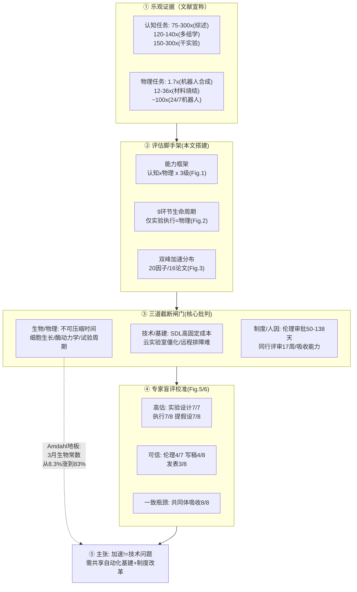

# 组会汇报 · 通用 AI 加速生物医学研究的边界在哪里？（批判 / 立场篇）

> 主讲提示：这是 G 组（批判）里**最“克制、最可证伪”**的一篇——它不喊“AI 无用”，反而把别人宣称的 25×/100× 加速**当真照搬进模型**，再用“不可压缩时间常数 + 专家盲评”把这些数字**逐环节解剖**，看哪些站得住、哪些是“被优化场景挑出来的特例”。读它是为了给全组装一副**“加速因子打假镜”**：下次再看到“某系统快 100×”，先问三件事——基线是谁、算的是“速度”还是“吞吐”、把验证成本算进去了吗。

---

## 0. 阅读地图与术语对照（先把坐标系立起来）

| 英文术语 | 中文 | 在本文里的确切含义 |
|---|---|---|
| GPAI (general-purpose AI) | 通用 AI | 大模型/具备“显著通用性、能胜任广泛任务”的系统（原文用 EU-AI Act 第 3 条定义，ref 6） |
| narrow AI | 窄 AI | 为单一任务训练的模型（如 AlphaFold），与 GPAI 对立 |
| cognitive capability | 认知能力 | 信息处理/分析/决策类：文献综述、提假设、实验设计、数据分析、结果解读、写稿 |
| physical capability | 物理能力 | 实验室操作/上样/设备——本文里**唯一的物理任务 = 实验执行 (experiment execution)** |
| autonomy | 自主性 | 认知×物理两维同时升高后**涌现**的属性：跨完整科研周期独立运转的能力（Fig.1） |
| SDL (self-driving lab) | 自驱动实验室 | 软硬件闭环、机器人自动跑实验的设施 |
| acceleration factor | 加速因子 | 旧耗时 ÷ 新耗时（本文核心被审计的量；区分“速度 speed”与“吞吐 throughput”） |
| non-compressible time | 不可压缩时间 | 生物过程自身决定、技术无法绕过的时长（细胞生长、动物发育、肿瘤进展） |
| expert elicitation | 专家访谈/启发式征询 | 对 8 位带过高影响力项目的资深研究者做结构化问卷，**不追求统计显著性**，只取专业判断 |
| scoping review | 范围性综述 | 比系统综述宽松（无预注册协议）的文献梳理；本文因“能报数的研究太少”被迫用它 |
| Eroom's Law | Eroom 定律 | Moore 倒写——新药研发**越来越慢、越来越贵**的经验规律（ref 32） |

> 判据/数据前置直觉：全篇围绕**一条加法公式**展开（见 §9），核心张力是“**乘法的加速（÷加速因子）打不过加法的地板（+不可压缩时间）**”。把这条直觉记牢，后面所有表都是它的注脚。

---

## 1. 封面 · TL;DR

- **标题**：What are the limits to biomedical research acceleration through general-purpose AI?
- **作者/机构**：Konstantin Hebenstreit、Constantin Convalexius、Stephan Reichl（三人并列一作）、Stefan Huber、Christoph Bock、**Matthias Samwald**（通讯），**维也纳医科大学 AI 研究所 + CeMM**，2025-08，arXiv 2508.16613。
- **权威性来源**：**临床/分子医学一线机构**出品（非纯 CS 团队）；最硬的一手贡献是**对 8 位在 *Nature* / *Nature Genetics* / *Immunity* / *Cell Systems* 等发过高影响力论文的资深 PI 做结构化盲评**（致谢列名，含 Nikolaus Fortelny、Máté G. Kiss 等）；数据与脚本开源（GitHub: OpenBioLink/ResearchAcceleration，见 §“Data availability”）。它的“权威”不在新算法，而在**“让真正做湿实验的人来给 AI 的加速宣称打分”**。

**这篇在干什么（一段话）**：作者**不预设立场**地搭了一套评估脚手架——① 一个 **GPAI 能力框架**（认知×物理，各分 No/Next/Maximum 三级，Fig.1）；② 一个 **端到端 9 环节科研生命周期框架**（Fig.2，仅“实验执行”是物理任务）；③ 一次 **范围性文献综述**，从 16 篇论文里抽出 **20 个加速因子**（Fig.3），发现它们**双峰分布**（要么 <3×，要么认知 >50×、物理 >10×）；④ 据此设定两档情景（Next-level=2×，Maximum-level=认知 100×/物理 25×）代入一个**“可压缩÷加速因子 + 不可压缩”**的时间公式跑算例（Table 2）；⑤ 最后请 **8 位专家盲评**这些因子哪环高估、哪环可信，并给 **12 类瓶颈**打严重度（Fig.5/6）。

**3 条带走的结论（汇报当天就背这三条）**：
1. **加速是“分裂”的，不是“整体”的**：认知任务（综述/写稿/审稿）可信地大幅加速；**实验设计、实验执行、提假设被专家一致判为“强烈高估”**（实验设计 7/7 人、执行 7/8、提假设 7/8 认为高估，Fig.5）。能加速的恰恰是**最不耗时**的环节。
2. **不可压缩时间是“隐藏的地板”**：一个 36 个月项目里生物常数只占 3 个月（~8.3%），**但一旦把可压缩部分压到极限，这 3 个月就反客为主占到 ~83%**（Table 2 + 原文 §“Biological time constants”）——这是 Amdahl 定律的生物医学版。
3. **真正的终极瓶颈是“社会”而非“技术”**：**全部 8 位专家都把“科学共同体的吸收能力 (scientific community assimilation)”列为限制因素**（2 人中等 / 4 人重大 / 2 人关键，Fig.6）——再快的生成，下游消化不了也没用。

> 主讲提示：开场就把“**能加速的不耗时、最耗时的加速不了**”这个反讽抛出来，全场的批判张力立刻成立。

---

## 2. 问题与动机（why —— 本篇最该讲透的一节，2 页）

> 主讲提示：批判类论文的 why = “**别人为什么会错 / 为什么需要一把尺子**”。这里要讲清三件事：宣称有多热、为什么不能照单全收、为什么作者选择“审计”而非“反驳”。

**问题层 why（这事为什么值得做）**：一边是**最高规格的乐观**——OECD 称“用 AI 提升研究生产力”可能是该技术“经济与社会价值最高”的应用（ref 1）；诺奖得主 Solow 的洞见（技术进步而非资本/劳动驱动繁荣，ref 2-3）、Hassabis、世界经济论坛都把“AI 的首要价值在加速科学”挂在嘴上（ref 4）。文献里更是飞着惊人数字：某公司称把肺纤维化药物“发现→临床前候选”从 **至少 5–6 年压到 18 个月（>3×）**（ref 30-31）；PaperQA2 写维基级综述 **~75–300×**（ref 27）；一个多组学 agent **5 分钟**完成人类要 10–12 小时的差异表达分析（**~120–140×**，ref 47,78-79）；BioResearcher 跑完整干实验 **~150–300×**（ref 22）。

**不解决会怎样（为什么不能照单全收）**：这些数字**几乎全部来自“被优化过的子任务或特定场景”**，且**度量口径混乱**——把“某一步快了 100×”等同于“整个项目快了 100×”。作者在 §“Challenges and constraints”里点名：高度任务特异的加速（如快速设计纳米抗体 ref 25、自动跑生信分析 ref 22,47）**有价值，但必须与“项目总时长缩短”区分开**；机器人化学合成的提速主要来自**并行+连续运行（吞吐）而非单步更快（速度）**，因此**必须对比恰当的先进基线（而非人类顺序执行）**，并把**固定搭建成本**算进去。一句话：**没有统一的报告标准，加速因子就是“可以任意挑选的营销数字”**。

**核心动机（作者的赌注）**：与其去**猜测系统性变革**（比如“用 in-silico 仿真整体替换湿实验”——这种变革“本质上难以预测和量化”，原文 §Introduction 末段明确**排除**在范围外），不如**锚定当前科研范式**，做**有证据支撑、可操作的现实估计**：哪些环节真能加速、加速多少、被什么卡住。**这把“审计”而非“反驳”的姿态，是本文区别于一般唱衰文的关键**——它先慷慨地采信文献上限，再让它在“不可压缩时间 + 专家判断”面前自证。

**三个中心问题（原文明列，是全文骨架）**：
1. 当前与未来 GPAI 在不同科研任务上**可能达到什么加速因子**？
2. 哪些**挑战与约束**会**限制**这种加速？
3. GPAI 会如何**重塑研究工作流**，需要哪些**关键政策考量**以确保负责任创新？

> 主讲提示：把“**排除系统性变革、只审计当前范式**”讲成一句话——“**我不跟你争未来，我只问：按现在的玩法，账到底怎么算？**”这既是它的克制，也是它最大的可攻击点（见 §16）。

---

## 3. 研究问题 / 核心 intention（形式化成一句话）

> 主讲提示：把批判对象的“宣称”和本文的“判据”压成一句对照，listener 立刻知道靶子和尺子分别是什么。

把全文压成一句：

> **给定一个典型生物医学研究项目（含认知与物理两类任务、其中一部分受不可压缩生物常数约束），不同能力档次的 GPAI 能把它的总时长压到多短——以及这个“理论最大加速”会被哪些技术/生物/制度/人因瓶颈截断？**

隐含**假设**（也是后面被攻击的点）：(a) 科研可被**离散化**为 9 个可加的环节（原文承认这是“必要的简化”，真实科研是**混杂、迭代、并行**的，见 §16）；(b) 文献报告的加速因子虽**口径不一**，但取**算术均值**后可当“当前上限”的合理代理（Table S2）；(c) 8 位专家的判断虽**样本小、可能有选择偏倚**，但足以校准“宣称是否离谱”。

---

## 4. 论证范围 / 方法 / 证据来源（批判版的 “setting”，写全）

> 主讲提示：v1 规范要求 setting 写全；批判类要把它改写为“**作者的论证靠什么支撑**”。这一节就是“判断力护城河”的地基——四种证据各有强弱，必须分清。

**论证范围（scope，原文 §Introduction / Methods 明确）**：
- **聚焦**：当前科研**范式内**、对**已确立流程**的加速估计，服务“近未来”的现实决策。
- **排除**：系统性范式变革（in-silico 整体替代湿实验、AI-first 重排研究优先级以**减少实验数量**）——明说“可行性/风险/治理超出本研究范围”（原文 §“Limitations of this study”）。这是**自设的边界条件**：它**压低了报告的收益上限，但提高了估计的稳健性**。

**方法（multi-method，原文 §Methods）**：四条腿——
1. **框架分析 (framework development)**：综合 4 个现有框架——DeepMind「Levels of AGI」(ref 33)、SAE「驾驶自动化分级」(ref 34)、「AI agents for biomedical discovery」(ref 35)、「Self-Driving Labs」(ref 36)——合成出**认知×物理两维 × 三级**的统一能力框架（Fig.1）。
2. **科研流程映射 (process mapping)**：把生命周期拆成 **9 大任务**（Fig.2），每个再分子任务（Table S1），并标注主导能力维度（认知 vs 物理）。
3. **范围性文献综述 (scoping review)**：检索**近五年至 2025-03**、报“量化加速指标”的研究；纳入标准=报具体加速数 + 同行评审期刊或可靠预印本 + 生物医学或紧邻领域。**因能报数的研究太少，无法做经典系统综述（无预注册协议）**。把区间报告（如 [150–300]）取**算术均值**化为点估计（→225，Table S2）。
4. **专家盲评 (expert elicitation)**：经 web 平台 Alchemer 发**结构化问卷**给 **8 位**满足“在高影响力期刊以一作/通讯发过文”的 PI（3 篇 *Immunity*、2 篇 *Nature*、1 篇 *Nat. Genetics*、1 篇 *Allergy*、1 篇 *Cell Systems*）。**目标不是统计泛化，而是捕捉领域专家的当下判断**（原文反复强调）。四个板块：①项目时长与各环节占比；②对预设加速因子（100×认知/25×物理）逐环节给“高估↔低估”五点 Likert；③对 12 类限制因素给“无限制↔关键限制”五点 Likert；④开放式补充。

**证据来源强弱（汇报时务必点出，这是判断力护城河）**：

| 证据 | 强度 | 软肋（必须当众说破） |
|---|---|---|
| 4 个现有框架的综合 | 中：站在公认框架上 | 框架本身把“连续能力”切成离散三级，是**人为简化** |
| 9 环节生命周期 | 中：教科书式拆解（ref 37-41） | 真实科研**混杂/迭代/并行**，离散假设会“掩盖重要动态”（原文自承） |
| 20 个加速因子（16 篇） | **弱**：样本少、口径乱、有发表偏倚 | 多来自**优化场景/子任务**；speed vs throughput 混淆；区间取均值损失信息 |
| N=8 专家盲评 | 中：**唯一一手数据**，一线判断 | **n 太小、选择偏倚**（原文 §Limitations 自认）；非随机抽样 |

> 主讲提示：强调“**全篇没有一个新实验、新模型**——它的全部说服力来自‘把别人的数字摆在一起、再让内行打分’。” 这正是批判类论文的范式：**贡献不在产生新数据，而在重构判据**。

---

## 5. 论证结构总览（mermaid：批判类用“论点结构”替代“pipeline”）

> 主讲提示：这张图是全文的“骨架透视”。让听众看清：**乐观证据（左）→ 被三道闸门截断（中）→ 收敛到政策主张（右）**。每个箭头都是一处“宣称 vs 边界”的对撞。

**直觉**：这不是“线性 pipeline”，而是一个**漏斗**——文献端进来一堆 ×100 的大数，经过“能力框架→生命周期→三道闸门→专家校准”层层过滤，**只有认知/行政类的加速能流到出口**，其余被截留。

---

## 6. 两个核心框架（big picture，先直觉后细节）

### 6.1 GPAI 能力框架：认知×物理 → 涌现自主性（Fig.1）

> 主讲提示：这张热力图是全文的“坐标系”。关键洞见：**自主性是认知与物理两维“相乘”出来的**——任一维卡住，右下角的“激进加速”就到不了。

**Why（设计层）**：朴素做法是用单一“AI 能力等级”（像 AGI levels）一条轴打分。但生物医学的要害是**“想得出 ≠ 做得出”**：一个能完美设计实验的 AI，若不能动手（物理能力=No），照样卡在湿实验。所以作者**强制拆成认知、物理两条独立轴**，各设三级：
- **No GPAI**：人全手工（可用非 GPAI 工具）。
- **Next-level**：GPAI **部分自动化**、但需大量人类介入（=当前若干系统的水平）。
- **Maximum-level**：高自主、专家级、近乎无监督。

**读出什么**：Fig.1 的热力图里，**颜色（自主性）只有在两维同时走到 Maximum 时才最深**（右下角）。这等于**预先埋下结论**：只要物理维（湿实验）受生物常数封顶，整体自主性就上不去——与 §9 的 Amdahl 地板呼应。

### 6.2 端到端 9 环节科研生命周期（Fig.2）

> 主讲提示：让听众数一遍 9 个环节，并**只圈出 1 个红框**——这是全文最锋利的视觉论点。

**Why（设计层）**：把“科研”当黑箱去谈加速会失焦。作者把它拆成 9 个可分别评估的环节（依据教科书式流程 ref 37-41），**并标注哪些是认知、哪个是物理**：

| # | 环节 (英) | 中文 | 主导能力 |
|---|---|---|---|
| 1 | Knowledge synthesis | 知识综合 | 认知 |
| 2 | Idea & hypothesis generation | 创意与假设生成 | 认知 |
| 3 | Experiment design | 实验设计 | 认知 |
| 4 | Ethics approval & permits | 伦理审批与许可 | 认知 |
| **5** | **Experiment execution** | **实验执行** | **物理（唯一）** |
| 6 | Data analysis | 数据分析 | 认知 |
| 7 | Results interpretation | 结果解读 | 认知 |
| 8 | Manuscript preparation | 稿件准备 | 认知 |
| 9 | Publication process | 发表流程 | 认知 |

**读出什么**：**9 个环节里 8 个是认知、只有“实验执行”是物理**。这把全文张力一句话点破——**GPAI 最擅长的是认知（8/9），但生物医学最耗时、最不可压缩的恰恰压在那唯一的物理环节上**（专家测得实验执行占项目时间 27.5%，Fig.4）。Table 1 进一步把每个环节 × 三个能力档列成 3×9 矩阵（如“实验执行/Maximum”=“GPAI 管理的机器人独立完成多数任务，人类仅在特殊/伦理环节介入”）。

---

## 7. 证据链 ①：文献加速因子的“双峰分布”（Fig.3 + 关键数字）

> 主讲提示：这是“宣称”侧最该被原样呈现的一节——**先慷慨地把别人的大数全摆出来**，下一节才动刀。强调“双峰”这个发现本身就是一种批判：**没有连续的中间地带，要么小打小闹 <3×，要么戏剧性 ×100**，后者几乎全是“被挑出来的最优场景”。

**核心发现（原文 §“Acceleration factors with GPAI levels”）**：从 16 篇论文抽出的 **20 个加速因子**呈**双峰分布 (bimodal)**——大量聚在**低档（<3×）**或**高档（物理 >10×、认知 >50×）**，中间空。作者据此区分**两种加速 regime**：
- **增量加速 (incremental)**：今天就能在**整条流程**上拿到（→ 对应 **Next-level**）。
- **变革加速 (transformative)**：只有未来高级系统/为自动化深度优化的配置才行，且**当前仅限特定任务**（→ 对应 **Maximum-level**）。

**认知任务的代表数字（务必标出处，区分 speed/throughput）**：

| 任务 | 报告加速 | 出处 | 性质提示 |
|---|---|---|---|
| 药物研发 初研→临床前 | **1.3–2×**（成本/时间降 25–50%） | ref 73 (BCG) | 工业报告 |
| 流式细胞数据分析 | **2–4×**（10-20 min→5 min） | ref 61 | 子任务、保专家级精度 |
| 咨询任务 | 1.3× | ref 74 | 域外参照 |
| 专业写作 | **1.7×**（省 40% 时间） | ref 75 | 域外参照 |
| 编程 | **2.2×**（省 55%） | ref 76 (Copilot) | 域外参照 |
| **PaperQA2 写维基级综述** | **~75–300×**（8 min vs 10–40 h） | ref 27,77 | **深度优化场景** |
| 多组学差异表达分析 | **~120–140×**（5 min vs 10–12 h） | ref 47,78-79 | 子任务 |
| BioResearcher 完整干实验 | **~150–300×**（~8 h vs 7–14 周） | ref 22 | 全干实验、**无湿实验** |
| AI Scientist 探索 idea | ~50 ideas/12 h（~15 min/idea） | ref 24 | CS 领域 |

**物理任务的代表数字**：
- 机器人化学合成神经靶向剂：**1.7×**（20 化合物库 120 h→72 h，ref 81）；
- 蛋白工程：现实 **1–2×**（6–12 月→6 月，含运输延迟），“更好规划”可达 **3–6×**，连续运行理想 **~15–50×**（ref 48）；
- 微生物 culturomics：**>20×**（2000 菌落/小时，ref 59）；
- 材料烧结：**12–36×**（2-6 h→10 min，ref 82）；
- 16 并行样本自动化工作流：**~40×**（688 实验/8 天，ref 28，该文还给出 **~10×-100×** 区间，低端=半自动、高端=对比手工）；
- SDL 综合（机器人 2× × 主动学习 5-20× × 过程强化 ≤100× × 连续运行 2-3×）**→ 10–100×**（ref 83）；
- 云实验室宣称发表时间 **2×**（1.96 年→1 年）、产出“出版级数据”**90× 快**（3 月→24 h，ref 84）；某博士生用 24/7 机器人**~100×** 复现前作（ref 85）。

**情景设定（原文据上）**：
- **Next-level GPAI**：取经验下限，**认知与物理均 2×**（“当前可立即实现”，以肺纤维化临床前发现为证 ref 31）。
- **Maximum-level GPAI**：取上限但**故意取保守端**，**认知 100× / 物理 25×**（Fig.3 中三条虚线 2×/25×/100× 即四个黑三角选定的建模值）。

> 主讲提示：把“**取上限的保守端**”这句话钉住——这是作者的**诚实姿态**，也是它“先慷慨后审计”策略的关键：连我都按你最乐观的算，结果照样被生物常数封顶。

---

## 8. 证据链 ②：把加速因子“打假”的方法学批判（本文判断力护城河）

> 主讲提示：这是全篇**最该让组里人学会的一节**——不是结论，而是**一套审计加速宣称的清单**。把它做成“四问”，以后看任何 ×N 都能套。

原文 §“Challenges and constraints”给出**严格评估加速所需的方法学清单**，可凝练为**四问**：

1. **基线是谁？(benchmark)** 加速依赖所选基线（人类？优化过的实验室？SOTA 自动化？）。拿“机器人 vs 人类顺序执行”比，会**虚高**；应与**恰当的先进基线**比。
2. **算的是速度还是吞吐？(speed vs throughput)** 机器人加速化学合成 (ref 28)、高通量筛选 (ref 85) **主要靠并行 + 连续运行（吞吐）**，而非单步更快（速度）。把吞吐当速度宣传是头号陷阱。
3. **固定成本算了吗？(setup cost)** 切换到自动化有**固定搭建成本**，会**抵消**收益——尤其在**孤立/小规模项目**里。
4. **验证成本算了吗？(validation cost)** 计算机辅助发现治疗剂 (ref 31)、蛋白 (ref 48) 的加速，**只有把 GPAI 产出的验证工作量算进去**才能判断。高度任务特异的加速（设计纳米抗体 ref 25、自动跑生信 ref 22,47）**有价值，但必须与“项目总时长缩短”区分**。

**结论句（原文）**：因此**精确的报告标准至关重要**——必须对基线、系统边界、“真实速度 vs 吞吐”、以及全部运行与验证成本透明披露，才能准确评估 GPAI 的收益。

> 主讲提示：这四问就是送给全组的“**加速因子打假镜**”。可现场演示：拿上一节任一大数（如多组学 120×）套四问——它只算了某一步、对的是人工基线、没算验证，于是“120×”立刻缩水成“某子任务在理想口径下的上界”。

---

## 9. 证据链 ③：不可压缩时间 = 生物医学版 Amdahl 定律（核心公式）

> 主讲提示：全篇唯一的“数学”，但它是灵魂。务必按“直觉→符号→公式→读出什么”讲，并把 Table 2 当场算一遍。

**Why（设计层）**：朴素做法是“总时长 ÷ 加速因子”——但这**默认一切都可压缩**，是错的。生物医学含**自身决定时长的过程**（细胞生长、动物发育、肿瘤进展、酶动力学、蛋白折叠），技术**无法绕过**（原文 §“Biological time constants”，证据见 §15 专家原话“看 3 个月干预效应的时间框架改不了”）。所以必须把时间**劈成两份**：可压缩的除以加速因子，不可压缩的**原样相加**。

**记号（先定义，后用式）**：
- $T_{\text{total}}$：项目总时长；
- $T_{\text{comp}}$：**可压缩时间** (compressible)，认知 + 可自动化的物理操作；
- $T_{\text{nc}}$：**不可压缩时间** (non-compressible)，生物常数（细胞生长等）；
- $a$：作用于可压缩部分的**加速因子** ($a\ge 1$)。

**公式（原文明列，文字版）**：

$$ T_{\text{total}} \;=\; \frac{T_{\text{comp}}}{a} \;+\; T_{\text{nc}} $$

**读出什么**：当 $a\to\infty$，$T_{\text{total}}\to T_{\text{nc}}$——**总时长被不可压缩地板锁死**。这正是 **Amdahl 定律**（并行加速被串行部分封顶）在科研时间上的翻版：$T_{\text{nc}}$ 就是“串行不可并行”的那段。

**算例（Table 2，36 个月 PhD 项目：24 月认知 + 12 月物理，其中 3 月为生物常数）**：

| | 物理 No GPAI (9+3=12 月) | 物理 Next 2× (9/2+3=7.5 月) | 物理 Max 25× (9/25+3≈3.4 月) |
|---|---|---|---|
| **认知 No GPAI** (24 月) | 36.0（=1×） | 31.5（~1.1×） | 27.4（~1.3×） |
| **认知 Next 2×** (24/2=12 月) | 24.0（=1.5×） | 19.5（~1.8×） | 15.4（~2.3×） |
| **认知 Max 100×** (24/100≈0.2 月) | 12.2（~3×） | 7.7（~4.7×） | **3.6（=10×）** |

**关键读数（原文 §11）**：即便认知 100× + 物理 25× 全开，36 月也只压到 **3.6 月（10×）**——**不是 100×**。原因全在地板：**3 个月生物常数在无 GPAI 时只占 8.3%，全速下却占到 ~83%**，成为支配项。

> 主讲提示：把“**全开也只有 10×、且 83% 是生物常数**”作为全场最重的一锤。一句话总结：“**你能把思考变成瞬间，但细胞该长几天还是几天。**”并补一句作者的限定：重计算/in-vitro 的领域可逼近上限，重 in-vivo 的领域只能拿到温和缩短。

---

## 10. 证据链 ④：专家盲评——把“宣称”交给内行打分（Fig.4/5/6，本文一手数据）

> 主讲提示：这是全文**唯一的原创经验证据**，也是“判断力护城河”的实测层。三张图按“现状→高估在哪→瓶颈在哪”讲。

**(a) 现状基线（Fig.4）**：8 位专家报告的**平均项目时长 72.4 个月**（约为算例 36 月的两倍，但**认知/物理比例一致**：认知占 73%，与算例 67% 接近，**侧面支持框架的代表性**）。最耗时三环节：**实验执行 19.9 月 (27.5%)、发表流程 13.6 月 (18.8%)、数据分析 12.4 月 (17.1%)**；最不耗时：**伦理审批 2.2 月 (3.1%)、知识综合 2.9 月 (4.0%)**。

> 这是一处**致命反讽的数据底座**：最耗时的是物理执行（27.5%），而它恰是 GPAI 最难加速、专家最不信的环节。

**(b) 哪些加速被判“高估”（Fig.5，评 Max 档 100×认知/25×物理）**——**对照表（宣称 vs 专家判断）**：

| 环节 | 本文设定加速 | 专家裁决（N） | 倾向 |
|---|---|---|---|
| 实验设计 | 100× | **7/7 高估** | ❌ 强烈高估 |
| 实验执行 | 25× | **7/8 高估**（含 2 人“显著高估”） | ❌ 强烈高估 |
| 创意/假设生成 | 100× | **7/8 高估**（6 中等+1 显著） | ❌ 强烈高估 |
| 数据分析 | 100× | 5 可信 / 3 中等高估 | ➖ 偏可信 |
| 结果解读 | 100× | 5 高估 / 2 中等高估 / 1 低估 | ❌ 偏高估 |
| 知识综合 | 100× | 3 可信 / 3+2 高估 | ➖ 混合 |
| **伦理审批** | 100× | **4/7 可信**（2 人甚至“低估”） | ✅ 可信 |
| **稿件准备** | 100× | **4/8 可信** | ✅ 可信 |
| **发表流程** | 100× | **3/8 可信**（余下高/低估混合） | ✅ 偏可信 |

**读出什么**：专家把“高估”集中判给了**最依赖人类判断与物理现实**的环节（实验设计/执行/提假设），把“可信”留给了**结构化、规程化的行政与文字环节**（伦理/写稿/发表）。**这与作者的框架预测高度一致**——认知中“规程化”的部分能加速，“创造性 + 物理”的部分不能。

**(c) 12 类瓶颈的严重度（Fig.6）**——专家共识榜：

| 限制因素 | 共识倾向（N=7~8） |
|---|---|
| **科学共同体吸收 (assimilation)** | **全员视为限制**：2 中等 / 4 重大 / 2 关键 → **唯一全员一致** |
| 人类伦理判断 | 重大/关键端突出（5 人 crucial 级） |
| 生物/物理时间限制 | 偏“更限制”（3 人 crucial） |
| 输入数据限制 | 偏“更限制”（3 人 crucial） |
| 资源与基础设施 | 中等偏上 |
| 人类问责 (accountability) | 中等偏上 |
| **人类战略方向 (strategic direction)** | **被视为较小约束**（4 人 minor，多数不担心）|
| 利益相关方协调 | **多数仅“中等”(5/8)** |

> 主讲提示：把两个极端讲透——**最被担心的是“共同体吸收”（社会消化能力），最不被担心的是“人类战略方向”（即专家相信高层科研品味仍稳握人手）**。这等于专家在说：“**瓶颈不在 AI 替不替我做判断，而在整个系统咽不咽得下它的产出。**”

**(d) 专家原话（开放式，原文 §Fig.6 后）**——比任何数字都生动：
- “给 200 人采血**就是要花确定的时间**”；
- “实验的**根本时间框架**（看干预后 3 个月效应）改不了”；
- “**有同行评审的发表速度、合著者的响应速度，都改不了**”；
- 高昂前期成本要求“**对结果有惊人的信任 (phenomenal trust in results)**”才肯投（点到 cost/benefit ratio 与系统接口难题）。

---

## 11. 主要结论：加速的两种命运 + 工作流重塑

> 主讲提示：把结论拆成“被封顶的”和“被释放的”两类，避免听众误以为本文一味唱衰。

**结论 A：分裂的加速（who gets accelerated）**
- **被封顶**：实验设计、实验执行、创意/假设——人类判断 + 生物常数双重锁死（专家 + 公式双重佐证）。
- **被释放**：**审稿与发表流程**。原文 §“Transformation of research processes”：发表占项目时长**可观比例**（专家 18.8%），且**可被实质性加速**——GPAI 检查规程合规/伦理可能比人类**更可靠、更全面**，把“顺序的、耗时的评审周期”转为“**连续、即时的监控**”，人类角色上移为**高层反思、设标准、处理复杂个案**。

**结论 B：质变而非量变的风险（dynamics shift）**
- **目标设定与探索的动力学会变**：GPAI 无需漫长 onboarding，可即时部署/重配/扩展，**无行政延迟地切换研究方向**，并能跨学科连接知识。**但**：这会让研究方向受**主流 GPAI 模型偏置**影响，可能导致**研究路径同质化 (homogenization)**，侵蚀“历来驱动科学创新的视角多样性”——需机制识别偏置、激励多样化。
- **科学质量度量需重订**：现有“重新颖/数量、轻可复现”的激励会**放大不可靠发现的泛滥**；但 GPAI 也能提供可复现所需的**高度详尽、透明的文档**——是双刃剑。

**结论 C：政策三支柱（policy implications）**
1. **资源配置**：受益取决于资本/算力/自动化的可及性 → **风险是机构与国家间不平等加剧、知识产权与市场份额集中**。建议政策**主动资助两件事**：能灵活执行多样物理任务的 **SDL**，与**前沿模型能力 + 算力的可及性**。
2. **劳动力转型**：人类焦点上移到**战略、分析、验证**；需重组织、再培训、**更新激励以奖励“有效且透明地使用 GPAI”**。
3. **治理与防滥用**：传统治理**跟不上** GPAI 加速 → 需**持续监控、可迭代更新**的高效框架（甚至把 AI 工具用进治理本身）；对**危险生物制剂**的双用途风险需**国际协调、统一透明与伦理标准**。

---

## 12. “论文宣称 vs 批判/边界” 总对照表（本篇核心交付物）

> 主讲提示：这张表是组会的“**带走页**”。左列是社区/文献的乐观叙事，右列是本文给出的边界与证据出处。汇报时逐行念，每行都是一处“判断力”。

| # | 论文/社区**宣称** | 本文的**批判 / 边界**（含出处） |
|---|---|---|
| 1 | GPAI 能整体加速生物医学研究（OECD/Hassabis 级乐观，ref 1,4） | 加速**分裂**：仅认知/行政可大幅加速；实验设计/执行/提假设被专家判**强烈高估**（Fig.5）|
| 2 | 完整科研周期可达 ~150–300×（BioResearcher ref 22）/ ~75–300×（综述 ref 27）| 这些是**子任务/干实验/优化场景**；须区分“某步速度”与“项目总时长”（§8 四问）|
| 3 | 加速因子可直接采信 | **双峰分布**暗示高档值多为**被挑出的最优场景**；区间取均值损失信息（Fig.3, Table S2）|
| 4 | 机器人把合成/筛选加速 ×40–100 | 主要是**吞吐（并行+连续）而非速度**；须对**先进基线**、计**固定搭建成本**（§8, ref 28,85）|
| 5 | 全开 GPAI → 项目可近 100× | 受**不可压缩时间**封顶：36 月全开仅 **10×**，且 **83% 变成生物常数**（Table 2, §9）|
| 6 | 提假设/实验设计可由 AI 高度自动化 | 专家**最不信**这三环（设计 7/7、执行 7/8、提假设 7/8 高估）——人类判断不可替（Fig.5）|
| 7 | SDL/云实验室让发现“按钮即得” | 高固定成本、**远程排障难、探索性实验灵活度降、学术频繁转向不适配**（ref 86-89, §“Limits”）|
| 8 | 数据驱动可解锁一切 | 受**数据短板**限：文献**缺阴性结果/元数据**；建稳健模型需大而富信息数据集，其**生成本身是瓶颈**（ref 90-91）|
| 9 | 行政/伦理/评审也会被 AI 拖累式拖慢 | 相反：**这些结构化流程最可被加速**（伦理 4/7、写稿 4/8 可信）；评审可转“连续监控”（§11）|
| 10 | 技术进步足以兑现加速红利 | **不够**：终极瓶颈是**共同体吸收能力（8/8 一致）**与制度适配；需**制度改革 + 共享基建**，非纯技术（Discussion）|
| 11 | 更快的科学=更好的科学 | 风险：**主流模型偏置 → 研究同质化**；重数量轻复现的激励会**放大不可靠发现**（§“Transformation”）|

---

## 13. 关键数字速查（setting / metrics，写全备查）

> 主讲提示：组会最常被追问“这数哪来的”，这页一站式应答。

- **建模情景**：Next-level=认知 2×/物理 2×；Maximum-level=**认知 100×/物理 25×**（Fig.3 四黑三角；称“取上限的保守端”）。
- **算例项目**：36 月 = 24 月认知 + 12 月物理，其中 **3 月生物常数**；全开结果 **3.6 月 (10×)**；生物常数占比 8.3%→83%（Table 2）。
- **专家基线**：N=8；平均项目 **72.4 月**；认知占 73%；最耗时 实验执行 27.5% / 发表 18.8% / 数据分析 17.1%（Fig.4）。
- **制度延迟（硬数据，§“Challenges”）**：伦理审批平均 **50–138 天**（ref 32）；预印本→发表平均 **199 天**（ref 93）；期刊投稿→发表 **91–639 天**（ref 94）；同行评审 **17 周**，但审稿人每轮仅花 **~6 小时**（ref 95-96）——**等待 ≫ 工作量**，正是“可被 GPAI 压缩”的协调开销。
- **文献综述口径**：近五年至 2025-03；16 篇 → 20 因子；区间取算术均值（如 [150–300]→225）；**因可报数研究太少，非系统综述**（Methods）。
- **可用性**：数据/分析脚本/绘图代码开源（GitHub: OpenBioLink/ResearchAcceleration）；问卷经 Alchemer 发放（Information S7）；完整结果见 Tables S3–S6。
- **撰写披露**：作者用 OpenAI/Google/Anthropic 模型润色 + 文献摘要、Grammarly/DeepL 校对，**全部内容经人工审校并担责**（Author contributions）——**作者以身作则地实践了“AI 辅助须透明披露”**。

---

## 14. 消融式分析：哪一条批判最“致命”（敏感性）

> 主讲提示：批判类没有数值消融，但可以做“**论点敏感性**”——抽掉哪根支柱，结论最受伤？这能体现你真读懂了论证。

| 抽掉的支柱 | 结论会怎样 | 说明它有多关键 |
|---|---|---|
| 去掉**不可压缩时间** | 全文塌一半：总加速重新趋近文献的 ×100 | **最致命的支柱**——Amdahl 地板是“数字打假”的数学根基（§9）|
| 去掉**专家盲评** | 只剩“文献口径乱”的方法学批判，**缺一线背书** | 专家是**唯一一手证据**，把“可能高估”坐实为“内行确认高估”（Fig.5）|
| 去掉**speed/throughput 区分** | ×40–100 的物理加速将被照单全收 | 这是揭穿物理加速的**关键刀法**（§8 第 2 问）|
| 去掉**9 环节拆解** | 无法定位“能加速的恰是不耗时的”这一反讽 | 提供了**逐环节归因**的分辨率（Fig.2/4/5）|
| 去掉**“共同体吸收”发现** | 政策主张失去“非技术瓶颈”的最强论据 | 8/8 一致，是 Discussion 的**压舱石** |

> 主讲提示：一句话收口——“**这篇的论证不是单点暴击，而是‘公式封顶 + 内行背书 + 口径打假’三重锁**，抽掉任一根，乐观叙事就能反扑回来。”

---

## 15. 局限与批判（诚实：原文自承 + 我/社区的追问）

> 主讲提示：批判别人的论文，更要会批判它自己。这一节决定你“判断力护城河”挖得够不够深。

**原文自承（§“Limitations of this study”，难得地坦诚）**：
1. **可泛化性有限**：机构结构/研究实践跨领域差异大；生物医学子领域加速潜力不均，框架未尽捕捉。
2. **只估“加速既有流程”，未含范式变革**：明说排除了“in-silico 替代湿实验 / AI-first 减少实验数”——而这恰恰可能**抹掉那 3 个月地板、创造质变**（自承“这压低了我们报告的收益”）。**这是最大的自我设限**：它的“10× 上限”**只在‘不改变玩法’的前提下成立**。
3. **离散/顺序框架是简化**：真实任务**混杂、迭代、并行**；作者辩称“并行（多人）与停工延迟两种相反效应大致抵消，残差不大”——**此辩护未经验证，是一处可攻击的假设**。
4. **预测含巨大不确定性**：未建模**反馈回路与涌现现象**；当前经验基础薄、长期大规模落地稀少、社会适配速率史无前例。
5. **专家样本小（N=8）+ 选择偏倚**：自认“限制结果稳健性”，仅作“初步评估”。

**我/社区的追加追问（组会可抛）**：
- **(a) 文献口径的“原罪”未根治**：把 [150–300] 取均值=225 当“当前上限”，本身就把**口径混乱的数字**当成了可比量——这与作者自己的“四问打假”**存在内在张力**（一边说这些数不可比，一边又拿它们的均值建模）。
- **(b) “保守取上限端”仍是选择性采样**：100×/25× 来自 Fig.3 高峰，而高峰几乎全是优化场景——**用特例的上界当“最大档”，再说它被封顶**，逻辑上有“稻草人”嫌疑（虽然方向无害）。
- **(c) 排除范式变革=回避了最重要的问题**：若 in-silico 虚拟细胞（ref 91 Grow AI virtual cells）成熟，$T_{\text{nc}}$ 可能**整段消失**——那时本文的“地板”论就失效。**本文的边界结论，寿命取决于它自己排除掉的那条路走多快。**
- **(d) “两种效应抵消”缺证据**：并行 vs 停工延迟是否真抵消，没有数据，是把一个**经验问题**用一句断言带过。

> 主讲提示：把 (c) 当“反方最强一击”单独讲——**这篇最稳的结论（生物地板封顶 10×）建立在‘不准用 in-silico 绕过生物’的人为约束上；一旦虚拟细胞跑通，结论就翻篇。** 这正是它与 AlphaEvolve/Robin 这类“在可验证域内狂奔”的工作的根本分歧点。

---

## ★ 对我们的启发（Inspires Us）

> 这一节回答一句话：**这篇“立场/批判”论文，对我（们）接下来要做的研究，到底能用上什么？** 批判类的价值不在给招式，而在**给一副判断的尺子**——把它焊进我们的评估与红队模块。

- ➤ **a. 可直接借用的招（reuse）**：
  1. **“加速因子四问”审计清单**（基线？速度 vs 吞吐？固定成本？验证成本？，§8）——**原样做成 `m9.6-evaluating-research-agents` 的一个评测前置 checklist**：任何 agent 报“快 N×”，必须先回答这四问、披露基线与口径，否则该数**不计入**成绩。这把“营销数字”挡在沙箱门外。
  2. **“可压缩 ÷ 加速 + 不可压缩”时间模型**（§9）——**搬进 `m9.5-end-to-end-ai-scientist` 的评估**：给我们的五阶段流水线**显式标注哪几步是“不可压缩地板”**（如真实训练的 wall-clock、外部 API 限速），算一遍“即便其余瞬间完成、端到端最快多少”，**戳破“端到端 ×100”的自欺**。
  3. **“专家盲评 × 逐环节高估/低估热力图”**（Fig.5）——做成 `m9.8-redteam-and-integrity` 的一个**人因红队模板**：让评审员对 agent 自报的各环节加速逐项打“高估↔低估”，**把“天真采信”变成“逐环节质疑”**。

- ➤ **b. 可迁移到我们课题的思路（transfer）**：把“**Amdahl 地板**”从“生物时间”泛化为“**任何不可压缩的串行约束**”——在我们 `m9.7-self-improvement-evolution` 里，**holdout 评估的真实执行时间 / 外部验证延迟**就是地板。迁移要改的前提：本文地板是**物理生物常数**（外生、刚性），我们的地板是**评估带宽**（可加资源缓解，但加钱有上限）。把这层换掉后，“全开也只有 10×”的教训直接适用：**再强的生成，也被最慢的验证环节锁死**。

- ➤ **c. 它暴露的开放问题 = 我们的机会（opportunity）**：
  - 本文**自承排除了 in-silico 范式变革**（§15-c）——**机会**：能否在 `m9.6` 里搭一个“**地板可不可压缩**”的判定实验？给若干任务标注“真物理地板 vs 看似地板实则可仿真替代”，量化“引入可验证 in-silico 代理后，地板缩小多少、引入多少偏差/被刷分风险”。**这正是把本文的‘静态边界’变成‘动态边界’的第一篇可做工作。**
  - 本文“**两种效应抵消**”缺证据（§15-d）——**机会**：用我们的多 agent 流水线做一个**最小并行 vs 串行**对照，实测“并行收益是否真被协调/停工抵消”，给这个被一句话带过的假设补上数据。

- ➤ **d. 与本库其它论文/模块的连接（connect the dots）**：
  - **互为正反**：与 [`2506.13131` AlphaEvolve](2506.13131-alphaevolve-deepmind.md) 形成**最尖锐的对照**——AlphaEvolve 的命门是“**有自动可验证 $h$ 就能狂奔**”，本文则证明“**生物医学的核心环节恰恰写不出自动 $h$、且有不可压缩地板**”。两篇合读=“**可验证域内的乐观 vs 湿实验域的边界**”，是给全组的一张完整地图。
  - **同盟呼应**：与 [`2506.01372` Fail-Without-Implementation](2506.01372-critique-fail-without-implementation.md)（没有真实实现就别信）、[`2509.08713` Hidden-Pitfalls](2509.08713-critique-hidden-pitfalls.md)（评估里的隐藏陷阱）三篇构成**“判断力护城河”三件套**：一个管“speed vs throughput / 验证成本”，一个管“实现缺失”，一个管“评估陷阱”。
  - **现实约束的同侧**：与 [`2505.13400` Robin](2505.13400-robin-futurehouse-discovery.md)（端到端湿实验发现）**互补**——Robin 演示“湿实验闭环能做出真发现”，本文给出“**但它的整体加速被生物常数封顶**”的天花板；两者拼出“**能做 vs 能多快**”的全貌。
  - **红队收口**：所有“加速宣称”最终汇入 [`m9.8-redteam-and-integrity`](../m9.8-redteam-and-integrity/) 的“独立验证 / 天真评审会被骗”主线——本文为它补上**“加速数字也要红队”**这一新靶面。

- ➤ **e. 如果我来做下一步（my next move）**：**我会先把“加速因子四问 checklist + 不可压缩地板标注”做成 `m9.6` 沙箱的一个评测插件**，拿我们 `m9.5` 的五阶段 AI-Scientist 当被测对象，跑一组对照：①让它自报每阶段加速，②用四问逐条审计、把“吞吐冒充速度/未计验证”的水分挤掉，③标注真实地板算端到端上界。**一周内能出一个最小结论：我们自己系统的“真实加速”被挤水后还剩几成、地板卡在哪一步。** 若 work，再把“专家盲评热力图”接到 `m9.8` 做人因红队。

> 主讲提示：这一节是全场高潮——前面都在讲“维也纳团队怎么给别人打假”，这里讲“**我们怎么用同一把尺子给自己打假**”。落点是 m9.6 的审计插件、m9.5 的地板标注、m9.8 的人因红队，能被同组同学直接接力。

---

## 16. 在 auto-research 版图的位置（相对已有论文的增量）

> 主讲提示：用一句话定位——它是全库的“**刹车片**”，专门给那些“×100 闭环”的旗舰系统降速校准。

- **阶梯定位**：在 Tool→Analyst→Scientist 阶梯里，本文**不造系统**，而是**给整条阶梯标刻度尺**——它说清了“**为什么 Scientist 级的整体加速在生物医学注定被封顶**”，与 [`m9.1 autonomy-ladder`](../m9.1-autonomy-ladder-and-map/)“自称 Scientist 的都靠自评、独立验证最高只到 Analyst”**同向加固**：一个限制“自主性等级”，一个限制“加速幅度”。
- **时间/能力增量（相对已有工作）**：
  - **向前推了“评估”这件事**：此前 G 组批判多针对**单个系统的可靠性**（幻觉、reward hacking、实现缺失）；本文把批判**抬到“整个研究范式的加速账”层面**——首次把“**加速因子**”本身当成需要红队的对象，并提供**可证伪的公式 + 一手专家数据**。
  - **证伪了谁**：它**不点名地证伪了所有“完整科研周期 ×100–300”的宣称**（BioResearcher ref 22、PaperQA2 ref 27、co-scientist 式纳米抗体 ref 25）——不是说它们假，而是说**它们的数不能外推到项目总时长**。
  - **被谁制衡**：它自己被“**in-silico 范式变革**”（虚拟细胞 ref 91）潜在反超——所以它和 AlphaEvolve/虚拟细胞这条“在可仿真域内消灭地板”的路线，构成**本库最值得追踪的一组对赌**。
- **一句话版图**：**乐观旗舰（v1/v2/co-scientist/AlphaEvolve/Robin）负责“跑多快”，这篇负责“账怎么算、快在哪不算数”**——它是把全组从“能力崇拜”拉回“判断力”的关键一篇。

---

## 17. 复现与可用性

- **开源**：匿名化的专家访谈数据、分析脚本、绘图代码全在 **GitHub: OpenBioLink/ResearchAcceleration**；问卷界面见 Information S7；完整 Likert 结果 Tables S3–S6；各环节子任务与代表工作 Table S1。
- **能不能“单卡跑”**：**本文无需算力**——它是**框架 + 综述 + 问卷**，可复现的是**统计与绘图**（Fig.3 小提琴图、Fig.5/6 堆叠条、Table 2 算例）。想复算 Table 2，只需把 $T_{\text{comp}}/a+T_{\text{nc}}$ 套进 9/24/3 月即可。
- **坑**：① 加速因子的“均值化”口径需自行判断是否接受（见 §15-a）；② N=8 的统计不可外推，引用其结论时**务必带“探索性、非泛化”限定**；③ 复现专家访谈需重新招募一线 PI，**成本高、难严格复制**（选择偏倚不可消除）。

---

## 18. 组会讨论问题（5–8 个，能引发讨论）

1. 本文的“地板封顶 10×”**完全建立在“不准用 in-silico 绕过生物”的人为约束上**。如果虚拟细胞（ref 91）三年内跑通，本文哪些结论会失效、哪些仍稳？我们该把赌注下在“审计派”还是“消灭地板派”？
2. 作者一边用“四问”说**加速因子口径混乱不可比**，一边又把它们**取均值当建模上限**——这是不是自相矛盾？换你来做，**该怎么聚合这些口径不一的数字**才更诚实？
3. **N=8 专家**的盲评能承担多大论证重量？“7/7 认为实验设计被高估”——这是**领域共识**，还是**资深 PI 对 AI 的系统性保守偏见**？怎么设计实验区分这两者？
4. 专家**最担心“共同体吸收”、最不担心“人类战略方向”**。这对我们做 auto-research 系统意味着什么——**是不是该把工程重心从“让 AI 提更好的假设”转向“让产出更易被人类消化/验证”**？
5. “speed vs throughput”这把刀，**能不能反过来砍我们自己的 `m9.5` / `m9.7`**？我们报过的“加速/效率”里，有多少其实是吞吐冒充速度、或没算验证成本？
6. 本文说审稿/发表“**最可被加速**、可转为连续监控”。但这会不会**反而加剧论文洪水**（呼应 AI Scientist 的担忧）？“更快的评审”与“更可靠的评审”能否兼得？
7. 如果“地板”从生物常数泛化为“**任何不可压缩串行约束**”，我们系统里**真正的地板是哪一步**（API 限速？真实训练时间？人类审核？）？把它标出来，对我们设计“值得加速的环节”有何指导？

---

## 19. 一页速记（汇报当天速览）

- **是什么**：维也纳医科大学的**立场/审计**论文——用“能力框架 × 9 环节生命周期 × 20 个文献加速因子 × N=8 专家盲评”系统拆解“GPAI 能多大程度加速生物医学研究”。**不造系统，造尺子。**
- **四件套**：① 认知×物理×三级能力框架(Fig.1)；② 9 环节生命周期、**仅实验执行是物理**(Fig.2)；③ 20 因子**双峰分布**(Fig.3) → 设定 Next 2× / Max 认知 100×·物理 25×；④ **核心公式** $T=\frac{T_{\text{comp}}}{a}+T_{\text{nc}}$ 跑算例(Table 2) + 专家盲评校准(Fig.5/6)。
- **三个关键读数**：① 36 月全开**只到 3.6 月(10×)**，且 **83% 是生物常数**（不可压缩地板=生物医学版 Amdahl）；② 专家**一致判“实验设计/执行/提假设”强烈高估**（7/7、7/8、7/8），却认“伦理/写稿/发表”可信；③ **8/8 专家**把“**科学共同体吸收能力**”列为终极瓶颈。
- **判断力护城河（带走的工具）**：审计任何“×N”用**四问**——基线谁、speed 还是 throughput、固定成本算没算、验证成本算没算（§8）。
- **最强的自我软肋**：结论寿命取决于它**自己排除掉的 in-silico 范式变革**走多快（§15-c）。
- **在课里的位置**：全库“**刹车片**”；与 AlphaEvolve（可验证域内乐观）**正反对照**，与 Fail-Without-Implementation / Hidden-Pitfalls 组成**判断力三件套**，收口于 m9.8 红队。
- **我的下一步**：把“四问 checklist + 地板标注”做成 m9.6 评测插件，先给自家 m9.5 打假。

> 主讲提示：结尾回到一句话——**“它没说 AI 没用，它说的是：把账算清楚，你会发现能加速的往往不耗时、最耗时的往往加速不了；而再快的科学，也得等科学共同体咽得下去。”**
