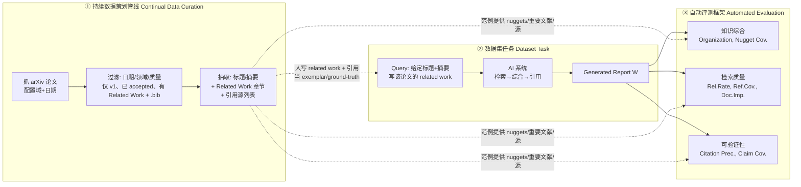

# 组会汇报 · DeepScholar-Bench

> 主讲提示：这篇是本库 D 组「怎么评 Deep Research」的核心标尺。它要回答一个比「能不能跑」更难的问题——**生成式研究综述系统到底好不好、好在哪、怎么量化**。开场先把张力立起来：现有评测要么用「短答案 QA」（不像真综述），要么用「专家手工数据集」（会过时、会污染），这篇用 **live + 自动化** 同时治这两个病。

---

## 1. 封面 · TL;DR

- **作者/出处**：Liana Patel, Negar Arabzadeh, Harshit Gupta, Ankita Sundar, Ion Stoica, Matei Zaharia, Carlos Guestrin（Stanford / UC Berkeley），arXiv 2508.20033 v2（2026-02-09）。代码数据：`github.com/guestrin-lab/deepscholar-bench`。
- **一段话**：一类新系统——**生成式研究综述 (generative research synthesis)**，如 OpenAI/Gemini/Anthropic/Grok/Perplexity 的 Deep Research，以及开源的 STORM、DeepResearcher、OpenScholar——号称能自动「检索实时网页 + 综合 + 带引用地写长报告」。但**怎么评**仍是开放难题。DeepScholar-Bench 把任务**具体化为「给定一篇论文的标题+摘要，生成它的相关工作 (related work) 章节」**，用一条**持续更新的自动数据管线**从近期高质量 arXiv 论文抓题、用论文作者真写的 related work 当**人写范例 (human-written exemplar)**，再用一套自动框架从**知识综合 (knowledge synthesis)、检索质量 (retrieval quality)、可验证性 (verifiability)** 三维、共 **7 个细粒度指标**打分。
- **三条带走的结论**：
  1. **远未饱和**：系统化评了 **14 个基线**，**没有任何系统**在全部指标上的**几何平均 (geometric mean)** 超过 **31%**（0.31）；OpenAI DeepResearch 最高，也只有 **0.309**（原文 Table 2）。
  2. **强项偏科**：现有系统能写得**条理清楚** (Organization)、检索**相关** (Relevance)，但在**覆盖关键事实** (Nugget Coverage)、**覆盖重要文献** (Reference Coverage)、**找到高被引重要源** (Document Importance) 上**普遍低于 0.40**——「会写、会查相关的，但抓不全关键、找不到经典」。
  3. **开源也能打**：作者顺手放出 **DeepScholar-ref**（建在 LOTUS 语义算子框架上的简单开源参考管线），多数指标上与 OpenAI DeepResearch **竞争**，可验证性最高 **6.3×** 更高，且 **4.3× 更便宜、2.28× 更快**（原文 §5.1.2、Table 6）。

> 主讲提示：把「31% 上限」这个数当成本篇的记忆锚点——它既是难度证明，也是「这条赛道还很空」的招募广告。

---

## 2. 问题与动机（why —— 本篇最该讲透的一节）

**新系统出现了，旧尺子量不了。** 生成式研究综述系统要同时干三件传统系统不会一起干的事（原文 §1）：
1. **检索 (retrieval)**：从一个**大、复杂、持续演变**的语料（live web）里收集信息；
2. **知识综合 (knowledge synthesis)**：把多源信息整合成**连贯的长答案**，既要带入通识，又要surface各源的关键发现；
3. **可验证性 (verifiability)**：给出**引用**，让读者能把每条陈述**追溯**回检索集里的可靠来源。

**为什么现有 benchmark 量不了这三件事？**（原文 §1、§6 把缺口讲得很清楚）

- **QA 类 benchmark**（SimpleQA、FRAMES、GAIA、BrowserComp、Natural Questions、HotpotQA…）：聚焦**短、事实性、易核验**的答案。它们**不反映**「从多源综合出长答案」这一研究综合的核心复杂度。
- **专家手工数据集**（ScholarQABench、OpenResearcher、DeepConsult、ResearcherBench、SurGE、LiveDRBench…）：能问开放式研究问题、给范例答案，但有三宗罪：(a) **会过时 (stale)**——新信息出现后内容outdated；(b) **会数据污染 (data contamination)**——新模型在网页快照（含这些公开数据集）上训练，等于「考题进了训练集」；(c) **造、维、更新成本极高**，难以规模化。
- **不需联网的长文生成 benchmark**（AcademicEval、LongBench-Cite、SciIG）：评长文生成，但**不要求 live web 检索**，恰好漏掉研究综合最关键的一环。

**这篇的赌注（核心动机）**：用「**live + 自动化**」一次性解决「不像真任务」和「会过时/会污染」两个病。
> **不靠人手维护一份会腐烂的考卷，而是让一条数据管线每月从最新 arXiv 自动出新题；不靠人手逐份打分，而是让自动指标holistic地量三维。**

为什么这两点是论点而不只是工程：
- **live（每月出新题，只用刚发布的论文）** → 题目永远比模型训练快照新，**结构性地**降低污染；同时反映「真实、及时」的研究问题。
- **自动化（指标 + 数据管线都自动）** → 才谈得上**可规模化、可持续更新、可被他人复现**到自己的领域/时间窗。

> 主讲提示：这一节把「QA 太短、专家集会烂、不联网漏检索」三条缺口讲清，后面的设计就全是对这三条的回应。和本库 9.4/9.6（Deep Research 评测线）直接对话——OpenScholar 给的是「专家集」路线，STORM 给的是「Wikipedia 式生成」路线，这篇说这两条都没真正测到「live 研究综合」。

---

## 3. 研究问题 / 核心 intention（形式化成一句话）

把问题压成一句：

> **我们能否构造一个「永不过时、抗污染、且holistic」的评测，来回答「一个系统在 live web 上做研究综合做得有多好」——并且把它具体落到「给定论文的标题+摘要 $d$，重建它的 related work 章节」这个有 ground-truth 范例的任务上？**

**任务形式化**（原文 §2）：给定一篇论文的**描述 (description)** $d$（实验中用其**摘要 abstract**），目标是**检索**出一组相关源 $S$，并**综合+引用**这些源，**生成 related work 章节** $W$。论文作者真写的 related work 即**人写范例**，提供「一个（但非唯一）高质量参考答案」。

它隐含的**假设**（很关键，埋批判线）：
- (a) related work 写作是研究综合的**有代表性子任务**——它天然要求检索、综合、引用三者齐备；
- (b) **人写范例**虽是「众多合理答案之一」，但足以当**锚点**来定义「重要文献集」「关键事实集」，从而支撑自动指标；
- (c) **LLM-as-a-judge** 的判断与人类专家**足够一致**，可当人评的可扩展代理（这点作者用人评专门验证，见 §5.3 / 原文 §A.3.4）。

> 主讲提示：强调「一个但非唯一参考答案 (one of many possible high-quality answers)」——这是后面所有指标设计的哲学基础，也是「为什么不能用精确匹配、只能用覆盖率/相关性」的根因。

---

## 4. 相关工作定位（站在谁肩上、和谁不同）

一张对比表（综合原文 §1、§6）：

| 方向 | 代表 | 任务形态 | 是否 live web | 是否抗污染/可持续 | 与本篇关系 |
|------|------|---------|:---:|:---:|------|
| 短答 QA / 事实性 | SimpleQA, FRAMES, GAIA, BrowserComp, NQ, HotpotQA | 短、易核验答案 | 部分 | 否 | **太短**，测不到长文多源综合 |
| 专家手工研究集 | ScholarQABench(OpenScholar), OpenResearcher, DeepConsult, ResearcherBench, SurGE, LiveDRBench | 开放研究问题+范例答案 | 因集而异 | **否**（会过时/污染/贵） | 本篇要替代的「会腐烂的考卷」 |
| 不联网长文生成 | AcademicEval, LongBench-Cite, SciIG | 长文，但**无需检索** | **否** | — | 漏掉检索这一核心环 |
| Wikipedia 式生成 | STORM | 写百科式文章 | 是 | — | 任务**不是**复杂研究综合 |
| 可验证性评测（被本篇借用） | Liu 2023 (Eval Verifiability), Gao 2023 (ALCE), Worledge 2024 | 引用-陈述蕴含 | — | — | **方法来源**：CitP/ClaimCov 的蕴含式定义 |
| 检索相关性范式（被本篇借用） | Cranfield/Voorhees, BEIR, UMBRELA, LLMJudge | IR 相关性判定 | — | — | **方法来源**：Relevance Rate 的 Cranfield 式分级 |
| live 数据管线（短答） | HoH, PAT-Questions, MAC | 自动出题 | 是 | 是 | 思路同源，但**只做短答 QA**，非长报告 |
| **本篇** | **DeepScholar-Bench** | **生成 related work（长文+引用）** | **是** | **是（每月自动出新题）** | **把上述各路的优点合一：live 出题 + holistic 自动评 + 长文综合任务** |

> 主讲提示：一句话概括——「**别人要么测短答、要么用会烂的专家集、要么不联网；这篇用 live arXiv 自动出题，把长文综合的三维一起测，并复用了 IR 相关性 + 引用蕴含两套成熟方法学**」。对 OpenScholar/STORM 的呼应：它俩既是被评的**基线**，也代表被这篇判定为「测不全」的两条旧评测路线。

---

## 5. 方法总览（big picture，先直觉后数学）

整体三大件（原文 Figure 1）：**持续数据策划管线 → 数据集任务 → 自动评测框架**。

**直觉**：
- **① 出题**像「每月找一批刚发表的好论文，把它们的相关工作章节挖掉，留下标题摘要当考题，挖出来的原文当标准答案」。
- **② 答题**像「让 AI 系统去 live web 查、综合、写出这一节并标引用」。
- **③ 评分**像「请一位（LLM）助教，从三个角度打分：写得清楚吗+关键事实抓全了吗（知识综合）；查的源相关吗+重要文献覆盖了吗+找到经典了吗（检索质量）；引用站得住吗+每句话都有据吗（可验证性）」。

**关键创新点**：人写范例不是用来做**字面比对**，而是用来**定义评测所需的标准集**——「该覆盖哪些关键事实 (nuggets)」「该引哪些重要文献 (important references)」「典型源该有多高被引」。这让「一个开放任务」获得了可量化的锚。

> 主讲提示：讲清「为什么挖 related work 而不是让它答一个研究问题」——because related work 章节天然自带「检索集（参考文献）+ 综合文本 + 引用」三件套，是研究综合任务里**最容易拿到 ground-truth 三件套**的切片。

---

## 6. 符号与术语表（后文统一用）

| 记号 / 术语 | 含义 |
|------------|------|
| $d$ | 论文**描述 (description)**，即 query；实验中用论文**摘要 abstract** |
| $W$ | 系统生成的 **related work 章节**（最终报告） |
| $S$ | 一份报告**检索/引用到的源集合 (retrieved reference set)**——实验中取报告里**任何有效 arXiv 链接**的集合（原文 §A.2） |
| $s$ | $S$ 中的单个源 (source) |
| $S^\*$ | **人写范例**的参考集（ground-truth 引用集） |
| $s^\*$ | $S^\*$ 中的单个源 |
| $E$ | 从人写范例标注出的**「重要 (important)」引用集**（$E\subseteq S^\*$） |
| **information nugget** | **信息要素**：与人写答案相关的一条**本质事实/组件**（从范例 related work 抽取） |
| $\mathrm{Rel}(s)\in\{0,1,2\}$ | 源 $s$ 的**分级相关性分数**（LLM-judge 给，Cranfield 式 0–2） |
| $\mathrm{num\text{-}cites}(s)$ | 源 $s$ 的**被引次数**（用 OpenAlex API 取） |
| $w$ | claim coverage 里的**滑窗半径 (window size)**，单位=句；主结果用 $w{=}1$ |
| $I[\cdot]$ | 指示函数（条件成立取 1，否则 0） |
| geo. mean | **几何平均**：7 个指标分数连乘开 7 次方，作综合分（惩罚偏科） |
| DeepScholar-ref | 作者放出的**开源参考管线**，建在 **LOTUS** 语义算子框架上 |

> 主讲提示：特别点名 $S$ 的实操定义——「报告里出现的任何有效 arXiv 链接」。这是个工程化近似，也是**局限来源**之一（非 arXiv 源、未给链接的引用会被漏掉）。

---

## 7. 数据集与「live 抗污染」设计（setting 之一：任务构造）

> 主讲提示：这一节回答硬性要求里的「live 如何避免数据污染」。这是这篇相对 OpenScholar/STORM 评测最关键的差异化卖点。

**数据管线三大设计目标**（原文 §2.1）：① **diverse**（跨领域多样）；② **recent**（用最新论文，既真实及时、又防污染）；③ **quality**（只要同行评审、会议 accepted 的稿子）。

**管线步骤**（原文 §2.1）：
1. 按**配置的 arXiv 域**（如 cs.ML）+ **配置的发表日期范围**加载论文；
2. **抗污染关键招**：当一篇论文有多个 arXiv 版本时，**只保留 v1**（避免后续版本内容混入训练快照）；
3. **质量过滤**：用 arXiv 元数据，只留标注为 "accepted"/"published" 的论文；**剔除**没有显式 "Related Work" 章节或没有规范 `.bib` 的论文；
4. 从 **LaTeX 源 + PDF** 双路抽取 related work 章节；清洗 LaTeX（去标签/注释）；
5. 抽出 related work 里所有引用，用 **arXiv + OpenAlex API** 回补摘要、作者、链接（含 non-arXiv 引用）。

**本次实例化：DeepScholar-June-2025**（原文 §2.2）：
- **日期窗**：2025 年 **4 月–6 月**（紧跟 Llama-4 的 2025-04-05 发布日，因 Llama-4-Scout 是主力开源被测模型——确保题目晚于模型，防泄漏）。
- **领域**：**18 个**不同 arXiv 域（cs.IR, cs.CV, cs.AI, cs.CL, cs.LG, cs.DC, cs.DB, cs.AR, cs.SD, cs.CR, cs.ET, cs.GR, cs.PL, cs.SY, cs.OS, cs.PF, cs.SE, cs.MM）。
- **规模**：最终 **63 篇** arXiv 论文，各配 **1 个 query + 1 份抽取出的人写范例**。
- **额外控制成本**：**剔除** related work 超过 **1000 词**的论文。
- **统计**：平均每个 related work 章节含 **23 条**唯一引用；其中 **>63%** 的被引文献能在 arXiv 上找到（这条支撑「把 $S$ 限定为 arXiv 链接」的合理性）。

**额外泛化集：DeepScholar-Nov-2025**（原文 §A.3.2）：**200 条** query、**>75** 个 arXiv 学科，跨 **CS / 物理 / 定量生物 / 经济 / 定量金融**。结论与 June-2025 一致——确认在**领域漂移 + 时间漂移**下结论稳健。

> 主讲提示：强调三个「防污染」机制叠加——**只用 v1 + 用刚发布的论文 + 过滤搜索结果晚于 query 论文发表日**（最后这条在 §5 实验设置里：检索时过滤掉发表晚于 query 论文的结果，防信息泄漏）。这是 live benchmark 的精髓：**题目永远比被测模型的知识截止"更新"**。

---

## 8. 评测框架总览：三维 7 指标（setting 之二：指标矩阵）

研究综合**缺乏单一 ground-truth**（许多合理答案），所以作者放弃精确匹配，改用 **7 个细粒度指标 / 3 维**（原文 §3、Table 1）。先给全景矩阵，再逐式精讲。

| 维度 | 指标（中/英） | 一句话测什么 | 计算性质 | 范围 |
|------|------|------|------|:---:|
| **知识综合** Knowledge Synthesis | 条理与连贯 **Organization & Coherency** | 答案的组织/连贯（与范例两两胜率） | LLM-judge 成对比较 | win-rate∈[0,1] |
| | 要素覆盖 **Nugget Coverage** | 覆盖了多少范例里的本质事实 | LLM 抽 nugget + 判在不在 | [0,1] |
| **检索质量** Retrieval Quality | 相关率 **Relevance Rate** | 检索源平均有多相关 | LLM-judge 分级(0–2) | [0,1] |
| | 参考覆盖 **Reference Coverage** | 覆盖了多少范例里的「重要」文献 | 确定性（集合交） | [0,1] |
| | 文献重要性 **Document Importance** | 检索源是否够「高被引/notable」 | 确定性（中位被引比） | [0,1] |
| **可验证性** Verifiability | 引用精确率 **Citation Precision** | 被引源里有多少真支撑了其陈述 | LLM 蕴含判定 | [0,1] |
| | 陈述覆盖 **Claim Coverage** | 有多少句子的陈述被引用充分支撑 | LLM 蕴含判定+滑窗 | [0,1] |

**综合分**：7 个指标取**几何平均**。为什么用几何平均而非算术平均？——**几何平均对偏科惩罚更狠**：任一指标接近 0，综合分就被拽向 0。这正契合「好综述必须三维都不差」的判据，也是「31% 上限」显得低的原因（任何系统只要某维很差，几何平均就上不去）。

> 主讲提示：这张矩阵是全篇骨架，建议组会时投到屏幕全程留着。注意 **2 个指标是确定性 (deterministic) 计算**（Reference Coverage、Document Importance），其余 5 个靠 **LLM-as-a-judge**——后者必须做人评验证（§5.3），这是 benchmark 可信度的命门。

---

## 9. 维度一：知识综合（Knowledge Synthesis，§3.1）

**why**：综述的根本价值是「**surface 关键事实 + 写成连贯整体**」。所以拆成两面：写得顺不顺（Organization）、抓没抓住关键事实（Nugget Coverage）。

### 9.1 Organization & Coherency — 成对胜率

**直觉**：「组织好不好」很主观、没有绝对标尺；于是不打绝对分，而是让 LLM-judge 把**系统报告 vs 人写范例**做**成对比较**，谁更有条理谁赢——用胜率 (win-rate) 当分数。为消除位置偏好 (position bias)，每对报告**调换顺序各judge一次**。

记号：设对第 $q$ 条 query，系统报告为 $W_q$，人写范例为 $W_q^\*$；$\mathrm{judge}(\cdot,\cdot)\in\{\text{win},\text{lose},\text{tie}\}$ 为去偏后的成对判定。Organization 分即胜率（含 tie 计入，见原文 §A.2「win rate including ties」）。

读出什么：分数 = 「系统报告在组织性上**不输给**人写范例的比例」。注意它是**相对人写范例**的相对量，不是绝对质量分。判 judge 的具体打分准则见原文 **Box 1**（只看内容不看格式，评：逻辑结构 / 段落内聚 / 清晰无冗余 / 路标 signposting；**强制不许 tie**，二选一）。

> 主讲提示：埋一条批判线——「与人写范例的胜率」会随**范例本身质量**波动；且强模型常能写得**比人更有条理**（见 §11 结果：o3/Claude/Gemini 的 Org 接近甚至超过人写）。条理高≠内容对，下一指标补这个洞。

### 9.2 Nugget Coverage — 本质事实召回

**直觉**：写得漂亮但漏了关键事实没用。于是把范例的 related work **拆成一颗颗「信息要素 (information nugget)」**（一条本质事实/组件），再看生成报告里**命中了多少颗**——本质是「关键事实的召回率」。方法沿用 Pradeep 2025（"The Great Nugget Recall"）的自动 nugget 流程。

记号（先定义）：对 query $q$，从人写范例抽出 nugget 集 $\mathcal{N}_q=\{n_1,\dots,n_{m}\}$；$\mathrm{present}(n,W)\in\{0,1\}$ 表示 nugget $n$ 是否出现在报告 $W$ 中（LLM 判定）。

$$ \text{NuggetCov}(W) \;=\; \frac{1}{|\mathcal{N}_q|}\sum_{n\in\mathcal{N}_q} \mathrm{present}(n, W) $$

读出什么：范例里的关键事实，报告命中的比例。原文用 **strict all 口径**（一颗 nugget 的所有组件都被支撑才算命中，原文 §A.2）。**这是最能区分系统的指标之一**——主结果里所有先验系统都 **<0.40**（§11）。

> 主讲提示：这是「会写 vs 会研究」的分水岭。强调它沿用了独立的 nugget 方法学 [Pradeep 2025]，不是作者自创——增强可信度。

---

## 10. 维度二：检索质量（Retrieval Quality，§3.2）—— 三个公式核心

**why**：live web 检索和传统 IR 很不一样——**没有封闭语料、没有 gold label**，人写范例只是「一个」合理参考集，可能有许多同样高质量的其它集。所以作者从三个互补角度量检索集 $S$：**相关吗 (Relevance Rate)、覆盖关键文献吗 (Reference Coverage)、找到重要源吗 (Document Importance)**。

### 10.1 Relevance Rate（相关率，Eq. 见 §3.2）

**直觉**：先问最基本的——检索回来的源，**平均有多相关**？借 **Cranfield 模型**（IR 评测经典）：相关性是「给定 query 时单篇文档的相关程度，与其它文档无关」。用 LLM-judge 给每个源打 **0–2 分级相关分**（沿用 UMBRELA/LLMJudge 等近期工作）。

记号（先定义）：检索集 $S$；$\mathrm{Rel}(s)\in\{0,1,2\}$ 为源 $s$ 的 LLM 分级相关分（2=最相关）。归一化时除以 $2|S|$（把最高分 2 归一到 1）。

$$ RR(S) \;=\; \frac{1}{2\,|S|}\sum_{s\in S}\mathrm{Rel}(s) $$

读出什么：$RR=1$ 意味着**每个**检索源都拿满分 2（极相关）；$RR$ 越高，检索集整体越对题。判 judge 的准则见原文 **Box 2**（只看标题+摘要判 relevant=1/not=0……注意正文 Box 2 是 0/1 二元版，而式中 $\mathrm{Rel}\in0\text{–}2$ 为分级版——原文两处口径略有出入，**主结果以 0–2 分级式为准**，此处按原文如实标注差异）。

> 主讲提示：诚实指出 Box 2（二元）与 Eq.（0–2 分级）的措辞不一致——「原文此处口径有小出入」，区分「论文写法」与「我们读到的」。结果上 Relevance Rate 是系统们表现**最好**的检索指标（DeepResearch 0.629，甚至超人写范例 0.585）。

### 10.2 Reference Coverage（参考覆盖，Eq. 见 §3.2）

**直觉**：相关还不够——好综述得覆盖那批「**必须引**」的核心文献。难点是「核心集」怎么定义。作法：把人写范例的**每条引用**人工/LLM 标成 **"important" 或 "not-important"**（"not-important" = 「换一篇也行、可省略」的引用），得到重要集 $E$；再看检索集 $S$ 覆盖了 $E$ 的多少。**这是确定性集合运算，不靠 judge 打分。**

记号（先定义）：$E$=人写范例里被标为「重要」的引用集；$S$=系统检索集；$I[s\in E]$ 指示 $s$ 是否命中重要集。

$$ RC(S,E) \;=\; \frac{1}{|E|}\sum_{s\in S} I[\,s\in E\,] $$

读出什么：系统抓回了多少**该引的核心文献**——本质是「重要文献召回」。原文坦言这是个**保守 (conservative)** 指标：人评显示 LLM 给「重要」打标偏少（漏标 24.2%，原文 Table 4 / §A.3.4），即真实重要文献被低估，所以 $RC$ 测的是「**部分**真正重要文献的召回」。主结果里普遍 **<0.20**（最难指标之一）。

> 主讲提示：强调「important 的定义=不可被替代」。并点出它的诚实自评——「我们这个指标偏保守，是 recall 的下界」。

### 10.3 Document Importance（文献重要性，Eq. 见 §3.2）

**直觉**：理想综述不仅覆盖关键文献，还应多引**notable、高被引**的源（奠基性论文）。用**被引数**当「重要性」代理：比较「系统检索集 $S$ 的被引中位数」与「人写范例集 $S^\*$ 的被引中位数」，上限截到 1（达到人类水平即满分）。

记号（先定义）：$\mathrm{num\text{-}cites}(s)$ 为源 $s$ 的被引数（OpenAlex 取）；$\mathrm{median}\{\cdot\}$ 取中位数；上界 $\min(\cdot,1)$。

$$ DI(S,S^\*) \;=\; \min\!\left(\frac{\mathrm{median}\{\mathrm{num\text{-}cites}(s)\mid s\in S\}}{\mathrm{median}\{\mathrm{num\text{-}cites}(s^\*)\mid s^\*\in S^\*\}},\; 1\right) $$

读出什么：$DI=1$ 表示系统引的文献**和人类一样有分量**（中位被引追平范例）；<1 表示系统倾向引「冷门」源。用**中位数**而非均值，是因为被引分布**极度右偏**（少数论文 >1万 引会把均值拉爆——原文 Figure 7：全体均值 478.3 但中位仅 31；arXiv-only 均值 647.6 中位 36），中位数更稳健。主结果里 DeepResearch 仅 **0.124**——「找得到相关的，找不到经典的」。

> 主讲提示：把这三个检索指标连起来讲——**相关(RR) ≠ 覆盖关键(RC) ≠ 够分量(DI)**，三者正交。结果显示系统在 RR 上接近/超人，但 RC、DI 上惨败：**「能查到相关的边角料，抓不全核心、找不到经典」**——这是本篇最有信息量的诊断。

---

## 11. 维度三：可验证性（Verifiability，§3.3）—— 引用蕴含

**why**：综述要让人**信得过**——每条陈述得有据可查。沿用「生成式搜索引擎可验证性评测」(Liu 2023) 与 ALCE (Gao 2023) 的**蕴含 (entailment)** 思想：用 LLM 判「被引源是否支撑了陈述」。拆两面：引用**准不准** (Citation Precision)、陈述**有没有被覆盖** (Claim Coverage)。

### 11.1 Citation Precision（引用精确率）

**直觉**：一条引用「精确」当且仅当**被引源至少支撑了它所在句子里的一条陈述**（不是为引而引）。对整篇报告，把所有引用的精确度**平均**。

记号：报告里引用集合为 $C=\{c_1,\dots\}$；$\mathrm{supp}(c)\in\{0,1\}$ 表示引用 $c$ 的源是否支撑其所在句的至少一条 claim（LLM 蕴含判定，prompt 见原文 **Box 3**）。
$$ \text{CitationPrecision} \;=\; \frac{1}{|C|}\sum_{c\in C}\mathrm{supp}(c) $$
读出什么：被引的源里，**真正支撑了陈述**的比例。越高=越少「挂羊头」式引用。

### 11.2 Claim Coverage（陈述覆盖，含两处关键改造）

**直觉**：反过来问——报告里的**陈述**有多少是「**被引用充分支撑**」的？句级打分：一个句子的被引源若支撑了该句**所有** claim，则该句得 1，否则 0；全篇句级分**取平均**。

**为长文综合做的两处改造**（原文 §3.3，very important）：
1. **滑窗 (sliding window) 放宽**：长报告里支撑某句的引用可能落在**邻近句**。于是对每句，允许其引用落在「**前后各 $w$ 句**」的窗口内即算支撑（不必同句）。主结果用 $w{=}1$；附录 §A.4.2 做了 $w{=}0$（最严，仅同句）到 $w{=}5$ 的敏感性——窗口越大覆盖越高（Figure 6），体现「**严精确 ($w{=}0$) vs 宽召回 ($w{\ge}1$)**」的权衡。
2. **query 当隐式引用**：因为 query 本身（论文标题+摘要）就描述了这篇论文，故把它视作**每句的隐式被引参考**。

记号：报告句集 $\mathcal{T}=\{t_1,\dots,t_L\}$；$\mathrm{cov}_w(t)\in\{0,1\}$ 表示句 $t$ 的所有 claim 是否被「同句或前后 $w$ 句窗口内 + query」的引用充分支撑。
$$ \text{ClaimCoverage}_w \;=\; \frac{1}{L}\sum_{t\in\mathcal{T}}\mathrm{cov}_w(t) $$
读出什么：报告里**有据可依**的句子占比。$w{=}1$ 是主结果口径。

> 主讲提示：注意一个反直觉发现——**人写范例的 CitP/ClaimCov 反而偏低**（Table 2：人写 CitP 0.900¹、ClaimCov 0.850¹，且带脚注¹说明这是「人工校准小样本的几何均值估计」）。原因（原文脚注¹）：对人写范例，**缺乏指向每条引用具体支撑文字片段的 gold label**，只能用「标题+摘要」当代理来判蕴含，**低估**了人类真实可验证性；而对 LLM 系统，能拿到它引用时实际喂进去的精确片段。**所以这两个指标在「人 vs 机」之间不完全可比**——这是诚实但容易被问的点。

---

## 12. 实验设置（setting / params / baseline / 算力成本，写全）

> 主讲提示：硬性要求里「baseline 系统 + 人评设置」在这里集中交代。

**统一控制**（原文 §5、§A.2）：
- **检索语料统一**：所有系统**只允许通过 arXiv API** 访问 web（控制检索语料，公平对比）。
- **防泄漏**：检索时**过滤掉发表晚于 query 论文发表日**的结果。
- **query**：用论文**摘要**当 $d$。
- **judge 模型**：Nugget Coverage 用 **GPT-4.1-2025-04-14**；Organization / Relevance Rate / Reference Coverage / Citation Precision / Claim Coverage 用 **GPT-4o-2024-08-06**（原文 §A.2）。Organization 报 win-rate(含 tie)；Nugget 用 strict-all；Claim Coverage 用 $w{=}1$。Document Importance 用 **OpenAlex** 取被引数（确定性）。

**14 个被测系统 / 5 类**（原文 §5、Table 2、§A.5）：

| 类别 | 系统（底座模型） | 关键配置 |
|------|------|------|
| **开源研究系统** | DeepResearcher (Llama-4) | 端到端 RL 训练 agent；检索深度 10/query，≤10 步（原文 §A.5.1） |
| | STORM (Llama-4) | 多视角模拟对话+大纲+grounding；3 轮/3 视角/3 query，top-15（§A.5.4） |
| | OpenScholar (Llama-4) | 4 阶段 RAG；peS2o 预索引(4500万)+pes2o_contriever+OpenScholar_Reranker，top_n=30（§A.5.2） |
| **搜索 agent** | Search Agent ×5：Llama-4 / GPT-4.1 / o3 / Claude-opus-4 / Gemini-2.5-pro | ReAct(smolagents)+ODS prompt；30 结果/query，≤5 步（§A.5.3） |
| **商用系统** | OpenAI DeepResearch | 基于 o3-deep-research，自定义 MCP 只搜 arXiv，n=30（§A.5.5） |
| **作者参考管线** | DeepScholar-ref ×5：Llama-4 / GPT-4.1 / GPT-4.1+o3 / GPT-4.1+Claude / GPT-4.1+Gemini | LOTUS 语义算子；Q=2, search_K=50, N=2, K=30；≤2 轮检索（§A.6） |

被测底座模型具体版本：`Llama-4-Scout-17B-16E-Instruct`（4×A100 vLLM 自部署）、`GPT-4.1-2025-04-14`、`o3-2025-04-16`、`Claude-opus-4-20250514`、`Gemini-2.5-pro`、`o3-deep-research`。

**人评设置**（原文 §5.3 / §A.3.4，硬性要求点名）：
- **11 名标注员**，全部为**北美四所研究型大学的 CS 博士生**；
- 共 **300+ 条人评**，用于验证 knowledge synthesis 与 retrieval quality 的 LLM-judge；
- 三项任务取**人类多数票 vs LLM-judge** 做混淆矩阵（原文 Table 4）：Organization 成对偏好、Nugget 重要性（vital/okay/irrelevant）、Reference 重要性（important/not）。

**成本/效率**（原文 §5.1.2、Table 6）：DeepScholar-ref (GPT-4.1, o3) 比 OpenAI DeepResearch **4.3× 便宜、2.28× 快**。

---

## 13. 主要结果（数字 + 解读，别只贴表）——原文 Table 2

**核心表（DeepScholar-June-2025，节选关键行；加粗=最佳基线，下划线=次佳；带 \* = 与次佳有统计显著差异 paired two-tailed t-test, p<0.05）**：

| 系统 | Org. | Nug.Cov. | Rel.Rate | Ref.Cov. | Doc.Imp. | Cite-P | Claim Cov.(w=1) | **Geo.Mean** |
|------|:---:|:---:|:---:|:---:|:---:|:---:|:---:|:---:|
| *人写范例 Human Exemplars* | .500 | 1.000 | .585 | 1.000 | 1.000 | .900¹ | .850¹ | **.782¹** |
| **开源研究系统** | | | | | | | | |
| DeepResearcher (Llama-4) | .206 | .230 | .385 | .047 | .008 | .312 | .396 | .137 |
| STORM (Llama-4) | .119 | .183 | .218 | .003 | .006 | .238 | .586 | .073 |
| OpenScholar (Llama-4) | .309 | .278 | .017 | .008 | .013 | .010 | .138 | .042 |
| **搜索 agent** | | | | | | | | |
| Search Agent (Llama-4) | .151 | .193 | .445 | .060 | .009 | .316 | .368 | .135 |
| Search Agent (GPT-4.1) | .556 | .265 | .490 | .050 | .009 | .498 | .470 | .186 |
| Search Agent (o3) | .849 | .348 | .610 | .165 | <u>.026</u> | .425 | .495 | <u>.287</u> |
| Search Agent (Claude) | .698 | .307 | .583 | .131 | .008 | **.701** | **.760** | .256 |
| Search Agent (Gemini) | .706 | .277 | .583 | .061 | .010 | .415 | .398 | .196 |
| **商用系统** | | | | | | | | |
| OpenAI DeepResearch | **.857** | **.392**\* | <u>.629</u> | **.187**\* | **.124**\* | .399 | .138 | **.309**\* |
| **DeepScholar-ref（作者）** | | | | | | | | |
| DeepScholar-ref (Llama-4) | .206 | .241 | .436 | .103 | .008 | .674 | .851 | .195 |
| DeepScholar-ref (GPT-4.1) | .809 | .348 | .590 | .166 | .008 | .788 | .899 | .285 |
| DeepScholar-ref (GPT-4.1, o3) | **.857** | .384 | **.645**\* | <u>.167</u> | .007 | .824 | .760 | .285 |
| DeepScholar-ref (GPT-4.1, Claude) | .698 | .307 | .610 | .152 | .009 | **.944**\* | .895 | .286 |
| DeepScholar-ref (GPT-4.1, Gemini) | .770 | .331 | .590 | .181 | .006 | .904 | **.937**\* | .282 |

**怎么读这张表（原文 §5.1.1–5.1.2）**：

1. **没人过 0.31**：最高几何平均=OpenAI DeepResearch 的 **0.309**，远未饱和。多项关键指标（Nugget Cov.、Ref.Cov.、Doc.Imp.）**所有系统 <0.40**——印证「navigate live web + 抓覆盖/重要性 + surface 关键事实」的固有难度。
2. **知识综合**：DeepResearch 在 Org.(0.857) 与 Nug.Cov.(0.392) 都最强；o3/Claude/Gemini 的搜索 agent **Org. 接近甚至超过人写范例(0.500)**——**强模型能写得比人更有条理**。但 **Nug.Cov. 全员 <0.40**：能写好看，**抓不全关键事实**。
3. **检索质量**：DeepResearch 的 **Rel.Rate 0.629 超过人写(0.585)**，但 **Ref.Cov. 0.187 / Doc.Imp. 0.124 极低**——**「能检索到相关源，找不全notable的重要源」**，离人类专家差距最大。
4. **可验证性**：搜索 agent (Claude) 引用最强（CitP 0.701 / ClaimCov 0.760）；DeepResearch 在 CitP/ClaimCov 上**被 GPT4.1/o3/Claude/Gemini 搜索 agent 全面超过**，且无人在「非 ref 管线」里 CitP 破 0.50 / ClaimCov 破 0.60。人写范例 CitP/ClaimCov 偏低是测量代理所致（见 §11 脚注¹）。
5. **DeepScholar-ref 很能打**：相比 OpenAI DeepResearch，DeepScholar-ref(GPT-4.1, o3) 在 Org./Nug.Cov./Rel.Rate/Ref.Cov./CitP/ClaimCov 上**追平或更高**，可验证性最高 **6.3×**（但 **Doc.Imp. 仍相对低**）；且 **4.3× 便宜、2.28× 快**。相对搜索 agent（同主模型、5 个平均）：Org. +1.18×、Nug.Cov. +1.17×、Rel.Rate +1.06×、Ref.Cov. +2.03×、CitP +1.83×、ClaimCov +1.86×。相对开源研究系统（均 Llama-4，逐指标对最佳）：Rel.Rate +1.09×、Ref.Cov. +2.18×、CitP +2.08×、ClaimCov +1.41×。

> 主讲提示：把结论压成一句——**「现有系统会写、会查相关，但抓不全关键事实、找不到经典文献；可验证性参差；没有一个接近人类专家」**。DeepScholar-ref 的价值在于证明：**用 LOTUS 的「语义过滤+top-k 排序+聚合」算子，开源也能逼近商用**，且更省更快。这条直通本库 9.4/9.6——评测拉开了「检索覆盖/重要性」这块所有系统的共同短板。

---

## 14. 消融与分析（原文 §5.2 / Table 3）—— 瓶颈到底在检索还是综合？

**消融设计**：固定 DeepScholar-ref（GPT-4.1, Claude 与 Llama-4 两个版本），换 **4 种检索 API**：`arxiv.org`（主结果默认）、`parallel.ai`、`tavily.com`，外加**两种 oracle 检索**——
- **Oracle Retrieval (arXiv)**：直接喂范例里重要文献的 **arXiv** 子集；
- **Oracle Retrieval (All)**：直接喂范例里**全部**重要文献。

**关键发现（Table 3）**：
- DeepScholar-ref (GPT-4.1, Claude) 用 oracle 检索时，**检索质量与可验证性几乎饱和**（如 Ref.Cov. 升到 1.000、Doc.Imp. 升到 0.822、CitP 0.955）；但用真实 API（arxiv/parallel/tavily）时**低得多**。
- 这说明：**瓶颈同时在检索与知识综合**——尤其 **Ref.Cov. 与 Doc.Imp. 的巨大落差**证明系统**navigate live web 找回「多样且重要的源」的能力不足**。
- oracle 检索能把 Nug.Cov. 提升最多 **1.62×**；但**即使喂了完美源，Nug.Cov. 仍远未饱和**——证明**AI 即便拿到高质量源，仍不擅长 surface 关键事实**（综合能力本身也是瓶颈）。

> 主讲提示：这是全篇最有方法论价值的实验——**用 oracle 把「检索」和「综合」解耦**。结论：**两块都是短板，且综合短板即使在完美检索下依然存在**。这给后续系统指了两条独立改进方向。

**LLM-judge 可信度（人评，原文 §5.3 / Table 4）**：人类多数票 vs LLM-judge 一致率——**Organization 71.43%**、**Nugget labeling 83.33%**、**Reference importance 65.9%**。混淆矩阵关键读数：
- Organization 的分歧（人选范例 vs LLM 选生成 反之）较少，且 LLM 误判在两方向**大致均衡**（无系统性偏向）；
- Nugget：人类多数票认为**所有 LLM 生成的 nugget 都相关**（幻觉罕见）；假阳/假阴均 **<10%**；
- Reference importance：假阴率仅 **9.8%**（LLM 很少错把重要标成不重要），但更大的离对角质量 **24.2%** 来自 LLM **漏标**重要文献——故 **Ref.Cov. 是保守指标**（只测「部分」真正重要文献的召回）。
- 另：nugget **precision 0.83、grounded-ness 1.0**（生成的 nugget 准确且无幻觉，原文 §A.3.5）；换 3 个 judge（GPT-4o / Llama-4 / DeepSeek-R1-Distill-Qwen-32B）相关性多 >0.9，最敏感的是 nugget coverage（原文 §A.3.6）。

---

## 15. 局限与批判（诚实，区分「论文宣称」与「质疑」）

**原文自陈/可推断的局限**：
1. **可验证性「人机不可比」**：人写范例缺「引用→支撑片段」的 gold label，CitP/ClaimCov 用标题+摘要当代理，**系统性低估人类**（原文 Table 2 脚注¹明说）。所以「系统 CitP 超过人写」不能简单解读为「比人更可靠」。
2. **检索集 $S$ 的近似**：实操把 $S$ 定为「报告里任何有效 **arXiv** 链接」——**漏掉 non-arXiv 源、未给链接的引用**；虽 >63% 引用在 arXiv，但仍是有偏估计。
3. **Reference Coverage 偏保守**：LLM 漏标重要文献 24.2%（Table 4），$RC$ 是 recall 下界。
4. **Document Importance 用被引数当代理**：被引极右偏（均值被少数 >1万 引论文拉爆），且**新论文被引天然少**——用中位数缓解但仍是粗代理；原文 §A.3.3 也显示 **Doc.Imp. 对 query 措辞最敏感**（abstract vs Key-Idea vs RQ 的相关在 Doc.Imp. 上**不显著**，尽管量级大 r=0.992）。
5. **Relevance Rate 口径出入**：正文 Box 2（0/1 二元）与 Eq.（0–2 分级）措辞不一致（§10.1）。
6. **任务范围**：只测「生成 related work」一种综合任务、且**只经 arXiv API** 检索——不能直接外推到「开放 web 多模态深研」。related work 也被截到 <1000 词（控成本，但偏向短综述）。
7. **judge 依赖**：5/7 指标靠 LLM-judge，虽有人评背书（一致率 65.9%–83.33%），但**仍是 LLM 评 LLM**——一致率并非 100%，Reference 维只有 ~66%。

**社区可能追加的质疑**：
- 「胜率 vs 人写范例」让 Organization **天花板=范例质量**，且强模型常超人——这个指标对**顶部系统区分度下降**。
- 几何平均被 Doc.Imp.（人人 <0.13）这种「地板指标」主导，可能**掩盖**其它维度的真实差异——「31% 上限」有多少是被单一最难指标拽下来的？
- live 防污染靠「只用 v1 + 新论文 + 过滤晚于发表日的检索结果」，但**模型预训练快照若已含该论文 v1**仍可能泄漏；且「accepted」过滤依赖 arXiv 元数据的准确性。

> 主讲提示：把「CitP/ClaimCov 人机不可比」和「几何平均被地板指标主导」两条单独强调——这是组会上最可能被挑战、也最该诚实承认的两点。

---

## 16. 在 auto-research 版图的位置

- **阶梯定位**：在 Tool→Analyst→Scientist 阶梯里，DeepScholar-Bench 是**给「Analyst 级（研究综合/Deep Research）」系统量体温的标尺**——它不造系统、只造**尺**（外加一个轻量参考管线 DeepScholar-ref）。它把「自动科研」里**最接近能落地**的一环（写 related work）单独拎出来严格评测。
- **承上启下**：
  - ↔ **OpenScholar / STORM**：二者既是被评**基线**（均跌到几何均值 <0.05/0.08），又代表被本篇判定「测不全 live 综合」的两条旧评测路线——**正面呼应硬性要求里的对齐**。OpenScholar 的 peS2o 预索引在「限 arXiv + live」设定下相关率崩到 0.017，暴露「封闭语料系统」在 live 设定的水土不服。
  - → **本库 9.4 / 9.6（Deep Research 评测线）**：本篇提供「**三维 7 指标 + live 数据管线**」的可复用模板；其「检索覆盖/重要性是共同短板」的诊断，是 9.4/9.6 讨论「Deep Research 到底差在哪」的实证基座。
  - ← 与 **AI-Scientist 线**对照：AI-Scientist 用「LLM 自评审」闭环（自评、循环性弱），本篇恰恰示范了**第三方、可验证、有人评背书的外部评测**该长什么样——是对「自称 Scientist 都自评」病症的一剂解药（独立验证）。
- **方法学血缘**：检索维借 **Cranfield/BEIR/UMBRELA**（IR），可验证维借 **Liu2023/ALCE**（引用蕴含），nugget 借 **Pradeep2025**——它是把成熟 IR/可验证性方法学**迁移到「生成式研究综述」**的一次系统整合。

---

## 17. 复现与可用性

- **开源**：代码+数据 `github.com/guestrin-lab/deepscholar-bench`；脚本可配置**自定义域/日期窗**自造数据集，且作者承诺**每月发布新 query**。
- **能不能单卡跑**：评测本身主要是 **API 调用**（judge=GPT-4o/GPT-4.1，被测=各家 API）；自部署的 Llama-4-Scout 用 **4×A100 vLLM**——**非单卡**（17B-16E MoE）。但只评商用/API 系统则无需本地 GPU。
- **DeepScholar-ref 参数**（原文 §A.6）：建在 **LOTUS**（语义算子）+ Sem-Filter/Sem-TopK/Sem-Agg；默认 **Q=2, search_K=50, N=2, K=30**，≤2 轮检索。比 OpenAI DeepResearch **4.3× 便宜、2.28× 快**。
- **坑**：(1) 检索须统一限到 **arXiv API** 才能复现主结果；(2) judge 模型版本要对齐（Nugget=GPT-4.1、其余=GPT-4o），换 judge 结论大体稳但 **nugget coverage 最敏感**；(3) 防泄漏的「过滤晚于发表日」要在检索层实现；(4) $S$ 抽取依赖「有效 arXiv 链接」解析，非 arXiv 源会漏。

---

## 18. 组会讨论问题（5–8 个）

1. **几何平均 vs 算术平均**：用几何平均放大偏科惩罚，但 Doc.Imp.（人人 <0.13）几乎成「地板」，会不会让综合分主要由单一最难指标决定？换成**加权几何平均**或**剔除地板指标**，排名会怎样变？
2. **CitP/ClaimCov 人机不可比**：既然人写范例缺 gold 支撑片段、被系统性低估，那「系统可验证性超过人类」这句还能不能说？该怎么补一个**人机可比**的可验证性指标？
3. **live 防污染够不够**：「只用 v1 + 新论文 + 过滤晚于发表日的检索」三招，能挡住「模型预训练快照已含该论文 v1」吗？要不要引入**完全未公开的私有题集**做对照？
4. **Organization 以人写范例为天花板**：强模型 Org. 已超人，这个「胜率」指标对**顶部系统**还有区分度吗？是否该换**绝对 rubric 打分**？
5. **检索 vs 综合谁是主瓶颈**：oracle 实验显示「喂完美源后 Nug.Cov. 仍不饱和」。如果你只能改进一处（更强检索 or 更强综合），先投哪个？怎么设计实验估各自的边际收益？
6. **指标会不会被刷 (gaming)**：Claim Coverage 用 $w{=}1$ 滑窗 + query 当隐式引用——系统会不会学会「狂塞引用/把 query 关键词复述」来虚高 ClaimCov？$w{=}0$ 严口径下排名会怎样翻盘？
7. **限 arXiv 的代价**：把检索锁死在 arXiv API，对 OpenScholar（peS2o 预索引）这类系统是否不公平（其 Rel.Rate 崩到 0.017）？「公平统一语料」与「各展所长」哪个更该是 benchmark 的目标？
8. **对 9.4/9.6 的启示**：这套「三维 7 指标」能不能直接搬去评**通用 Deep Research**（非 related work）？哪些指标可迁移、哪些（如 Reference Coverage 依赖范例引用集）会失效？

---

## 19. 一页速记（汇报当天速览）

- **是什么**：第一个 **live + 自动化**评测「生成式研究综述」的 benchmark。任务=**给标题+摘要，重建论文的 related work 章节**；用论文作者真写的 related work 当 ground-truth 范例。
- **怎么防污染**：数据管线**只用 v1 论文 + 刚发布的新论文 + 检索时过滤晚于发表日的结果**；每月自动出新题。June-2025 实例=**63 篇 / 18 域 / 4–6 月 / related work <1000 词 / 均 23 引 / >63% 在 arXiv**。
- **三维 7 指标**：知识综合〔Organization 成对胜率、Nugget Coverage 关键事实召回〕；检索质量〔Relevance Rate $\frac{1}{2|S|}\sum \mathrm{Rel}(s)$、Reference Coverage $\frac{1}{|E|}\sum I[s\in E]$、Document Importance 中位被引比〕；可验证性〔Citation Precision 引用蕴含、Claim Coverage 句级蕴含+滑窗 $w{=}1$+query 隐式引用〕。综合分=**几何平均**。
- **关键数**：**无系统几何均值 >0.31**；OpenAI DeepResearch 最高 **0.309**；人写范例 **0.782**。系统在 **Org./Rel.Rate** 接近甚至超人，但 **Nug.Cov./Ref.Cov./Doc.Imp. 普遍 <0.40**（Doc.Imp. 人人 <0.13）。
- **DeepScholar-ref**（开源参考管线，LOTUS 语义算子，Q=2/K=50/N=2/K=30）：多指标追平/超 OpenAI DeepResearch，可验证性最高 **6.3×**，且 **4.3× 便宜、2.28× 快**。
- **人评背书**：11 名 CS 博士生、300+ 标注；一致率 Org. 71.43% / Nugget 83.33% / Reference 65.9%。
- **一句话结论**：**「会写、会查相关，但抓不全关键事实、找不到经典文献、可验证性参差——离人类专家还很远；这条赛道远未饱和。」**

> 主讲提示：收尾回到那句话——**「它不造系统，它造尺；而这把尺照出了所有 Deep Research 系统的共同盲区：覆盖关键与重要文献。」** 直连 9.4/9.6，与 OpenScholar/STORM 既对齐又超越。
