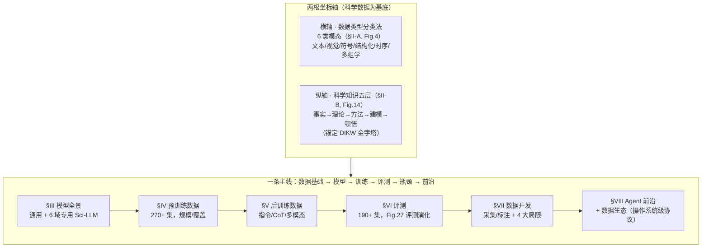
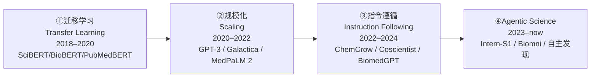
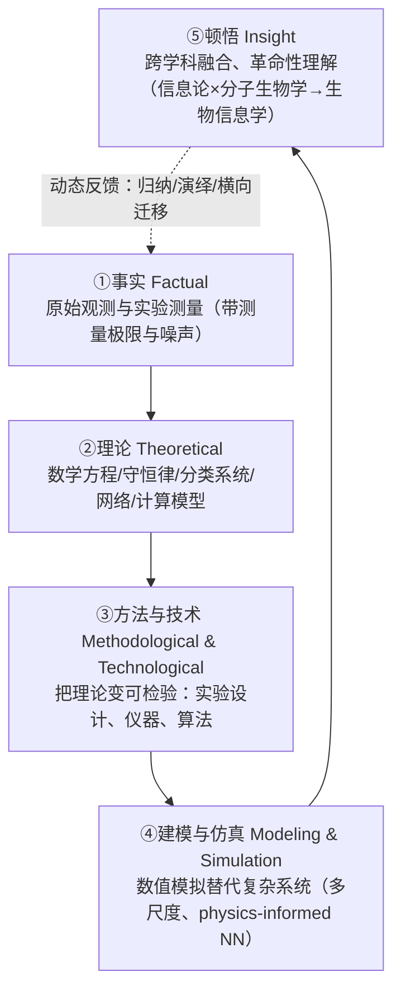
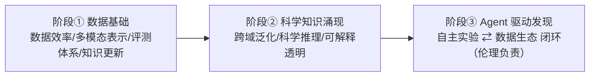

# 组会汇报 · A Survey of Scientific LLMs：从数据基础到 Agent 前沿

> 本篇是**第二批（v2）综述标杆**：在 v1 全部硬性要求之上，额外补 **Why 三连**（问题层/设计层/结果层）与 **`## ★ 对我们的启发（Inspires Us）`** 专节。
> 结构对齐 [`2408.06292-ai-scientist-v1.md`](2408.06292-ai-scientist-v1.md)，新增两维对齐 [`2506.13131-alphaevolve-deepmind.md`](2506.13131-alphaevolve-deepmind.md)。
> **综述特例**：v1 骨架的「方法细节 7–12」替换为「**分类法总览 / 各支展开**」；`setting` 改为「**覆盖范围 / 纳入标准 / 时间线**」。

---

## 1. 封面 · TL;DR

- **标题 / 出处**：*A Survey of Scientific Large Language Models: From Data Foundations to Agent Frontiers*，arXiv **2508.21148**（v2, 2025-10-18）。
- **作者 / 权威性来源**：**上海人工智能实验室**牵头，作者列上百人、横跨 27 家机构（复旦、上交、UCL、Stanford、Caltech、剑桥、JHU……）。它**不是一篇普通 arXiv 综述**——其权威性有三个来源：① 大厂 + 顶尖高校联合背书；② 配套开源仓库 `Awesome-Scientific-Datasets-and-LLMs` 把 270+ 训练集 / 190+ 评测集做成可检索资源；③ 它把作者自家旗舰模型 **Intern-S1**（科学多模态 MoE，241B 参数 / 28B 激活 / 5T+ tokens）作为「Agentic Science」阶段的代表实证（原文 §I、§III-B）。
- **一段话（这篇在干什么）**：以往「科学 LLM」综述要么按**学科**编目（生物化学一篇、医学一篇），要么按**技术**编目（agent 一篇、benchmark 一篇）——都是某一时刻的快照。这篇换了一根**反常但更本质的主轴**：**以「科学数据 (scientific data)」为统一基底**，主张「**科学 LLM 的进步，本质是模型与其底层数据基底的协同演化 (co-evolution)**」（原文 Abstract）。于是它先给科学数据立**两根坐标轴**——**横向的「数据类型分类法」(6 类模态) + 纵向的「科学知识五层模型」(从原始事实到顿悟)**；再沿「**数据基础 → 模型 → 训练数据(pre/post) → 评测 → 数据开发瓶颈 → agent 前沿 + 数据生态**」一条主线，把整个领域填进这个以数据为锚的框架。
- **3 条带走的结论**：
  1. **它的独特切角是「数据」，不是「模型」也不是「自主性」**：别的综述把模型/agent 当主角，这篇把**科学数据**当主角，把模型当「数据基底的函数」。这是它相对本库已有 6 篇综述（尤其 [`2505.13259` 自主性阶梯](2505.13259-survey-automation-to-autonomy.md)）最根本的坐标轴差异（见 §4、§7）。
  2. **核心论点是一句「为什么科学 AI 不同」**：科学数据**异构、多尺度、多模态、带不确定性**，且科学知识本身是**分层**的（事实→理论→方法→建模→顿悟）——通用 LLM 的「同质文本」假设在这里失效，这正是科学 LLM 需要专门坐标轴的根因（原文 §II-A/§II-B）。
  3. **终局指向「闭环 (closed-loop)」**：全篇收束于一个范式转变——从「被动预测器」走向「**autonomous agents 主动做实验、验证、并贡献回一个活的、不断进化的知识库**」，并据此提出「**操作系统级数据交互协议**」「**可持续数据共享机制**」等前瞻设计（原文 §VIII、Fig.29）。

> 主讲提示：开场一句话定调——「**别人讲模型/agent，这篇讲喂给它们的『科学数据』为什么特殊**」。把「数据是主轴、co-evolution 是论点、闭环是终局」三点钉死，后面全是往这三点上挂细节。记忆锚：**两轴（6 类模态 × 5 层知识）+ 四阶段演化（迁移学习→规模化→指令遵循→Agentic）**。

---

## 2. 问题与动机（why —— 综述最该讲透的一节）

### 2.1 Why 三连 · 问题层（这事为什么值得做）

**不解决会卡住什么？** 科学 LLM 的工作正在指数级井喷（原文 Fig.2：arXiv/PubMed/bioRxiv 上「language model + 科学领域」的论文量 2023 后陡峭上扬），但**理解它们的框架是碎的**。原文 §I 末尾直陈：已有综述要么聚焦**生物医学单一领域**（[88][89]），要么**主题受限、只浅尝底层基底**——而真正区分科学 AI 与通用 AI 的，恰恰是那个被普遍忽视的底层：**科学数据集本身**，贯穿预训练、后训练与评测。

**证据（原文动机句）**：

> "their progress is shaped by the complex nature of scientific data ... we reframe the development of Sci-LLMs as a **co-evolution** between models and their underlying data substrate."（Abstract）

**谁受影响**：任何想训练/评测/部署科学 LLM 的人——不理解数据的异构性，就会用「通用文本那套」去硬套，结果是模型在 benchmark 上虚高、在真实科学任务上崩盘（原文 Fig.24 实证：闭源强模型在 MMLU-Pro 上 80–95%，在 HLE/SFE 等科学「压力测试」上骤降到 2–10% / 20–40%）。

### 2.2 Why 三连 · 设计层（为什么用「数据」当主轴，而非显而易见的替代）

这是本篇最该被追问、也最能体现「读懂没读懂」的一层。**朴素替代方案有两个，作者都明示了它们的失败模式**：

> **Why（设计层）**：
> - **朴素做法 A：按学科切**（物理一章、化学一章……）→ 会**割裂**：同一个数据挑战（如「多尺度」）在每个学科重复出现，按学科切看不出共性，且无法跨学科对话。
> - **朴素做法 B：按模型/能力切**（像 [`2505.13259`](2505.13259-survey-automation-to-autonomy.md) 按自主性切，或别家按 agent/benchmark 切）→ 会**只见树木**：把模型当主角，就会忽略「模型能力的天花板其实是数据画的」这条因果。原文 §VIII-B1 的核心论断正是「**Agent 崛起背后的数据瓶颈**」——agent 能力被数据模态失衡死死卡住。
> - **本文改用：以「科学数据」为统一基底，叠加「数据类型 × 知识层级」双轴** → 因为科学数据的四个特性（**异构 heterogeneous、多尺度 multi-scale、多模态 multimodal、带不确定性 uncertainty-laden**）是**跨学科稳定**的，只有按数据切，才能把「数据决定模型上限」这条主线显出来（原文 §II-A、§II-C）。

一句话：**别的综述问「模型/agent 走到哪了」，这篇问「喂给它们的科学数据，凭什么和通用数据不一样、又卡住了什么」。**

### 2.3 Why 三连 · 结果层（这样切之后，看见了什么别人没看见的）

立了「数据」这根轴，综述得以说出三句**别的坐标系说不出**的话：
1. **模态失衡是系统性的**：科学语料 3/4 是纯文本，多模态只占约 1/4（原文 Fig.18a）；后训练里 Cambrian-7M 的科学内容仅占 **2.9%**（Fig.21）——「数据稀缺」是 agent 上不去的根因，而非「模型不够大」。
2. **评测正在「换尺子」**：从「静态考试」转向「过程与发现导向」，并从 exact-match 一路演化到 **agent-as-a-judge**（原文 Fig.27，§6 详展）。
3. **终局是数据生态**：要 agent 自主科研，必须先重建「**操作系统级数据协议 + 可持续共享机制**」，让数据从「静态档案」变「活的、可被 agent 实时生成/消费的资源」（§VIII-B）。

> 主讲提示：把动机钉在「**数据决定上限**」这一条因果上。后面每一章（模型/训练/评测/agent）都在反复证明同一句：**是科学数据的特性与缺陷，塑造并限制了科学 LLM**。这就是综述的「灵魂论点」。

---

## 3. 研究问题 / 核心 intention（形式化成一句话）

把综述要解决的问题压成一句：

> **能否以「科学数据」为统一基底、用「数据类型分类法 × 科学知识层级」两根坐标轴，把『科学 LLM』这一碎裂领域（模型、270+ 训练集、190+ 评测集、agent 系统）统一归位，从而既看清「数据如何塑造模型」的现状，又勾出「从数据基础走向自主 agent」的演化路线与待攻缺口？**

它隐含的**两个判断（贯穿全文的假设）**：
- (a) **科学数据可被统一分类**：跨学科的科学数据能归进 6 类模态（文本/视觉/符号/结构化/时间序列/多组学），且每类都有可刻画的处理挑战（原文 §II-A，Fig.4）。
- (b) **科学知识是分层的、且这个分层能指导模型设计**：从「原始事实」到「顿悟」共五层，越往上越抽象，对模型的能力要求越高（原文 §II-B，Fig.14，锚定 **DIKW 金字塔**）。

> 主讲提示：强调这是**规范性 (normative) + 描述性 (descriptive)** 双重框架——既「该怎么给科学数据/模型归类」（规范），又「现状被填成什么样」（描述）。判据合不合理本身就是组会该辩的（§16 会批：分类法是否过细、知识五层是否可操作）。

---

## 4. 相关工作定位（站在谁肩上、和谁不同）—— 与本库 6 篇综述的坐标轴差异

综述在 §I 末与全篇反复把自己**和已有综述区分开**。下表把它放进本库 A 组（综述）的坐标系里看「独特切角」：

| 综述 | 主轴（坐标系） | 覆盖 | 与本篇的关系 / 差异 |
|---|---|---|---|
| **本篇 2508.21148** | **科学数据**（数据类型 × 知识层级） | 6 大学科、270+ 训练集、190+ 评测集、agent | **唯一以「数据基底」为主轴**；把模型/agent 当「数据的函数」 |
| [`2505.13259` 自主性阶梯](2505.13259-survey-automation-to-autonomy.md) | **自主性**（科学方法六环 × Tool/Analyst/Scientist 三级） | 300+ 系统/基准 | **互补正交**：那篇问「自主到哪级」，本篇问「数据喂得够不够」；两轴叠加可定位任一系统（见 §17） |
| 生物医学领域综述 [88][89] | 学科（生物医学） | 单领域 | 本篇泛化到 6 学科，且加数据/知识双轴 |
| Zhang et al. [60] | 生物 + 化学双域 | 双领域 | 本篇覆盖更广、且主轴是数据而非应用 |
| Wei et al. [90] / Wang et al. [91] | agent 范式 / 系统设计 | 自主研究系统 | 本篇把 agent 放进「数据生态」语境，强调**数据瓶颈**而非 agent 架构 |
| Ni et al. [92] | 科学 benchmark | 评测 | 本篇评测只是 6 章之一，且嵌入「数据如何塑造评测」主线 |
| Chen et al. [93] | 自主科研 AI（含资源编目） | 多学科 | 原文评价其「主题受限、只浅尝数据基底」——本篇补的正是这块 |

（依据原文 §I 倒数第二段对 [88]–[93] 的逐一定位。）

> 主讲提示：一句话概括差异——「**别人按学科/技术/自主性切，它按『喂进去的科学数据』切**」。它的取舍很硬：为把「数据」讲透，把模型架构、agent 编排都退成配角。这是优点（看见数据瓶颈）也是局限（对 agent 内部机制着墨少，§16 再批）。

---

## 5. 框架总览（big picture：两轴一线，先直觉后判据）

综述的「方法」=**两根坐标轴 + 一条主线**。一图流（综合 Abstract、§I 贡献、Fig.4/Fig.14/Fig.3）：

四阶段演化主线（原文 **Fig.3**，全篇的「时间轴」）：

**直觉**：横轴管「数据长什么样」（模态），纵轴管「知识有多深」（层级），主线管「领域怎么一步步走到 agent」（时间）。三者交汇处，是综述反复要证明的那句话：**模型每往前一步，都是被『可用的科学数据』推着或卡着走的。**

> 主讲提示：让听众记住「**6 × 5 两轴 + 4 阶段一线**」。后面 §7 拆两轴、§8–§12 沿主线走，每节都回扣「数据如何塑造这一环」。

---

## 6. 符号与术语表（综述少公式，聚焦定义与判据）

| 记号 / 术语 | 含义（首次出现给中英对照） |
|---|---|
| **Sci-LLM** | 科学大语言模型 (Scientific Large Language Model)：在科学数据上训练/适配、面向科学任务的 LLM |
| **MLLM** | 多模态大语言模型 (Multimodal LLM)：能处理文本之外模态（分子结构/影像/光谱…）的模型（原文 Fig.16b） |
| **co-evolution** | 协同演化：模型能力与其底层数据基底相互塑造、共同进步（Abstract 的核心论点） |
| **DIKW** | 数据-信息-知识-智慧金字塔 (Data-Information-Knowledge-Wisdom)：知识分层的经典模型，本文知识五层的思想源（原文 §II-B，[348][349]） |
| **6 类数据模态** | 文本 (textual) / 视觉 (visual) / 符号 (symbolic) / 结构化 (structured) / 时间序列 (time-series) / 多组学 (multi-omics)（原文 §II-A1~A6） |
| **知识五层** | 事实 (factual) → 理论 (theoretical) → 方法与技术 (methodological & technological) → 建模与仿真 (modeling & simulation) → 顿悟 (insight)（原文 §II-B1~B5，Fig.14） |
| **SMILES / SELFIES / CIF** | 分子/材料的**符号表示**：SMILES 字符串脆弱、SELFIES 100% 语法合法、CIF 编码晶体结构（原文 §II-A3，Table I） |
| **四大数据质量维度** | 准确性 (accuracy) / 完整性 (completeness) / 时效性 (timeliness) / 可追溯性 (traceability)（原文 §II-D） |
| **AI-readiness** | 「AI 就绪度」：科学数据能否被模型直接消费（元数据全、格式统一、可追溯），原文 §VII-C3 列为关键瓶颈 |
| **Agent-as-a-Judge** | 用「带工具/环境的 agent」去评判另一个 agent（评测演化的最高阶，原文 Fig.27） |
| **TTL** | 测试时学习 (Test-Time Learning)：推理时用未标注测试样本动态适配（原文 §VI-D） |
| **MCP** | 模型上下文协议 (Model Context Protocol)：标准化工具发现/授权/调用，减少「胶水代码」（原文 §VIII-A3） |

---

## 7. 分类法总览 · 两根坐标轴（综述的核心 —— 替代 v1 的「方法细节」）

> 这是全篇的「地基」。综述类报告的重点：**讲清两根轴怎么切、为什么这么切、把代表系统填进去**。

### 7.1 横轴 · 科学数据类型分类法（6 类模态，§II-A，Fig.4）

> **Why（设计层）**：朴素做法是把科学数据当「就是文本」喂进 LLM → 会丢掉**化学的 3D 坐标、晶体的对称性约束、光谱的物理意义、时序的多尺度依赖**。综述按「**处理策略是否不同**」切出 6 类——每类的命门是「它为什么不能被当文本处理」。

下表是组会该带走的「一张表」——6 类模态 × 代表数据/格式 × 命门 × 可填进本库的代表系统：

| # | 模态 (modality) | 代表数据/格式 | 命门（为何特殊） | 框架里填谁（本篇举的代表） |
|---|---|---|---|---|
| 1 | **文本 textual** | 论文/实验记录/数据库（GenBank, PubChem, ADS） | 从「原始实验记录」到「合成知识库」的**层级**；纯文本仍是主力但**抽象掉了原始测量** | SciBERT, Galactica, NatureLM |
| 2 | **视觉 visual** | 医学影像、显微（SEM/TEM/AFM/STM）、天文成像、地学遥感 | 跨**亚原子→宇宙**尺度；密集视觉信息难与文本对齐（Fig.5/6/7/8） | LLaVA-Med, AstroLLaVA, GeoChat, EagleVision |
| 3 | **符号 symbolic** | SMILES / SELFIES / InChI / CIF / 参数化方程 | **紧凑、可机器处理、需保语义保真**；SMILES 脆弱、SELFIES 100% 合法（Table I, Fig.9/10） | ChemLLM, CrystaLLM, 符号回归 (PhyE2E) |
| 4 | **结构化 structured** | 表格 → 关系库 → 本体/知识图谱（Gene Ontology, UMLS, PrimeKG） | 从「无语义表格」到「带逻辑推理的 KG」；需 schema/约束/可追溯 | Qwen2-KG, CLLMate |
| 5 | **时间序列 time-series** | EEG/ECG、天文光变、LIGO 引力波(16384 Hz)、气象(ERA5) | **纳秒→十年**多尺度；信号埋在噪声里（Fig.11） | CSBrain, 各时序基模型 |
| 6 | **多组学 multi-omics** | 基因组/转录组/蛋白组/代谢组/微生物组/暴露组（7 层） | 跨生物层级的**异构融合**（Fig.12）；中心法则 DNA→RNA→蛋白 | scGPT, scMMGPT, NatureLM |

> **讲稿提示**：强调「**符号表示**」这一类是科学 LLM 区别于通用 LLM 的最锋利切口——一个 SMILES 字符串错一个括号就非法（语法脆弱），这是通用文本里没有的约束。SELFIES 用「形式文法保证 100% 合法」来对症（原文 Table I），是「为科学数据专门设计表示」的范例。

### 7.2 纵轴 · 科学知识五层模型（§II-B，Fig.14，锚定 DIKW）

> **Why（设计层）**：朴素做法是把科学知识当「一堆扁平事实」（像通用百科）→ 会**抹平**「从观测到理论再到顿悟」的认知纵深。综述借 **DIKW 金字塔**（[348][349]）+ Zeleny「know-nothing→know-how→know-why」，提出五层，**每层对模型提出不同的计算挑战**（原文 §II-B7 把这点讲透）。

直觉先行：**越往上，越抽象，越要「跨域综合 + 创造」，对模型越难。**

| 层级 | 一句话 | 对 Sci-LLM 的计算挑战（原文 §II-B7） |
|---|---|---|
| ①事实 | 原始观测/测量（LHC 碰撞、LIGO 应变、测序） | 解析高维异构观测、保持**时空上下文** |
| ②理论 | 方程/守恒律/分类法/网络/计算模型 | 内化数学形式 + 因果 + 领域本体，生成**可检验假设** |
| ③方法 | 实验设计/仪器/算法（把理论变可检验） | 理解实验协议/工作流/仪器约束，做**自动实验设计** |
| ④建模仿真 | 数值模拟（蒙特卡洛、MD、气候模型） | 当「自然语言 ↔ 复杂计算引擎」的接口 |
| ⑤顿悟 | 跨域综合、革命性新框架（量子论、暗物质） | **跨域综合 + 创造性假设**——需在全部五层上训练，而非孤立数据集 |

> **结果层 why**：这根纵轴的价值在 §II-B7 兑现——它直接推出「**Sci-LLM 要成为科研主动参与者，必须能跨越全部五层**」，而当前模型多停在 ①②（事实检索 + 部分推理），④⑤（仿真接口、跨域顿悟）几乎空白。这条「五层天花板」与 Fig.24 的实证（科学压力测试骤降）互为印证。

### 7.3 三大关键挑战 + 四大质量维度（§II-C / §II-D，把两轴「拧紧」）

- **三大挑战（§II-C）**：① **可解释性** (interpretability)——科学要的是「为什么」，黑箱不够（BioReason 用 DNA-CoT 做可解释推理）；② **跨尺度 + 多模态融合** (cross-scale & multimodal)——分子动力学到生态行为要同时处理；③ **动态知识演化** (dynamic knowledge evolvement)——知识在变，静态训练的模型会「知识过期」。
- **四大数据质量维度（§II-D，给「好数据」下判据）**：**准确性**（geolocation 误差、信噪比 SNR）/ **完整性**（基因组覆盖 30× vs 10×）/ **时效性**（COVID 数据日更）/ **可追溯性**（FAIR 的 Findability+Reusability，DOI/变更日志）。
- **评测三维度（§II-E）**：专家级知识理解与检索 / 科学推理与问题求解 / 多模态科学数据。

> 主讲提示：§II-C/D/E 是把「数据类型 × 知识层级」两轴**收口成可操作判据**的一节。组会可一句带过，但要点出：**「四大质量维度」后面在 §VII 全部变成「四大局限」**（准确↔偏见、完整↔实验数据稀缺、时效↔数据延迟、可追溯↔追溯危机）——综述结构非常自洽。

---

## 8. 主线展开 ① 模型全景：通用 + 6 域专用 Sci-LLM（§III）

> **Why（设计层）**：为什么要同时讲「通用」和「专用」？因为原文 §III-B 给了一个反直觉判据——**只在通用 LLM 上 SFT 并不能真正提升科学能力**（数据规模受限），必须**大规模科学预训练**（Galactica 106B tokens、Intern-S1 5T+ tokens）才能推高能力边界。这就解释了为什么领域专用模型仍有存在价值。

**两种架构（原文 Fig.16）**：(a) **纯文本 Sci-LLM**——把 DNA/蛋白/SMILES 当文本 token 喂进 LM；(b) **多模态 Sci-LLM**——加一个 domain-specific encoder 把分子结构/影像编码成 token。

**6 域代表（原文 §III-C，Fig.15/17）**——填进框架的「代表系统」：

| 域 | 代表模型 | 一句话特征 |
|---|---|---|
| 物理 | MechGPT, Xiwu, **LLMPhy**, POSEIDON | LLM + 物理引擎/PDE 算子；从「语言理解」走向「与物理工作流交互」 |
| 化学 | **ChemLLM**, InstructMol, Chem3DLLM, CrystaLLM | 分子设计/反应预测/逆合成；CrystaLLM 文本编码晶体、超越 diffusion |
| 材料 | SMILES-BERT, **MatBench-bandgap**, Qwen2-KG | RAG + 材料知识图谱，CoT 检索达 91.7% |
| 生命 | **EVO/EVO2**(DNA 基模型), ESM 系列, ProtGPT2, scGPT, **NatureLM**, LLaMA-Gene | 「生命的语言」；从序列基模型到指令对话 agent |
| 天文 | AstroLLaMA, AstroLLaVA, **AstroSage** | arXiv 摘要 CPT + LoRA；AstroSage 86.2% 超所有开/闭源对手 |
| 地学 | K2, **OceanGPT**, GeoChat, SkyEyeGPT, EarthDial | GeoSignal/DoInstruct 半自动造指令；遥感时序对话 |

**统计洞察（原文 §III-D，Fig.18）**：① **纯文本 LLM 占 ~3/4，MLLM 仅 ~1/4**（多模态监督稀缺、贵）；② 底座以 **LLaMA(38.5%) + Qwen** 为主；③ **参数偏小**——**7B 最多、13B 次之，70B+ 罕见**（受隐私/合规/推理成本/可复现性约束，常在科学窄任务上以小搏大）。

> **结果层 why**：参数偏小这个现象，恰恰印证主轴——**不是不想做大，而是高质量科学数据不够支撑大模型**；于是「检索增强 + 领域微调」成了比「纯堆参数」更划算的路线（原文 §III-D）。

---

## 9. 主线展开 ② 训练数据：预训练(§IV) + 后训练(§V)（综述的「数据账本」）

> 这是综述真正的「重器」——270+ 训练集的系统盘点。组会不必逐个念，要抓**结构与失衡**。

### 9.1 预训练数据（§IV，270+ 集的一半）

- **规模对比（Fig.19）**：通用 LLaMA ~1.4TB，Intern-S1 专门拨 **2.5T tokens (占 45.8%)** 给科学内容，跨 6 域分布（物理 28.8% / 生命 19.4% / 化学 14.7% …）——「**专门拨科学 token**」是科学基模型的标志动作。
- **按域盘点**：物理（LAMMPS/Illustris 仿真为主，Multimodal-ArXiv 6.4M 图注）/ 化学（ZINC/ChEMBL/USPTO 反应）/ 材料（Materials Project/OQMD/CIF）/ 生命（EVO 300B 核苷酸 token、UniRef、scRNA-seq）/ 天文（NASA ADS、LAMOST）/ 地学（EarthSE 10 万篇）。
- **关键失衡（原文 §IV-D，Fig.20）**：① **模态失衡**——物理被「理想化仿真」主导，仿真↔观测有鸿沟；② 多模态多靠「图注/规则」弱标注；③ 异构 + 不标准化阻碍整合；④ **地学/天文缺大规模开放语料**（仍文本为主）；⑤ **规模↔质量未解**——化学池子大但标注差，材料集精但小。

### 9.2 后训练数据（§V，指令/CoT/多模态）

- **核心事实（原文 §V 开篇，Fig.21）**：后训练里**科学内容极少**——Cambrian-7M 指令集里科学仅占 **2.9%**，其余被 OCR(27.6%)、通用知识、语言任务占据。**这是「agent 上不去」最硬的数据证据。**
- **三大趋势（§V-B）**：① 指令化语料主导（把结构化知识转成 prompt-response）；② 多模态 + 多域上升（医学/材料/天文建 VQA）；③ **显式 CoT 推理监督增多但分布不均**——生物医学有 CoT（ProCoT/ToT-Biology），其他域稀缺。
- **来源失衡（Fig.22）**：学术资源 + 已有数据集整合主导，跨域极不均衡。

> 主讲提示：把 **2.9%** 这个数当全场记忆锚之一。它一句话解释了 §VIII 的「数据瓶颈」论点——**不是 agent 架构不行，是没有足够的、高质量的、多模态的科学指令数据去训它**。这与本库 [`m9.5`](../m9.5-end-to-end-ai-scientist/) 「实验太少→结论不可靠」、[`2505.13259`](2505.13259-survey-automation-to-autonomy.md) 「卡在 Level 2 偏上」相互印证。

---

## 10. 主线展开 ③ 评测：190+ 集 + 评测方法的演化（§VI，本篇最有「方法论」味的一章）

> **Why（设计层）**：朴素做法是用通用 NLP benchmark（MMLU 式选择题）测科学能力 → 会**测不出科学认知**：原文 Fig.24 实证「**在通用学术考试上成功，不等于在更严格证据条件下的科学认知**」——强模型 MMLU-Pro 80–95%，但 HLE 仅 2–10%、SFE 在非材料域仅 20–40%。

**评测的三大趋势（原文 §VI-B）**：
1. **分层 + 混合标注**（§VI-B1）：硬域靠人工专家、半自动 human-in-the-loop、可程序化派生标签处全自动——但「LLM 当标注器」会引入**循环性 (circularity) 与污染**风险。
2. **知识水位偏斜**（§VI-B2）：数据集要么自称「Expert」（MedXpertQA）、要么聚在「Undergraduate」（UGPhysics），**中间「Intermediate」稀缺**，难以连续刻画能力边界；且 2024–2025 起 expert 级激增。
3. **转向领域专用指标**（§VI-B3）：从 exact-match/accuracy → BLEU/ROUGE（仍不管语义）→ BERTScore（管语义但欠负例）→ **领域锚定指标**：基因组用 AUROC/AUPRC、符号回归用 R²/RMSE/PCC + **表达式编辑距离 (Expression Edit Distance)**（防「答案对但推理抄近路」）、分子生成查**化学合法性/类药性**。

**评测方法的「四阶演化」（原文 Fig.27 —— 这章的「分类法图」，务必画）**：

- **LLM/Agent-as-a-Judge（§VI-C）**：评开放式科研任务时，固定指标失效，于是用「会动态调整测试用例、能看中间过程」的 agent 评 agent——更灵活，但**裁判自己也会幻觉**（与本库 [`m9.8`](../m9.8-redteam-and-integrity/)「天真评审被造假骗过」直接呼应）。
- **测试时学习 TTL（§VI-D）**：科学评测常无 ground-truth + 强分布漂移，恰适合推理时适配——MedAdapter 白盒 +18.24% / 黑盒 +10.96%。

> **结果层 why**：评测这章本身就是主轴的注脚——**评测方法被「科学数据无标准答案、强漂移、多模态」逼着，从静态考试一路演化到 agent 评 agent**。一句话：**怎么测，是被科学数据的特性决定的。**

---

## 11. 主线展开 ④ 数据开发与四大局限（§VII —— 把「四大质量维度」翻成「四大病」）

> 这是综述从「盘点」转向「批判」的转折章。结构极自洽：§II-D 的四个**质量维度**，在这里一一对应成四个**局限**。

**数据如何被造出来（§VII-A，Fig.28）**：多源采集（web/书/arXiv/PubChem/UniProt/专利）→ 三轨合成管线（预训练去重过滤；后训练领域过滤 + 结构化模板；评测多认知层任务设计）→ 五维 human-in-the-loop 评审（安全/保真/准确/多样/隐私）。

**四大局限（§VII-B，对应 §II-D 四维度）**：

| 局限 | 一句话 | 对应质量维度 | 证据 |
|---|---|---|---|
| ① **实验数据稀缺** | 湿实验贵且慢、稀有现象本就少 | 完整性 | ADMET 集仅数百~数千条；阴性结果系统性缺失 |
| ② **过度依赖文本模态** | 语料偏「描述性文本」、缺原始实验细节 | 准确性 | 文本抹平定量深度；选择/发表偏倚；关键模态只存为 PDF 里的低清图 |
| ③ **静态知识 vs 动态过程的表征鸿沟** | 数据是「采集时的快照」，知识在变 | 时效性 | 「知识过期」使模型给出过时甚至矛盾结论 |
| ④ **多层偏见** | 发表偏倚(正结果多 2–3 倍)、英语主导、学科/机构偏倚 | （贯穿） | PubMed 偏生物医学、弱表征物理化学 |

**三大系统性数据质量问题（§VII-C）**：① **可追溯性危机**——元数据稀疏、约 3/4 在线库因可追溯不足被系统性低用；② **科学数据延迟 (latency)**——发表/同行评审滞后使模型学到过时知识；③ **缺乏 AI-readiness**——元数据不全、结构不匹配，逼研究者把精力花在「数据适配」而非「发现」。

> 主讲提示：这一章是「批判」担当。一句话收口：**当前科学数据生态，在质量四维度上全面欠债**——这正是 §VIII「重建数据生态」的动机。把「3/4 在线库被低用」「阴性结果缺失」两个具体证据点出来，最有冲击力。

---

## 12. 主线展开 ⑤ Agent 前沿 + 数据生态（§VIII —— 综述的「终局」与前瞻）

> **Why（设计层）**：朴素愿景是「把 LLM 做大就能自主科研」→ 原文 §VIII-B1 直接反驳：**Agent 崛起背后的真瓶颈是数据**（模态严重失衡、实验/观测数据稀缺），模型只学到「科学的描述」而非「来自原始证据的因果理解」。所以 §VIII 分两半：先讲 agent **能力**（§VIII-A），再讲必须配套的**数据生态**（§VIII-B）。

**科学 Agent 的六个能力维度（§VIII-A）**：
1. **LLM as Scientific Agent**：给高层目标（「发现治 X 的候选药」）自主分解、检索、（虚拟）实验、综合——结构化、假设驱动、有可复现/验证步骤。
2. **多智能体协作**：PI–专家–Critic 的「研究会议」（The Virtual Lab 验证 SARS-CoV-2 纳米抗体湿实验）；VIRSCI 证「多样化角色 + 受控分歧」提新颖度；增益最大当**角色对齐 + 通道结构化(RFA/meeting minutes) + 冲突形式化(投票/辩论)**。
3. **工具使用**：SciToolAgent 用能力知识图谱编排数百工具；**MCP** 标准化工具发现/授权/调用，减少胶水代码；GUI/web agent 做文献挖掘但有 prompt-injection 风险 → 要沙箱 + allowlist。
4. **自进化 agent**：Voyager 式技能库、Toolformer 自学调 API；生物医学 STELLA「模板库 + 工具海」越跑越准；OriGene 自进化虚拟疾病生物学家，产出 GPR160 等经患者源模型验证的靶点。
5. **评测框架**（呼应 §VI）：ScienceAgentBench(102 任务，最佳仅解 1/3)、CURIE、DiscoveryWorld、WorkflowBench——「巨大 headroom」。
6. **自主科学发现**：Coscientist（GPT-4 + 云实验室自主跑化学）、ChemCrow、CRISPR-GPT、LLMatDesign、InternAgent——但两大挑战：**生成兼顾「科学有效 + 真新颖」的假设难**、**端到端闭环湿实验验证的跨域集成难**。

**数据生态：从「静态档案」到「活资源」（§VIII-B，Fig.29 三阶段）**：

四条前瞻设计原则（§VIII-B2~B5）：① **操作系统级交互协议**（agent 推理引擎 ↔ 数据库/仿真器/数据分析包/机器人湿实验台的标准接口）；② **下一代数据架构**（AI-ready by design、低延迟持续集成、不可变「监管链 chain-of-custody」做可追溯）；③ **可持续共享机制**（去中心化/区块链溯源、把「贡献数据」像引用一样计入学术信用）；④ **数据安全与隐私**（分级、抗再识别、GDPR/EAR 合规）。

> **结果层 why**：综述的终局不是「agent 架构」而是「**数据闭环**」——它论证：**没有「活的、AI-ready、可追溯、可持续共享」的数据生态，autonomous agent 就只是空中楼阁**。这把全篇主轴推到逻辑终点：**数据，既是起点（基础），也是终点（agent 的命脉）。**

---

## 13. 覆盖范围 / 纳入标准 / 时间线（综述版的「setting」，写全）

> v1 的「实验设置」对综述改为：**它覆盖了什么、按什么纳入、时间跨度多长、配套什么资源**。

- **覆盖学科**：**6 大学科**——物理、化学、材料、生命、天文、地学（原文 Fig.4），生命科学再细分分子/细胞、多组学、神经、医学、农业。
- **覆盖对象与规模（量化纳入）**：
  - **模型**：通用 Sci-LLM + 6 域专用，几十个代表（Fig.17 时间线、Table VII 详表）；统计 Top-K 底座/参数分布（Fig.18）。
  - **训练数据**：**270+** 预训练/后训练数据集（Abstract、§I 贡献，Table IV 汇总）。
  - **评测数据**：**190+** benchmark（Abstract、§I，Table V 汇总）。
- **纳入标准**：以「**科学数据如何塑造模型/评测**」为筛选轴——凡能体现「数据基础 ↔ 模型能力」协同的工作均纳入；与 [`2505.13259`](2505.13259-survey-automation-to-autonomy.md)「只收体现自主性递进的工作」不同，本篇**以数据基底为纳入锚**。（原文未给出严格的检索式/PRISMA 流程——**这是综述方法学上的一个缺口，§16 批判**。）
- **时间线**：模型演化 **2018→2025**，四阶段（Fig.3）；论文计量 **2018.01–2025.08**（Fig.2）；评测偏斜分析显示 **2024–2025** expert 级 benchmark 激增（§VI-B2）。
- **配套资源**：GitHub 仓库 `open-sciencelab/Awesome-Scientific-Datasets-and-LLMs`（标题页），把 270+/190+ 数据集做成活的可检索清单。
- **算力/成本**：综述本身不涉训练成本；但盘点了代表模型规模（Galactica 120B、Intern-S1 241B/28B 激活、EVO2 9.3T tokens 等）。

> 主讲提示：组会被问「它到底收了多少、怎么收的」时，给三个数：**6 学科 / 270+ 训练集 / 190+ 评测集**；并诚实点出「**没有公开严格的纳入流程图**」是它作为综述的方法学短板。

---

## 14. 主要「结果」：综述读出的 5 个跨域结论（数字 + 解读）

综述没有实验表，但它的「结果」=**从 270+/190+ 数据里读出的跨域规律**。摘 5 条 + 解读：

1. **模态失衡（Fig.18a）**：纯文本 ~74.4% vs 多模态 ~25.6%。**解读**：MLLM 不是不重要，是**高质量多模态科学监督稀缺且贵**——这是 agent 的硬约束。
2. **后训练科学占比极低（Fig.21）**：Cambrian-7M 科学仅 **2.9%**。**解读**：「自主科研 agent」缺的不是脑子是「教材」——多模态科学指令/CoT 数据严重不足。
3. **科学压力测试断崖（Fig.24）**：MMLU-Pro 80–95% → HLE 2–10% / SFE(非材料) 20–40%。**解读**：通用考试高分 ≠ 科学认知；**评测尺子换了，模型就现原形**。
4. **参数偏小（Fig.18c）**：7B 最多、70B+ 罕见。**解读**：受数据/隐私/成本约束，**「检索增强 + 领域微调」比堆参数更务实**。
5. **在线库系统性低用（§VII-C1）**：约 **3/4** 因可追溯不足被低利用。**解读**：不是没数据，是数据**不 AI-ready**——瓶颈在「数据工程」而非「数据总量」。

> 主讲提示：这 5 条就是「把 270+/190+ 数据读薄」后的精华。每条都回扣同一主轴——**数据的某个缺陷，限制了模型/agent 的某个能力**。

---

## 15. 消融与分析视角（综述「拆解」哪个因素贡献多少）

综述没有传统消融，但它做了等价的「**分布分析**」来归因（哪个数据因素决定能力）：

- **底座家族分布（Fig.18b）**：LLaMA 38.5% + Qwen 12.8% 主导 → **开源底座的成熟工具链/对齐配方是科学模型扩散的主因**，而非架构创新。
- **来源分布（Fig.22/25）**：评测语料**多数域靠单一主源**（物理/化学尤甚）→ 警示**过拟合到「写作风格/数据类型」而非真科学推理**（泛化性存疑）。
- **模态/任务词云（Fig.20/23/26）**：训练偏「学术论文 + SMILES + 放射影像」，任务偏「raw text + 分类」→ **覆盖不均**是结构性的。
- **测试时学习增益（§VI-D）**：MedAdapter 白盒 +18.24% > 黑盒 +10.96% → **能改权重的适配收益更大**，量化了「静态模型 vs 动态适配」的差距。

> 主讲提示：综述的「消融」其实是「**对 270+/190+ 数据集做分布画像**」。它把「能力差异」归因到「数据来源/模态/底座」的分布偏斜上——这是综述特有的归因方式。

---

## 16. 局限与批判（诚实区分「宣称」vs「批判」）

**原文自承的局限（宣称侧）**：综述承认科学数据生态在「准确/完整/时效/可追溯」四维度全面欠债，并把这些列为待攻方向（§VII、§IX）。它定位自己为「**整合参考 + 前瞻路线图**」，而非排行榜。

**我 / 社区可补的批判（批判侧）**：
1. **纳入标准不透明**：没有公开检索式 / PRISMA 流程图 / 时间截断点的严格定义。「270+/190+」如何穷举、是否遗漏，难独立复核——**作为综述，这是方法学硬伤**。
2. **分类法可能过细且边界模糊**：6 类模态里「结构化」与「符号」「多组学」与「序列」存在交叠（一个 SMILES 既是符号也可视作序列），知识五层的「方法」与「建模」边界亦不锐利——**判据的可操作性**存疑（落到具体系统时如何无歧义归类？原文未给操作手册）。
3. **「co-evolution」是叙事框架而非可检验命题**：「模型与数据协同演化」很有说服力，但综述**未给出量化证据**证明「数据进步 → 模型进步」的因果方向（vs 仅相关）——它是一个**组织性隐喻**，不是被验证的规律。
4. **自家模型 Intern-S1 反复作为「Agentic」代表**：作者机构出品，**潜在选择性**；其「surpass 闭源 SOTA」的宣称需第三方独立复核（原文转述，未在综述内验证）。
5. **agent 内部机制着墨浅**：因主轴是数据，对 agent 的规划/树搜索/记忆等机制只点名不深入——想了解「agent 怎么搭」，本篇不够，需配 [`2505.13259`](2505.13259-survey-automation-to-autonomy.md) 与本库 B 组系统文献。
6. **前瞻偏「愿景」**：操作系统级协议、区块链溯源、数据信用等**多为倡议**，缺可落地的最小实现或评估标准——「该这么做」与「能这么做」之间的距离原文未充分讨论。

> 主讲提示：把第 1、3 条单独强调——**「纳入不透明」+「co-evolution 是隐喻非命题」** 是这篇综述最该被组会追问的两点。区分清楚：它**宣称**「数据塑造模型」，但**证据**是分布相关性，不是因果实验。

---

## ★ 对我们的启发（Inspires Us）

> 这一节回答：这篇综述对我（们）接下来在 [`auto-research-frontier`](../CURRICULUM.md) 上要做的研究，**到底能用上什么**。落点到具体 `m9.*` 模块与可执行第一步。

- ➤ **a. 可直接借用的招（reuse）**：
  1. **「四阶评测演化」当 m9.6 的设计骨架**（原文 Fig.27：exact-match → semantic → LLM-judge → **agent-judge**）。可直接把 [`m9.6-evaluating-research-agents`](../m9.6-evaluating-research-agents/) 的评分器**按这四阶分层**，并显式标注「我们的沙箱评分属于哪一阶、它测得到/测不到什么」。
  2. **「四大数据质量维度 → 四大局限」自洽映射**当我们造数据/评测时的 checklist：每造一个 mini 数据集，逐条自检**准确/完整/时效/可追溯**，尤其补 [`m9.4`](../m9.4-deep-research-storm/) 的「可追溯性」（每条断言挂可回查的源）。
  3. **「领域锚定指标」反 reward-hacking**：综述的**表达式编辑距离 (Expression Edit Distance)**「惩罚答案对但推理抄近路」与我们 [`m9.7`](../m9.7-self-improvement-evolution/) 的 holdout 守 0.500 是同一精神——**可把「过程指标」加进 m9.7 的 fitness**，让进化无法靠「背答案」涨分。

- ➤ **b. 可迁移到我们课题的思路（transfer）**：综述的**主轴「数据决定模型上限」**可直接迁移成我们整条 M9 的「**数据视角**」补丁。具体：[`m9.5`](../m9.5-end-to-end-ai-scientist/) 现在演示「实验太少→结论不可靠」，可加一句**机制解释**——引用本篇「后训练科学数据仅 2.9%」「模态失衡 74:26」，把「mini AI-Scientist 为何弱」从「模型小」**重述为「科学数据本就稀缺/失衡」**。迁移要改的前提：我们的 toy 任务是合成数据、不存在真实「模态失衡」，所以这条只能当**叙事框架**用，不能当我们 demo 的实测结论。

- ➤ **c. 它暴露的开放问题 = 我们的机会（opportunity）**：综述的**最硬缺口是「AI-readiness」**——约 3/4 在线科学库因可追溯/元数据不足被低用（§VII-C）。→ **机会**：能不能给我们 [`m9.4`](../m9.4-deep-research-storm/) / [`m9.6`](../m9.6-evaluating-research-agents/) 的产物加一个「**AI-ready 自检器**」：自动检查「每条数据/引用是否带来源、时间戳、可复算脚本」，给一个 0–1 的 AI-readiness 分。**可下手的第一步**：在 m9.4 的引用忠实度检查旁，加一列「provenance 完整度」，量化我们自己产物的可追溯率。

- ➤ **d. 与本库其它论文/模块的连接（connect the dots）**：
  - **互补（正交两轴）**：本篇（**数据轴**）⟂ [`2505.13259`](2505.13259-survey-automation-to-autonomy.md)（**自主性轴**）——**两轴叠加**正好定位任一系统：「它自主到哪级 × 它的数据喂得够不够」。这可升级 [`m9.1`](../m9.1-autonomy-ladder-and-map/) 的二维地图为**三维**（自主性 × 生命周期 × 数据成熟度）。
  - **呼应**：本篇「LLM/agent-as-a-judge 裁判自己会幻觉」与 [`m9.8`](../m9.8-redteam-and-integrity/)「天真评审 4/4 被造假骗过」直接对上；本篇「后训练科学 2.9%」给 [`m9.5`](../m9.5-end-to-end-ai-scientist/)「实验太少」补了**全行业的数据背景**。
  - **对立张力**：本篇对 agent 前景偏乐观（终局闭环），与 G 组批判（ideation-execution gap、Hidden Pitfalls）互为冷热——可在 m9.1/m9.8 做「乐观×批判」对照教。

- ➤ **e. 如果我来做下一步（my next move）**：我会在 [`m9.1`](../m9.1-autonomy-ladder-and-map/) 的 `taxonomy_classifier.py` 上**加一根「数据成熟度」轴**（用本篇的四质量维度做 4 个 0–1 打分项），把本库 INDEX 的论文**同时按「自主性级别」和「数据成熟度」**钉到一张二维图上，一周内跑出「**自主性越高、对数据成熟度的要求越苛刻**」这条假设能否在我们 74 篇样本上成立。这就是把本篇「数据轴」和 2505.13259「自主性轴」**亲手叠起来**的最小验证。

> 主讲提示：这一节是全场高潮——前面讲「上海 AI Lab 盘了什么」，这里讲「**我们下周就能把它的『数据轴』叠进我们的地图**」。落点是 m9.1 的二维→三维地图、m9.6 的四阶评测、m9.4 的 AI-readiness 自检，能被同组同学直接接力。

---

## 17. 在 auto-research 版图的位置（相对本库已有 6 篇综述的增量）

- **它把谁向前推了一步**：本库 A 组已有 [`2505.13259` 自主性阶梯](2505.13259-survey-automation-to-autonomy.md)（**自主性轴**）等综述。本篇**新增一根正交的「数据轴」**——第一次把「科学数据」当主角系统盘点（270+/190+），并论证「**数据决定模型/agent 上限**」。它不是证伪谁，而是**补上「为什么 agent 卡住」的数据侧因果**：[`2505.13259`](2505.13259-survey-automation-to-autonomy.md) 说「卡在 Level 2 偏上」，本篇说「**因为科学数据（尤其多模态/实验/后训练）不够、不 AI-ready**」。
- **两轴叠加定位法（给组会的实用工具）**：任一系统 = 「**自主性级别**（Tool/Analyst/Scientist）× **数据成熟度**（6 模态覆盖 + 四质量维度）」。例：AI-Scientist v1 在自主性上够 Scientist 边缘，但其数据/验证薄弱（自评）；Intern-S1 数据极厚（5T+ 科学 token）但自主发现仍受 §VIII 两大挑战限。
- **阶梯定位（Tool→Analyst→Scientist）**：本篇本身是「**画地图**」的综述，不站某一级；但它的终局（§VIII 闭环 + 数据生态）正是把整条阶梯**从「Analyst 天花板」推向「Scientist」所缺的基础设施**——与 CURRICULUM「所有自动科研的可信度最终压在独立验证」一脉相承：**没有 AI-ready、可追溯的数据，独立验证就无从谈起**。

---

## 18. 复现与可用性

- **类型**：综述（无代码/模型产出），但配套**开源资源仓库** `open-sciencelab/Awesome-Scientific-Datasets-and-LLMs`（标题页），**270+ 训练集 / 190+ 评测集**做成可检索清单——**可直接当「找科学数据集」的索引用**。
- **能不能在单卡用**：综述本身只需阅读；其盘点的代表模型多为大模型（Galactica 120B、Intern-S1 241B），**单卡跑不动**；但 7B/13B 档（占多数，Fig.18c）+ LoRA 在消费级卡可微调——**这恰是本库「3080Ti 可跑」哲学的现实依据**。
- **坑**：① 270+/190+ 清单**未给统一下载脚本/许可矩阵**，逐个核实许可是工作量；② 多数据集**AI-readiness 差**（元数据缺、PDF 里的图），直接喂模型前要大量清洗（这正是 §VII-C3 自陈的痛点）。

---

## 19. 组会讨论问题（5–8 个引发讨论）

1. **坐标轴之争**：用「数据」当主轴 vs 用「自主性」([`2505.13259`](2505.13259-survey-automation-to-autonomy.md)) 当主轴，哪个更能预测「下一步该攻什么」？能否设计一个判据区分两者的解释力？
2. **co-evolution 是命题还是隐喻**？要拿出什么证据，才能把「数据进步 → 模型进步」从「相关」升级为「因果」？（联想：能否用「冻结数据 vs 更新数据」的对照实验验证？）
3. **2.9% 的后训练科学占比**：是「数据不够」还是「我们不会用少量科学数据」？若是后者，TTL / 数据高效方法能补多少？
4. **分类法可操作性**：给一个真实系统（如 scGPT），6 模态里它同时占「符号+序列+多组学」，五层里横跨「事实+建模」——这套分类法在**边界案例**上还判得清吗？
5. **Agent-as-a-Judge 的循环性**：让 agent 评 agent，谁来保证裁判不幻觉？本篇 Fig.27 把它列为「最高阶」，但 [`m9.8`](../m9.8-redteam-and-integrity/) 证明「天真评审会被骗」——这两者矛盾吗？怎么调和？
6. **AI-readiness 能否量化**？如果给每个科学数据集打一个 0–1 的「AI 就绪分」，该由哪几个可测维度构成？这个分能预测「用它训出的模型有多强」吗？
7. **操作系统级数据协议**（§VIII-B2）听起来像「为科学造一个 MCP++」：它和现有 MCP 的差距在哪？是技术问题还是治理/激励问题？
8. **小模型路线的可持续性**：Fig.18c 显示 70B+ 罕见。随着算力/隐私工具成熟，科学领域会「向大模型回归」，还是「7–13B + 检索」长期是主流？

---

## 20. 一页速记 takeaways（汇报当天速览）

- **是什么**：上海 AI Lab 牵头、27 机构联合的**科学 LLM 全景综述**，**以「科学数据」为统一基底**，把领域从「数据基础→模型→训练→评测→瓶颈→agent 前沿+数据生态」串成一条主线。
- **两轴一线**：**横轴 6 类数据模态**（文本/视觉/符号/结构化/时序/多组学，Fig.4）× **纵轴知识五层**（事实→理论→方法→建模→顿悟，Fig.14，锚 DIKW）；**主线**四阶段演化（迁移学习→规模化→指令遵循→Agentic，Fig.3）。
- **灵魂论点**：**模型与科学数据 co-evolution；数据决定模型/agent 上限**。证据：模态失衡 74:26、后训练科学仅 **2.9%**、科学压力测试断崖（MMLU-Pro 80–95% → HLE 2–10%）、3/4 在线库因可追溯不足被低用。
- **规模**：6 学科 / **270+ 训练集** / **190+ 评测集**；模型 2018→2025 四阶段；配开源资源仓库。
- **评测演化（Fig.27）**：exact-match → semantic → LLM-judge → **agent-judge**；指标转向**领域锚定 + 过程导向**。
- **终局**：从被动预测器 → **autonomous agents 闭环**（主动实验/验证/回馈活知识库），需**操作系统级数据协议 + 可持续共享 + AI-ready 架构**。
- **批判**：纳入标准不透明、co-evolution 是隐喻非命题、分类法边界模糊、自家 Intern-S1 选择性、agent 机制着墨浅。
- **对我们**：把它的**「数据轴」叠进 [`m9.1`](../m9.1-autonomy-ladder-and-map/) 的自主性地图**（→三维），Fig.27 当 [`m9.6`](../m9.6-evaluating-research-agents/) 四阶评测骨架，AI-readiness 自检补进 [`m9.4`](../m9.4-deep-research-storm/)。

> 主讲提示：结尾回到一句话——**「别人盘模型、盘 agent，这篇盘的是『喂给它们的科学数据』，并论证：数据，既是科学 LLM 的起点，也是它的天花板。」** 把它和 [`2505.13259`](2505.13259-survey-automation-to-autonomy.md) 的自主性轴**叠成一张图**，就是我们读懂这个爆炸领域的两把尺子。

---

### 质量自检（写完逐条核对）

- [x] 每个核心分类/组件前都有直觉 + 设计层 Why（朴素替代→为何失败→本文为何更优）：§2.2、§7.1、§7.2、§8、§10、§12 均给出。
- [x] 综述少公式，但所有判据/术语**先定义后用**（§6 术语表 + 各表「命门」列）。
- [x] setting 改为「覆盖范围/纳入标准/时间线」并写全（§13），含 6 学科 / 270+ / 190+ / 2018–2025 / 配套仓库。
- [x] 忠于原文、标 §/Figure/Table 出处；缺失处明确写「原文未给出」（§13 纳入流程、§16 因果证据）。
- [x] 区分「论文宣称」vs「批判/局限」（§16 分两栏）。
- [x] PPT 风格 + mermaid（分类法树 §7.2、坐标系 §5、评测演化 §10、数据生态 §12）+ 每二级标题配 `> 主讲提示`。
- [x] 有且仅有一节 `## ★ 对我们的启发（Inspires Us）`，a/b/c/d/e 齐全且条条落到具体 m9.* 模块 + 第一人称可执行下一步（§e）。
- [x] TL;DR 与版图定位点明**权威性来源**（上海 AI Lab + 27 机构 + 开源仓库 + Intern-S1）与**相对已有 6 篇综述的增量**（新增正交「数据轴」）。
- [x] 约 20 页 PPT 风格、有 8 个讨论问题、有一页速记。
