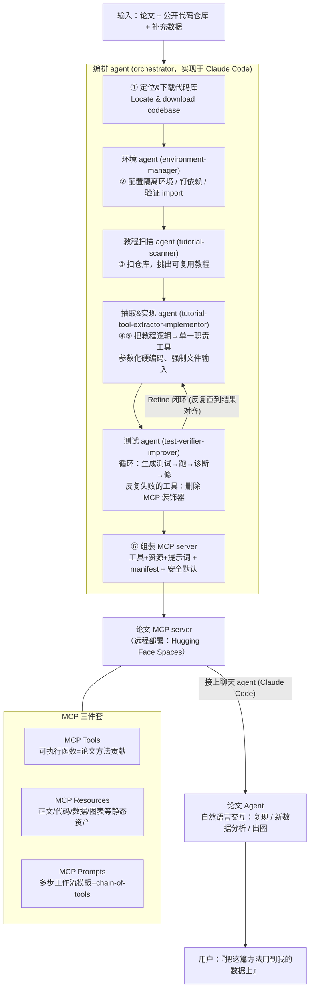

# 组会汇报 · Paper2Agent：把研究论文重铸为可交互、可靠的 AI Agent

> 主讲提示：这是 I 组（域内落地 / 可复现工具化）的代表作。它和前面那些「让 AI 自己做**新**科研」的旗舰（AI Scientist、AlphaEvolve）方向**正交**——它问的是一个更朴素、却影响更广的问题：**别人辛苦做出来的方法，凭什么躺在 PDF 和一个跑不起来的仓库里浪费掉？** 开场一句定调：「论文是**被动文物 (passive artifact)**，Paper2Agent 把它变成**主动系统 (active system)**——一个会用你的数据、能自我校验、引用可溯源的论文助手。」

---

## 1. 封面 · TL;DR

> 主讲提示：先把「为什么是 Stanford Zou lab」「它解决的是谁的痛」「可靠性是它和玩具 demo 的分水岭」三点抛出来。

- **标题**：Paper2Agent: Reimagining Research Papers As Interactive and Reliable AI Agents。
- **作者 / 机构**：Jiacheng Miao, Joe R. Davis, Yaohui Zhang, Jonathan K. Pritchard, **James Zou**（**Stanford University**），arXiv 2509.06917，v2 2025-10-16。
- **权威性来源**：**Stanford Zou Lab + Pritchard Lab** 出品（Zou 是 AI-for-science / 可信 ML 领域高产作者，本库 [`CellVoyager`]、[`Biomni`]、[`Virtual Lab`] 均出自其生态）；代码、三个 MCP server、一个公开 agent **全部开源在 Hugging Face Spaces**（见 §「复现与可用性」），结果**可被独立点开验证**——这本身就是它「可复现」主张的身体力行。

**这篇在干什么（一段话）**：Paper2Agent 是一个**多 agent 自动化框架**，输入一篇论文 + 它的公开代码仓库，输出一个**论文专属的 AI agent**。它用一个**编排 agent (orchestrator)** 调度四个子 agent，把论文的核心方法**封装成一组 MCP 工具 (Model Context Protocol tools)**，并**反复跑测试**直到工具的输出与论文/教程里的参考结果**逐数字对齐**，再把这个 MCP server 远程部署、接上一个聊天 agent（如 Claude Code）。用户从此可以**用自然语言**说「把这篇论文的方法用到我的数据上」，agent 就自动配环境、跑流程、出图、给可解释的结果（见原文 **Figure 1A/1B**）。论文用 **AlphaGenome（基因组）/ TISSUE（空间转录组）/ Scanpy（单细胞）** 三个案例证明它能造出**可靠且能干**的论文 agent，并演示了一个由 Paper2Agent 自动搭出的 **AI co-scientist** 发现了一个与 ADHD 风险相关的新剪接变异。

**3 条带走的结论**：
1. **「论文即 agent」是一种新的知识传播单位**：从「读 PDF + 啃代码 + 配环境」三道墙（原文 §1 反复强调的 technical barriers），变成「直接问、直接用」。它把可复现性从「**能不能看懂**」推进到「**能不能即取即用**」。
2. **可靠性是设计出来的，不是祈祷出来的**：每个工具都要先用论文自带的样例数据**跑出和参考一致的结果才被保留**，跑不过的工具**直接从 MCP 删掉**（原文 Extended Methods「test-verifier-improver」）；并把工具**锁定 (locked)** + 内嵌**指向原始 GitHub 源码的可溯源链接**，以此压制「代码幻觉 (code hallucination)」。这是它区别于「LLM 现写现跑」的命门。
3. **真有硬战果**：AlphaGenome agent 在教程题与新题上均达 **100% (15/15)** 准确率，高于 Claude+Repo（80% / 60%）与 Biomni（40% / 60%）；运行时中位数比对手快 **1.8×–4.6×**（原文 **Figure 2B/2C**）。一次自然语言提示即可让 agent 用「独立的、基于模型的证据」**重审已发表结论**（SORT1 vs CELSR2/PSRC1 之争，§「AlphaGenome 案例」）。

> 主讲提示：把第 2 条单独强调——本篇标题里的 **Reliable** 不是形容词，是一整套「测试-校验-锁定-溯源」的工程机制。组会上最该追问的就是「它凭什么敢叫 reliable」。

---

## 2. 问题与动机（why —— 本篇最该讲透的一节）

> 主讲提示：这一节是全篇 why 的地基。三层 Why 三连第一次出现，务必讲满「问题层」。

### 问题层 why（为什么这事值得解决）

**论文是被动的 (passive)**。原文 §1 第一句就把矛盾摆出来：研究论文至今仍是科学交流的基本单位，但它**根本上是个被动对象**——读者得先在出版洪流里**发现**它，再**解析**它的贡献，最后**手动判断**怎么用到自己的工作上。当论文描述的是一个**新计算方法**时，鸿沟更深：你要**定位对应代码仓库、装依赖、配环境、读懂输入输出语义**（原文 §1 引 [1][2]），「即便仓库维护良好，这个过程往往也不平凡」。

**一个具体的痛（原文用 AlphaGenome 举例）**：AlphaGenome 是个强大的基因组基础模型，但要用它，生物学家得「安装环境、导入多个模块、用 API key 创建 client 对象、构造染色体/变异对象、选择输出模态」，还要「理解 API 层级与参数语义」——**对不熟悉这些抽象的生物学家是一道学习曲线**（原文 §1）。结论一句话：**research outputs are passively siloed behind technical barriers**（研究成果被技术壁垒被动地封存了）。

**不解决会怎样**：方法做出来了却**没人能用**、或只有少数计算专家能用；论文的引用数涨了，但**知识没有被真正复用**。这正是「可复现性危机」在「工具层」的具体形态——不是数据/代码不公开，而是**公开了也跑不起来、用不上**（原文 Discussion 把「能否被 agent 化」直接当成一种**可复现性与严谨性的实用度量**）。

### 设计层 why（为什么不靠已有的几种朴素办法）

> **Why（设计层）**：让论文「可执行」这件事，前人试过至少四条朴素路线，本文逐一指出它们为何不够（原文 §1 倒数第 2–3 段）：

| 朴素替代方案 | 代表 | 为什么不够（原文论证） |
|---|---|---|
| **可执行论文 (executable paper)** | Elsevier Executable Paper Grand Challenge [8] | 把叙述与可跑代码合一，提升了复现性，但**仍需大量技术熟悉度才能真正上手** |
| **Jupyter Notebook 支撑的出版** | Rule et al. [4] | 同上：notebook 能跑，但读者要懂环境、会改代码 |
| **Papers with Code** | [25] | 把论文链到开源仓库，改善了**可发现性**，但**「装环境、跑代码」这道墙仍在** |
| **从论文文本自动生成代码** | Paper2Code [27]、From Articles to Code [26] | 只解决「生成代码」，**不解决「跑通、校验、即取即用」**，且无可靠性保证 |

**本文的更优之处**：Paper2Agent 不是再造一份「能跑的代码」，而是把论文**变成一个会执行、会对话的知识实体 (a knowledgeable entity capable of execution and dialogue)**——并且**自带可靠性校验**。它把研究成果从「编码知识的文档/代码库」转为「**可被自然语言访问的能干 agent**」（原文 §1 末段），这是「从静态传播到交互式协作」的一步。

### 核心 intention（一句话形式化）

> **给定一篇论文 + 其公开代码仓库，自动构造一个论文专属 agent：它把论文方法封装成一组经过测试、与参考结果对齐、可溯源的 MCP 工具，并能被自然语言驱动来在新数据上复现与应用这些方法。**

> 主讲提示：把动机钉在两点——**①技术壁垒让方法「公开却不可用」；②已有「可执行/链接代码」路线都没跨过「跑通+校验+即用」这道坎**。后面每个设计几乎都在回应这两点。

---

## 3. 研究问题 / 核心假设

> 主讲提示：把它要赌的三个假设讲清，后面案例就是在逐个验证。

- **RQ**：能否**最小人工介入**地，把一篇方法论论文（及其代码）自动转成一个**可靠、可交互**的 agent，使非专业用户用自然语言就能正确复现论文结果、并把方法用到全新数据/问题上？
- **核心假设 H1（MCP 抽象足够）**：把论文贡献封装为 **MCP server 的工具/资源/提示词**三件套，任何 LLM / agent 都能**零额外集成**地调用（原文 §2「MCP has become an industry standard」）。
- **核心假设 H2（可靠性来自测试闭环）**：只要每个工具都**用论文自带样例数据验证到与参考结果一致、再锁定**，就能把「代码幻觉」与「生成随机性」压到可接受范围（原文 §2「Reliable and reproducible」要点）。
- **核心假设 H3（可组合 → 协作）**：因为 MCP 是模块化的，**多个论文 MCP 可挂到同一个 agent**，于是「一篇新方法的 agent」能和「一份新数据的 agent」**自主协作**，产生新发现（原文 §「autonomous AI-driven collaboration」+ Figure 5）。

---

## 4. 相关工作定位（站在谁肩上、和谁不同）

> 主讲提示：一张表说清「别人做到哪、它多走了哪一步」。关键词：从「可发现 / 能跑」到「即用 + 可靠 + 可协作」。

| 方向 | 代表 | 与本篇的关系 |
|---|---|---|
| 可执行论文 / Notebook 出版 | Executable Paper [8]、Rule [4] | 叙述+代码合一；**仍需技术熟悉度** |
| 论文↔代码链接 | Papers with Code [25] | 改善发现性；**没跨过「跑通」墙** |
| 论文→代码自动生成 | Paper2Code [27]、Articles→Code [26] | 只生成代码；**不保证跑通/校验/即用** |
| 通用科研 agent / co-scientist | Virtual Lab [14]、Google AI co-scientist [16]、Robin [17]、FutureHouse [17] | 做**新发现**；Paper2Agent **互补**：给它们提供「论文级工具」当弹药 |
| 专用领域 agent | CellVoyager [19]（单细胞）、Biomni [20]（生物） | 单点领域 agent；Paper2Agent **泛化**：任意论文都能转成 agent |
| MCP 协议本身 | MCP [15] | Paper2Agent 是 MCP 的一个**杀手级应用**：用它做「论文工具化」 |
| **本篇** | Paper2Agent | **把「任意论文+代码」自动转成「可靠、可交互、可协作」的 MCP-agent** |

（依据原文 §1「Recent advances」段 + §2 开头）一句话差异：**别人要么只链接代码、要么只生成代码、要么直接做新发现；Paper2Agent 填的是中间那块——把已发表方法「可靠地工具化」，让人和其它 agent 都能即取即用。**

> 主讲提示：强调它和 co-scientist 类系统是**喂弹药 vs 开枪**的关系，不是竞争。Figure 5 的 ADHD 案例就是「Paper2Agent 造出 co-scientist」。

---

## 5. 方法总览（big picture，先直觉后细节）

> 主讲提示：让听众记住「**四个 agent + 三件 MCP 套件 + 六个步骤**」。下面这张图是全篇唯一最该记住的图（对应原文 Figure 1B + Extended Methods）。

Paper2Agent = **Paper2MCP（把论文+代码→远程 MCP server）+ Agent 层（把 MCP 包成论文 agent）**。整条转换管线：

**直觉**：把「读论文 → 找代码 → 配环境 → 改代码跑 → 校验结果」这套**博士生第一周干的脏活**，拆给四个分工明确的 agent 自动做一遍；产物不是「一次性跑通」，而是一组**经测试、可重复调用、可溯源**的工具，挂在一个标准协议 (MCP) 上，谁都能接。

> 主讲提示：强调两个「闭环」——一是 ④↔⑤ 的 **Refine 闭环**（测试不过就改），二是 §「可靠性」会讲的「**测不过就删工具**」硬规则。可靠性就藏在这两处。

---

## 6. 符号与术语表（后文统一用）

> 主讲提示：本篇是系统论文、公式极少；术语表是理解全篇的钥匙，逐个点名。

| 记号 / 术语 | 含义 |
|---|---|
| **MCP (Model Context Protocol)** | 一种**标准化协议** [15]，把结构化 API/工具以「LLM 与 agent 框架可直接访问」的方式暴露出来 |
| **Paper2MCP** | Paper2Agent 的前半段：从论文+代码**抽取信息、构建远程 MCP server** |
| **Agent 层 (agent layer)** | 后半段：把每个 MCP server 包成**上下文提供者 (context provider)**，实例化论文专属 agent |
| **MCP Tools** | **可执行函数**，封装论文的方法学贡献（如 `score_variant()`、`visualize_variant_effects()`），自带预配置环境 |
| **MCP Resources** | **静态资产仓库**：手稿正文、代码库、补充材料（数据、表、图、训练数据链接），标准化格式存储 |
| **MCP Prompts** | **简洁指令模板**，引导 agent 走完复杂多步工作流（如 Scanpy 的「预处理→聚类」全链），即 **chain-of-tools** |
| **Paper Agent** | MCP server 接上 LLM/agent 后形成的**论文专属 agent**，可自然语言交互 |
| **编排 agent (orchestrator)** | 调度四个子 agent 的总控（实现于 Claude Code） |
| **代码幻觉 (code hallucination)** | LLM 现写现跑的代码看似对、实则错，导致**错误的科学结论**——本文要压制的头号风险 |
| **工具锁定 (locked tool)** | 工具一旦验证通过即**冻结**，不再让 LLM 即兴改写，以保证可重复 |
| **教程基准 / 新题基准 (tutorial-based / novel benchmark)** | 评测两类题：取自论文教程的题 vs 论文与代码库里**都没出现过**的新题（防过拟合） |

---

## 7. 方法细节 ① 四个子 agent 各司其职（核心）

> 主讲提示：这是「how」的主体，但每个 agent 都先讲它在**还哪笔债**（Why 设计层）。四个 agent 出自原文 **Extended Methods**「Details on implementing Paper2Agent」。

整个系统是**一个编排 agent + 四个子 agent**，实现于 Claude Code [24]。

### 7.1 环境 agent（environment-manager）

> **Why（设计层）**：朴素做法是「在当前机器直接 pip install 跑」→ 不同机器依赖冲突、版本漂移，**结果不可重复**。环境 agent 专门负责**创建干净、可重复、隔离的工作区**：分析项目配置、隔离 workspace、装齐依赖、确保代码无冲突运行。**标准化环境是「跨机器可靠执行与可复现」的前提**（原文 Extended Methods）。

### 7.2 教程扫描 agent（tutorial-scanner）

> **Why（设计层）**：朴素做法是「把整个仓库的代码都尝试工具化」→ 仓库里大量是**内部工具、测试、半成品**，噪声极高。教程扫描 agent 专门**系统扫描可用材料，把真正的教程 (genuine tutorials) 从其它文件里分辨出来**，挑出最值得复用的，产出「哪些该留、哪些该弃」的结构化报告。**为什么挑教程？** 因为教程是论文作者**亲手验证过、带样例数据、能跑出已知结果**的最佳「可信种子」。

### 7.3 抽取&实现 agent（tutorial-tool-extractor-implementor）

> **Why（设计层）**：朴素做法是「把教程整段塞进一个大函数」→ 只能在**原样例数据**上跑、换数据就崩，且不可参数化。本 agent 做四件关键改造（原文 Extended Methods + §「AlphaGenome」「Scanpy」）：
> 1. **识别能泛化到样例数据之外的任务**，每个实现为一个**单一职责 (single-purpose) 的干净函数**，输入/输出/默认值清晰；
> 2. **把硬编码值参数化** —— 这是「能换数据用」的关键（见 Supplementary Figure 1：`visualize_variant_effects()` 暴露了染色体、位置、参考/替代碱基、物种、序列长度、各模态开关、配色、API key 等一大把带注释参数）；
> 3. **强制文件式输入 (file-based inputs)**，并保存关键结果与图；
> 4. **每个工具内嵌指向原始 GitHub 源码的链接**（如 Supplementary Figure 1 末尾 `source: ".../variant_scoring_ui.ipynb"`）→ **透明、可溯源**。

**目标一句话**：造一个「**能在原数据上复现教程结果、又随时能在新数据上跑**」的函数库。

### 7.4 测试 agent（test-verifier-improver）—— 全篇可靠性的「守门人」

> **Why（设计层）**：朴素做法是「LLM 生成工具就直接上线」→ 没人保证它跑得对，**代码幻觉会被当成科学结论**。测试 agent 是本文**可靠性的核心机制**（详见 §8）：它**只用教程自带的样例**生成测试，跑一个「**生成测试 → 执行 → 诊断失败 → 修复**」的循环以确保**数值与可视化结果被忠实复现**；**反复失败的函数，其 MCP 装饰器会被移除，从而被排除在 MCP server 之外**（原文 Extended Methods）。所有结果与日志留痕以求透明。

### 7.5 六个步骤（编排 agent 的执行序）

原文 Extended Methods 把整条管线显式列为**六步**：
1. **定位并下载代码库**（连同补充数据/配置）；
2. **环境配置**（钉依赖、验证 import，保证跨机器一致）；
3. **教程发现**（扫仓库、产候选教程索引）；
4. **教程执行与审计**（端到端跑教程、捕获输入输出/图/运行约束、把隐含假设显式化）；
5. **工具抽取与实现**（教程逻辑→单一职责函数、参数化、存关键产物）；
6. **MCP server 组装**（工具+资源+提示词 + manifest + 版本 + 基本安全默认，交给编排/co-scientist agent）。

> 主讲提示：把「步骤 4 的 audit」单独点出来——「把隐含假设显式化 (record implicit assumptions that must be made explicit)」正是教程能跑、换数据却崩的根因，这一步是可靠性的隐形功臣。

---

## 8. 方法细节 ② 可靠性是怎样被「设计」出来的（本篇灵魂）

> 主讲提示：标题里的 **Reliable** 在这一节兑现。组会上一定有人问「LLM 生成的工具凭什么可信」——这一节就是答案。务必把「四道闸」讲全。

**问题层 why**：把论文工具化，最大的风险不是「跑不出来」，而是「**跑出来了，但是错的**」。原文 §2 直接命名为 **code hallucination**：执行不准确的 LLM 生成代码会导致**错误的科学结论**。在科学场景，这比「报错崩溃」危险得多——因为它**安静地给你一个看似合理的错数**。

**本文的四道闸（原文 §2「Reliable and reproducible」要点 + Extended Methods）**：

1. **参考校验 (validate against reference)**：每个工具都要用**论文自带的样例数据**跑，并和论文/教程里**报告的结果与图**对齐。对齐了才算数。
2. **锁定 (lock)**：验证通过的工具**冻结**，不再让 LLM 即兴改写——直接**消除生成随机性 (minimizes randomness in code generation)**，这是「可重复」的来源。
3. **删除不达标工具 (drop on repeated failure)**：测试 agent 的循环里，**反复失败的函数会被摘掉 MCP 装饰器、排除出 server**。即「**宁可少一个工具，不要一个会骗人的工具**」。
4. **可溯源 (traceability)**：每个工具**内嵌指向原始论文 GitHub 源码的引用链接**，提供透明性与可追溯性——人类专家随时能点回去核对这段工具到底对应论文哪段代码。

**直觉**：把「相信 LLM 写得对」替换成「**只相信能复现参考结果、且锁死不再变的工具**」。可靠性不是模型属性，是**流程属性**——靠测试闭环 + 锁定 + 淘汰 + 溯源四件事**挣**出来的。

> **Why（设计层）对比**：为什么不直接用「Claude + 仓库」让它每次现写现跑（这正是它的 baseline「Claude + Repo」）？因为那条路**每次调用都重新生成代码**，既慢（要重读仓库、重写）、又**把代码幻觉的风险留在了每一次推理里**。Paper2Agent 把「写代码」这件危险的事**一次性做完并验证锁定**，之后只是**调用**已验证工具——这解释了它为何**又快又准**（§9 的 100% 准确率 + 1.8–4.6× 提速）。

读出什么（结果层 why 预告）：AlphaGenome agent 之所以能在**新题**上也 100% 正确，正是因为工具是「参数化 + 文件输入 + 已验证锁定」的——换个变异位点/组织类型只是**换参数调用同一个验证过的工具**，而不是**赌 LLM 这次能不能现写对**。

---

## 9. 实验设置 + 主要结果（setting / metrics / params / 数字 + 解读）

> 主讲提示：这一节把「setting/metrics 写全」做到位。本篇没有传统损失函数，**评测指标就是「准确率」和「运行时」**，但它的**题目构造（防过拟合）**和**baseline 选择**很有讲究，要讲清。

### 9.1 通用评测设置（原文 Extended Methods「Benchmarking…」）

- **底座 LLM**：所有 agent 评测统一用 **claude-sonnet-4-20250514**；本地在 **MacBook Air (M2)** 上跑，命令行非交互模式，输出捕获为 JSON（`claude --model "claude-sonnet-4-20250514" --print --output-format "json" <prompt>`）。
- **三个 baseline / 对照系统**：
  1. **Paper2Agent（本文，AlphaGenome agent）**；
  2. **Claude + Repo**：Claude Code 直接挂 AlphaGenome 仓库，**每题现写现跑 Python**（prompt 明确要求「必须写并执行代码，不许只看文档/教程」）；
  3. **Biomni** [20]：通用生物 AI agent（API 版）。
- **ground truth**：每题由**人工手写并执行代码**得到标准答案；agent 答案**人工评分**。

### 9.2 评测指标的精确定义

> 直觉：我们想知道「这个论文 agent 给出的科学答案对不对、快不快」。原文用两个朴素但硬的指标。

记号（先定义）：$N$ = 某基准的题目总数；$c$ = agent 答对的题数（人工核对，需与人工执行原代码所得**精确数值**一致）；$t_q$ = 第 $q$ 题的运行时（秒）。

- **准确率 (accuracy)**：
  $$ \text{Accuracy} = \frac{c}{N}. $$
  读出什么：分子要求**逐数值正确**（如 `quantile_score = -0.0203067882` 要和 ground truth 完全相同，见 Figure 2B），不是「答得差不多」。这是个**严格**的对错判定。
- **运行时加速 (run-time speedup)**：以**中位数运行时**之比衡量相对效率：
  $$ \text{speedup} = \frac{\operatorname{median}_q\, t_q^{\text{baseline}}}{\operatorname{median}_q\, t_q^{\text{Paper2Agent}}}. $$
  读出什么：>1 即比对手快。用**中位数**而非均值是为了抗个别超长 query 的离群影响。

**两个基准（防过拟合是关键设计）**：
- **教程基准 (tutorial-based, 15 题)**：直接取自 AlphaGenome 教程（如「Score variant chr3:58394738:A>T using ATAC-seq predictions for motor neuron cells (CL:0000100). What is the quantile_score?」）。
- **新题基准 (novel, 15 题)**：作者**手工构造、论文与代码库里都没出现过**的题（新变异位点、新等位替换、新组织/细胞类型），专门**评估泛化、防止对原样例过拟合**（原文 §「AlphaGenome」）。

### 9.3 AlphaGenome agent 结果（原文 Figure 2B/2C）

| 系统 | 教程基准准确率 | 新题基准准确率 |
|---|---|---|
| **Paper2Agent** | **100.0% (15/15)** | **100.0% (15/15)** |
| Claude + Repo | 60.0% (9/15) | 80.0% (12/15) |
| Biomni | 40.0% (6/15) | 60.0% (9/15) |

**运行时（中位数加速，Figure 2C）**：相对 Claude+Repo / Biomni，教程基准快 **1.8× / 3.1×**，新题基准快 **3.2× / 4.6×**。

**结果层 why（为什么是这个数）**：
- **为什么 Paper2Agent 能 100%**：它调用的是**已验证、锁定、参数化**的工具，换题只是换参数——把「正确性」在构造期一次性解决了。
- **为什么对手在新题上反而比教程题高（Claude+Repo 60%→80%、Biomni 40%→60%）**：作者没有给出机制解释（**原文未给出**）。一个合理猜测是教程题对数值精度要求更死（要复刻教程里那个精确分位数），而部分新题判定相对宽松——但这是**我的推测，非原文结论**，组会上应标注。
- **为什么更快**：对手**每次推理都要重读仓库、重写代码、重装**；Paper2Agent 只是**调用预置工具**，省掉了昂贵的「现写现跑」。

### 9.4 工具规模与构造成本（原文 §「AlphaGenome」「TISSUE」「Scanpy」）

| 案例 | 工具数 | 构造耗时 | 硬件 | 备注 |
|---|---|---|---|---|
| **AlphaGenome**（基因组） | **22** 个 MCP 工具 | **~3 小时** | 个人笔记本，无人工干预 | 覆盖单/批变异打分、序列级预测、组织本体探索、可视化套件 |
| **Scanpy**（单细胞） | **7** 个工具 | **~45 分钟** | 个人笔记本 | QC、过滤、`normalize_data()` 等；**支持只转方法的一部分**（最常用的预处理+聚类） |
| **TISSUE**（空间转录组） | **6** 个工具 | 原文未给出耗时 | — | 空间基因表达预测、预测区间构造、不确定性感知下游分析 |

读出什么：**一次性、低成本**（小时级、个人笔记本、零人工）就能把一篇方法论文转成可复用工具库——这是「论文即 agent」**可规模化**的实证基础。

> 主讲提示：强调「~3 小时 / 个人笔记本 / 无人工干预」这组数——它对标 AI Scientist 的「<$15/篇」，是「这套自动化便宜到可大规模铺开」的卖点。

---

## 10. 三个案例 + 协作发现（结果的「意味着什么」）

> 主讲提示：案例不是堆功能，每个都对应一种**典型科研场景**。挑「AlphaGenome 重审结论」和「ADHD 协作发现」两个高潮重点讲。

### 10.1 AlphaGenome agent：用一句话重审已发表结论（原文 Figure 2D + §）

agent 自动对 GWAS 位点做「**规划-行动-观察 (planning–action–observation)**」迭代：建计划→调 `score_variant_batch()`/`visualize_variant_effects()`→看结果→自我修正→出**可发表级报告**。

**最有教学价值的一幕**：对 chr1:109274968:G>T（与 LDL 胆固醇相关），AlphaGenome agent **把 SORT1 列为最可能的因果基因**，而**原 AlphaGenome 论文强调的是 CELSR2 和 PSRC1**。agent 的理由：SORT1 的分位数分数极高 (0.99982) + SORT1 编码 sortilin 直接参与 LDL/VLDL 分泌。作者**手工查 GTEx eQTL 证实** SORT1 在肝脏确是显著 eQTL（p=1.1e-65）——但也指出 CELSR2/PSRC1 同样有高分位数分数 (各 0.99998) 与显著 eQTL，**复杂 GWAS 位点的因果基因本就难以确证**。

**结果层 why / 这意味着什么**：原文点题——这正暴露了 Paper2Agent 的一个**关键力量**：**一句提示就能用「独立的、基于模型的证据」重审已发表结论**，把「原文解释」从「钉死的事实」变成「**可被动态再评估的假设**」，并能**规模化地系统重审众多研究**（原文 §「AlphaGenome」末段）。

### 10.2 TISSUE agent：把「方法论文」变成「会答疑的向导」（Figure 3）

TISSUE [10] 是 Nature Methods 上的不确定性校准空间转录组方法。Paper2Agent 生成 6 个工具，且 agent 能当**交互式向导**：问它「TISSUE 需要什么输入？」会返回**结构化的输入/输出/可用功能说明**（Figure 3B）。在「给 Acta2 构造空间预测的预测区间」任务上，**输出与人类专家手跑流程的结果一致**（Figure 3C），证明它能跑**整条工作流**（从加载预处理到插补到不确定性估计），而非孤立工具。还把数据可用性章节翻成**结构化注册表**，经 Zenodo REST API 让 agent 按物种筛选下载数据（Figure 3D）。

### 10.3 Scanpy agent：用 MCP Prompts 编排「正确顺序的多步流程」（Figure 4）

> **Why（设计层）**：朴素做法是「让 agent 自己记住步骤顺序」→ 它要么「碰巧知道」、要么要用户写一长串 prompt 指定顺序，**易错**。Scanpy 案例用 **MCP Prompts** 把「QC→归一化→特征选择→降维→建图→聚类→注释」的**正确顺序**编码成模板（**chain-of-tools**），且这些 prompt 是**从论文与代码自动推断、无需人工编排**（原文 §「Scanpy」）。

用户只需给数据路径（如 `data.h5ad`），agent 自动跑完整流程并出摘要；在**三个 10x Genomics PBMC 公开数据集**（不在 Scanpy 代码库里）上，**输出与人类研究者手跑一致**（Figure 4C）。一句话：**MCP-prompt 让复杂工作流既可访问又可复现**。

### 10.4 协作发现：Paper2Agent 造出一个 AI co-scientist（原文 Figure 5 + §）

**场景**：把 **AlphaGenome 方法论文**的 MCP 和 **ADHD GWAS 数据论文** [28] 的 MCP **同时**挂到一个下游 AI co-scientist（用 Claude Code）。data agent 自动把论文补充 Excel 表清洗成标准化 MCP 资源；co-scientist 自主**提假设→设计并执行分析**。

**战果**：在 locus 27 的 **209 个候选变异**中，agent 锁定内含子变异 **rs1626703**，用 AlphaGenome 算出它**改变 MPHOSPH9 的剪接与表达**（quantile：splice junction = 1.000；RNA-seq = 0.963），机制上「促进外显子包含→升高 MPHOSPH9 表达」，给出 ADHD 风险的**可信因果机制**。进一步，co-scientist **自主用 AlphaGenome 给全部 39 个位点排因果变异，2 小时内**完成（人工要数周），结果存于 Supplementary Table 1。

**这意味着什么**：原文点题——这演示了一种**新的协作范式**：人类用 Paper2Agent **搭出自己的 AI co-scientist** 并提出高层假设，AI co-scientist **自主执行并解释**复杂分析任务（原文 §末）。它把「方法论文」与「数据论文」**两个 agent 接起来**，自动产生跨论文的新发现——这正是 H3 的验证。

---

## 11. 局限与批判（诚实区分宣称 vs 边界）

> 主讲提示：原文 Discussion 相当坦诚，自承了几条硬边界；再补几条社区视角的质疑。

**原文自承（Discussion）**：
- **不是每篇论文都能转成 robust agent**：若原代码库**不完整、文档差、含未解 bug**，Paper2Agent **无法可靠地把它暴露成可用工具**。作者把这条**反过来当卖点**：「**能否被 agent 化**」本身就是一种**可复现性与严谨性的实用度量**——但这也意味着**它的适用面被原仓库质量卡死**。
- **评测受限于人工**：benchmark 依赖**专家知识手工配环境、手工实现、手工评分**——规模有限；作者提议未来用 **LLM-as-judge** [22] 进一步自动化（**当前未做**）。
- **「论文」未必是最佳的 agent 化单位**：很多领域一个想法跨多篇论文演进，单篇 agent 不够；作者计划让一个 MCP **聚合多篇相关论文**（**当前未实现**）。

**社区/批判视角（部分为本报告补充，标注非原文）**：
- **只在「方法论文 + 干净仓库」上验证**：三个案例（AlphaGenome/TISSUE/Scanpy）都是**维护良好的明星仓库**。对「平均水平的论文仓库」能否同样 100%，**原文未给出证据**——这与本库 [`SUPER`]（最强 agent 端到端配通别人仓库仅 16.3%）形成强烈反差，提示**真实仓库的长尾可能很难**。
- **可靠性的「锚」是教程参考结果**：四道闸全部以「**复现教程/论文里的参考结果**」为判据。若**论文本身的参考结果就有误**，工具会被「校验为正确」地复现一个错误——**可靠 ≠ 正确**，只是「**与原文一致**」。
- **新题准确率的机制未解释**：对手在新题上反而更高（§9.3），原文没给原因，削弱了「100% 来自方法优越性」论证的完整性。
- **底座单一 / 规模小**：仅 claude-sonnet-4 一个底座、每基准 15 题、单机评测；**统计显著性与跨模型稳健性证据不足**。

> 主讲提示：把「**可靠 ≠ 正确，只是与原文一致**」这句单独强调——它是这套机制最微妙的边界，也是和 9.8（诚信/独立验证）最该对话的点。

---

## ★ 对我们的启发（Inspires Us）

> 这一节回答：Paper2Agent 对我（们）接下来的研究，**到底能用上什么**。

- ➤ **可直接借用的招（reuse）**：
  1. **「测不过就删工具」硬规则**——把「生成 → 用参考样例校验 → 反复失败则摘掉 MCP 装饰器、排除出 server」做成一道**不可绕过的闸**。这可**原样搬进** [`m9.2-research-agent-core`](../m9.2-research-agent-core/) 的「生成-然后-自检」管线：现在我们的 critic 只是**标记**幻觉引用，可升级为「**校验不过的产物直接不准进最终输出**」。
  2. **工具锁定 (lock) 消随机性**——把「写代码」这件高风险的事**一次性做完并冻结**，之后只**调用**已验证工具。这是把「LLM 每次现写现跑」的不确定性**移出推理回路**的通用招，凡是「agent 反复调用同一能力」的场景都该这么干。
  3. **工具内嵌源码溯源链接**——每个能力都带一条「回到原始出处」的指针。可加进我们任何工具库，让**人类抽查**有据可依（呼应 m9.8 的「独立验证收口」）。

- ➤ **可迁移到我们课题（transfer）**：我们的 [`m9.2`](../m9.2-research-agent-core/) 已验证「**无 critic 残 1、有 critic 残 0**」——这是「**自检能压幻觉**」的最小证据。Paper2Agent 把同一思想**升级为可执行的硬约束**（校验→锁定→淘汰），并放到**真实生物信息流水线**上仍然有效，说明该机制**跨任务尺度稳健**。迁移时要改的前提：我们得有「**可自动判对错的参考结果**」（教程样例 / ground-truth 数值）——**没有可验证锚点时，这套闸退化为「与某个不可信参考一致」**，反而可能锁死一个错误。

- ➤ **它暴露的开放问题 = 我们的机会（opportunity）**：Paper2Agent 的可靠性锚是「**复现教程参考结果**」，于是 **「可靠 ≠ 正确，只是与原文一致」** 这条裂缝原文未解。→ **机会**：能不能在「与原文一致」之外，再加一层「**独立证据交叉校验**」（如 AlphaGenome 案例里**手查 GTEx eQTL** 那一步），并把它**自动化、量化**？**可下手的第一步**：在 m9.2 里加一个「**参考一致性** vs **独立来源一致性**」双判据，造一个「教程结果本身有错」的注入实验，测双判据能否抓出「被忠实复现的错误」。

- ➤ **与本库其它论文/模块的连接（connect the dots）**：
  - **承接可复现性双基准**：与 [`2409.07440` SUPER](2409.07440-super-research-repositories.md)（配通别人仓库端到端仅 16.3%）、[`2409.11363` CORE-Bench](2409.11363-core-bench-reproducibility.md)（复现已发表结果最难层仅 21%）形成**问题↔解法**对位——SUPER/CORE 把「复现到底多难」钉死，Paper2Agent 给出「**在干净仓库上把复现工具化到 100%**」的一种正面解；但两者的反差也提示**Paper2Agent 的 100% 高度依赖仓库质量**，**对长尾仓库它大概率会退化到 SUPER 那条曲线上**。
  - **范式对话**：与 [`2511.16931` OmniScientist](2511.16931-omniscientist-coevolving.md) 互补——OmniScientist 主张「科学是**社会性**的，要补**协作协议/信用归属**这套基础设施」；Paper2Agent 的「MCP 让论文 agent 互相挂接、自主协作」（Figure 5）正是**OmniScientist 愿景里『协作层』的一个可跑的最小实现**。可把 Paper2Agent 当成 OmniScientist「协作生态」的**砖**。
  - **能力供给关系**：与 [`m9.2-research-agent-core`](../m9.2-research-agent-core/) 直接呼应——m9.2 拆解「研究 agent 内核四零件」，Paper2Agent 则是「**给这些 agent 批量生产论文级工具**」的上游供给。

- ➤ **如果我来做下一步（my next move）**：我会在 [`m9.2`](../m9.2-research-agent-core/) 里加一个 **「校验-锁定-淘汰」三件闸 + 双判据（参考一致 / 独立来源一致）** 的最小开关，跑一组对照——①注入「教程结果本身有误」的样例，看单判据（只比对原文）会不会**把错误工具校验为通过**，而双判据能否拦下；②对比「每次现写现跑」vs「锁定后调用」在重复 query 上的**结果方差**。一周内能出最小结论，直接接力到 m9.8 的独立验证。

> 主讲提示：这一节是全场高潮——前面讲「Stanford 做了什么」，这里讲「**我们下周就能在 m9.2 上试什么**」。落点是「三件闸 + 双判据」，能被同组同学直接接力。

---

## 12. 在 auto-research 版图的位置（相对已有工作的增量）

> 主讲提示：用 Tool→Analyst→Scientist 阶梯给它定位，并点明它把谁向前推了一步。

- **阶梯定位**：按本库 **Tool → Analyst → Scientist** 阶梯，Paper2Agent 本身是一台**「论文 → Tool」的自动工厂**——它的直接产物是**可靠的工具/Analyst 级 agent**（在干净仓库上达到「即取即用、可复现」）。但它的**协作案例（Figure 5）**把两个论文 agent 接成 co-scientist，**自主提假设+执行+解释**，在「**有自动判据的窄域**」里摸到了 **Scientist 级**的边——和 [`AlphaEvolve`](2506.13131-alphaevolve-deepmind.md) 一样，能力**被「可自动验证」这条边界**圈住。
- **它把谁向前推了一步**：把 **Papers with Code（只链代码）/ Paper2Code（只生成代码）** 推进到「**生成 + 跑通 + 校验 + 锁定 + 可协作**」；把 **CellVoyager/Biomni（单点领域 agent）** 推广为「**任意论文都能转 agent**」的通用管线。
- **相对已有 40+ 篇的时间/能力增量**：它是 I 组里**第一篇把「论文工具化」做成端到端自动管线、且带可靠性保证**的工作；相对 [`SUPER`]/[`CORE-Bench`] 这类「**度量复现有多难**」的评测，它给出「**在可控前提下把复现做到可用**」的一个**建设性答案**——评测说「难」，它说「在干净仓库上可以这样做到」。

---

## 13. 复现与可用性

> 主讲提示：本篇「身体力行」可复现——所有东西都能点开。这点本身就是论据。

- **全开源**：
  - Paper2Agent 代码：`https://github.com/jmiao24/Paper2Agent`
  - AlphaGenome MCP server：`https://huggingface.co/spaces/Paper2Agent/alphagenome_mcp`
  - Scanpy MCP server：`https://huggingface.co/spaces/Paper2Agent/scanpy_mcp`
  - TISSUE MCP server：`https://huggingface.co/spaces/Paper2Agent/tissue_mcp`
  - 公开的 AlphaGenome **agent**：`https://huggingface.co/spaces/Paper2Agent/alphagenome_agent`
- **能不能在单卡/个人机跑**：**能**。构造侧三个案例都在**个人笔记本**上完成（AlphaGenome ~3h、Scanpy ~45min，无人工干预）；评测在 **MacBook Air (M2)** 上跑。真正的开销是 **LLM API 调用 + 远程 MCP 托管**，而非本地 GPU。
- **坑**：
  1. **依赖原仓库质量**——文档差/有未解 bug 的仓库可能转不成 robust agent（原文 Discussion 明说）。
  2. **可靠性锚是「教程参考结果」**——若参考本身有误，会被「忠实地复现错误」（见 §11）。
  3. AlphaGenome 工具需 **API key**（Supplementary Figure 1 暴露了 `api_key` 参数）。
  4. 评测只用单一底座 claude-sonnet-4、每基准 15 题，**换模型/扩规模的稳健性需自测**。

---

## 14. 组会讨论问题

> 主讲提示：挑 2–3 个抛出来即可，优先「可靠 vs 正确」「100% 是否依赖明星仓库」两条。

1. 本文四道闸（校验/锁定/淘汰/溯源）保证「**与原文一致**」。但「**可靠 ≠ 正确**」——如果论文的参考结果本身有误，这套机制会怎样？我们能加一层什么独立判据来抓「被忠实复现的错误」？（接 m9.8）
2. AlphaGenome agent 在干净仓库上 100%，而 [`SUPER`] 显示最强 agent 配通**普通**仓库端到端仅 16.3%。这 100% 有多少来自方法、多少来自「挑了明星仓库」？怎么设计实验把两者**解耦**？
3. 对手在**新题**上准确率反而高于教程题（Claude+Repo 60%→80%），原文未解释。你会怎样设计对照去找出原因？这是否削弱了「100% 源于方法优越」的论证？
4. 「**工具锁定**」消除了随机性，但也**冻结**了能力——当底层方法/API 升级时，锁定的工具会过时。如何在「可重复」与「可演进」之间取舍？
5. AlphaGenome agent 用一句提示把「**SORT1 vs CELSR2/PSRC1**」的已发表结论重审了一遍。这种「**用模型证据系统性重审文献结论**」是机会还是风险？谁来为 agent 翻案的结论负责？
6. Figure 5 让两个论文 agent **自主协作**出新发现。若把这种「agent 互连」放大到成百上千篇论文（呼应 OmniScientist），会涌现什么？又会引入什么**信用归属 / 可信度**问题？
7. 作者提议「**论文应有 agent availability 章节**」（像现在的 data/code availability）。这会如何改变我们写论文、放代码的方式？

---

## 15. 一页速记（汇报当天速览）

> 主讲提示：最后回到一句话——**「它把论文从『被动文物』变成『主动、可靠、可协作的 agent』；可靠性是设计出来的，不是祈祷来的。」**

- **是什么**：一个多 agent 框架，把「论文 + 公开代码」**自动**转成一个**可交互、可靠**的论文 agent（封装为 MCP 工具/资源/提示词）。
- **四个 agent + 六步**：环境 agent（配隔离环境）/ 教程扫描 agent（挑可信教程）/ 抽取实现 agent（教程→参数化单一职责工具 + 文件输入 + 源码溯源）/ **测试 agent（校验→修→反复失败则删工具）**；六步=下载库→配环境→找教程→跑审教程→抽实现工具→组装 MCP。
- **可靠性四道闸**：**参考校验 → 锁定（消随机）→ 删不达标工具 → 源码溯源**。压制 **code hallucination**。
- **关键数**：AlphaGenome agent 教程/新题均 **100% (15/15)**，> Claude+Repo (60/80) > Biomni (40/60)；中位运行时快 **1.8×–4.6×**；构造 **22 工具 / ~3h / 个人笔记本 / 零人工**；Scanpy **7 工具 / ~45min**；TISSUE **6 工具**。
- **硬战果**：一句提示**重审已发表结论**（SORT1 vs CELSR2/PSRC1）；两个论文 agent **自主协作**发现 ADHD 相关剪接变异 **rs1626703→MPHOSPH9**；2 小时排完 39 个 GWAS 位点（人工需数周）。
- **命门 / 边界**：依赖**原仓库质量**；**可靠 ≠ 正确**（只与原文一致）；评测受限于人工、底座单一。
- **在课里的位置**：I 组「论文工具化」第一篇端到端自动管线；正面回答 [`SUPER`]/[`CORE-Bench`] 提出的「复现有多难」；是 [`OmniScientist`] 协作生态的一块可跑的砖；为 [`m9.2`] 批量供给论文级工具。
