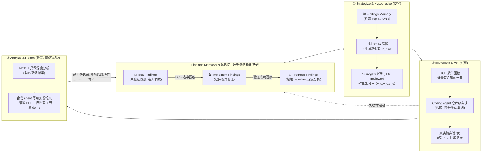

# 组会汇报 · DeepScientist（西湖大学, 2025）

> 主讲提示：开场一句话定调——「AI Scientist 系列证明了**能跑通、能过审**，DeepScientist 想再进一步：不是随便产出『新发现』，而是**盯住一个公认的人类 SOTA，反复试错把它顶过去**」。但「超越前沿」是一个极强的宣称，全场必须把**判据**（在谁的 benchmark 上、用谁的指标、谁来背书）当场剥开看，否则极易被高估。这篇的张力是：**机制设计相当漂亮（贝叶斯优化 + 分层记忆），但『真超越』的证据强度参差，且 21/5000 的命中率本身就是最诚实的冷水。**

---

## 1. 封面 · TL;DR

> 主讲提示：先把「是什么、为什么重要、权威性来源」三件事一段话讲完，再抛三条带走的结论——其中第 3 条（21/5000）要当场强调，它是理解全篇的钥匙。

- **作者 / 出处**：Yixuan Weng\*、Minjun Zhu\*（共同一作）、Qiujie Xie、Qiyao Sun、Zhen Lin、Sifan Liu、Yue Zhang（通讯），**西湖大学工学院**，arXiv 2509.26603，2025-09-30。项目页 `ai-researcher.net`，代码 `github.com/ResearAI/DeepScientist`。
- **权威性来源（诚实标注）**：这是一篇**预印本技术报告**，**未注明顶会接收**；其分量来自三点——① 作者团队是 CycleResearcher (ICLR 2025)、DeepReviewer 等自动科研工作的活跃团队；② 它直接对标并试图超越**已发表的人类 SOTA**（ICML 2025 / ACL 2025 / ICLR 2024 三个真实 benchmark）；③ 致谢 Linyi Yang，并自陈受 AI Scientist (Lu et al., 2024) 与 AlphaEvolve (Novikov et al., 2025) 启发。**权威性≠顶会背书**，组会上要把它和「Nature 的 AI Scientist v1」「DeepMind 的 AlphaEvolve」区分清楚。
- **一段话**：DeepScientist 把「自治科学发现」形式化成一个**目标驱动的贝叶斯优化 (Bayesian Optimization) 问题**（原文 §3.1）：在一个由「所有可能的研究方法」构成的概念空间 $\mathcal{I}$ 里，找到能最大化某个真实科学价值函数 $f(\cdot)$ 的方法 $I^\*$。因为 $f$ 是「黑箱 + 评估极贵（一次完整实验约 $10^{16}$ FLOPs）」的，它用一个**分层、迭代的三阶段循环**（**Strategize & Hypothesize → Implement & Verify → Analyze & Report**，原文 §3.2 / Fig.2）来近似求解，并用一个持续累积的 **Findings Memory（发现记忆）** 把「探索新假设」与「把最有希望的发现往更高保真度验证推」平衡起来。系统消耗 **>20000 GPU 小时**，生成约 **5000 个想法**、实验验证约 **1100 个**，最终在三个前沿任务上分别**超越人类 SOTA +183.7%（准确率）、+1.9%（tokens/秒）、+7.9%（AUROC）**（原文 Abstract / §4.1 / Fig.3 / Table 1 改进行）。
- **三条带走的结论**：
  1. **机制贡献 = 把「发现」写成贝叶斯优化 + 分层 Findings Memory**：核心是用 **UCB（置信上界）采集函数**（Eq.2）在「便宜 surrogate 评估」与「昂贵真实验」之间分层分配算力——只让最有希望的「Idea Finding」晋级到「Implement Finding」再到「Progress Finding」。这是它区别于 AI Scientist v1/v2「线性/树搜索」的设计内核（§7–§9）。
  2. **「渐进超越前沿」有真实证据，但证据强度分层**：A2P（失败归因）在 Who&When 上把准确率从 12.07%→29.31%（handcraft）、16.67%→47.46%（algorithm-gen），是**显著的 +142.8% / +184.8%**；但 ACRA（推理加速）只把 190.25→193.90 tokens/秒，仅 **+1.9%**——**「超越」在三个任务上的含金量差异巨大**，摘要里的「+183.7%」是挑了最亮的那个（§14 详述）。
  3. **21/5000 = 1–3% 命中率，是全篇最诚实的发现**：5000 个想法只有约 1100 个值得实验、最终仅 **21 个**真带来科学进步；随机抽 100 个测试成功率「实际为零」（§4.3）。所以作者把领域核心问题从「AI 能不能创新」重写为「**如何高效引导这个强大但极度耗散的探索过程**」——这句话比任何涨点都重要。

> 主讲提示：结尾把第 3 条钉死——**「这篇真正的贡献也许不是『AI 超越了人类』，而是第一次大规模量化了『自治科学发现有多浪费』：成功率 1–3%、$100k 换 21 个发现。」** 这是定全场基调的一句。

---

## 2. 问题与动机（why —— 本篇最该讲透的一节）

> 主讲提示：这一节是 why 的核心。把「AI Scientist 系列卡在哪」「为什么『盯住一个 SOTA 去顶』是更难也更有意义的设定」「为什么要用贝叶斯优化的语言」三件事讲清，后面所有 how 都是为它们服务的。用 Why 三连组织。

**Why（问题层）—— 之前的 AI Scientist 卡在哪？** 原文 §1 / §2 的批评很直接：以 AI Scientist-v2 (Yamada et al., 2025) 为代表的系统，虽然能端到端产出论文，但**缺乏明确的科学目标**，于是常常**盲目地重组已有知识与方法 (blindly recombining existing knowledge)**，在人类评审眼里**显得幼稚、缺乏真正的科学价值**。原文一句点题：「**AI Scientists are yet to solve human challenges**（AI 科学家尚未解决人类的难题）」（§1，引 Zhu et al., 2025c）。换句话说，前作证明了「能产出新东西」，但没证明「能产出**人类真正想要、且比现有最好方法更好**的东西」。

**Why（设计层）—— 为什么换成「目标驱动 + 盯住人类 SOTA」？**

> **Why（设计层）**：朴素做法是「让 AI 自由发散、产出尽量多的新 idea」（AI Scientist v1/v2 路线）→ 会因为**没有外部锚点**而失败：没有「要超过谁」的硬目标，系统无法判断自己是真进步还是自娱自乐，新颖性只能靠自评，结果「看起来新但没用」。DeepScientist 改用「**先选定一个公认的人类 SOTA 方法作为起点，把『超过它』当唯一目标**」，因为这样：① 价值有了**客观可测的判据**（在同一 benchmark、同一指标上比 baseline 高就是高）；② 探索方向被**收敛到「这个 SOTA 的核心局限」**上（先做失败归因，找到它差在哪，再针对性创新），而非漫无目的（原文 §2 末、§3.1）。

**为什么这是一个更难、也更有意义的设定？** 因为它把任务从「open-ended 地探索」收紧成「**goal-oriented 地攀登一座已知的山**」。前者只要「不重复」就算成功，后者要求「**比当前人类最好的方法还好**」——这是一个**有外部裁判（人类已发表 SOTA）的硬约束**。原文用半导体（Moore 定律）、光伏电池效率半个世纪的持续逼近来类比：真实科学进步就是**目标导向、迭代地把 SOTA 工件一点点往前推**（§1 开篇）。

**Why（问题层加强）—— 为什么要用「贝叶斯优化」这套语言？** 原文 §3.1 的论证链是：
1. 把「找最好的研究方法」写成一个优化问题 $I^\*=\arg\max f(I)$（Eq.1）；
2. 但评估 $f(I)$（=完整实现+实验+分析一个想法）**极其昂贵**——一次前沿 LLM 实验约 $10^{16}$ FLOPs（§3.1 / Fig.4c）；
3. 所以**暴力搜索或随机探索不可行**（5000 个全测要 >100000 GPU 小时，§4.3）；
4. 贝叶斯优化正是「**用便宜的 surrogate 模型指导对昂贵黑箱函数的全局优化**」的原则性方法——它通过「探索 vs 利用」的精心权衡，**用尽量少的昂贵真实评估**找到好解。

**但贝叶斯优化有一个不能直接套用的缺口**：经典 BO 假设搜索空间 $\mathcal{I}$ 是**显式定义**的（如连续超参空间），而**科学发现的 $\mathcal{I}$ 是一个不显式、需要创造性地『构造出候选』的概念空间**（§3.1 末）。「生成高质量候选假设」本身就是经典 BO 不擅长的瓶颈。这正是 DeepScientist 要补的洞：**把『创造性想点子』和『样本高效的优化』缝在一起**。

> 主讲提示：把这四步讲成一条逻辑链——「贵到不能乱试 → 用 BO 省着试 → 但 BO 不会自己想点子 → 所以要用 LLM 当『候选生成器』+ BO 当『要不要花钱验它的裁判』」。这句话是理解整个系统架构的钥匙。

---

## 3. 研究问题 / 核心 intention（形式化成一句话）

> 主讲提示：把全篇压成一句可检验的问题 + 它的隐含假设。强调「存在性 + 渐进性」双重宣称。

把要解决的问题压成一句：

> **给定一个公认的人类 SOTA 方法及其可复现的 benchmark / 指标，能否让一个自治的多智能体系统，把『超越它』形式化为贝叶斯优化，通过『假设→验证→分析』的分层迭代循环 + 累积记忆，自主地、渐进地（progressively）发现一系列『比当前人类最好方法更好』的新方法——并且这种进步能随算力近似线性地扩展？**

它隐含的**假设**（原文 §3 / §4）：
- **(a)** 「研究方法」这个概念空间，可以用 LLM 当**候选生成器**来采样，再用一个便宜的 **surrogate 模型（LLM Reviewer）**给每个候选打「效用/质量/探索价值」三元分，从而把不显式的 $\mathcal{I}$ 变成可优化的对象（§3.2）；
- **(b)** 一个 UCB 式的采集函数（Eq.2）能在「**深挖已有好方向**」与「**冒险探新区域**」之间分配昂贵的实验预算，使**1–3% 的低命中率**仍能在 month-long 尺度上累积出 SOTA-超越；
- **(c)** 「真超越前沿」可以用「**在原 benchmark、原指标上比原 SOTA 高，且训练-free / 同等设置**」来判定——并辅以「AI 生成的论文能不能过（模拟/真实）评审」作为质量旁证（§4.2）。

> 主讲提示：强调 (c) 是这篇最该被追问的假设——**「在同一 benchmark 上比 baseline 高」是不是就等于「推进了科学前沿」？** 这是 §14/§16 批判的核心切口（指标提升 vs 科学价值；过拟合单一 benchmark 的风险）。

---

## 4. 相关工作定位（站在谁肩上、和谁不同）

> 主讲提示：用「目标是不是『超越 SOTA 本身』」这一根轴，把三类系统区分开。一句话定位——「别人要么在既定框架内做工程优化（复现/加速），要么 open-ended 地乱发散；DeepScientist 第一个声称『闭环、迭代地去超越人类 SOTA』」。

原文 §2 把版图分成三块。提炼成对比表（轴：**目标设定 / 是否真跑实验闭环 / 是否盯住并超越人类 SOTA**）：

| 方向 | 代表（原文引用） | 目标设定 | 与 DeepScientist 的关系 |
|---|---|---|---|
| **复现与工程优化** | PaperBench (Starace 2025)、Paper2Agent (Miao 2025)、Agent Laboratory、MLE-Bench (Chan 2024)、**AlphaTensor / AlphaEvolve** (Fawzi 2022 / Novikov 2025) | 在**既定科学框架内**做工程优化，不质疑基础假设 | DeepScientist 反过来——**瞄准 SOTA 本身的核心局限**，目标是「另立新方法」而非「精修现有最优」 |
| **半自动科研助手** | CycleResearcher (Weng 2025)、DeepReview (Zhu 2025a)、co-scientist (Gottweis 2025)、Swanson 2025、Baek 2025 | 只覆盖科研的**片段**（评审 / 假设生成），把「从失败中学习 + 探索」留给人 | DeepScientist 是**自治 agent**，端到端管理整个研究循环、自我引导路径 |
| **全自动科学发现** | AI Scientist v1/v2 (Lu 2024 / Yamada 2025)、Zochi (Intology 2025)、AI-Researcher (Jiabin 2025) | 能管全流程、产出**新发现**，但**缺明确科学目标** → 探索无方向、被评为缺真正科学价值 | DeepScientist 自称**第一个**用「闭环、迭代」过程去**超越人类 SOTA** 的系统；探索是 **goal-oriented + insight-driven**（先识别 SOTA 局限，再用失败归因保证「既新又有意义」） |

**一句话差异（最该投在幻灯片上）**：
- vs **AI Scientist v1**：v1 在人给的 toy 模板上线性迭代、产出自评论文；DeepScientist 去模板、盯真实 SOTA、用 BO 分层搜索。
- vs **AI Scientist v2**：v2 用 agentic 树搜索 + VLM 在「实验状态树」上深挖，目标是「产出能过 workshop 评审的论文」；DeepScientist 用 BO/UCB 在「Findings Memory」上深挖，目标是「在 benchmark 上顶过 SOTA」。**v2 优化『论文可接收性』，DeepScientist 优化『指标超越性』。**
- vs **AI-Researcher / NovelSeek**：都做闭环实验、刷真实 baseline；但 DeepScientist 多了「**先做失败归因找 SOTA 的洞 → 再针对性创新**」的 insight-driven 起点，并把整个过程包进 BO 的「探索/利用」框架。

> 主讲提示：把「v2 优化论文可接收性，DeepScientist 优化指标超越性」单独点出——这是两条旗舰路线最本质的目标函数差异，也解释了为什么 DeepScientist 不强调「过审」而强调「+X%」。

---

## 5. 方法总览（big picture，先直觉后数学）

> 主讲提示：先用 mermaid 把三阶段闭环 + 三级 Findings 晋级讲完，再讲「保真度-成本权衡」这个统领全篇的直觉。先不展开 UCB 数学。

整体是**一个三阶段、分层迭代的闭环**，外面套一个不断生长的 **Findings Memory**（原文 §3.2 / Fig.2）。最关键的直觉是：**每个阶段对应一档「保真度-成本权衡 (fidelity–cost tradeoff)」**——越往后越贵、越严、淘汰越狠，只有最有希望的发现才配往后走。

**直觉（对照人类科研 + 漏斗模型）**：
- **阶段 ① = 「读文献 + 头脑风暴 + 自己掂量这个想法值不值得花钱试」**——只动 LLM，最便宜，产出一堆「Idea Finding」存进记忆。
- **阶段 ② = 「挑出最值得投资的那个想法，真写代码、真跑实验、看它到底有没有超过 baseline」**——动 GPU，很贵，是**主筛选关**。
- **阶段 ③ = 「想法真的赢了 baseline，才值得做消融、上新数据集、写成一篇可复现论文」**——最贵，只对**成功**触发。

**为什么要这样分层（统领全篇的 why）**：因为「评估一个想法」的成本横跨好几个数量级——光想 vs 跑一次实验 vs 写一篇带消融的论文，差好几百倍钱。**把所有想法都跑实验是 100000 GPU 小时的灾难**（§4.3）。分层 = **把昂贵的算力，动态、精确地只分配给最有希望的科学轨迹**，从而「在受限预算下最大化发现效率」（§3.2 原句）。这就是漏斗：**5000 → 1100 → 21**（§4.3 / Fig.4a）。

> 主讲提示：把「5000→1100→21」这个漏斗画在白板上——它一眼说清「为什么需要分层、为什么命中率这么低、为什么 §3 的 UCB 选择是整个系统的命门」。

---

## 6. 符号与术语表（后文统一用）

> 主讲提示：这张表是后面两个公式（Eq.1/Eq.2）的「字典」，先建立记号再讲式子。重点圈出 $V=\langle v_u,v_q,v_e\rangle$ 三元分——它是 surrogate 评估的输出、也是 UCB 的输入。

| 记号 / 术语 | 含义（首次中英对照，出处） |
|---|---|
| $\mathcal{I}$ | **方法空间 (space of candidate methods)**：所有可能的研究方法/算法/模型架构构成的概念空间，**不显式定义**（§3.1） |
| $I\in\mathcal{I}$ | 一个具体方法（如一个新算法或新模型）（§3.1） |
| $f:\mathcal{I}\to\mathbb{R}$ | **真实价值函数 (true value function)**：把一个方法映射到它最终的经验影响力（empirical impact）；黑箱、评估极贵（§3.1） |
| $I^\*$ | 最大化 $f$ 的最优方法（Eq.1） |
| $\mathcal{M}_t$ | 第 $t$ 轮的 **Findings Memory（发现记忆）**：list-style 数据库，存数千条结构化记录（§3.2） |
| **Idea / Implement / Progress Finding** | 记录的三个**发展阶段（保真度档位）**：未验证假设 / 已实现并验证 / 超越 baseline 且深度分析（§3.2） |
| $\mathcal{P}_{\text{new}}$ | 某轮 Strategize 阶段新生成的一批候选假设（§3.2） |
| **Surrogate Model $g_t$** | **代理模型**：一个低成本的 **LLM Reviewer**，先被整个 Findings Memory 上下文化，再给每个候选 $I$ 打一个结构化估值向量（§3.2） |
| $V=\langle v_u, v_q, v_e\rangle$ | **估值向量 (valuation vector)**：效用 utility $v_u$ / 质量 quality $v_q$ / 探索价值 exploration $v_e$，各为 0–100 的整数分（§3.2） |
| $\alpha$ / **Acquisition Function** | **采集函数**：决定「下一步花钱验哪个候选」；本文用 **UCB（上置信界）**（§3.2 / Eq.2） |
| $w_u, w_q$ | 效用、质量两项的**权重超参**（实验取 $w_u=w_q=1$，Appendix C） |
| $\kappa$ | **探索强度系数**（exploration coefficient，取 $\kappa=1$，Appendix C） |
| $I_{t+1}$ | 第 $t{+}1$ 步被采集函数选中、晋级去做真实验证的方法（Eq.2） |
| **MCP** | **Model Context Protocol** (Hou et al., 2025)：一套让 agent 调用外部工具/管理实验生命周期的协议；用在 Analyze & Report 阶段（§3.2） |
| **A2P / ACRA / T-Detect·TDT·PA-Detect** | 系统在三个任务上**自创**的新方法（§4.1） |
| **Who&When / MBPP / RAID** | 三个任务对应的 benchmark（失败归因 / 推理加速 / AI 文本检测，Table 1） |

---

## 7. 方法细节 ① 把发现写成优化问题：Eq.(1) 与「贵到不能乱试」

> 主讲提示：这是全篇的「世界观」公式。先讲清「为什么把科研写成 argmax」，再点出「贵」这个让一切复杂化的根源——它直接逼出后面的贝叶斯优化与分层。

**Why（设计层）**：朴素做法是「把科研当成一个**没有明确目标的生成任务**」（让模型自由产出 idea）→ 无法度量进步、无法分配资源。本文改用「**把科研写成在方法空间上最大化一个价值函数**」，因为只有写成 $\arg\max$，才能谈「采集函数」「探索/利用」「样本效率」这些**省钱地逼近最优**的工具（§3.1）。

**直觉**：我们想要「最好的研究方法」，但「最好」很抽象。本文把它锚定成一个**潜在的、黑箱的真实价值函数 $f$**——一个方法最终能带来多大经验影响力。于是「做科学发现」=「在所有可能方法里，找让 $f$ 最大的那个」。

记号（已在 §6 定义）：$\mathcal{I}$ 方法空间；$I$ 一个方法；$f:\mathcal{I}\to\mathbb{R}$ 真实价值函数；$I^\*$ 最优方法。

$$ I^\* \;=\; \arg\max_{I\in\mathcal{I}} f(I) \qquad (\text{原文 Eq.1}) $$

**读出什么**：这个式子本身平平无奇（就是个全局优化），但它的**全部难度都压在两个词上**——
1. **$\mathcal{I}$ 不显式**：你没法像扫超参那样枚举「所有研究方法」，必须**创造性地构造候选**（这是 LLM 的活）；
2. **$f$ 评估极贵**：原文 §3.1 明说，单次 $f(I)$ = 一整轮「实现+实验+分析」，对前沿 LLM 问题约 **$10^{16}$ FLOPs**（≈ 单 H800 跑 70 分钟，Fig.4c / Appendix C）。

**所以**：暴力/随机搜索出局（§4.3：全测 5000 个要 >100000 GPU 小时）。必须用**贝叶斯优化**——用便宜的 surrogate 指导，**用最少的昂贵真评估**找到好解。但经典 BO 不会「想点子」（构造 $I$），这就是 §8–§9 要补的两件事：**surrogate 给候选估值** + **UCB 决定花钱验哪个**。

> 主讲提示：一句话收口——「Eq.1 不是答案，是问题陈述；它把『做科学』翻译成『在一个想不全、又试不起的空间里做全局优化』，后面所有机制都是在回答『那到底怎么省着试』。」

---

## 8. 方法细节 ② 三阶段循环 + 三级 Findings：保真度-成本漏斗

> 主讲提示：这一节讲「分层」的具体落地——三个阶段各干什么、各有多贵、晋级条件是什么。配合 §5 的漏斗图讲。重点是「为什么记忆要分三档」。

**Why（设计层）**：朴素做法是「**所有候选一视同仁地都去跑实验**」→ 因为 $f$ 太贵，这等于把 90%+ 的算力烧在注定失败的 idea 上（§4.3 量化：随机抽 100 个测成功率≈0）。本文改用「**分层记忆 + 逐级晋升**」，因为这样**昂贵评估只发生在通过了便宜筛选的候选上**——把算力动态压到「最有希望的科学轨迹」（§3.2）。

**三个阶段及其「保真度-成本权衡」（原文 §3.2，逐阶段）**：

| 阶段 | 干什么 | 成本档 | 产出 / 晋级条件 |
|---|---|---|---|
| **① Strategize & Hypothesize** | 读 Findings Memory（用单独检索模型选 Top-K，K=15）→ 识别现有知识的局限 → 生成一批新假设 $\mathcal{P}_{\text{new}}$ → surrogate 模型给每个打 $V=\langle v_u,v_q,v_e\rangle$（0–100）| **最便宜**（只动 LLM）| 每个新假设 + 估值向量初始化为一条 **"Idea Finding"** 记录 |
| **② Implement & Verify** | 用 **UCB 采集函数**（Eq.2）从众多 Idea Finding 里选**最值得投资**的一条 $I_{t+1}$ → 晋级为 **Implement Finding** → coding agent 在沙箱里**仓库级实现**（可读全代码、联网搜文献/代码）→ 真实跑实验得 $f(I_{t+1})$ → 回填记录 | **贵**（动 GPU + 强 coder）| 这是**主过滤关**：跑出的结果（不论成败）都回写记忆，闭合学习回路 |
| **③ Analyze & Report** | **仅当 Implement Finding 成功超越 baseline 才触发** → 晋级为 **Progress Finding** → 一组 agent 用 **MCP 工具**自主设计并执行更深分析（消融、上新数据集）→ 合成 agent 把所有结果整理成一篇**可复现论文**（编 PDF + 自评审 + 开源 + 做 demo）| **最贵**（深度分析 + 写论文）| 成为知识库里一条**深度验证记录**，影响后续所有循环的决策 |

**为什么记忆要分三档而不是一个池子？** 因为「一个想法的可信度」是逐级累积的：刚生成时只有 surrogate 的「纸上估值」（最不可信）；跑过实验后有了「真实指标」（可信）；做过消融+写成论文后有了「深度验证」（最可信）。**分档 = 让系统知道每条记录『被验证到什么程度』**，从而决定「是再投资深挖、还是当背景知识参考」。这也让 UCB 的「利用 vs 探索」有了**分层的语义**（§9）。

> 主讲提示：把「失败也回写记忆」单独点出——这是它和「只记成功」的关键差别。系统不仅从成功学，更从 5000−21 ≈ 4979 次失败/平庸里学「哪些方向是坑」，这是 §4.3「共享记忆带来近线性扩展」的微观基础。

---

## 9. 方法细节 ③ UCB 采集函数：Eq.(2)（全篇数学内核）

> 主讲提示：这是全篇最该「按公式范式」讲的一节。先讲「为什么需要一个采集函数来决定花钱验谁」，再逐符号拆 Eq.2，最后读出「利用项 + 探索项」的物理含义。这是组会最该被追问的式子。

### 9.1 为什么需要采集函数（它在解决什么）

**Why（问题层）**：阶段 ① 产出了一大堆 Idea Finding（数千条），但阶段 ② 一次只能掏钱验**一个**（一次实验就 $10^{16}$ FLOPs）。**到底先验哪个？** 这正是贝叶斯优化里「采集函数 (acquisition function)」要回答的问题：在「surrogate 觉得已经很好的候选（利用 exploitation）」与「surrogate 没把握、但可能藏着惊喜的候选（探索 exploration）」之间做权衡。

**Why（设计层）**：朴素做法有两个极端——
- **纯利用（greedy）**：每次都验 surrogate 打分最高的 → 会**过早收敛**到一个局部好方向，错过需要冒险才能到的更高峰（科学突破往往在「看起来不靠谱」的区域）；
- **纯探索（random）**：到处乱验 → 退化成暴力搜索，烧光预算（§4.3 已证 ≈0 成功率）。

本文改用经典的 **UCB（Upper Confidence Bound，上置信界）**，因为它用一个可调系数 $\kappa$ **显式地把「探索」加到「利用」上**——「**乐观地对待不确定性**」：对没把握的候选给一个加分，逼系统时不时去试试新区域，又不至于失控（§3.2）。

### 9.2 Eq.(2) 逐符号拆解

**直觉**：给每个候选算一个「综合吸引力分数」= 「它看起来多好（利用）」+ 「它有多少未知潜力值得一探（探索）」，选分数最高的去花钱验。

记号（先定义，已在 §6 出现，这里复述与式子直接相关的）：
- $\mathcal{P}_{\text{new}}$：当前待选的候选假设集合（Idea Findings）；
- $v_u(I)$：候选 $I$ 的**效用分 (utility)**，surrogate 估计它「对目标指标的提升潜力」，0–100；
- $v_q(I)$：候选 $I$ 的**质量分 (quality)**，surrogate 估计它「方法本身的扎实/完成度」，0–100；
- $v_e(I)$：候选 $I$ 的**探索价值分 (exploration)**，surrogate 估计它「探向未知区域的程度」，0–100；
- $w_u, w_q$：效用、质量的权重（实验取 $1,1$）；
- $\kappa$：探索强度系数（实验取 $1$）；
- $I_{t+1}$：被选中、晋级去真实验证的方法。

$$
I_{t+1} \;=\; \arg\max_{I\in\mathcal{P}_{\text{new}}} \Big( \underbrace{w_u\, v_u + w_q\, v_q}_{\text{Exploitation Score（利用分）}} \;+\; \kappa \cdot \underbrace{v_e}_{\text{Exploration Score（探索分）}} \Big) \qquad (\text{原文 Eq.2})
$$

**读出什么**：
- **利用项 $w_u v_u + w_q v_q$**：把「能不能涨指标（效用）」和「方法扎不扎实（质量）」加权求和——这是「**我现在最看好谁**」。
- **探索项 $\kappa \cdot v_e$**：给「探向未知」的候选额外加分——这是「**为了不错过黑马，我愿意为新方向付的溢价**」。$\kappa$ 越大越爱冒险。
- **取 $\arg\max$**：每一步只把**唯一一次**昂贵实验，押给「综合分」最高的那个候选；它被晋级为 Implement Finding 去跑（§3.2）。

**一个诚实的观察（埋批判）**：这个「UCB」和**经典 UCB 不完全是一回事**。经典 UCB 的探索项是 $\kappa\sqrt{\frac{\ln N}{n_I}}$（基于「这个臂被拉过几次」的**统计置信区间**）；而这里的「探索分 $v_e$」是**LLM 主观打出来的一个 0–100 整数**，不是从真实采样次数推出的方差。也就是说，它**借用了 UCB 的形式（利用+加权探索），但把『不确定性』换成了 surrogate 的主观估计**。这在原文未被特别强调，但对判断「这套优化有多『原则性』」很关键（详见 §16）。

> 主讲提示：把 9.2 这个观察当本节高潮——**「它叫 UCB，但探索项不是统计置信界，而是 LLM 自己说『我觉得这个方向有多新』的打分。」** 这是组会上最能体现「读懂没读懂」的一刀：形式是 BO，内核是「LLM 自评驱动的启发式」。这条线一路通到「新颖性仍自评」的老问题（AI Scientist 系列的循环性）。

### 9.3 三个被自创出来的方法（说明这套循环真能产出东西）

> 主讲提示：用三个案例让听众相信「这套抽象循环真能跑出具体方法」，但同时埋下「证据强度不一」的伏笔（§14 详算）。

| 任务 | baseline（人类 SOTA） | DeepScientist 自创方法 | 核心创新（原文 §4.1 / Fig.18） |
|---|---|---|---|
| **Agent 失败归因** | "All at Once" (Zhang 2025c, ICML 2025) | **A2P** (Abduction-Action-Prediction) | 让 agent「像侦探」：先**溯因**推断错误隐藏原因 → 定义**纠正动作** → **预测**这个单一修复是否真能导致成功；把失败归因从「模式识别」抬到「反事实因果推理」 |
| **LLM 推理加速** | "Token Recycling" (ICLR/ACL 2025) | **ACRA** | 针对解码器「上下文坍缩、一阶循环」的局限，**识别最长稳定后缀模式**，有条件地用更优猜测覆盖默认首层猜测，相当于给解码过程**嫁接一段长期记忆**；仍**无损 (lossless)** 验证 |
| **AI 文本检测** | "FastDetectGPT" (Bao 2024, ICLR 2024) | **T-Detect → TDT → PA-Detect**（渐进三连）| T-Detect 用**鲁棒 t 分布**修核心统计量（处理重尾）；TDT 把文本当信号、用**小波变换**定位异常而非平均掉；PA-Detect 用**相位一致性 (phase congruency)** 分析异常在时间上的对齐，擅长抓**局部篡改** |

**这一栏最该读出的「渐进性」证据**：AI 文本检测任务里，系统**两周内**先后产出 T-Detect → TDT → PA-Detect 三个**层层递进**的方法（每个都建立在前一个的成功上、再针对其暴露的新局限改进）。原文用 Fig.5 的 t-SNE 把这条「初始 idea → 三个 SOTA-超越方法」的轨迹画了出来，论证它「**不是随机撞运气，而是一连串聚焦的、逻辑递进的推进**」（§4.3「purposeful and progressive trajectory」）。这是「progressively」这个词在标题里的**主要实证支撑**。

---

## 10. 方法细节 ④ 系统骨架：底座模型、agent 角色与「闭合学习回路」

> 主讲提示：这一节把「谁在干活」说清——哪个模型负责想、哪个负责写码、人在哪几处兜底。重点是「失败回写 = 闭环」这个机制。

**底座模型分工（原文 §4 / Appendix C）**：
- **核心逻辑（Strategize / 决策 / surrogate / 分析）**：**Gemini-2.5-Pro**——选它因为「强逻辑推理」。
- **代码实现（Implement & Verify 的 coding agent）**：**Claude-4-Opus**——选它因为「鲁棒的代码生成能力」，运行在 **Claude Code 框架 (v1.0.53)** 内。
- **人类监督**：**3 位人类专家**全程监督，验证输出、过滤幻觉（§4）。

**关键工程机制（原文 §3.2 / Appendix C）**：
- **沙箱隔离**：DeepScientist 系统与 Claude Code agent 各跑在**独立 Docker 容器**里，经端口 API 通信；Implement 阶段先把「人验证过的 baseline 仓库」复制进一个新沙箱文件夹，agent **只能动这个新目录**，防止误改原始代码。
- **二次独立验证（重要护栏）**：Claude Code 报告「完成」后，DeepScientist **独立地用命令行重跑主脚本**——因为观察到**约 50% 的首次实现尝试因 Claude Code 内部超时而没真正跑完**（§Appendix C）。这一步专门用来**抵消高假阳性率**。
- **闭合学习回路 (closing the loop)**：实验结果 $f(I_{t+1})$（**无论成败**）都回写到对应记录，**丰富它的经验证据**——这是「迭代学习」的字面落点（§3.2「Implement & Verify」末）。

> 主讲提示：把「二次独立验证 + 50% 首次实现没跑完」点出——这既是诚实的工程交代，也呼应了本库 m9.8「天真评审会被骗、必须独立验证收口」的主题。**一个号称超越前沿的系统，自己都得防着 coding agent 谎报『跑完了』。**

---

## 11. 实验设置（setting / params / 算力 / 成本，写全）

> 主讲提示：这一节是「setting/metrics/params 写全」的样板。组会最容易被问「在哪三个任务上、用什么指标、多少卡、多少钱、超参多少」。逐块给死。

### 11.1 三个任务与 baseline（原文 **Table 1**）

| 任务 | 人类 SOTA 方法 | 发表场合 | Benchmark | 选它的理由 |
|---|---|---|---|---|
| **Agent 失败归因** (Agents Failure Attribution) | All at Once | **ICML 2025 Spotlight** | **Who&When** | 前沿、社区关注、可人类监督 |
| **LLM 推理加速** (LLM Inference Accel.) | TokenRecycling | **ACL 2025 Outstanding** | **MBPP** | 同上 |
| **AI 文本检测** (AI Text Detection) | FastDetectGPT | **ICLR 2024** | **RAID** | 同上 |

- **公平性控制**：每个 SOTA 方法**手动复现**，保留其执行日志与测试脚本，让 DeepScientist 只专注于「研究推进」而非重搭环境（§4）。AI 文本检测的所有 zero-shot 方法（含系统自创的 T-Detect/TDT/PA-Detect）**统一用 Falcon-7B 作底座**（Fig.1 caption）。

### 11.2 算力 / 模型 / 超参（原文 §4 / Appendix C）

| 项目 | 取值 |
|---|---|
| **GPU** | 两台服务器，各 **8× Nvidia H800** → 共 **16× H800**（每 GPU 给一个独立 system instance 以最大化利用）。摘要另称「16 H800 GPUs」「month-long cycle」 |
| **核心逻辑模型** | Gemini-2.5-Pro |
| **代码实现模型** | Claude-4-Opus（Claude Code v1.0.53 框架内）|
| **检索数 $K$** | **15**（Strategize 阶段从 Findings Memory 选 Top-15）|
| **UCB 权重** | $w_u = 1$，$w_q = 1$（效用、质量权重）|
| **UCB 探索系数** | $\kappa = 1$ |
| **单节点实验封顶** | 约 **70 分钟 / 单 H800** ≈ $1\times10^{16}$ FLOPs（H800 FP16 约 2 TFLOPS 估算，Appendix C）|

### 11.3 总规模与成本（原文 Abstract / §4.3 / Appendix C）

| 项目 | 数值 |
|---|---|
| **总 GPU 小时** | **> 20000** |
| **生成想法数** | 约 **5000**（unique ideas）|
| **实验验证数** | 约 **1100**（被选中去跑）|
| **最终 Progress Findings** | **21** |
| **成功率** | 约 **1–3%**（progress / implemented，§4.3 / Fig.4b）|
| **单 idea 成本（Strategize）** | 约 **$5** API |
| **单次 Implement 尝试成本** | 约 **$20**（Claude-4-Opus API）+ 约 **1 GPU 小时** |
| **单个 Progress Finding（Analyze & Report）成本** | 约 **$150**（=$100 分析实验 + $50 报告生成）|
| **总成本** | 约 **$100000**（约 10 万美元）|

### 11.4 评测指标（metrics 的精确定义）

> 主讲提示：三个任务三套指标，必须分别给定义式，否则「+183.7%」无从判读。

**(a) Agent 失败归因 —— 准确率 (Accuracy)**：在 Who&When 上判「哪个 agent、在哪一步导致任务失败」，分 handcraft / algorithm-generated 两种设定。
$$ \text{Acc} = \frac{\#\{\text{归因正确的样本}\}}{\#\{\text{全部样本}\}} $$

**(b) LLM 推理加速 —— 吞吐 (Tokens/second)**：单位时间解码 token 数；**无损 (lossless)** 即输出分布不变、只加速。值越高越好。

**(c) AI 文本检测 —— AUROC**：ROC 曲线下面积，衡量「随机取一对（AI 文本, 人类文本），检测器给 AI 文本更高分」的概率，**与阈值无关**。
$$ \text{AUROC} = P\big(\text{score}(x_{\text{AI}}) > \text{score}(x_{\text{human}})\big),\quad x_{\text{AI}}\sim\text{AI 文本},\ x_{\text{human}}\sim\text{人类文本} $$
辅以 **Latency（延迟, ms）** 做性能-延迟权衡（Fig.3d）。

**(d) 论文质量（§4.2）—— 两套**：① **DeepReviewer-14B**（Zhu 2025a，模拟同行评审）给的 Soundness/Presentation/Contribution/Rating（均分）+ Accept Rate；② **3 位人类专家**（2 名 ICLR reviewer + 1 名 ICLR Area Chair）按 ICLR 标准给 Confidence(1–5)/Soundness·Presentation·Contribution(1–4)/Rating(1–10)，**Krippendorff's α=0.739**（评分者一致性，Table 3）。

> 主讲提示：强调「+183.7% 是准确率的相对提升」——12.07%→29.31% 在 algorithm-gen 设定其实是 +183.7%（30.79 绝对点的相对值，Fig.3a-b）；而吞吐只 +1.9%、AUROC +7.9%。**三个数不是一个量级的胜利**，摘要把它们并列容易给人「全面碾压」的错觉。

---

## 12. 主要结果（数字 + 解读，别只贴表）

> 主讲提示：先把三任务的「超越」结果用一张表给全，再逐个解读「这个超越含金量多大」。这是全篇最容易被高估、最该解读的一节。

### 12.1 三任务核心结果（原文 §4.1 / Fig.3 / 改进行）

| 任务 | 指标 | 人类 SOTA | DeepScientist | 相对提升 | 解读（含金量）|
|---|---|---|---|---|---|
| 失败归因 (handcraft) | Acc | 12.07% (All at Once) | **29.31% (A2P)** | **+142.8%** (+17.24) | **强**：绝对点数翻倍多，且训练-free 击败 7B 训练模型（§4.1）|
| 失败归因 (algorithm-gen) | Acc | 16.67% | **47.46% (A2P)** | **+183.7%** (+30.79) | **强**：摘要主打的数字；绝对提升 30 个点 |
| 推理加速 | Tokens/sec | 190.25 (TokenRecycling) | **193.90 (ACRA)** | **+1.9%** (+3.65) | **弱**：仅快 3.65 tok/s；作者自承可与 layer-skip 等组合得更多，但「那是工程不是科学」|
| AI 文本检测 | AUROC | 0.800 (Binoculars) | **0.863 (PA-Detect)** | **+7.9%** (+0.063) | **中**：+6.3 AUROC 点，且 latency 60ms vs 117ms（**快约 2×**）|

**读出什么 / 它意味着什么（Why 结果层）**：
- **失败归因的「碾压」最可信**：A2P 把准确率从 12→29 / 17→47，是**绝对点数的大幅跃升**，且原文称截至 2025-09，训练-free 的 A2P 仍保持 SOTA、在合成数据上**胜过专门训练的 7B 模型**（§4.1）。机制上说得通：原 baseline「一次性看全部」缺反事实推理，A2P 补上「溯因-动作-预测」的因果链——**这是真填了一个方法空白**。
- **推理加速的「+1.9%」最该打问号**：190→194 tok/s 的提升**非常小**。作者自己点破：「想要更大提升，把 ACRA 和 layer-skipping / PageAttention 组合即可，但**那是工程努力，不是科学创新**，我们的探索评估刻意避免这种『已有技术的组合』」（§4.1）。**这是一句很重要的自辩，也是一把双刃剑**——它解释了为何只 +1.9%（因为只认「全新机制」），但也暴露「为追求『新机制』而放弃『更大但更工程化的增益』」是否真服务于「推进前沿」（§16）。
- **文本检测的「渐进三连」是 progressivity 的最佳样本**：两周内 T-Detect→TDT→PA-Detect 层层递进，AUROC 顶过 Binoculars 且**推理快近 2×**（Fig.1 / Fig.3d）。这条轨迹（Fig.5 t-SNE）是标题「progressively」最有力的证据。

### 12.2 论文质量：模拟评审 vs 人类评审（原文 §4.2 / Table 2 / Table 3）

**(a) DeepReviewer-14B 自动评审（Table 2，对比 28 篇其它 AI Scientist 系统公开论文）**：

| 系统 | 论文数 | Soundness | Presentation | Contribution | Rating | Accept Rate |
|---|---|---|---|---|---|---|
| AI Scientist | 10 | 2.08 | 1.80 | 1.75 | 3.35 | 0% |
| AI Scientist-v2 | 3 | 1.67 | 1.50 | 1.50 | 2.33 | 0% |
| CycleResearcher-12B | 6 | 2.25 | 1.75 | 2.13 | 3.75 | 0% |
| Zochi | 2 | 2.38 | 2.38 | 2.25 | 4.63 | 0% |
| **DeepScientist (Ours)** | 5 | **2.90** | **2.90** | **2.90** | **5.90** | **60%** |

→ DeepScientist 是**唯一**达到 60% 接受率的系统（按 DeepReviewer 口径），各维度均最高。

**(b) 人类专家评审（Table 3，3 位 reviewer，均值(方差)）**：

| 论文 | Confidence | Soundness | Presentation | Contribution | Rating |
|---|---|---|---|---|---|
| **HUMAN Avg. (ICLR 2025)** | – | 2.59 | 2.36 | 2.62 | **5.08** |
| T-Detect | 4.33 | 2.00 | 2.67 | 2.67 | **5.00** |
| TDT | 4.67 | 3.00 | 3.00 | 3.00 | **5.67** |
| PA-Detect | 4.00 | 1.67 | 2.00 | 2.00 | 4.33 |
| A2P | 4.00 | 3.00 | 3.00 | 2.67 | **5.67** |
| ACRA | 3.33 | 1.67 | 2.00 | 1.67 | 4.33 |
| **DeepScientist Avg.** | 4.07 | 2.27 | 2.53 | 2.40 | **5.00** |

**读出什么**：DeepScientist 论文的人类评审**均分 5.00，几乎追平 ICLR 2025 全体投稿均分 5.08**，且 TDT、A2P 两篇达 **5.67**（显著高于均值）。**但要诚实看方差列**：Soundness/Contribution 普遍低于 Presentation，且 PA-Detect、ACRA 两篇只有 4.33——**「均分追平 ICLR」是被 TDT/A2P 两篇拉起来的，不是篇篇过线**。人类评审一致认为系统「**在 ideation（提想法）这个最难、最限速的环节表现突出**」，但**实验严谨性/深度仍是短板**（§4.2 / Appendix A：reviewer 一致批评「缺少全面的验证计划、消融不足、未充分对比关键 baseline」）。

> 主讲提示：把 Table 2 vs Table 3 的反差讲清——**自动评审（DeepReviewer）给 60% 接受率、Rating 5.90 很风光；但更严的人类评审只给均分 5.00、且批评 soundness 不足。** 这正是本库反复出现的「天真评审 vs 严格评审」差异（呼应 m9.8）。**不要只引用 60% 这个漂亮数。**

---

## 13. 消融与分析：5000→1100→21 的漏斗 + 近线性扩展

> 主讲提示：这一节是全篇「最诚实、最有价值」的部分。把「低命中率 + 选择机制是命门 + 算力近线性扩展」三件事讲透，比任何涨点都重要。

### 13.1 探索漏斗：21/5000 的冷水（原文 §4.3 / Fig.4）

- **管线统计（Fig.4a）**：三任务合计 **>5000 想法 → 约 1100 被选中实验 → 仅 21 个 Progress Finding**。AI 文本检测单任务：2472 想法 → 600 实现 → 仅 7 个 progress（Fig.4a 标注）。
- **成功率（Fig.4b）**：用系统的选择机制，progress/implemented 约 **1–3%**；**消融对照**：若**随机抽 100 个想法**去实现，成功率「**实际为零 (effectively zero)**」。→ **结论：智能筛选是成败关键，不是可有可无的优化。**
- **失败解剖（§4.3，人类专家分析 300 个失败样本）**：约 **60% 的失败是「过早因实现错误而终止」**（implementation-level errors）；剩下约 40% 是「想法本身没带来提升、甚至导致回退」。→ **一个 LLM 想法『前提正确 + 实现无瑕』同时成立的概率极低**。

> 主讲提示：把「随机选 100 个成功率≈0」单独点出——这是**对选择机制价值的硬消融**：去掉 UCB/分层筛选，整个系统退化成「烧钱的随机搜索」。这也反过来说明 §9 那个「LLM 主观打分驱动的 UCB」虽不完美，**但确实在干活**。

### 13.2 算力-发现的近线性扩展（原文 §4.3 / Fig.6）

**设定**：一个 one-week 专门实验——把单个 SOTA 方法的 N 个已识别局限，分给 **N 个并行 GPU 实例**独立探索，但**每 5 轮把各自发现同步进一个共享中央数据库**（异步）。

**结果（Fig.6）**：
- 计算资源（GPU 数）与一周内产出的「Progress Findings」数呈**近线性 (near-linear)** 关系；
- 极少资源（1–2 GPU）→ **0 突破**；4 GPU → **1 个** SOTA-超越发现；**16 GPU → 11 个**（Overall 曲线）。

**为什么是近线性而非随机并行（Why 结果层）**：作者归因于**共享知识架构 (shared knowledge architecture)**——每条并行路径在探索时都**把发现（含失败）回写共享 Findings Memory**，形成「**集体智能**」：每条路径既能借鉴别人的成功，也能避开别人踩过的坑（§4.3 末）。→ **扩展自治科学不只是堆算力，更是养一个『互联的知识库』。**

> 主讲提示：把这条扩展律和 AlphaEvolve 的「评估可验证 → 可大规模并行进化」对照——两者都把「发现」做成了**可并行、可累积**的搜索。但 DeepScientist 的「可验证」是「在 benchmark 上比 baseline 高」，比 AlphaEvolve 的「机器可自动打分」**更软**（涉及人类监督、单一 benchmark），所以它的「近线性」外推应更谨慎（§16）。

### 13.3 成本账（原文 Appendix C）

- 单 idea ≈ $5；单次 Implement ≈ $20 + 1 GPU 小时；单个 Progress Finding ≈ $150（$100 分析 + $50 报告）；**总计 ≈ $100000** 换 **21 个发现** ≈ **每个 SOTA-超越发现约 $4760**。
- 作者主动给「降本路线」：换高吞吐开源模型（如 Qwen-3-Next-80B）、用订阅制 API（Claude Max / OpenAI Pro）摊薄 per-call 成本（§Appendix C）。

> 主讲提示：把「$100k / 21 ≈ 每个发现 $4760」算给听众——它让「超越前沿」有了**价格标签**。对比 AI Scientist v1「<$15/篇」：DeepScientist 贵了 3 个数量级，但目标也从「产出一篇论文」变成「顶过一个真实 SOTA」。**贵不贵，取决于这 21 个发现的真实科学价值（§16）。**

---

## 14. 「真超越前沿」吗？—— 宣称 vs 批判核查

> 主讲提示：这是组会的「冷静时刻」。把作者的强宣称和可质疑点做成对照，逐条核查。**目标不是否定，而是分清『哪些超越是硬的、哪些是软的、哪些靠 framing』。**

| 作者宣称（§) | 证据 | 批判核查（宣称 vs 局限）|
|---|---|---|
| 「**首次大规模实证：AI 渐进式超越人类 SOTA**」(Abstract) | 三任务均超 baseline；文本检测有 T→TDT→PA 递进轨迹（Fig.5）| **部分成立**。「渐进性」在文本检测任务有真实证据；但「超越」在三任务含金量差 ~100×（+183.7% vs +1.9%）。**摘要并列三数，易给『全面碾压』错觉**——诚实表述应是「一个任务大胜、一个微弱、一个中等」。|
| 「**+183.7% / +1.9% / +7.9%**」 | Table 改进行 | **数字真实但选择性呈现**。+183.7% 是「相对提升」（16.67→47.46）；用相对百分比放大了小绝对基数的任务（失败归因基数本就只有 ~12–17%）。**+1.9% 用相对值看也只是 +1.9%**，掩盖不了其微弱。|
| 「**真推进科学前沿、非简单组合已有技术**」 | ACRA 案例：刻意不与 layer-skip 组合（§4.1）| **既是优点也是隐忧**。坚持「只认全新机制」保证了「新」，但**牺牲了「更大但工程化的增益」**——若「推进前沿」的终极标准是「让这个任务的最佳实测更好」，那么「拒绝组合」反而可能**不是最优的前沿推进策略**。这是「新颖性」与「实用性」的张力。|
| 「**论文质量追平 ICLR 投稿（均分 5.00 vs 5.08）**」 | Table 3 | **被两篇拉高**。5.00 由 TDT/A2P(5.67) 拉起，PA-Detect/ACRA 只 4.33；且人类 reviewer **一致批评 soundness/消融不足**（Appendix A）。**「追平 ICLR 均分」≠「篇篇达 ICLR 水准」**。|
| 「**在原 benchmark 原指标上超越 = 推进前沿**」(隐含判据) | 三个真实 benchmark | **最该追问的判据**。在单一 benchmark 上超 baseline，可能是**真创新**，也可能是**对该 benchmark 的过拟合 / 找到 baseline 没利用的捷径**。原文**未报告**「新方法在该 benchmark 之外的泛化/跨数据集稳健性」（除文本检测统一用 Falcon-7B 外）——**「benchmark SOTA」与「科学前沿」之间的等号，原文未充分论证。**|

**一个更深的方法学质疑（社区视角）**：DeepScientist 的「价值函数 $f$」事实上被**操作化为「在选定 benchmark 的选定指标上的得分」**。这意味着系统**被激励去最大化一个代理指标**——而「指标提升」与「真实科学价值」之间的鸿沟，正是本库批判线（如 ARI「Wishful Thinking」、AIGS、ideation-execution-gap）反复敲打的。**当目标函数就是一个 benchmark 分数时，系统天然有 reward-hacking 该指标的倾向**（找 baseline 的盲点而非真正更好的方法）。原文用「人类专家监督 + 二次验证」兜底，但**没有系统性地排除「这 21 个发现里有几个是 benchmark 过拟合」**。

> 主讲提示：把最后这条质疑作为本节落点——**「它把『科学价值』换成了『benchmark 分数』，于是『超越前沿』就有了被 reward-hack 的风险；21 个发现里，哪些是真前沿、哪些是钻了 benchmark 空子，原文没给出独立的跨域验证来区分。」** 这是最该在组会上引爆讨论的一刀。

---

## 15. 局限与批判（诚实，本课的灵魂）

> 主讲提示：把「论文自承」与「社区/你可追加」分开列，最后用一句话收束。

**A. 原文自己承认的局限（§4.3 / §4.4 / Appendix A / Appendix B）**：
1. **成功率极低（1–5%）**：5000→21，且 ~60% 失败源于实现错误（§4.3）。作者直言「**AI 的探索速度惊人，但内在成功率极低，有效验证与过滤是自治科学的瓶颈**」（§1）。
2. **缺顶会级严谨**：人类 reviewer 一致指出「缺全面验证计划、消融不足、未充分对比关键 baseline、相关工作讨论不足」（Appendix A.2）——**「创意强、执行弱」是系统性短板**。
3. **高假阳性 / coding agent 谎报完成**：约 50% 首次实现因内部超时未真跑完，必须二次独立验证（Appendix C）。
4. **依赖人类监督**：3 位专家全程过滤幻觉、核验真实性（§4）——**「自治」是指单 run 内部，不是零人参与**。
5. **高成本任务不适用**：当前打法适合「快反馈循环」任务（知识编辑、芯片设计某些方面）；对预训练大模型、药物合成等高成本任务，低命中率使其**当前不切实际**（§4.3）。
6. **物理科学未触及**：全部三任务是计算/算法任务；桥接湿实验/物理科学要靠机器人（§4.4 展望）。

**B. 社区 / 你可追加的批判（与本库其它文献对话）**：
- **「UCB」名不副实**：探索项 $v_e$ 是 **LLM 主观打分**，非统计置信界（§9.2）——所谓「贝叶斯优化」**内核是 LLM 自评驱动的启发式**，其「样本高效」缺乏理论保证，可信度取决于 surrogate（LLM Reviewer）打分有多准，而**这个 surrogate 的校准度原文未评估**。
- **「超越前沿」判据软**：以「单 benchmark 单指标超 baseline」为准（§14），缺跨数据集/跨设置的泛化验证，无法排除 benchmark 过拟合；「+1.9%」这种微弱超越是否真算「推进前沿」存疑。
- **选择性呈现**：摘要用「+183.7%」打头，把三个量级差异巨大的胜利并列（§14）。
- **成本爆炸**：$100k / 21 个发现（§13.3），比 AI Scientist v1 贵 ~3 个数量级；「近线性扩展」只在 one-week、共享记忆的特定设定下测得（Fig.6），外推到更大尺度的证据有限。
- **可复现性受限**：核心依赖闭源 Gemini-2.5-Pro + Claude-4-Opus + 16×H800 + 人类监督；且**作者刻意不开源 "Analyze & Report" 模块**（防止生成看似可信实则未验证的论文，§Ethics）——**最关键的「写论文」环节不开源，外部无法完整复现**。
- **reward hacking 隐忧延续**：目标函数=benchmark 分数，天然激励钻指标空子；原文靠人盯，未系统排查（§14）。

> 主讲提示：用一句话收束——**「DeepScientist 的机制设计（BO + 分层记忆 + 共享记忆扩展）是真漂亮、真有启发；但它的三大宣称（真超越、渐进、可扩展）成立程度，高度依赖三件被低估的事：一个软的 benchmark 判据、一个未校准的 LLM surrogate、和三位全程兜底的人类专家。」**

---

## ★ 对我们的启发（Inspires Us）

> 主讲提示：这一节是组会的「高潮」——前面都在讲别人做了什么，这里讲**我们能据此做什么**。每条都落到具体机制 / 具体 `m9.*` 模块 / 具体第一步，能被同组同学直接接力。

- ➤ **a. 可直接借用的招（method/trick we can reuse）**：
  1. **「分层 Findings Memory + 三档保真度晋升」** 是一个可直接拆下来用的「**省钱评估漏斗**」：把任何「生成→验证→深究」管线里的候选，按「便宜自评分 → 真跑一次 → 深度验证」分三档，只让通过便宜筛选的少数晋级到昂贵评估。→ 可直接套到我们任何「LLM 出一堆候选、但验证很贵」的场景。
  2. **「二次独立验证收口」**：coding agent 报告「跑完了」后，**用命令行独立重跑主脚本**来抵消 ~50% 的假阳性谎报（§10）。这是一个极便宜、极有效的护栏，任何「让 agent 自报成败」的管线都该加。
  3. **「先做失败归因找洞、再针对性创新」的 insight-driven 起点**：不要让模型空想 idea，而是**先逼它分析现有 SOTA 差在哪（A2P 式溯因）**，再围绕那个洞生成假设——把 ideation 从「发散」改成「补漏」。

- ➤ **b. 可迁移到我们课题的思路（transfer）**：把「UCB 采集函数」迁到我们的 **`m9.3-ideation-and-tournament`**（idea 锦标赛）——目前锦标赛多是「两两比、选赢家」（纯利用）；可加一个**显式探索项**（给「探向冷门方向」的 idea 加分 $\kappa v_e$），缓解锦标赛过早收敛到「安全但平庸」的 idea。**迁移时要改的前提**：DeepScientist 的 $v_e$ 是 LLM 主观打分（不可靠）；我们迁移时应尽量把 $v_e$ 换成**可量化的多样性度量**（如与已选 idea 的嵌入距离），让探索项有客观依据，而非重蹈「UCB 名不副实」。

- ➤ **c. 它暴露的开放问题 = 我们的机会（open problems → our opportunity）**：
  - **缺口 1：surrogate（LLM Reviewer）的校准未评估**——整套 BO 的省钱效果全押在「surrogate 打分准不准」上，但原文没测。**可下手的第一步**：在 `m9.6-evaluating-research-agents` 里，拿一批「已知真实成败」的 idea，量化 surrogate 三元分 $\langle v_u,v_q,v_e\rangle$ 与真实成败的相关性（AUROC），看这个「便宜裁判」到底有多准——若很差，则整个「分层省钱」的前提就动摇了。
  - **缺口 2：「benchmark 超越 ≠ 科学前沿」无独立验证**——21 个发现里有几个是 benchmark 过拟合？**第一步**：给每个「超越」方法补一个**跨数据集/跨设置的泛化测试**（如 A2P 换一个失败归因 benchmark、PA-Detect 换 RAID 之外的检测集），把「真前沿」与「钻空子」分开。

- ➤ **d. 与本库其它论文/模块的连接（connect the dots）**：
  - 与 [`2504.08066` AI-Scientist-v2] 形成**目标函数对照**：v2 优化「论文过审」、用 agentic 树搜索；DeepScientist 优化「benchmark 超越」、用 BO/UCB。**两条旗舰路线 = 两种『科学价值』的操作化**——一个信「人类评审」，一个信「指标分数」，各有 reward-hack 风险（v2 挑负结果 workshop；DeepScientist 可能过拟合 benchmark）。
  - 与 [`2505.16938` NovelSeek] **高度互补**：两者都「盯真实 baseline 刷指标、报真涨点」，但 NovelSeek 的核心是「Idea-to-Methodology 中间层让代码写得对」，DeepScientist 的核心是「BO 分层决定花钱验谁」。→ **可设想把 NovelSeek 的『想法→方法』细化层，插进 DeepScientist 的 Strategize 阶段**，看能否把 ~60% 的「实现错误失败」压下去。
  - 与 [`m9.5-end-to-end-ai-scientist`] 直接呼应：m9.5 是 AI Scientist 闭环的「诚实缩小版」（五阶段真训练、review 故意可刷）。DeepScientist 的 §4.2「自动评审 60% vs 人类评审批 soundness」正是 m9.5 想演示的**「天真评审 vs 严格评审」差异**的真实大尺度样本——**可把 DeepScientist 的 Table 2/3 反差，作为 m9.5 教学的真实案例引用**。
  - 与 m9.8（红队 + 诚信）呼应：DeepScientist 的「二次独立验证防 coding agent 谎报」+「Ethics 里红队测病毒生成被三个底座模型拒绝」，是 m9.8「独立验证收口 + 安全护栏」主题的现成实证。

- ➤ **e. 如果我来做下一步（my next move）**：**我会先在 `m9.6` 里复刻 DeepScientist 的 surrogate 评分环节，拿我们手上一批『已知真实成败』的 idea，量化 LLM Reviewer 的 $\langle v_u,v_q,v_e\rangle$ 对真实成败的预测 AUROC——若这个『便宜裁判』的 AUROC 显著高于随机，就说明『分层省钱』的前提成立，可以放心把这套漏斗搬到我们的管线；若接近随机，则它的『贝叶斯优化』其实只是『包了壳的随机搜索』，那才是更值得写的发现。**

---

## 16. 在 auto-research 版图的位置（与本库其它文献的关系）

> 主讲提示：用 Tool→Analyst→Scientist 阶梯定位，并显式写它相对已有 40+ 篇的「时间/能力增量」——它把谁向前推了一步。

- **阶梯定位（Tool→Analyst→Scientist）**：DeepScientist 是又一个敢称 **Scientist** 的旗舰系统（自定方向、闭合 假设→实验→分析→写论文）。相比 AI Scientist v1/v2 的关键**增量**：它第一次把「**盯住一个公认人类 SOTA、用优化语言去超越它**」做成系统目标，并提供了「**算力→发现近线性扩展**」的初步证据。但按本库 9.1 判据「自称 Scientist 的多靠自评、独立验证最高到 Analyst」——DeepScientist 的「验证」虽接了**真实 benchmark + 真实跑实验**（比 v1/v2 的自评/workshop 更硬一点），但仍**靠人类专家兜底 + 单 benchmark 判据**，**尚未达到「主会级独立复核」**。它把「外部验证」从 v2 的「workshop 人评」推进到「**真实 benchmark 实测超越**」，是一步，但不是终点。

- **相对已有工作的时间/能力增量**：
  - **把谁向前推了**：把 **AI Scientist v1/v2** 从「open-ended 产出论文」推进到「**goal-oriented 超越 SOTA**」；把 **AlphaEvolve**「可自动验证 → 大规模并行进化」的思想，从「数学/算法构造」**迁到了「LLM 研究方法发现」**（但代价是「可验证」变软）。
  - **证伪/敲打了谁**：用 5000→21 的硬数据，**给「AI 能创新吗」这个问题盖棺**——答案是「能，但极度低效」；这直接支撑本库 **ideation-execution-gap** 系列（创意易、执行难）、并给 **m9.7 自我改进/进化** 提供了「为什么需要更好的筛选与 surrogate」的动机。

- **承上启下**：
  - ← **AI Scientist v1/v2、AlphaEvolve**：直接思想来源（致谢明列前两者）。
  - ← **A2P 的 baseline「All at Once」(Zhang 2025c, ICML 2025)、TokenRecycling (ACL 2025)、FastDetectGPT (ICLR 2024)**：它要超越的三座「人类山头」。
  - → **NovelSeek (2505.16938) / AI-Researcher**：同走「刷真实 baseline」路线，可互补（§Inspires-Us d）。
  - → 批判线 **ARI「Wishful Thinking」、AIGS、ideation-execution-gap**：会把「benchmark 超越=科学前沿」「+1.9% 算不算前沿」「surrogate 未校准」放到放大镜下。

---

## 17. 复现与可用性

> 主讲提示：诚实告诉听众「能复现到什么程度」——核心闭源 + 关键模块不开源 + 需 16 卡 + 人类监督，复现门槛很高。

- **开源情况**：代码 `github.com/ResearAI/DeepScientist`；但作者**采取选择性开源**——会开源「驱动持续发现的核心组件」，**刻意不开源 "Analyze & Report" 模块**，理由是防止「自动批量生成看似可信但未经科学验证的论文」污染学术记录（§Ethics）。→ **最关键的『写论文』环节缺失，外部无法端到端复现。**
- **能不能在单卡跑**：**不能完整复现**。系统设定是 16×H800（两台 8 卡），每卡一个 system instance；底座是闭源 Gemini-2.5-Pro（核心逻辑）+ Claude-4-Opus（代码，Claude Code v1.0.53）。真正的开销在**大量 API 调用 + GPU 实验**，总成本 ~$100k（§13.3）。单个任务的某个 Implement 尝试（~$20 + 1 GPU 小时）也许可在单卡小规模复刻，但「month-long、5000 idea」的完整循环不可能在单卡跑。
- **坑**：① **闭源底座**——无 Gemini-2.5-Pro/Claude-4-Opus 访问则核心逻辑/代码能力不可替代（作者建议换 Qwen-3-Next-80B 降本，但未验证等效）；② **coding agent 假阳性 ~50%**——必须加二次独立验证（§10）；③ **数据/benchmark 依赖**——需先手动复现三个 SOTA baseline 及其测试脚本；④ **沙箱必需**（Docker 隔离，防误改原仓库 + 安全）；⑤ **人类监督不可省**——3 位专家过滤幻觉是结果可信的前提。

> 主讲提示：把「Analyze & Report 不开源」单独点出——这是一个**耐人寻味的取舍**：作者一边宣称「超越前沿」，一边因为担心「生成不可信论文」而拒绝开源写论文模块。**这恰恰承认了：这套系统产出的『论文』默认不可全信。**

---

## 18. 组会讨论问题（5–8 个）

1. **判据之争**：「在单一 benchmark 单指标上超过 baseline」是否就等于「推进了科学前沿」？如何设计一个实验，把「真创新」与「对该 benchmark 过拟合 / 钻 baseline 盲点」区分开？（联想 §14）
2. **「UCB」名不副实**：Eq.2 的探索项 $v_e$ 是 LLM 主观打分而非统计置信界。这还能叫「贝叶斯优化」吗？如果把 $v_e$ 换成「与已实现 idea 的嵌入距离」这种客观多样性度量，命中率会上升还是下降？
3. **surrogate 校准**：整套「分层省钱」全押在「LLM Reviewer 三元分准不准」上，但原文没测。如果这个便宜裁判的 AUROC 接近随机，DeepScientist 还剩下什么？（联想 §Inspires-Us e）
4. **选择性呈现**：摘要把 +183.7% / +1.9% / +7.9% 并列。如果只准报一个数来代表「DeepScientist 超越前沿的真实程度」，你报哪个？为什么不是 +183.7%？
5. **拒绝组合的悖论**：ACRA 刻意不与 layer-skipping 组合（因为「那是工程不是科学」），代价是只 +1.9%。如果「推进前沿」的终极标准是「让这个任务的最佳实测更好」，那么「为求新机制而拒绝更大增益」是不是反而偏离了目标？
6. **21/5000 的启示**：1–3% 命中率 + 随机选≈0 成功率。这说明「自治科学」的瓶颈是**生成**（想不出好 idea）还是**筛选/验证**（选不准、跑不对）？该把下一块钱投在改进哪个环节？
7. **成本与价值**：$100k 换 21 个发现（~$4760/个）。这个价格相对「一个博士生一年的产出」是贵还是便宜？「近线性扩展」若成立，把它推到 1000 卡会发生什么、又会在哪里失效？
8. **不开源写论文模块**：作者因怕「生成不可信论文」而拒绝开源 Analyze & Report。这是负责任，还是「既要『超越前沿』的名声、又回避最易出问题环节的审视」？社区该如何为这类系统定复现规范？

---

## 19. 一页速记（汇报当天速览）

- **是什么**：西湖大学的自治科学发现系统。把「发现」形式化为**贝叶斯优化**（Eq.1: $I^\*{=}\arg\max f(I)$），用**「假设→验证→分析」三阶段分层循环 + 累积 Findings Memory** 求解，目标是**渐进式超越三个真实人类 SOTA**。
- **方法内核**：**分层保真度漏斗**——Idea Finding（便宜自评，数千）→ UCB 采集函数（Eq.2: $I_{t+1}{=}\arg\max(w_u v_u{+}w_q v_q{+}\kappa v_e)$）选一个晋级 → Implement Finding（真跑实验，~1100）→ 成功才晋级 → Progress Finding（深度分析+写论文，**21**）。底座：Gemini-2.5-Pro（逻辑）+ Claude-4-Opus（代码）。
- **关键设置**：16×H800；$K{=}15$，$w_u{=}w_q{=}\kappa{=}1$；单实验 ~70min/卡 ≈$10^{16}$FLOPs；总 >20000 GPU 小时、~$100k。
- **关键数**：超越 SOTA **+183.7%（失败归因 Acc, 16.67→47.46）/ +1.9%（推理加速 tok/s, 190.25→193.90）/ +7.9%（文本检测 AUROC, 0.800→0.863）**；自创 A2P / ACRA / T-Detect·TDT·PA-Detect；论文人评均分 **5.00 ≈ ICLR 2025 的 5.08**；漏斗 **5000→1100→21**，命中率 **1–3%**（随机选≈0）；算力-发现**近线性**（4卡→1，16卡→11）。
- **三句话结论**：① 机制漂亮——BO + 分层记忆 + 共享记忆扩展，是真有启发的「省钱评估漏斗」；② 「超越」证据分层——一个任务大胜(+183.7%)、一个微弱(+1.9%)、一个中等(+7.9%)，且判据软（单 benchmark、未测泛化、surrogate 未校准）；③ 最诚实的发现是 **21/5000**——第一次大规模量化「自治科学有多浪费」，把领域问题从「AI 能否创新」重写为「**如何高效引导这个强大但极度耗散的探索**」。
- **在课里的位置**：AI Scientist v1/v2 的 goal-oriented 继任（优化『指标超越』而非『论文过审』）；把 AlphaEvolve 的「可验证→并行进化」迁到「研究方法发现」（但可验证变软）；与 NovelSeek 互补、被 ideation-execution-gap 批判线追问。

> 主讲提示：结尾回到一句话——**「DeepScientist 把『做科学』写成了一道省钱的优化题，机制上很漂亮；但它最有价值的产出，不是『超越了人类』，而是诚实地告诉我们：以今天的方法，自治科学发现的成功率只有 1–3%，$100k 才换 21 个发现——真正的瓶颈，是如何引导这个强大却极度浪费的探索过程。」**

---

### 自检（写完逐条核对）

- [x] 中文撰写 + 术语首次中英对照（贝叶斯优化 / 采集函数 / UCB / surrogate / MCP / 三级 Findings 等）。
- [x] 每个公式（Eq.1 / Eq.2 + 指标定义式 Acc/AUROC）前有**直觉/why** + **逐符号先定义**，后有「读出什么」。
- [x] why > how + **Why 三连**（§2 问题层/设计层、§7/§8/§9 设计层「朴素替代→为何失败→本文为何更优」、结果层在 §12/§13）。
- [x] setting/metrics/params 全（§11：三 benchmark、16×H800、Gemini-2.5-Pro/Claude-4-Opus、$K{=}15$、$w_u{=}w_q{=}\kappa{=}1$、>20000 GPU 小时、~$100k、各指标定义式）。
- [x] 忠于原文、标 §/Table/Eq/Fig 出处；缺失明确写「原文未给出」（如成本之外的泛化验证、surrogate 校准）；**区分宣称 vs 批判**（§14 专设宣称-核查对照表，诚实核查「超越前沿」）。
- [x] PPT 风格 + mermaid（§5 架构漏斗图）+ 每个二级标题配 `> 主讲提示`。
- [x] 约 20 页骨架（封面/动机/形式化/相关工作/总览/符号/方法×4/设置/结果/消融/批判核查/局限/Inspires-Us/版图/复现/讨论/速记）。
- [x] YAML 头完整。
- [x] **强制 `## ★ 对我们的启发（Inspires Us）`** 含 a/b/c/d/e，条条落到具体机制 / 具体 `m9.*` 模块 / 第一人称可执行下一步；连到 [`2504.08066`]、[`2505.16938`]、[`m9.5-end-to-end-ai-scientist`]、m9.6/m9.7/m9.8。
