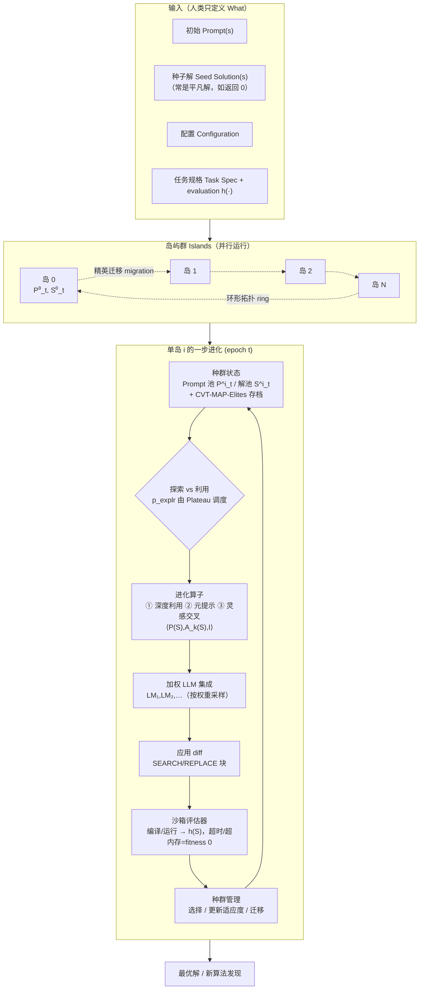

# 组会汇报 · CodeEvolve：开源版的进化型编码 agent

> 本篇是 **F 组（自我改进/自动算法发现）** 的一篇「**开源复刻**」，对标的标杆就是本库 [`2506.13131` AlphaEvolve](2506.13131-alphaevolve-deepmind.md)（DeepMind 白皮书，闭源）。
> 全篇遵循 v2 规范：**Why 三连**（问题层/设计层/结果层）+ 强制 `## ★ 对我们的启发（Inspires Us）`。
> **主线任务**：把 CodeEvolve「复刻了 AlphaEvolve 的什么 / 简化了什么 / 开源了什么」逐项讲清——这是本场组会的题眼。

---

## 1. 封面 · TL;DR

> 主讲提示：开场一句话定调——「AlphaEvolve 把答卷给了你，但不给你笔；CodeEvolve 把笔（代码、超参、数据）全开源了，还证明用开源小模型也能写出接近的答卷。」把记忆锚点钉在「**5/9 追平/超越 AlphaEvolve、成本约 1/10**」。

- **标题**：CodeEvolve: an open-source evolutionary framework for algorithmic discovery and optimization
- **作者/机构**：Henrique Assumpção、Diego Ferreira、Leandro Campos、Fabricio Murai（**Inter Science (Inter&Co)** + **UFMG** + **WPI**），arXiv 2510.14150，2025-10 首发、**v5 2026-05-28**。
- **权威性来源**：**非顶会、arXiv 预印本**（诚实标注）；其分量不在「机构光环」，而在两点：① 它是公开声称**复刻并开源** DeepMind AlphaEvolve 的少数框架之一（代码在 `github.com/inter-co/science-codeevolve`，原文脚注 1）；② 它在 **AlphaEvolve 自家的 9 个基准**上做了**可对照**的实测，并给出**成本数字**——这正是闭源 AlphaEvolve 缺的那块拼图。

**这篇在干什么（一段话）**：CodeEvolve 把「LLM 当变异算子 + 进化搜索」这条 AlphaEvolve 路线，做成一个**透明、全开源、可复现**的框架。它在一个 **CVT-MAP-Elites 存档 + 岛屿式遗传算法**之上，挂一个**加权 LLM 集成 (weighted LLM ensemble)** 作生成引擎，再配三个模块化算子——**深度利用 (depth exploitation)**、**元提示探索 (meta-prompting exploration)**、**灵感式交叉 (inspiration-based crossover)**。在 AlphaEvolve 的 9 个基准上，它**追平/超越 AlphaEvolve 报告值 5/9**；在**匹配预算**下胜开源对手 OpenEvolve / ShinkaEvolve **6/9**；用开源权重 **Qwen3-Coder-30B**，在 `CirclePackingSquare` 上**以约低一个数量级的成本超过 AlphaEvolve 报告分**（约 \$6 vs 约 \$35）。

**3 条带走的结论**：
1. **「复刻」的价值不在重复结果，而在『把怎么做』变成可被检验、可被改进的公共物品**：AlphaEvolve 只给了「48 vs 49」这类硬战果（What），CodeEvolve 给的是**框架 + 超参 + 数据 + 成本曲线**（How），这正是社区复现与迭代所需（原文 §1「contributions」三条）。
2. **核心论点是「编排 (orchestration) > 单个零件」**：消融显示，**没有任何单一组件**（岛屿、MAP-Elites、深度利用、灵感交叉、迁移拓扑）能独立超越 AlphaEvolve；是它们的**协同**带来 SOTA（原文摘要、§5.4、Fig.2）。
3. **开源小模型 + 好编排 ≈ 闭源前沿模型的性价比替身**：Qwen3-Coder-30B（开源权重）在多题上不逊于 GEMINI-2.5，且**成本约低一个数量级**——回答了「便宜能不能也强」（原文 §5.3 Cost efficiency，回答 RQ2）。

---

## 2. 问题与动机（why —— 核心 2 页）

> 主讲提示：这一节要把「为什么『开源复刻』本身就是一项贡献」讲透。把动机钉在两根钉子上：**①闭源不可复现 → 科学共同体卡住；②前沿模型贵且受控 → 准入门槛高**。CodeEvolve 的每个设计，几乎都在回应这两点之一。

**问题层 why（为什么这事值得解决）**：LLM 与「算法推理」结合，已经从「自然语言→代码」的程序合成，跃迁到「自动科学发现」。FunSearch（*Nature* 2024）、EoH（ICML 2024）先证明了「LLM 当**变异算子 (mutation operator)** + 进化」能产出超越人类基线的解；DeepMind 的 **AlphaEvolve** 进一步把它推到**整份代码库**尺度，做出 GPU 内核优化、数据中心调度等硬战果（原文 §1、§2）。**但 AlphaEvolve 闭源、且依赖专有前沿模型**——这「**hinders reproducibility**」（原文 §1 原话）。

**不解决会怎样（谁受影响、证据是什么）**：
- **科学共同体被卡**：一个无法复现的系统，社区**无法验证、无法在其上做增量研究、无法做公平对照**。AlphaEvolve 的白皮书性质，使「它到底靠哪个零件、要多少算力、换个模型还行不行」全是黑箱。
- **准入门槛高**：「对专有前沿模型的依赖」把这条研究路线圈进了**有钱有模型的大厂**。原文引 Belcak et al. (2025)「small language models are the future of agentic AI」，点出**用小开源模型民主化 (democratize)** 的趋势诉求（原文 §1 第二段）。
- **已有开源复刻仍不足**：OpenEvolve、ShinkaEvolve、ThetaEvolve 等已出现，但 ThetaEvolve 依赖**大规模 RL 微调基础设施**（原文 §5、Limitations），门槛仍高；缺一个「**默认配置即开箱、单个开源模型即可、且对照清楚**」的框架。

**核心 intention（一句话形式化）**：构建一个**完全开源、透明、可复现**的进化型编码 agent，把 AlphaEvolve 的「岛屿进化 + LLM 变异 + 自动可验证评估」复刻出来，并证明——**在匹配预算与开源模型下，它能逼近甚至超越闭源 SOTA**。

> 主讲提示：强调一句「**reproducibility 本身就是科学贡献**」。这与本库批判线（[`2506.01372` fail-without-implementation](2506.01372-critique-fail-without-implementation.md)、[`2509.08713` hidden-pitfalls](2509.08713-critique-hidden-pitfalls.md)）直接呼应：没有可跑的实现，宣称就无法被检验。

---

## 3. 研究问题 / 核心 intention（形式化）

原文 §5 显式列出三个研究问题（RQ）——讲的时候把它们当「全篇的脊柱」：

- **RQ1（能否推进 SOTA）**：CodeEvolve 能否在自动算法发现上**推进**当前最优？（对标 AlphaEvolve/ThetaEvolve 的报告值，及匹配预算下的 OpenEvolve/ShinkaEvolve）
- **RQ2（小开源模型能否打）**：更小、更便宜的**开源权重模型**，作 CodeEvolve 的骨干，能否与昂贵的**闭源前沿 LLM** 竞争？（性价比之问）
- **RQ3（组件各贡献多少）**：CodeEvolve 的各个组件，分别如何影响**性能**与**样本效率 (sample efficiency)**？（消融，验证「编排 > 单件」）

**形式化的一句话**：把「找最优算法」抽象成一个**元优化 (meta-optimization)** 问题——**候选程序通过选择、变异、重组被反复精炼，由可执行反馈与适应度信号引导**（原文 §1）。

> 主讲提示：把 RQ1/2/3 写到黑板上，后面 §9（结果）正是逐条回答 RQ1（Table 1/2）、RQ2（成本）、RQ3（消融 Fig.2）。

---

## 4. 相关工作定位（站在谁肩上、和谁不同）

> 主讲提示：这张表是「CodeEvolve 在进化-编码谱系里坐标」的最佳一图。一句话差异：**FunSearch/EoH 进化「固定算法里的一个组件」（AHD，自动启发式设计）；AlphaEvolve/CodeEvolve 进化「端到端的完整程序」**。CodeEvolve 的独特卖点是「**把进化也用到搜索过程本身（元提示进化）+ 全开源**」。

| 维度 | FunSearch (Nature'24) | EoH (ICML'24) | AlphaEvolve (DeepMind'25, 闭源) | ThetaEvolve ('25) | **CodeEvolve（本文，开源）** |
|---|---|---|---|---|---|
| 进化对象 | 单个函数 | 固定算法内的**一个组件**（AHD） | **整份程序/代码库** | 整份程序 | **整份程序**（端到端） |
| 进化「搜索过程」本身 | 否 | 进化提示/启发式 | meta-prompt 进化 | — | **是（元提示探索算子）** |
| 模型 | 小模型即可 | GPT-3.5-turbo | **专有前沿 (Gemini)** | 需 **RL 微调** | **开源权重（Qwen3-Coder-30B）/ 可换前沿** |
| 多样性机制 | 岛屿模型 | 种群 | MAP-elites + 岛屿 | — | **CVT-MAP-Elites + 岛屿 + 精英迁移** |
| 开源 | 部分 | 是 | **否（白皮书）** | 是 | **是（框架+数据+超参指南）** |
| 评估 | 自动可验证 | 自动 | 自动可验证（级联） | 自动 | **自动可验证（沙箱执行）** |

（依据原文 §2「Related Work」四小节 + §5）。**关键定位**：
- **相对 AlphaEvolve**：CodeEvolve 是其**开源复刻**——继承「LLM 提 diff + 自动评估 + 进化库」的骨架，**简化**掉其工业级评估级联/超大集群编排，**补上**公开超参与成本（详见 §7.7 逐项对照表）。
- **相对 AHD（FunSearch/EoH）**：它们只进化「固定算法里的一个可调函数」；CodeEvolve **合成独立的、端到端的完整程序**（原文 §2「AHD frameworks evolve only a single component... rather than synthesizing standalone programs end-to-end」）。
- **相对 OpenEvolve/ShinkaEvolve**：同为开源端到端框架，CodeEvolve 在**匹配配置/预算**下做了**头对头**对照（Table 2），主打「默认配置 + 单开源模型即可」。

> 主讲提示：埋一条批判线——「报告值对照 (reported)」vs「匹配预算对照 (matched)」是两种证据强度。AlphaEvolve/ThetaEvolve 是**报告值**（因闭源/需 RL），OpenEvolve/ShinkaEvolve 是**匹配预算**。后者更硬，前者要打折看（§11 会展开）。

---

## 5. 方法总览（big picture）

> 主讲提示：让听众先记住「**一库（CVT-MAP-Elites）+ 多岛（islands）+ 一引擎（LLM 集成）+ 三算子（深度利用/元提示/灵感交叉）+ 一调度器（Plateau）**」，后面 §7 逐个拆。强调它和 AlphaEvolve 的「四零件」是同构的，但**多样性机制更显式（岛屿+CVT-MAP-Elites 双层）**。

CodeEvolve = **人类给「怎么打分 (evaluation function) + 初始程序 + 问题描述」，机器在程序空间里进化出「怎么算」**。架构基于**岛屿遗传算法 (island genetic algorithm)**（Whitley & Starkweather 1990）：多个种群（岛）**并行独立**进化，**周期性迁移**各自最优个体（原文 §4 开篇、Figure 1）。

下面这张 mermaid 复现原文 **Figure 1** 的「进化循环」，并显式画出**岛屿进化**结构（本篇题眼）：



**直觉**：这就是达尔文进化的「**生成—评估—择优—再生成**」，只不过——
- **变异算子**＝一台会读上下文、会写代码 diff 的 **LLM 集成**；
- **自然选择**＝一个**不会被忽悠的自动沙箱评估器**（跑不通/超时即 fitness 0）；
- **多样性维持**＝**两层**机制：岛屿（粗粒度，岛间隔离+迁移）+ CVT-MAP-Elites（细粒度，按行为特征分格保精英）。

> 主讲提示：把「为什么要『岛屿 + MAP-Elites』两层多样性」先抛出来（后面 §7.5/§7.6 给 Why 三连）：单层很容易**过早收敛**到一个局部最优；两层从「全局隔离探索」和「局部小生境保精英」两个尺度同时抗收敛。

---

## 6. 符号与术语表（先定义，后文要用）

> 主讲提示：这张表是后面所有公式的「字典」。重点让大家记住 $f_\text{sol}$（解适应度）、$f_\text{prompt}$（提示适应度）、$\text{rk}(S)$（排名）、$A_k(S)$（k 近祖先）、$p_\text{explr}$（探索率）——五个量撑起全部三条公式。

| 记号 / 术语 | 含义（原文 §3 Preliminaries / §4） |
|---|---|
| $S$ | 一个**候选解 (solution)**，即一段为解题而生成的**程序**；$S'$ 为其**子代** |
| $P(S)$ | 生成解 $S$ 所用的提示，称 $S$ 的**父提示 (parent prompt)** |
| $\mathcal{S}$ | 解空间（所有合法程序）；$\mathcal{S}^i_t$＝第 $i$ 岛、第 $t$ 轮的解池 |
| $\mathcal{P}^i_t$ | 第 $i$ 岛、第 $t$ 轮的**提示池** |
| $h(\cdot)$ | **评估函数 (evaluation function)** $h:\mathcal{S}\mapsto\mathbb{R}^d$，把解映射为 $d$ 个性能指标（运行时、内存、目标值…） |
| $f_\text{sol}(S)$ | **解适应度 (solution fitness)** $f_\text{sol}:\mathcal{S}\mapsto\mathbb{R}_{\ge 0}$，对应 $h$ 中我们要**最大化**的主指标 |
| $f_\text{prompt}(P)$ | **提示适应度 (prompt fitness)**，由 $f_\text{sol}$ 导出（见 Eq.1） |
| $\text{rk}(S)$ | 解 $S$ 在解池中按 $f_\text{sol}$ **降序排序**后的**排名 (rank)**，最优＝1 |
| $A_k(S)$ | $S$ 的 **$k$ 个最近祖先 (k nearest ancestors)** 的集合（解的「家谱」是有根有向树） |
| $k$ | **最大祖先深度 (maximum ancestor depth)**，截断喂给 LLM 的家谱长度 |
| $I$ | **灵感解集 (inspirations)** $I\subseteq\mathcal{S}^i_t\setminus\{S\}$，作多父代交叉的「灵感」 |
| $\iota$ | 灵感解的**个数 (number of inspirations)** |
| $p_\text{explr}$ | **探索率 (exploration rate)**，决定本步走探索还是利用，由调度器调（§4.3） |
| $N$ | 最大轮数 (epochs)；$t$＝当前 epoch；$i$＝岛编号 |
| diff (SEARCH/REPLACE) | LLM 输出的**代码修改差分**：定位一段代码并提出替换块 |
| CVT-MAP-Elites | 用**质心 Voronoi 镶嵌 (centroidal Voronoi tessellation)** 划分特征空间的 MAP-Elites 存档（Vassiliades 2017） |
| LLMEnsemble | **加权 LLM 集成**：按权重采样一个模型来生成/修改解 |

---

## 7. 方法细节（核心 · 含数学）

> 主讲提示：这是全场最长的一节。节奏建议——每个组件先给 **Why 三连小块**（尤其「设计层 why：朴素替代方案为何失败」），再讲机制，公式严格按「直觉→符号→式子→读出什么」。把三条公式（Eq.1 提示适应度、Eq.2 排名选择、Algorithm 1）讲实即可。

### 7.1 形式化地基：解/提示的「家谱树」与两个适应度

**Why（设计层）**：朴素做法是只盯「解的好坏」。但 CodeEvolve 还要进化「**提示 (prompt)**」——因为 LLM 对提示极敏感（原文 §2 Meta-Optimization 引 Anagnostidis & Bulian 2024）。于是它给「提示」也定义了适应度，让**好提示也能被选择、被遗传**。

**直觉（Eq.1）**：怎么衡量「一个提示好不好」？一个提示可能生成多个解，**只要它曾生成过一个高分解，就说明它有潜力**——哪怕它别的产物很差。所以用「它生成过的解里的**最高**适应度」来代表它。

记号（先定义）：$P$ 为一个提示；$\{S: P(S)=P\}$＝所有由 $P$ 生成的解；$f_\text{sol}(S)$＝解适应度。则**提示适应度**（原文 Eq.1）：

$$ f_\text{prompt}(P) \;=\; \max_{S:\,P(S)=P}\big\{ f_\text{sol}(S) \big\}. $$

**读出什么**：这把提示的价值锚在「它的**最好**孩子」上，而非平均。**这奖励了「有潜力」的提示**——即便它当前的多数产物次优，只要冒过一次尖，就值得保留进化（原文 §3 原话："rewards prompts that have demonstrated the potential to generate high-quality solutions"）。**优化总目标**：在不超过 $N$ 轮、且满足 $h$ 其它指标约束（如运行时、内存）的前提下，**最大化 $f_\text{sol}$**（原文 §3 末）。

> 主讲提示：强调「用 max 不用 mean」是个**刻意的乐观选择**——和强化学习里「乐观初始化鼓励探索」同源。

### 7.2 加权 LLM 集成 (LLMEnsemble)：生成引擎

**Why 三连**
- **问题层**：单个 LLM 要么「探索强但不稳」（高温），要么「精修好但保守」（低温），鱼与熊掌难兼。
- **设计层**：朴素做法是固定一个模型一个温度 → 在「广撒网探索」与「精准利用」之间被迫二选一。CodeEvolve 改用**按权重采样的模型集成**，且**允许为探索/利用配不同集成**（如探索用高温模型、利用用低温模型）。最简情形退化为单个 LLM（原文 §4.1）。
- **结果层**：这让「同一框架」能在不同阶段调用不同「性格」的模型，是后面「Qwen 与 Gemini 在不同题各擅胜场」（§9）的机制基础。

**机制**：每个生成任务，**按集成权重采样**一个模型；该模型用**基于 diff 的 SEARCH/REPLACE 格式**——定位一段代码、提出定向替换——来修改现有解（原文 §4.1）。

> 主讲提示：点明这与 AlphaEvolve 的「Gemini Flash + Pro 集成」是**同一思想**（吞吐换探索量×偶发深度），但 CodeEvolve 把它**参数化、可配置、可换开源模型**了。

### 7.3 进化算子①：深度利用 (Depth exploitation)

**Why（设计层）**：朴素做法是「随机挑个解来精修」→ 浪费算力在平庸解上。CodeEvolve 用**基于排名的选择 (rank-based selection)**，且**概率与排名成反比**——越好的解越可能被选中做精修，让算力流向有希望的谱系。

**直觉（Eq.2）**：我们想「优先精修当前最好的解」，但又不能只选第一名（会丧失多样性）。折中：**给每个解一个与其排名倒数成正比的入选概率**——第 1 名权重 $1/1$、第 2 名 $1/2$……既偏好优者，又给次优者机会。

记号（先定义）：$S\in\mathcal{S}^i_t$ 为候选解；$\text{rk}(S)$＝把解池按 $f_\text{sol}$ 降序排序后 $S$ 的位次（最优为 1）。则**选择概率**（原文 Eq.2）：

$$ \Pr(S) \;:=\; \frac{\text{rk}(S)^{-1}}{\sum_{S'\in\mathcal{S}^i_t}\text{rk}(S')^{-1}}. $$

**读出什么**：分子 $\text{rk}(S)^{-1}$ 让概率随排名**调和式衰减**（不是指数式那么陡，保留长尾探索）；分母是归一化常数。**被选中后**，LLM 集成会拿到 $S$、它的父提示 $P(S)$、以及它的 **$k$ 近祖先 $A_k(S)$**——这个**截断的家谱上下文**鼓励「**渐进、增量**」的改进（沿着已被证明有效的谱系小步深挖），而非「**整体改写策略**」（原文 §4.2 原话）。

> 主讲提示：强调「**截断祖先 $A_k$**」的妙处——给 LLM 看「这条谱系最近怎么一步步变好的」，它就更容易「顺势再走一步」。这是「深度（depth）」一词的来历：沿谱系往深里挖。

### 7.4 进化算子②③：元提示探索 + 灵感式交叉

**Why（设计层，元提示）**：朴素做法是「人手写死提示」→ 一旦提示不好，整条搜索受限。CodeEvolve 用一个**辅助 LLM（MetaPromptingLLM）**：随机取一个解 $S$ 和一个提示 $P$，让它**分析二者、生成一个更丰富的新提示 $P'$**，再用 $P'$ 生成新解。**关键设计**：元提示探索**故意排除祖先链**，好让探索「**不受谱系束缚**」地试新策略（原文 §4.2「intentionally exclude the ancestor chain」）。

**Why（设计层，灵感式交叉）**：朴素做法是**传统二进制交叉 (binary crossover)**——把两个程序的片段拼接。但在 **diff 格式**下这**极易出错**：要在两个不同程序里找到「语义兼容」的区域再合并成一个连贯 diff，几乎不可行（原文 §4.2 原话）。CodeEvolve 改用**灵感式交叉**：把**多个「灵感解」$I$ 连同父代一起喂给 LLM**，让 LLM **理解这些解体现的高层策略，再通过定向编辑把这些思想融入父代**。于是这天然是**多父代 (multi-parent)** 的，二进制交叉成了「单灵感」的特例。

**算法 1（原文 Algorithm 1，核心算子循环）**——直觉：先掷骰子决定走「利用」还是「探索」；利用就「排名选解 + 带家谱精修」，探索就「元提示造新提示 + 无家谱地放飞」。

记号（先定义）：$\mathcal{P}^i_t,\mathcal{S}^i_t$＝第 $i$ 岛提示/解池；$p_\text{explr}$＝探索概率；$k$＝最大祖先深度。

```
Algorithm 1  CodeEvolve 在 epoch t 的核心 利用/探索 循环
1: 输入: 种群 P^i_t, S^i_t；探索概率 p_explr；最大祖先深度 k
2: 输出: 新解 S'，（若走探索）新提示 P'
3: 采样 p ~ Uniform(0,1)
4: if p < 1 − p_explr then                      # —— 走「利用」
5:     按 Eq.2 从 S^i_t 采样 S，并采样灵感 I ⊆ S^i_t \ {S}
6:     收集 S 的祖先 A_k(S)（从 S 到其在 S^i_t 中的根）
7:     S' ← LLMEnsemble( P(S), A_k(S), S, I )    # 带父提示+家谱+灵感
8:     P' ← NULL
9: else                                          # —— 走「探索」
10:    随机均匀采样 S ∈ S^i_t，灵感 I ⊆ S^i_t \ {S}，提示 P ∈ P^i_t
11:    P' ← MetaPromptingLLM( P, S )             # 造一个更丰富的新提示
12:    S' ← LLMEnsemble( P', ∅, S, I )           # 注意：祖先集为空 ∅（放飞）
13: end if
14: return S', P'
```

**读出什么**：
- 利用分支（4–8）：**带家谱 $A_k(S)$**、走 Eq.2 排名选择 → **沿谱系深挖、稳定增量**。
- 探索分支（9–13）：**祖先集为 $\emptyset$**、靠 MetaPromptingLLM 造新提示 → **跳出谱系、广域探新**。
- 两条分支**都注入灵感 $I$**（前者按排名采、后者均匀采），即**交叉无处不在**。
- 原文注明：伪代码**省略了调度器与种群管理**，因为它们与算子逻辑**正交**（orthogonal）。

> 主讲提示：把 Algorithm 1 当「一页讲清 CodeEvolve」的图。一句话总结：**利用=带着家谱往深里挖；探索=扔掉家谱、换个提示重新放飞；两边都借别人的灵感。**

### 7.5 探索调度 (Exploration Scheduling)：Plateau Scheduler

**Why（设计层）**：朴素做法是**固定探索率**或**单调衰减**→ 卡在平台期 (plateau) 时无力自救。CodeEvolve 主用 **Plateau Scheduler**：用**滑动窗口监控「迄今最优适应度」的改进**；**一旦进展停滞，临时调高 $p_\text{explr}$ 鼓励探索；进展恢复后，再逐步退火回基线**（原文 §4.3）。也实现了标准衰减式（指数/余弦）。

**结果层 why**：调度器**轻量**（只需近期适应度统计）、**与算子正交**——这解释了为什么它能在不同问题/不同模型间**免重调**复用（§9 的「跨骨干稳健」正源于此）。

> 主讲提示：类比强化学习的 ε-greedy 自适应——「卡住了就多探索，顺了就多利用」。这是「**反过早收敛**」在时间维度上的一招（空间维度上则是岛屿+MAP-Elites）。

### 7.6 种群管理：初始化 / 沙箱评估 / 精英迁移 / CVT-MAP-Elites

**Why（设计层，岛屿模型）**：朴素做法是**单一大种群**→ 高分个体迅速主导、**过早收敛**、多样性崩塌。岛屿模型让**多个子种群并行独立进化、周期迁移**——**并发评估更高效、多样性更持久、好解能跨岛传播**（原文 §4 开篇、§4.4）。

四个机制（原文 §4.4）：
1. **初始化 (Initialization)**：从一个**初始解（常是平凡解，如「返回 0 的函数」）+ 一段问题描述提示**出发。为造出多样的起始种群，对这个「初始对」**多次提示 LLM 集成**，生成各自独立的解，成为多棵解树的根。
2. **评估与种群控制**：每个新解在**沙箱**里带**运行时/内存上限**执行；成功则算 $f_\text{sol}(S)$ 与 $h(S)$ 入库；**失败（崩溃/超时/超内存）记 fitness 0，但日志留存**作为后续提示的「教训上下文」（instructive context）。
3. **精英迁移 (Elitist Migration)**：各岛顶尖个体按**固定迁移频率/比率**复制到**相邻岛**。**防环、防过早收敛**的三条铁律：① 一个解**最多从其原岛迁出一次**；② **永不迁移某岛的最优解**（保其独特性）；③ 迁入者成为**新树的根**（父指针置 NULL）。
4. **质量—多样性 via CVT-MAP-Elites**：除岛屿外，**每岛再维护一个 MAP-Elites 存档**。用户定义**特征描述子 (feature descriptors)**（代码级属性、算法行为、运行时画像等），用**质心 Voronoi 镶嵌 (CVT)** 把特征空间划成格；每格只留**最适精英**；新解映射到其格、若超过格内现任就替换。**采样灵感/父代时也从存档抽**（按格内精英排名、或在已填格间均匀），以**注入结构化多样性**。

**Why（设计层，CVT-MAP-Elites 为何用 CVT 而非规则网格）**：规则网格 (regular lattice) 在**高维特征空间会维度灾难**（格子数指数爆炸、大量空格）；CVT 用质心 Voronoi 把空间**自适应地**划成数量可控的胞元，**高维下更均匀、更可扩展**（Vassiliades et al. 2017；原文 §4.4）。

**两层多样性如何「互相补台」**（原文 §4.4 原话精炼）：
- **深度利用**沿已证谱系**收窄**搜索、提供稳定脚手架做增量精修；
- **灵感交叉**从**遥远的存档胞元**搬来策略，**防过早收敛**——这些是深度利用永远够不到的；
- **CVT-MAP-Elites** 保证多样性池**始终被填充**，让交叉**永远有有意义的遗传素材可取**。
→ 三者**互为强化**，消融证明**单件不足、合奏才强**（§5.4）。

> 主讲提示：这是本篇「**岛屿模型为何用**」的 Why 三连落点，务必讲满：**空间上**两层抗收敛（岛=粗，MAP-Elites=细）、**时间上**一层抗收敛（Plateau 调度）。三道防线共同对付进化算法的头号敌人——**过早收敛 (premature convergence)**。

---

## 8. 与 AlphaEvolve 的逐项对照（复刻 / 简化 / 开源）—— 本篇题眼

> 主讲提示：这是整场组会**最该停留**的一张表。讲法：左手 AlphaEvolve（[`2506.13131`](2506.13131-alphaevolve-deepmind.md) 的「四零件」），右手 CodeEvolve，逐行问「**复刻了？简化了？还是开源补强了？**」。强调「复刻 ≠ 抄结果，而是把黑箱拆成可改的白箱」。

| 子系统 | AlphaEvolve（DeepMind，闭源） | CodeEvolve（本文，开源） | 关系判定 |
|---|---|---|---|
| **总架构** | 异步控制循环：Prompt 采样器 + LLM 集成 + 评估器池 + 进化数据库 | 岛屿 GA + LLM 集成 + 沙箱评估 + CVT-MAP-Elites + 三算子 + Plateau 调度 | **复刻**（同构，模块化重组） |
| **变异引擎** | Gemini 2.0 Flash + Pro 集成，diff(SEARCH/REPLACE) | 加权 LLM 集成（可配探索/利用不同集成），同款 diff 格式 | **复刻 + 参数化**（可换开源模型） |
| **进化库 / 多样性** | MAP-elites + 岛屿（原文只说「受启发」，未给完整公式） | **岛屿 + CVT-MAP-Elites 双层**，精英迁移有明确三铁律 | **复刻 + 显式化/补全**（CVT 抗高维） |
| **算子** | meta-prompt 进化 + diff 重组 | 深度利用(Eq.2) + 元提示探索 + 灵感式交叉（多父代）| **复刻 + 细化为 3 个模块化算子** |
| **探索-利用平衡** | 由库采样隐式实现 | **显式 Plateau Scheduler**（监控平台期自适应调 $p_\text{explr}$）| **新增/显式化** |
| **评估** | 评估**级联** (cascade) + LLM 反馈 + 大规模并行（单解可达 ~100 计算时） | 沙箱执行 + 运行时/内存限 + 失败记 0、日志留存 | **简化**（无工业级级联/超大集群） |
| **基础模型** | 专有前沿（Gemini） | **开源权重 Qwen3-Coder-30B** / 也测 GEMINI-2.5、GPT-4.1、Claude Sonnet 4.5、o4-mini、gpt-oss-20B | **开源化**（民主化准入） |
| **可复现性** | 白皮书、不全开源、依赖内部仿真器/工作负载 | **框架 + 实验数据 + 超参指南全开源**（GitHub） | **开源补强**（核心贡献） |
| **战场** | 矩阵乘(48 vs 49)、Kissing-11D、数据中心调度、FlashAttention 等**工业级** | **AlphaEvolve 的 9 个算法基准** + EoH 的 3 个 AHD 任务 | **缩小到可复现基准**（非工业落地） |

**一句话总结**：CodeEvolve **复刻**了 AlphaEvolve 的「LLM 进化骨架」，**显式化/补全**了多样性与调度机制（CVT-MAP-Elites、Plateau、三算子），**简化**掉了工业级评估级联与超大集群，并**开源**了从框架到超参到成本的一切——把「不可复现的硬战果」换成「**可复现、可改进、性价比高**的公共框架」。

> 主讲提示：若有人问「那它有没有复刻出 AlphaEvolve 的『48 vs 49』那种硬数学突破？」——**没有**（它的战场是 9 个标准基准，不是开放数学猜想）；但它在**这些基准上 5/9 追平/超越 AlphaEvolve 报告值**，且**成本低一个数量级**——这是它的「硬战果」（§9）。

---

## 9. 实验设置 + 主要结果（setting / metrics / params + 数字解读）

> 主讲提示：先把「**怎么比的**」讲清（报告值对照 vs 匹配预算对照），再读数。结果对应 RQ：Table 1（vs AlphaEvolve/ThetaEvolve，报告值）→RQ1；Table 2（vs OpenEvolve/ShinkaEvolve，匹配预算）→RQ1；成本→RQ2；Fig.2 消融→RQ3。

### 9.1 实验设置（settings / params）

- **算力平台**：**AWS SageMaker**，固定 per-run 算力预算（vCPU/RAM），每个候选解在**隔离沙箱**带严格运行时/内存上限评估（原文 §5.2、附录 C）。
- **两套集成配置**：① **GEMINI-2.5**（Comanici et al. 2025，近似「前沿模型」设定）；② **仅 Qwen3-Coder-30B**（开源权重，探索性价比）。另在附录 B.5 测了 6 种骨干。
- **基准（9 个 AlphaEvolve 实例，原文 §5.1 + 附录 A.1）**：3 个装填问题 `CirclePackingSquare`($n{=}26,32$)、`CirclePackingRect`($n{=}21$)、`HexagonPacking`($n{=}11,12$)；点放置 `MinimizeMaxMinDist`($n{=}16,d{=}2$ 与 $n{=}14,d{=}3$）；两个自相关不等式 `FirstAutocorrIneq`、`SecondAutocorrIneq`。
- **EoH 套件（3 个 AHD 任务）**：在线装箱 OBPP、旅行商 TSP、流水车间调度 FSSP，匹配 EoH 的 **LLM 调用总数与评估预算**（原文 §5.1、Tables 3–5）。
- **超参默认值（原文 §5.4 末，「实证稳健的默认集」）**：**环形(ring/Cycle)迁移拓扑、迁移率 0.1、初始探索率 0.2 + Plateau 调度、CVT-MAP-Elites（以 fitness 与 evaluation 为描述子）、最大祖先深度 $k\in[3,5]$、灵感数 $\iota\in\{2,3\}$**。值得强调：**在 Qwen3-Coder-30B / GEMINI-2.5 / GPT-4.1 / Claude Sonnet 4.5 / o4-mini / gpt-oss-20B 间切换时，无需重调提示或算子**（原文 §5.4）——「编排收益不绑定单一模型族」。
- **运行规模举例（EoH 对照，原文 §5.1）**：**10 个岛**；154 epochs for OBPP（30s 超时）、152 for TSP（60s）、152 for FSSP（120s）；每题 **3 次独立运行**报 best 与 mean。

**指标定义式（务必给定义，原文 §5、附录 A）**：
- **装填类（Circle/Hexagon Packing）**：最大化**半径之和** / 最小化**外接尺寸**。`CirclePackingSquare`＝单位正方形内放 $n$ 个不相交单位圆，**最大化半径之和**（↑）。
- **`MinimizeMaxMinDist`**：放 $n$ 个 $d$ 维点，**最小化** $\max$ 距离与 $\min$ 距离之**比** $\dfrac{\max_{i\neq j}\lVert x_i-x_j\rVert}{\min_{i\neq j}\lVert x_i-x_j\rVert}$（↓）。
- **First Autocorrelation Inequality**（原文附录 A.1）：求**最大**常数 $C_1$ 使对所有非负 $f:\mathbb{R}\mapsto\mathbb{R}$，
  $$ \max_{-1/2\le t\le 1/2}(f*f)(t)\;\ge\; C_1\Big(\int_{-1/4}^{1/4} f(x)\,dx\Big)^2, $$
  其中 $f*f$ 是**卷积**。任务＝构造非负**阶梯函数**使 $\dfrac{\max_{-1/2\le t\le1/2}(f*f)(t)}{(\int_{-1/4}^{1/4}f\,dx)^2}$ **最小**（↓，即逼近上界）。
- **Second Autocorrelation Inequality**：求**最小**常数 $C_2$ 使 $\lVert f*f\rVert_2^2\le C\,\lVert f*f\rVert_1\,\lVert f*f\rVert_\infty$；任务＝构造阶梯函数使该比**最大**（↑，从下方逼近 $C_2$）。
- **EoH 三任务**：OBPP/TSP/FSSP 均以**与最优/理论值的差距**或**最优 bin 数之比**为目标（OBPP 越接近理论最优越好、TSP/FSSP 与精确解的 gap 越小越好；原文附录 A.2）。

### 9.2 主要结果（数字 + 「结果层 why」）

**(a) RQ1 · vs AlphaEvolve & ThetaEvolve（报告值对照，原文 Table 1）**——CodeEvolve **追平/超越 AlphaEvolve 报告值 5/9**，并在 `MinimizeMaxMinDist` 与 `CirclePackingSquare`($n{=}32$) 上**刷新最优**：

| 问题 | AlphaEvolve | ThetaEvolve | **CodeEvolve(最优)** |
|---|---|---|---|
| CirclePackingSquare($n{=}26$,↑) | 2.63586 | 2.63598 | **2.63598**（追平最好） |
| CirclePackingSquare($n{=}32$,↑) | 2.93794 | — | **2.93957**（新最优） |
| CirclePackingRect($n{=}21$,↑) | **2.36583** | — | 2.36583（追平） |
| HexagonPacking($n{=}11$,↓) | **3.93009** | — | 4.02786（落后） |
| HexagonPacking($n{=}12$,↓) | **3.94191** | — | 4.00001（落后） |
| MinimizeMaxMinDist($n{=}16,d{=}2$,↓) | 12.88927 | — | **12.88923**（新最优） |
| MinimizeMaxMinDist($n{=}14,d{=}3$,↓) | 4.16585 | — | **4.16579**（新最优） |
| FirstAutocorrIneq(↓) | **1.50316** | **1.50313** | 1.51343（落后） |
| SecondAutocorrIneq(↑) | **0.96102** | 0.94690 | 0.88110（落后） |

**结果层 why**：**主要差距在两个自相关不等式**——AlphaEvolve/ThetaEvolve 明显更好。原文 §11（Limitations）给出机制解释：**这类问题需要高度专门化的解析构造 (highly specialized analytic constructions)，对 CodeEvolve 的组合式搜索 (combinatorial search) 不那么友好**，可能需领域适配或更强骨干模型。反之，几何装填/点放置这类**组合优化**正中其下怀，故能刷新最优。

**(b) RQ1 · vs OpenEvolve & ShinkaEvolve（匹配预算对照，原文 Table 2，均用 Qwen3-Coder-30B、3 次独立运行）**——CodeEvolve **最优 6/9、平均也 6/9** 胜出，是开源框架里匹配条件下的最强者。代表数字：`CirclePackingSquare`($n{=}32$) 最优 **2.93957**（Shinka 2.69473 / Open 2.93156）；`MinimizeMaxMinDist`($n{=}16$) 平均 **12.91569**（Shinka 13.48234 / Open 12.97046，越低越好）。**结果层 why**：匹配预算下仍领先，说明优势来自**编排**而非「多花算力」。

**(c) RQ1 · vs EoH（AHD，匹配 LLM 调用与预算，原文 Tables 3–5）**——尽管 CodeEvolve **并非为 AHD 专门设计**，仍有竞争力：
- **OBPP（Table 3，越低越好）**：在**分布外 C500** 实例上**显著胜** EoH（如 1k C500：CodeEvolve-Best **0.00%** vs EoH 2.13%）；在 C100 上 EoH 领先。**结果层 why**：CodeEvolve 端到端合成的程序**更会泛化到 OOD 规模**。
- **TSP（Table 4）**：TSP20 与 EoH 并列 0.000；TSP50/100 略逊。
- **FSSP（Table 5，11 个 Taillard 测试集）**：最优运行**整体均值追平 EoH（0.23 vs 0.23，gap 0.23）**，并在 **6/11** 个测试集上**胜** EoH。

**(d) RQ2 · 成本效率（原文 §5.3 Cost efficiency，本篇性价比核心）**：两套集成**互补**——Qwen3-Coder-30B 在 `CirclePackingSquare` 与两个自相关问题上最强；GEMINI-2.5 在 `CirclePackingRect`、两个 `HexagonPacking`、两个 `MinimizeMaxMinDist` 上最强。**成本差最悬殊处**：`CirclePackingSquare`($n{=}26$) 上，**Qwen3-Coder-30B 约 900 次模型调用、约 \$6** 即超过 AlphaEvolve 报告分；而 **GEMINI-2.5 约 400 次调用、约 \$35**（原文 §5.3、Fig.15–16）。即**开源小模型以约低一个数量级的成本**拿到 SOTA。**结果层 why**：开源模型单次更便宜，虽需更多次调用，**总成本仍碾压**——印证「开源 + 好编排 = 前沿模型的性价比替身」，回答 RQ2「肯定」。

> 主讲提示：成本这条是全场最「接地气」的卖点。一句话记忆：**\$6 的开源 Qwen 打过了报告里的 AlphaEvolve，且比自家 \$35 的 Gemini 还省。**

---

## 10. 消融与分析（哪个部件贡献多少 · 回答 RQ3）

> 主讲提示：消融是「编排 > 单件」论点的**证据链**。把三层消融串起来讲：组件级（full/naive/no-evolution）、算子级（深度 vs 灵感）、机制级（MAP-Elites/迁移拓扑）。一句话：**没有任何单一组件能独立超越 AlphaEvolve，是协同才行。**

**(a) 组件级（原文 §5.4、Fig.2，在 `CirclePackingSquare` 上）**——三档配置：
- **full method**（全算子）、**naive evolution**（标准探索/利用，无本文组件）、**no evolution**（反复拿初始提示+解问 LLM，无任何其它解的上下文）。
- 结论：**full 在均值与样本效率上全面胜出**。尤其 $n{=}32$：**只有 full 超过 AlphaEvolve 报告分**；$n{=}26$：naive 基线要**两倍以上评估次数**才追平 full。→ **组件不仅提分，更是拿到 SOTA 的『使能因素 (enabling factor)』**（回答 RQ3）。

**(b) 算子级（原文 §5.4、附录 B.2、Fig.8）**——拆「深度利用」与「灵感交叉」：
- **只深度（$\iota{=}0$）**：**不能**超过 AlphaEvolve；
- **只灵感（$k{=}0,\iota{=}2,3$）**：**能**超过 AlphaEvolve；
- **两者合并（full）**：**持续优于任一单用，且样本效率更高** → **二者间有正向协同 (positive synergy)**。

**(c) 机制级（原文 §5.4、附录 B.2，Fig.9–14）**：进一步消融表明 **MAP-Elites 与迁移拓扑的选择**也是「超越 AlphaEvolve」的关键因素，强化「**合奏 (in unison)** 才强」。

> 主讲提示：把 §7 每个组件的「设计层 why」与这里的消融**一一对上**——这是「每个设计都在还债」的证据。特别点出「**只灵感能赢、只深度不能**」这个反直觉细节：跨小生境搬策略（灵感交叉）比沿谱系深挖（深度利用）对**冲破 AlphaEvolve 报告分**更关键。

---

## 11. 局限与批判（诚实区分宣称 vs 边界）

> 主讲提示：这一节要把「宣称」和「证据强度」分开。最该敲打的是「**报告值对照**」的弱点和「**没碰开放数学猜想**」。

**原文自承（§Limitations）**：
1. **对照证据强度不齐**：与 AlphaEvolve/ThetaEvolve 的比较**基于报告值**（因 AlphaEvolve 闭源、ThetaEvolve 需超出本预算的 RL 微调基础设施）；**评估预算、并行度、实现细节的差异可能影响这些对照**——即「追平 5/9」要**打折看**。
2. **自相关不等式上明显落后**：需高度专门化解析构造的问题，对其组合式搜索不友好，需领域适配或更强骨干（机制已在 §9 解释）。
3. **完整网格搜索（问题×组件×骨干）组合爆炸**：故只在 Qwen3-Coder-30B 上做最细消融，跨骨干结果（§5、附录 B.5）只作**佐证**。
4. **超参需校准**：迁移拓扑、岛数、灵感数、最大祖先深度等**在新域可能需重调**；虽给了稳健默认（附录 C.2），**不保证迁移到所有问题类型**。
5. **大规模进化推理成本仍非平凡**：虽比闭源便宜，但**对算力受限的研究者仍可能是门槛**。

**本篇/社区可补的批判**：
- **「复刻」≠「复现硬战果」**：CodeEvolve 的战场是 **9 个标准基准**，并**未触碰** AlphaEvolve 的招牌成果（4×4 矩阵乘 48、Kissing-11D、生产级内核/调度）。它证明的是「**框架与机制可复刻、在基准上可追平**」，而非「**能独立做出同级别的开放数学/工程突破**」——这是两件不同分量的事，汇报时务必区分。
- **arXiv 预印本，未经同行评审**：结论尚未经第三方独立复算（虽代码开源降低了这一风险）。
- **成本数字依赖具体云配置**：\$6/\$35 绑定 AWS SageMaker 某配置与某时点价格，**外部复算可能偏移**（但因开源，可自行重测——这正是它优于 AlphaEvolve 之处）。
- **reward hacking 风险继承**：凡「自动评估 + 进化」皆可能**钻评估空子**（把分刷高却无真本事），原文未专门讨论防 reward-hacking 的 holdout 机制（与本库 [`m9.7`](../m9.7-self-improvement-evolution/) 的 holdout 守 0.500 教训呼应）。

---

## ★ 对我们的启发（Inspires Us）

> 这一节回答一句话：**CodeEvolve 对我（们）接下来的研究，到底能用上什么？** 落点全部锁定 [`m9.7-self-improvement-evolution`](../m9.7-self-improvement-evolution/)（可跑缩小版进化）与 [`2506.13131` AlphaEvolve](2506.13131-alphaevolve-deepmind.md)，以及「可复现性」这条主线。

- ➤ **a. 可直接借用的招（reuse）**：
  1. **「灵感式交叉」替代二进制交叉**——在 diff/代码进化里，**别拼片段，改为「把多个高分解连同父代喂给 LLM，让它领会高层策略再定向融入」**。消融证明它比深度利用更能冲破强基线（§10b）。→ 可**原样搬进** `m9.7`：把现有「单点变异」升级为「多灵感多父代」算子，测残留多样性是否上升、是否更快越过 holdout 0.500。
  2. **两层多样性 + 时间维调度**：**岛屿（粗）+ CVT-MAP-Elites（细）+ Plateau 调度（时间）** 三道防线对付过早收敛。`m9.7` 若只有单种群，可先加**一层 MAP-Elites 存档**（以「fitness + 评估次数」为描述子，照搬原文默认），低成本拿多样性。
  3. **失败也留作上下文**：失败解记 fitness 0 但**日志进库**当「教训提示」。这是几乎零成本的招，可直接加到任何「生成-评估-再生成」管线。

- ➤ **b. 可迁移到我们课题（transfer）**：CodeEvolve 用**开源 Qwen3-Coder-30B + 好编排**就逼平闭源 SOTA、且成本低一个数量级。**迁移到 `m9.7`**：我们的缩小版进化本就该跑在「**单卡/小开源模型**」上——CodeEvolve 给出**可直接抄的稳健默认**（环形迁移、迁移率 0.1、初始探索率 0.2 + Plateau、$k\in[3,5]$、$\iota\in\{2,3\}$）。**迁移时要改的前提**：① 我们任务的 $h$ 必须**不可造假**（否则进化只会学骗分）；② 我们没有 AWS 集群，岛数/并行度要按单机缩小，**Plateau 调度的窗口长度需随 epoch 预算重标**。

- ➤ **c. 它暴露的开放问题 = 我们的机会（opportunity）**：
  - **缺口①：防 reward-hacking 未被正面处理**。CodeEvolve 全靠沙箱 $h$ 当选择压力，但**未给 holdout/独立验证**。→ **机会**：把 `m9.7` 的 **holdout 守 0.500** 机制**接到 CodeEvolve 式进化上**，量化「同样预算下，加 holdout 是否牺牲峰值但换来真泛化」。**可下手第一步**：在 `m9.7` 复刻其「灵感交叉」算子后，开 A/B——有/无 holdout，看刷分 vs 泛化的权衡。
  - **缺口②：自相关不等式上落后**，因「需专门化解析构造」。→ **机会**：能否给进化**注入符号/解析先验**（如让灵感解里混入解析构造模板），测它能否把「组合搜索」短板补上？

- ➤ **d. 与本库其它论文/模块的连接（connect the dots）**：
  - **正面呼应**：与 [`2506.13131` AlphaEvolve](2506.13131-alphaevolve-deepmind.md) 是「**闭源原型 ↔ 开源复刻**」的完美一对——讲 AlphaEvolve 的「可验证评估护城河」时，CodeEvolve 正好是「**把护城河外的人也放进来**」的那座桥。与 [`2505.22954` DGM](2505.22954-darwin-godel-machine.md)（元层自改进）、[`2408.08435` ADAS](2408.08435-adas-agentic-system-design.md) 同属 F 组「进化/自改进」谱系。
  - **批判线呼应**：与 [`2506.01372` fail-without-implementation](2506.01372-critique-fail-without-implementation.md)、[`2509.08713` hidden-pitfalls](2509.08713-critique-hidden-pitfalls.md) 正反互证——**「开源可跑的实现」正是这些批判呼吁的解药**；但「报告值对照打折」又恰是这些批判提醒的「宣称 vs 实测」陷阱。
  - **可复现性主线**：它给本库「能不能在单卡跑」这条实用线**补了一个真能跑、有超参指南的范本**。

- ➤ **e. 如果我来做下一步（my next move）**：我会在 [`m9.7`](../m9.7-self-improvement-evolution/) 里**加两个开关**——①「**灵感式多父代交叉**」（抄 Algorithm 1 利用分支的 $I$ 注入），②「**CVT-MAP-Elites 存档**」（fitness+评估次数为描述子），然后用我们现有的 holdout 评估跑一组对照：**在同样算力预算下，看 ①+② 是否（a）更快越过 holdout 0.500、（b）残留多样性更高、（c）不引入新的 reward hacking**。一周内能出最小结论；若成立，再考虑把骨干换成小开源 coder 模型验证「成本-性能」是否复现 CodeEvolve 的结论。

> 主讲提示：这一节是全场高潮——前面讲「巴西/WPI 团队复刻了 DeepMind 什么」，这里讲「**我们下周就能在 m9.7 上试什么**」。落点是「灵感交叉 + MAP-Elites + holdout 对照」，能被同组同学直接接力。

---

## 12. 在 auto-research 版图的位置（相对已有工作的增量）

> 主讲提示：用「Tool→Analyst→Scientist 阶梯」给它定位，并讲清它把谁向前推了一步。

- **它把谁向前推了一步（更新增量）**：把 **AlphaEvolve（闭源、不可复现）→ CodeEvolve（开源、可复现、性价比量化）**。在本库 F 组里，它是继 [`2506.13131` AlphaEvolve](2506.13131-alphaevolve-deepmind.md)（对象层超优化的硬战果）、[`2505.22954` DGM](2505.22954-darwin-godel-machine.md)（元层自改进）之后，**第一篇把这条路线『开源化 + 成本量化 + 匹配预算对照』**的工作。它**不证伪**任何人，而是**补全**了 AlphaEvolve 缺的「可复现」半张图。
- **关键区分（别混三条进化路线）**：
  - **AlphaEvolve / CodeEvolve**：进化「**目标解/搜索算法**」的代码（**对象层**超优化，靠自动 $h$）。
  - **DGM / Gödel-Agent**：改写「**agent 自己**」的代码（**元层**自改进）。
  - **FunSearch / EoH**：进化「**固定算法里的一个组件**」（**AHD**，非端到端）。
- **阶梯定位**：按 Tool→Analyst→**Scientist** 阶梯，CodeEvolve 与 AlphaEvolve 同在「**有自动判据的窄域**」达到「做出可独立验证的算法改进」的 Scientist 级；但它**靠 $h$、不能自定义研究问题**，且战场限于基准（未碰开放数学猜想），故是「**可复现的、性价比版的窄域 Scientist**」。

---

## 13. 复现与可用性

> 主讲提示：这是它相对 AlphaEvolve 的最大优势，务必正面讲。

- **开源程度**：**框架 + 实验数据 + 实用超参指南**全开源，仓库 `github.com/inter-co/science-codeevolve`（原文脚注 1、§1、§6）。这是它区别于 AlphaEvolve（白皮书）的**根本卖点**。
- **单卡/低成本能跑吗**：**比 AlphaEvolve 友好得多**——用**单个开源模型 Qwen3-Coder-30B** 即可，`CirclePackingSquare` 一题约 **\$6 / ~900 次调用**。但原文仍提示「**大规模进化推理成本非平凡**」（§Limitations），完整跑 9 题×多骨干仍需可观算力。实验跑在 **AWS SageMaker**（固定 vCPU/RAM 预算、沙箱评估）。
- **稳健默认（可直接抄，原文 §5.4 + 附录 C.2）**：环形迁移拓扑、迁移率 0.1、初始探索率 0.2 + Plateau 调度、CVT-MAP-Elites（fitness+evaluation 为描述子）、$k\in[3,5]$、$\iota\in\{2,3\}$；**6 种骨干间切换免重调提示/算子**。
- **坑**：① 评估 $h$ 一旦可被钻空子 → **reward hacking**（原文未给 holdout 防护）；② 自相关类「需解析构造」的问题别指望（§9/§11）；③ 成本数字绑定具体云配置/时点，**自行复算可能偏移**（但开源使复算可行）。

---

## 14. 组会讨论问题（5–8 个）

> 主讲提示：挑 2–3 个最能点燃讨论的抛出。①③④ 最辣。

1. **「报告值对照」算不算公平证据？** CodeEvolve 对 AlphaEvolve/ThetaEvolve 用报告值（因闭源/需 RL）。作为审稿人，「追平 5/9」你信几分？要补哪些实验才肯信「真追平」？
2. **「只灵感交叉能赢、只深度利用不能」**（§10b）这个反直觉结论说明什么？是否意味着在我们的进化里，「**跨小生境搬策略**」比「**沿谱系深挖**」更值得投资？
3. **复刻 ≠ 复现硬战果**：CodeEvolve 没碰 AlphaEvolve 的「48 vs 49」。一个「在基准上追平、但拿不出招牌突破」的开源复刻，**科学价值该怎么估**？
4. **\$6 的开源 Qwen 打过报告里的 AlphaEvolve**——这是否意味着「**前沿模型在这条路线上的护城河主要是工程/算力，而非智能**」？反例是什么（如自相关问题）？
5. **三道抗收敛防线（岛屿/MAP-Elites/Plateau）哪个最关键？** 若只能保留一道，留哪道？在我们单机小预算下又该留哪道？
6. **reward hacking**：CodeEvolve 全靠沙箱 $h$，未给 holdout。把 `m9.7` 的 holdout 接上去，会牺牲多少峰值、换来多少真泛化？怎么设计最小实验？
7. **元提示探索「故意扔掉家谱」** 与 **深度利用「带家谱」** 的张力——什么任务下「放飞」收益大、什么任务下「带谱深挖」收益大？

---

## 15. 一页速记（takeaways）

> 主讲提示：汇报当天用这页速览。

- **一句话**：CodeEvolve = **AlphaEvolve 的开源复刻**——岛屿 GA + 加权 LLM 集成 + CVT-MAP-Elites + 三算子（深度利用 Eq.2 / 元提示 / 灵感交叉）+ Plateau 调度；**人类只给评估 $h$ + 初始程序**，机器在程序空间进化出算法。
- **vs AlphaEvolve（题眼）**：**复刻**骨架、**显式化/补全**多样性与调度（CVT-MAP-Elites、Plateau、3 算子）、**简化**工业级评估级联与超大集群、**开源**框架+数据+超参+成本。
- **硬数字**：AlphaEvolve 报告值**追平/超越 5/9**（刷新 `MinimizeMaxMinDist`、`CirclePackingSquare`$n{=}32$）；匹配预算胜 OpenEvolve/ShinkaEvolve **6/9**；EoH 上 FSSP 均值追平(0.23)、胜 6/11；**开源 Qwen ~\$6 超过报告里的 AlphaEvolve、比 Gemini 的 ~\$35 省一个数量级**。
- **三道抗收敛防线**：岛屿（粗）+ CVT-MAP-Elites（细）+ Plateau 调度（时间）。
- **核心论点**：**编排 > 单件**（消融：无单一组件能独立超越 AlphaEvolve；只灵感能赢、只深度不能）。
- **命门/局限**：报告值对照要打折；自相关不等式（需解析构造）落后；未碰开放数学猜想；reward hacking 未防；arXiv 未评审。
- **记忆锚**：**5/9 追平 AlphaEvolve、成本约 1/10、\$6 的开源 Qwen 赢报告里的 AlphaEvolve。**

---

## 16. 质量自检（写完逐条核对）

- [x] 每个公式前都有直觉 + 全部符号先定义？（Eq.1 提示适应度、Eq.2 排名选择、自相关不等式 $C_1/C_2$、MinMaxDist 比值；Algorithm 1 逐行注释）
- [x] setting/metrics/params 齐全、指标有定义式？（§9.1 平台/集成/基准/超参默认；§9.1 各指标定义式）
- [x] 数字/公式都标了 §/Table/Eq/Fig 出处？（Table 1–5、Fig.1/2/8/15–16、§3/4.1/4.2/4.3/4.4/5.1–5.4/Limitations、附录 A/B.2/B.5/C.2）
- [x] why 三连（尤其设计层「朴素替代→为何失败→本文为何更优」）？（LLM 集成、深度利用、元提示、灵感交叉、岛屿、CVT、Plateau 各给设计层 why）
- [x] 有且仅一节 `## ★ 对我们的启发（Inspires Us）`，a/b/c/d/e 齐全且条条落到具体（m9.7 + AlphaEvolve + 可复现）？
- [x] 给出至少 1 个第一人称、可执行「下一步」？（§e：m9.7 加灵感交叉+MAP-Elites+holdout 对照，一周出结论）
- [x] TL;DR/版图定位点明权威性来源（arXiv 预印本、开源补强）与相对 AlphaEvolve 的增量？
- [x] 与 AlphaEvolve 的逐项对照（复刻/简化/开源）作为独立重点章节（§8）？
- [x] 区分「论文宣称」vs「批判/局限」、缺失标「原文未给出」？（§11；ThetaEvolve 完整公式「原文只说受启发，未给」式的忠实标注）
- [x] 约 20 页、PPT 风格、mermaid（岛屿进化）、每二级标题带「> 主讲提示」？
