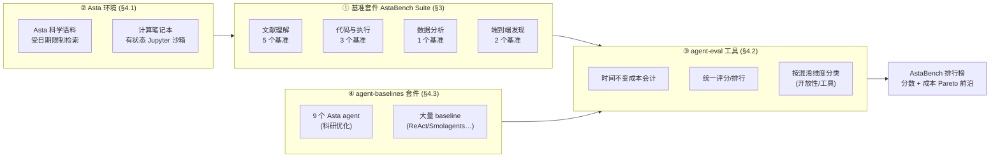

# 组会精读 · AstaBench（Ai2，主题组 E 评测）

> 主讲提示：这是一篇 **benchmark** 论文，但它的真正卖点不是「又一个数据集」，而是一套**评测方法学**——
> 把「花了多少钱」和「做得多好」绑在一起看。开场就把这句话钉住：
> **「在 AstaBench 之前，没人能公平地说哪个科研 agent 更强，因为没人控制成本和工具。」**

---

## 1. 封面 · TL;DR

- **作者/出处**：Jonathan Bragg, Mike D'Arcy 等（Ai2 Asta Team，约 40 位作者），ICLR 2026 会议论文，arXiv 2510.21652。代码与排行榜全开源（`github.com/allenai/asta-bench`、`agent-eval`、`agent-baselines`，排行榜 `allenai.org/asta/leaderboard`）。
- **一段话**：AstaBench 是**第一个面向「科研 agent」整体能力的严格基准套件 (holistic benchmark suite)**。它把「做科研」拆成**四大类、11 个子基准、2400+ 道题**（文献理解 / 代码与执行 / 数据分析 / 端到端发现），并配套**第一个生产级、可复现的科研搜索环境 (Asta Environment)**——给所有 agent 同一套受日期限制的科学文献检索工具。最关键的方法学创新是：通过 `agent-eval` 工具把**美元成本 (USD cost)** 作为与准确率并列的一等评测量，画出**成本-性能前沿 (Pareto frontier)**，并在**排行榜上同时记录「分数」与「达到该分数所需算力开销」**（原文 Figure 1）。作者用它评测了 **57 个 agent、跨 22 个 agent 类 (agent class)**，结论是：**尽管个别能力有真实进步，AI 离「解决科研助理」仍很远**（原文 Abstract、§5）。
- **三条带走的结论**：
  1. **科研助理远未解决**：整体最高分仅 **53.0（Asta v0，闭权模型混合）**，最好的纯开权 agent 仅 **11.1%**（Smolagents Coder + Llama-4-Scout，原文 §5、Table 4）。
  2. **成本是一等公民**：最「经济」的模型是 **gpt-5-mini**——整体得 **32%**，仅比最佳模型低 **21 个绝对百分点**，但**每题成本只要 $0.04，便宜一个数量级**（原文 §5）；甚至「用贵模型反而总成本更低」（弱模型陷在循环里走更多步，原文 §5）。
  3. **「换最新最大的模型」并非可靠配方**：gpt-5 相比 o3 在多数基准只涨 0–5%，却在若干专用 agent 上**反而拖累性能**（gpt-5 被调成擅长 ReAct 工作流，对定制工作流适应差，原文 §5）。

> 主讲提示：三条结论分别对应「能力天花板低」「成本视角」「模型≠万灵药」。这正是 benchmark 论文最该交付的——
> 不是某个系统赢了，而是**对整个领域现状的可信快照**。

---

## 2. 问题与动机（why —— 本篇最该讲透的一节，约 2 页）

**背景**：从 OpenAI / Google 的通用「深度研究 (deep research)」系统，到专门面向科学的 AI Scientist (Lu et al. 2024)、AIGS (Liu et al. 2024)、Agent Lab、CodeScientist——能做科研的 agent 一夜之间多到数不过来。但**很多藏在付费墙后、各自用定制方式评测**，于是出现一个朴素却致命的问题（原文 §1 原话）：

> **"how are end users and AI developers to know which perform best?"**（用户和开发者到底怎么知道谁更强？）

**为什么现有 benchmark 不够用？** 作者把现有 agent 基准套件的缺陷归纳为**五条**（原文 §1、Table 1），每条都直接对应后面 AstaBench 的一项设计：

1. **缺标准任务环境与工具**：例如**不存在大规模、受控的文献检索工具**，于是分不清一个 agent「赢」是因为 AI 能力强，还是仅仅因为它接到了更好的信息源。
2. **不控制混淆变量 (confounding variables)**：尤其是**模型成本与工具访问**。一个朴素策略——「重复多跑几次取多数投票」——靠**烧钱**就能刷高准确率（Kapoor et al. 2024）。不控成本，分数就没有可比性。
3. **接口不标准化**：套件通常假设「要么只评和它一起来的固定 agent，要么用户为它专门造 agent」。把一个通用 agent 接到完整套件上，往往要大量人工改造，**伤害可复现性与受控比较**。
4. **缺乏真实产品使用数据驱动的任务**：产品级使用数据通常被公司当商业机密，于是 benchmark 题目不一定对应**真实世界收益**——分数高不代表用户真受益。
5. **缺乏全面的 baseline agent**：大多数已发表评测只和「自己的几个 ablation」比，无法判断所谓进步是不是**真的进步**。

**这篇的赌注（核心动机）**：与其再造一个「窄而漂亮」的数据集，不如**先把评测方法学立起来**——

> **不是问「某个 agent 能得多少分」，而是问「在公平受控（同样工具、同样成本会计）的条件下，整个领域离真正的科研助理还有多远，以及每一分进步要花多少钱」。**

**为什么「成本」必须是论点而非脚注**：这是全篇的灵魂。作者在 §5 反复强调——同一个 ReAct agent，换不同模型，分数差不多但成本能差 1–2 个数量级；不报成本，等于默许「谁烧钱多谁赢」。把成本变成一等评测维度，才谈得上**可持续的进步度量**（原文 §1 末："cost-aware performance reporting"）。

> 主讲提示：这一节把「五大缺陷 → 五项设计」的对应讲清楚，后面 how 全都是在补这五个洞。
> 最该敲黑板的是第 2 条：**不控成本的 agent 排行榜，本质上是「钱包排行榜」**。

---

## 3. 研究问题 / 核心 intention（形式化成一句话）

把要解决的问题压成一句：

> **能否构造一个「整体性 (holistic)、可复现、控混淆」的科研 agent 评测套件，使得任意通用 agent 都能以标准接口接入，在同样工具与统一成本会计下，沿「成本-性能前沿」被公平排名，从而给出领域现状的可信快照？**

它隐含的**假设**：
- (a) 「做科研」可被分解为**有限个可机器评分的子能力**（文献理解、代码执行、数据分析、端到端发现），其加总能**近似**整体科研能力（原文称「holistic measure」，但明确**偏向 CS**，见 Table 1「weighted towards CS」）。
- (b) **成本可被「时间不变 (time-invariant)」地归一化**——用一个冻结的价格快照折算，使得即便 API 价格变动，历史评测仍可比（原文 §4.2）。
- (c) 一个**生产级、受日期限制的搜索语料**足以替代「真实联网检索」，并避免新论文污染旧题（原文 §4.1）。

---

## 4. 相关工作定位（站在谁肩上、和谁不同）—— 一张对比表

AstaBench 把自己放在两条线之间（原文 §2）：**整体性 agent 评测**（如 HAL、Inspect Evals、Terminal-Bench）与**面向科学的 agent 基准**（如 LAB-Bench、ScienceAgentBench、CORE-Bench、MLE-bench）。它在六个维度上自我定位（原文 Table 1 的列）：

| 维度（原文 Table 1） | 含义 | AstaBench | 多数现有套件 |
|---|---|---|---|
| Holistic sci. reasoning | 覆盖广任务类型且跨多个科学域 | ✓ 广（偏 CS） | ✗ 多为单域/单类（HAL 仅编码、LAB-Bench 仅生物） |
| Product usage-based | 题目源自真实产品使用 | ~ 部分（源自 Asta 真实用户请求） | ✗ 几乎都没有 |
| Controlled, realistic tools | 提供标准、可复现工具 | ✓ 生产级文献语料 | ✗（HAL 是少数认真做成本的例外） |
| Scoring accounts for confounders | 评分系统性计入成本/工具 | ✓ 成本、工具、开放性 | ✗（少数 ~Costs） |
| Tasks ready for general agents | 统一格式、支持通用 agent | ✓ 解耦、标准格式 | ✗ 多与某 agent 框架耦合 |
| # Agents / Total Cls. | 评测的 agent 数 / agent 类数 | **57 / 22** | 远少（除 HAL 113/10 在数量上多，但不控这些维度） |

**与 RE-Bench / MLE-bench 的定位差异（本篇重点）**：
- **MLE-bench / RE-Bench（及 EXP-Bench、MLAgentBench）**：聚焦**机器学习工程 (ML engineering)** 或**AI 研究复现**这一**窄而深**的环节——「把一个 ML 任务做到多好」。它们**不覆盖文献理解、长文综述、数据分析、端到端发现**的全链，也**不把美元成本作为一等排行维度**。
- **AstaBench**：要的是**广度 + 控混淆**——「整条科研流程的全景 + 成本归一」。它甚至**包含一个 agent-中立的端到端任务 E2E-Bench**，专门用来横向比较 AI Scientist / Agent Lab / CodeScientist 这类系统（原文 §2 末、§E.9），填补「这些旗舰系统从未被系统性互比」的空白。

> 主讲提示：一句话区分——**RE-Bench/MLE-bench 是「深度纵切」，AstaBench 是「广度横扫 + 成本标尺」**。
> 它们不是竞争，是互补；但只有 AstaBench 敢把「$」画进坐标轴。

---

## 5. 方法总览（big picture，先直觉后形式化）

AstaBench 由**四块拼成一个完整生态**（原文 §3、§4，Figure 1）：

**直觉（四块各解决一个洞）**：
- **① 套件**补「缺整体性任务」——一题不够，要覆盖整条科研链；
- **② 环境**补「缺标准工具」——给所有人**同一把检索铲子**，且受日期限制防污染；
- **③ 工具**补「不控混淆 + 接口不标准」——统一打分、把成本折算成时间不变的美元、并按开放性/工具用法给 agent 贴标签；
- **④ baseline 套件**补「缺全面对照组」——一次性放出 22 个 agent 类供横比。

> 主讲提示：强调**这四块缺一不可**。只给数据集不给环境，工具差异会污染结论；
> 给了环境不给成本会计，又退回「钱包排行榜」。AstaBench 的价值在「全套」。

---

## 6. 符号与术语表（后文统一用）

| 记号 / 术语 | 含义 |
|---|---|
| agent class（agent 类） | 一种 agent 架构（如 ReAct、Smolagents、Asta v0），可用不同 LLM 实例化 |
| agent（实例） | 「agent 类 + 具体 LLM」的组合（如 ReAct + gpt-5）；57 个 agent = 22 个类 × 若干模型 |
| holistic（整体性） | 覆盖广任务类型且跨多个科学域 |
| confounder（混淆变量） | 干扰「能力比较」的非能力因素，主要指**成本**与**工具访问** |
| cost（成本） | 一次评测折算成的**归一化美元**，由模型用量经冻结价格映射算得（§4.2） |
| Pareto frontier（帕累托/效率前沿） | 在「成本-分数」平面上，给定成本下分数最优的点连成的曲线（§5、Figure 2 称 "Efficiency Frontier"） |
| Score（分数） | 各基准/类别的得分，**类别级用宏平均 (macro average)**（Table 4 脚注） |
| $w_i$ | 任务 $i$ 在类别宏平均中的权重（默认 1.0，两个 LitQA 任务各 0.5，§D） |
| Openness（开放性 O） | agent 实现的开放程度：✓ 开源开权 / ~ 开源闭权 / 𝒜 闭源但有 API / ✗ 仅 UI（§4.2、§B） |
| Tooling（工具用法 T） | 是否用标准工具：✓ 标准 / ~ 定制接口 / ✗ 完全定制（§4.2、§B） |
| recall@k / nDCG | 检索指标：前 k 命中率 / 归一化折损累积增益（§E.2 PaperFindingBench 用） |
| LLM-as-judge | 用 LLM 当评审，按 rubric 给开放式输出打分（多个基准用，§3、§E） |

---

## 7. 方法细节 ① 基准套件：覆盖了哪些科研子能力（§3，Table 2）

**why**：要度量「科研能力」，先得回答「科研由哪些可评分的子能力组成」。作者把整条科学发现流程切成**四大类**，共 **11 个子基准**（原文 Table 2）。这是「holistic」一词的具体兑现。

**四大类 → 11 子基准一览（原文 §3、Table 2；测试集/验证集规模、域、所用工具、日期截止）**：

| 类别 | 基准 | 域 | Test / Val | 工具 | 评分方式 |
|---|---|---|---|---|---|
| **文献理解** Lit. Und. | PaperFindingBench *† | CS | 267 / 66 | Corpus | LLM-judge（检索式 F1/recall+nDCG）|
| | LitQA2-FullText-Search *† | Biology | 75 / 10 | Corpus | 程序式 recall@30 |
| | ScholarQA-CS2 *† | CS（长文综述）| 100 / 100 | Corpus | LLM-judge（4 facet）|
| | LitQA2-FullText | Biology（选择题）| 75 / 10 | Corpus | 程序式 accuracy |
| | ArxivDIGESTables-Clean * | Mixed（生成综述表）| 100 / 70 | Snippet | LLM-judge（蕴含召回）|
| **代码与执行** Code & Exec. | SUPER-Expert * | CS | 45 / 50 | Code | 程序式 exact-match |
| | CORE-Bench-Hard⁻ | Mixed | 37 / 35 | Code | 程序式 |
| | DS-1000 | CS | 900 / 100 | Code | 程序式（跑测试用例）|
| **数据分析** Data Analysis | DiscoveryBench * | Mixed | 239 / 25 | Code | LLM-judge（假设匹配分）|
| **端到端发现** End-to-End Disc. | E2E-Bench *† | CS | 40 / 10 | Code | LLM-judge（rubric）|
| | E2E-Bench-Hard *† | CS | 40 / 10 | Code | LLM-judge（rubric）|

注：`*` = Ai2 新建；`†` = 此前未公开；`⁻` = 删去需 GPU 的任务（如 CORE-Bench-Hard⁻ 从 45 减到 37 样本，§E.6）。日期截止 (Date Cutoff) 是为了**让检索工具只能看截止日前的论文，防止新论文污染答案**（Table 2 脚注）。

**每类在考什么（why 视角，原文 §3 + §E.1）**：
- **文献理解**：从「找到对的论文」（PaperFindingBench：给文本 query 返回排序论文列表）、「读全文答题」（LitQA2）、到「写带正确引用的长文综述」（ScholarQA-CS2）、「自动生成文献对比表」（ArxivDIGESTables-Clean）。这是 agent 当前**最成熟**的一类。
- **代码与执行**：复现并跑通论文里的实验（SUPER-Expert：clone 仓库→装依赖→跑→报结果；CORE-Bench-Hard⁻：从「capsule」复现分析；DS-1000：日常数据科学编码）。
- **数据分析**：DiscoveryBench——给定数据集 + 发现目标，自动**找并验证假设**（数据驱动发现）。
- **端到端发现**：E2E-Bench / E2E-Bench-Hard——从一个研究问题出发，走完**想点子→规划→设计实验→实现→执行→分析→写报告**的完整闭环，产出技术报告 + 代码。这是**最难、也最像「AI Scientist」**的一类，且是**agent-中立基准**（不为某个系统量身定做，§E.9）。

> 主讲提示：把 Table 2 当「考纲」念一遍即可。要点是**广**——从「查文献」一路考到「自己做一篇研究」。
> 并强调**日期截止**这个防污染设计：它让「文献检索」这种最容易被「联网作弊」的任务也能可复现。

---

## 8. 方法细节 ② Asta 环境：给所有 agent 同一把铲子（§4.1，Table 2）

**why**：第 2 节第 1、2 条缺陷的根子是「**工具不统一**」。如果 A agent 接了私有的强检索、B agent 只能裸搜，比出来的差距是**工具差距而非智能差距**。所以必须有**标准、可复现、受控**的工具环境。作者称这是「据我们所知第一个真实、可复现的科研环境」（原文 §4）。

环境提供两套核心工具（原文 §4.1）：

1. **Asta 科学语料 (Asta Scientific Corpus)**：生产级、可复现的**科学文献检索工具集**。关键能力——**可限制只返回某日期之前的论文**（防新论文污染），`snippet_search` 还能限定到特定论文 ID（当文本检索器用）。通过 **MCP (Model Context Protocol)** 暴露一组标准工具：`snippet_search`、`search_papers_by_relevance`、`get_paper`、`get_paper_batch`、`get_citations`、`search_authors_by_name`、`get_author_papers`、`search_paper_by_title`。
2. **计算笔记本 (Computational Notebook)**：一个**有状态的 Jupyter 笔记本**沙箱。能跑 Python 与 IPython 魔法命令（`%%writefile`、`%matplotlib inline`、`!shell_command`），**变量与环境跨单元保留**，便于**增量式**解题。单个单元超 5 分钟会返回超时消息。沙箱内代码还能回调宿主提供的工具（如 Asta 语料），从而支持 **CodeAct** 式（代码即动作）agent。

**为什么这是「解耦 (decoupled)」的关键**：工具通过 MCP 标准协议提供，**干净地与 agent 分离**，任何通用 agent 都能集成——这正是第 2 节第 3 条「接口不标准」的解药。

> 主讲提示：这一页回答「凭什么说比较是公平的」。一句话：**同样的检索语料 + 同样的执行沙箱 + 受日期限制**。
> 没有这层，后面所有分数都不可比。

---

## 9. 方法细节 ③（**本篇核心**）成本受控评测如何形式化（§4.2、§D）

> 主讲提示：**整场报告的高潮**。慢讲。这一节回答——「把 \$ 当一等公民」到底**怎么落地成数学**。

### 9.1 为什么要「时间不变的成本」——直觉先行

**直觉**：我们想比较「不同时间、不同人跑的 agent」谁更划算。但 API 价格天天变——今天 gpt-5 降价，昨天的评测成本就「显得贵」。如果直接用「当时实付的钱」，**历史结果不可比**。于是作者的设计是：**不记录实付金额，而是记录「模型用了多少 token（model usage）」，再乘以一个冻结的价格表**，把成本折算成一个**与时间无关的归一化美元数**（原文 §4.2 "Time-invariant cost calculation"）。

记号（先定义，后用）：
- 一次评测中，agent 调用了若干模型，第 $j$ 次调用在模型 $m_j$ 上消耗用量 $u_j$（如输入/输出 token 数，由底层 **Inspect** 框架记录，UK AI Security Institute 2024）；
- $\text{price}(m)$：**冻结快照**里模型 $m$ 的单位价格，取自社区维护的 `litellm` 成本表的一个固定快照（自定义模型用 Together AI 的按规模定价补齐，§4.2 脚注）；
- 该价格表**计入缓存折扣 (cache discounts)**（因为越来越多 agent 用缓存优化，且 OpenAI 等会自动给），但**不计入与时延相关的折扣**（如 service tier、批处理）。

成本可写成（原文 §4.2 文字的形式化，论文未给独立编号公式）：

$$ \text{Cost}_{\text{normalized}} \;=\; \sum_{j} \text{price}\big(m_j\big)\cdot u_j $$

**读出什么**：成本只依赖「用量 × 冻结价格」，**与评测发生的真实日历时间无关**。所以即便日后 API 涨跌，**同一快照下历史 agent 仍可公平对比**（原文 §4.2：「Using a frozen snapshot allows a fair comparison of evaluation costs even if API prices change between evaluations」）。排行榜可周期性更新快照，但**会按当前快照重算所有成本以保持公平**（§4.2 脚注 10）。

> 主讲提示：这就是「time-invariant cost」的全部精髓——**冻结价格表 + 只记用量**。
> 类比：用「不变价 GDP」而非「现价 GDP」比较不同年份经济，剔除通胀（这里是「剔除 API 价格波动」）。

### 9.2 成本-性能前沿（Pareto / 效率前沿）——把 \$ 画进坐标轴

**直觉**：有了「分数」和「成本」两个数，**单看任一个都会误导**——高分但天价、或便宜但没用，都不是我们要的。真正有意义的是「**给定预算下能买到的最高分**」。把每个 agent 画成「成本-分数」平面上的一个点（横轴 = 每题成本，**对数刻度**；纵轴 = 分数），**那些「在其成本档位上无人能更高分」的点**连起来，就是**效率前沿 (Efficiency Frontier)**，即帕累托最优 (Pareto-optimal) 集合（原文 Figure 2、§5、§D）。

记号：
- $a$：一个 agent；$\text{score}(a)$、$\text{cost}(a)$ 为其分数与每题归一化成本；
- 称 $a$ **被 $a'$ 帕累托支配**，当 $a'$ 同时**不更贵且不更差、且至少一项严格更优**：

$$ a' \succ a \;\iff\; \text{cost}(a') \le \text{cost}(a)\ \wedge\ \text{score}(a') \ge \text{score}(a)\ \wedge\ (a'\neq a\ \text{且至少一项严格}) $$

- **帕累托前沿** = 不被任何 agent 支配的 agent 集合：$\;\mathcal{P}=\{a:\nexists\,a'\ \text{s.t.}\ a'\succ a\}$。

**读出什么**：排行榜（Table 4–17）里用**加粗 (bold)** 标出每个「成本-分数」列对上**位于帕累托前沿**的 agent（原文各表脚注：「Bold denotes the agent is on Pareto-optimal frontier for that column pair」）。于是「谁更强」被替换成「**谁在前沿上**」——一个**同时考虑能力与开销**的判据。Figure 2 中前沿点用**虚线相连**，直观展示「最优质量-成本权衡」。

> 主讲提示：这是全篇最该让组里记住的一张图（Figure 2，5 个子图：Overall + 四类各一）。
> 一句话：**AstaBench 不评「冠军」，评「性价比前沿」**。横轴是 log 美元——便宜一个数量级，在图上就是左移一格。

### 9.3 把「混淆」做成排行榜的可见标签：开放性 × 工具（§4.2、§B）

**why**：成本之外，**「开放程度」和「是否用标准工具」**也是混淆——一个闭源、用私有工具的 agent 拿高分，意义不同于一个开源、用标准工具的 agent。作者**不把它们折进单一分数，而是作为可见的分类标签**贴在每个提交上（原文 §4.2、§B，表中列 O / T）：

**开放性 (Agent openness, O)** —— agent 实现有多透明可复现（§B）：
- ✓ **开源开权 (Open-source, open-weight)**：代码 + 模型权重全公开，可完整复现；
- ~ **开源闭权 (Open-source, closed-weight)**：代码公开但依赖专有模型，部分可复现；
- 𝒜 **闭源但有 API (Closed source & API available)**：实现专有，但能经 API 验证结果（不能复现方法）；
- ✗ **仅 UI (Closed & UI only)**：既无代码也无 API。

**工具用法 (Agent tooling, T)** —— 评测时用什么工具（§B）：
- ✓ **标准 (Standard)**：只用环境预定义工具（即 Inspect 的 `state.tools`）；
- ~ **定制接口 (Custom interface)**：用等价底层环境的定制工具——对 AstaBench，文献任务限定为「受日期限制的 Asta 科学语料」、代码任务限定为「标准沙箱 Dockerfile 内的 IPython」；
- ✗ **完全定制 (Fully custom)**：用了超出上述约束的工具。

**读出什么**：排行榜因此能回答更细的问题——「**在『开源 + 标准工具』这一最严格档位里，谁最强**」，而不是让一个「闭源 + 私有检索」的系统笼统夺冠。这是「scoring accounts for confounders」的完整含义：**成本进坐标轴，开放性/工具进标签**。

### 9.4 提交、评分与排行设置（§4.2、§4.3、§5）

- **评分骨架**：`agent-eval` 工具在 **Inspect** 评测框架上加一层，提供「**统一评分 + 报告 + 排行榜**」，把一组 Inspect 格式的基准组织成一个**套件**（原文 §4.2）。Inspect 本身只记模型用量、不记归一化成本也不做套件级排行，`agent-eval` 正是补这个洞。
- **类别/整体聚合**：类别分用**宏平均 (macro average over benchmark statistics)**（Table 4 脚注）；权重 $w_i$ 默认 1.0，**两个 LitQA 任务各 0.5**（避免在文献理解类里重复计数同一数据集，§E.2、§D）。
- **不确定性**：报告 **95% 置信区间** $=\pm 1.96\times \text{SE}$（原文 §D）。单基准的 SE 来自任务内评测样本的方差；**类别级 SE 用加权平均解析传播**：

  $$ \text{SE}_{\text{category}}=\frac{\sqrt{\sum_i w_i^2\cdot \text{SE}_i^2}}{\sum_i w_i} $$

  其中 $w_i$ 为任务权重、$\text{SE}_i$ 为任务 $i$ 的标准误。**注意作者自陈**：该传播**假设任务间独立**，可能**轻微低估不确定性**（原文 §D 原话："could slightly underestimate uncertainty"）。
- **重复与算力**：为防「多跑取多数投票」刷分（Dodge et al. 2019），评测**同时报成本与准确率**，并报多次运行的标准差（§5）。
- **提交与排行榜接口**：两种入口（原文 §4.2）——(i) `agent-eval` 的 **CLI 排行榜**（当前需鉴权、对公众暂不可用）；(ii) **Web 应用排行榜**（`allenai.org/asta/leaderboard`），支持**外部提交**（Hugging Face 用户鉴权），提供交互式图表与表格。论文称这是**「第一个正确计入混淆变量（所用工具、推理成本）的 agent 排行榜」**（原文 §1）。

> 主讲提示：把「为什么排行榜要带成本 + 标签」收口成一句：**它把『公平比较 agent』从口号变成可操作的协议**——
> 统一框架 (Inspect)、统一成本会计 (frozen snapshot)、统一标签 (O/T)、统一聚合 (macro avg + 解析 SE)。

---

## 10. 方法细节 ④ baseline agent 套件与所用模型（§4.3，Table 3）

**why**：第 2 节第 5 条缺陷是「没有全面对照组」。作者放出 `agent-baselines` 套件——**16 个 agent 类**（论文正文 §4.3 称 16 类、实验评测扩到 22 类），分两组（原文 Table 3）。

**(A) Asta agent（为科研优化的 9 类）**：`Asta Paper Finder`（文献搜索）、`Asta Scholar QA` 与 `Asta Scholar QA (w/ Tables)`（长文综述/报告）、`Asta Table Synthesis`（综述表）、`Asta Code`（代码执行）、`Asta DataVoyager`（数据分析）、`Asta Panda`、`Asta CodeScientist`（端到端发现）、`Asta v0`（多能力编排，**用模型 mixture**）。多数**开源、用「定制接口」工具**；`Asta Panda / CodeScientist / v0` 为「完全定制」工具。

**(B) Baseline agent**：
- **通用 agent**：`ReAct`（标准工具）、`Smolagents Coder`（定制接口）——这两个能跑**全部** 11 个基准，是横比主力；
- **专用/外部商业系统**：`You.com Search/Research API`、`Elicit`、`FutureHouse Crow/Falcon`、`OpenAI Deep Research`、`OpenSciLM`、`Perplexity Sonar Deep Research`、`SciSpace Deep Review`、`STORM`、`Faker`（端到端 baseline）。

**所用模型（横跨开/闭权，原文 §5 与各表）**：闭权 `gpt-5 / gpt-5-mini / gpt-4.1 / gpt-4o / o3`、`claude-sonnet-4 / claude-3-5-haiku / claude-3-7-sonnet`、`gemini-2.5-flash / gemini-2.5-pro`；开权 `llama-4-scout`、`llama-3.1-openscholar-8b` 等。**共 57 个 agent 跨 22 个 agent 类**（原文 §1、§5）。

> 主讲提示：强调 **ReAct + Smolagents 是「能打满全场」的两条 baseline 主线**——
> 后面很多「换模型」的洞察，都是在这两条线上做的对照。

---

## 11. 实验设置（setting / params / 成本 / 种子，写全）

- **规模**：2400+ 题，11 基准，4 类；评测 **57 agent / 22 类**（原文 §1、§5）。各基准 Test/Val 规模见 §7 表（如 DS-1000 测试 900 题、PaperFindingBench 267 题、E2E-Bench 40 题）。
- **底层框架**：**Inspect**（UK AI Security Institute 2024）做评测执行与日志；`agent-eval` 加套件/成本/排行层（§4.2）。
- **成本会计**：冻结 `litellm` 价格快照 + 计入缓存折扣，**时间不变归一化美元**（§9.1）。
- **指标定义**：**每个基准有各自的评分函数**（见 §12）；类别用宏平均、LitQA 两任务各权重 0.5（§D）。
- **不确定性/种子**：95% CI $=\pm1.96\,\text{SE}$；类别 SE 按 §9.4 公式解析传播；多次运行报标准差以暴露「重复刷分」（§5、§D）。
- **LLM-judge 评审模型**：随基准不同——ScholarQA-CS2 用 `gemini-2.5-flash`（与 `gemini-2.5-pro` 相关性 0.995，取便宜者，§E.3）；DiscoveryBench 用 `gpt-4-preview-0125`（§E.8）；ArxivDIGESTables-Clean 用 `GPT-4o` 做表格 unrolling 与蕴含判定（§E.4）。
- **关键工程参数**：计算笔记本单元 **5 分钟超时**；CORE-Bench-Hard⁻ 删 GPU 任务（45→37）、删 `run` 脚本与预算结果迫使 agent 自行安装运行（§E.6）；DS-1000 保留 100 题作验证（§E.7）；SUPER 用 Expert split（45 端到端题）当测试、Auto split（50 题）当验证（§E.5）。

> 主讲提示：这页是「setting/metrics/params 写全」的落点。被问「指标怎么算」时翻 §12；被问「成本怎么算」翻 §9.1；被问「不确定性」翻 §9.4 那个 SE 公式。

---

## 12. 各任务指标定义（benchmark 论文的重头戏，§E.1–E.10）

> 主讲提示：风格规范要求「指标必须有定义式或精确定义」。这一节逐个基准给出**评分定义**，并标注**程序式 vs LLM-judge**。

**(1) PaperFindingBench（文献查找，§E.2）**——返回满足 query 的排序论文列表。题分三型，混在一起、不标注类型：
- **导航/元数据 query（gold-set 已知）**：用结果集上的 **F1**。
- **语义 query（无完整 gold-set，靠 LLM 判定）**：用 **estimated-recall 与 nDCG 的调和平均 (harmonic mean)**。其中 recall 用「估计集大小」归一以界定在 [0,1]——

  直觉：语义查询没有「全部相关文献」的金标准，只能**估计**应有多少篇，再看召回了多少。
  记号：$\widehat{R}$ 为**估计集大小**（多组宽松阈值跑 PaperFinder 取并集，再乘 2–10 的因子作上界，§E.2）；$\text{recall@}\widehat R$ 为前 $\widehat R$ 命中比例。最终该 query 分 = $\text{HarmonicMean}\big(\text{recall@}\widehat R,\ \text{nDCG}\big)$。
- **最终分**：**所有 query 分的平均**（不分类型）。

**(2) LitQA2-FullText（生物医学选择题，§E.2）**：用 **accuracy**（答对比例），过滤到「相关论文在 Asta 语料快照内」的 85 题（199 题的子集）。

**(3) LitQA2-FullText-Search（检索版，§E.2）**：只考「找到能回答问题的 $K$ 篇之一」，用 **recall@30**（沿用 Skarlinski et al. 2024）。**注意**：LitQA2 这两个任务在文献理解类宏平均里**各计 0.5 权重**以免重复计数。

**(4) ScholarQA-CS2（长文综述 QA，§E.3）**：分 = **四个 facet 的平均**——
- **citation recall（引文召回）**：每条 claim 是否被其引用充分支持（完全支持且≥1 条支撑引文记 1.0；标题支持但无引文记 0.5；否则 0），对所有 claim 取平均；
- **citation precision（引文精度）**：每条引用是否（至少部分）支撑其 claim（是 1 / 部分 0.5 / 否 0），宏平均；
- **answer relevance（回答相关性）**：逐段判断是否切题，取相关段落比例；
- **answer coverage（回答覆盖度）**：覆盖了多少「必要点 (key ingredients)」——对每个 ingredient 簇，LLM-judge 给 0/1/2（不满足/部分/完全），按 ingredient 重要度加权平均（「answer critical」权重是「valuable」的两倍）。
- 评审模型 `gemini-2.5-flash`；与人类标注一致性 Kendall $\tau=0.467$（剔除 Elicit 后升到 0.800，§E.3）。

**(5) ArxivDIGESTables-Clean（综述表生成，§E.4）**：先用 LLM 把生成表「展开 (unroll)」成原子陈述，分 = **参考表陈述中被生成表蕴含 (entailed) 的比例**（即一种 recall，GPT-4o 判蕴含，沿 TabEval 思路）。

**(6) SUPER-Expert（实验复现，§E.5）**：Expert split 45 题，用**精确匹配 (exact match)**——产出的输出字典（常为含 loss 等指标的 JSON）与金标准是否一致。

**(7) CORE-Bench-Hard⁻（复现分析，§E.6）**：从「capsule」复现并把答案写进 `report.json`，**程序式**比对；用 Hard 难度（删 run 脚本与预算结果）、删 GPU 题（37 样本）。

**(8) DS-1000（数据科学编码，§E.7）**：补全代码后**跑问题特定测试用例**，分 = 通过率 (accuracy)。900 测试题。

**(9) DiscoveryBench（数据驱动发现，§E.8）**：分 = **Hypothesis Matching Score**——预测假设与金标准假设在 **context（上下文）、variables（变量）、relationship（关系）** 三维上的对齐，由**三个 LLM-judge 分相乘**（`gpt-4-preview-0125`，判蕴含/等价）。

**(10) E2E-Bench / (11) E2E-Bench-Hard（端到端发现，§E.9–E.10）**：给研究问题→产出技术报告 + 推理轨迹 + 代码/数据。分 = **针对 rubric 的整体 LLM-judge 评估**——对每个相关 agent 输出（report、code、artifacts）按 rubric 各打一分，**三个 LLM-judge 分的综合**。E2E-Bench-Hard 任务定义/评测/baseline/环境同 E2E-Bench，仅**数据采集方法不同（更难）**。是**agent-中立**基准（不为某系统定制）。

**程序式 vs LLM-judge 一览**（原文 §3 末明确）：
- **LLM-judge**：PaperFindingBench、ScholarQA-CS2、ArxivDIGESTables-Clean、DiscoveryBench、E2E-Bench、E2E-Bench-Hard；
- **程序式 (programmatic)**：LitQA2-FullText、LitQA2-FullText-Search、SUPER-Expert、CORE-Bench-Hard⁻、DS-1000。

> 主讲提示：被问「这套件可信吗」时，关键论据是 §E.3 的 **rubric 验证**——作者真去测了「LLM-judge 评分 vs 专家排序」的相关性（$\tau$ 0.467→0.800），并做了「把被评系统从 rubric 构造中剔除」的偏差检验（部分系统掉 2.5 分、$p\le0.01$）。**诚实地承认 judge 有偏，并量化它**，是这篇值得学的地方。

---

## 13. 主要结果（数字 + 解读，别只贴表）

> 主讲提示：结果的「头条」不是某个 agent 赢，而是**全行业分数都低 + 成本视角带来反直觉发现**。

**整体榜（原文 Table 4，能做全部任务的 agent；分数为四类宏平均）**：

| O / T | Agent | 模型 | Overall 分 | Overall 成本 | 文献 | 代码 | 数据 | 端到端 |
|---|---|---|---|---|---|---|---|---|
| ~ / ✗ | **Asta v0** | mixture | **53.0** | 3.40 | 62.2 | 47.6 | 33.2 | **68.8** |
| ~ / ✓ | ReAct | gpt-5 | 44.0 | 0.31 | 54.6 | **55.0** | 30.5 | 36.1 |
| ~ / ~ | ReAct | o3 | 39.4 | **0.16** | 46.8 | 49.3 | **33.7** | 28.0 |
| ~ / ~ | Smolagents Coder | gpt-5 | 37.5 | 0.13 | 46.0 | 30.9 | 26.7 | 46.5 |
| ~ / ✓ | ReAct | gpt-5-mini | 31.6 | **0.04** | 36.5 | 50.5 | 26.9 | 12.6 |
| ✓ / ~ | Smolagents Coder | llama-4-scout | 11.1 | 0.11 | 20.0 | 3.6 | 20.2 | 0.5 |

**读出什么（原文 §5）**：
- **科研助理远未解决**：整体最高 **53.0**，且这还是个**「完全定制工具」**的编排系统（Asta v0）。最好的**纯开权** agent 仅 **11.1%**（Smolagents Coder + llama-4-scout）。最好的**开源 agent**（含闭权模型）是 Asta v0（53.0）。
- **成本反直觉一**：**最经济模型是 gpt-5-mini**——整体 32% 左右，仅比最佳低 21 个绝对百分点，但**每题 \$0.04，便宜一个数量级**（§5 原话）。
- **成本反直觉二**：**用贵模型反而总成本更低**——gemini-flash / llama-scout 每 token 便宜 3–25 倍，但「弱模型走更多步、卡在循环里」，导致 ReAct 整体**贵一倍**（§5）。这正是「为什么必须按整任务成本而非单 token 价比较」的铁证。
- **换模型≠万灵药**：gpt-5 相比 o3「整体提升轻微，多数基准 0–5%」，但在 4 个基准暴涨——ScholarQA-CS2 +13.4%、SUPER-Expert +24.8%、LitQA2-FullText-Search +25.3%、E2E-Bench-Hard +21.1%（§5）。**而把 gpt-5 塞进定制 agent（如 Smolagents Coder）反而掉分**（gpt-5 被调得擅长 ReAct，对替代工作流适应差，§5）。

**专用工具确有用，但有代价**：`Asta v0` 比次佳 agent（ReAct + gpt-5）整体高约 **9%（53.0 vs 44.0）**，但代价是**显著更高的开发（工程）成本**，且端到端类**推理成本也更高**（§5）。

**分类别现状（原文 §5 + Table 5–10）**：
- **文献理解**：相对最成熟，最好的模型约 **80%**（ScholarQA-CS2，Table 6；Asta Scholar QA / Elicit / SciSpace 约 85%+，主要靠引文子分）。但 PaperFindingBench 仍远未「解决」（Asta Paper Finder 39.7，碾压次佳 ReAct，Table 5）。综述表生成最高仅 **~43% recall**（Table 7），仍弱。
- **代码与执行**：**远未解决**——SUPER-Expert 上几乎全员低于 25%（最高 ReAct+gpt-5 仅 41.1%，Table 8）；gpt-5 的影响**高度不可预测**（在 ReAct 上大涨，在 Smolagents Coder 上反降）。
- **数据分析**：**重大未解难题**——DiscoveryBench 最高仅 **34%**（Table 9/Table 4）。
- **端到端发现**：**最未解决**。虽然**单步**完成分看着尚可（最高约 70%，Table 10），但「**完成全部步骤**」概率近乎为零。作者给了一个**直觉性的算术**说明为什么：

  直觉：端到端任务要连续走对约 10 步，每步即便有不错的成功率，连乘也会塌缩。
  记号：设每个实验约 $n\approx 10$ 步，每步成功率 $p\approx 0.7$，假设步骤近似独立，则完成**所有**步的概率 ≈ $p^{n}$：

  $$ P(\text{完成全部步骤}) \;\approx\; p^{\,n} \;=\; 0.7^{10}\;\approx\;0.03 $$

  **读出什么**：≈3%（实测最高到 5%，§5、Table 20）。这把「平均单步分尚可，却几乎做不完一篇研究」的撕裂讲透了——**端到端科研的难，难在长程可靠性的连乘衰减**。

> 主讲提示：把「文献理解≈80%、端到端≈个位数」这个**巨大落差**当头条。
> 再用 $0.7^{10}\approx3\%$ 这个式子收口——**不是不会做某一步，是做不完整条链**。

---

## 14. 消融与分析：成本视角带来的洞察（§5）

benchmark 论文的「消融」主要是**沿成本轴的对照分析**（原文 §5）：

1. **性价比之王**：gpt-5-mini——分数仅低 21 绝对点、成本 \$0.04（低一个数量级）。**结论**：追求绝对最高分常不划算。
2. **「贵模型省总成本」**：弱模型每 token 便宜 3–25 倍，但多走步/卡循环，端到端反更贵——**必须按「完成整任务的成本」而非「单 token 价」比较**。
3. **专用 agent 在新模型下可能退化**：多数专用 agent（Asta Scholar QA、Asta DataVoyager、Asta Code）用 gpt-5 **比用旧模型更差**，而通用 ReAct 用 gpt-5 更好——**应用专用工作流的边际价值可能在递减**（§5 推测：gpt-5 被对齐到 ReAct 风格）。
4. **文献理解的高分主要来自引文子分**：ScholarQA-CS2 上 85%+ 的系统，其优势**由 citation 子分驱动**；外部商业系统并不显著优于朴素 ReAct baseline（§5）——说明该任务**要求精确且覆盖**，简单方法也能接近。
5. **Pareto 前沿的形状**：四类的 Figure 2/3–8 显示，**前沿往往由少数几个点撑起**（如文献理解前沿被 Asta Paper Finder / gpt-5-mini 系列占据），多数 agent **落在前沿内部**（既不最便宜也不最高分）——直观说明「贵且不强」的 agent 占多数。

> 主讲提示：这一节的统一主题——**「不看成本，你会得出完全错误的排名」**。把第 2、3 条当反直觉金句。

---

## 15. 局限与批判（诚实，区分「论文宣称 vs 局限」）

**原文自陈的局限（§E、§D、§5、Ethics/Reproducibility）**：
- **偏 CS**：Table 1 自标「weighted towards CS」，文献表生成、ScholarQA-CS2、E2E 等多为 CS；生物/医学/社科覆盖较薄（虽 DiscoveryBench/CORE 跨域）。Future Work 明说要「加深生物医学覆盖」。
- **LLM-judge 的偏差**：作者**主动量化**——ScholarQA-CS2 把被评系统从 rubric 构造剔除后，部分系统掉 2.5 分（$p\le0.01$）；rubric 偏差随纳入系统增多而减小（§E.3）。这是诚实，但也说明**judge 分非绝对客观**。
- **不确定性可能被低估**：类别 SE 传播**假设任务独立**，作者明示「could slightly underestimate uncertainty」（§D）。
- **检索召回靠「估计集大小」**：PaperFindingBench 语义查询的 recall 用估计上界归一（×2–10 因子），是**工程近似**而非真召回（§E.2）。
- **成本快照非实付**：归一化成本**不反映真实付费**（不含时延/批处理折扣），只为「可比」而设；快照更新会重算（§4.2）。
- **部分商业系统为闭源/无 API**：导致**无法在某些任务上评测**（如无 API 的系统跑不了 LitQA2-FT；闭源系统用缓存答案复现，§5 脚注 13）。

**社区/批判视角（合理质疑，非原文）**：
- **「holistic」边界**：四类加权能多大程度代表「整条科研」？写作质量、实验创新性、跨域迁移等**难以机器评分的维度**被弱化或省略。
- **E2E-Bench 仅 40 题且 CS**：端到端这一最关键类别**样本量小、单域**，「≈3% 完成率」的统计稳健性需谨慎。
- **judge 模型选择影响结论**：不同基准用不同 judge（gemini-2.5-flash / gpt-4o / gpt-4-preview），**judge 升级可能改变历史排名**——「time-invariant」只对**模型成本**成立，对**judge 评分**不成立。

> 主讲提示：这篇的批判线和 AI Scientist 那篇不同——它**自己就是「评测者」**，所以最该质疑的是**「评测者本身的客观性」**：judge 偏差、CS 偏置、E2E 小样本。把这三点摆出来。

---

## 16. 在 auto-research 版图的位置（与本库其它论文的关系）

- **角色**：在 Tool→Analyst→Scientist 阶梯里，AstaBench 是**「裁判席」**——它不是某个 Scientist，而是**给所有 Scientist 打分的尺子**。它把 AI Scientist (2408.06292)、AI Scientist v2、co-scientist、Agent Lab、CodeScientist 等**统一放进 E2E-Bench 横比**，回应本库反复出现的「自称 Scientist 者都自评」之痛——**AstaBench 提供了独立、受控、成本可比的第三方评测**。
- **承上**：
  - 接 **AI Scientist (2408.06292)**——后者「<\$15/篇、靠自评审」，AstaBench 正补上「**别人来评、且把成本画进坐标轴**」；其端到端任务 E2E-Bench 就是为评这类系统而生。
  - 接 **HAL / MLE-bench / RE-Bench**——AstaBench 在「成本会计」上与 HAL 同道（HAL 是它点名的「少数认真做成本的例外」），但在**科研广度**上远超；与 MLE-bench/RE-Bench 形成「广度 vs 深度」互补。
- **启下**：它给出的「领域现状快照（端到端≈个位数完成率、性价比之王是小模型）」为后续**「降本 + 提长程可靠性」**的研究指明靶子；Future Work 明确要「推前性能-成本前沿、做污染抗性的新题、加协作与生物医学」。

> 主讲提示：一句话定位——**「它是这门课所有 Scientist 系统共同的考官，而且这位考官把『考试花了多少钱』也记进成绩单。」**

---

## 17. 复现与可用性

- **全面开源**（原文 §1、Reproducibility Statement）：基准套件 `github.com/allenai/asta-bench`、评测工具 `github.com/allenai/agent-eval`、agent 套件 `github.com/allenai/agent-baselines`、排行榜 `allenai.org/asta/leaderboard`、部署产品 `asta.allen.ai`。**所有报告实验的日志、数据的仓库 commit 都记录在案**。
- **能不能自己跑**：可以——基于开源的 **Inspect** 框架，工具经 **MCP** 标准提供，受日期限制语料保证可复现。**坑**：(i) CLI 排行榜当前需鉴权、对公众暂不可用，外部提交走 Web 应用（HF 鉴权）；(ii) 闭源/无 API 的商业系统只能用**缓存答案**复现（§5 脚注 13）；(iii) 不同基准依赖不同 judge 模型，judge 可用性/版本会影响复现；(iv) 成本数字是**冻结快照归一值**，非实付，跨快照需重算。
- **资源**：CORE-Bench-Hard⁻ 已**刻意删除需 GPU 的任务**以压低资源门槛（§E.6）；计算笔记本沙箱单元 5 分钟超时。

> 主讲提示：可复现性是这篇的「核心价值主张」（原文 Reproducibility Statement 原话）。强调**日志 + commit 全留档 + 受日期限制语料**这套组合拳。

---

## 18. 组会讨论问题（5–8 个）

1. **「时间不变成本」只对模型定价成立**——但 LLM-judge 会升级、rubric 会变。如何让**评分**也「时间不变」？或者说，排行榜的历史可比性到底有多脆？
2. **$0.7^{10}\approx3\%$ 的连乘衰减**：要把端到端完成率从个位数提到可用，是该提「单步成功率 $p$」还是减「步数 $n$」（更强规划/分解）？哪条更现实？
3. **「贵模型反而省总成本」**颠覆了「按 token 价选模型」的直觉。这对实际部署科研 agent 的选型策略意味着什么？小模型的「省」是不是假象？
4. **judge 偏差**：剔除被评系统后部分系统掉 2.5 分（$p\le0.01$）。一个「自己也参与构造 rubric」的评测，能在多大程度上自称客观？怎样的机制能根除这种偏差？
5. **「holistic」的边界**：四类加权宏平均，能代表「科研能力」吗？哪些**关键但难机评**的维度（真创新性、写作、跨域迁移）被系统性低估了？
6. **与 RE-Bench/MLE-bench 的关系**：如果你要评一个「AI 研究员」，是该用 AstaBench 的广度横扫，还是 RE-Bench 的深度纵切？能不能、该不该合并？
7. **专用 agent 在新模型下退化**（gpt-5 拖累 Smolagents Coder）：这是「模型对齐到 ReAct」的暂时现象，还是「定制工作流边际价值递减」的长期趋势？怎么设计实验区分？
8. **CS 偏置 + E2E 仅 40 题**：在如此小样本、单域的端到端基准上得出「AI 远未解决科研」，结论的外推有多稳？要补什么才能让这句话更硬？

---

## 19. 一页速记（汇报当天速览）

- **是什么**：第一个**科研 agent 整体严格基准 + 成本受控评测方法学**。2400+ 题 / 11 基准 / 4 类（文献理解·代码执行·数据分析·端到端发现）+ 第一个生产级可复现科研搜索环境（Asta Environment）+ `agent-eval` 成本/排行工具 + 22 类 baseline。
- **核心创新（why 它重要）**：把**美元成本变成一等评测维度**——「**只记用量 × 冻结价格表**」得到**时间不变归一化成本**，在「成本-分数」对数平面画**帕累托/效率前沿**，排行榜**同时记分数与成本**，并用 **O（开放性）/ T（工具）** 标签把其余混淆变量摆上台面。
- **关键式子**：
  - 成本 $=\sum_j \text{price}(m_j)\cdot u_j$（时间不变）；
  - 帕累托支配 $a'\succ a \iff \text{cost}(a')\le\text{cost}(a)\wedge\text{score}(a')\ge\text{score}(a)$；
  - 类别 SE $=\sqrt{\sum_i w_i^2\text{SE}_i^2}/\sum_i w_i$（95% CI $=\pm1.96$SE）；
  - 端到端完成率 $\approx 0.7^{10}\approx 3\%$。
- **关键数**：整体最高 **53.0**（Asta v0）；最佳纯开权仅 **11.1%**；性价比之王 **gpt-5-mini**（32% / \$0.04）；文献理解 ≈80%，**端到端完成率仅个位数（≤5%）**；评测 **57 agent / 22 类**。
- **与 RE-Bench/MLE-bench 差异**：后者**深度纵切**（ML 工程/复现），AstaBench**广度横扫 + 成本标尺**，且含 agent-中立的端到端任务横比 AI Scientist 类系统。
- **三句话结论**：**科研助理远未解决**（个别能力有真进步）/ **成本必须当一等公民**（不看成本排名全错）/ **换最大模型≠赢**（gpt-5 时好时坏，甚至拖累定制 agent）。

> 主讲提示：结尾回到开场那句——**「在 AstaBench 之前没人能公平地说谁更强；它的贡献不是宣布冠军，而是给了领域一把『带价签的尺子』。」**
