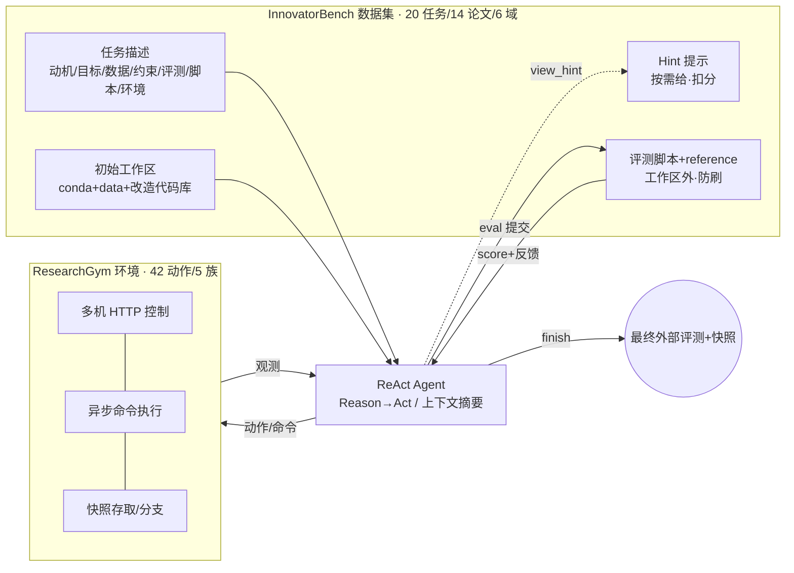

# 组会汇报 · InnovatorBench：评测 agent 做「创新性 LLM 研究」的能力

> 本篇是 **第二批（v2）标杆对齐**：在前 40 篇全部硬性要求之上，额外演示 **① Why 三连**（问题层 / 设计层 / 结果层）与 **② `## ★ 对我们的启发（Inspires Us）`** 专节。结构对齐 [`2408.06292-ai-scientist-v1.md`](2408.06292-ai-scientist-v1.md)，新增两维对齐 [`2506.13131-alphaevolve-deepmind.md`](2506.13131-alphaevolve-deepmind.md)。
>
> 主讲提示：开场一句定调——**「这不是又一个让 AI 写论文的 benchmark，而是一把贴着『真实 LLM 研究流水线』的尺子：它要 agent 真去设计 reward、改 GRPO 的 loss、洗数据、跑几十小时的训练，然后用外部脚本打一个 baseline≈0 / reference≈80 的分。最刺眼的数字是 11 小时——最强模型要跑这么久才到能力饱和点，是 PaperBench 的 6.5 倍。」**

---

## 1. 封面 · TL;DR

- **标题 / 出处**：InnovatorBench: Evaluating Agents' Ability to Conduct Innovative LLM Research（arXiv 2510.27598，v2 2025-11-03，Preprint）。
- **作者 / 机构**：Yunze Wu、Dayuan Fu（共同一作）… Pengfei Liu（通讯）等，**SJTU / SII / GAIR**（与本库 EXP-Bench 之外的另一条「研究 agent 评测」主线同源——GAIR 此前有 ResearcherBench [40]、DatasetResearch [19]、AlphaGo-Moment [20] 等）。
- **权威性来源**：任务**全部源自 14 篇有影响力的 LLM 研究论文**（NeurIPS / ICLR / COLM / EMNLP / ACL 等顶会及最新工作，原文 §3、Appendix A Table 4），并**复用论文的官方开源代码库**（多为 LlamaFactory [49] 或 Verl [24]）；评分锚定在论文**真实复现出的 reference 分**上。区别于「Kaggle 简化任务」式 benchmark：它考的是**顶会论文里真做过的、需要训练几十小时的研究**。

**一段话**：InnovatorBench 给 agent 三样东西——一份**结构化任务描述**（动机 / 目标 / 数据 / 约束 / 评测 / 脚本 / 环境，原文 §3）、一个**可写的初始工作区**（含 conda 环境、数据、改造过的论文代码库）、以及一个**按需才给、且要扣分**的提示（hint）。要它像研究者一样**自主探索、提出自己的方法、实现并迭代、产出可运行产物并多次提交**，目标是**超越 reference solution**。为支撑这种「跑几十小时、要多机多卡」的真实研究，作者另造了一个研究环境 **ResearchGym**（原文 §4）：42 个原始动作、5 大动作族、支持**多机 HTTP 控制 / 异步命令 / 快照存取**。评测走 **Kaggle 式**外部脚本：先查格式（不合格记 0），再用一个**校准在 baseline（≈0）与 reference（≈80）之间**的打分函数给分，**全程在工作区之外运行以防刷分**（原文 §3 Evaluations）。

**3 条带走的结论**：
1. **「数据题还行、算法题集体崩」**：横跨 6 个研究域，最强的 **Claude Sonnet 4** 加权平均最终分仅 **24.01 / 最佳分 24.54**；GPT-5 **12.04 / 12.52**、GLM-4.5 **11.85 / 13.35**、Kimi-K2 **5.35 / 5.45**（原文 Table 2）。所有模型**数据类任务（构造/过滤/增强）分明显高于算法类任务（loss/reward 设计）**——后者「imperfect reward/loss 会触发梯度爆炸等灾难性失败」（原文 §5.2）。
2. **「长时程」是这把尺子的命门**：agent 要 **11+ 小时**才在 InnovatorBench 上达到性能饱和点，是 PaperBench 的 **6.5×**（原文 §5.5、Fig.5）；单任务可长达 **2–36 小时**（原文 Fig.1、Table 1）。这把矛头直指现有 benchmark **不支持长时程/多卡/异步监控**的结构性缺陷。
3. **失败模式高度「拟人」且可诊断**：作者抓出 4 类典型病理——**没耐心（impatience）**杀掉还剩 21 小时就快跑完的训练、**资源管理差（resource mismanagement）**把推理和训练抢同一批 GPU 触发 OOM、**选用次优库（suboptimal library）**死活不换 vLLM、**模板化推理（template-based reasoning）**机械套 CoT 模板（原文 §5.4、Fig.4）。这说明瓶颈不在「会不会写代码」，而在**长时程决策、资源调度与对高层意图的理解**。

> 主讲提示：把「24 / 12 / 12 / 5」这组加权均分写在白板上，再写「11h vs 1.75h（6.5×）」。整场反复回扣两条主线：**(A) 数据 vs 算法的能力鸿沟；(B) 长时程才是真正的拦路虎**。

---

## 2. 问题与动机（why —— 本篇最该讲透的一节，2 页）

### 问题层 why（为什么这事值得解决）

**把 LLM 能力的进步「转译」成 AI 研究 agent 能力的进步，远不止「会几个孤立技能」**（原文 §1 开篇）。作者的逻辑链是：随着 LLM 在规划 / 代码生成 / 调试上变强，它能顺手完成 LLM 研究里的辅助工作——**数据清洗、数据增强、loss 设计、reward 设计、架构设计**；更进一步，更强的 agent 能更可靠地提假设、跑实验，**加速发现并反哺自身改进**。所以「能不能把这些技能编排成连贯的、端到端的研究工作流」是核心问题。

**不解决会怎样 / 现有 benchmark 卡在哪**（原文 §1、§2，作者明确列出 3 条结构性局限）：

1. **维度太窄**：现有任务多只测**单一性能维度**——代码实现正确性，或调参（如 [Hua et al. 2025]）。成功常被框定为「复现已有结果」，这测的是**保真度（fidelity），不是创新能力（capacity for innovation）**——没有新目标设计、新架构创造。
2. **环境被简化、资源受限**：**大规模、长时程的训练/推理通常不被支持**，跨越数小时的进程**异步监控很罕见**（[Kon et al. 2025]）。
3. **动作空间受限**：agent 没法做真实研究行为——管文件、执行命令、查文献（[Chen et al. 2024]）。

> **Why（设计层）·这一段最关键**：朴素替代是「再做一个 SWE-bench / MLE-bench 式的 benchmark」——给个 GitHub issue 或 Kaggle 题，判代码对不对。**为什么不够？** 因为(a) 这类任务**几十分钟就能判完**，测不出「跑 36 小时训练时 agent 会不会管不住资源」；(b) 二元「过/不过」**测不出 loss/reward 这种细粒度、连续、且会灾难性失败的研究产物**；(c) 单机同步执行**根本跑不动**真实 RL 训练。InnovatorBench + ResearchGym 的整套设计（多机异步、连续打分、几十小时任务），几乎每一项都在回应这三条之一（见原文 Table 1 的对照）。

### 核心 intention（一句话形式化）

> **给定一个源自真实顶会论文的研究问题 + 一个能跑通的初始工作区，能否让 agent 自主提出并实现自己的方法（而非照抄步骤），在几十小时的真实训练/推理后产出可运行产物，并在『baseline≈0、reference≈80』的外部评分上超越 baseline、逼近甚至超过 reference？**

它隐含的**假设**：(a) 顶会论文 + 官方代码库提供了**高保真、可复现、有真实 ground-truth 分**的任务源；(b)「不给步骤、只给目标」能**逼出创新**而非过拟合到固定流程（原文 §3 Task 项明说 *not* specify step-by-step instructions）；(c) 把评分**外置到工作区之外**就能**防 reward hacking**。

> 主讲提示：把动机钉在「**保真度 ≠ 创新能力**」和「**真实研究是长时程、要资源调度**」两点上——后面每个设计（隐藏 reference、外部评分、ResearchGym 异步多机、hint 扣分）都在回应其一。

---

## 3. 研究问题 / 核心假设（形式化）

- **RQ**：当前 frontier LLM（作为 ReAct agent）能否在**贴近真实 LLM 研究**的端到端、开放式、长时程任务上，做出**有创新成分**（自己设计 loss/reward/数据流程）且**可运行、可被外部脚本验证**的研究产物？
- **H1（创新 > 复现）**：通过**隐藏 reference solution、只给高层目标、不给步骤**，可以把评测从「实现保真度」抬到「创新能力」（原文 §3）。
- **H2（连续打分暴露脆性）**：用**校准在 baseline 与 reference 之间的连续分**（而非二元判定）+ **格式校验先行**，能把「看似合理、跑不起来 / 跑崩了」的虚高分挤掉，并刻画算法任务的**脆性**（原文 §3 Evaluations、§5.2）。
- **H3（长时程才是分水岭）**：把任务做到 **2–36 小时、需多机多卡**，能暴露现有短时程 benchmark 测不到的能力——**长时程决策、资源管理、异步监控**（原文 §5.5）。

---

## 4. 相关工作定位（站在谁肩上、和谁不同）

下面这张表是原文 **Table 1** 的精简解读（*Time Horizon* = ReAct agent 跑到最佳分所需时间）。**看最后一行**：InnovatorBench 是表里唯一同时勾选「多卡多机 / 存档恢复 / 创新性」三项的：

| Benchmark | 任务来源 | 最多评测次数 | 多卡多机 | 存档恢复 | 创新性 | 时间跨度 |
|---|---|---|---|---|---|---|
| SWE-bench [Jimenez 2024] | GitHub Issues | 1 | ✗ | ✗ | ✗ | 30m–2h |
| ScienceAgentBench [Chen 2024] | 科学论文 | 1 | ✗ | ✗ | ✓ | 10m |
| RExBench [Edwards 2025] | NeurIPS/ACL* 论文 | 3 | ✗ | ✗ | ✗ | 6h–12h |
| RE-Bench [Wijk 2024] | 手工设计 | 1 | ✗ | ✗ | ✗ | 12m–2h |
| **EXP-Bench [Kon 2025]** | NeurIPS/ICLR 论文 | 1 | ✗ | ✗ | ✗ | 35m |
| PaperBench [Starace 2025] | ICML 2024 论文 | 1 | ✗ | ✗ | ✗ | 1h–3h |
| ML-Bench [Tang 2023] | Kaggle | 1 | ✗ | ✗ | ✗ | Unknown |
| MLE-bench [Chan 2024] | Kaggle ML | ∞ | ✗ | ✗ | ✓ | 10m |
| **InnovatorBench（本文）** | NeurIPS/ICLR/etc. 论文 | **4** | **✓** | **✓** | **✓** | **2h–36h** |

**与本库已有两把「研究 agent 尺子」的精确差异**（这是组会最该讲清的对照）：

- **vs [`2505.24785` EXP-Bench]**：EXP-Bench 从 51 篇论文半自动抽出 **461 个任务**走「假设→设计→实现→执行→分析」五步，**强调复现保真度**，用合取式评分把综合成功率压到 **0.5%**；但它**单机、35 分钟级、单次提交（Max Eval=1）**，本质是「能不能复现一个已知实验」。InnovatorBench 反过来：任务**只有 20 个但每个要 2–36 小时**、**多机多卡**、**允许 4 次提交**、**显式要创新（隐藏 reference）**。一句话——**EXP-Bench 量「复现的可执行性」，InnovatorBench 量「创新的可执行性 + 长时程韧性」**。
- **vs [`2502.14499` MLGym]**：MLGym 是**首个把 ML 研究做成 Gym (state/action/reward) 的环境** + 13 任务，命门是「**可被 RL 训练**」，但它**约束了实验时长/规模/动作空间**（原文 §2 明确点名 MLGym「often constrain the experiment duration, scale, or action space」）。**ResearchGym 正是冲着这条限制去的**：用多机 HTTP + 异步 + 快照把「时长/规模/动作空间」全部放开。所以**MLGym 解决「能不能训 agent」，ResearchGym 解决「能不能跑真实规模的长任务」**——二者互补。
- **vs PaperBench [Starace 2025]**：直接做了 test-time scaling 对照（§5.5）——同样的 agent 在 PaperBench 上 **1.75h** 就饱和，在 InnovatorBench 上要 **11h+**，慢 **6.5×**。作者据此论证 InnovatorBench 是「更难、更耗时、更接近真实」的下一代 code-based research benchmark。

> 主讲提示：一句话概括三者关系——**「EXP-Bench 测复现、MLGym 造训练场、InnovatorBench 测『创新 + 扛得住几十小时真实训练』」**。把「20 个长任务 vs 461 个短任务」这种**深 vs 广**的取舍当讨论钩子。

---

## 5. 方法总览（big picture，先直觉后细节）

整体是 **「InnovatorBench（考卷）+ ResearchGym（考场）+ ReAct agent（考生）」** 三件套，闭环见原文 **Figure 3**：

**直觉**：把「读任务 → 在多机集群上洗数据/改 loss/跑训练 → 异步盯进度 → 多次提交拿反馈 → 收工」这套真实研究流程，**原封不动**搬进一个可控、可复现、可防刷的沙盒。三件套各司其职：**InnovatorBench 定义考什么**（任务 + reference + 评分函数）；**ResearchGym 定义怎么操作**（动作空间 + 异步 + 多机 + 快照）；**ReAct agent 是被测对象**。关键设计点全在「为了让它**像真研究**」：隐藏 reference 逼创新、外部评分防刷、异步多机撑长任务、快照让几十小时任务可暂停续跑。

---

## 6. 符号与术语表（后文统一用）

| 记号 / 术语 | 含义 |
|---|---|
| DC / DF / DA | Data Construction（数据构造）/ Data Filtering（数据过滤）/ Data Augmentation（数据增强） |
| LD / RD / SC | Loss Design（损失设计）/ Reward Design（奖励设计）/ Scaffold Construction（脚手架/框架搭建） |
| reference solution | 论文作者真复现出的参考解，**评测时对 agent 隐藏**（原文 §3） |
| baseline | 代码库 base model 的结果，评分锚点（对应最终分 ≈ 0，原文 Appendix B） |
| Final Score (FS) | agent **最后一次**提交的得分（原文 Table 2/3 注） |
| Best Score (BS) | agent **多次评测中的最高**得分（原文 Table 2/3 注） |
| Execution Time (ET) | agent 运行时长（小时，原文 Table 3） |
| Cost | 货币花费（美元，原文 Table 3） |
| `eval` / `view_hint` / `finish` | 提交评测 / 查看提示（扣分）/ 收工 三个特殊工具（原文 §3、Fig.3） |
| ReAct | Reason+Act 交替的 agent 范式（[Yao 2023]）；上下文到上限时做**摘要 (summarization)** |
| ResearchGym | 本文研究环境：42 动作、5 动作族、多机 HTTP、异步、快照（原文 §4） |
| snapshot（快照） | 记录任务规格 + agent 上下文 + 工作区状态 + 剩余时间，可分支续跑（原文 §4） |

---

## 7. 方法细节 ① InnovatorBench 任务怎么造（why-first）

**why（问题层）**：要测「创新性研究」，任务必须**同时**满足——源自真问题（不能是玩具）、可复现（要有 ground truth）、有创新空间（不能给步骤）、且 base 与 reference 拉得开（评分才有区分度）。

**任务组成（原文 §3 Task Description，7 件套）**：每个任务描述含 (1) **Motivation** 研究动机来源；(2) **Task** 高层目标（**刻意不给 step-by-step**，鼓励探索、防止过拟合到固定流程）；(3) **Data** 数据集/checkpoint 的内容、路径、格式；(4) **Constraints** 时限、GPU 配额、输出格式；(5) **Evaluations** 指标（accuracy/F1/BLEU…）与打分函数说明；(6) **Scripts** 统一脚本与代码库；(7) **Environment** conda 环境与工作区目录布局。

**工作区（原文 §3 Workspace，3 大件）**：(1) **Conda 环境**——预建好、刚够跑 baseline，不禁止 agent 自己装包；(2) **Data**——含训练/验证/测试集（**测试集去掉了 ground-truth label**），可联网下载/重排/合成数据；(3) **Task 目录**——改造自论文官方库（**删掉了关键实现 + git commit history，但保持可跑**），多为 LlamaFactory [49] 或 Verl [24]，外加 scripts。

**Hint（原文 §3 Hint for the Agent）**——**这是「创新 vs 抄答案」张力的核心机关**：
- 每个任务配一个**可选 hint**；跟着 hint 走，一个有经验的研究者能拿到约 **80% 的分**。
- hint **不在工作区里**，要 agent **主动用 `view_hint` 工具查**，且**查了要扣分**（原文 Fig.2 注：final score will be deducted）。
- **主评测禁用 hint**；只有消融研究在任务描述后**立即**用 hint。

> **Why（设计层）**：朴素做法是「直接把 reference 给 agent / 完全不给任何提示」。**给了** → 退化成「照抄实现」，测不出创新（原文 §5.3 实证：给了 hint 后 DC/DF/DA 反而**降分**，因为模型自身 coding 能力跟不上精确复现）。**完全不给** → 难任务上 agent 容易卡死、信号太稀疏。**折中 = 「可选 + 扣分」**：把「要不要看答案」变成 agent 自己的**带代价决策**，既保留探索压力，又给一条兜底路。这是一个很漂亮的激励设计。

**构造成本与规模（原文 Appendix B）**：**13 名标注者**，每个任务**3 天到 2 周**手工搭工作区与评测代码；先复现论文拿 reference 分、跑 base 拿 baseline 分，再**用线性插值设计打分函数**。两条原则：**(1) baseline 对应最终分 0；(2) reference 分约 80**。共 20 任务、6 域（原文 Fig.6：DA=5、DF=4、DC=3、LD=3、SC=3、RD=2）。

> 主讲提示：强调「3 天–2 周/任务 × 13 人」——**高保真任务极贵**，这正是它「只有 20 个」而 EXP-Bench 能有 461 个的根因（半自动 vs 纯手工）。

---

## 8. 方法细节 ② 评测怎么打分（防刷 + 连续分，核心数学）

> 主讲提示：这一节是「指标定义式」样板，组会最容易被问「20 个异构任务怎么统一打一个分」。答案：**每个任务一个量身定制的、校准过的打分函数，外部运行**。

**why（问题层）**：研究产物五花八门（一个 parquet 预测文件、一份 logits、一个训练好的 checkpoint），且 agent 有动机**刷分**（如直接写假结果）。所以评测必须**(a) 外置**、**(b) 先查格式**、**(c) 把分校准到可比区间**。

**评测流程（原文 §3 Evaluations，Kaggle 式）**：
1. **格式校验先行**：提交先查格式合法性，**不合格直接记 0 + 报错信息**（杜绝「跑崩了还拿安慰分」）。
2. **校准打分**：合格提交用一个**校准在 baseline（锚≈0）与 reference（锚≈80）之间**的函数打分。
3. **完全外部运行**：整个评测在工作区之外跑，**防 reward hacking**。
4. **最多 4 次**评测（原文 Table 1 Max Eval times = 4），取最后一次为 Final、最高为 Best。

**统一归一化的直觉式（本报告据 Appendix B 的「线性插值」描述重构，原文未给单一闭式总公式）**：

记号（先定义）——$m$：某任务上 agent 产物的原始指标值（如 accuracy）；$m_{\text{base}}$：baseline 的指标；$m_{\text{ref}}$：reference 的指标；$\text{Score}\in\mathbb{R}$：归一化后的任务分。则线性插值校准可写成

$$ \text{Score} \;=\; 80 \times \frac{m - m_{\text{base}}}{m_{\text{ref}} - m_{\text{base}}}\quad(\text{格式不合格时 } \text{Score}=0). $$

读出什么：$m=m_{\text{base}}$ 时得 0、$m=m_{\text{ref}}$ 时得 80，**超过 reference 还能继续涨**（原文 Appendix B：分高于 baseline 则不应为 0，reference 约 80，留出「超过 reference」的上探空间）。**这把 20 个异构任务放到同一把尺子上**，使「加权平均」有意义。⚠ 注意：原文**只给了构造原则与个别任务的具体打分式**，这条统一式是按其描述重构、用于理解，**非原文逐字给出**。

**任务级打分式的真实样例（原文 Appendix D/E，DAPO 任务 §task 14）**——这是少数原文给出**显式打分函数**的任务：

记号——$\text{acc}$：variant policy 在测试集（MATH500）上的准确率；$\text{entropy\_score}$：训练过程中 variant policy 的熵被映射到的分值（熵在合理范围才高）。则

$$ \text{final\_score} \;=\; \text{accuracy\_score} \times \text{entropy\_score} \times 100. $$

读出什么：这是个**乘法门**——**准确率高但熵崩了（探索没了）也拿不到分**，反之亦然。它精准复刻了 DAPO 论文「既要准确率、又要防 entropy collapse」的双目标，也解释了为什么算法任务**脆**：任一因子归零，整分归零。对应的评测脚本骨架见原文 Fig.2(b)：`run_1()` 调 `cal_entropy_and_acc(...)`，异常则返回 `score:0.0`，否则 `score = entropy_score*acc_score*100`。

> 主讲提示：用 DAPO 这个 `acc × entropy × 100` 的乘法式当全场「算法任务为何脆」的注脚——**它和 §5.2「imperfect reward/loss → 梯度爆炸 → 灾难性失败」是同一件事的两种表述**。

---

## 9. 方法细节 ③ ResearchGym：把「跑得动真实研究」做成基础设施（why-first）

**why（问题层）**：OpenHands [34]、IterativeAgent [Starace 2025] 这类系统**在单个 Docker 里同步执行**——下一个动作必须等上一个跑完才能选（原文 §4 开篇）。**这对真实 LLM 研究是致命的**：训练要跑几十小时，同步阻塞意味着 agent 这几十小时**啥也干不了、也盯不了别的进程**。

**how（原文 §4，四大支柱）**：

1. **42 个原始动作 / 5 大动作族**（原文 §4 Actions and Observations）：**Command**（管理会话、跑命令、取输出）/ **File**（增删改读查 + 搜索）/ **Parse**（从图像/音频/视频抽内容给纯文本模型）/ **Web Search** / **Web Browse**。每族动作都配一个**把原始输出归一化成 agent 可读结构**的观测。
2. **多机控制 (Multi-Computer Control)**：agent 可经 **HTTP 并发控制多台机器**（每台跑一个 HTTP server 收命令），让**单机初始化的 agent 编排跨集群的长时程分布式实验**。
3. **异步命令执行 (Asynchronous Command Execution)**：命令执行与决策**解耦**，不阻塞——可把命令绑到会话、稍后用 `get_session_output` 异步取结果；还专门给了 `sleep` 动作避免训练时做无意义动作。
4. **快照存取 (Snapshots Saving and Loading)**：快照记录**任务规格 + agent 上下文 + 工作区最终态 + 剩余时间预算**，可周期性存、可从任意快照恢复、**支持分支**（从不同点续跑或走多条分支）。

> **Why（设计层）**：朴素替代是「把单 Docker 的超时调长」。**为什么不够？** (a) 同步阻塞下，agent 启动训练后**整个 context 就被一条长命令占满**，无法并行监控/调度别的机器；(b) 没有快照，几十小时任务一旦 context 爆掉或环境挂掉就**全盘重来**；(c) 单机撑不起 RL 训练要的 8×80GB 甚至多机。所以 ResearchGym 把**异步 + 多机 + 快照**三件一起上——这正是它相对 OpenHands / MLGym 的增量（原文 §2、§4）。

**接口形态（原文 Appendix F.1，给了真实函数签名）**：如 `run_command_action(command, computer_ip, session_id, http_port, wait_for_completion=False, use_proxy=True)`——`wait_for_completion=False` 即「丢到后台异步跑」；`get_session_output_action(..., since_timestamp)` 支持**增量取输出**。这些签名是 agent 真正调用的 API，体现「异步」不是口号而是落到参数级。

---

## 10. 实验设置（setting / params / 算力 / 成本，写全）

- **被测模型（4 个 frontier LLM）**：**Claude Sonnet 4** [Anthropic 2025]、**GPT-5** [OpenAI 2025]、**GLM-4.5** [Zeng 2025]、**Kimi-K2** [Kimi Team 2025]，统一包成 **ReAct-style agent** [Yao 2023]，带 thought+action 与**上下文到上限时摘要前半段**的能力（原文 §5.1）。
- **运行环境**：所有模型包成 agent，跑在 **Ubuntu 22.04 / 800 GB 内存**的 Docker 容器里；可经集群 HTTP 服务向**额外 server 派发 8×80GB GPU + 1600 GB 内存/台**的算力，**server 数量按任务而变**（原文 §5.1）。
- **任务约束举例（原文 Appendix E，DAPO 任务）**：单次训练 ≤ 24h、评测 ≤ 10min、8×80GB H100、**仅 3 次评测机会**、总时限 48h。（不同任务约束不同，见 Appendix A Table 4，多为「48h、8×80GB GPUs」。）
- **联网策略**：**Data Construction / Data Augmentation 任务可联网**（要查/下数据），其余任务**禁用 web search 与 browse**（原文 §5.1）。
- **评测指标（原文 Table 2/3 注，给定义）**：**Final Score** = 最后一次提交分；**Best Score** = 多次评测最高分；**Execution Time** = agent 运行小时数；**Cost** = 美元花费。各任务分先按 §8 校准到 baseline≈0/reference≈80，再做**加权平均 (Weighted Average)**。
- **随机性 / 复现**：原文**未给出**多 seed 重复或方差/置信区间——每个 (模型×任务) 基本是**单次长跑**的一组数（Table 5 给 20 任务逐条 FS/BS/ET/Cost）。这是读结果时要心里有数的一条**局限**。

> 主讲提示：强调三组数量级——**800GB 内存容器、8×80GB GPU/台、48h 时限**。再点一句「**无 seed 重复**」，为后面「这些分有多稳」的讨论埋钩。

---

## 11. 主要结果（数字 + 解读，别只贴表）

**主表（原文 Table 2，6 域 × 4 模型，FS / BS）**——加权平均：

| 研究域 | Claude Sonnet 4 FS/BS | GPT-5 FS/BS | GLM-4.5 FS/BS | Kimi-K2 FS/BS |
|---|---|---|---|---|
| Data Construction | **25.47 / 26.88** | 8.41 / 8.41 | 15.29 / 22.65 | 14.01 / 14.08 |
| Data Filtering | **30.89 / 31.47** | 8.97 / 9.48 | 5.16 / 5.36 | 7.39 / 7.97 |
| Data Augmentation | 22.73 / 22.73 | 0.00 / 0.00 | **25.49 / 25.49** | 2.47 / 2.47 |
| Loss Design | **12.98 / 12.98** | 0.04 / 2.74 | 7.63 / 7.63 | 0.00 / 0.00 |
| Reward Design | **11.56 / 11.56** | 0.00 / 0.00 | 0.00 / 0.00 | 3.23 / 3.23 |
| Scaffold Construction | 36.63 / 37.74 | **60.07 / 60.07** | 3.33 / 3.33 | 3.33 / 3.33 |
| **加权平均** | **24.01 / 24.54** | 12.04 / 12.52 | 11.85 / 13.35 | 5.35 / 5.45 |

**读出什么（结果层 why，逐条解释机制，原文 §5.2）**：

1. **「数据题普遍高于算法题」**（全场主线 A）：数据类任务（DC/DF/DA）**对噪声相对宽容**——「只要找到同主题的数据就能拿不低的分」；算法设计**脆**——「imperfect reward/loss 会导致梯度爆炸或系统性错误策略等灾难性失败」。这解释了为什么 4 个模型在 LD/RD 上几乎全线低分。
2. **Claude Sonnet 4 总分第一**（24.01/24.54），且在 6 域里**领跑 4 域**。机制：原文 §5.2 说它**工具使用最可靠**——在 loss/reward 任务上「**能产出可执行代码、并在训练期正确挂起活动而不乱动**」；GPT-5 训练一开始就陷入**高频循环导致提前终止**，GLM-4.5 **错配关键工具参数**而在训练前 stall，Kimi-K2 **多数情况下连正确代码都生成不出**。
3. **GPT-5 靠 Scaffold「单点封神」拉高均值**：SC 拿 **60.07**（全表最高单元格），把它整体均分抬到 12.04。机制（原文 §5.2）：GPT-5 生成的 scaffold **最稳健**——三条设计选择：**显式重述 prompt 里的选项防选错、允许最多 3 次重试而非超时即 fallback、强制严格输出格式减少格式类评测失败**。作者归因：scaffold 像简单软件工程任务，GPT-5 能写更标准化、更全面的代码。
4. **「会说不会做」**（原文 §5.3 末）：even 给了 ground-truth hint，模型也常因**自身 coding 能力**在重写训练/推理脚本时引入小错而**反而更低分**——「想在研究里拿高分，需要**综合能力**（创新 + 代码实现），缺一项就崩」。

> 主讲提示：把「Claude 靠**可靠工具使用**赢算法题、GPT-5 靠**稳健代码**赢 scaffold」对照讲——**这说明不同模型的强项正交**，没有一个全能选手。

---

## 12. 消融与分析：hint 效应 + 长时程 scaling + 四类失败

### 12.1 Hint 效应（原文 Table 3、§5.3）

Claude Sonnet 4 加 / 不加 hint 的加权平均对比（FS/BS/ET 小时/Cost 美元）：

| | 加权平均 FS | BS | ET(h) | Cost($) |
|---|---|---|---|---|
| Claude4 **w/ Hint** | 13.88 | 16.67 | 4.87 | 30.86 |
| Claude4（无 hint，主设置）| **24.01** | **24.54** | 5.13 | 32.92 |

**反直觉结论**：**给了 hint，平均分反而从 24.01 掉到 13.88**。机制（原文 §5.3）：
- **探索型任务（LD/RD）**：给了 ground truth **有帮助**——agent 不必探索，专注复现（Table 3 里 Loss Design FS 从 12.98 升到 22.65、Reward Design 从 11.56 升到 15.06）。
- **数据型任务（DC/DF/DA）**：给了反而**掉分**——因为「精确复现」被 agent **自身 coding 能力拖累**，在写训练/推理脚本时 hint 与重实现之间的细小不匹配会严重伤害模型表现（§5.3、§5.4）。

> 主讲提示：这条是「hint 不是免费午餐」的实证——**把答案塞给一个手不稳的人，他照抄都会抄错**。它反向印证了 §3「创新需要综合能力」的论点。

### 12.2 长时程 test-time scaling（原文 §5.5、Fig.5）—— 全场主线 B

把 InnovatorBench 与 **PaperBench** 的「分数 vs 运行时长」曲线叠一起：agent 在 **PaperBench 约 1.75h** 达峰，在 **InnovatorBench 要 11h+** 才饱和，**慢 6.5×**（Fig.5 标注「6.5× longer」）。机制：InnovatorBench 含 DA、RD 这类**要长训练阶段**的任务，**需要更复杂策略、更长环境交互、更多迭代**，随任务复杂度上升，**环境交互成本主导总时长**。结论：**任务越复杂，算力/时间投入越被环境交互吃掉**——这是 InnovatorBench 比 PaperBench「更难更慢更真实」的根因。

### 12.3 四类失败模式（原文 §5.4、Fig.4）—— 病理学，最具教学价值

| 失败模式 | 现象（原文 Fig.4 案例） | 暴露的弱点 |
|---|---|---|
| **没耐心 Impatience** | 训练已跑 10h、还剩 ~21h 预算，agent 嫌慢**直接 kill 训练进程**去试别的方法 | 目标错置 + 短视决策 |
| **资源管理差 Resource Mismanagement** | 先用 1 卡起推理，55 步后在**同机**起需全部 GPU 的训练 → **CUDA OutOfMemory** | 记忆/注意力退化（忘了推理还在跑） |
| **选用次优库 Suboptimal Library** | 高吞吐场景**死守 Transformers 不换 vLLM**（`AutoModelForCausalLM` + `max_length=1024` + `max_new_tokens=512`） | 时间预算**不提供可学习的反馈信号**，且 vLLM 训练数据少 |
| **模板化推理 Template-based Reasoning** | 合成 CoT 时套一个**语义空洞的推理模板**，把问题和答案机械拼接，而非真推理 | 缺对**高层意图**的理解（vLLM 生成 CoT 失败后退化成机械套模板） |

> 主讲提示：把「Impatience」当全场金句——**「agent 知道自己还有 21 小时，却因为‘觉得慢’把快跑完的训练杀了。」** 这比任何分数都更说明「长时程决策」是当前 agent 的真短板。它和 [`m9.8`] 的「目标导向系统钻空子/短视」直接呼应。

---

## 13. 局限与批判（原文承认的 + 社区可质疑的，诚实）

**原文 §E（Limitations）自陈**：
1. **任务多样性有限**：当前只 20 个任务、6 域，未来应扩到更多跨学科、真实科研挑战。
2. **agent 泛化性差**：表现随模型变化大，需要更强的跨任务泛化与迁移学习（[Fu 2025]）。
3. **偏自主、缺人机协作**：当前框架聚焦全自主 agent，未来应探索 human-AI 混合工作流（[Ye 2025a]）。

**社区可追加的质疑（批判，非原文）**：
- **统计可靠性**：核心结果**几乎都是单次长跑**（无 seed 重复 / 无方差 / 无置信区间）。一个 36 小时任务跑一次，**run-to-run 方差可能很大**——尤其 RL 训练本就高方差，「Claude 12.98 vs GLM 7.63」这种差距有多稳，原文未给出证据。
- **样本量极小**：20 任务、部分域只有 2–3 个任务（RD=2），**单任务的偶然成败就能显著挪动域均值**（如 GPT-5 的 SC=60.07 几乎独力撑起其总均分），统计功效弱。
- **「创新」仍未被直接度量**：评分本质仍是「**超越 reference 多少**」的**性能代理**，并未独立评估「方法是否真新颖 / 是否真有 idea」——一个 agent 完全可能**用平凡方法碰巧涨点**而拿高分。**「创新性」这一招牌目标，度量上仍是间接的**（与本库 AI Scientist v1「novelty 靠自评」的循环性问题异曲同工）。
- **成本/可及性**：每个 (模型×任务) 动辄 **8×80GB GPU × 数十小时**、单跑成本 ~30 美元且要 11h+，**复现门槛极高**——这也限制了做大规模重复实验来压方差。
- **构造可扩展性**：13 人手工、每任务 3 天–2 周，**几乎不可能快速扩到几百任务**（对比 EXP-Bench 的半自动 461 任务）——「深而贵」是它的特色也是它的天花板。

> 主讲提示：把批判收敛成一句——**「这把尺子刻度很真，但只有 20 格、且每格只量了一次。」** 它对「创新」的度量仍是性能代理，这点要诚实点出。

---

## ★ 对我们的启发（Inspires Us）

> 讲稿提示：前面都在讲 InnovatorBench 做了什么，这一节讲**我们能据此做什么**。目标是抛出 1 个「下周就试」的具体动作。

- ➤ **a. 可直接借用的招（reuse）**：
  1. **「可选 + 扣分」的 hint 机制**——把「要不要看答案」做成 agent 的**带代价决策**（看了拿 ~80% 上限但扣分）。可直接搬进 [`m9.6-evaluating-research-agents`] 的任何评测任务：给一个「提示按钮」，每按一次扣固定分，**既留探索压力又给兜底**，还能顺便量出「模型有多依赖提示」。
  2. **外部、格式优先、连续校准的评分三件套**——(i) 评测脚本跑在工作区外防刷；(ii) 格式不合格直接记 0；(iii) 分**线性插值校准到 baseline≈0 / reference≈80**。这套「防 reward hacking + 连续区分度」的范式可作为 [`m9.6`] 沙箱评测的**默认打分协议**。
  3. **ResearchGym 的异步三件套（`wait_for_completion=False` + `get_session_output(since_timestamp)` + 快照分支）**——任何要跑「长训练」的研究 agent harness 都能直接抄这套接口，把「起训练就阻塞 context」改成「丢后台 + 异步轮询 + 可分支续跑」。
- ➤ **b. 可迁移到我们课题的思路（transfer）**：把「**数据题宽容 / 算法题脆**」这条经验迁到 [`m9.6`] 的任务设计上——**故意混入若干「乘法门」式评分任务**（如 DAPO 的 `acc × entropy × 100`，任一因子归零则总分归零），用来**专门暴露 agent 的脆性与长时程稳定性**，而不是只放「找对数据就给分」的宽容任务。迁移前提：必须配 ResearchGym 式的长跑 + 快照基础设施，否则脆性任务一崩就全盘重来、信号太贵。
- ➤ **c. 它暴露的开放问题 = 我们的机会（open problems → opportunity）**：
  1. **「创新」仍只被性能代理度量**——没有独立的「方法新颖性 / idea 质量」评分。**机会**：在 [`m9.6`] 里加一个**与 [`2408.06292` AI Scientist]、[`m9.3-ideation-and-tournament`] 同源的「novelty 判定器」**，对 agent 提交的方法做「与 reference 的语义差异 / 是否真有新机制」打分，**把『创新分』从『性能分』里解耦出来**。第一步：挑 3 个 LD/RD 任务，人工标注「方法是否真新颖」，看能否与现有 Final Score 拉开相关性。
  2. **长时程决策无可学习反馈信号**（§5.4 明说「time budget 不提供可学习反馈」）——**机会**：设计一个**显式把『剩余预算 / 已投入时间 / 进度估计』喂进 agent 观测**的 wrapper，量化它能否治好「Impatience / 资源抢占」两类病。第一步可直接在 ResearchGym 的观测里加一个 `remaining_budget / eta` 字段做 A/B。
- ➤ **d. 与本库其它论文/模块的连接（connect the dots）**：
  - 与 [`2505.24785` EXP-Bench] **互为深广两极**：EXP-Bench「广而短、测复现、0.5% 综合成功率」；InnovatorBench「深而长、测创新、11h 饱和」。两者拼起来，[`m9.6`] 沙箱就**同时有了『复现可执行性』和『创新+长时程韧性』两把尺子**。
  - 与 [`2502.14499` MLGym] **承接**：MLGym 提供「可训练的 Gym」，ResearchGym 提供「跑得动真实规模长任务的环境」——**把 MLGym 的 RL 训练能力 + ResearchGym 的多机异步基础设施合体**，理论上能训练「会做几十小时研究」的 agent，而不只是 prompt 出来的。
  - 与 [`m9.8-redteam-and-integrity`] 呼应：四类失败里的 **Impatience（杀掉快跑完的训练）/ 资源抢占** 正是「目标导向系统短视、钻空子」的实证，可作为 m9.8 红队用例库的新样本。
  - 与 [`2408.06292` AI Scientist v1] 对照：v1 的 novelty 靠**自评**、InnovatorBench 的 novelty 靠**超越 reference 的性能代理**——**两者都没真正独立度量「新」**，这条「novelty 度量循环性」是贯穿全库的未解线。
- ➤ **e. 如果我来做下一步（my next move）**：**我会先把 InnovatorBench 的「可选+扣分 hint」和「baseline≈0/reference≈80 外部校准评分」两个机制，移植进 [`m9.6-evaluating-research-agents`] 的一个最小任务里，跑 Claude / 一个本地小模型做 A/B，验证(1) 扣分 hint 能否稳定量出「模型对提示的依赖度」、(2) 连续校准分是否比二元判定更能区分脆性算法任务**——这是个一两天、单卡就能起的最小验证。

---

## 14. 在 auto-research 版图的位置

- **阶梯定位**：在 Tool→Analyst→Scientist 阶梯里，InnovatorBench 是一把**对准「Scientist 候选」的考卷**——它不造 agent，而是**量「现成 frontier agent 离真做研究还差多远」**。结论很清醒：最强的 Claude Sonnet 4 也只到加权 24/80，**算法创新任务几近不及格**，说明当前 agent 仍停在「能做数据类辅助工作、做不动核心算法创新」的层级（与 MLGym「只到 Level 1 基线改进」的判断一致）。
- **相对本库已有 40 篇的增量（更新性）**：
  - 它把 [`2505.24785` EXP-Bench]（35min 复现）、[`2502.14499` MLGym]（受限时长/规模）向前推了**一个数量级的时间尺度与资源规模**——**首个把「2–36 小时、多机多卡、异步、快照」做进研究 agent benchmark 的工作**，并实证「11h 才饱和、6.5× of PaperBench」。
  - 它给 [`m9.6-evaluating-research-agents`] 模块补上了**「长时程 + 创新导向 + 防刷连续评分」**这一此前缺失的任务类型与评分协议。
- **承上启下**：← 站在 OpenHands [34]（动作空间）、MLGym（Gym 化）、PaperBench/EXP-Bench（论文级任务）肩上；→ 为「训练能扛长时程的研究 agent」（MLGym × ResearchGym）和「把创新分从性能分解耦」（× AI Scientist / m9.3 ideation）两条后续方向开口。

---

## 15. 复现与可用性

- **开源**：Github + Project Page（原文首页链接）；任务复用 LlamaFactory [49] / Verl [24] 等公开代码库。
- **能不能在单卡跑**：**基本不能**——多数任务约束是「48h、8×80GB GPUs」，部分要多机（原文 Appendix A Table 4）；scaffold 类（task 18–20）部分是「0 GPU / 1×24GB GPU + 调 GPT-4o/GPT-4.1 API」，相对轻。
- **坑**：(a) **极贵**——单跑 ~30 美元 + 11h+，做 seed 重复几乎不现实；(b) **conda 环境刚够跑 baseline**，agent 常要自己装包（如换 vLLM）才能高效，但它**未必会换**（§5.4）；(c) **联网仅 DC/DA 开放**，其余任务断网；(d) 评测**仅 3–4 次机会**，提交策略本身是 agent 能力的一部分。

---

## 16. 组会讨论问题

1. InnovatorBench 用「**超越 reference 的性能**」代理「创新」，但平凡方法碰巧涨点也能拿高分——**怎么设计一个能把「真有新 idea」和「碰巧涨点」分开的评分**？（联想 AI Scientist v1 的 novelty 自评、[`m9.3`] tournament）
2. 核心结果**无 seed 重复 / 无方差**，而 RL 训练本就高方差。**「Claude 24 vs GPT-5 12」这种排名，需要跑几次才算稳**？小样本（20 任务、RD 仅 2）下该用什么统计检验？
3. **「给 hint 反而掉分」**（数据题）——这是模型 coding 能力的问题，还是「精确复现 vs 自由发挥」的任务设计问题？如果换更强的 coding 模型，这个反转会消失吗？
4. 四类失败里的 **Impatience（还剩 21h 却杀训练）**——是「目标错置」还是「缺乏对时间预算的可学习反馈」？**给观测加一个 `remaining_budget` 字段能治好它吗**？（这是个可立刻 A/B 的实验）
5. **深 vs 广**：InnovatorBench（20 长任务）vs EXP-Bench（461 短任务），哪种更能预测「agent 在真实科研里的表现」？能不能两者结合做一个分层 benchmark？
6. ResearchGym 把**异步 + 多机 + 快照**做进环境——这套基础设施若接上 MLGym 的 **RL 训练**回路，**能否真的训出「会做几十小时研究」的 agent**？训练信号从哪来（Final Score 太稀疏）？
7. 评测**外置防刷**已经做了，但 agent 仍可能在**工作区内**伪造中间产物骗过格式检查——**还有哪些 reward hacking 面没堵**？

---

## 17. 一页速记（汇报当天速览）

- **是什么**：评测 agent 做「创新性 LLM 研究」的 benchmark——**20 个源自 14 篇顶会论文的端到端任务**（6 域：DC/DF/DA/LD/RD/SC）+ **ResearchGym**（42 动作 / 多机 / 异步 / 快照）+ **baseline≈0 / reference≈80 的外部防刷连续评分**。
- **核心数（原文 Table 2/3、Fig.5）**：加权均分 **Claude 24.01 / GPT-5 12.04 / GLM-4.5 11.85 / Kimi-K2 5.35**；**11h+** 才饱和（PaperBench 的 **6.5×**）；单任务 **2–36h**、**8×80GB GPU**、~**30 美元/跑**；构造 **13 人 × 3天–2周/任务**。
- **三句话结论**：**数据题尚可、算法（loss/reward）题集体崩**（脆性：imperfect loss→梯度爆炸）；**长时程决策 + 资源调度 + 高层意图理解**是真短板（4 类拟人失败）；**给答案（hint）在数据题上反而掉分**——说明「创新需要综合能力，缺一即崩」。
- **设计三招（可借走）**：① 可选+扣分的 hint（带代价的「看答案」决策）；② 格式优先 + 连续校准 + 外部运行的防刷评分；③ 异步+多机+快照的长跑基础设施。
- **在课里的位置**：与 **EXP-Bench（广而短、测复现）** 互为深广两极、与 **MLGym（可训练 Gym）** 承接互补；为 [`m9.6`] 补上「长时程 + 创新导向 + 防刷连续评分」这一缺失维度。**「创新」仍是性能代理**——这条与 AI Scientist v1 的 novelty 循环性一脉相承，是留给我们的机会。

> 主讲提示：结尾回到一句——**「InnovatorBench 把尺子从『几十分钟复现』拉到『几十小时创新』，量出最强 agent 也只到 24/80，且越接近真研究越扛不住时间。它最大的贡献是把『长时程』这件真事第一次做进了 benchmark；最大的待解是『创新』至今仍只能用性能间接量。」**
