# 组会汇报 · Deep Ideation（科学概念网络上的深度构想）

> 主讲提示：这是 C 组「创意 / ideation」主题里把**外部结构化知识（概念图）**和 **LLM 自由生成**缝在一起的代表作。一句话定位——AI Scientist 用 Semantic Scholar 做「事后查新」，Deep Ideation 把「知识」前置成一张**可被 agent 主动遍历的图**，让 idea 从一开始就长在文献的真实连接上。读它要抓两条主线：①概念网络怎么建、②agent 怎么在图上「走」出新 idea。

---

## 1. 封面 · TL;DR

- **作者 / 出处**：Keyu Zhao, Weiquan Lin, Qirui Zheng, Fengli Xu(通讯), Yong Li（清华 EE / 西电 / 中关村学院），arXiv 2511.02238 v1，2025-11-04。代码：`https://github.com/kyZhao-1/Deep-Ideation`。
- **一段话**：过去用 LLM 提 idea 的方法，要么靠**关键词共现 / 语义相似度**这种「统计关联」（太浅，丢掉概念间的上下文关系），要么靠 **LLM 内部知识反复改写 idea**（不接地气，没扎根在真实文献）。Deep Ideation 把这两条缺陷一起补：先从约 10 万篇顶会论文里抽关键词、按「同篇共现」连边，并用 LLM 把**边的语义关系**也刻画出来，得到一张「科学概念网络 (scientific concept network)」；再设计一个 **explore–expand–evolve（探索-扩展-进化）** 的工作流，让 agent 在图上找邻居、挑关键词、拼成结构化 idea proposal；全程维护一个 **Idea Stack（想法栈）** 记录每轮进展，并由一个在**真实审稿反馈**上微调的 **Critic / Review Model** 持续给出 novelty 与 feasibility 信号来导航这场搜索。
- **三条带走的结论**：
  1. **把知识做成「可遍历的图」**：相比「事后查新」，把概念网络前置成 agent 能主动探索的对象，是这篇的核心卖点——idea 的每一步扩展都对应图上一条**有真实文献支撑的边**。
  2. **效果（论文宣称）**：跨 4 个 AI 领域，整体质量比最强 baseline 平均高 **10.67%**（摘要口径；正文 §1 写的是平均 **10.25%**，两个数并存，见 §14/§16），并宣称在 10 个会议里有 **8 个**达到「被接收论文」的水平。
  3. **导航靠 Critic**：消融显示，去掉 Critic（Review Model）掉分最狠（Overall 均分 3.82→3.59），去掉 Evolve 几乎不掉（3.82→3.81）——**「评审信号」比「进化机制」对最终质量更关键**，这条要在讨论里重点敲。

> 主讲提示：开场把「图前置」和「Critic 主导」两件事点透，后面 how 都顺着这两条展开。同时把摘要 10.67% / 正文 10.25% 的口径差异先挑明，避免被追问时尴尬。

---

## 2. 问题与动机（why —— 本篇最该讲透的一节）

**科研第一步是「提出值得做的问题」，但「自动提 idea」一直卡在两类做法上：**

- **做法 A：统计关联派（co-occurrence / semantic similarity）。** 看哪些关键词常一起出现、或语义向量相似，就认为它们「相关」。问题：这只抓到**静态、表层的统计关联**，丢掉了人类科学家在文献里真正建立的**有上下文、依情境而定 (context-dependent) 的概念关系**。论文举的反例很关键（§1 摘要 / Introduction）：一篇同时提到「关键词 A」和「关键词 B」的论文，往往给出的是**融合二者的新 idea**——这种「A 与 B 如何被一篇具体论文连起来」的关系，才是知识的精华，而纯共现统计把它抹平了。
- **做法 B：LLM 内部知识派。** 让 LLM 用自己脑子里的知识反复打磨 idea（迭代式 ideation）。问题：它**没有有效利用外部那张科学概念网络**，于是 idea 容易飘、不接地气 (poorly grounded)，缺乏对既有研究的扎根。

**为什么「把网络做成动态可交互的」很难（这是动机的核心张力，§1）：**
- 一方面，从科学文献里**抽取有意义的概念关系**本身就难——这些连接是微妙的、依情境的；
- 另一方面，让 LLM 在 ideation 过程中**动态地与这张网络交互、并把新知识吸收进来**，也非平凡。

**这篇的赌注（核心 intention）：** 不要再把「知识」当成事后查重的数据库（像 AI Scientist 那样最后用 Semantic Scholar 查一下新不新），而是**把它前置成一张 agent 能主动遍历、边走边长 idea 的图**。一句话：

> **让生成 idea 的每一步，都踩在「文献里真实存在的一条概念连接」上——既保证 novelty（去图上没人走过的地方连），又保证 grounding（每条连接都有论文背书）。**

**不这么做会怎样？** 纯共现 → idea 是统计巧合、缺乏深层关系；纯 LLM 内省 → idea 漂亮但脱离真实研究版图、无法被验证。两者的共同病根是：**知识没有被组织成「可被搜索的结构」**。

> 主讲提示：这一节是 why 的灵魂。把「共现太浅 / 内省太飘」两类病、以及「把知识前置成可遍历图」这个解法讲清，后面三步工作流就只是这个 intention 的工程化。

---

## 3. 研究问题 / 核心 intention（形式化成一句话）

论文把「科学构想 (scientific ideation)」明确定义为（§2.2）：

> **把一组代表研究领域核心概念的初始关键词，转化为一份「以创新方式有意义地综合这些概念」的 idea proposal 的过程。**

形式化（§2.2，Eq. 见下）。先定义符号：

- $K=\{k_1,k_2,\dots,k_n\}$：输入关键词 (input keywords) 集合，代表研究领域的核心概念；
- $\Theta$：ideation 系统的模型参数 / 系统工作流 (system workflow)；
- $\Psi$：为 ideation 提供信息的外部知识库 (external knowledge base)，这里即科学概念网络；
- $I$：生成的 idea proposal。

$$ I \;=\; f(K,\ \Theta,\ \Psi) $$

读出什么：idea 是「输入关键词 + 系统参数/流程 + 外部知识库」三者的函数——把 $\Psi$（那张图）单独拎出来当自变量，正是这篇区别于「只靠 $\Theta$（模型内部）」做法的地方。

**迭代版本（捕捉「边想边改」的过程，§2.2）：** 再定义 $t$ 为迭代轮次，$I_t$ 为第 $t$ 轮 idea，$K_t$ 为第 $t$ 轮关键词集，$\Psi_t$ 为第 $t$ 轮外部知识库，$\phi$ 为「根据上一轮 idea 与外部知识来精炼关键词集」的函数：

$$ I_{t+1}=f(K_t,\ \Theta_t,\ \Psi_t),\qquad K_{t+1}=\phi(K_t,\ I_t,\ \Psi_t) $$

读出什么：两条递推说明 idea 和关键词集是**交替更新**的——idea 由当前关键词生成，关键词又被上一轮 idea 反过来精炼，直到「novelty 与 feasibility 都满意」或触发停止条件。这就是整个框架要落地的骨架。

**隐含假设**：(a) 关键词共现 + LLM 抽出的边关系，足以近似「人类建立的概念连接」；(b) 一个在真实审稿数据上微调的小模型，能给出比「LLM 裸评」更靠谱的 novelty/feasibility 信号来导航搜索。

---

## 4. 相关工作定位（站在谁肩上、和谁不同）

| 方向 | 代表（论文引用） | 与本篇的关系 |
|------|------|------------|
| 语义嵌入表示概念 | Sourati & Evans 2023 (Sci. Net. Emb.) | 只学每个概念的**静态向量**，抓相似度；丢掉共现/上下文关系——本篇正面对手之一 |
| 优化 novelty 的灵感机器 | SciMON, Wang et al. 2024a | 迭代精化假设、对比文献求新；但不显式利用结构化概念图 |
| 本体知识图 + 多 agent | SciAgents, Ghafarollahi & Buehler 2025 | 用知识图谱做跨学科连接——思路相近，但面向材料/生物，图是本体而非「论文共现网」 |
| 知识图挖掘隐藏知识 | MOOSE-Chem, Yang et al. 2024 | 从专利/化学知识图里「重发现」隐藏假设 |
| 零样本假设生成 | Zero-Shot HP, Qi et al. 2023 | 无需示例直接提假设；不接外部图 |
| 迭代 idea + 评审 agent | ResearchAgent, Baek et al. 2024 | 最接近的对手：也有「生成+评审」循环，但用符号知识图、无「在共现网上行走」机制 |
| 自监督反馈环 | CycleResearcher, Weng et al. 2024 | 用自动评审反馈迭代提升假设质量——本篇 Critic 思想的近亲 |
| LLM 引导进化搜代码 | AlphaEvolve, Novikov et al. 2025 | 把 LLM 当变异算子搜**代码空间**；本篇是搜**概念图空间** |
| **本篇** | Deep Ideation | **把「共现+上下文关系」的科学概念网络做成可遍历对象，agent 在图上 explore-expand-evolve，并用真实审稿微调的 Critic 导航** |

> 主讲提示：一句话概括差异——「别人要么把概念压成静态向量（Sourati&Evans），要么用本体图（SciAgents），要么只在最后查个新（AI Scientist）；这篇第一次让 agent **在『论文共现网』上一步步行走**生成 idea」。最贴近的对手是 ResearchAgent（同样生成+评审），区别在「有没有可遍历的共现网 + 在真实审稿上微调的 Critic」。

---

## 5. 方法总览（big picture，先直觉后数学）

整体是**一张图 + 三步工作流 + 一个 Critic + 一个 Idea Stack**（见原文 Figure 1 / Figure 2）：

```mermaid
flowchart TB
  subgraph NET[科学概念网络 Scientific Concept Network]
    direction LR
    K1((k1)) --- K2((k2))
    K2 --- K3((k3))
    K1 --- K4((k4))
    K3 --- K5((k5))
    K2 --- K5
  end
  Q[用户输入关键词 K0] --> EXPLORE
  subgraph WF[Deep Ideation 工作流]
    direction TB
    EXPLORE[1. Explore 探索<br/>找 m 个邻居 N&#40;K0&#41;<br/>Relation Analysis 刻画边关系] --> EXPAND[2. Expand 扩展<br/>Keyword Selection<br/>挑 k_new 加入当前集]
    EXPAND --> FORM[Idea Formulation<br/>拼成结构化 idea proposal<br/>背景+idea+实现路径]
    FORM --> ROUTER{Router 路由}
    ROUTER -->|集合未满| EXPAND
    ROUTER -->|集合达 L_max| EVOLVE[3. Evolve 进化<br/>替换关键词 或 重写 idea]
    EVOLVE --> FORM
  end
  NET -.邻居/关系.-> EXPLORE
  FORM --> CRITIC[Critic / Review Model<br/>Qwen3-8B 微调<br/>打 Novelty/Feasibility 分]
  CRITIC -.评审信号.-> ROUTER
  FORM --> STACK[(Idea Stack 想法栈<br/>逐轮记录:关键词集/idea/分数)]
  STACK -.全局视角.-> EXPAND
  CRITIC -->|满意或触发停止| OUT[最终 Idea Proposal]
```



**直觉（用「人」来类比）**：
- **概念网络**＝一张「全领域文献关系地图」；
- **Explore**＝站在当前关注的几个概念上，看地图上「邻近还有哪些相关概念」，并读懂「它们是怎么被某篇论文连起来的」；
- **Expand**＝从邻居里挑一个最有潜力的概念，吸纳进来，让 idea 长大；
- **Idea Formulation**＝把当前这堆概念拼成一份**结构化**的 idea（研究背景 + 研究 idea + 大致实现路径），而不是只丢一串关键词；
- **Evolve**＝当概念集塞满了（达到上限 $L_{\max}$），就不再「加」，而是「换」——替换掉不合适的关键词，或重写 idea；
- **Critic**＝像审稿人一样，持续掂量「这 idea 新不新、可不可行」，把分数回灌给 Router 决定下一步往哪走；
- **Idea Stack**＝一本「研究日志」，逐轮记下关键词集、idea、评分，给 agent 一个**全局视角**，避免兜圈子、避免重复老方向。

**关键创新点**：把「ideation」从「采样一段文本」变成「**在概念图上做有评审信号引导的有限步搜索**」。

> 主讲提示：这张图是整篇的「一图流」。讲的时候按 explore→expand（含 formulation）→evolve 的顺序走一遍，强调 Router 是「加 vs 换」的开关、Critic 是「往哪走」的指南针、Idea Stack 是「记忆」。

---

## 6. 符号与术语表（后文统一用）

| 记号 / 术语 | 含义 |
|------------|------|
| $G=(V,E)$ | 科学概念网络 (scientific concept network)：$V$ 是关键词节点集，$E$ 是边集 |
| $v_i$ | 第 $i$ 个关键词节点 |
| $(v_i,v_j)\in E$ | 一条边；当 $v_i,v_j$ 在**至少一篇论文里共现**时存在 |
| $\mathbf{F}_{ij}$ | 边 $(v_i,v_j)$ 的**特征**：刻画两关键词关系的语义信息 |
| $P_{i,j}$ | $v_i$ 与 $v_j$ **共现的论文集合** |
| $\text{relation}(v_i,v_j,p)$ | 在论文 $p$ 中，$v_i$ 与 $v_j$ 的关系 |
| $g(\cdot)$ | 聚合函数：把多篇论文里的关系聚合成一条边特征 |
| $K_t=\{k_1,\dots,k_n\}$ | 第 $t$ 轮的当前关键词集 (current keyword set) |
| $N(k_i)$ | 关键词 $k_i$ 的邻居集合（限制为最多 $m$ 个） |
| $N(K_0)$ | 初始集合所有关键词的邻居集合并 |
| $m$ | **最大邻域大小 (max neighborhood size)**，每个关键词最多取的邻居数；最优 $=12$（A.5） |
| $R(k_i,k_j)$ | 两关键词的关系，由共现论文集 $\mathcal{P}(k_i,k_j)$ 经 $g$ 聚合得到 |
| $k_{\text{new}}$ | 本轮被 Keyword Selection 选中、加入当前集的新关键词 |
| $L_{\max}$ | **关键词集最大长度 (max keyword set size)**；达到它就触发 Evolve；最优 $=4$（A.5/Fig.2） |
| $P_t$ / $I_t$ | 第 $t$ 轮的 idea proposal（论文里 $P_t$ 与 $I$ 混用，均指 idea 提案） |
| Router | 路由器：决定下一步是「演化关键词」还是「重写 idea」 |
| Idea Stack | 想法栈：逐轮记录关键词集、idea、novelty/feasibility 分的全局日志 |
| Critic / Review Model | 评审模型：Qwen3-8B 经 LoRA 在 4278 条真实审稿数据上微调，输出 Novelty/Feasibility 分（各 1–5） |

> 主讲提示：这张表是后面所有公式的「字典」。特别强调两个超参 $m=12$、$L_{\max}=4$——它们直接决定「图上走多宽、idea 攒多少概念」，是 A.5 唯一给了曲线的两个旋钮。

---

## 7. 方法细节 ①：科学概念网络怎么建（本篇地基）

> 主讲提示：本节回答「那张图到底是什么、边上存了什么」。这是和「纯共现」拉开差距的关键——边不只是『连过』，而是『为什么连、怎么连』。

**why（为什么边要存「关系」而不只是「连没连」）**：纯共现网络的边是 0/1（共现与否），丢掉了「两个概念在某篇论文里到底是什么关系」。而正是这种关系，才告诉 agent「把 A 和 B 拼起来能长出什么样的 idea」。所以这篇把**边特征**定义成「对所有共现论文里关系的聚合」。

**定义（§2.1）。** 先定义符号（已在 §6 给出）：$G=(V,E)$ 为网络，$P_{i,j}$ 为 $v_i,v_j$ 共现的论文集，$\text{relation}(v_i,v_j,p)$ 为论文 $p$ 中二者的关系，$g$ 为聚合函数。边特征：

$$ \mathbf{F}_{ij} \;=\; g\big(\{\,\text{relation}(v_i,v_j,p)\mid p\in P_{i,j}\,\}\big) $$

读出什么：一条边的「含义」＝把所有同时讲过这两个关键词的论文里、它们各自的关系，汇总成一个特征。**边因此是「有语义、跨多篇论文沉淀」的连接**，而不是冷冰冰的共现计数。

**怎么建（§3.2 "The Scientific Network"）**：
1. 把每篇论文的**标题、摘要、引言**喂给 LLM；
2. 用「**先选后补 (select first, then supplement)**」策略抽关键词——先选最相关的，再补充——这些关键词成为**节点**；
3. 同一篇论文里**共现的关键词两两连边**；
4. 每篇论文的内容，定义了它所连接的那些关键词之间的**关系**，作为边的特征。

**规模（A.2 Dataset Details，务必记牢）**：
- **107,443 篇**论文（摘要/正文口径常写「约 100,000」，A.2 给的精确数是 107,443）；
- 来自过去十年的主要 AI 会议，列出 **9 个**会议名：ICLR, NeurIPS, ICML, ACL, NAACL, CVPR, ICCV, AAAI, IJCAI（正文 §1 称「top 10 conferences」，但 A.2 仅列 9 个具名——**原文未给出第 10 个的名字**，此处口径不一致，照实记）；
- 每篇抽 **3–4 个关键词**；
- 分 4 类领域：**DL**（ICLR/NeurIPS/ICML）、**NLP**（ACL/NAACL）、**CV**（CVPR/ICCV）、**General AI**（AAAI/IJCAI）；
- idea 的领域归属，由「初始关键词来自哪个领域」决定。

> 主讲提示：被问「节点/边规模多大」时，诚实说——**原文只给了论文数（107,443）和每篇 3–4 个关键词，没有直接给出去重后的节点总数和边总数**（写「原文未给出」）。这是 setting 的一个空缺，可在讨论里点出。

---

## 8. 方法细节 ②：Explore（探索）——在图上找邻居 + 读懂边

> 主讲提示：三步工作流的第一步。直觉：站在当前关注的几个概念上，环顾四周「还有哪些相关概念」，并搞清「它们是怎么相关的」。

**why**：idea 要长大，得先知道「当前概念周围有什么可拼的」。但一个热门关键词的邻居可能成百上千，全看会爆炸且稀释重点——所以要**限制每个关键词只取 $m$ 个邻居**。

**how（§3.3.1 Explore）**：从初始集 $K_0=\{k_1,\dots,k_n\}$ 出发，对每个 $k_i$ 取其邻居（截断到 $m$ 个），并集起来：

先定义：$N(k_i)$ 为 $k_i$ 的邻居集（限 $m$ 个），$m$ 为预设上限。

$$ N(K_0)=\{N(k_1),\ N(k_2),\ \dots,\ N(k_n)\} $$

读出什么：这一步把「当前关注点的局部邻域」捞出来，作为后续「往哪扩展」的候选池；$m$ 控制**视野宽度**——太小信息不足、太大被噪声淹没（A.5 实测 $m=12$ 最好）。

**Relation Analysis（关系分析模块，§3.3.1 + A.1.1）**：拿到候选邻居后，要分析「每一对选中的关键词 $(k_i,k_j)$ 在多篇共现论文里到底是什么关系」。先定义：$\mathcal{P}(k_i,k_j)=\{p_1,\dots,p_t\}$ 为二者共现的论文集，$g$ 为聚合函数。

$$ R(k_i,k_j)=g\big(k_i,\ k_j,\ \mathcal{P}(k_i,k_j)\big) $$

读出什么：$R(k_i,k_j)$ 把「这两个概念为何相关、如何相关」浓缩成一句可读的关系描述，喂给后续模块当决策依据。

**这一步靠的 prompt（A.1.1）**：给 LLM「两个关键词 + 一篇二者都出现的论文（标题/摘要/引言）」，要求它**用 2–4 句**解释「这篇论文是怎么把这两个关键词连起来的」。

> 主讲提示：强调 Relation Analysis 是「把边从 0/1 变成一句人话」的关键算子——它让后面的 Keyword Selection 不是按共现频率挑，而是**按『关系是否能推进当前 idea』来挑**。

---

## 9. 方法细节 ③：Expand（扩展）——挑一个关键词加进来 + 拼成 idea

> 主讲提示：第二步。从邻居里**选一个最有潜力的**关键词纳入，然后把当前这堆概念**拼成一份结构化 idea proposal**。

**why（为什么是「选一个加入」而不是「全要」）**：一次加太多会让 idea 发散、概念间被迫硬连、逻辑断裂；一次精挑一个，才能让 idea「有方向地长大」，每一步都对齐 novelty 与 feasibility。

**how —— Keyword Selection & Add（§3.3.2 + A.1.2）**：从邻居 $N(K_0)$ 里选最显著的新关键词 $k_{\text{new}}$ 加入当前集 $K_t$。选择依据是「新关键词与现有每个关键词的关系」。先定义：$k_i\in K_t$ 为当前集里的关键词，$\mathcal{P}(k_{\text{new}},k_i)$ 为二者共现论文集。

$$ R(k_{\text{new}},k_i)=g\big(k_{\text{new}},\ k_i,\ \mathcal{P}(k_{\text{new}},k_i)\big) $$

模块输出三样东西：选中的 $k_{\text{new}}$、**选它的理由**（基于与当前集的关系）、它与现有关键词的**连接**。然后更新关键词集：

$$ K_{t+1}=K_t\cup\{k_{\text{new}}\} $$

读出什么：扩展是「**带理由的、单步的**」生长——每加一个概念都要说清「为什么是它、它接到哪个老概念上」，保证可追溯。

**选择时怎么平衡 novelty vs feasibility（A.1.2 prompt 的精髓，why 在这里）**：prompt 显式告诉模型——
- 若当前 idea **novelty 不足** → 倾向选**最短路径更长**（在图上离得更远）的关键词，引入更异质的概念来提新颖度；
- 若当前 idea **feasibility 不足** → 倾向选**最短路径更短**（离得更近）的关键词，让 idea 更扎根、更易实现；
- 但都**不能只看路径长短**，要兼顾与当前研究焦点的相关性，避免方向冗余。

> 直觉：图上的「**最短路径长度 (shortest path)**」被当成「概念距离」的代理——远＝更可能新但更可能飘，近＝更稳但更可能平庸。Keyword Selection 就是在这条「新 vs 稳」的轴上做权衡。

**how —— Idea Formulation（§3.2/§3.3.2 + A.1.4）**：把更新后的关键词集 $K_{t+1}$ 连同 **Idea Stack**（含此前所有关键词集与 idea）一起喂给 LLM，合成一份**结构化** idea proposal。先定义：$\text{LLM}(\cdot)$ 为生成模型，prompt 为 idea formulation 的模板。

$$ P_t=\text{LLM}\big(K_{t+1},\ \text{prompt}\big) $$

读出什么：产出的不是一串关键词，而是含**研究背景 (research background)、研究 idea、大致实现路径 (general implementation approach)** 三段的完整提案——这正是它强调「补上『只给关键词组合、不给完整提案』的缺口 (Sourati & Evans 2023)」之处。

> 主讲提示：这里要点出 Idea Formulation 一直**带着 Idea Stack** 生成，所以 idea 是「有历史、连贯演化」的，而非每轮从零拍脑袋。

---

## 10. 方法细节 ④：Evolve（进化）——集合满了就「换」不「加」

> 主讲提示：第三步。当关键词集塞满（达到 $L_{\max}$），生长方式从「加」切到「换」，由 Router 决定换关键词还是重写 idea。

**why（为什么要有「满了就换」这一档）**：如果只会「加」，关键词集会无限膨胀、概念越来越杂、idea 越拼越乱。设一个上限 $L_{\max}$，到顶后改为「**替换**」——淘汰不合适的旧概念、换入更好的——让 idea 在**固定容量**下持续精炼、保持聚焦。A.5 实测 $L_{\max}=4$ 最佳（太小知识不足、太大概念硬连不自然）。

**how —— Router 决策（§3.3.3 + A.1.6）**：进化阶段先由 Router 判断「焦点该放在关键词集还是 idea 提案」。形式化：

$$ \text{Next Action}=\begin{cases}\text{Keywords Evolve}, & \text{if Router}==\text{Evolve}(K_t)\\[2pt]\text{Idea Proposal Evolve}, & \text{if Router}==\text{Evolve}(P_t)\end{cases} $$

读出什么：Router 是个「**诊断器**」——它读 novelty/feasibility 分来判断「问题出在关键词（概念选得不好）还是出在表达（idea 写得不好）」，对症下药。

**Router 的判据（A.1.6 prompt 的核心逻辑，why）**：
- **关键词不好、idea 表达没问题** → 选 **Keyword Replacement**（novelty/feasibility 低，但关键词集本身质量高时，问题在 idea 本身，需精炼关键词来改）；
- **关键词没问题、idea 写得差** → 选 **Idea Rewrite**（关键词强但提案写得糟，重写提案以更好地发挥这些关键词的潜力）。

**进化的两种执行（§3.3.3）**：先定义 $k_{\text{old}}$ 为被淘汰的关键词，$k_{\text{new}}$ 为换入的关键词。

$$ K_{t+1}=(K_t\setminus\{k_{\text{old}}\})\cup\{k_{\text{new}}\}\qquad\text{或}\qquad P_{t+1}=\text{LLM}(K_{t+1},\ \text{prompt}) $$

读出什么：要么在图上「换一个概念」（左式），要么「重写提案」（右式）——两条路都让 idea 持续向「更新、更可行」演化。Keyword Replacement 的 prompt（A.1.3/A.1.7）还引入「**flexible keywords（可替换关键词子集）**」概念：只有被标记为 flexible 的关键词才允许被换，保护核心概念不被误删。

> 主讲提示：把「加 (Add) vs 换 (Replace)」对照讲——前者在集合未满时让 idea 长大，后者在满了之后让 idea 在固定容量里「新陈代谢」。Router 则是二者之上的「该换概念还是该改写」开关。

---

## 11. 方法细节 ⑤：Critic / Review Model（导航这场搜索的指南针）

> 主讲提示：这是全篇**最该被严肃对待**的模块——消融显示去掉它掉分最狠。核心问题：为什么不直接用 GPT-4o 裸评，而要专门微调一个小模型？

**why（为什么 LLM 裸评不够）**：直接让 LLM 评 idea，能给出表面评价，但**缺乏审稿人那种深层、领域特定的评判推理**（§3.4）。没有可靠的评审信号，idea 的演化就会「无方向、盲目」(directionless and blind)——这正是 §4.3 消融里去掉 Critic 后的病理描述。

**how —— 用真实审稿数据造训练集（§3.4 + Figure 3）**：设计一个「**Scientific Reasoning Simulation（科学推理模拟）**」prompt，让 LLM **模拟审稿人的认知过程**：基于已有知识评估一个 idea 的 novelty 与 feasibility，并把这种推理**结构化成训练数据**去微调，使其评分对齐同行评审标准。Figure 3 展示的数据构造链路：
- 取 **OpenReview** 上的论文 + 真实 Review（含 Strengths/Weaknesses/Soundness/Presentation/Contribution/Score，如示例「Score: 8 Strong Accept」）；
- 从论文里抽出 idea proposal（研究背景 / 研究 idea / 通用实现路径）+ 关键词 + **图特征 (graph features)**（如该 idea 关键词在网络里的邻居数 Neighborhood、连通分量 Connected Component）；
- 用「Simulate Reasoning」把这些组织成「带 Novelty/Feasibility 评分 + 描述」的标注，作为微调样本。

**评分维度（A.1.5 Review Model prompt，指标定义在这里）**：模型沿两个维度打分，**各 1–5 分**，且给出每档的明确语义：

- **Novelty（新颖度，1–5）**：5＝极度新颖、可能改变领域方向；4＝高度原创但仍建立在已有概念上；3＝中等、带些新见解但接近已有工作；2＝仅微小增量；1＝几乎照搬已有研究。
- **Feasibility（可行性，1–5）**：5＝用现有方法/数据/资源即可实现、方案清晰；4＝当前技术可行但需些许额外资源；3＝面临显著实际挑战、需较大技术/数据突破；2＝很难实现、需重大突破；1＝不切实际。

**关键设计：把「图特征」喂给 Critic（A.1.5）**。评审 prompt 显式告诉模型——网络是按论文共现建的；并提供三类图特征：
- **Neighbor count（邻居数）**：每个关键词直接连了多少别的关键词；
- **Connectivity（连通性）**：本 idea 的这些关键词在图上是否相连；
- **Shortest paths（最短路径）**：idea 里每对关键词在网络上的最短路径。
让 Critic 结合这些图特征来判断 idea 的「潜在影响力、相关性、在领域中的连通位置」。

> 直觉：把「这个 idea 在概念图里处于什么位置」（孤立？还是连接两个原本很远的簇？）作为**新颖度/可行度的客观旁证**喂给评审——这是「概念网络」第二次发挥作用（第一次是生成时找邻居，第二次是评审时当证据）。

**这套反馈如何驱动循环（§3.4 收尾）**：Critic 的评分回灌进 Router 与 Idea Stack，使每轮迭代都「扎根在专家级评判上」，从而持续产出更创新、更科学有效的 idea。

> 主讲提示：埋一条批判线——Critic 是在 **OpenReview 真实审稿**上微调的（比 AI Scientist 的「模型自评」更接地气），但它评的是「idea proposal」而非「真跑出来的结果」；novelty 高 ≠ 做出来有用。这条「评 proposal ≠ 验证 idea」的缺口，留到 §16/§19。

---

## 12. 算法伪代码（把三步工作流串起来）

> 主讲提示：这段把 §8–§11 拼成一个可执行循环，方便讲「一轮到底发生了什么」。伪代码为依原文 §3.3 流程整理的**重构示意**，非原文逐字给出。

```
输入: 初始关键词 K0, 科学概念网络 G, 上限 m, L_max, Critic R, Idea Stack S(空)
t ← 0; K_t ← K0
重复:
    # ---- Explore ----
    候选邻居 ← ∪_{k∈K_t} N(k)            # 每个 k 取 ≤ m 个邻居 (Eq. N(K0))
    对选中的关键词对 (k_i,k_j): 计算 R(k_i,k_j) = g(k_i,k_j, P(k_i,k_j))   # Relation Analysis (A.1.1)

    if |K_t| < L_max:
        # ---- Expand: 加 ----
        k_new ← KeywordSelectAndAdd(候选邻居, K_t, S)   # 按 novelty/feasibility 缺口挑 (A.1.2)
        K_{t+1} ← K_t ∪ {k_new}
    else:
        # ---- Evolve: 换 ----
        action ← Router(P_t, K_t, novelty, feasibility)   # (A.1.6)
        if action == Keyword_Replacement:
            k_new ← KeywordReplace(flexible_set, 候选邻居, S)   # (A.1.3/A.1.7)
            K_{t+1} ← (K_t \ {k_old}) ∪ {k_new}
        else:  # Idea_Rewrite
            K_{t+1} ← K_t

    # ---- 生成 idea + 评审 ----
    P_t ← IdeaFormulation(K_{t+1}, S)                 # 背景+idea+实现路径 (A.1.4)
    (novelty, feasibility) ← R(P_t)                    # Critic 打分 1–5 / 1–5 (A.1.5)
    S ← S ∪ {(K_{t+1}, P_t, novelty, feasibility)}     # 记入 Idea Stack
    t ← t+1
直到 (novelty 与 feasibility 满意) 或 (触发停止条件 Stop Triggering)
输出: 最终 idea proposal
```

读出什么：一轮的骨架是「**找邻居→（加 or 换）→拼 idea→评审→记账**」。`Stop Triggering`（图 1 标注）由「novelty/feasibility 达标」触发；`Idea Stack` 是贯穿全程的记忆。

---

## 13. 实验设置（setting / params / 算力 / 成本，写全）

> 主讲提示：这一节是「setting/metrics/params 写全」的样板。组会上最容易被问「你这分数到底谁打的、用什么模型、超参多少」。

**数据集（A.2）**：107,443 篇论文 / 10 个顶会（具名 9 个：ICLR, NeurIPS, ICML, ACL, NAACL, CVPR, ICCV, AAAI, IJCAI）/ 每篇 3–4 关键词 / 4 类领域（DL, NLP, CV, General AI）。

**Baselines（A.3，共 7 类 + Accepted Papers）**：
- **Sci. Net. Emb.**（Sourati & Evans 2023）：把人类专长分布融入预测；
- **SciMON**（Wang et al. 2024a）：优化语言模型求 novelty、对比文献迭代精化；
- **SciAgents**（Ghafarollahi & Buehler 2025）：本体知识图 + 多 agent；
- **MOOSE-Chem**（Yang et al. 2024）：结构化框架在化学里生成假设；
- **Zero-Shot Hypothesis Proposers**（Qi et al. 2023）：无微调零样本提假设；
- **ResearchAgent**（Baek et al. 2024）：迭代生成 + 评审 agent；
- **Accepted Papers**：直接把顶会**已接收论文**的标题/摘要/引言喂给模型、整理成 idea proposal 格式，作为「人类水平」参照线。

**实现细节（§4.1 + A.4）**：
- **骨架模型**：所有生成模块（A.4 具名：Relation Summary、Keyword Selection、Keyword Replace、Idea Writing）用 **GPT-4o-mini**；
- **Critic / Review Model**：**Qwen3-8B**，用 **LoRA** 在 **4278 条**训练样本上微调；
- **随机性 / 评测裁判**：最终 idea 质量由 **5 个先进 LLM** 当裁判**取平均**——**GPT-4o、Gemini-2.5-Flash、Grok-3、DeepSeek-V3.1、Qwen3-235B-A22B**（averaged across these models）。

**关键超参（A.5，唯一给了曲线的两个旋钮）**：
- **最大邻域大小 $m$**：最优 **= 12**（小了知识不足、大了信息过载、焦点被稀释）；
- **最大关键词集大小 $L_{\max}$**：最优 **= 4**（Figure 2 即按 $L_{\max}=4$ 画；小了多样性不足、大了概念硬连不自然）。

**评测指标（metrics，定义在 A.1.5）**：核心两维——**Novelty（1–5）** 与 **Feasibility（1–5）**，外加二者之和 **Avg.**（表里 "Avg." 列）。Table 1 用 **LLM-as-Judge**（5 模型平均）；Table 2 用 **人类评测（54 名研究者，A.6）**，每人沿 novelty/feasibility 两维打分，并为「特别感兴趣的若干提案」写简短描述。

**改进率定义（Improvement 行）**：相对**最强 baseline** 的提升百分比（Table 1 末行给出，按列分领域）。

**算力 / 成本 / 种子**：**原文未给出**单次运行的 GPU 卡数、wall-clock 时间、API 总花费，也**未给出随机种子数或重复次数**——这是本篇 setting 的明显空缺（对照 AI Scientist 明确报 <$15/篇、12h·8×H100，这篇缺这块）。

> 主讲提示：被追问成本/算力时，老实说「原文未给出」。可顺势点出——一个生成-评审循环、还要跑 5 个大模型当裁判，成本不会低，但论文没披露，是可复现性的扣分项。

---

## 14. 主要结果（数字 + 解读，别只贴表）

### 14.1 LLM-as-Judge（Table 1，5 模型平均，分越高越好）

各领域三列：Nov.（novelty）/ Fea.（feasibility）/ Avg.（和）。摘 **Overall** 与代表性领域：

| Method | DL Avg. | NLP Avg. | CV Avg. | GenAI Avg. | **Overall Nov./Fea./Avg.** |
|--------|:--:|:--:|:--:|:--:|:--:|
| Accepted Papers（人类线） | 3.83 | 3.83 | 3.78 | 3.79 | 3.12 / 3.91 / 3.81 |
| Sci. Net. Emb. | 3.44 | 3.43 | 3.04 | 3.42 | 3.13 / 3.42 / 3.27 |
| SciMON | 3.34 | 3.24 | 3.76 | 3.48 | 3.11 / 3.42 / 3.27 |
| MOOSE-Chem | 3.43 | 3.33 | 3.28 | 3.27 | 3.44 / 3.21 / 3.33 |
| ResearchAgent | 3.30 | 3.44 | 3.38 | 3.34 | 3.46 / 3.47 / 3.47 |
| **Deep Ideation** | **3.83** | **3.81** | **3.85** | **3.82** | **3.76 / 3.88 / 3.82** |
| *Improvement†* | *+7.37%* | *+4.52%* | *+9.48%* | *+7.80%* | *+8.67% / +8.68% / +10.25%* |

读出什么：
- **Deep Ideation 在所有领域的 Avg. 列都排第一**，Overall Avg. = **3.82**，相对最强 baseline 提升 **+10.25%**（这是正文 §1「平均 10.25%」的来源；摘要写 **10.67%**——两数并存，口径差异照实记，§16 再议）。
- 分领域提升（Avg. 口径，Table 1 末行）：**DL +7.37% / NLP +4.52% / CV +9.48% / General AI +7.80%**（注意：§1 正文复述为「DL 10.92% / NLP 9.48% / CV 13.91% / GenAI 9.48%」——**这是 Nov. 列的提升**，与 Avg. 列不同；论文正文混用了不同列的百分比，讲的时候务必说清「按哪一列算」）。
- **甚至超过 Accepted Papers（人类线）的 Avg.**（3.82 vs 3.81，几乎持平略高）——这是它宣称「达到 8/10 会议接收水平」的依据；但差距极小（0.01），且裁判是 LLM，需谨慎解读。

### 14.2 人类评测（Table 2，54 名研究者）

| Method | **Overall Nov./Fea./Avg.** |
|--------|:--:|
| Accepted Papers | 3.61 / 3.71 / 3.66 |
| ResearchAgent | 3.25 / 3.37 / 3.31 |
| MOOSE-Chem | 3.30 / 3.31 / 3.31 |
| **Deep Ideation** | **3.65 / 3.72 / 3.69** |

读出什么：人类评测下 Deep Ideation 的 Overall Avg. = **3.69**，仍**高于所有 baseline、且略高于 Accepted Papers（3.66）**。一位参与者评价其 idea「高度创新且扎根于既有科学知识，对复杂问题给出新视角」。这条「人类也认可、且略超人类已发表论文」的结论，是论文最有分量的卖点；但同样要注意——**评的是 proposal 文本的观感，不是把 idea 真做出来**。

> 主讲提示：把「LLM 裁判 3.82 / 人类 3.69，都略超 Accepted Papers」并排讲，强调两套独立评测**方向一致**（这比单看 LLM 自评可信）。但 0.01–0.03 的「超人类」幅度极小，别夸大成「比人类会的科学家更强」。

---

## 15. 消融与分析（哪个部件贡献多少）

### 15.1 模块消融（Table 3，Overall Avg.）

| 配置 | DL Avg. | NLP Avg. | CV Avg. | GenAI Avg. | **Overall Avg.** |
|------|:--:|:--:|:--:|:--:|:--:|
| **Deep Ideation (full)** | 3.83 | 3.81 | 3.85 | 3.82 | **3.82** |
| w/o Evolve | 3.71 | 3.71 | 3.71 | 3.70 | **3.81** |
| w/o Critic Model | 3.63 | 3.53 | 3.61 | 3.57 | **3.59** |

读出什么（**本篇最重要的分析**）：
- **去掉 Critic 掉最狠**：Overall 3.82 → **3.59**（掉 0.23）。论文解释（§4.3）：没有评审引导，idea 演化变得「**无方向、盲目**」，探索缺乏与科学目标/约束的对齐，idea 与底层科学语境脱节，novelty 与 feasibility 双双受损。→ **Critic 是导航这场搜索的指南针，缺了它整个搜索退化成乱走。**
- **去掉 Evolve 几乎不掉**：Overall 3.82 → **3.81**（仅掉 0.01！）。但论文 §4.3 仍称「removing evolve 会在所有领域带来 noticeable decline」——**这里有张力**：Overall 只掉 0.01，分领域也只掉 0.10–0.12，称「noticeable」略勉强。值得在讨论里追问：Evolve 的边际价值是否被高估？

> 主讲提示：这是组会最该停下来讨论的地方。**「Critic 贡献远大于 Evolve」**这个事实，某种程度上把论文标题里「Deep Ideation（深度构想，强调在图上的进化搜索）」的重心，悄悄挪到了「一个好的评审信号」上——这和 AI Scientist 系列「真正瓶颈是评审/验证」的主线惊人一致。

### 15.2 超参敏感性（A.5 / Figure A.5）

- **邻域大小 $m$**（Fig.A.5 左）：性能随 $m$ 增到 **12** 达峰，之后（14、15）回落——太小知识不足、太大信息过载稀释焦点。
- **关键词集大小 $L_{\max}$**（Fig.A.5 右）：增到 **4** 达峰，之后（5）明显回落——太小多样性/深度不足、太大概念被迫硬连、idea 变得割裂不自然。
- 四领域曲线趋势一致（CV 通常最高、NLP 最低），说明这两个旋钮的最优值**跨领域稳健**。

### 15.3 Case Study（§4.4 / Figure 4，两个例子）

- **例 1（多人脸伪造检测 + Deepfake 防御）**：提出一个「**双任务模型 (dual-task model)**」同时做人脸检测与分割，并用**强化学习**实时动态选择最优分割策略——把 RL 引入伪造检测的策略选择，是其新颖点。
- **例 2（自适应自进化 + 偏好对齐）**：把 **Noise Contrastive Estimation (NCE，噪声对比估计)** 引入强化学习，用结构化多模态指令 + MPO 聚合多样用户偏好，以克服「人工标注数据偏差」——且该提案**引用了一篇相关论文**，论文以此证明 Deep Ideation 能「有效吸收既有研究来精炼 idea」。

> 主讲提示：Case 2 里「idea proposal 自带引用」是它区别于纯内省式 ideation 的具体证据——idea 真的接到了文献上。但也要注意：这两个例子是论文**自选**的成功案例，代表性有限。

---

## 16. 局限与批判（诚实，本课的灵魂）

**论文自己承认的 / 设计内含的：**
- **评的是 proposal，不是结果**：整套 novelty/feasibility 都打在「idea 提案文本」上，**没有任何真实验证**（不写码、不跑实验、无湿实验）——novelty 高 ≠ 做出来有用、可复现。这是 ideation 类工作的通病，本篇也未跳出。
- **Evolve 的边际价值存疑**：Table 3 里去掉 Evolve 仅掉 0.01（Overall），却被描述为「noticeable decline」——**宣称与数据有张力**，进化机制可能没标题暗示的那么关键。

**社区视角 / 我方质疑（批判，非原文）：**
- **「超过人类已发表论文」幅度极小且可疑**：LLM 裁判 3.82 vs Accepted Papers 3.81、人类 3.69 vs 3.66，差距 0.01–0.03。把「略高 0.01」讲成「达到/超过 8/10 会议接收水平」是**过度解读**——尤其裁判含 GPT-4o 这类与生成同源的模型，可能存在「LLM 偏好 LLM 文风」的系统偏差。
- **口径不一致（三处）**：①摘要 +10.67% vs 正文 +10.25%；②摘要/正文「约 100,000 篇」vs A.2「107,443 篇」；③正文 §1 把分领域提升写成「DL 10.92%/CV 13.91%…」（实为 **Nov. 列**），而 Table 1 末行 Avg. 列是「DL 7.37%/CV 9.48%…」——同一组实验在正文里用了**不同列**的百分比，易误导。
- **网络规模不透明**：只给论文数与每篇 3–4 关键词，**未给去重后节点数、边数、平均度、连通性**——「概念网络」的实际形态读者无从判断。
- **成本/算力/种子全缺**：未报 GPU、时间、API 花费、重复次数与方差——一个「生成循环 + 5 大模型当裁判」的系统，可复现性与成本是硬伤。
- **Critic 的循环性风险**：Critic 在 OpenReview 真实审稿上微调（比纯自评进步），但它评的仍是「文本提案 + 图特征」，仍是「模型评模型生成的东西」；**「proposal 评分高」与「研究真有价值」之间的鸿沟没有被独立机制打断**。

> 主讲提示：把批判分两层讲——「论文自承的（评 proposal 非结果、Evolve 弱）」与「我方追加的（超人类幅度可疑、口径乱、规模/成本不透明）」。诚实是这门课的灵魂，别替论文圆场。

---

## 17. 在 auto-research 版图的位置

- **阶梯定位（Tool→Analyst→Scientist）**：Deep Ideation 是一个**强 ideation 工具 / 弱 Analyst**——它只做「想点子」这一环，**不执行、不验证**，所以**够不到 Scientist**。它的价值在于把「ideation」做得比同侪更「接地气」（图前置 + 真实审稿微调的 Critic）。
- **与本库其它论文的关系**：
  - **对手 / 同侪**：ResearchAgent（同样生成+评审，但无共现网行走）、SciMON（优化 novelty）、SciAgents（本体图+多 agent）——本篇正面对标这一票 ideation 系统；
  - **互补**：把 Deep Ideation 的「图上挑 idea」接到 **AI Scientist v1/v2 (2408.06292 / 2504.08066)** 的「写码-跑实验-写论文」前端，能补上后者「ideation 较弱、idea 跨 run 雷同」的短板；
  - **共鸣**：它「**Critic 贡献远大于 Evolve**」的消融结论，与全库主线「**真正瓶颈是评审/验证而非生成**」（AI Scientist、co-scientist、各批判文）高度一致；
  - **方法近亲**：与 AlphaEvolve（LLM 当变异算子搜代码）同属「LLM-引导搜索」家族，只是搜索空间从「代码」换成「概念图」。

> 主讲提示：一句话收口——「**它把 ideation 这一环做扎实了（长在文献图上），但没碰执行与验证；而它自己的消融又再次证明：决定质量的是那个『审稿人』。**」

---

## 18. 复现与可用性

- **代码**：`https://github.com/kyZhao-1/Deep-Ideation`（README 摘要级；本报告未核验仓库完整度）。
- **数据集**：论文承诺将 107,443 篇构成的科学概念网络**公开**（"made publicly available"，§1 贡献点），但 v1 未给数据下载链接——**以仓库实际放出为准**。
- **能不能在单卡跑**：生成模块用 GPT-4o-mini（**API，不吃本地 GPU**）；Critic 是 Qwen3-8B + LoRA（**单张消费级/数据中心卡可微调与推理**）；真正的开销在**大量 API 调用 + 5 个大模型当裁判**。
- **坑**：①数据集/网络构建脚本是否开源、关键词抽取与边关系生成的 prompt 是否齐全（A.1 给了核心 prompt，但建网与 graph-feature 计算的实现细节未在正文充分交代）；②评测依赖 5 个商用/开源大模型，复现需相应 API 额度；③成本/种子缺失，难精确复现数值。

> 主讲提示：可复现性结论——**「Critic 和工作流逻辑可复现（prompt 都在 A.1），但建网细节、规模、成本、种子有缺口，精确复现数字偏难。」**

---

## 19. 组会讨论问题（5–8 个，引发讨论）

1. **Critic >> Evolve（Table 3：去 Critic 掉 0.23，去 Evolve 仅掉 0.01）**——那「Deep Ideation」的「深度/进化」到底贡献了什么？如果把 Evolve 删掉、只保留 explore+expand+Critic，是不是一个更简洁却几乎等效的系统？怎么设计实验证伪「Evolve 有用」？
2. **「最短路径 = 概念距离」这个代理可靠吗？** 图上近的概念真的更可行、远的真的更新颖？有没有「近但很新」「远但很平庸」的反例会系统性误导 Keyword Selection？
3. **「略超 Accepted Papers 0.01–0.03」能不能叫『达到会议接收水平』？** 裁判里含 GPT-4o（与生成同源），如何排除「LLM 偏爱 LLM 文风」的偏差？换成纯人类双盲、或盲化作者来源，结论还成立吗？
4. **评 proposal ≠ 验证 idea**：Critic 给的 novelty/feasibility 高分，和「这 idea 真做出来有价值」之间隔着多远？要在 Deep Ideation 后面接什么（最小实验？湿实验？AI Scientist 执行端？）才能把这条鸿沟补上？
5. **网络规模全黑盒**（只知 107,443 篇 / 每篇 3–4 关键词）：节点/边/平均度未知，会不会「关键词抽取」这一步就把领域偏见、热门偏置烤进了图里，导致 idea 永远绕着热点转？
6. **Critic 用 OpenReview 真实审稿微调**——但审稿评的是「完整论文」，这里却拿来评「idea 提案」，这种「评估对象错配」会带来什么偏差？Qwen3-8B（小模型）+ 4278 样本，够不够学到「审稿人级推理」？
7. **正文三处口径不一致**（10.67% vs 10.25%；100k vs 107,443；Nov. 列 vs Avg. 列百分比混用）——这是笔误还是「挑好看的数字讲」？组会该如何训练自己「按列核对」而非照抄摘要？
8. **把它接到执行端**：若用 Deep Ideation 当 AI Scientist 的 idea 前端，能否缓解后者「idea 跨 run 高度雷同」的毛病？图上的「往没走过的地方连」是不是天然的去重/多样性机制？

---

## 20. 一页速记（汇报当天速览）

- **是什么**：把约 10 万篇（精确 107,443）AI 顶会论文的关键词共现织成「科学概念网络」，让 LLM agent 在图上 **explore（找邻居+读边关系）→ expand（挑一个关键词加入+拼成结构化 idea）→ evolve（满了就换关键词/重写）** 迭代生成新研究 idea，用 **Idea Stack** 记账、用在**真实审稿数据微调的 Critic**（Qwen3-8B+LoRA，4278 样本）打 Novelty/Feasibility（各 1–5）来导航。
- **核心 why**：纯共现太浅（丢上下文关系）、纯 LLM 内省太飘（不接地气）→ 把知识**前置成可遍历的图**，让 idea 每一步都踩在「有文献支撑的连接」上。
- **关键设定**：骨架 GPT-4o-mini；Critic Qwen3-8B+LoRA(4278)；裁判=5 大模型平均（GPT-4o/Gemini-2.5-Flash/Grok-3/DeepSeek-V3.1/Qwen3-235B-A22B）；最优超参 **邻域 m=12、关键词集 L_max=4**；7 类 baseline + Accepted Papers 人类线。
- **关键数（PDF 出处）**：LLM 裁判 Overall Avg. **3.82**（+10.25% vs 最强 baseline，Table 1）；人类评测（54 人）Overall Avg. **3.69**（Table 2），二者均略超 Accepted Papers（3.81 / 3.66）；摘要另写 **+10.67%**。消融（Table 3）：去 Critic **3.82→3.59**，去 Evolve **3.82→3.81**。
- **三句话结论**：①把 ideation 长在「真实文献图」上（图前置是真创新）；②两套独立评测（LLM+人类）方向一致地略超人类已发表 idea（但幅度 0.01–0.03，谨慎）；③**决定质量的是 Critic 不是 Evolve**——再次印证「瓶颈在评审/验证」。
- **在课里的位置**：强 ideation 工具 / 弱 Analyst，**不执行不验证、够不到 Scientist**；正面对标 ResearchAgent/SciMON/SciAgents，可接 AI Scientist 执行端互补。

> 主讲提示：结尾回到一句话——**「Deep Ideation 把『想点子』这一环做扎实了（长在文献图上），但它自己的消融又诚实地告诉我们：真正抬高质量的，是那个像审稿人一样掂量新与可行的 Critic。」**
