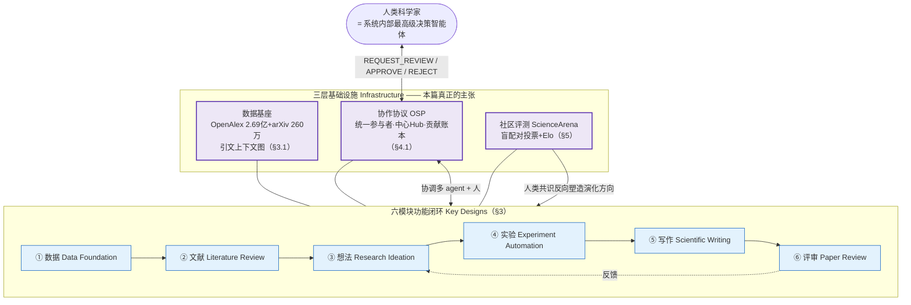

# 组会汇报 · OmniScientist（人机共演化科研生态）

> 主讲提示：这是全课「research 被 Agent 接管到什么程度」的**终局想象**那一篇。它和我们 0 号文献 The AI Scientist 形成最尖锐的范式对照——
> AI Scientist 问「能不能让一台机器自己跑完一篇论文」；OmniScientist 问「**单台机器永远成不了科学家，因为科学是社会性的；那要补什么基础设施，AI 才能真正进入科学共同体**」。
> 开场就把这句对照抛出来，全篇都在论证它。

---

## 1. 封面 · TL;DR

- **作者/出处**：Chenyang Shao, Dehao Huang, Yu Li, … Fengli Xu*, Yong Li*, Tie-Yan Liu（清华 EE/BNRist + 中关村学院），arXiv 2511.16931，2025-11 提交、v2 2025-12-14；项目页 omniscientist.ai，评测平台 sciencearena.ai。
- **一段话**：论文提出 **OmniScientist** 框架，主张「现有 AI Scientist 把科学发现**建模成一个孤立的搜索/优化问题 (standalone search or optimization problem)**，忽视了科学本质上是**社会性、协作性**的事业」（见 Abstract、§1）。它的解法是把**人类科研的底层机制显式编码进 AI 工作流**：一端是六个端到端功能模块（数据→文献→想法→实验→写作→评审），另一端是三项**基础设施创新**——(1) 建在引文网络上的**结构化知识系统**、(2) 让多智能体与人类无缝协作的**协作协议 OSP (Omni Scientific Protocol)**、(3) 基于盲配对投票+Elo 的开放评测平台 **ScienceArena**。目标是让 AI「从单纯的任务执行者 (task executor) 转变为能理解科学规范、参与协作、推动科学生态演化的真正科学家 (genuine scientist)」（Abstract 末句）。
- **三条带走的结论**：
  1. **范式之争**：本篇的核心贡献不是某个更强的 agent，而是一个**论点**——「AI Scientist 缺的不是能力，是**环境**（引文网络、同行评审、协作协议这套『让科学得以演化的 environment』，见 §1 第 3 段）」。这是从「造工具」到「造生态」的范式转移 (paradigm shift)。
  2. **三件基础设施**：数据基座（OpenAlex 2.69 亿条 + arXiv 260 万全文 + 引文上下文）、协作协议 OSP（把人从「外部用户」升级为「内部最高级决策智能体」、把「数据溯源」升级为「**贡献溯源** contribution provenance」）、社区评测 ScienceArena（盲配对 + Elo，让人类判断「主动塑造 AI 的演化方向」）。
  3. **愿景 vs 已实现要分清**：这是一篇**愿景/蓝图 (blueprint) 论文**。很多组件给了框架和小规模验证（如数据精炼 n=1000、HLE n=10 人），但**整体「共演化生态」基本是宣称而非已落地**；作者自陈能力**局限在 AI/CS 领域**（§6.1），评审/实验模块都只在 AI 语料上调过。读它要时刻问「这是设想还是跑通了」。

> 主讲提示：把第 1 条讲透就够本节了——**它把矛头指向「孤立搜索」这个建模假设本身**，这是它区别于 v1/v2/co-scientist 所有系统的根。

---

## 2. 问题与动机（why —— 本篇最该讲透的两页）

**它要顶的是谁？** §1/§2 把现有路线分三类，逐一指出「都把科学发现当孤立的搜索/优化问题」：

| 方向 | 代表系统（原文引） | 范式特征 | 本篇说它缺什么 |
|------|------|---------|------|
| 全自动工作流 | AI Scientist [1]、DeepScientist [8]、AlphaEvolve [3] | LLM 当中控、模板编排；或把发现形式化成**贝叶斯优化/代码进化** | 「孤立执行」，**靠预训练内部知识**，易**收敛到局部最优**，错过知识驱动的变革性创新（§4.2） |
| 人机协作范式 | DeepMind AI Co-Scientist [10] | 多 agent 生成-辩论-进化 + Elo，模拟科研团队 | 协作仍是**临时的、未协议化的**；人仍在系统外 |
| 知识增强平台 | FutureHouse [6]（Crow/Falcon/Owl/Phoenix）、Bohrium [11] | 模块化 agent + 开放接口 + 领域语料 | 跨阶段集成，但仍是「工具集」，无统一治理与信用机制 |

**核心动机（why「生态」而非「更强的单机」）**：§1 第 3 段是全篇的灵魂——

> 「几百年的科学进步，沉淀下来的不只是**静态事实**，而是一套**精密的认知与结构框架**：引文网络把孤立发现变成可追溯的**思想谱系 (traceable lineage of ideas)**；同行评审作为**严格的质量控制**保证可靠性；协作协议规制**贡献与信用 (contribution and credit)** 的交换。这些结构提供了科学得以演化所必需的『**环境 (environment)**』。**不显式建模并编码这些底层机制，AI Scientist 就只是高效的执行者，却继承不了人类科研那种动态、自我纠错的本性。**」

把这段拆成三个「不做会怎样」：
- **没有引文网络这层 environment** → AI 提的 idea 悬空，不知道自己站在谁肩上、和谁冲突 → 重复造轮子、新颖性无从判定。
- **没有协议化的协作/信用** → 人只能在系统外「打断/覆盖/外部干预」（§4.1 原话 ad-hoc interruptions, overrides），共识形成过程**不可追溯**，「这个发现到底是谁的贡献」无法回答。
- **没有社区评测** → 开放式发现的「好不好」只能靠 LLM-as-a-Judge，而 LLM 评判**系统性偏离人类**（§5.1 引 [48,49]）→ 无法校准、无法引导演化方向。

> 主讲提示：这一节别讲组件，只讲**那句「environment」**。把「科学是社会性事业，社会性靠基础设施承载，AI 缺的正是这套基础设施」这条主线钉死，后面六模块+三协议都挂在它上面。

---

## 3. 研究问题 / 核心 intention（形式化成一句话）

把要解决的问题压成一句：

> **能否设计一套框架，把人类科研的『基础设施』——知识网络、协作协议、信用归属、社区评测——显式编码进 AI 的科研工作流，使 AI 从孤立的任务执行者，转变为能进入人类科学共同体、与人共演化的参与者？**

它隐含的**假设**（也是它的赌注）：
- (a) **「环境」可被工程化**：引文网络、评审、信用这些原本「软」的社会机制，可以被建成数据结构（带 `citation_context` 的图）、协议消息（`REQUEST_REVIEW`/`APPROVE`）、账本（`ContributionLedger`）。
- (b) **协议先于能力**：与其继续堆单 agent 的能力，不如先把「人怎么进来、贡献怎么记、好坏谁说了算」的协议铺好，能力会在协议里自然演化（§4.1「协议先行」的立场）。
- (c) **人不可替代且应在系统内部**：人是「最高级认知智能体 (highest-level cognitive agents)」，不是外部监工——这是它和「全自动」路线最大的价值观分歧。

---

## 4. 相关工作定位（站在谁肩上、和谁不同）

> 主讲提示：这张表是组会最容易被追问的——「它到底比 co-scientist / FutureHouse 多了什么？」答案是**协议层和评测层**，不是模块本身。

| 维度 | AI Scientist v1/v2 [1,9] | AI Co-Scientist [10] | FutureHouse/Bohrium [6,11] | **OmniScientist（本篇）** |
|------|------|------|------|------|
| 科学发现的建模 | 进化/树搜索 | 多 agent 辩论 | 流水线工具链 | **显式编码「人类科研基础设施」** |
| 数据基座 | 模板内自带 | 未强调 | 领域语料 | **2.69 亿 OpenAlex + 260 万 arXiv 全文 + 引文上下文图** |
| 人的位置 | 系统外 | 系统外（监督） | 系统外 | **系统内部、最高级决策者（OSP 统一参与者模型）** |
| 协作协议 | 无 | 隐式 | 开放接口 | **OSP：MCP/A2A 之上的科研专用协议 + 中心 Hub** |
| 信用/溯源 | 无 | 无 | 数据溯源 | **贡献溯源 ContributionLedger（谁 create/refine/approve）** |
| 评测 | LLM 自评审 | Elo（内部） | 静态/内部 | **ScienceArena：人类盲配对投票 + Elo 公开榜** |
| 性质 | 已落地系统 | 已落地系统 | 已落地平台 | **愿景蓝图 + 各模块小规模验证** |

一句话定位：**别人在「模块」上竞争，它在「模块之间的连接组织（协议+评测+知识网络）」上提出主张**——这正是「生态 vs 工具」的差别。

---

## 5. 方法总览（big picture，先直觉后细节）

OmniScientist 是「**六模块功能闭环** + **三层基础设施**」的双层结构。下图是把原文 Figure 1（系统总览，六模块环绕中心，中心是 OSP/Hub/贡献溯源/人作为参与者）+ §4/§5 重画的**生态框架图**：



**直觉（一句话读懂这张图）**：内圈六模块是「一个 AI Scientist 该会的活」（这部分和 v1/co-scientist 同构）；**外圈三层基础设施才是本篇的命门**——它让六模块**不再是孤岛**：数据基座给它们「思想谱系」的环境，OSP 给它们「人怎么进来、贡献怎么记」的协议，ScienceArena 给它们「好坏由人类共识说了算」的评判。**「共演化 (co-evolving)」就发生在外圈**：人通过 OSP 进入流程、通过 ScienceArena 的投票把人类标准注入榜单，AI 据此演化能力。

> 主讲提示：讲这张图就一句——**「内圈是大家都有的，外圈是它独有的；这篇论文真正的内容在外圈。」** 内圈（§3）我们快讲，外圈（§4-5）慢讲。

---

## 6. 符号与术语表（后文统一用）

| 记号 / 术语 | 含义（首次出现中英对照） |
|------------|------|
| AI Scientist | 用 LLM 模拟科研活动、以最小人类干预完成发现的系统（§2 定义） |
| 共演化生态 (co-evolving ecosystem) | 人与 AI 在同一科学语境中相互塑造、共同进化的系统愿景（标题/§1） |
| environment（环境） | 科学得以演化所需的结构性框架：引文网络、同行评审、协作协议（§1 核心词） |
| OSP（Omni Scientific Protocol，全科学协议） | 本篇提出的科研专用协作协议，统一「人机协作 + 信用归属」（§4.1） |
| MCP / A2A / SCP | 通用协议：Model Context Protocol [37]（agent↔工具）、Agent-to-Agent [38]（agent↔agent）、Scientific Context Protocol [39]（科研工作流，OSP 站在其上） |
| Hub（中心枢纽） | OSP 的中心化基础设施：身份/项目注册、消息路由、不可变过程记录（§4.1.2） |
| `ScholarlyObject` | 科学活动中智力价值的最小载体（如 `Hypothesis`/`CodeBlock`/`Artifact`），贡献的容器（§4.1.3） |
| `ContributionLedger`（贡献账本） | 绑定在每个 `ScholarlyObject` 上的不可变时序记录，记录谁（人/AI）做了 create/refine/propose/approve（§4.1.3） |
| 贡献溯源 (contribution provenance) | 从「数据从哪来」升级到「这个**发现**从哪来、谁该得到 credit」（§4.1.3） |
| Deep Ideation | §3.3 的想法生成框架：在科学概念网络上「探索-扩展-演化」(explore-expand-evolve) |
| $K_t$ / $N(K_0)$ | 第 $t$ 轮的关键词集合 / 初始关键词的邻居关键词集合（§3.3） |
| ScienceArena | §5 的开放评测平台：人类盲配对投票 + Elo 动态榜 |
| $R$ / $E_A$ / $K$ | Elo 评分 / A 战胜 B 的期望胜率 / 可调更新系数（§5.2 Eq.1-2） |
| HLE（Humanity's Last Exam） | §4.5 案例用的高难度考题集 [43]，用来测人机协作 |
| STDE | Stochastic Taylor Derivative Estimator [40]，§4.3 案例改进的目标方法 |

---

## 7. 方法细节 ① 内圈：六个功能模块（§3，快讲，建立「它会哪些活」）

> 主讲提示：这一节是「它和别的 AI Scientist 同构的部分」，组会上**快过**，只点出每个模块**为科学而非通用任务**做了什么特化。重头戏留给 §8-10 的外圈。

**①数据基座 Data Foundation（§3.1，最该记的一块）**——构建动态科研知识图谱：
- **规模（原文数字）**：OpenAlex **约 2.69 亿**篇论文元数据（题/摘/作者/机构/年/DOI/引用/关键词/学科/开放状态）；arXiv **约 260 万**篇 PDF 全文（覆盖 >90% AI 相关出版物）；外加从 **top-10 AI 会议**抓的 **102,679** 篇全文、**116,970** 个被引 baseline 模型、**68,316** 个相关数据集。
- **图结构**：有向带标签图，四类节点 **Paper / Author / Concept / Resource**（数据集/模型/工具），边有 `CITES`/`WRITTEN_BY`/`USES`/`CENTERS_ON`（见 Figure 2 右）。**关键创新**：给 `CITES` 边附 **`citation_context`**（引用的文字理由），让系统能推理「作者**为什么**引、是正引还是负引」，而不止结构连边。
- **自精炼流水线（Figure 2 左）**：多 agent（Diagnose→Search→Normalization→Coding→Review）持续诊断/补全/校验图；`Conf<0.5` 的新边转人工复核（human review）。**小批量验证（Table 1, n=1000）**：元数据完整度 0.965→**1.000**、正确度 0.951→**0.997**、QA 检索准确率（100 题）0.700→**0.880**。
- 案例（Figure 3）：He 2016（ResNet）同时引 Inception 和 Highway Net——传统关键词检索看不出二者关联，但靠 `citation_context`（「skip-style pathways」vs「learnable gates」）能挖出「**跨层路由缓解深网退化**」这条隐藏概念桥。**这就是「思想谱系」环境的具体兑现**。

**②文献综述 Literature Review（§3.2）**：批评 OpenAI DeepResearch 三宗罪——源质量低（开放网噪声大）、检索浅（只关键词/嵌入）、缺科学严谨。对策：本地科学库 + Elasticsearch 多字段检索 + **沿引文/参考逐层 BFS 扩展**（模拟人类追「思想谱系 genealogy of ideas」，超越关键词匹配）。案例（Figure 5）：四法对比（Base/WebSearch/DeepResearch/Tool-Augmented），由 Gemini-2.5-pro 在 Relevance/Completeness/Depth/Logic/Usefulness 五维 1–10 打分；**Tool-Augmented（带科学网络检索）全维最高**，且最强商业 DeepResearch 与它仍有明显差距，佐证「关系感知检索是综述质量的主因」。

**③想法生成 Research Ideation（§3.3，Deep Ideation 框架）**：在**科学概念网络**（关键词共现图）上做 **explore-expand-evolve**。这是内圈唯一给了公式的模块，单列于 §7.1。

**④实验自动化 Experiment Automation（§3.4）**：先解决「该用什么 baseline/数据集」——两阶段联合推荐：用 `self-description + citation context`（**collective perception，集体感知**，Figure 7）微调嵌入器做粗召回，再抽「paper→baseline→paper'→dataset」**引文链**微调 LLM 做可解释重排（Figure 8）。选定后交四 agent 闭环执行：**Evolution（生成代码变体）/ Sample（构造下一轮 prompt）/ Evaluation（跑+测）/ Feedback（把报错转成改进建议）**。

**⑤科学写作 Scientific Writing（§3.5）**：批评既有写作流水线「不从文献学风格、不重视觉」。四 agent：**Outline（学最相关论文的写作风格）/ Figure（LLM 列图表清单→Python 画数据图、生成模型画方法图，VLM 验质）/ Writing（逐节生成 LaTeX）/ Refinement（一次性全局修订 + 编译修错 + VLM 评图）**（Figure 9）。

**⑥论文评审 Paper Review（§3.6，TIMAR 框架）**：批既有 ASPR 系统缺**细粒度可追溯**、模型中心（RL/自纠错而非人在环）、忽视 OCR/Markdown 解析瑕疵。**TIMAR** 五阶段：(A) 输入预处理（cell-by-cell 表格核验、容忍解析瑕疵 artifact tolerance）→ (B) 检索增强（Breadth→Depth 取证）→ (C) 并行评审（Novelty/Rigor/Clarity 三 agent 独立打分）→ (D) 合并+迭代修订（内部 Debate「乐观/怀疑」两视角 + HITL 用户偏好当修订指令）→ (E) 终稿+标注（结论—证据—引用 `[n]` 链，可回溯到原文 §/Table 或证据库）（Figure 11）。

> 主讲提示：六模块一句话收尾——**「它们都被『为科学而特化』了（引文上下文、思想谱系 BFS、集体感知、可追溯评审），但本质仍是六个 agent；真正让它们成『生态』的是下面的协议和评测。」**

---

## 7.1 内圈唯一的数学块：Deep Ideation 的「探索-扩展-演化」（§3.3）

> 主讲提示：这是内圈唯一值得写公式的地方。讲它是为了说明**「想法不是凭空采样，而是在人类概念网络上走出来的」**——这正是「站在引文环境里思考」的微缩兑现。

**为什么要这个机制（why）**：以往 ideation 要么靠关键词共现/语义相似（太浅，只看一阶邻居），要么直接拿检索到的文献让 LLM 发挥（不利用概念间的网络关系）。Deep Ideation 想让 LLM **沿科学概念网络逐步走、走一步记一步（Idea Stack）**，像人类研究者那样在「读—联想—收敛」中迭代出既新又可行的 idea。

**符号（先定义，后用式）**：
- $K_0=\{k_1,\dots,k_n\}$：初始关键词集合（来自用户输入或文献题/摘/引言抽取的概念节点）；
- $N(k_i)$：关键词 $k_i$ 在科学网络中的邻居关键词集合，**限制取 $m$ 个**（$m$ 为预设上限，避免邻居爆炸）；$N(K_0)=\{N(k_1),\dots,N(k_n)\}$；
- $\mathcal P(k_i,k_j)=\{p_1,\dots,p_\ell\}$：**同时**包含 $k_i,k_j$ 的论文集合；
- $R(k_i,k_j)$：两关键词的关系，由它们的共现论文聚合而来；$g(\cdot)$：聚合函数；
- $K_t$：第 $t$ 轮关键词集合；$k_{\text{new}}$：本轮新选入的关键词；
- $P_t$：第 $t$ 轮产出的 idea 提案（含 research background / research idea / general implementation approach）；
- $L_{\max}$：触发「演化」的关键词集合长度阈值；Router：决定下一步演化 $K$ 还是演化 $P$ 的路由器。

**Explore（探索邻居）**：
$$ N(K_0)=\{N(k_1),N(k_2),\dots,N(k_n)\} $$
**关系分析**：
$$ R(k_i,k_j)=g\big(k_i,k_j,\mathcal P(k_i,k_j)\big) $$
读出什么：两概念「有多相关」不是拍脑袋，而是由「**多少篇、哪些论文同时谈它们**」聚合出来——关系被**文献证据**锚定。

**Expand（扩展集合）**：选出与现集合关系最强的 $k_{\text{new}}\in N(K_0)$ 并入：
$$ R(k_{\text{new}},k_i)=g\big(k_{\text{new}},k_i,\mathcal P(k_{\text{new}},k_i)\big),\qquad K_{t+1}=K_t\cup\{k_{\text{new}}\} $$
据更新后的 $K_{t+1}$ + Idea Stack（历轮关键词与提案）生成提案：
$$ P_t=\mathrm{LLM}(K_{t+1},\text{prompt}) $$

**Evolve（演化）**：当 $|K_t|$ 达 $L_{\max}$，由 Router 决定演化方向：
$$ \text{Next Action}=\begin{cases}\text{Keywords Evolve}, & \text{Router}==\mathrm{Evolve}(K_t)\\[2pt]\text{Idea Proposal Evolve}, & \text{Router}==\mathrm{Evolve}(P_t)\end{cases} $$
演化时**替换**而非只增长关键词：
$$ K_{t+1}=(K_t\setminus\{k_{\text{old}}\})\cup\{k_{\text{new}}\}\quad\text{或}\quad P_{t+1}=\mathrm{LLM}(K_{t+1},\text{prompt}) $$

读出什么：整个过程像「**在人类知识图上做有记忆的图游走 + 周期性换血**」，Idea Stack 记录每轮进展（呼应人类研究的迭代性）。此外有一个 **Critic Model**：用「Scientific Reasoning Simulation」prompt 让 LLM 模拟人类评审的认知过程，再用其反馈**微调** LLM，使评估对齐专家标准（§3.3 末）。

> 主讲提示：埋一条批判线——这里的 $g$、Router、Critic 都**未给出具体形式**（原文未给出 $g$ 的解析式与 Critic 的训练细节），是「框架级」描述。这是愿景论文的典型粒度。

---

## 8. 方法细节 ② 外圈核心一：协作协议 OSP（§4.1，本篇最该慢讲的一节）

> 主讲提示：**这是全篇的心脏。** 如果只有 10 分钟，就讲这一节。它回答「人和 AI 到底**怎么在一个系统里共事、且每份贡献都记得清**」。

**why（既有协议缺什么）**：通用协议 MCP [37]（agent↔工具）、A2A [38]（agent↔agent）只解决「数据怎么传」，科研专用的 SCP [39] 提供了中心 Hub 雏形；但科研「不只是数据传输工作流，而是**推理感知的协调过程 (reasoning-aware coordination)**，深嵌人类直觉、协作辩论、严格溯源与智力信用」。在此 setting 下，现有协议有**三大根本缺陷（§4.1 原文）**：

| 缺陷（原文名） | 含义 | OSP 的回应 |
|------|------|------|
| **Human-is-External**（人在外部） | 现协议把人当 user/operator，而非系统内最高级认知智能体；人机交互是临时打断/覆盖/外部干预，未协议化 | §4.1.1 统一参与者模型：人=内部最高级决策者 |
| **Collaboration-is-Dark**（协作是暗的） | 组会、评审、师徒指导发生在协议层之外（Slack/微信/线下）→ **共识形成这一最关键阶段不可追溯**，在源头切断了科学推理的溯源链 | §4.1.2 中心 Hub：一切交互过 Hub，成「单一事实源」 |
| **Credit-is-Ambiguous**（信用是模糊的） | 现协议只关心「任务完成没」，能答「数据从哪来」却答不了「**这个发现从哪来、谁该得 credit**」 | §4.1.3 贡献溯源 + 贡献账本 |

OSP 的总目标：统一 **人机协作 (Human-AI collaboration, H-AI)** 与 **智力信用归属 (intellectual credit attribution)**。下面三小节逐一拆。

### 8.1 §4.1.1 从「外部用户」到「内部参与者」——统一参与者模型

- **核心动作**：在协议层重新定义人类科学家——不是外部 operator，而是**内部参与者、生态中最高级的决策实体**。
- **统一参与者模型 (Unified Participant Model)**：协议**不再区分**「AI」和「人」，都抽象为同一类 `Participant`。`Human_Participant` 与 `AI_Scientist_Participant` 拥有**对等的协议级地位**，可在同一通信结构里**对称地**收发消息。
- **范式转变**：通信从「人通过界面下命令」的**层级式**，变为**对等 (peer-to-peer)**——AI 可**主动**向人发起异步协商。于是「人的直觉、判断、决策」不再是系统外不透明的操作，而成为系统内**可积分、可审计、可追溯**的组件。
- **为长时人机协商设计的协议动作 (performatives)**——用 `REQUEST_REVIEW`/`REQUEST_DECISION` 取代简单的 `request`/`inform`：

| Performative | 触发场景 | 效果 |
|------|------|------|
| `REQUEST_REVIEW(artifact_id, criteria)` | AI 产出关键 artifact（草稿/代码）请人评审 | agent 状态转 `WAITING_FOR_HUMAN` |
| `REQUEST_DECISION(task_id, options)` | AI 探索遇分叉（两条都可行的合成路径），请人做高层决策 | 提供 `options` 给人选 |
| `APPROVE(artifact_id, version_hash)` | 人类批准 | 含 version hash，**永久写入溯源链**，作为后续步骤的正式验证 |
| `REJECT(artifact_id, reason)` | 人类否决 | `reason` 本身是有价值的科学信息，触发 AI 反思/重规划/新一轮探索 |

读出什么：人的 approve/reject **不再是界面上一次点击，而是可引用、具法律意义的协议事件**，保证科研工作流的**全链可追溯**。

### 8.2 §4.1.2 中心 Hub——支撑多方参与

- **为什么要中心化 Hub**：真实科研协作**很少是一对一线性的**，而是复杂的**多对多 (M-to-N)**——一个 `Project` 牵涉多名人类（PI、博士生、合作者）和多种 AI agent。点对点/总线式拓扑难以管多方协作。
- **Hub 的三大角色（不止消息中转）**：
  1. **身份与项目注册 (Identity and Project Registry)**：统一注册 `Human_Participant` 与 `AI_Agent_Participant`，并登记每个 `Project` 的定义——**明确每项研究的参与者边界与工作范围**（没有清晰项目划界，贡献归属无从谈起）。
  2. **消息交换与分发中心**：任何参与者把消息发给 Hub，Hub 按项目上下文路由给恰当接收方——把 $N\times N$ 通信网降为可扩展可管理的 $N\times 1$ 星形拓扑（同时改善可扩展性与鲁棒性）。
  3. **不可变过程记录器 (Immutable Process Recorder)**：因一切人-AI、AI-AI、乃至人-人交互都经 Hub，Hub 天然成为整个工作流的**单一事实源 (single source of truth)**，强制记录每一步关键动作/决策/认知动作，提供作者所谓的**强制可审计性 (forced auditability)**——这是贡献溯源与问责的根本技术保证。

### 8.3 §4.1.3 从「数据溯源」到「贡献溯源」——贡献账本

- **why**：「任何无法清晰界定智力贡献的科研平台，都难获真实研究者的信任与采用。」传统协议靠单一肤浅日志判贡献，不够。
- **机制**：OSP 不靠日志，而是借项目管理内核（Hub）构造并维护统一的 **Long Scientific Context（长科学语境）**——记录项目全生命周期的**一切中间数据与资源**（引文、跑过的实验、生成的日志/图表/代码、团队讨论记录），不止最终产物。
- **两个关键抽象**：
  - `ScholarlyObject`：智力价值的**最小载体/贡献容器**（如 `Hypothesis`、`CodeBlock`、`Artifact`）；
  - `ContributionLedger`：绑定在每个 `ScholarlyObject` 上的**不可变时序账本**，按时间记录每个 `Participant`（人或 AI）做了什么动作（`create`/`refine`/`propose`/`approve`）+ 时间戳。
- **原文给的最小示例（一个假设的演化轨迹）**：
  ```json
  "ContributionLedger": [
    { "participant_id": "Human_A_ID (PhD Student Bieber)", "action": "PROPOSE_HYPOTHESIS", "timestamp": "..." },
    { "participant_id": "AI_Reviewer_ID (Review Agent)",   "action": "refine_statement",   "timestamp": "..." },
    { "participant_id": "Human_B_ID (Advisor Frank)",      "action": "APPROVE",            "timestamp": "..." }
  ]
  ```
  读出什么：一个假设由**人提出→AI 精炼→人批准**，三方贡献被原子化记录。
- **不可断的贡献链 (chain of contribution)**：每个 `ScholarlyObject` 绑定其账本后，下游 agent 被**协议强制**引用原对象及其完整账本。于是**无论后续过程多自动化，最终 `Result` 永远能透明回溯到所有贡献者**（如 Human_A、AI_Reviewer、Human_B）。

> 主讲提示：把 OSP 三件套连成一句话——**「先把人请进系统（统一参与者）→ 再让所有交互过一个中心（Hub 单一事实源）→ 于是每个发现都能记清是谁的贡献（贡献账本）」**。这三步合起来，才让「共演化」从口号变成可记账的过程。注意全篇**未给出 OSP 的形式语义/状态机定义或参考实现性能**（原文未给出），是协议**设计提案**。

---

## 9. 方法细节 ③ 外圈核心二：闭环多 agent + 人机协作（§4.2-4.5，含两个案例）

> 主讲提示：这节给「共演化」两个**可触摸的证据点**：一个证「AI 接外部知识能超过纯进化搜索」（STDE），一个证「人进来后准确率从 0 拉到 0.22」（HLE）。数字要原样念。

### 9.1 闭环多 agent 系统（§4.2）

批 FunSearch/AlphaEvolve「把发现当孤立搜索、靠预训练内部知识、易陷局部最优」。对策：**DeepResearch Agent（广读文献定 SOTA/找空白）→ Ideation Agent（在概念网络上生成有据可依的假设）→ Experiment Agent（跑实验证伪）**，三者**闭环**：实验的结果/报错/性能数据回灌，供 Ideation 精化或弃用假设、或供 DeepResearch 发起更有针对性的新检索（Figure 12）。**关键是「闭环 + 外部知识驱动」**，让创新既扎根已有科学又经实证。

### 9.2 案例一：用闭环实验给 STDE 降方差（§4.3，正面证据）

- **目标**：改进 NIPS 2024 best paper **STDE [40]**（任意微分算子的高效摊销）。其软肋：核心用标准 **Monte Carlo (MC)** 采样估计期望，收敛率仅 $O(1/\sqrt N)$，高维下方差大、精度受限。
- **对照**：先上 **AlphaEvolve**（内部算法进化）——勤勉地调超参/换网络/换优化器，但**困在原概念边界内**，只比 STDE 基线**边际改善**。再上 **OmniScientist**——DeepResearch 广搜「方差缩减/随机导数估计/高维积分」，**识别出一个 STDE 没用的成熟领域 Quasi-Monte Carlo (QMC)**；Ideation 假设「把 MC 采样器直接换成 QMC 采样器」（QMC 用低差异序列更均匀覆盖样本空间，理论收敛率更优、约 $O((\log N)^k/N)$），实现为 **RQMC（Randomized QMC，Cranley-Patterson 随机平移）**（Figure 13 给了生成的代码）。
- **结果（Table 2，AllenCahnTwobody 方程，误差越低越好）**：

| 方法 | 100 D | 1000 D | 10000 D | 100000 D |
|------|------|------|------|------|
| STDE | 0.008730 | 0.002620 | 0.003440 | 0.002500 |
| AlphaEvolve | 0.007859 | 0.001654 | 0.002059 | 0.003041 |
| **OmniScientist** | **0.006780** | **0.000579** | **0.000572** | **0.001210** |

读出什么：**全维度最低误差**，尤其 1000D/10000D 比 STDE 降约一个数量级。论点是——「**变革性突破来自主动从更广文献引入外部知识 (QMC)，而非在原方法内打转**」，这正是「生态/知识驱动」对「孤立搜索」的胜利。

### 9.3 人机协作的设计（§4.4）+ 案例二：HLE（§4.5，人进系统的证据）

**协作设计（§4.4）四类场景**：多人参与（多领域专家同时进来）/ 关键产物的人类校验（草稿、算法设计、实验结论请人审，反馈算科学记录的一部分）/ 决策点的人类介入（分叉时问人）/ 正式批准与否决（否决触发结构化反思-重规划-重执行，决策与理由都入语境）。

**案例二（§4.5）**：基于 **Humanity's Last Exam (HLE) [43]** 设三模式——**AI Solo / Human Solo / Human-AI Collaboration**。协作模式用 **Tree-of-Thoughts (ToT) [44]** 实现：每轮 LLM 生成 **3 条**多样推理路径/中间结果，人选择或给反馈引导，下一轮再生成 3 条，直到提交终答；全程记录交互/响应时间/正确性。
- **setting**：招 **10 名博士生**，每人 10 题（5 题 Solo + 5 题协作），循环矩阵设计保证每题被 5 人 Solo、另 5 人协作作答；题取自 CS/AI（ML、空间识别、数据库查询、算法与数据结构等）；LLM 用 **GPT-5 [45]**。
- **结果（Figure 14，平均准确率）**：

| 模式 | 平均准确率 |
|------|------|
| **Human-AI Collaboration** | **0.22** |
| Human Solo | 0.10 |
| AI Solo | **0.00** |

读出什么：**AI 单干 0.00**（在这批超难题上独立推理稳定犯错并过早停），**人单干 0.10**，**人机协作 0.22**——协作显著超过任一方单干。论点：**人的洞察/校验插入语境，能把 AI 的多样推理能力「兜住」并纠偏**（Figure 15-20 给了博弈论与空间可见性两道题的逐轮对话：AI Solo 给错，协作经人类「请从更抽象角度验证」「请给出计算与终答」等反馈后得对）。这是「人作为系统内最高级智能体」的直接兑现。

> 主讲提示：HLE 这个 0.00→0.22 极有冲击力，但务必同时念 **n=10、每题仅 5 人**——这是**小规模可行性演示**，不是统计意义上的强证据。诚实是本课灵魂。

---

## 10. 方法细节 ④ 外圈核心三：ScienceArena 社区评测（§5）

> 主讲提示：这是「好坏由谁说了算」的答案——**把评判权交还人类共同体**。它对应人类科研的「同行评审」这层 environment，是「共演化」的反馈通路：人类投票 → Elo 榜 → 反向塑造 AI 演化方向。

**why（§5.1）**：开放式科研发现**难评**。静态基准（DeepResearch Bench 100 题 [46]、IdeaBench 基于 2374 篇目标论文 [47]）**不贴合真实科研体验**（用户形成 idea 前往往没有全部相关参考）；且现行评测重度依赖 **LLM-as-a-Judge**（DeepResearch Bench 用 Gemini-2.5-Pro、IdeaBench 用 GPT-4o），而**复杂科研语境下 LLM 判断系统性偏离人类**（引 [48,49]）。对策：仿 **LMArena [50]** + 人类同行评审，做 **ScienceArena**——放弃静态题、由广大真实用户**动态提交真问题**，模型输出经**匿名盲配对比较**，汇成 **Elo 动态榜**；邀 PhD 学生与教师等**领域专家**大规模投票。**六条赛道**：literature review、ideation、hypothesis generation、reviewer、paperQA、authorQA。

**Design：Elo 实时排名（§5.2）**：
- **直觉**：每个模型给一个标量分 $R$（初始 $R_0=1000$），两两比较的胜负像下棋一样动态更新分数；分高者被随机配到时更可能赢。
- **符号**：$R_A,R_B$ 为模型 A、B 当前分；$E_A$ 为 A 战胜 B 的**期望胜率**；$S_A\in\{0,1\}$ 为实际胜负；$K$ 为可调更新系数。
- 期望胜率（Eq.1）：
$$ E_A=\frac{1}{1+10^{(R_B-R_A)/400}} $$
- 评分更新（Eq.2）：
$$ R_A'=R_A+K(S_A-E_A),\qquad R_B'=R_B+K\big((1-S_A)-(1-E_A)\big) $$
读出什么：**赢得「本不该赢」的对局（$E_A$ 低却 $S_A=1$）加分最多**——这是 Elo 的核心，让分数快速逼近真实实力。
- **三项针对开放高吞吐场景的增强**：
  - **冷启动敏感窗口**：新模型期内放大有效分差 $\Delta R=\alpha(R_B-R_A),\ \alpha>1$，让其在少量比较下更快收敛到稳定估计；
  - **配对衰减因子**：$K_{\text{eff}}=K\cdot\gamma^{\,n_{AB}},\ 0<\gamma<1$（$n_{AB}$=该对历史交手数），抑制同一对反复刷分导致的震荡、促进比较覆盖面；
  - **活跃度回归**：不活跃模型的分缓慢回归全局均值 $\bar R$：$R_i'=R_i-\lambda(R_i-\bar R),\ \lambda>0$，使过时模型不长期霸榜、榜单反映时间相关性。
- **工程**：异步、消息队列驱动的更新架构，把评分计算与前端交互解耦，毫秒级更新、高并发下实时重排。

**Evaluation：从投票数据反推「人类偏好什么」（§5.3，三条洞察）**：
- **§5.3.1 综述看重引文**（Figure 21-22）：**数量**——引文越多，偏好分越高（引文标记 [Author,Year] 是「学术权威」的**视觉信号**，评估者隐性把「引得多」等同于专业/全面）；**密度**——引文应均匀分布、每段有锚，比扎堆更显连贯；**深度**——选择性深整合更优，但深度常被「数量」盖过。结论：引文既是证据锚也是审美/评价信号，未来系统要在**深度与数量间求平衡**。
- **§5.3.2 ideation 平衡新颖与可行**（Figure 23-24）：高分 idea 既要**新颖**（明确说清如何**偏离/扩展/重构**已有工作线、把贡献放进文献背景里）又要**可行**（给出完整子步骤分解、方法路径、实验验证细节，讲清**具体技术机制**而非停在概念）。结论：**「看起来可做又新 (doable yet new)」最受欢迎**；过度求新会脱离现实，过度求稳又流于增量。
- **§5.3.3 评审重判断力与简洁**（Figure 25）：高质量评审**不靠长**——一篇右侧模型评审长达 7,256 词 / 42,537 字符却被嫌冗长；**简洁聚焦**（抓主要优缺点）+ **判别性判断**（指出真创新、评证据是否支撑主张、把论文定位到文献中做横向比较）才受青睐。结论：**「更多文字 ≠ 更好评审」**。

> 主讲提示：§5.3 这三条对「怎么造更受人认可的 AI Scientist」极有指导性——但也要点出**潜在偏置**：评估者偏好「引文多/看着全」可能奖励**表面繁荣**而非分析深度（§5.3.1/5.3.2 作者自己点了这个 bias）。这本身就是「人类共识也有偏差，共演化会不会把偏差也放大」的好讨论点。

---

## 11. 设置 / 指标 / 规模总览（把分散的 setting 汇成一张表）

> 主讲提示：这一节是「setting 写全」的总账，方便组会上一眼回答「它到底验证了什么、多大规模」。

| 组件 | 数据/规模 | 指标 / 方法 | 关键结果 | 出处 |
|------|------|------|------|------|
| 数据基座 | OpenAlex 2.69 亿 + arXiv 260 万全文 + 会议 102,679 篇 / 116,970 baseline / 68,316 dataset | 元数据完整度/正确度、QA 检索准确率（n=1000，100 QA） | 0.965→1.000 / 0.951→0.997 / 0.700→0.880 | Table 1 |
| 文献综述 | 四法对比 | Gemini-2.5-pro 五维 1–10 | Tool-Augmented 全维最高 | Figure 5 |
| 实验·案例 STDE | AllenCahnTwobody，100–100000 D | 估计误差（越低越好） | OmniScientist 全维最低（1000D 0.000579 vs STDE 0.002620） | Table 2 |
| 人机协作·HLE | 10 博士生×10 题，循环矩阵；LLM=GPT-5 | 平均准确率 | 协作 0.22 / 人 0.10 / AI 0.00 | Figure 14 |
| ScienceArena | 六赛道；专家投票 | Elo（Eq.1-2）+ 冷启动/衰减/回归增强 | 三条人类偏好洞察（§5.3） | Figure 21-25 |

**注意**：除上述小规模验证外，**OSP 协议、Hub、ContributionLedger、共演化生态本身均无规模化部署或量化评测**（原文未给出协议吞吐/采用率/真实多方项目的端到端数据）——它们是**设计提案**。区分「已验证模块」与「待落地愿景」是读这篇的关键。

---

## 12. 局限与批判（诚实，本课的灵魂）

**原文自陈（§6.1）**：
1. **能力局限在 AI 领域**：数据基座以 arXiv 为主，**严重高估 AI/CS**；Nature/Science 等「期刊优先」学科覆盖差。实验 agent **只支持计算型工作流**（配环境、跑训练/推理脚本、调超参、出量化指标），**湿实验（化学/生物）、与科学仪器的物理交互全在范围外**。评审模块也只在 AI 语料调过，对别领域投稿质量打分能力受限。
2. **效率 vs 资源成本的权衡**：各模块仍需可观算力与处理时间，难高效完成特别复杂的任务或赶紧任务（tight timelines）。

**社区/批判视角（可补充的质疑）**：
- **「愿景密度」远高于「实证密度」**：全篇最重的两节（OSP §4.1、ScienceArena §5）几乎全是**设计描述**；OSP 没有形式语义、状态机、参考实现或任何「多方真实项目跑通」的端到端证据；ScienceArena 只描述了 Elo 设计与三条事后洞察，**未给出榜单规模、投票量、模型数、统计显著性**。Table 1（n=1000）、Table 2（单方程）、Figure 14（n=10）都是**小批量演示**。
- **核心机制「框架级」留白**：Deep Ideation 的聚合函数 $g$、Router 决策、Critic 训练；数据精炼各 agent 的具体策略；TIMAR 各打分 agent 的 rubric——**多处「原文未给出」**。
- **「贡献溯源」的硬问题没解**：账本只记「谁做了 create/refine/approve」这类**动作**，但「**智力贡献的权重**」（一个 refine 值多少 credit）是开放难题，论文止于记录动作、未给分配机制。
- **「共演化」可能放大人类偏置**：§5.3 自己发现评估者偏好「引文多/看着全/可做又新」——若用这种人类共识反向训练 AI，可能**奖励表面繁荣**、固化主流偏见，而非真正提升科学质量。这与 v1 的「论文洪水」担忧异曲同工。
- **中心化 Hub 的治理风险**：单一事实源=单点信任与单点故障；谁运营 Hub、谁定义 `Project` 边界、跨机构信任如何建立——协议假定了一个中立 Hub，现实里这是制度问题不是技术问题。

> 主讲提示：批判落脚点一句话——**「它最有价值的是『提问的方式』（科学是社会性的，要补基础设施），但它给出的『答案』目前主要是蓝图。把它当**议程设置 (agenda-setting)** 论文读，而非已交付系统。」**

---

## 13. 在 auto-research 版图的位置（与本库其它论文的关系）

- **阶梯定位（Tool→Analyst→Scientist）**：本篇**跳出了阶梯本身**。v1/v2/co-scientist 都在问「单个系统爬到哪一阶」；OmniScientist 说「**阶梯错了——再高的单机也成不了 Scientist，因为 Scientist 是共同体角色**」。它要造的是**让阶梯得以存在的「场地」**（数据网络+协议+评测）。
- **与 0 号文献 The AI Scientist（2408.06292）的对照**（最该讲）：

| | The AI Scientist v1 | OmniScientist |
|------|------|------|
| 问题 | 能否让一台机器自跑完一篇论文 | 要补什么基础设施 AI 才能进科学共同体 |
| 评审 | **自评审**（LLM 给自己打分，循环性） | **人类社区评审**（ScienceArena 盲投票，打断循环性） |
| 人的位置 | 系统外 | 系统内最高级决策者 |
| 信用 | 无 | 贡献账本 |
| 性质 | 已落地、登 Nature | 愿景蓝图 |

  正好接上本库 9.1 模块的判断「自称 Scientist 的系统都自评、独立验证最高只到 Analyst」——**OmniScientist 的 ScienceArena 正是想用「人类社区」充当那个缺失的独立验证层**。
- **承接关系**：
  - ← 直接对话：AI Scientist v1/v2 [1,9]、AI Co-Scientist [10]、AlphaEvolve [3]、FutureHouse/Bohrium [6,11]——把它们全归为「孤立搜索」并提出超越方案；
  - ← 评测批判：引 [48,49]「LLM-as-a-Judge 有偏」，把本库的「评审循环性/自评不可信」批判线，正面转化为「**改用人类社区评测**」的建设性提案；
  - → 呼应全课终局问题：它是「research 被 Agent 接管到什么程度」的**最大胆回答**——不是「Agent 取代人」，而是「**Agent 与人在同一生态共演化**，人始终是最高级智能体」。

> 主讲提示：把它放在「批判线的建设性转向」位置——前面的论文都在说「AI Scientist 不可尽信（自评、幻觉、刷榜）」，这篇第一次系统性地回答「**那把人和社区的基础设施补回去**」。

---

## 14. 复现与可用性

- **代码/数据/平台**：项目页 **omniscientist.ai**，评测平台 **sciencearena.ai**（论文以脚注给出）。OSP 站在 MCP [37]/A2A [38]/SCP [39] 之上，SCP 实现见 github.com/open-sciencelab/scp（[39]）。**论文正文未给出 OmniScientist 主框架的开源仓库链接或可运行代码**（原文未给出），多数组件描述为框架级。
- **能不能在单卡/小规模跑**：数据基座（2.69 亿 + 260 万全文 + 多 agent 精炼）显然是**重型基础设施**，非单卡可复现；可复现性最高的是 **HLE 案例**（10 人×10 题 + ToT + GPT-5，属可照搬的人机协作实验协议）与 **STDE/QMC 案例**（给了 RQMC 代码思路，Figure 13）。
- **坑**：(1) 框架级留白多，照搬需自行补 $g$/Router/Critic/rubric；(2) 数据基座依赖 OpenAlex/arXiv 大规模抓取与图构建；(3) ScienceArena 需要**真实专家投票流量**才有意义，个人难复现其「社区」属性。

---

## 15. 组会讨论问题（5–8 个，引发讨论）

1. **范式之争**：本篇断言「孤立搜索」是现有 AI Scientist 的根本缺陷。但 AlphaEvolve/v2 也拿了实打实的成果——「补基础设施」与「继续堆单机能力」，哪条路更可能先带来变革性发现？STDE 案例（0.000579 vs 0.002620）足以服人吗？
2. **贡献溯源能否落地**：`ContributionLedger` 只记动作（create/refine/approve），但「一个 refine 值多少 credit」是开放难题。在 AI 大量参与时，**学术署名/credit 制度**会被它改写还是被它击穿？谁来运营那个「单一事实源」Hub？
3. **共演化会放大偏置吗**：§5.3 发现人类评估者偏好「引文多、看着全、可做又新」。用这种人类共识反向塑造 AI，会不会**奖励表面繁荣、固化主流偏见**？「人类共识」真的是好的演化信号吗？
4. **0.00→0.22 说明了什么**：HLE 里 AI Solo 稳定 0.00、协作 0.22。这是「AI 能力不足、必须靠人兜底」的证据，还是「ToT+人类反馈这个**交互协议**好」的证据？把 GPT-5 换成更强模型，AI Solo 会不会自己就上来、协作增益消失？
5. **ScienceArena 能取代同行评审吗**：盲配对+Elo 能反映「即时偏好」，但科学价值常需**数年**才显现（被引、可复现、被推翻）。Elo 榜会不会奖励「**当下讨喜**」而非「长期正确」？怎么把「时间检验」编码进评测？
6. **愿景 vs 已实现**：全篇最重的 OSP/ScienceArena 几乎全是设计。作为「议程设置」论文它价值很高，但**一个连参考实现都没有的协议，算不算贡献**？我们该用什么标准评判愿景型论文？
7. **人始终是最高级智能体——这是判断还是信念**：论文把「人=最高级决策者」写进协议设计。如果未来 AI 在某些科学任务上**稳定超过人类专家**，这条设计会成为**枷锁**吗？「共演化」里人的角色会不会从「最高级」滑向「被咨询」？

---

## 16. 一页速记（汇报当天速览）

- **是什么**：一篇**愿景/蓝图论文**。核心论点——现有 AI Scientist 把科学当「孤立搜索」，缺的不是能力是**环境（引文网络+同行评审+协作协议这套让科学得以演化的基础设施）**；解法是把这套基础设施**显式编码**进 AI 工作流，实现**人机共演化**。
- **结构（双层）**：内圈**六模块**（数据→文献→想法→实验→写作→评审，各为科学特化）；外圈**三基础设施**——①数据基座（OpenAlex 2.69 亿 + arXiv 260 万全文 + **引文上下文图**）；②协作协议 **OSP**（统一参与者：人=内部最高级决策者 → 中心 **Hub**=单一事实源 → **贡献账本** ContributionLedger 记 create/refine/approve）；③社区评测 **ScienceArena**（人类盲配对 + **Elo** Eq.1-2 + 冷启动/衰减/回归增强，六赛道）。
- **关键数**：数据精炼 QA 0.70→0.88（Table 1）；STDE 案例误差全维最低（1000D 0.000579 vs 0.002620，Table 2）；HLE 人机协作 **0.22** > 人 0.10 > AI **0.00**（Figure 14，n=10）。
- **三句话结论**：①范式从「造工具」转向「造生态」（议程设置）；②三件基础设施是真正主张，但**多为设计提案、小规模验证**；③区分**愿景宣称 vs 已实现**——OSP/生态基本未落地，能力**局限 AI 领域**（§6.1）。
- **在课里的位置**：批判线的**建设性转向**——前面都在说「AI Scientist 自评不可信、会刷榜、会幻觉」，这篇第一次系统回答「**把人和社区的基础设施补回去，让 AI 在共同体里共演化，人始终是最高级智能体**」。是「research 被 Agent 接管到什么程度」的终局想象：不是取代，而是**共演化**。

> 主讲提示：结尾一句——**「The AI Scientist 证明了『一台机器能跑通』；OmniScientist 主张『一台机器永远不够，科学是社会性的』。前者交付了系统，后者交付了一张蓝图与一个议程。」** 全课在这两端之间张开。
