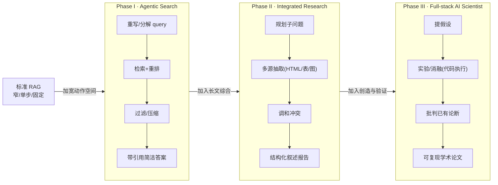
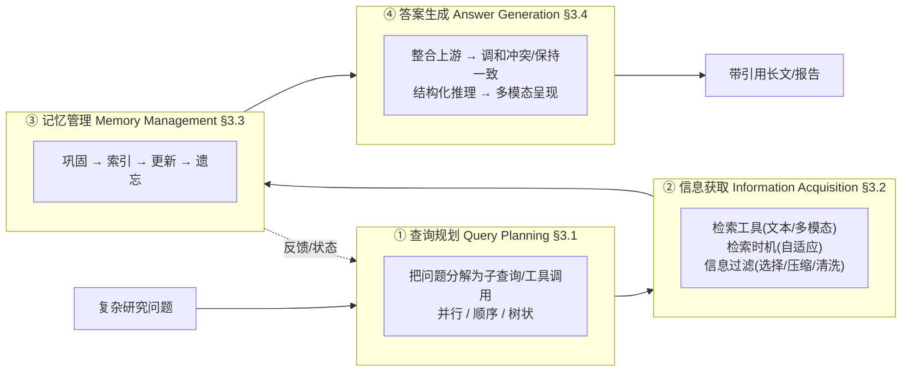

# 组会汇报 · Deep Research: A Systematic Survey

> 主讲提示：这是我们库里**最新、最全的一篇 DR 综述**（2025-11）。它不教某个 trick，而是给整个领域一套**坐标系**——把散落在 RAG、web agent、AI Scientist 的工作收编进"四组件 / 三范式 / 三阶段"。读它的目的，是**之后任何一篇 DR 系统/批判论文，都能立刻在这张图上找到坐标**。全程对照原文 §/Figure/Table 编号，不外推。

---

## 1. 封面 · TL;DR

- **出处**：*Deep Research: A Systematic Survey*，arXiv **2512.02038** v1（提交 2025-11-24，正文标注成文 **2025-11-13**）。多机构合作（13 家单位、30 位作者），代码/资源库 `github.com/mangopy/Deep-Research-Survey`。全文 87 页，其中**正文 pp.1–49，pp.50–87 为参考文献**（约 500 条引用）。
- **一段话**：这篇综述主张——LLM 已从"文本生成器"进化为"问题求解器"，但许多真实任务需要**批判性思考 (critical thinking)、多源 (multi-source)、可验证 (verifiable)** 的输出，超出了单轮提示 (single-shot prompting) 和标准检索增强生成 (Retrieval-Augmented Generation, RAG) 的能力。**深度研究 (Deep Research, DR)** 就是把 LLM 放进一个**端到端研究工作流**：迭代地分解复杂问题、通过工具调用获取证据、把验证过的洞见综合成连贯的长答案。综述的四条主贡献（见摘要与 §1 末）：(i) 形式化一个**三阶段路线图**并把 DR 与相邻范式划清边界；(ii) 提出 DR 的**四个关键组件**——查询规划、信息获取、记忆管理、答案生成，各配**细粒度子分类法**；(iii) 总结三类**优化技术**——提示工程、监督微调 (SFT)、agentic 强化学习 (RL)；(iv) 整合**评测基准与开放挑战**。
- **三条带走的结论**：
  1. **DR ≠ RAG**：原文 §2.3 给三条 RAG 单靠扩参也解决不了的根本缺口——与数字世界的灵活交互、长程自主工作流、面向开放任务的可靠语言接口；DR 的本质是"**灵活的、带宽更大动作空间的自主工作流**"，RAG 只是把检索当**启发式增强步**。
  2. **一张分类法收编全场**（Figure 2）：把上百个系统按"四组件 + 三优化范式 + 评测三场景"挂到一棵树上；并用 **Table 1** 把 DR 拆成**能力递进的三阶段**：Agentic Search → Integrated Research → Full-stack AI Scientist。
  3. **领域焦点正在迁移**：从"检索对不对"转向"**长程一致性、记忆演化、多轮 RL 的训练稳定性、长文生成的评测**"。综述明确把**记忆管理**称作"DR 区别于简单 RAG agent 的根本"（§3.3 Takeaway），把**多轮 RL 不稳定**（void turns / Echo Trap）列为核心未决难题（§6.3）。

> 主讲提示：开场就把"它是一张地图，不是一个方法"立起来。三阶段路线图 + 四组件，是这篇所有内容的两根主轴。

---

## 2. 问题与动机（why —— 本篇最该讲透的一节）

**领域缺口在哪？** 原文 §1 直说：尽管 DR 进展飞快，**此前没有一篇系统综述**去梳理它的关键组件、技术细节与开放挑战。已有综述大多还停在**相邻领域**——RAG 与 web agent——的总结，而 DR 相比 RAG 采取了一种**更灵活、自主、抛弃手工流水线**的工作流，目标是产出**连贯、证据落地的报告**。所以"给 DR 一张清晰的技术全景图"既紧迫又缺位。

**为什么 RAG 不够？为什么是现在？**（原文 §2.3，三条根本限制，逐条是 why 的核心）

- **与数字世界的灵活交互 (Flexible Interaction with the Digital World)**：传统 RAG 在**静态检索回路**里工作，只依赖预先索引好的语料；而真实任务常需主动与**搜索引擎、Web API、甚至代码执行器**这样的**动态环境**交互。DR 通过多步、工具增强的交互扩展了这一范式，让 agent 能取到最新信息、执行操作、验证假设。
- **长程自主工作流 (Long-horizon Planning with Autonomous Workflows)**：复杂研究型问题往往要协调多个子任务、管理求解上下文、迭代精化中间结果。DR 用**闭环控制 + 多轮推理**应对，让 agent 自主地规划、修订、朝长程目标优化工作流。
- **面向开放任务的可靠语言接口 (Reliable Language Interfaces for Open-ended Tasks)**：LLM 在开放设定下易**幻觉、自相矛盾**。DR 引入**把自然语言输出对齐到落地证据**的可验证机制，建立用户与自主 agent 之间更可靠的接口。

**一句话动机**：

> **不是再优化检索的某一环，而是把"规划→取证→记忆→综合"整条研究回路交给 agent 自主转起来，并让每一句话都能溯源到证据。**

> 主讲提示：这一节是全篇 why 的地基。三条限制对应后面四个组件——交互↔信息获取、长程↔查询规划+记忆、可靠↔答案生成。把这条对应关系讲出来，听众就懂"为什么恰好是这四个组件"。

---

## 3. 研究问题 / 核心 intention（形式化成一句话）

把综述要回答的元问题压成一句：

> **如何用一套统一的分类法（坐标轴），把"深度研究"这个快速膨胀、能力导向的领域，结构化为可比较、可复现、可持续推进的研究对象？**

它隐含的两个**立场（综述观点，非系统宣称）**：
- **(a) 能力轨迹而非价值高低 (a capability trajectory rather than a value hierarchy)**（原文 §2.2 原话）：三阶段是"系统**能可靠做到什么**"的递进，不是"谁更高级"的鄙视链——Phase I 不是低端，而是**精度/延迟敏感**场景的恰当选择。
- **(b) DR 是一个闭环工作流**：输入复杂研究问题，输出**带引用的长文/结构化报告**，中间循环穿过四个互联组件（原文 §3 开篇 + Figure 1）。

---

## 4. 相关工作定位：DR vs RAG vs 既有综述（站在谁肩上、和谁不同）

综述自身的定位（原文 §1）：与 RAG 综述、web-agent 综述**对话但超越**——后者只覆盖 DR 的局部。它的差异化是**第一个把 DR 当独立范式做组件级 + 优化级 + 评测级的系统综合**。

**Table 1（原文）——传统 RAG vs DR 三阶段能力对照**（✓=具备，✗=不具备）：

| 能力 (Key Feature) | 标准 RAG | Agentic Search | Integrated Research | Full-stack AI Scientist |
|---|---|---|---|---|
| 搜索引擎访问 | ✓ | ✓ | ✓ | ✓ |
| 使用多种工具（Web API 等） | ✗ | ✓ | ✓ | ✓ |
| 代码执行做实验 | ✗ | ✗ | ✗ | ✓ |
| 反思以纠正动作 | ✗ | ✓ | ✓ | ✓ |
| 求解记忆管理 | ✗ | ✓ | ✓ | ✓ |
| 创新与假设提出 | ✗ | ✗ | ✗ | ✓ |
| 长文答案生成与验证 | ✓ | ✗ | ✓ | ✓ |
| **动作空间 (Action Space)** | 窄 Narrow | 宽 Broad | 宽 Broad | 宽 Broad |
| **推理跨度 (Reasoning Horizon)** | 单步 Single | 长程 Long-horizon | 长程 | 长程 |
| **工作流组织** | 固定 Fixed | 灵活 Flexible | 灵活 | 灵活 |
| **输出形态与应用** | 短跨度 | 短跨度 | 报告 Report | 学术论文 Academic Paper |

> 读出什么：DR 与 RAG 的根本分野是三栏——**动作空间（窄→宽）、推理跨度（单步→长程）、工作流（固定→灵活）**。注意一个有意思的**非单调**现象：「长文答案生成与验证」在标准 RAG 上是 ✓、到 Agentic Search 反而 ✗——因为 Phase I 故意**只做精准取证、最小综合**，把长文留给 Phase II。这正印证了"能力轨迹而非价值高低"。

> 主讲提示：这张表是整篇的"判别器"。组会上有人甩来一个系统，就拿这三栏问：动作空间多宽？推理多长？工作流死的活的？立刻定位到某一阶段。

---

## 5. 方法总览（big picture）：四组件 + 三阶段路线图

### 5.1 三阶段路线图（原文 §2.2，能力轨迹）

- **Phase I — Agentic Search（agentic 搜索）**：专注**找对源、最小综合**。重写/分解 query 提升召回，检索+重排候选文档，做轻量过滤/压缩，产出**带显式引用的简洁答案**，强调对检索内容的**忠实性**与**可预测的运行时**。代表应用：开放域 QA、多跳 QA。评测重 **recall@k、答案精确匹配**，辅以引用正确性、端到端延迟。
- **Phase II — Integrated Research（集成研究）**：超越孤立事实，产出**整合异质证据、管理冲突与不确定性**的连贯结构化报告。回路**显式迭代**：规划子问题→从 HTML/表格/图表抽取关键证据→综合叙述性报告。代表应用：市场/竞品分析、政策简报、行程设计。评测从短文词面匹配**转向长文质量**：细粒度事实性、引用可验证、结构一致性、关键点覆盖。
- **Phase III — Full-stack AI Scientist（全栈 AI 科学家）**：不止聚合信息，更要**生成假设、做实验验证/消融、批判已有论断、提出新视角**。应用：论文评审、科学发现、实验自动化。评测重**新颖性与洞见深度、论证一致性、结论可复现（能否从引用源/代码重导出结果）、校准的不确定性披露**。

### 5.2 四组件闭环（原文 Figure 1 + §3 开篇）

**直觉**：①像"把大题拆成可逐步求解的小题"；②像"按需上网查资料并去伪存真"；③像"维护一本不断整理的研究笔记"；④像"把笔记写成有理有据的报告"。关键是**四件事被串成闭环、记忆把状态回灌给规划**（原文称这种把规划与演化记忆耦合的做法为 **Stateful Query Planning**，§3.4.1）。

> 主讲提示：两张图分别是"纵向能力阶梯"和"横向组件流水线"。先讲清这两轴，后面 §6–§12 全是往这两轴里填细节。

---

## 6. 符号与术语表（后文统一用）

综述本身公式集中在 §4.3（RL）。下表综合原文 Figure 2、Table 3 与各组件定义：

| 记号 / 术语 | 含义（出处） |
|---|---|
| DR (Deep Research) | 深度研究：端到端研究型 agent 工作流（§2.1） |
| 四组件 | Query Planning / Information Acquisition / Memory Management / Answer Generation（§3，Figure 1） |
| 三阶段 | Agentic Search / Integrated Research / Full-stack AI Scientist（§2.2，Table 1） |
| 三优化范式 | Workflow Prompting / SFT / Agentic RL（§4） |
| 自适应检索 (adaptive retrieval) | 决定**何时**触发检索，即让模型"知道自己知道/不知道什么"（§3.2.2） |
| 巩固/索引/更新/遗忘 | 记忆四操作 Consolidation / Indexing / Updating / Forgetting（§3.3，Figure 5） |
| ADD/UPDATE/DELETE/MERGE/FORGET | 非参记忆上的离散操作记号（§3.3.3–3.3.4，Mem0/TiM/Memory-R1 等） |
| $\pi_\theta,\ \pi_{\theta_{\text{old}}}$ | 当前策略 / 冻结的参考(旧)策略（Table 3） |
| $q,\ o,\ o^t,\ s_t$ | 输入查询 / 模型输出 / 第 $t$ 步动作(token) / 第 $t$ 步状态(上下文)（Table 3） |
| $\mathcal{R}(o\mid q)$ | 奖励函数：给输出 $o$ 的标量分（Table 3） |
| $r_t(\theta)$ | 概率比 $\pi_\theta(o^t\mid s_t)/\pi_{\theta_{\text{old}}}(o^t\mid s_t)$（Eq.2，Table 3） |
| $\hat A_t$ | 优势估计 (advantage)（Eq.3） |
| $\mathcal{G},\ m,\ o_j$ | 同一 query 的响应组 / 组大小 / 组内第 $j$ 个响应（Table 3，GRPO 用） |
| $\epsilon,\ \gamma$ | 裁剪阈值 / 折扣因子（Table 3） |

---

## 7. 组件① 查询规划（Query Planning，§3.1）

**why**：研究型问题逻辑复杂，直接一把梭检索召回差。把它转成**可逐步求解的子查询序列**，能让推理与取证**分步进行**，提升最终输出的可靠性与准确性。原文按"分解结构"分三类（Figure 3）。

| 子类 (§) | 定义 | 代表系统（原文 Figure 2 / 正文） | 优点 | 缺点 |
|---|---|---|---|---|
| **并行规划 Parallel (§3.1.1)** | 一次性 (one-shot) 重写/分解成**相互独立**、可并行求解的子查询 | Least-to-Most、CoVE、Rewrite-Retrieve-Read、MMOA-RAG、DeepRetrieval、CardRewriter | 高效，子查询可并行 | 非迭代、无法纳入中间证据/纠错；**假设子查询条件独立**，遇到有依赖的题会出"病态/无法回答"的子查询 |
| **顺序规划 Sequential (§3.1.2)** | 多轮迭代，每轮分解**基于上一轮输出**，反馈驱动 | LLatrieval、DRAGIN、ReSP、S3、AI-SearchPlanner、Search-R1、R1-Searcher、RAISE | 动态、上下文感知、细粒度重构，擅长多跳/消歧 | 推理链过长→成本/延迟高；轮数多→**累计噪声与误差传播**，RL 训练易不稳 |
| **树状规划 Tree-based (§3.1.3)** | 把每个子查询当**树/DAG 节点**，用 MCTS 等搜索算法探索-精化路径 | RAG-Star（MCTS+UCT）、DTA、DeepSieve（DAG）、DeepRAG（二叉树，判定"参数 vs 检索"）、MAO-ARAG | 兼并行与顺序之长，能表达层次与非线性依赖，局部可并行 | 训练难：需精确依赖建模、数据稀缺、RL 信用分配 (credit assignment) 难 |

> 主讲提示：三类的**判别轴**就是"子查询之间有没有依赖、要不要回看中间结果"。并行=无依赖一把出；顺序=线性依赖；树状=分支依赖。原文 DeepRAG 那个"每个节点决定走参数知识还是去检索"很值得展开——它把"要不要检索"也变成了规划的一部分。

---

## 8. 组件② 信息获取（Information Acquisition，§3.2）

**why**：检索**有成本、文档质量不确定**，所以既要决定**何时检索**，也要决定**怎么取、怎么去噪**。原文分三块：检索工具、检索时机、信息过滤。

### 8.1 检索工具（§3.2.1）——按模态分

- **文本检索**三族：**词法 (lexical)**（TF-IDF/BM25 + 神经稀疏模型，可解释倒排索引）；**语义 (semantic)**（dense 向量，超越精确词匹配）；**商用 Web 搜索**（Google/Bing，实时、权威性+新鲜度信号、内建跨源事实校验，如 WebGPT/SearchGPT）。**演化主线**：词法/语义→商用 web 搜索 = 从静态闭库走向**动态、实时、可验证**的真实世界知识。
- **多模态检索**三类：**带版面的文本感知检索**（索引标题/caption/周边文字 + 版面过滤，LayoutLM/Donut/DocVQA）；**视觉检索**（CLIP/SigLIP/BLIP 做图文/组合图像 ANN）；**结构感知检索**（解析表格/图表的轴、图例、schema，ChartReader/Chartformer）。三者常**并用**，用 reciprocal-rank fusion 或跨模态重排**保留可溯源指针**（表格单元、图表坐标）以支撑**可验证引用**。
- **代价（综述观点）**：多模态带来视觉处理算力↑、对 OCR 错误与图表格式敏感、跨模态对齐复杂（§3.2.1 末与 Takeaway）。

### 8.2 检索时机（§3.2.2）——自适应检索 = "知道自己知不知道"

**why**：盲目每步都检索常常次优，低质/无关文档反而会误导推理。核心是让模型识别**自身知识边界 (knowledge boundary)**。综述用一条线索串起**置信度估计**与**检索触发**：

- **置信度估计**四类（作为边界感知的代理）：概率置信（token 概率，但开放生成下校准差，SAR/语义不确定性来补）；一致性置信（多次/多模型/多语言回答是否一致）；内部状态置信（隐状态已编码事实性，甚至生成前就能预测对错）；口头化置信 (verbalized)（让模型用自然语言说出信心，但存在**持续性过度自信**）。
- **代表性自适应检索范式**四类：概率策略（低置信 token 触发，FLARE/DRAGIN）；一致性策略（跨模型/跨语言一致性低则检索，Rowen）；内部状态探针（CtrlA/UAR/SEAKR）；口头化策略（生成特殊 token 触发，ReAct 提示式、Self-RAG 训练出 `<retrieve>`、Search-o1 的 Reason-in-Documents、Search-R1 用 RL 联合学"何时+取什么"）。

> 演化主线（原文 §3.2.2 末）：**固定/每步检索 (IR-CoT) → 动态触发 (ReAct/Self-RAG/Search-o1) → RL 显式训练检索策略 (Search-R1)**。

### 8.3 信息过滤（§3.2.3，Figure 4）——选择 / 压缩 / 清洗

**why**：检索器不完美，结果含大量噪声（完全无关 or 似是而非的误导）；LLM 对噪声**高度敏感**，不过滤极易被带偏到幻觉。三类：

| 过滤类 | 子方法 | 代表 |
|---|---|---|
| **文档选择 Document Selection** | 点式 point-wise（独立打分，BGE/cross-encoder/`<ISREL>`/`True` token）；对式 pair-wise（两两比较 + heapsort，PRP，交换两次缓解位置偏置）；列表式 list-wise（整列喂入全局排序，RankGPT/TourRank/ListT5/InstructRAG/Rank-R1(GRPO)/ReasonRank） | 见上 |
| **上下文压缩 Context Compression** | 词法式（压成简洁自然语言：RECOMP/Chain-of-Note/BIDER/RankCoT）；嵌入式（压成 dense 向量序列：ICAE/COCOM/xRAG 压到 1 token/ACC-RAG/QGC 按 query 复杂度自适应压缩率） | 见上 |
| **规则清洗 Rule-based Cleaning** | 去结构性空洞元素（HtmlRAG 删 CSS/JS + 块树剪枝）；表格 schema+cell 检索（TableRAG） | 见上 |

> 主讲提示：过滤是"简单但有效"的提点手段，但综述明确提醒**双刃**——多一个过滤模块=多算力多延迟，**过度过滤会删掉有用甚至正确的信息**（§3.2.3 Takeaway）。"过滤精度 vs 信息保留"的平衡是关键。

---

## 9. 组件③ 记忆管理（Memory Management，§3.3）——综述眼中"DR ≠ RAG"的根本

**why（本组件是全篇 why 的高潮）**：原文 §3.3 Takeaway 直说——**一套成熟的记忆框架，正是把 DR agent 从简单 RAG 系统根本区分开的东西**，它赋予系统在长程任务上所需的一致性、适应性与自我演化能力。记忆治理"求解上下文"的**全生命周期**，四操作（Figure 5）：

| 操作 (§) | 定义 | 范式拆分 | 代表系统 |
|---|---|---|---|
| **巩固 Consolidation (§3.3.1)** | 把短期信息（对话/工具输出）转成稳定长期表示（类比神经科学的 engram） | 非结构化（蒸馏成摘要/关键事件：MemoryBank/MemoChat/ChatGPT-RSum/Generative Agents 反思/GITM）；结构化（转成 DB/图/树：TiM 元组、ChatDB、AriGraph、HippoRAG 知识图、MemTree 层次树） | 见左 |
| **索引 Indexing (§3.3.2)** | 在已巩固记忆上建"可导航地图"（类比图书馆目录） | 信号增强（加情境/主题/关键词元数据：LongMemEval、MMS）；图式（节点=记忆、边=关系，支持多跳：HippoRAG、A-Mem）；时间线式（按时序/因果组织：Theanine、Zep 的 $t_{valid}/t_{invalid}$ 双时态） | 见左 |
| **更新 Updating (§3.3.3)** | 据新信息/反馈**激活并修改**已有知识 | 非参数（外部存储：ADD/UPDATE 解冲突 Mem0、MERGE 合并 TiM、Zep 改 $t_{invalid}$、自反思 Reflexion/Voyager/A-Mem 的 Memory Evolution）；参数（改权重：全局再训练→Memory-R1 学策略、局部 locate-and-edit、模块化 MLP Memory/Memory Decoder 即插即用避灾难性遗忘） | 见左 |
| **遗忘 Forgetting (§3.3.4)** | **主动**移除过时/错误/冗余以降干扰（是功能而非缺陷） | 被动（自然衰减：MemGPT 的 FIFO、MemoryBank 仿 Ebbinghaus 曲线、MEM1 的 use-and-discard）；主动（非参 DELETE：Mem0/TiM 的 FORGET/Memory-R1/AriGraph/Zep edge invalidation；参数 unlearning：MEOW 用矛盾事实微调覆盖） | 见左 |

> 主讲提示：把这四操作类比**人类研究笔记**：巩固=把零散见闻写成条目；索引=做目录/标签；更新=改错+补新（含"给旧事实打失效时间戳"这种非破坏式做法）；遗忘=删冗余。**Zep 的双时态 ($t_{valid}/t_{invalid}$)** 值得单独讲——它让记忆能回答"这事实当时有效、现在失效"，是知识时效性的优雅解法。这是本篇相对前序综述**最有增量**的一块——把"agent memory"系统化进了 DR。

---

## 10. 组件④ 答案生成（Answer Generation，§3.4，Figure 6）

**why**：答案生成是 DR 的**收束环节**，但研究级答案要解决传统文本生成没有的难题——**调和冲突证据、保持长程一致、把推理结构化、最终多模态呈现**。四个递进阶段：

1. **整合上游信息（§3.4.1）**：原则是"每句话都落在可验证外部证据上"。从"喂排序证据"（Self-RAG 按需检索 + reflection token 自纠）走向 **Stateful Query Planning**——把计划与**演化记忆状态**耦合（Plan-on-Graph 用动态记忆引导 reflection；MCTS-OPS 把 MCTS 树当演化 query plan 的状态）。
2. **综合证据 + 维持一致（§3.4.2）**：
   - **调和冲突证据**三招：**可信度感知注意力 (Credibility-Aware Attention)**（按来源可信度加权，顶刊 > 未核实博客）；**多 agent 评议 (Multi-Agent Deliberation)**（MADAM-RAG 多 agent 各持视角 + meta-reasoning 汇总，像专家委员会达成共识）；**面向事实性的 RL (RL for Factuality)**（RioRAG：与证据强一致给正奖励、无据/矛盾则罚）。
   - **长文一致与信息密度**：综述给出一个经验关系——
     > 直觉：想知道"模型最长能连贯写多长"，发现它**被微调样本的平均长度决定**。
     >
     > 符号：$L_{\text{model}}$=模型输出的最大连贯长度；$L_{\text{SFT}}$=监督微调数据集中样本的**平均长度**。
     > $$L_{\text{model}} \propto L_{\text{SFT}}$$
     > 读出什么（原文引 LongWriter）：要让模型写得更长更连贯，**得在训练数据里喂足够长的样本**；RioRAG 还引入**长度自适应奖励**惩罚"灌水但不增信息量"的冗长，防 reward hacking。
3. **结构化推理与叙述（§3.4.3）**：从 **Prompt-based CoT**（$\mathcal{R}=\text{LLM}(\text{CoT-Prompt}+\mathcal{Q}+\text{Evidence})$，先出中间步再出答案）→ **显式结构规划**（RAPID 三段：大纲生成→证据驱动精化→计划引导写作，大纲是 DAG；SuperWriter 解耦推理与文本生成 + 层次化 DPO）→ **工具增强推理**（动态调外部计算/检索工具）。
4. **呈现生成（§3.4.4）**：从纯文本走向**多模态报告**（BLIP-2/InstructBLIP/MiniGPT-4 → MedConQA/LIDA/ChartGPT 数据可视化 → PresentAgent/PPTAgent/Paper2Video 可编辑 PPT/视频）。综述据 **Table 2** 指出：**多数 DR 系统仍以"带引用文本综合"为主，只有少数（OpenAI DeepResearch、H2O.ai DeepResearch）支持全面多模态输出**；但"富多格式生成将很快成为标配"。

> 主讲提示：这一节把"答案生成"从"文本拼接"升级成"可解释、可信、可呈现"。最值得展开的是 **$L_{\text{model}}\propto L_{\text{SFT}}$**——它解释了为什么很多 DR 系统"写着写着就崩"，并直接推出"要专门为长文做训练"这个工程结论。

---

## 11. 三大优化范式（原文 §4）——怎么把组件训得更强

### 11.1 范式一：工作流提示工程（Workflow Prompting，§4.1）+ Anthropic 案例

**why**：最简单有效的搭法——不训模型，靠**精心设计的多 agent 流水线**协作。综述以 **Anthropic Deep Research**（§4.1.1）为范本，核心是**lead orchestrator（主编排者）协调多个 worker agent**，在显式**研究预算 (research budget)**（控 agent 数、工具调用、推理深度）下运转。六个核心点：查询分层与规划（深度优先 vs 广度优先定策略与预算）→ 委派与扩展（事实查找 1–2 个 agent、多视角分析可到 10+，各有配额与停止准则）→ 任务分解与提示规约（每子任务=结构化 prompt，含目标/输出 schema/引用政策/回退动作）→ 工具选择与证据日志（中央 tool registry + evidence ledger 记录工具溯源）→ 并行采集与中途综合 → 终稿与归因（claim 程序化链到 source）。

**Table 2（原文）——12 个代表 DR 系统的输出能力**（■=支持；维度：内容生成 Text/Image/Audio/Video/Pres.、结构化输出 Table/JSON/Code、进阶 Chart/GUI/Cite）。关键读数：
- **几乎所有系统都支持 Text + Cite**（引用是 DR 标配）；
- **H2O.ai DeepResearch 覆盖最广**（Text/Image/Audio/Pres./Table/Chart/Cite 多项）；**OpenAI DeepResearch** 也较全（Text/Image/Table/JSON/Chart/Cite）；
- 多数开源系统（Manus/OpenManus/OWL/SunaAI/Alita）集中在 Text + Code/Table + Cite，**音视频/Presentation 仍稀疏**。

### 11.2 范式二：监督微调（SFT，§4.2，Figure 7）

**why**：SFT 常作 RL 前的 **cold start（冷启动/热身）**，赋予基本任务技能；难点是**自动构造高质量 SFT 数据**（人工采轨迹昂贵不可扩展）。两条路线：

- **强到弱蒸馏 (Strong-to-weak Distillation，§4.2.1)**：把强 teacher 的正确决策轨迹蒸馏给小 student。
  - 单 agent 蒸馏：WebDancer、WebSailor（专家 LRM 造轨迹再用非推理模型重建短 CoT）、WebShaper（每任务 5 rollout + 评审 LLM 过滤）、WebThinker（SFT+策略梯度精化）、WebSynthesis（学到的 world model + MCTS 离线造轨迹）。
  - 多 agent 蒸馏：用"规划者+工具调用者+验证者"的 agentic teacher 造数据，迁移涌现行为到单一 student。MaskSearch（58k 验证 CoT）、Chain-of-Agents（基于 OAgents，四阶段过滤后得 16,433 高质量轨迹）、AgentFounder（agentic 持续预训练）。
  - **对比**：单 agent 简单易部署但受单一 teacher 偏置、轨迹偏浅（偏 token 级动作序列）；多 agent 轨迹更长更多样（含战略规划/分解/自纠/自反思），但需精心系统设计、推理成本高、对提示敏感、数据质量脆。
- **迭代自演化 (Iterative Self-Evolving，§4.2.2)**：模型自产数据微调自己的闭环。Self-Rewarding LM（LLM-as-a-Judge 自给奖励）、Absolute Zero（零数据，把 self-play 当自主课程，用代码执行器当可验证环境）、EvolveSearch（迭代挑高分 rollout 再 SFT）。
  - **风险（综述观点）**：随迭代会**分布漂移、reward hacking、自我强化错误累积→训练崩塌**；缺鲁棒验证机制则**过早收敛到狭窄模式、性能天花板有限**。

### 11.3 范式三：端到端 agentic RL（§4.3）——含全篇唯一公式群

**why**：用 RL 激励能**灵活规划、行动、生成终稿**的 DR agent。主算法 PPO 与 GRPO（符号见 §6 术语表 / 原文 Table 3）。

**PPO（近端策略优化）**——*直觉*：策略更新别迈太大步，用裁剪把更新限制在信任域内，稳。

$$L^{\text{PPO}}(\theta)=\mathbb{E}_t\big[\min(r_t(\theta)\hat A_t,\ \text{clip}(r_t(\theta),1-\epsilon,1+\epsilon)\hat A_t)\big] \quad (1)$$
$$r_t(\theta)=\frac{\pi_\theta(o^t\mid s_t)}{\pi_{\theta_{\text{old}}}(o^t\mid s_t)} \quad (2)$$
$$\hat A_t=\sum_{l=0}^{T-t}\gamma^l\, r_{t+l}+\gamma^{T-t+1}V_\phi(s_{T+1})-V_\phi(s_t) \quad (3)$$

读出什么：$r_t(\theta)$ 是新旧策略概率比，$\hat A_t$ 用 GAE 估优势（$V_\phi$ 是价值网络）；clip 把比值锁在 $[1-\epsilon,1+\epsilon]$，**防止一步更新过猛**。价值函数另用 Eq.(4)–(5) 拟合经验回报 $\hat R_t=\sum_l \gamma^l r_{t+l}$。

**GRPO（组相对策略优化）**——*直觉*：PPO 要训一个价值网络（贵且依赖准确估值）；GRPO 干脆**同一 query 采一组响应，用组内相对好坏当优势**，省掉价值模型。

$$\hat A_j^{\mathcal{G}}=\frac{\mathcal{R}_j-\text{mean}(\{\mathcal{R}_i\mid i\in[m]\})}{\text{std}(\{\mathcal{R}_i\mid i\in[m]\})+\epsilon} \quad (6)$$
$$L^{\text{GRPO}}(\theta)=\mathbb{E}\Big[\tfrac{1}{|\mathcal{G}|}\sum_{j=1}^{|\mathcal{G}|}\min\big(\tfrac{\pi_\theta(o_j\mid q)}{\pi_{\theta_{\text{old}}}(o_j\mid q)}\hat A_j^{\mathcal{G}},\ \text{clip}(\cdot,1-\epsilon,1+\epsilon)\hat A_j^{\mathcal{G}}\big)\Big] \quad (7)$$

读出什么：$\mathcal{G}$ 是组、$m$ 是组大小、$\mathcal{R}_j$ 是第 $j$ 个响应的奖励；优势=该响应奖励**减组均值再除组标准差**（z-score 归一化）。**对比（原文）**：PPO 靠价值模型给绝对优势、稳但贵；GRPO 把"绝对评分"换成"组内相对比较"，**简化实现、降资源**，本质是"让多个候选假设互相比"。

**奖励设计**两类：**规则奖励 $\mathcal{R}_{\text{rule}}$**（EM/F1 等确定性指标，适合短跨度有标准答案的题，但难评多答案/开放题）；**LLM-as-judge 奖励 $\mathcal{R}_{\text{LLMs}}$**：
$$\mathcal{R}_{\text{LLMs}}(o\mid q)=\mathbb{E}_{\text{criteria}\in\mathcal{C}}[\phi(o,q,\text{criteria})]$$
其中 $\mathcal{C}$ 是评测准则集（准确性/完整性/引用质量/清晰度等），$\phi$ 对每条准则返回标量分。

**两种 RL 优化粒度**：
- **特定模块优化（§4.3.2）**：只训一个核心组件（多为 query planner），其余冻结。MAO-ARAG（PPO 把"终 F1 − token/延迟惩罚"全程传播）、AI-SearchPlanner（轻量 planner + 冻结 QA 生成器，双奖励 + Pareto 正则平衡效用与真实成本）。优点：信用分配更准、数据/算力省；缺点：被冻结模块的缺陷限制天花板。
- **整条流水线端到端优化（§4.3.3）**：联合优化分解→检索→阅读→生成。多跳：Search-R1（首个把"搜索增强推理"建模为完全可观测 MDP，mask 检索 token 只对自生 token 算梯度）、R1-Searcher / R1-Searcher++（先 SFT 冷启再知识吸收 RL 抑制"过度搜索"）、R-Search、ZeroSearch/O²-Searcher（模拟搜索引擎更可控）、DeepResearcher（直接真实 web）。长链 web：ASearcher（全异步 RL 去掉 10 轮上限，支持 40+ 轮 / 150k token 轨迹）、SimpleDeepSearcher、Chain-of-Agents（把多 agent 能力蒸馏进单一模型成 Agent Foundation Models）、Tool-Star/ARPO/AEPO（多工具 + 提 rollout 效率）。优点：整体最优、奖励可塑各目标；缺点：**稀疏奖励、响应过长、训练不稳**。

> 主讲提示：公式块按"PPO 稳但贵 → GRPO 省价值网络"的对照讲最清楚。最值得强调的设计是 **Search-R1 的"mask 检索 token"**——只对模型自己生成的 token 回传梯度，避免被外部检索文本干扰，这是把检索塞进 RL 的关键技巧。

---

## 12. 评测设置（setting / metrics，原文 §5，Tables 4–5）

综述把 DR 评测分**三大场景**（Figure 2 右半 + §5）：① agentic 信息搜寻、② 综合报告生成、③ AI for Research，外加 ④ 软件工程。**指标随场景从"短文词面匹配"迁移到"长文质量 / LLM-as-judge / 环境交互成功率"**。

### 12.1 信息搜寻（§5.1，Table 4：QA 基准）

按两维：**查询复杂度** 与 **交互环境复杂度**。

| 维度演化 | 代表基准（含日期/规模/指标，原文 Table 4） |
|---|---|
| 单跳 → 多跳 → 深度推理 | NQ(2019, 30万+, EM/F1/Acc)、SimpleQA(2024)、HotpotQA(2019, 9万+, 多跳)、2WikiMultihopQA(2020)、Bamboogle(2023)、MultiHop-RAG(2024)、MuSiQue(2022, 25K)、GPQA(2023, 448, 研究生级 Acc)、GAIA(2023, 450, EM)、BrowseComp(2025, 1266, EM)、**BrowseComp-Plus(2025, 830, Acc/Recall/Search Call/校准误差)**、HLE(2025, 2500) |
| 静态 → 真实 web 交互环境 | InfoDeepSeek、AssistantBench、Mind2Web/Mind2Web 2(Agent-as-a-Judge)、DeepResearchBench(RetroSearch 环境)、DeepResearchGym(开源 sandbox + 可复现 search API)、WebArena、WebWalkerQA、WideSearch、MMInA(多跳多模态具身) |

### 12.2 综合报告生成（§5.2，Table 5 部分）

- **综述生成 Survey**：AutoSurvey(530K, 多 LLM-judge 评速度/引用/内容质量)、ReportBench、SurveyGen(4200 篇人写综述)。
- **长文报告 Report**：Deep Research Comparator、DeepResearch Bench(100 个 PhD 级任务，参照式质量 + 引用式检索准确)、ResearcherBench(65 题 rubric+事实)、LiveDRBench、PROXYQA、**SCHOLARQABENCH(2967 题)**。综述坦言：报告评测**无单一金标答案、多视角皆可**，故**多数依赖 LLM-as-judge**。
- **海报 Poster**：Paper2Poster(visual quality/text coherence/VLM-judge/PaperQuiz)、PosterGen、P2PInstruct(3万+ 指令对)。
- **幻灯片 Slides**：Doc2PPT(ROUGE/LCFS/Text-Figure Relevance/mIoU)、SLIDESBENCH(7000/0/585)、Zenodo10K、PPTEval、TSBench(379 编辑指令)。

### 12.3 AI for Research（§5.3）

四子任务：**Idea Generation**（AI Idea Bench 2025: 3495 篇 2023-10 后论文 + 灵感论文；RND 用相对邻域密度评新颖；Si et al. 招 100+ NLP 研究者人工评，发现 **LLM 判断与专家一致性低于人类**）、**Experimental Execution**（PaperBench、Scientist-Bench）、**Academic Writing**（PaperBench: 20 篇 ICML 2024、ResearcherBench: 65 题跨 35 个 AI 子领域、Scientist-Bench）、**Peer Review**（ASAP-Review: 8877 篇 ICLR/NeurIPS、REVIEW-5k: 782 篇 ICLR 2024 + Proxy MSE/MAE、REVIEWER2: 27,805 篇、DeepReview-Bench: 1.2K ICLR 2024-25）。

### 12.4 软件工程（§5.4）

SWE-Bench（真实 GitHub issue 解决）为先驱，外延到科学发现、ML 实验、数据科学、地球观测、库补全。

> 主讲提示：这两张表是"基准地图"。组会上选 benchmark 时，按"信息搜寻/报告/科研/软工"四格去找；并记住综述的关键判断——**报告与科研类几乎只能靠 LLM-as-judge**，而这恰恰是 §6.4.3 要批的对象（judge 有偏、贵）。

---

## 13. 挑战与展望（原文 §6）——领域的未决难题

| 挑战 (§) | 核心问题（why 难） | 综述给的方向 |
|---|---|---|
| **检索时机 (§6.1)** | 现有系统（如 Search-R1）**只靠答案正确性**指导整条搜索流水线，缺对"何时检索"的细粒度引导→既过检索又欠检索；无证据时硬答在医疗/金融**误导用户** | 细粒度逐步奖励：每步评估"是否缺知识 + 相关文档能否被检到"；检索后还要评答案对不对、全程结束估**最终不确定性** |
| **记忆演化 (§6.2)** | 当前记忆多是**被动知识缓冲**、flat 存储、静态快照，做不到前瞻规划/深层关系/时效 | (1) 主动个性化（从历史档案→动态预测性用户模型，MemGuide/PaRT/MIRIX）；(2) 认知启发结构化（知识图 + 双时态 + 流式 INSERT/FORGET/MERGE 持续重构，区分 episodic/semantic）；(3) **目标驱动强化记忆**（把记忆管理建成 RL 决策：学 ADD/UPDATE/DELETE 策略，奖励来自最终任务；难点=长程信用分配） |
| **训练算法不稳定 (§6.3)** | PPO/GRPO 单轮稳、**多轮易崩**：奖励骤降、生成无效响应、熵崩塌、梯度爆炸 | 已有解：**SimpleTIR 过滤 void turns（空转：碎片化/重复/早停的响应，源于预训练与多轮推理的分布漂移）**；**StarPO-S 用不确定性轨迹过滤破"Echo Trap（回声陷阱：策略快速同质化→反复输出保守答案→熵与奖励方差骤降的自我强化退化环）"**。未来：保留探索的冷启方法、为 GRPO 设更稠密平滑的奖励 |
| **评测 (§6.4)** | 长文报告评测难 | (1) **逻辑评测**：现有只测短句蕴含/符号谜题，测不了长文跨句/段/篇的论证连贯——要设多粒度一致性框架；(2) **新颖 vs 幻觉边界**：开放设定下"看似原创实则无据"难辨——区分**生成式新颖 (generative novelty，新组合)** 与**演绎式新颖 (deductive novelty，从已知逻辑推出)**，前者配验证机制（预注册可检验论断 + 源消融 + 注入假信息探测）；(3) **LLM-as-judge 的偏置与效率**：judge 偏好长答案/受顺序影响/偏好同类风格 + 大规模成对评测贵→引人类校准 + 微调去偏 judge + 开源模型 + 更省的候选选择 |

> 主讲提示：这一节是"未来选题清单"。最硬核的是 §6.3——**void turns 与 Echo Trap** 是多轮 agentic RL 崩塌的两个已命名病因，直接关系到我们库里所有"用 RL 训搜索 agent"的工作。把这两个名词记牢，遇到训练崩了就能对号入座。

---

## 14. 从 DR 通往通用智能（原文 §7）+ 结论（§8）

**§7 三个跨越点（综述观点，偏前瞻）**：
- **创造力 (§7.1)**：LLM 强在重组/情感/模仿/逻辑，但能否到**真正的创新与新概念生成**存疑；需借心理学的"顿悟/eureka"理论；甚至有观点认为**幻觉可被解读为创造力的一种形式**（需谨慎区分"有益发散"与"错误输出"）。
- **公平 (§7.2)**：自主 agent 可能**继承并放大学术偏见**（偏向主流领域/方法/知名学者，忽视交叉学科或非主流地区）；尤其担心**早期决策的偏置级联放大**后续决策空间→需每一步去偏。
- **安全可靠 (§7.3)**：幻觉虽可能激发多样性，但也散播严重学术错误；需可溯源证据链 + 透明推理 + 鲁棒验证机制遏制"幻觉科学"。

**§8 结论**：DR 把 LLM 从"被动响应者"推向"能迭代推理、综合证据、创造可验证知识的自主研究者"。本综述整合了架构、优化、评测三方面，提供统一路线图；并承诺**随领域快速演化持续滚动更新**，覆盖多模态推理、自演化记忆、agentic RL 等新兴范式。

---

## 15. 局限与批判（诚实——综述自身的边界）

**综述明确承认的（原文）**：
1. **领域太新、移动太快**：作者两次声明会"持续更新"——等价于承认**当前快照很快过时**（v1 截止约 2025-11）。
2. **报告/科研类评测高度依赖 LLM-as-judge**，而综述自己在 §6.4.3 指出 judge **有偏（偏长答案/受顺序影响）且贵**——即**评测体系的地基本身不牢**。
3. **多轮 RL 训练不稳是普遍未解**（§6.3），现有解（SimpleTIR/StarPO-S）只是缓解、且对 GRPO 收益有限。

**我/社区可补的质疑**：
- **分类法的边界有重叠**：四组件之间并非正交——"Stateful Query Planning"同时跨规划×记忆×生成；"检索时机"既属信息获取又被 RL（Search-R1）端到端吸收。分类是**透镜**而非**互斥划分**，使用时要小心同一系统被多处计入。
- **"三阶段"是描述性而非可操作判据**：Table 1 用 ✓/✗ 给能力清单，但"长程""灵活"无量化阈值——两个系统边界态时难严格归类。
- **代表系统多为"系统宣称"**：表格里的能力（如 Table 2 的 ■）来自各系统自述/论文，综述未做**统一独立复评**；"支持某能力"≠"该能力达到可用质量"。
- **数字层面**：综述正文给出的精确数字集中在**评测基准的规模/年份/指标**（Tables 4–5）与 **RL 公式**（Eqs 1–7）；对各系统的**性能数值对比**几乎不列（这是综述体例选择，但也意味着"谁更强"需回原始论文）。

> 主讲提示：诚实地说——这篇的价值在**地图与命名**（四组件、三阶段、void turns/Echo Trap、generative vs deductive novelty），不在"实测谁赢"。用它建立词汇表和坐标系，但**性能结论要回到被引原文**。

---

## 16. 在 auto-research 版图的位置（与本库其它论文的关系）

- **它是我们库的"地图层"**：库里已有的 AI Scientist v1/v2、co-scientist 等是**Phase III（Full-stack AI Scientist）的实例**；各类 Search-R1/WebSailor 是**Phase I–II 的实例**。这篇综述给了把它们**统一摆放**的坐标系。
- **印证本库既有结论**：
  - 库内"自称 Scientist 的系统多靠自评、独立验证最高到 Analyst" ↔ 本篇 Table 1 把"长文答案生成与**验证**""创新与假设提出"标为 Phase III 专属，且 §6.4.2 专设"新颖 vs 幻觉边界"——**验证缺口是跨阶段共识**。
  - 库内"demo 算法须忠于所引论文" ↔ 本篇 §7.3/§6.4.2 反复强调**可溯源证据链 + 可复现（从源/代码重导出结果）**。
- **承上启下**：
  - ← 把 RAG、web agent、agent memory 三条线**收编**进 DR；
  - → 给后续每篇 DR 系统/批判论文提供"四组件×三阶段"的**报告模板坐标**——下次读任一 DR 论文，先问"它动了哪个组件、属哪个阶段、用哪种优化范式"。

---

## 17. 复现与可用性

- **资源库**：`github.com/mangopy/Deep-Research-Survey`（论文列表/分类，综述配套，**非可运行系统**）。
- **能跑的是被引系统而非综述本身**：综述是 meta 文献；要"跑"得去各代表系统的开源仓（如 Search-R1、WebSailor、Anthropic 多 agent 框架、H2O.ai/OpenAI DeepResearch 等）。
- **单卡可行性**：Phase I 的多数 QA/检索系统（Search-R1 类）单卡可起，主要开销在**外部检索 API + 多轮 LLM 调用**；Phase III（代码执行做实验）需更多算力与沙箱。
- **坑**：评测若用 LLM-as-judge，需付费 API 且注意偏置（§6.4.3）；多轮 RL 复现注意 void turns / Echo Trap 导致的训练崩塌（§6.3）。

---

## 18. 组会讨论问题（5–8 个）

1. 四组件（规划/获取/记忆/生成）真的"正交"吗？"Stateful Query Planning"同时横跨规划×记忆×生成——分类法该如何处理这种交叉？用它给系统归类时怎么避免重复计入？
2. Table 1 把"长文答案生成与验证"在标准 RAG 标 ✓、Agentic Search 标 ✗。你认同"Phase I 在这点上不如 RAG"吗？这到底是能力倒退还是**任务定义不同**？
3. 综述称**记忆管理是"DR ≠ RAG 的根本"**。你同意吗？还是说真正的分水岭是**动作空间/工具使用**？给一个能区分两种立场的实验。
4. **void turns 与 Echo Trap**：两者都导致多轮 RL 崩塌，但机理不同（分布漂移导致的空转 vs 策略同质化的退化环）。给更强的底座模型，这两类问题会缓解还是加重？
5. 报告/科研类评测**高度依赖 LLM-as-judge**，而 judge 本身有偏且贵（§6.4.3）。在"无金标答案"的长文评测里，有没有**不靠 LLM-judge**的可信替代？
6. 综述区分 **generative novelty（新组合）vs deductive novelty（逻辑推出）**，并主张前者配"预注册 + 源消融 + 注入假信息"验证。这套能否真正把"创造"与"幻觉"分开？会不会把真创新也误杀？
7. GRPO 省掉价值网络换来"组内相对优势"，但 §6.3 说它在多轮下**比 PPO 更怕稀疏/极端奖励**。DR 这种长程稀疏奖励场景，到底该用 PPO 还是 GRPO？
8. 这篇是 2025-11 的快照且承诺滚动更新。一篇"会过期"的综述，长期价值应锚在哪——**分类法/命名**，还是**具体系统清单**？

---

## 19. 一页速记（汇报当天速览）

- **是什么**：2025-11 最新 DR 系统综述（87 页，正文 49 页），核心贡献=**一套统一分类法**。
- **两根主轴**：(A) **三阶段路线图**（能力轨迹，非鄙视链）：Agentic Search → Integrated Research → Full-stack AI Scientist（Table 1：动作空间窄→宽、推理单步→长程、工作流固定→灵活）；(B) **四组件闭环**：查询规划（并行/顺序/树状）→ 信息获取（工具/时机/过滤）→ 记忆管理（巩固/索引/更新/遗忘）→ 答案生成（整合/调和/结构化/多模态）。
- **三优化范式**：Workflow Prompting（Anthropic 多 agent + research budget）/ SFT（强到弱蒸馏、迭代自演化）/ Agentic RL（PPO Eq.1–3 稳但贵、GRPO Eq.6–7 省价值网络；规则奖励 vs LLM-judge 奖励；模块级 vs 整 pipeline 端到端，Search-R1 mask 检索 token）。
- **关键命名（带走）**：记忆四操作 ADD/UPDATE/DELETE/MERGE/FORGET + Zep 双时态 $t_{valid}/t_{invalid}$；长文 $L_{\text{model}}\propto L_{\text{SFT}}$；多轮 RL 崩塌的 **void turns** 与 **Echo Trap**；评测的 **generative vs deductive novelty**。
- **评测三场景**（Tables 4–5）：信息搜寻（EM/F1/Acc→真实 web 交互）/ 报告生成（多靠 LLM-judge）/ AI for Research（idea/实验/写作/评审）。
- **诚实刻度**：领域太新会过期；报告评测地基（LLM-judge）有偏且贵；多轮 RL 不稳普遍未解；表中能力多为系统自述、未统一复评。

> 主讲提示：结尾一句话——**"这篇不给你一把锤子，给你一张地图。"** 之后我们读任何 DR 论文，第一件事就是问：动了哪个组件、属哪个阶段、用哪种优化范式、栽在哪个已命名的坑里。

---

## 20. 写作自检（对照风格规范 §5）

- [x] 每个公式前有直觉 + 符号先定义：PPO/GRPO（Eq.1–7）、$L_{\text{model}}\propto L_{\text{SFT}}$、CoT、LLM-judge 奖励均已"直觉→符号→读出什么"。
- [x] setting/metrics 写全：评测三场景 + Tables 4–5 基准（日期/规模/指标）+ 三阶段评测重点 + RL 奖励两类定义。
- [x] 数字/结论标出处：全程标 §/Figure/Table/Eq 编号（Table 1/2/3/4/5、Figure 1–7、Eq 1–7、§2.2/§3.x/§4.x/§5.x/§6.x/§7/§8）；正文 pp.1–49、参考 pp.50–87 已注明。
- [x] why > how：每组件先讲"为什么需要/不这么会怎样"（记忆=DR≠RAG 根本、过滤=去噪防幻觉、检索时机=知识边界）。
- [x] 综述体例：以**分类法大表**为核心（四组件子分类、三阶段对照、12 系统能力），少量公式聚焦定义；区分"综述观点 vs 系统宣称"（§15 专列）。
- [x] PPT 风格 + 每个二级标题配 `> 主讲提示`；mermaid 框架图 ×2（三阶段能力阶梯、四组件闭环流水线）。
- [x] 篇幅约 20 页、忠于原文、无编造（不确定处标"综述观点/原文未列性能数值"）。
