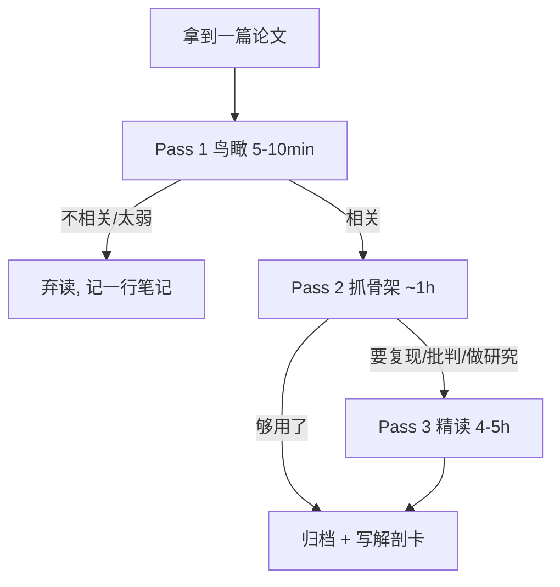

# L1 · 三遍读法 (The Three-Pass Approach)

> 40-min lecture · 来源: S. Keshav, *How to Read a Paper* (ACM SIGCOMM CCR, 2007), 经全球研究生院广泛采用。
> 本讲目标: 让你从「从第一页逐字读到最后一页」的**线性消费**, 切换到「3 次有结构、有时间盒、有明确产出的扫描」的**主动加工**。

---

## 0. 为什么「从头读到尾」是错的

先讲清楚一个反直觉的事实, 这是整套方法的地基:

> **一篇论文不是一本小说, 它是一个被压缩的证据链。作者把结论放在最显眼处, 把陷阱藏在最不显眼处。线性阅读恰好让你「先被结论说服, 再没力气检查陷阱」。**

新手 (本科式) 读法 vs 研究者读法:

```
本科式 (线性)                         研究者式 (三遍)
┌─────────────────────────┐          ┌──────────────────────────────┐
│ 第1页 ─► 第2页 ─► ...     │          │ Pass 1: 鸟瞰 (5-10 min)        │
│ 逐字读, 力气均匀分布       │          │   决定: 值不值得继续读?         │
│ 读到一半累了, 跳过实验      │          │ Pass 2: 抓骨架 (1 h)           │
│ 记住了 abstract 的口号     │          │   懂: 它做了什么, 证据是什么?    │
│ 没看出任何问题            │          │ Pass 3: 复现级精读 (4-5 h, 选读) │
└─────────────────────────┘          │   能: 自己重做一遍 / 挑出每个漏洞 │
                                      └──────────────────────────────┘
力气是平的 → 哪里都没读透              力气是分层的 → 每层有明确止损点
```

核心思想: **把「要不要投入更多时间」做成一个可以反复决策的漏斗。** 大多数论文你只该花 Pass 1; 少数花到 Pass 2; 极少数 (你要复现、要批判、要在它上面做研究的) 才进 Pass 3。



---

## 1. Pass 1 — 鸟瞰 (The Bird's-Eye View)

**时间盒: 5–10 分钟。目标: 回答「这篇值不值得我继续读?」, 而不是「它讲了什么」。**

只看这 5 处, 其余一律不看:

1. **标题 + 摘要 + 引言** — 它声称解决什么?
2. **章节/小节标题** (只读标题, 不读内容) — 它的逻辑骨架长什么样?
3. **数学部分扫一眼** — 判断它的理论基础是什么类型 (优化? 概率? 信息论?), 不求懂。
4. **结论** — 它声称证明了什么?
5. **参考文献** — 扫一遍, 哪些你已读过? (定位它在文献谱系里的坐标)

读完 Pass 1, 你必须能回答 **5C**:

| 5C | 含义 |
|---|---|
| **Category** 类别 | 这是什么类型的文章? (新方法 / 新分析 / 新系统 / 综述 / 立场) |
| **Context** 脉络 | 它接在哪些工作之后? 用什么理论基础? |
| **Correctness** 正确性 (初判) | 假设看起来站得住吗? |
| **Contributions** 贡献 | 它自称的主要贡献是什么? |
| **Clarity** 清晰度 | 写得好不好? (写得烂的论文常常想法也乱) |

> **止损规则**: Pass 1 之后, 如果它 ① 与你方向无关, 或 ② 你判断它太弱/不正确, 或 ③ 你背景不够、它写得也烂 —— **立刻弃读**, 只在你的 gap 库里记一行 (作者+一句话+为什么弃)。不要有「都打开了不读完可惜」的心理。**弃读是一种技能, 不是失败。**

一个有用的心算: 假设你一年要跟进某子领域。每年该领域 arXiv 有几百篇。如果每篇都 Pass 2, 你会淹死。**Pass 1 是你的过滤器, 它的吞吐量决定你能 cover 多大的领域。**

---

## 2. Pass 2 — 抓骨架 (Grasp the Content)

**时间盒: ~1 小时。目标: 懂「它做了什么、证据是什么」, 但暂不验证每个细节的正确性。**

动作:
- **认真看图和表。** 尤其是主结果表和方法示意图。一篇好论文, 它的核心故事应该能从图表里读出来。看坐标轴、看误差棒 (error bar) 有没有、看对比的是谁。
- **标出没读过的参考文献。** 它们是你接下来该补的背景 (喂给 9.1 知识管理 / 9.2 文献图谱)。
- **读正文, 但跳过证明细节和公式推导。** 抓「用了什么 + 为什么用」, 不抓「怎么推出来的」。

> **术语先交代 (本专题会反复交代, 因为你说过容易忘前文定义):**
> - **baseline (基线)**: 用来对比的、已有的、更简单或更标准的方法。一篇论文宣称「我更好」, 必须有 baseline 才有意义。**没有 baseline 的「更好」是空话。**
> - **ablation (消融实验)**: 把自己方法里的某个组件去掉, 看性能掉多少, 用来证明「这个组件确实有用、不是摆设」。
> 这两个词后面每一讲都会用到, 现在先刻进脑子。

读完 Pass 2, 你必须能做到: **合上论文, 向同门用几句话复述「它解决什么问题、用什么方法、关键证据是哪张图/表」。** 复述不出来 = Pass 2 没完成。

可能的结局:
- **懂了, 够用了** → 归档, 写解剖卡 (见模板)。
- **懂了, 但我要复现/批判/在它上面做研究** → 进 Pass 3。
- **没懂** → 三种原因: ① 主题对你太新 (先去补背景); ② 论文写得烂 (大概率); ③ 你太累了 (改天再读)。诚实判断是哪种。

---

## 3. Pass 3 — 复现级精读 (Virtual Re-implementation)

**时间盒: 4–5 小时 (新手), 资深 ~1 小时。目标: 能在脑子里 (或真的) 把它重做一遍; 挑出每一个隐藏假设和每一个漏洞。**

核心动作只有一句话: **假装论文不存在, 你自己来做这件事 —— 你会怎么做? 然后对比作者怎么做。**

- 你和作者每一步分歧的地方, 就是: ① 你没想到的巧思 (学习点), 或 ② 作者没说清/可能站不住的地方 (**攻击点 → 这是 L2 的主战场, 也是 gap 的金矿**)。
- 重建每一条假设。论文里没明说但默默依赖的前提, 往往是最大的 gap。
- 列出: 你认同的; 你存疑的; 你想做的后续实验。

这一遍结束, 你对这篇论文的掌握应该**超过大多数审稿人** —— 因为审稿人通常只做到 Pass 2 的深度。

```
Pass 3 的产出 = 三张清单
┌───────────────┬───────────────┬───────────────────┐
│ ✅ 认同/学到的  │ ❓ 存疑/可攻击的 │ 🔬 我想做的后续实验  │
│ (写进笔记)     │ (→ L2 攻击清单) │ (→ L3 gap / L4 idea) │
└───────────────┴───────────────┴───────────────────┘
```

---

## 4. 三遍的产出物 (闭环到模板)

| Pass | 时间盒 | 必答 | 落到哪 |
|---|---|---|---|
| 1 鸟瞰 | 5–10 min | 5C + 弃/留 | gap 库一行 或 进 Pass 2 |
| 2 抓骨架 | ~1 h | 能向同门复述 | `templates/paper-note-card.md` 上半部 |
| 3 精读 | 4–5 h (选读) | 三张清单 | 解剖卡下半部 + gap 卡 + idea 卡 |

**一个铁律: 每一遍都要有文字产出。** 读完没留下任何字, 等于没读 —— 一周后你只会记得 abstract 的口号, 那正是作者最希望你记住、也最不该全信的东西。

---

## 5. 常见误区 (新手必踩, 提前点破)

1. **「我要全懂才算读完」** → 错。Pass 1 的目标就是「不全懂也能决策」。允许自己留白。
2. **「公式太难, 我跳过整篇」** → 错。Pass 2 本来就跳公式推导; 抓骨架不需要懂推导。
3. **「读得越慢越认真」** → 错。慢而无结构 = 力气平摊 = 哪里都没读透。结构 > 时长。
4. **「被 abstract 说服就够了」** → 这正是最危险的。abstract 是作者的广告, 不是证据。证据在表格和附录。
5. **「读完就关掉」** → 没写产出 = 没读。

---

## 6. 本讲小结 + 通往 L2

- 读论文是一个**漏斗 + 决策**过程, 不是线性消费。
- 三遍各有时间盒、各有必答、各有产出, 每遍后都能止损。
- Pass 3 里那张「❓ 存疑/可攻击的」清单, 是你下一步的弹药。

> **下一讲 L2「攻击式阅读」**: 我们把这张「存疑清单」系统化 —— 教你戴上「想拒掉这篇论文的审稿人」的眼镜, 用一张 10 问清单, 把模糊的「我觉得哪里怪怪的」变成精确的「它在这一点上站不住」。

**动手**: 现在打开 `notebooks/N1-dissect-a-paper.ipynb`, 选一篇你已复现过的论文 (如 R1 或 DPO), 真的跑一遍 Pass 1 + Pass 2, 把解剖卡上半部填满。
