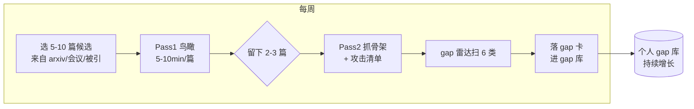

# L5 · 从读到研究的 SOP (From Reading to a Research Pipeline)

> 40-min lecture · 目标: 把前四讲的零件 (三遍读法 / 攻击清单 / gap 雷达 / idea 五法 / 三筛) 装成一条**每周能运转的流水线**, 让「找问题」从灵感事件变成可重复的习惯。
> 一句话: **研究品味不是天赋, 是一套坚持运转一年的流程的副产品。**

---

## 0. 为什么需要「流程」, 而不是「等灵感」

新手对「找题目」最大的误解: 以为它是某天洗澡时灵光一闪。
真相: 资深研究者的 idea, 是一条**持续运转的流水线**的产出 —— 持续读、持续记 gap、持续把 gap 翻 idea、持续筛。idea 多到要排队, 而不是憋出来一个。

```
灵感模型 (新手, 会枯竭)            流水线模型 (研究者, 会复利)
   读 → 等 → 偶然冒一个 idea         读(稳定输入) → gap库(持续积累)
        → 卡住 → 焦虑                  → 月度收敛 → idea库(排队)
                                      → 选高优先级动手 → 复利增长
```

复利在哪: 你读的每篇论文都往 gap 库里沉淀一点; gap 库越大, 越容易看出**跨论文的模式**(「这三篇都假设了 X, 但都没人验证 X 破裂会怎样」)—— 而跨论文的模式, 正是大 idea 的来源。

---

## 1. 周流水线 (Weekly Loop)

一个可执行的每周节奏 (按你实际时间缩放):



每周固定动作:
1. **输入**: 选 5–10 篇候选 (来源见 §3)。
2. **过滤**: 全部 Pass 1, 只留 2–3 篇有价值的进 Pass 2。
3. **加工**: 留下的做 Pass 2 + 10 问攻击 + 6 类 gap 雷达。
4. **沉淀**: 每个 gap 落一张卡进 gap 库 (`templates/gap-record-card.md`)。
5. **(每月一次) 收敛**: 回看本月 gap 库, 用 idea 五法翻成 idea, 过三筛, 排进 idea pipeline。

> 关键纪律: **输入要稳定 (每周都读), 不要三天打鱼。** 复利只奖励持续。每周 2–3 篇 Pass 2, 一年就是 ~120 篇深读 + 一个几百条的 gap 库 —— 这个体量足以支撑你看出领域级的模式。

---

## 2. 月度收敛 + 导师对接

每月把 gap 库里积累的洞收敛一次:

```
本月 gap 库 (20-40 张卡)
   │  按 Priority = Importance×Tractability/Cost 排序
   ▼
Top 5 gap ──► 用 idea 五法各翻 1-2 个 idea ──► 三筛
   │
   ▼
2-3 张通过三筛的 idea 卡
   │
   ▼
带去和导师 / 同门讨论 (这是 9.9 research-life 的内容)
   │  导师的作用: 帮你判断 novelty(筛1) 和 significance(筛3)
   ▼
选 1 个动手, 跑最小验证实验 (一周出第一个信号)
```

> 给博0 的关键提醒: **导师是你筛 1(novelty) 和筛 3(significance) 最强的传感器。** 你看不全的「这做过没有」「这重不重要」, 资深的导师一句话就能判断。所以「带着 2-3 张已经过了你自己三筛的 idea 卡去找导师」, 远胜过「老师我没 idea 怎么办」。**带选择题去, 别带问答题去。**

---

## 3. 稳定输入从哪来 (喂给周流水线)

| 来源 | 怎么用 | 衔接专题 |
|---|---|---|
| arXiv 每日/每周 (cs.CL, cs.LG) | 订阅 + 标题过滤, 只 Pass 1 标题命中的 | 9.1 知识管理 |
| 顶会 accepted list (ACL/EMNLP/NeurIPS/ICLR) | 每年 proceedings 扫一遍标题 | 9.2 文献图谱 |
| 你在读论文的**被引**和**相似论文** | Semantic Scholar / Connected Papers 顺藤摸瓜 | 9.2 + `src/citation_graph.py` |
| 你自己的 48 个复现 | 每个都当「待审稿论文」自审找 gap | **N2 notebook** |
| 社区 (实验室 reading group / X / alphaXiv) | 别人的批判是现成的 gap | 9.9 research-life |

> 注意最后两行: 你不缺输入。**光是把你已有的 48 个工程复现逐个用 6 类 gap 雷达扫一遍, 就能产出几十个 gap、好几个可做的 idea。** 这是你相对其他博0 的独特起跑优势 —— 别人要从零找料, 你有 48 个现成的、你亲手做过因而最懂其弱点的「半成品论文」。

---

## 4. 给你的 90 天上手计划 (博0 → 入学初期)

把这个专题落到你真实的时间线上 (你说马上入学):

```
第 1-2 周  · 把工具立起来 (9.1 知识管理雏形): Zotero + gap 库 markdown 文件
           · 本专题 L1-L5 通读 + N1 (解剖一篇你复现过的论文)
第 3-6 周  · 周流水线试运转: 每周 Pass2 2-3 篇你 PhD 子方向的近 2 年论文
           · 同时跑 N2: 把 reasoning-r1 / dpo-family 当待审稿论文, 攒第一批 gap 卡
第 7-10 周 · 第一次月度收敛: 产出 3-5 张过三筛的 idea 卡
           · 带去和(准)导师聊一次, 用导师校准 novelty/significance
第 11-13周 · 选 1 个 Tractability高/Cost低 的 idea, 跑最小验证实验, 出第一个信号点
           · 不论成败, 你已经完整跑过一遍「读→找洞→翻idea→筛→做」的研究循环
```

> 这个计划的设计哲学: **第一个目标不是发顶会, 是「完整跑通一次研究循环」。** 先证明你能从读论文一路走到产出一个实验结果, 这个闭环一旦在你身上跑通, 后面只是放大和提速。

---

## 5. 整个专题回顾 (一张图收口)

```
          L1 三遍读法          L2 攻击式阅读
        (有结构地读)    →    (带着零假设挑毛病)
               │                   │
               ▼                   ▼
          论文解剖卡  ──────►  10个攻击点
                                   │
                                   ▼
                          L3 gap 雷达 (6类扫描)
                                   │
                                   ▼  Priority 排序
                              gap 记录卡
                                   │
                                   ▼
                          L4 idea 五法 + 三筛
                                   │
                                   ▼
                               idea 卡
                                   │
                                   ▼
                    L5 周流水线 + 月收敛 + 导师对接
                                   │
                                   ▼
                          选 1 个 → 最小验证实验
                                   │
                                   ▼
                      (接 9.4 实验设计 / 9.7 写作)
```

- L1–L2: 把论文读透、挑出毛病。
- L3–L4: 把毛病系统化成 gap, 再翻成可证伪的 idea。
- L5: 把上面变成每周运转、会复利的流水线, 并对接导师。

> **下一站**: 你手里现在有了 idea。**它怎么变成一个严谨的实验?** —— 那是 9.4 `experiment-design` (可证伪假设→最小实验→baseline→消融→方差)。**它怎么写成能过审稿的论文?** —— 那是 9.7 `paper-writing-submission` (复用你已有的 `how_to_write_a_paper`)。Module 9 的生命周期就这样一环扣一环往下走。

**动手**: 完成 N1 + N2; 然后用 `src/make_cards.py` 起一个属于你自己的、空白的 gap 库, 从今天开始往里填。
