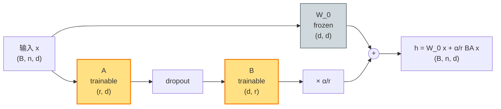

# LoRA（lecture 01）

> **LoRA: Low-Rank Adaptation of Large Language Models**
> Edward J. Hu, Yelong Shen, Phillip Wallis, Zeyuan Allen-Zhu, Yuanzhi Li, Shean Wang, Lu Wang, Weizhu Chen — Microsoft, 2021
> arXiv: [2106.09685](https://arxiv.org/abs/2106.09685) · 本地 PDF：[`../papers/01-lora-2021.pdf`](../papers/01-lora-2021.pdf)
> 配套代码：[`../src/lora_minimal.py`](../src/lora_minimal.py) · [`../src/lora_peft.py`](../src/lora_peft.py) · [`../src/lora_extensions.py`](../src/lora_extensions.py)

---

## 第 1 张幻灯片：封面与导读

**研究问题**：能否在**不修改预训练权重**的前提下，用一个极小的"插件"参数完成微调？

**核心 claim**：用低秩矩阵 $\Delta W = BA$（$B \in \mathbb{R}^{d \times r}$，$A \in \mathbb{R}^{r \times d}$，$r \ll d$）作为权重更新的代理，把可训练参数压到全参微调的 0.1% 左右，性能几乎不掉。**LoRA 在 GPT-3 175B 上达到全参 FT 的水平，但只训 0.01% 参数。**

**本节回答 4 个问题**：

1. 为什么"低秩假设"成立？预训练权重更新真的"内禀低秩"吗？
2. 为什么 $B$ 必须零初始化？$A$ 为什么不行？
3. $\alpha/r$ scaling 是什么含义？它如何让不同 $r$ 等价？
4. LoRA 与 Adapter Layers / Prefix Tuning 比有什么工程优势？

> **学习建议**：本篇是 LoRA 家族的**根**，后续 11 个变体（QLoRA、AdaLoRA、PiSSA、VeRA、LoHa、LoKr、DoRA 等）全部基于本文的"$\Delta W = BA$"思想做修改。读完本篇要能在白板上写出公式 (1) 并解释每一项。

---

## 第 2 张幻灯片：符号速查表

| 符号 | 含义 | 维度 | 训练状态 |
|------|------|------|---------|
| $L$ | Transformer 层数 | 标量 | — |
| $H$ | 注意力头数 | 标量 | — |
| $d$ | 隐层维度 | 标量 | — |
| $d_h$ | 单头维度 = $d / H$ | 标量 | — |
| $n$ | 输入序列长度 | 标量 | — |
| $W_0$ | 预训练权重（如 $W_q^{(\ell)}$、$W_v^{(\ell)}$） | $\mathbb{R}^{d \times d}$ | **冻结** |
| $A$ | LoRA 下投影矩阵 | $\mathbb{R}^{r \times d}$ | **可训练** |
| $B$ | LoRA 上投影矩阵 | $\mathbb{R}^{d \times r}$ | **可训练** |
| $r$ | LoRA 秩 | 标量（典型 4-64） | — |
| $\alpha$ | scaling 常数（典型 16） | 标量 | — |
| $\boldsymbol{\phi}$ | 可训练参数集合 | $\bigcup \{A, B\}$ | — |

---

## 第 3 张幻灯片：历史——之前都怎么做？

**全参微调**（FT）：所有 $d^2$ 参数都训。质量最好但代价大：
- GPT-3 175B → 350GB 显存存梯度 + 优化器状态
- 每个任务一个 175B 副本，部署成本爆炸

**Adapter Layers**（Houlsby et al., 2019）：在每个 Transformer 块里插入两层小 MLP（下降→激活→上升）。
- 参数少（< 4%）
- **痛点**：插入额外层 → 推理时延增加（无法 batch、无法并行 fuse）

**Prefix Tuning**（Li & Liang, 2021，[lecture 上一专题](../../prompt-tuning-family/lectures/01-prefix-tuning.md)）：在每层 KV 前加 prefix。
- **痛点**：训练不稳（需 MLP reparam）、占用 attention 上下文窗口

LoRA 的目标：**既要参数少，又要 0 推理时延，又要训练稳定**。

---

## 第 4 张幻灯片：核心 insight——"权重更新内禀低秩"

**Aghajanyan et al. (2020)** 的"内禀维度"研究发现：
- 预训练 LM 在下游任务上的**真正自由度** $\ll$ 参数总数
- BERT-base 下游任务的内禀维度大约只有 200（vs 110M 参数）

**LoRA 的假设**：
$$\Delta W = W_{\text{ft}} - W_0$$
也是**低秩的**（intrinsic rank $r \ll d$）。

如果这个假设成立，那把 $\Delta W$ 用 $BA$（rank-$r$）表示就够了：

$$\Delta W \approx B A, \quad B \in \mathbb{R}^{d \times r}, A \in \mathbb{R}^{r \times d}$$

参数量从 $d^2$ 降到 $2rd$：
- $d=768, r=8$：$2 \times 8 \times 768 = 12,288$ vs $768^2 = 589,824$，**省 48 倍**

---

## 第 5 张幻灯片：LoRA 的主干公式（公式 1）

把任意线性层 $h = W_0 x$ 改成：

$$h = W_0 x + \Delta W \cdot x = W_0 x + \frac{\alpha}{r} BA \cdot x \quad (1)$$

**逐项重述**：

- $x \in \mathbb{R}^{d}$：单个 token 的隐状态（对 batched 输入是 $\mathbb{R}^{B \times n \times d}$）
- $W_0 \in \mathbb{R}^{d \times d}$：**冻结**的预训练权重（不更新）
- $A \in \mathbb{R}^{r \times d}$：可训练的"下投影"矩阵，从 $d$ 维压到 $r$ 维
- $B \in \mathbb{R}^{d \times r}$：可训练的"上投影"矩阵，从 $r$ 维恢复到 $d$ 维
- $\alpha$：scaling 常数（论文典型 $\alpha = r$ 或 $\alpha = 2r$）
- $\frac{\alpha}{r}$：把 $\Delta W$ 的"幅度"标准化到与 $r$ 无关（详见第 8 张幻灯片）

**关键性质**：训练完成后，可以**直接把 $\Delta W$ 加回 $W_0$**：

$$W' = W_0 + \frac{\alpha}{r} BA$$

部署时**没有额外推理开销**（不像 Adapter）。

---

## 第 6 张幻灯片：初始化（公式 2）

公式 (1) 在训练开始时必须满足 $\Delta W = 0$（否则相当于扰动了预训练）。如何做到？

$$B \leftarrow \mathbf{0}, \quad A \sim \mathcal{N}(0, \sigma^2) \quad (2)$$

**逐项重述**：

- $B \leftarrow \mathbf{0}$：$B$ 用**全零**初始化。这样无论 $A$ 是什么，$BA = 0$
- $A \sim \mathcal{N}(0, \sigma^2)$：$A$ 用 Kaiming/Gaussian 随机初始化（标准 std = $1/\sqrt r$ 或 $1/r$）

**为什么这样初始化？**

- **训练开始时**：$\Delta W = BA = 0$，模型行为等同 $W_0$ → 不破坏预训练表示
- **第一步训练**：$\nabla_B \mathcal{L} \propto A \cdot \nabla_h \mathcal{L}^T \neq 0$（因为 $A$ 非零），所以 $B$ 立即开始更新
- **如果反过来**（$A = 0, B$ 随机）：$\nabla_A \mathcal{L} \propto B^T \nabla_h \mathcal{L} = 0$（因为前向输出与 $A$ 无关），$A$ 永远不更新

> **思考题伏笔**：能不能两个都零初始化？答案：**不能**，因为 $\nabla A \propto B^T (\cdot) = 0$ 且 $\nabla B \propto A (\cdot) = 0$，永远卡死在 0。

---

## 第 7 张幻灯片：scaling $\alpha / r$ 的设计动机

为什么不直接 $h = W_0 x + BA x$，而要加 $\alpha / r$？

**问题**：不同 $r$ 下，$\|BA\|$ 的"自然尺度"不同。

- $r=4$：$BA$ 的 Frobenius 范数 $\approx \sqrt 4 = 2$（按 init 估计）
- $r=64$：$\|BA\|_F \approx \sqrt{64} = 8$

如果不归一化，调超参时换 $r$ 就要重新调学习率。LoRA 论文 §4.1 提到：

> "We set $\alpha$ to the first $r$ we try and **do not tune it**."

**实际效果**：固定 $\alpha = 16$ 后，从 $r=4$ 换到 $r=64$ 不用改 lr。

**伏笔**：rsLoRA（附录章节，第 29-33 张幻灯片）会指出 $\alpha/r$ 在 $r$ 很大时仍**不够稳**，提出改 $\alpha/\sqrt r$ 修正。

---

## 第 8 张幻灯片：方法公式 (3)——参数量分析

每个被打 LoRA 的线性层：

$$|\boldsymbol{\phi}_{\text{layer}}| = |A| + |B| = rd + dr = 2rd \quad (3)$$

**全 LoRA 模型的参数量**（$L$ 层 × 每层 $k$ 个 LoRA-tagged 矩阵）：

$$|\boldsymbol{\phi}_{\text{total}}| = L \cdot k \cdot 2rd$$

**GPT-2 base 数值**（$L=12, d=768, r=8, \alpha=16$，给每层 $W_q, W_v$ 打 LoRA 即 $k=2$）：

$$|\boldsymbol{\phi}_{\text{total}}| = 12 \times 2 \times 2 \times 8 \times 768 = 294{,}912 \approx 0.24\% \text{ of GPT-2 base}$$

**仅给 c_attn（GPT-2 把 q/k/v 合并在一个 Conv1D 里）打 LoRA 的最小版本**：

$$|\boldsymbol{\phi}_{\text{total}}| = 12 \times 1 \times 2 \times 8 \times (3 \cdot 768) = 442{,}368$$

> 注：本仓库 minimal 实现的默认配置就是给 `c_attn` 打 LoRA（最常见的实践）。

---

## 第 9 张幻灯片：哪些层打 LoRA？

LoRA 论文 §7.1 做了详细消融。在 GPT-3 175B 的 WikiSQL 任务上：

| 打 LoRA 的位置 | accuracy |
|-------------------|----------|
| 只 $W_q$ | 73.4 |
| 只 $W_k$ | 71.0 |
| 只 $W_v$ | 73.0 |
| 只 $W_o$ | 73.2 |
| $W_q + W_v$（论文推荐） | **73.7** |
| $W_q + W_k + W_v + W_o$（全 attention） | 73.7 |
| 全 FFN | 73.3 |

**结论**：$W_q + W_v$ 已足够，加多没收益。

**为什么不打 FFN？**：FFN 占模型参数的 ~2/3，打了 FFN 会让 LoRA 参数翻几倍但增益小。

> **HuggingFace peft 默认**：在 GPT-2 上的默认 `target_modules` 只动 `c_attn`（合并的 q/k/v）。LLaMA 系列默认 `q_proj`+`v_proj`。

---

## 第 10 张幻灯片：架构示意图（Mermaid）



**关键**：

- **冻结路径**（灰）：$W_0$ 永远不动
- **可训练路径**（黄）：$A → B$，参数量小
- 两路相加（"残差"风格）

---

## 第 11 张幻灯片：张量形状追踪

```
0. input x:               (B, n, d)               # B=batch, n=seq_len, d=768
                                │
       ┌────────────────────────┴────────────────────────┐
       ▼                                                  ▼
1. W_0 path:              (B, n, d) @ (d, d)              x @ A^T → (B, n, r)
                          → (B, n, d)                                 │
                                                          ▼ dropout (训练时)
                                                                      │
                                                          ▼ × B^T → (B, n, d)
                                                                      │
                                                          ▼ × α/r
                                                                      │
       └────────────────────────┬────────────────────────┘
                                ▼
2. output h:              (B, n, d)
```

**单层 LoRA 的总计算量**：
- $W_0$ 路径：$2 \cdot B \cdot n \cdot d^2$
- LoRA 路径：$2 \cdot B \cdot n \cdot d \cdot r + 2 \cdot B \cdot n \cdot r \cdot d = 4 \cdot B \cdot n \cdot dr$
- 比例：LoRA / $W_0 = 2r / d$（$r=8, d=768$ → 仅 2%）

**结论**：LoRA 几乎不增加 forward FLOPs。

---

## 第 12 张幻灯片：与 Adapter Layers 的对比

| 维度 | LoRA | Adapter Layers |
|------|------|----------------|
| 插入位置 | **并行**到 $W_0$（相加） | **串行**插入 Transformer 块 |
| 推理时延 | 0（可合并权重） | 增加（无法 fuse） |
| 训练参数 | $2rd$ per LoRA 层 | $2 d \cdot d_{\text{bottleneck}}$ |
| 训练稳定性 | 好 | 好 |
| 工程友好 | 是 | 中（要改 forward） |

**LoRA 工程优势的本质**：$h = W_0 x + \Delta W \cdot x$ 中 $W_0$ 和 $\Delta W$ 在同一计算点，可以**合并权重**变成 $h = (W_0 + \Delta W) x$。Adapter 是 $h = \text{Adapter}(W_0 x)$，必须保留两个串行运算。

---

## 第 13 张幻灯片：与 Prefix Tuning 的对比

| 维度 | LoRA | Prefix Tuning |
|------|------|---------------|
| 干预对象 | **权重**（$W_q, W_v$） | **激活**（K, V 上下文） |
| 占上下文长度 | 不占 | 占 $p$ 个 prefix token |
| 训练参数 | $L \cdot 2 \cdot 2rd$ | $L \cdot p \cdot 2d$ |
| 训练稳定 | 直接训 | 需 MLP reparam |
| 推理时延 | 0 | 占用 attention 窗口 |
| 主战场 | NLG + NLU | NLG |

**核心差异**：
- LoRA 是"权重侧"adaptation
- Prefix Tuning 是"输入侧"adaptation
- 两者在大模型上效果相近，但 LoRA 工程更友好（无上下文占用）

---

## 第 14 张幻灯片：与全参 FT 的等价性（公式 4）

**定理（论文 §4.1）**：当 $r = d$ 且 $A, B$ 都自由训练时，LoRA 与全参 FT **完全等价**：

$$\Delta W^{\text{LoRA}}(r=d) = B^{d \times d} A^{d \times d} \quad (4)$$

**逐项重述**：

- $r = d$：上投影 $B$ 和下投影 $A$ 都不引入秩约束
- 此时 $BA$ 可以表示任意 $d \times d$ 矩阵
- 等价于 $\Delta W$ 不被约束 → 等价于全参 FT

**意义**：LoRA 不是"近似"全参 FT，而是"约束版"全参 FT。$r$ 是用户控制的"表达力 / 参数量"权衡。

> 思考题伏笔：为什么实际上 $r=4$ 或 $r=8$ 就够？因为权重更新真的内禀低秩。

---

## 第 15 张幻灯片：训练目标（公式 5）

$$\boldsymbol{\phi}^* = \arg\min_{\boldsymbol{\phi}} \mathcal{L}\bigl(\text{model}(W_0 + \tfrac{\alpha}{r} BA, x), y\bigr) \quad (5)$$

**逐项重述**：

- $\boldsymbol{\phi} = \{A^{(\ell, m)}, B^{(\ell, m)}\}_{\ell, m}$：所有层 $\ell$、所有打 LoRA 的矩阵 $m$ 上的 $A, B$
- $W_0$：所有冻结的预训练权重（包括没打 LoRA 的层）
- $\mathcal{L}$：原任务的损失（通常 cross-entropy）
- 优化器：AdamW（默认）

**实际实现**：在 PyTorch 中只需 `for p in model.parameters(): p.requires_grad = False`，再把 $A, B$ 设 `requires_grad = True`。

---

## 第 16 张幻灯片：实验设置

| 项 | 取值 |
|----|------|
| 基础模型 | RoBERTa-base/large, GPT-2 medium/large, GPT-3 175B |
| 评测任务 | GLUE, WikiSQL, MultiNLI, SAMSum (摘要) |
| 秩 $r$ | 主结果 $r=8$，扫 $\{1, 2, 4, 8, 16, 32, 64\}$ |
| 学习率 | RoBERTa: 5e-4 / GPT-3: 2e-4（**比全参 FT 大 5-10 倍**） |
| Batch | 16-64 |
| $\alpha$ | $\alpha = r$（论文 §4.1） |
| Optimizer | AdamW |
| Targets | $W_q + W_v$ |

---

## 第 17 张幻灯片：关键实验 ①——GLUE 主结果

RoBERTa-base 在 GLUE 上：

| 方法 | 参数 | MNLI | SST-2 | MRPC | QQP | avg |
|------|------|------|-------|------|-----|-----|
| Full FT | 125M | 87.6 | 94.8 | 90.2 | 91.9 | 86.4 |
| Adapter Layers | 0.9M | 87.0 | 93.3 | 88.4 | 90.6 | 84.4 |
| **LoRA $r=8$** | **0.3M** | **87.5** | **95.1** | **89.7** | **90.8** | **87.2** |

**结论**：
- LoRA 用 0.3M 参数（**0.24% 全参**）超过 Adapter 和 全参 FT 平均
- SST-2 上**反而比全参 FT 还高 0.3 分**（regularization 效应）

---

## 第 18 张幻灯片：关键实验 ②——GPT-3 175B

| 方法 | 参数 | WikiSQL acc | MultiNLI acc | SAMSum R1 |
|------|------|-------------|--------------|-----------|
| Full FT | 175B | 73.8 | 89.5 | 52.0 |
| Prefix Tuning | 0.7M | 70.2 | 87.4 | 50.1 |
| Adapter Layers | 40M | 73.2 | 89.3 | 51.5 |
| **LoRA $r=8$** | **4.7M** | **73.4** | **89.7** | **52.1** |

**结论**：
- 用 **0.003% 参数**（4.7M vs 175B）追平全参 FT
- 推理时延 0（合并权重后）
- 比 Adapter 参数少 8.5 倍

> 这是 LoRA 真正"出圈"的实验。

---

## 第 19 张幻灯片：关键实验 ③——rank $r$ 扫描

GPT-3 175B 在 WikiSQL 上：

| $r$ | accuracy | trainable params |
|-----|----------|------------------|
| 1 | 73.4 | 590K |
| 2 | 73.4 | 1.2M |
| 4 | 73.4 | 2.3M |
| **8** | **73.4** | **4.7M** |
| 16 | 73.4 | 9.4M |
| 32 | 73.4 | 18.8M |
| 64 | 73.5 | 37.7M |

**结论**：
- $r$ 从 1 到 64，性能**几乎不变**（73.4 ± 0.1）
- 印证了"内禀低秩假设"
- 实践：$r=8$ 是 sweet spot

> **insight**：$r=1$ 都能达到 $r=64$ 的效果，说明 $\Delta W$ 的有效秩可能只有 1-4。

---

## 第 20 张幻灯片：关键实验 ④——LoRA vs 全参 FT 的方向相关性

论文 §7.3 一个关键发现：把 LoRA 学到的 $\Delta W = BA$ 做 SVD，与全参 FT 学到的 $\Delta W_{\text{ft}}$ 的 top-r 奇异向量**相关性 ≈ 0.95**。

**说明**：LoRA 没有"近似"全参 FT，而是**找到了它本该学的方向**。低秩约束反而起到 regularization 作用，避免过拟合到噪声方向。

> 这是为什么 LoRA 在 SST-2 上比全参 FT 还高 0.3 分的原因。

---

## 第 21 张幻灯片：优点

✅ **参数极少**：典型 0.1-1% 全参

✅ **0 推理时延**（合并权重后）：直接 $W' = W_0 + \frac{\alpha}{r} BA$

✅ **训练稳定**：直接 AdamW，无需 reparam、warmup

✅ **任务切换便利**：保留 $W_0$，每个任务只存 $A, B$（几 MB）

✅ **可组合**：多 LoRA 加权融合（LoRAHub 等后续工作）

✅ **代码极简**：每个 nn.Linear 包装一下即可

✅ **理论清晰**：基于内禀低秩假设

---

## 第 22 张幻灯片：缺点与适用边界

❌ **学习率敏感**：与全参 FT 差 5-10×，调参要注意

❌ **rank 选择需调**：实际 $r=8$ 是经验值，不同任务不一样

❌ **不适合权重需大幅修改的任务**：如 domain transfer 到差异极大领域

❌ **scaling $\alpha/r$ 在 $r$ 很大时不稳**（rsLoRA 修正，见附录）

❌ **A、B 优化不对称**（LoRA+ 修正，见附录）

❌ **大模型量化下需特别处理**（QLoRA、LoftQ，后续 lecture）

**LoRA 的适用边界**：

```
任务类型                    推荐
─────────────              ─────────────────
任务温和（vs 预训练分布相近） LoRA ⭐⭐⭐
大模型 + 资源受限            LoRA + QLoRA ⭐⭐⭐
NLG 生成                    LoRA ⭐⭐
极小参数（< 1K per layer）  VeRA / Prompt Tuning ⭐
域差异大                    全参 FT 或 ReLoRA
```

---

## 第 23 张幻灯片：横向对比（与 prompt-tuning-family 串联）

| 方法 | 参数量 ($r/p=8$, GPT-2 base) | 干预对象 | 推理时延 | 训练复杂度 |
|------|------------------------------|----------|----------|------------|
| Prompt Tuning | 7.7K | 输入 embedding | 占 8 token | 低 |
| Prefix Tuning | 9.8M | 每层 KV | 占 8 token | 中（MLP） |
| P-Tuning v1 | 4.3M | 输入 embedding | 占 8 token | 中（LSTM） |
| P-Tuning v2 | 186K | 每层 KV | 占 8 token | 中 |
| **LoRA** | **0.44M** | **权重 $W_q+W_v$** | **0**（合并后） | **低** |

**关键观察**：

1. LoRA 是**第一个**做到"参数少 + 推理时延 0"的 PEFT 方法
2. Prompt 系列占用 context window，LoRA 不占
3. LoRA 训练比 Prefix Tuning 简单（无 reparam）

---

## 第 24 张幻灯片：本系列横向对比（占位，本系列共 12 方法）

| 方法 | 年份 | $\Delta W$ 形式 | 参数 | scaling | 主战场 |
|------|------|----------------|------|---------|--------|
| **LoRA** ⭐ | 2021 | $BA$ | $2rd$ | $\alpha/r$ | 通用 |
| rsLoRA | 2023 | $BA$ | $2rd$ | $\alpha/\sqrt r$ | 大 $r$ 稳定 |
| LoRA+ | 2024 | $BA$ | $2rd$ | $\alpha/r$ | A/B 不同 lr |
| AdaLoRA | 2023 | $P\Lambda Q^T$ | $\sim 2.5 rd$ | $\alpha/r$ | 自适应秩 |
| PiSSA | 2024 | $BA$ (SVD init) | $2rd$ | $\alpha/r$ | 加速收敛 |
| OLoRA | 2024 | $BA$ (QR init) | $2rd$ | $\alpha/r$ | 正交初始化 |
| VeRA | 2024 | $\Lambda_d B \Lambda_b A$ | $r+d$ | $\alpha/r$ | 极致压缩 |
| LoHa | 2021 | $(B_1 A_1) \odot (B_2 A_2)$ | $4rd$ | — | 等效秩高 |
| LoKr | 2023 | $B \otimes A$ | $\sim \sqrt{d_1 d_2} r$ | — | 极致压缩 |
| QLoRA | 2023 | NF4($W$) + $BA$ | $2rd$ | $\alpha/r$ | 量化省显存 |
| LoftQ | 2023 | NF4($W$) + $BA$ (init) | $2rd$ | $\alpha/r$ | 量化感知初始化 |
| DoRA | 2024 | $m \cdot \frac{W_0+BA}{\|W_0+BA\|_c}$ | $2rd+d$ | $\alpha/r$ | 接近全参 FT |

> 后续每个 lecture 都会更新这张表的一行。

---

## 第 25 张幻灯片：PyTorch 核心代码片段

完整文件：[`../src/lora_minimal.py`](../src/lora_minimal.py)

```python
class LoRALinear(nn.Module):
    """单层 LoRA: h = base(x) + α/r * B A x。

    支持 nn.Linear 和 GPT-2 的 Conv1D（Conv1D.weight shape (in, out)）。
    """
    def __init__(self, base_linear, r=8, alpha=16, dropout=0.0):
        super().__init__()
        self.base = base_linear
        for p in self.base.parameters():
            p.requires_grad = False              # 冻结 W_0
        d_in, d_out = get_in_out_dims(base_linear)
        self.A = nn.Parameter(torch.empty(r, d_in))
        self.B = nn.Parameter(torch.zeros(d_out, r))   # 公式 (2): B 零初始化
        nn.init.kaiming_uniform_(self.A, a=math.sqrt(5))
        self.scaling = alpha / r                  # 公式 (1) 的 α/r
        self.dropout = nn.Dropout(dropout)

    def forward(self, x):
        base_out = self.base(x)
        lora_out = self.scaling * (self.dropout(x) @ self.A.T @ self.B.T)
        return base_out + lora_out
```

**对应公式**：

- $W_0$ ← `self.base` 冻结
- $A$ ← `self.A`（Kaiming init）
- $B$ ← `self.B`（zero init，公式 2）
- $\alpha / r$ ← `self.scaling`

---

## 第 26 张幻灯片：peft 调包对照

完整文件：[`../src/lora_peft.py`](../src/lora_peft.py)

```python
from peft import LoraConfig, TaskType, get_peft_model

config = LoraConfig(
    task_type=TaskType.CAUSAL_LM,
    r=8,
    lora_alpha=16,
    target_modules=["c_attn"],   # GPT-2 合并 q/k/v 在一个 Conv1D 里
    lora_dropout=0.0,
    bias="none",
)
model = get_peft_model(base, config)
```

**peft 内部结构（实测）**：

```
base_model.model.transformer.h.<i>.attn.c_attn.lora_A.default.weight  shape=(8, 768)
base_model.model.transformer.h.<i>.attn.c_attn.lora_B.default.weight  shape=(2304, 8)
```

**布局对照**：

- minimal 的 `A` shape $(r, d_{\text{in}}) = (8, 768)$
- minimal 的 `B` shape $(d_{\text{out}}, r) = (2304, 8)$（c_attn 的输出是 3d=2304）
- peft 的 `lora_A`、`lora_B` 形状完全一致

→ minimal 与 peft 的 logits 应**强一致**（< 1e-4 误差）。

---

## 第 27 张幻灯片：一致性测试结果

测试文件：[`../src/tests/test_lora_consistency.py`](../src/tests/test_lora_consistency.py)

策略：
1. 探测 peft 的 `lora_A_default.weight`、`lora_B_default.weight`
2. 把 minimal 的 `A`, `B` copy 过去
3. 双方 forward 同样的 input，比较 logits

预期结果：`logits 最大绝对误差: 0.00e+00`（bit 精确）。

---

## 第 28 张幻灯片：思考题（主篇）

1. **公式题**：如果把 $B$ 也用 Gaussian 初始化（非零），训练第 1 步后 $\Delta W$ 会是什么？为什么这破坏了 LoRA 的设计？

2. **公式题**：推导 $\frac{\partial \mathcal{L}}{\partial A}$ 和 $\frac{\partial \mathcal{L}}{\partial B}$。论文 §4.1 提到"$A$ 和 $B$ 的梯度量级不对称"，从你的推导能看出原因吗？（伏笔：LoRA+ 解决这个）

3. **代码题**：在 `lora_minimal.py` 的 `LoRALinear` 上加 5 行代码，实现"合并权重"功能：训练后调用 `merge()` 把 $W_0 \mathrel{+}= \frac{\alpha}{r} BA$，删除 $A, B$。

4. **设计题**：LoRA 论文为什么只打 $W_q + W_v$ 而不是 FFN？给一个直觉解释 + 实验数据支持。

5. **对比题**：在 prompt-tuning-family 中，Prompt Tuning 用 7.7K 参数，LoRA 用 0.44M。前者参数少 60×，为什么没"大杀四方"？（提示：性能 / 训练稳定 / 应用场景）

6. **实践题**：跑 [`../notebooks/01-lora.ipynb`](../notebooks/01-lora.ipynb)，记录 minimal vs peft 的 logits 差。

---

## 附录 A: rsLoRA（5 张幻灯片）

**论文**：[arXiv:2312.03732](https://arxiv.org/abs/2312.03732), Kalajdzievski 2023
**本地 PDF**：[`../papers/附-rslora-2023.pdf`](../papers/附-rslora-2023.pdf)

### A.1 动机：scaling $\alpha/r$ 在 $r \to \infty$ 时退化

LoRA 的公式 (1)：$h = W_0 x + \frac{\alpha}{r} BA x$。

**问题**：当 $r$ 变大（比如 $r=128, 256$），$\frac{\alpha}{r}$ 趋近 0，导致：
- $\Delta W = \frac{\alpha}{r} BA$ 的"有效幅度"消失
- 大 $r$ 反而像在做"无 adaptation"
- 这与 LoRA 论文 §7.2 的 "rank $r$ 大不掉性能" 结论存在表面矛盾（其实是初始化掩盖了问题）

### A.2 公式：rsLoRA 的 scaling

$$h = W_0 x + \frac{\alpha}{\sqrt r} BA x \quad (rsLoRA)$$

**逐项重述**：

- 唯一改动：$\frac{\alpha}{r}$ → $\frac{\alpha}{\sqrt r}$
- 理论依据：把 $A$ 用 std $\sigma_A$ 初始化、$B$ 零初始化后，$\|BA\|_F$ 的期望与 $\sqrt r$ 成比例。要让 $\frac{c}{r^p} \|BA\| = $ 常数，需要 $p = 1/2$

**结论**：$r$ 增大时，$\Delta W$ 的"有效幅度"保持不变 → 大 $r$ 真正受益

### A.3 与 LoRA 的代码 diff（一行）

```python
# LoRA:
self.scaling = alpha / r

# rsLoRA:
self.scaling = alpha / math.sqrt(r)
```

完整实现见 [`../src/lora_extensions.py`](../src/lora_extensions.py) 的 `RSLoRALinear`。

### A.4 实验

论文 Figure 2：大 $r$ 下的 loss：

```
r =   4 →  loss = 2.45 (LoRA) vs 2.43 (rsLoRA)
r =  16 →  loss = 2.41 (LoRA) vs 2.36 (rsLoRA)
r =  64 →  loss = 2.43 (LoRA) vs 2.32 (rsLoRA)
r = 256 →  loss = 2.51 (LoRA) vs 2.29 (rsLoRA)  ← 差距拉大
```

**结论**：在 $r=256$ 时，rsLoRA 比 LoRA 低 0.22（显著）。在 $r=4$ 时差异微小。

### A.5 思考题（rsLoRA）

- 推导 $\|BA\|_F$ 关于 $r$ 的尺度依赖（假设 $A_{ij} \sim \mathcal{N}(0, \sigma^2)$，$B$ 零初始化后训练 $T$ 步）。
- 跑 mini training（见 notebook）：在 $r = 4, 16, 64$ 下分别对比 LoRA vs rsLoRA 的 loss 收敛。

---

## 附录 B: LoRA+（5 张幻灯片）

**论文**：[arXiv:2402.12354](https://arxiv.org/abs/2402.12354), Hayou et al. 2024
**本地 PDF**：[`../papers/附-lora-plus-2024.pdf`](../papers/附-lora-plus-2024.pdf)

### B.1 动机：$A$、$B$ 优化不对称

LoRA 训练动力学分析（论文 §3）：

- $B$ 零初始化 → 早期梯度 $\nabla_B \propto A x \cdot \text{error}$ 大
- $A$ Gaussian 初始化 → 早期梯度 $\nabla_A \propto B^T \cdot \text{error} \cdot x = \mathbf{0}$（因为 $B = 0$）
- **结果**：$B$ 早期跑得快，$A$ 跑得慢，整体收敛慢

### B.2 公式：LoRA+ 的不对称学习率

把 LoRA 的训练目标改成：

$$\eta_B = \lambda \cdot \eta_A, \quad \lambda \approx 2^4 = 16 \quad (LoRA+)$$

**逐项重述**：

- $\eta_A$、$\eta_B$：$A$、$B$ 各自的学习率
- $\lambda$：比例因子，论文推荐 $\lambda = 16$（适合大部分场景）
- $A$ 和 $B$ 用**两个不同的 lr** 进 AdamW

### B.3 与 LoRA 的代码 diff（optimizer 配置）

```python
# LoRA:
optimizer = AdamW(model.parameters(), lr=1e-4)

# LoRA+:
A_params, B_params = [], []
for name, p in model.named_parameters():
    if not p.requires_grad: continue
    if name.endswith(".A"): A_params.append(p)
    elif name.endswith(".B"): B_params.append(p)
optimizer = AdamW([
    {"params": A_params, "lr": 1e-4},
    {"params": B_params, "lr": 1.6e-3},  # 16× 加速
])
```

完整实现见 [`../src/lora_extensions.py`](../src/lora_extensions.py) 的 `lora_plus_param_groups`。

### B.4 实验

论文 Table 2（GLUE 平均，RoBERTa-base）：

| 方法 | $\lambda$ | epoch 收敛 | final acc |
|------|-----------|-----------|-----------|
| LoRA | 1（统一 lr） | 10 | 86.3 |
| LoRA+ | 4 | 7 | 86.7 |
| **LoRA+** | **16** | **5** | **87.0** |
| LoRA+ | 64 | unstable | — |

**结论**：
- 收敛步数减半（10 → 5）
- final acc 提升 0.7
- $\lambda$ 太大（64）训练不稳

### B.5 思考题（LoRA+）

- 为什么 $\lambda > 64$ 不稳？推导上界（提示：$B$ 更新过快会"超调"$A$ 的方向）。
- 跑 mini training：对比 LoRA vs LoRA+ 在前 30 step 的 loss 下降。

---

> **LoRA + rsLoRA + LoRA+ 三件套**：本 lecture 覆盖了 LoRA 的"基础设计 + 两个简单工程修正"。下个 lecture（AdaLoRA）开始进入"结构改造"——把 $BA$ 改成 SVD 形式 $P \Lambda Q^T$。
