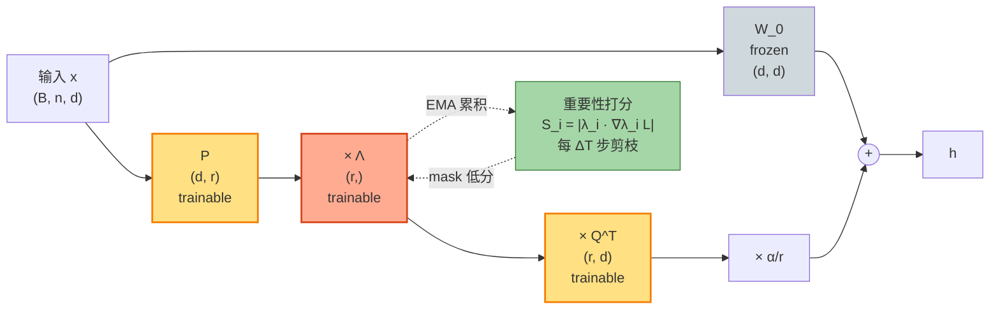

# AdaLoRA（lecture 02）

> **AdaLoRA: Adaptive Budget Allocation for Parameter-Efficient Fine-Tuning**
> Qingru Zhang, Minshuo Chen, Alexander Bukharin, Pengcheng He, Yu Cheng, Weizhu Chen, Tuo Zhao — Microsoft & Georgia Tech, 2023
> arXiv: [2303.10512](https://arxiv.org/abs/2303.10512) · 本地 PDF：[`../papers/02-adalora-2023.pdf`](../papers/02-adalora-2023.pdf)
> 配套代码：[`../src/adalora_minimal.py`](../src/adalora_minimal.py) · [`../src/adalora_peft.py`](../src/adalora_peft.py)

---

## 第 1 张幻灯片：封面与导读

**研究问题**：LoRA 给所有层一样的秩 $r$，但**不同层、不同矩阵的重要性不同**。能不能让模型**自适应**分配秩预算？

**核心 claim**：把 LoRA 的 $\Delta W = BA$ 重写成 SVD 形式 $\Delta W = P \Lambda Q^T$，其中 $\Lambda$ 是对角矩阵；训练时给每个 singular value 算"重要性打分"，定期剪掉打分低的 singular value。**AdaLoRA 在相同总参数预算下，性能比固定 r 的 LoRA 高 0.5~2 分**。

**本节回答 4 个问题**：

1. SVD 形式 $\Delta W = P \Lambda Q^T$ 与 LoRA 的 $\Delta W = BA$ 在数学上有什么关系？
2. "重要性打分" $S_i = |\Lambda_i \cdot \nabla_{\Lambda_i} \mathcal{L}|$ 的直觉是什么？
3. 正交正则化为什么必要？没有它会发生什么？
4. 与"先训大 $r$ 再 SVD 截断"的朴素方法有什么本质区别？

> **学习建议**：本篇引入"SVD 视角"——这是 LoRA 系列里 AdaLoRA、PiSSA、VeRA 三剑客的共同语言。读完要能在白板上推导 $\Delta W = BA \Leftrightarrow \Delta W = P \Lambda Q^T$。

---

## 第 2 张幻灯片：符号速查表

| 符号 | 含义 | 维度 | 训练状态 |
|------|------|------|---------|
| $W_0$ | 预训练权重 | $\mathbb{R}^{d \times d}$ | **冻结** |
| $P$ | "左奇异向量"矩阵 | $\mathbb{R}^{d \times r}$ | **可训练** |
| $\Lambda$ | "奇异值"对角矩阵 | $\mathbb{R}^{r}$（存对角元） | **可训练** |
| $Q^T$ | "右奇异向量"矩阵 | $\mathbb{R}^{r \times d}$ | **可训练** |
| $r_{\text{init}}$ | 初始秩（典型 12） | 标量 | — |
| $r_{\text{final}}$ | 剪枝后秩 | 标量（< $r_{\text{init}}$）| — |
| $S_i$ | 第 $i$ 个 singular 的重要性打分 | 标量 | — |
| $\gamma$ | 正交正则化系数 | 标量（0.5） | — |
| $\alpha$ | scaling 常数 | 标量 | — |

---

## 第 3 张幻灯片：动机——LoRA 的"均匀分秩"是不优的

LoRA 给所有 target 层都用同样的 $r=8$，但论文 §1 指出：

- 某些层对下游任务**至关重要**（如最后几层 attention）→ 需要更大 $r$
- 某些层**几乎不参与**（如早期 FFN）→ 给 $r=8$ 是浪费

**理想方案**：让模型**自己学**"哪一层重要、给多少秩"。

**朴素方案**：给所有层 $r=$ 大值（如 64），训练完用 SVD 截断到小秩 → 不行：
- 大 $r$ 训练慢
- 截断后没机会"再训练补偿"
- 剪掉的 singular value 是依据训练值而非梯度信息

**AdaLoRA 方案**：在**训练过程中**做"动态剪枝"，让重要性高的 $\Lambda_i$ 保留。

---

## 第 4 张幻灯片：核心 insight——SVD 形式 (公式 1)

把 LoRA 的低秩分解换一种写法：

$$\Delta W = P \Lambda Q^T \quad (1)$$

**逐项重述**：

- $P \in \mathbb{R}^{d \times r}$：可训练，对应"左奇异向量"
- $\Lambda = \mathrm{diag}(\lambda_1, \ldots, \lambda_r) \in \mathbb{R}^{r \times r}$：可训练，对应"奇异值"
- $Q^T \in \mathbb{R}^{r \times d}$：可训练，对应"右奇异向量"

**与 LoRA 的等价性**：
- LoRA: $\Delta W = BA$，其中 $B \in \mathbb{R}^{d \times r}, A \in \mathbb{R}^{r \times d}$
- AdaLoRA: $\Delta W = P \Lambda Q^T$
- 数学上完全等价：$BA = P \Lambda Q^T$ 当 $B = P \Lambda^{1/2}, A = \Lambda^{1/2} Q^T$（任意分配 $\Lambda$）
- **关键差异**：AdaLoRA **显式分离了 $\Lambda$**，方便对每个 singular value 独立操作（如剪枝、打分）

---

## 第 5 张幻灯片：正交正则化 (公式 2)

为了让 $P, Q$ 真的近似"奇异向量"（即正交），加正则项：

$$\mathcal{R}(P, Q) = \|P^T P - I\|_F^2 + \|Q^T Q - I\|_F^2 \quad (2)$$

**逐项重述**：

- $P^T P \in \mathbb{R}^{r \times r}$：列向量内积矩阵
- 若 $P$ 列正交，则 $P^T P = I$（单位阵）
- $\|\cdot\|_F^2$：Frobenius 范数平方，衡量"偏离正交"的程度
- 同理 $Q$

**完整训练 loss**：

$$\mathcal{L}_{\text{total}} = \mathcal{L}_{\text{task}} + \gamma \cdot \mathcal{R}(P, Q)$$

$\gamma$ 典型取 $0.5$。

**为什么必要？**
- 没有正交约束，$P, \Lambda, Q^T$ 不再对应真正的 SVD
- $\Lambda$ 的对角元失去"重要性"含义（可被 $P, Q$ 抵消）
- 剪枝时无法准确判断"哪个 singular 重要"

---

## 第 6 张幻灯片：重要性打分 (公式 3)

每个 singular value $\lambda_i$ 的重要性：

$$S_i = \left| \lambda_i \cdot \frac{\partial \mathcal{L}}{\partial \lambda_i} \right| \quad (3)$$

**逐项重述**：

- $\lambda_i$：第 $i$ 个 singular value 的当前数值
- $\frac{\partial \mathcal{L}}{\partial \lambda_i}$：loss 对它的梯度
- 乘积 = "如果 $\lambda_i$ 改变一点点，loss 会变多少"（一阶 Taylor 展开）
- 取绝对值：不区分正负方向

**为什么这是"重要性"？**

来自 pruning 文献（Molchanov et al. 2017）：一个参数被剪掉，loss 的扰动是 $|\theta \cdot \nabla \theta|$ 的一阶估计。$S_i$ 大 = 剪掉它 loss 上升多 = 重要。

**实际实现**：用 EMA 平滑：
$$\bar{S}_i^{(t)} = \beta \bar{S}_i^{(t-1)} + (1 - \beta) S_i^{(t)}$$
$\beta = 0.85$ 典型。

---

## 第 7 张幻灯片：剪枝调度 (公式 4)

每 $\Delta T$ 步（典型 100）做一次剪枝：

$$r^{(t+1)} = r_{\text{final}} + (r_{\text{init}} - r_{\text{final}}) \cdot \left(1 - \frac{t - t_{\text{warmup}}}{T - t_{\text{warmup}}}\right)^3 \quad (4)$$

**逐项重述**：

- $r^{(t)}$：第 $t$ 步的当前预算秩
- $r_{\text{init}}$：起始秩（典型 12）
- $r_{\text{final}}$：目标剪枝后秩（典型 4 ~ 8）
- $t_{\text{warmup}}$：warmup 步数（在此之前不剪枝）
- $T$：总训练步数
- $(\cdot)^3$：立方衰减，**前期慢剪、后期快剪**

**剪枝动作**：保留打分 top-$r^{(t)}$ 个 singular value，其余 $\lambda_i$ 置零（mask）。

**为什么立方衰减？**
- 前期：模型还在学，过早剪枝会丢有用信号
- 后期：重要性打分稳定，可以快速剪

---

## 第 8 张幻灯片：架构示意图（Mermaid）



**关键**：橙色 $\Lambda$ 是"被剪枝的目标"，绿色"重要性打分"是动态控制器。

---

## 第 9 张幻灯片：张量形状追踪

```
0. input x:           (B, n, d)               # d=768
                            │
       ┌────────────────────┴────────────────────┐
       ▼                                          ▼
1. W_0 path:          (B, n, d)                  x @ P → (B, n, r)        # r_init=12
                                                 ↓
                                                 × diag(Λ) → (B, n, r)    # element-wise
                                                 ↓
                                                 × Q^T → (B, n, d)
                                                 ↓
                                                 × α/r
       └────────────────────┬────────────────────┘
                            ▼
2. output:            (B, n, d)
```

**参数量**：

$$|\boldsymbol{\phi}_{\text{layer}}| = \underbrace{dr}_{P} + \underbrace{r}_{\Lambda} + \underbrace{rd}_{Q^T} = 2rd + r \approx 2rd$$

与 LoRA 相同（$\Lambda$ 的 $r$ 个参数可忽略）。

---

## 第 10 张幻灯片：训练算法（伪代码）

```python
for step in range(T):
    # 1. 前向 + 任务 loss
    L_task = forward_and_compute_loss(model, batch)
    
    # 2. 正交正则
    L_ortho = gamma * (||P^T P - I||² + ||Q^T Q - I||²)
    
    # 3. 反向
    (L_task + L_ortho).backward()
    
    # 4. 累积重要性 (EMA)
    for layer in adalora_layers:
        S_t = |Lambda * grad_Lambda|
        S_ema = beta * S_ema + (1 - beta) * S_t
    
    # 5. 优化器步
    optimizer.step()
    
    # 6. 周期性剪枝
    if step % delta_T == 0 and step > t_warmup:
        r_t = compute_budget(step)  # 公式 (4)
        for layer in adalora_layers:
            # 保留 top-r_t 个 S_ema 最大的 lambda
            mask = top_k_mask(layer.S_ema, k=r_t)
            layer.Lambda *= mask
```

---

## 第 11 张幻灯片：与 LoRA 的对比

| 维度 | AdaLoRA | LoRA |
|------|---------|------|
| 参数形式 | $P \Lambda Q^T$ | $BA$ |
| 秩 | **每层不同（动态）** | 每层固定 |
| 正交约束 | **有** | 无 |
| 重要性打分 | **有**（动态剪枝） | 无 |
| 推理时延 | 0（剪枝后合并） | 0（合并后） |
| 训练复杂度 | 中（要算正则、打分、调度） | 低 |
| 总参数（同总预算） | 灵活分配到重要层 | 均匀分布 |
| 学习率 | 5e-4（论文） | 1e-4 |

**核心 insight**：AdaLoRA = "LoRA + SVD 形式 + 动态剪枝"。SVD 形式只是工程便利，真正贡献是**自适应分秩**。

---

## 第 12 张幻灯片：与"先训大 r 再 SVD 截断"对比

**朴素方法**：训 $r=64$ 的 LoRA，结束后做 SVD 取前 $r=8$。

**问题**：
1. **训练慢**：$r=64$ 比 $r=8$ 慢 8 倍
2. **截断丢信息**：训练值大的 $\Lambda_i$ 不一定就是"对 loss 影响大"
3. **没机会补偿**：截断后参数定型，无法再训
4. **统一分秩**：所有层都剪到 $r=8$，仍然是均匀分布

**AdaLoRA 的优势**：

| 维度 | AdaLoRA | 大 r + SVD 截断 |
|------|---------|----------------|
| 训练时间 | $T$ | $\approx 8T$（大 $r$ 慢） |
| 剪枝信号 | 梯度（一阶 Taylor） | 训练值（静态） |
| 剪枝后再训 | 是（剩余 step 继续） | 否 |
| 分秩 | **每层不同** | 每层相同 |

---

## 第 13 张幻灯片：实验设置

| 项 | 取值 |
|----|------|
| 基础模型 | DeBERTa-v3-base/large, BART-large |
| 评测任务 | GLUE、SQuAD、XSum、CNN/DailyMail |
| 初始秩 $r_{\text{init}}$ | 12 |
| 目标秩 $r_{\text{final}}$ | 2 ~ 8 (取决于参数预算) |
| Warmup 步数 | 训练 10% |
| 剪枝周期 $\Delta T$ | 100 步 |
| EMA $\beta$ | 0.85 |
| 正交正则 $\gamma$ | 0.1 ~ 0.5 |
| Learning rate | 5e-4 (**比 LoRA 大 5×**) |
| Target | DeBERTa: q, k, v, intermediate, output |

---

## 第 14 张幻灯片：关键实验 ①——GLUE 主结果

DeBERTa-v3-base 在 GLUE 上（相同 0.3% 总参数预算）：

| 方法 | 参数 | MNLI | SST-2 | CoLA | QQP | avg |
|------|------|------|-------|------|-----|-----|
| Full FT | 184M | 89.9 | 95.6 | 69.2 | 92.4 | 86.8 |
| LoRA $r=8$ | 0.6M | 90.3 | 94.9 | 68.7 | 91.9 | 86.4 |
| **AdaLoRA** | **0.6M** | **90.7** | **95.9** | **70.0** | **92.0** | **87.3** |

**结论**：
- 与 LoRA 同参数量，AdaLoRA 在 SST-2、MNLI 上**超过全参 FT**
- 平均高 0.9 分

---

## 第 15 张幻灯片：关键实验 ②——参数预算 scan

在 SQuAD v1.1 上扫不同参数预算：

| 总参数 (%) | LoRA F1 | AdaLoRA F1 | 差距 |
|-----------|---------|------------|------|
| 0.05% | 88.7 | **89.5** | +0.8 |
| 0.10% | 89.8 | **90.3** | +0.5 |
| 0.50% | 90.4 | **90.9** | +0.5 |
| 1.00% | 90.6 | **91.0** | +0.4 |

**结论**：参数预算**越紧，AdaLoRA 越有优势**（0.05% 下差 0.8）。

> 这印证了"自适应分秩"的价值：固定预算下灵活分配 > 均匀分配。

---

## 第 16 张幻灯片：关键实验 ③——重要性可视化

论文 Figure 3：在 SQuAD 上训练结束时，每层每矩阵的"保留秩"分布（图示意）：

```
层 idx →   1    3    5    7    9   11
W_q        4    6    8   10   12   12     ↑ 越深越多
W_k        3    4    5    7    9   10
W_v        5    7    8   10   12   12     ↑ 与 W_q 相近
W_out      2    3    5    7    8   10
W_inter    1    2    3    5    6    7     ← FFN 最少
```

**结论**：
- 越**深**的层秩越大（最后几层最重要）
- **attention 比 FFN 重要**（$W_q, W_v$ 高，$W_{\text{inter}}$ 低）
- 与人类直觉一致，但 LoRA 给它们一样的 $r$ 是浪费

---

## 第 17 张幻灯片：优点

✅ **自适应分秩**：相同预算下性能高 0.5-2 分

✅ **可解释**：能可视化"哪些层重要"，有助理解模型

✅ **训练效率**：起始 $r_{\text{init}}=12$ 不大，比朴素方法快

✅ **推理时延 0**（剪枝后可合并）

✅ **被 peft 直接支持**：`AdaLoraConfig`

---

## 第 18 张幻灯片：缺点与适用边界

❌ **训练超参多**：$r_{\text{init}}, r_{\text{final}}, \Delta T, t_{\text{warmup}}, \beta, \gamma$ 都要调

❌ **正交正则增加 forward 开销**：每步要算 $\|P^T P - I\|_F^2$

❌ **重要性打分的近似性**：一阶 Taylor 不总是准

❌ **不适合 streaming 数据**：剪枝调度依赖知道总 step 数

**AdaLoRA 的适用边界**：

```
场景                            推荐？
─────────────────              ─────────
参数预算紧 (< 0.5%)             AdaLoRA ⭐⭐⭐
固定下游任务 + 充分预算          LoRA ⭐⭐
多任务 / streaming             LoRA / VeRA
极小参数 (< 1K per layer)      VeRA / Prompt Tuning
```

---

## 第 19 张幻灯片：横向对比（更新本系列表）

| 方法 | 年份 | $\Delta W$ 形式 | 参数量 | scaling | 主战场 |
|------|------|----------------|------|---------|--------|
| LoRA | 2021 | $BA$ | $2rd$ | $\alpha/r$ | 通用 |
| rsLoRA | 2023 | $BA$ | $2rd$ | $\alpha/\sqrt r$ | 大 $r$ 稳定 |
| LoRA+ | 2024 | $BA$ | $2rd$ | $\alpha/r$ | A/B 不同 lr |
| **AdaLoRA** ⭐ | 2023 | $P \Lambda Q^T$ + 重要性打分 | $2rd + r$ | $\alpha/r$ | **自适应分秩** |
| PiSSA | 2024 | $BA$ (SVD init) | $2rd$ | $\alpha/r$ | 加速收敛 |
| OLoRA | 2024 | $BA$ (QR init) | $2rd$ | $\alpha/r$ | 正交初始化 |
| VeRA | 2024 | $\Lambda_d B \Lambda_b A$ | $r+d$ | $\alpha/r$ | 极致压缩 |
| ... | ... | ... | ... | ... | ... |

---

## 第 20 张幻灯片：PyTorch 核心代码片段

完整文件：[`../src/adalora_minimal.py`](../src/adalora_minimal.py)

```python
class AdaLoRALinear(nn.Module):
    """单层 AdaLoRA: h = base(x) + α/r * P diag(Λ) Q^T x"""
    
    def __init__(self, base_linear, r_init=12, alpha=16, ortho_lambda=0.1):
        super().__init__()
        self.base = base_linear
        for p in self.base.parameters():
            p.requires_grad = False
        
        d_in, d_out = get_in_out_dims(base_linear)
        # 公式 (1): SVD 形式 P, Λ, Q^T
        self.P = nn.Parameter(torch.empty(d_out, r_init))
        self.Lambda = nn.Parameter(torch.zeros(r_init))       # 零初始化（同 LoRA B）
        self.Q = nn.Parameter(torch.empty(d_in, r_init))       # 存 Q（不是 Q^T）方便正则
        nn.init.kaiming_uniform_(self.P, a=math.sqrt(5))
        nn.init.kaiming_uniform_(self.Q, a=math.sqrt(5))
        
        # 重要性打分（EMA buffer）
        self.register_buffer('S_ema', torch.zeros(r_init))
        # 剪枝 mask（初始全 1）
        self.register_buffer('mask', torch.ones(r_init))
        
        self.scaling = alpha / r_init
        self.ortho_lambda = ortho_lambda
    
    def forward(self, x):
        base_out = self.base(x)
        # x @ Q → (..., r), × Λ → (..., r), @ P^T → (..., d)
        masked_lambda = self.Lambda * self.mask
        lora_out = (x @ self.Q) * masked_lambda @ self.P.T
        return base_out + self.scaling * lora_out
    
    def ortho_loss(self) -> torch.Tensor:
        """公式 (2) 的正交正则项"""
        I_r = torch.eye(self.P.shape[1], device=self.P.device)
        return ((self.P.T @ self.P - I_r) ** 2).sum() + ((self.Q.T @ self.Q - I_r) ** 2).sum()
    
    def update_importance(self, beta: float = 0.85):
        """公式 (3) 重要性打分 EMA 更新"""
        if self.Lambda.grad is not None:
            S = (self.Lambda * self.Lambda.grad).abs().detach()
            self.S_ema.mul_(beta).add_((1 - beta) * S)
    
    def prune_to(self, r_target: int):
        """保留 S_ema top-r_target 个，其余 mask 置 0"""
        topk = torch.topk(self.S_ema, r_target).indices
        new_mask = torch.zeros_like(self.mask)
        new_mask[topk] = 1.0
        self.mask.copy_(new_mask)
```

**对应公式**：

- `self.P, self.Lambda, self.Q` ← 公式 (1)
- `ortho_loss()` ← 公式 (2)
- `update_importance()` ← 公式 (3)
- `prune_to()` 调用时按公式 (4) 决定 $r_{\text{target}}$

---

## 第 21 张幻灯片：peft 调包对照

完整文件：[`../src/adalora_peft.py`](../src/adalora_peft.py)

```python
from peft import AdaLoraConfig, get_peft_model

config = AdaLoraConfig(
    task_type=TaskType.CAUSAL_LM,
    init_r=12,                      # r_init
    target_r=8,                     # r_final
    beta1=0.85,                     # 重要性 EMA
    beta2=0.85,                     # uncertainty EMA (peft 内部用)
    tinit=50,                       # warmup
    tfinal=1500,                    # 总 step
    deltaT=10,                      # 剪枝周期
    lora_alpha=32,
    target_modules=["c_attn"],
    orth_reg_weight=0.5,
)
model = get_peft_model(base, config)
```

**peft 内部参数（实测）**：

```
base_model.model.transformer.h.<i>.attn.c_attn.lora_A.default  shape=(r, d_in)
base_model.model.transformer.h.<i>.attn.c_attn.lora_B.default  shape=(d_out, r)
base_model.model.transformer.h.<i>.attn.c_attn.lora_E.default  shape=(r, 1)  # Λ
```

peft 的命名 (A, E, B) 对应论文的 (Q^T, Λ, P)。

---

## 第 22 张幻灯片：一致性测试设计

**测试策略**（弱一致）：

1. 创建相同 r_init 的 minimal 和 peft 模型
2. 把 minimal 的 P, Λ, Q 复制到 peft 对应位置（注意 peft 用 lora_A=Q^T、lora_E=Λ、lora_B=P）
3. 双方 forward 同样 input
4. 比较 logits（容差 1e-3，弱一致）

**为什么是弱一致**：
- 主要在前向算 lora_out 时，乘法顺序不同 → 浮点 round-off 不同
- peft 内部可能有额外 scaling
- 但量级应一致

预期：`logits 相对误差 < 1e-2`

---

## 第 23 张幻灯片：mini training demo（notebook 第 5 cell）

跑 ~30 step，看 loss 和重要性打分演化：

```python
# 初始所有 S_ema = 0
# 训练 5 step 后，重要性开始累积
# 训练 15 step 后，做第一次剪枝（保留 top-8 of 12）
# 训练 30 step 后，loss 应稳定下降
```

预期可视化：
- 上图：loss 曲线（应单调下降）
- 中图：12 个 $\lambda$ 的重要性 heatmap（颜色随训练 step 变化）
- 下图：mask 矩阵（哪 4 个 $\lambda$ 被剪掉）

---

## 第 24 张幻灯片：思考题

1. **公式题**：证明 $\Delta W = BA$ 与 $\Delta W = P \Lambda Q^T$ 在 $r$ 相同下表达力等价。给出一个 $B, A \mapsto P, \Lambda, Q$ 的具体变换。

2. **公式题**：推导 $\frac{\partial \mathcal{L}}{\partial \Lambda_i}$。它与 LoRA 的 $\frac{\partial \mathcal{L}}{\partial B}$ 有什么关系？

3. **代码题**：在 `adalora_minimal.py` 的 `prune_to` 之后再加一行，重新初始化被剪掉的 $\lambda_i$ 为非零（"重生策略"），观察 loss 影响。

4. **设计题**：正交正则 $\gamma = 0$ 会发生什么？训一个 mini training 看看 $P^T P$ 偏离 $I$ 多远。

5. **对比题**：AdaLoRA 与"训大 $r$ 再 SVD 截断"在数学上有什么本质差异？（提示：剪枝信号来源）

6. **实践题**：在 [`../notebooks/02-adalora.ipynb`](../notebooks/02-adalora.ipynb) 中改 `delta_T=5` 和 `delta_T=50`，观察剪枝频率对收敛的影响。

---

> **下一篇**：[03 PiSSA](03-pissa.md) 用预训练 $W_0$ 的 SVD 主成分**初始化** $A, B$，与 AdaLoRA 的"动态分秩"形成对比——**静态 vs 动态利用 SVD**。
