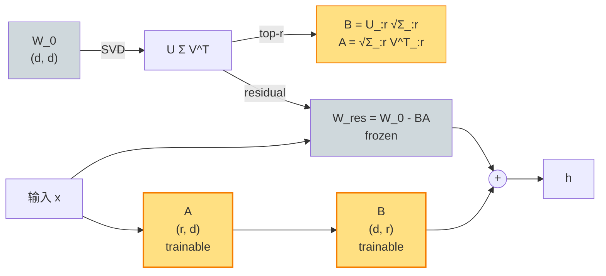

# PiSSA（lecture 03）

> **PiSSA: Principal Singular Values and Singular Vectors Adaptation of Large Language Models**
> Fanxu Meng, Zhaohui Wang, Muhan Zhang — Peking University, 2024
> arXiv: [2404.02948](https://arxiv.org/abs/2404.02948) · 本地 PDF：[`../papers/03-pissa-2024.pdf`](../papers/03-pissa-2024.pdf)
> 配套代码：[`../src/pissa_minimal.py`](../src/pissa_minimal.py) · [`../src/pissa_peft.py`](../src/pissa_peft.py) · [`../src/pissa_olora_extension.py`](../src/pissa_olora_extension.py)

---

## 第 1 张幻灯片：封面与导读

**研究问题**：LoRA 把 $A, B$ 用 Kaiming/零初始化——这是不是浪费了 $W_0$ 已经"知道"的方向？

**核心 claim**：把预训练 $W_0$ 做 SVD，**用 top-$r$ 主奇异向量初始化 $A, B$**，残差 $W_0 - BA$ 作为冻结基础。**收敛速度比 LoRA 快 1.5-2×，最终性能高 0.3-1 分**。

**本节回答 4 个问题**：

1. PiSSA 与 LoRA 在数学上的差异是什么？（都是 $h = W' x + BA x$ 但 $W'$ 不同）
2. "用 top-r 主成分"为什么是好的初始化？
3. PiSSA 和 AdaLoRA 都是 SVD 视角，区别在哪？
4. OLoRA（用 QR 分解）和 PiSSA（SVD）哪个更稳？

> **学习建议**：本篇是 LoRA 的"启动加速器"。理解了 PiSSA 你才知道 AdaLoRA（动态）和 VeRA（共享）是从另两个角度"利用 SVD 视角"。

---

## 第 2 张幻灯片：符号速查表

| 符号 | 含义 | 维度 |
|------|------|------|
| $W_0$ | 预训练权重 | $\mathbb{R}^{d \times d}$ |
| $U \Sigma V^T$ | $W_0$ 的奇异值分解 | $U \in \mathbb{R}^{d \times d}, \Sigma \in \mathbb{R}^{d \times d}, V \in \mathbb{R}^{d \times d}$ |
| $U_{:r}$ | $U$ 的前 $r$ 列 | $\mathbb{R}^{d \times r}$ |
| $\Sigma_{:r}$ | $\Sigma$ 的前 $r$ 对角元 | $\mathbb{R}^{r}$ |
| $V_{:r}^T$ | $V^T$ 的前 $r$ 行 | $\mathbb{R}^{r \times d}$ |
| $B$ | LoRA 上投影 | $\mathbb{R}^{d \times r}$ |
| $A$ | LoRA 下投影 | $\mathbb{R}^{r \times d}$ |
| $W_{\text{res}}$ | 残差权重 = $W_0 - BA$ | $\mathbb{R}^{d \times d}$ |

---

## 第 3 张幻灯片：动机——LoRA 的零起点是浪费

LoRA 的设计：

$$h = W_0 x + \frac{\alpha}{r} BA x, \quad B \leftarrow 0, A \sim \mathcal{N}$$

**前几步训练**：
- $B = 0$ → $\Delta W = 0$ → 梯度只能从 $\nabla_B$ 来（$\nabla_A \propto B^T = 0$）
- $B$ 从零慢慢"摸索"哪些方向重要
- 早期收敛慢

**关键观察**：$W_0$ 本身已经编码了"任务相关的方向"。**主奇异向量** $U_{:r}$ 就是"$W_0$ 最强的 $r$ 个方向"。

> 如果直接把 $A, B$ 初始化到这些方向，是不是能跳过"摸索"阶段？

---

## 第 4 张幻灯片：PiSSA 的核心思想（公式 1）

对 $W_0$ 做 SVD：

$$W_0 = U \Sigma V^T \quad (1)$$

**逐项重述**：

- $U \in \mathbb{R}^{d \times d}$：左奇异向量矩阵（列正交）
- $\Sigma = \mathrm{diag}(\sigma_1 \geq \sigma_2 \geq \ldots \geq \sigma_d \geq 0)$：奇异值（递减）
- $V^T \in \mathbb{R}^{d \times d}$：右奇异向量转置（行正交）

**top-r 主成分**：

$$W_0^{\text{top}r} = U_{:r} \Sigma_{:r} V_{:r}^T$$

这是 $W_0$ 的"最佳 rank-$r$ 近似"（Eckart-Young-Mirsky 定理）。

---

## 第 5 张幻灯片：PiSSA 的初始化（公式 2）

把 $W_0^{\text{top}r}$ 分配到 $A, B$：

$$B = U_{:r} \sqrt{\Sigma_{:r}}, \quad A = \sqrt{\Sigma_{:r}} V_{:r}^T \quad (2)$$

**逐项重述**：

- $\sqrt{\Sigma_{:r}}$：对每个奇异值取平方根 $\sqrt{\sigma_i}$
- $B = U_{:r} \cdot \mathrm{diag}(\sqrt{\sigma_1}, \ldots, \sqrt{\sigma_r})$：shape $(d, r)$，"半数"分配给 $B$
- $A = \mathrm{diag}(\sqrt{\sigma_1}, \ldots, \sqrt{\sigma_r}) \cdot V_{:r}^T$：shape $(r, d)$，另"半数"分配给 $A$

**验证**：

$$BA = U_{:r} \sqrt{\Sigma_{:r}} \sqrt{\Sigma_{:r}} V_{:r}^T = U_{:r} \Sigma_{:r} V_{:r}^T = W_0^{\text{top}r}$$

✓ 等于 top-r 主成分。

**为什么各分一半 sqrt**？让 $A, B$ 的"量级"匹配（$\sqrt{\sigma}$），梯度更稳。

---

## 第 6 张幻灯片：残差权重（公式 3）

PiSSA 不能让 $h = W_0 x + \frac{\alpha}{r} BA x$（这样初始 $h$ 就被 $\Delta$ 改变了），所以：

$$W_{\text{res}} = W_0 - BA = W_0 - W_0^{\text{top}r} \quad (3)$$

**逐项重述**：

- $W_0^{\text{top}r}$ = $W_0$ 的 top-r 主成分（前 $r$ 个奇异值的贡献）
- $W_{\text{res}}$ = $W_0$ 的"低秩残差"（来自第 $r+1, r+2, \ldots, d$ 个奇异值）
- $W_{\text{res}}$ 作为**冻结的基础权重**

**最终 forward**：

$$h = W_{\text{res}} x + \frac{\alpha}{r} BA x \quad (4)$$

**与 LoRA 的差异**：

- LoRA: 基础 = $W_0$，LoRA 路径 = $\Delta$（从 0 开始）
- **PiSSA**: 基础 = $W_{\text{res}} = W_0 - W_0^{\text{top}r}$，LoRA 路径**起点是** $W_0^{\text{top}r}$

**等价检查**：训练开始时 $W_{\text{res}} + \frac{\alpha}{r} BA = W_0$ 吗？

注意 $\alpha/r$ 系数。论文取 $\alpha = r$，所以 $\alpha/r = 1$，验证：
$$W_{\text{res}} + 1 \cdot BA = (W_0 - BA) + BA = W_0$$

✓ 初始时模型行为不变。

---

## 第 7 张幻灯片：与 LoRA 的训练动力学差异

**LoRA 第 1 步**：

- 起点：$\Delta W = 0$
- 梯度：$\nabla_B \propto A x \cdot \text{error}$（$A$ Gaussian 非零，所以非零）
- 第 1 步后 $\Delta W$ 还很小（$B$ 刚开始走）

**PiSSA 第 1 步**：

- 起点：$\Delta W = W_0^{\text{top}r}$（top-r 主成分，**已经是"任务相关"方向**）
- 梯度：$\nabla_B$ 和 $\nabla_A$ 都非零（双方都已初始化为非零）
- 第 1 步即可在主成分**周围**做微调

**直观比喻**：

- LoRA 像"从零开始找路"
- PiSSA 像"从一条已知公路出发"

---

## 第 8 张幻灯片：架构示意图（Mermaid）



**关键**：

- 初始化是**一次性预处理**（不影响训练 forward）
- 训练时 $W_{\text{res}}$ 冻结，只更新 $A, B$
- 训练完可以合并：$W' = W_{\text{res}} + \frac{\alpha}{r} BA$

---

## 第 9 张幻灯片：张量形状追踪 + 参数量

```
预处理（一次）:
  W_0 (d, d)
    ↓ SVD
  U (d, d), Σ (d,), V^T (d, d)
    ↓ slice
  U_:r (d, r), Σ_:r (r,), V^T_:r (r, d)
    ↓ split sqrt
  B = U_:r diag(√Σ_:r)   shape (d, r)
  A = diag(√Σ_:r) V^T_:r  shape (r, d)
    ↓
  W_res = W_0 - B @ A   shape (d, d)

训练时 forward:
  x (B, n, d) → W_res → (B, n, d)
  x (B, n, d) → A → (B, n, r) → B → (B, n, d) → × α/r
  两路相加
```

**参数量**：$|B| + |A| = 2rd$（与 LoRA 完全相同）。

**额外存储**：$W_{\text{res}}$ shape $(d, d)$，但**不可训练**，是冻结的"修改后 base"。

---

## 第 10 张幻灯片：PiSSA 的"快"在哪里？

**实验观察**（论文 Figure 4）：

- 同样 $r=8$，同样优化器、batch size
- PiSSA 在 step 100 达到 LoRA 在 step 200 才达到的 loss
- 最终 loss PiSSA 比 LoRA 低 1-2%

**理论解释**：

1. **起点更近**：PiSSA 起点 $\Delta W = W_0^{\text{top}r}$ 与"目标 $\Delta W$"距离近（因为下游任务 $\Delta W$ 也是低秩的，而 $W_0^{\text{top}r}$ 是 $W_0$ 自身的低秩近似——下游任务通常不偏离 $W_0$ 太远）
2. **梯度信号更强**：$A, B$ 都非零 → 双方都立即接收梯度
3. **避免 saddle point**：LoRA 零起点是 loss landscape 的 saddle，PiSSA 跳过

---

## 第 11 张幻灯片：实验设置

| 项 | 取值 |
|----|------|
| 基础模型 | LLaMA-2-7B, Mistral-7B, Gemma-7B |
| 评测任务 | GSM8K (数学), HumanEval (代码), MT-Bench |
| 秩 $r$ | 主结果 $r=128$，扫 $\{16, 32, 64, 128, 256\}$ |
| $\alpha$ | $\alpha = r$（与 LoRA 论文一致） |
| Optimizer | AdamW, lr 1e-5 ~ 5e-5 |
| Targets | 所有 attention + FFN（$W_q, W_k, W_v, W_o, W_{up}, W_{down}, W_{gate}$） |

---

## 第 12 张幻灯片：关键实验 ①——GSM8K 数学

LLaMA-2-7B，相同 $r=128$：

| 方法 | GSM8K acc | 训练 step 到 SOTA |
|------|-----------|-------------------|
| LoRA | 41.3 | 800 |
| **PiSSA** | **44.1** | **400** |
| Full FT | 44.5 | — |

**结论**：
- PiSSA 收敛速度 **2× LoRA**
- 最终 acc 高 2.8 分
- 几乎追平全参 FT（44.5）

---

## 第 13 张幻灯片：关键实验 ②——QPiSSA = PiSSA + 量化

PiSSA 与 QLoRA 正交，可以**结合**：

| 方法 | LLaMA-2-7B GSM8K | 显存（4-bit）|
|------|------------------|---------------|
| LoRA (fp16) | 41.3 | 14 GB |
| QLoRA | 39.1 | **5 GB** |
| PiSSA | 44.1 | 14 GB |
| **QPiSSA** | **42.7** | **5 GB** |

**结论**：QPiSSA 在 4-bit 量化下接近 fp16 PiSSA 的性能（差 1.4 分），但只需 5 GB 显存。

---

## 第 14 张幻灯片：附录 OLoRA 的核心思想

OLoRA（[arXiv:2406.01775](https://arxiv.org/abs/2406.01775)）用 **QR 分解**代替 SVD：

$$W_0 = Q R \quad (\text{OLoRA 1})$$

**逐项重述**：

- $Q \in \mathbb{R}^{d \times d}$：列正交矩阵（$Q^T Q = I$）
- $R \in \mathbb{R}^{d \times d}$：上三角矩阵

**OLoRA 初始化**：

$$B = Q_{:r}, \quad A = R_{r:, :} \quad (\text{OLoRA 2})$$

其中 $R_{r:, :}$ 是 $R$ 的**前 r 行**（注意 paper 里也有用底部 $r$ 行的变体）。

**与 PiSSA 的对比**：

| 维度 | PiSSA | OLoRA |
|------|-------|-------|
| 分解 | SVD ($W = U\Sigma V^T$) | QR ($W = QR$) |
| 计算复杂度 | $O(d^3)$ | $O(d^2 r)$（用 Householder） |
| $B$ 正交性 | $U_{:r}$ 列正交 | $Q_{:r}$ 列正交 |
| 信息利用 | 主奇异方向（最强） | 上三角"早期"方向 |
| 初始化稳定性 | 高 | 中（依赖 $R$ 的条件数） |

---

## 第 15 张幻灯片：OLoRA 的优缺点

✅ **OLoRA 优点**：

- QR 比 SVD 快（特别是大 $d$）
- 不需要保留全部奇异值（只算前 $r$ 列）
- $Q$ 完全正交（数值好）

❌ **OLoRA 缺点**：

- $R$ 的上三角结构 → 信息分布不均匀（行权重递减）
- 没有"重要性"概念（不像 SVD 用 $\sigma_i$ 排序）
- 实验上比 PiSSA 略差（论文 OLoRA 仅比 LoRA 高 0.5，PiSSA 高 2-3）

**何时用 OLoRA**：

- 需要快速初始化（大模型 + 多任务）
- 看重 $A, B$ 的正交性

---

## 第 16 张幻灯片：横向对比（更新）

| 方法 | 年份 | 初始化 | $W$ 基础 | 参数 | scaling |
|------|------|--------|---------|------|---------|
| LoRA | 2021 | $B=0, A \sim \mathcal{N}$ | $W_0$ 冻结 | $2rd$ | $\alpha/r$ |
| rsLoRA | 2023 | 同 LoRA | 同 LoRA | $2rd$ | $\alpha/\sqrt r$ |
| LoRA+ | 2024 | 同 LoRA | 同 LoRA | $2rd$ | $\alpha/r$ |
| AdaLoRA | 2023 | $P \Lambda Q^T$ Gaussian | $W_0$ 冻结 | $2rd + r$ | $\alpha/r$ |
| **PiSSA** ⭐ | 2024 | **SVD top-r** | **$W_{\text{res}} = W_0 - W_0^{\text{top}r}$** | $2rd$ | $\alpha/r$ |
| **OLoRA** | 2024 | **QR top-r** | **$W_{\text{res}} = W_0 - QR$** | $2rd$ | $\alpha/r$ |
| VeRA | 2024 | $\Lambda_d B \Lambda_b A$ | $W_0$ 冻结 | $r+d$ | $\alpha/r$ |
| ... | ... | ... | ... | ... | ... |

**核心 insight**：PiSSA / OLoRA 是"换了初始化的 LoRA"。其它（参数量、forward）完全一样。

---

## 第 17 张幻灯片：与 AdaLoRA 的对比

PiSSA 和 AdaLoRA 都用了"SVD 视角"，但用法不同：

| 维度 | PiSSA | AdaLoRA |
|------|-------|---------|
| SVD 对象 | $W_0$（预训练权重） | $\Delta W$（增量） |
| SVD 时机 | **训练前**（一次） | **训练中**（隐式） |
| SVD 作用 | 提供初始化 | 提供参数化形式 |
| 训练中 SVD | ❌ | ✅（每步打分 $\lambda$） |
| 剪枝 | ❌ | ✅ |
| 实现复杂度 | 低 | 中 |

**直觉**：

- PiSSA = "用 $W_0$ 的 SVD 给 $\Delta W$ **一个好起点**"
- AdaLoRA = "把 $\Delta W$ 本身写成 SVD 形式，**动态调整每个奇异值**"

> **可结合**：PiSSA + AdaLoRA = "用 $W_0$ 主成分初始化 + 动态分秩"。论文未做但是合理。

---

## 第 18 张幻灯片：优点

✅ **加速收敛**：2× 比 LoRA 快

✅ **最终性能更高**：1-3 分（具体看任务）

✅ **实现简单**：在 LoRA 上加一个"SVD 初始化"步骤

✅ **与量化兼容**：QPiSSA 在 QLoRA 上仍有效

✅ **被 peft 直接支持**：`LoraConfig(init_lora_weights="pissa")`

---

## 第 19 张幻灯片：缺点与适用边界

❌ **SVD 计算开销**：$O(d^3)$，大模型上要分块/截断 SVD

❌ **依赖 $W_0$ 的 SVD 结构**：如果 $W_0$ 奇异值分布太均匀（rank-deficient 或 condition number 大），top-r 不显著

❌ **需修改 $W_0$**：$W_{\text{res}} = W_0 - BA$ 把原始权重"打散"了 → 加载时要预处理

**适用边界**：

```
场景                            推荐？
─────────────                  ─────────
预训练 base 训练充分（LLaMA-2 等） PiSSA ⭐⭐⭐
快速达到 SOTA                    PiSSA ⭐⭐
domain 差异大                    LoRA + 大 r
多任务                           LoRA（避免每任务重算 SVD）
极小参数                         VeRA / Prompt Tuning
```

---

## 第 20 张幻灯片：PyTorch 核心代码

完整文件：[`../src/pissa_minimal.py`](../src/pissa_minimal.py)

```python
class PiSSALinear(nn.Module):
    """h = W_res(x) + α/r BA(x)，其中 W_res = W_0 - U_:r Σ_:r V^T_:r"""
    
    def __init__(self, base_linear, r=8, alpha=None):
        super().__init__()
        d_in, d_out = get_in_out_dims(base_linear)
        if alpha is None:
            alpha = r  # PiSSA 默认 α = r
        
        # 取得 W_0
        if is_conv1d(base_linear):
            W = base_linear.weight.data.T.clone()  # (out, in)
        else:
            W = base_linear.weight.data.clone()    # (out, in)
        
        # 公式 (1)(2): SVD 主成分
        U, S, Vt = torch.linalg.svd(W.float(), full_matrices=False)
        sqrt_S = S[:r].sqrt()
        B_init = U[:, :r] * sqrt_S                  # shape (d_out, r)
        A_init = sqrt_S.unsqueeze(-1) * Vt[:r, :]    # shape (r, d_in)
        
        # 公式 (3): W_res
        W_res = W - B_init @ A_init
        
        # 把残差写回 base_linear.weight（冻结）
        with torch.no_grad():
            if is_conv1d(base_linear):
                base_linear.weight.data.copy_(W_res.T)
            else:
                base_linear.weight.data.copy_(W_res)
        for p in base_linear.parameters():
            p.requires_grad = False
        
        self.base = base_linear
        self.A = nn.Parameter(A_init.clone())
        self.B = nn.Parameter(B_init.clone())
        self.scaling = alpha / r
```

---

## 第 21 张幻灯片：peft 调包对照

```python
config = LoraConfig(
    task_type=TaskType.CAUSAL_LM,
    r=8, lora_alpha=8,                    # 注意 α=r
    target_modules=["c_attn"],
    init_lora_weights="pissa",            # ⭐ 关键
)
model = get_peft_model(base, config)
# peft 内部会自动做 SVD 并改写 base.weight 为 W_res
```

**OLoRA**：

```python
config = LoraConfig(
    init_lora_weights="olora",            # ⭐ QR 初始化
    ...
)
```

---

## 第 22 张幻灯片：一致性测试设计

**测试 1（强一致）**：PiSSA 初始化后 $W_{\text{res}} + BA = W_0$（重建准确性）

```python
W_recon = W_res + B @ A
diff = (W_recon - W_0).abs().max()
assert diff < 1e-4
```

**测试 2（强一致）**：训练开始时 forward 与原始 GPT-2 一致：

```python
out_pissa = pissa_model(input_ids)
out_base = original_gpt2(input_ids)
diff = (out_pissa.logits - out_base.logits).abs().max()
assert diff < 1e-3
```

**测试 3（弱一致）**：minimal vs peft 在 init 后的 logits 一致（peft 可能用 randomized SVD，会有小差异）

---

## 第 23 张幻灯片：mini training demo（可选）

PiSSA 的"快"需要训练才能看出。notebook 会跑：

```python
# 同一 batch，三个模型对比
lora_baseline = LoRAGPT2(r=8, alpha=8)
pissa_model = PiSSAGPT2(r=8)
olora_model = PiSSAGPT2(r=8, init_method="olora")

# 30 step 训练，记录 loss
# 预期：PiSSA loss 下降最快，LoRA 最慢，OLoRA 居中
```

---

## 第 24 张幻灯片：思考题（主篇）

1. **公式题**：证明 $B = U_{:r} \sqrt{\Sigma_{:r}}, A = \sqrt{\Sigma_{:r}} V_{:r}^T$ 满足 $BA = W_0^{\text{top}r}$。

2. **公式题**：如果改用 $B = U_{:r}, A = \Sigma_{:r} V_{:r}^T$（不分 sqrt），训练动力学有什么差异？（提示：$\|B\|, \|A\|$ 量级不同 → 梯度量级不同）

3. **代码题**：在 `pissa_minimal.py` 上加 5 行，让初始化时**也保留 $r+1, \ldots, 2r$ 主成分**（用作"warm restart"参数池），看 loss 影响。

4. **设计题**：PiSSA 在"领域差异大"任务上的表现可能不如 LoRA。给一个直觉解释（提示：$W_0$ 的主方向可能与新领域不一致）。

5. **对比题**：列出 PiSSA、AdaLoRA、VeRA 三者使用 SVD 的方式差异。

6. **实践题**：跑 [`../notebooks/03-pissa.ipynb`](../notebooks/03-pissa.ipynb)，对比 LoRA vs PiSSA 在前 30 step 的 loss 下降速度。

---

## 附录：OLoRA 思考题

7. 推导 $W_0 = QR$ 中 $Q_{:r}$ 与 SVD 的 $U_{:r}$ 的关系（提示：它们都是列正交，但生成的子空间一般不同）。

8. 跑 mini training 对比 PiSSA vs OLoRA，看哪个更稳。

---

> **下一篇**：[04 VeRA](04-vera.md) 把 PiSSA 推到极致——**让 $A, B$ 冻结**，所有层共享，只学两个对角向量。
