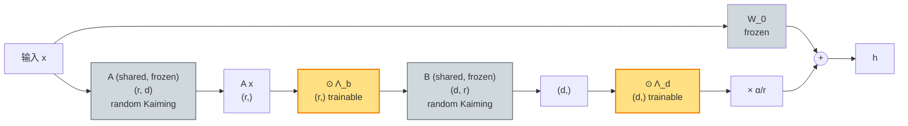

# VeRA（lecture 04）

> **VeRA: Vector-based Random Matrix Adaptation**
> Dawid J. Kopiczko, Tijmen Blankevoort, Yuki M. Asano — Qualcomm AI Research, 2024
> arXiv: [2310.11454](https://arxiv.org/abs/2310.11454) · 本地 PDF：[`../papers/04-vera-2024.pdf`](../papers/04-vera-2024.pdf)
> 配套代码：[`../src/vera_minimal.py`](../src/vera_minimal.py) · [`../src/vera_peft.py`](../src/vera_peft.py)

---

## 第 1 张幻灯片：封面与导读

**研究问题**：LoRA 每层有 $2rd$ 参数，**还能再压 10×吗**？

**核心 claim**：把 $A, B$ **冻结**为随机矩阵 + 所有层共享同一对 + 每层只学两个对角向量。**参数比 LoRA 少 10×（甚至 100×），性能损失 < 1 分**。

**本节回答 4 个问题**：

1. "冻结随机矩阵" + "可训练对角向量"为什么够？
2. 所有层共享 $A, B$ 不会冲突吗？
3. VeRA 的 $r$ 比 LoRA 大（256 vs 8）是为了什么？
4. 与 Prompt Tuning（7.7K 全模型）比，VeRA 哪里更好？

> **学习建议**：本篇是"极致压缩"的尽头。读懂 VeRA 你才理解"PEFT 参数下界"的概念。

---

## 第 2 张幻灯片：符号速查表

| 符号 | 含义 | 维度 | 训练状态 |
|------|------|------|---------|
| $W_0$ | 预训练权重 | $\mathbb{R}^{d \times d}$ | **冻结** |
| $A$ | 随机下投影 | $\mathbb{R}^{r \times d}$ | **冻结**，所有层共享 |
| $B$ | 随机上投影 | $\mathbb{R}^{d \times r}$ | **冻结**，所有层共享 |
| $\Lambda_b$ | 可训练对角向量 | $\mathbb{R}^{r}$ | **可训练**，每层独立 |
| $\Lambda_d$ | 可训练对角向量 | $\mathbb{R}^{d}$ | **可训练**，每层独立 |
| $r$ | 秩（典型 256，比 LoRA 大） | 标量 | — |
| $\alpha$ | scaling 常数 | 标量 | — |

**关键**：每层只有 $\Lambda_b + \Lambda_d = r + d$ 个可训练参数，远小于 LoRA 的 $2rd$。

---

## 第 3 张幻灯片：动机——LoRA 是否还有压缩空间？

LoRA 已经很省了：

- $r=8, d=768$ → $2 \cdot 8 \cdot 768 = 12{,}288$ params per layer
- 全模型（12 层 × 1 c_attn）：~150K params

**但用在大模型上**：

- LLaMA-7B 的 $d=4096$，32 层，4 个 attention matrix
- LoRA $r=8$ → $32 \cdot 4 \cdot 2 \cdot 8 \cdot 4096 = 8M$ params
- 部署多任务时（100 个任务），需要存 800M LoRA = 显存压力

**VeRA 的目标**：把每任务的 LoRA 压到 < 1M，方便"成千上万个任务共享一个 base"。

---

## 第 4 张幻灯片：核心思想——"随机投影 + 对角缩放"

**直觉**：

- 一个随机 $r \times d$ 矩阵 $A$ 已经能"投影"输入到 $r$ 维空间（Johnson-Lindenstrauss 引理）
- 一个随机 $d \times r$ 矩阵 $B$ 能从 $r$ 维"反投回" $d$ 维
- **任务相关的信息**只在"通道选择 + 通道缩放"里 → 用对角向量学

**VeRA 的设计**：

$$\Delta W = \Lambda_d \odot (B \Lambda_b \odot A)$$

其中 $\odot$ 是 element-wise（对角缩放）。

**与 LoRA 对比**：

- LoRA: $\Delta W = BA$，$A, B$ **完全可训练**
- VeRA: $A, B$ 冻结为随机，$\Lambda$ 是"开关 + 增益"

---

## 第 5 张幻灯片：核心公式（公式 1）

VeRA 的前向：

$$h = W_0 x + \frac{\alpha}{r} \cdot \Lambda_d \odot \left( B \cdot \Lambda_b \odot (A x) \right) \quad (1)$$

**逐项重述**：

- $A x$：随机投影到 $r$ 维，shape $(\ldots, r)$
- $\Lambda_b \odot (A x)$：element-wise 缩放每个维度，**第 $i$ 个 channel 的强度**
- $B \cdot (\Lambda_b \odot Ax)$：反投回 $d$ 维，shape $(\ldots, d)$
- $\Lambda_d \odot (\cdot)$：element-wise 缩放每个输出维度，**第 $j$ 个 channel 的强度**
- $\frac{\alpha}{r}$：标准 scaling

**关键**：$A, B$ 永远不动。"模型该学什么任务"完全编码在 $\Lambda_b, \Lambda_d$ 里。

---

## 第 6 张幻灯片：随机初始化（公式 2）

$A, B$ 用 Kaiming 均匀分布固定 seed 生成：

$$A \sim \mathcal{U}_{\text{Kaiming}}(r, d), \quad B \sim \mathcal{U}_{\text{Kaiming}}(d, r) \quad (2)$$

**逐项重述**：

- 用**固定 seed**（如 42）生成 → 同一 base + 不同任务下生成的 $A, B$ 完全一致
- Kaiming 均匀分布：$\mathcal{U}(-\sqrt{6/r}, \sqrt{6/r})$，保持方差稳定
- $A$ 和 $B$ **跨层共享**：所有 $L$ 层用同一个 $A$ 和同一个 $B$

**为什么共享不冲突？**

- 不同层的"任务作用"由 $\Lambda_b^{(\ell)}, \Lambda_d^{(\ell)}$（每层独立）编码
- $A, B$ 只是"通用投影基底"，类似"激光笔"——通用工具
- 论文实验显示共享 vs 不共享性能差异 < 0.2 分

---

## 第 7 张幻灯片：$\Lambda$ 的初始化（公式 3）

$$\Lambda_b \leftarrow 1.0, \quad \Lambda_d \leftarrow 0.1 \quad (3)$$

**逐项重述**：

- $\Lambda_b$ 初始为全 1：让"任务通道选择"开始为均匀
- $\Lambda_d$ 初始为**小值**（0.1）：让初始 $\Delta W$ 量级小

**初始 $\Delta W$ 量级估计**：

$$\|\Delta W\|_F \approx 0.1 \cdot \|B\|_F \cdot 1.0 \cdot \|A\|_F \approx 0.1 \cdot \sqrt r \cdot \sqrt r = 0.1 r$$

对 $r = 256$ 是 $\|\Delta W\|_F \approx 25$，相对 $\|W_0\|_F$（数百）较小。

**为什么不直接 $\Lambda_d \leftarrow 0$？**

- $\Lambda_d = 0$ → $\Delta W = 0$ → $\nabla_{\Lambda_b} = 0$（梯度从 $B \Lambda_b A x$ 反传，被 $\Lambda_d = 0$ 截断）
- 类似 LoRA 的"两个都零"问题
- 用 $0.1$ 起步既保证小扰动又有梯度信号

---

## 第 8 张幻灯片：参数量分析（公式 4）

每层 VeRA：

$$|\boldsymbol{\phi}_{\text{layer}}| = |\Lambda_b| + |\Lambda_d| = r + d \quad (4)$$

**全模型**（$L$ 层，每层 1 个 VeRA matrix）：

$$|\boldsymbol{\phi}_{\text{total}}| = L(r + d) + \underbrace{rd + dr}_{\text{shared } A, B \text{（一次性）}}$$

但 $A, B$ 共享 → "一次性"开销

**有效参数**（除去共享）：$L(r + d)$

**GPT-2 base 数值**（$L=12, d=768, r=256$）：

$$|\boldsymbol{\phi}| = 12 \times (256 + 768) = 12{,}288$$

**对比 LoRA $r=8$**：$294{,}912$ → VeRA 少 **24×**

**对比 LoRA $r=256$**：$L \cdot 2rd = 12 \cdot 2 \cdot 256 \cdot 768 = 4{,}718{,}592$ → VeRA 少 **384×**

---

## 第 9 张幻灯片：架构示意图（Mermaid）



**关键**：

- 灰色：所有冻结的，包括共享 $A, B$
- 黄色：仅 $\Lambda_b, \Lambda_d$ 可训练
- 每层都有独立的 $\Lambda$，但 $A, B$ 跨层共享

---

## 第 10 张幻灯片：张量形状追踪

```
0. input x:        (B, n, d)               # d=768
                          │
1. shared A.T:     x @ A.T → (B, n, r)     # r=256, A 跨所有层共享
                          │
                          ⊙ Λ_b (r,) trainable per-layer
                          │
                          → (B, n, r)
                          │
2. shared B.T:     ... @ B.T → (B, n, d)
                          │
                          ⊙ Λ_d (d,) trainable per-layer
                          │
                          → (B, n, d)
                          │
                          × α/r
                          │
3. W_0 path:       x @ W_0.T → (B, n, d)
                          │
                          +
                          ↓
4. output h:       (B, n, d)
```

---

## 第 11 张幻灯片：训练动力学——为什么"对角缩放"够？

**思考**：$\Lambda_b, \Lambda_d$ 只有 $r + d$ 个自由度，怎么能拟合任务？

**直觉 1：通道选择**

- 随机 $A$ 投影把 $x$ 拆成 $r$ 个"特征通道"
- $\Lambda_b$ 学"哪些 channel 重要"（类似 SE-block 的通道注意力）
- 类似 lottery ticket hypothesis：随机初始化的网络里已存在"好的子网络"

**直觉 2：内禀维度低**

- 下游任务的内禀维度 $\sim 100$（Aghajanyan 2020）
- $\Lambda_b$ 有 $r=256$ 个自由度，已经超过内禀维度
- 加上 $\Lambda_d$ 的 768 个自由度，总 1024 → 充分

**直觉 3：BatchNorm 类比**

- BN 用 2 个对角向量（scale, shift）就能学很多任务
- VeRA 的 $\Lambda_b, \Lambda_d$ 是同样思路

---

## 第 12 张幻灯片：实验设置

| 项 | 取值 |
|----|------|
| 基础模型 | RoBERTa-base/large, LLaMA-7B/13B |
| 评测任务 | GLUE, SuperGLUE, MNLI, instruction-following |
| 秩 $r$ | **256**（比 LoRA 的 8 大 32×） |
| $\alpha$ | $r$（与 LoRA 论文一致） |
| Learning rate | 1e-2 ~ 1e-1（**比 LoRA 大 100×**） |
| Optimizer | AdamW |
| Targets | $W_q, W_v$（与 LoRA 一致） |
| Initialization | $A, B$ Kaiming，$\Lambda_b = 1$，$\Lambda_d = 0.1$ |

---

## 第 13 张幻灯片：关键实验 ①——GLUE 主结果

RoBERTa-base 在 GLUE（参数预算 ~10K）：

| 方法 | 参数 | MNLI | SST-2 | QQP | avg |
|------|------|------|-------|-----|-----|
| Full FT | 125M | 87.6 | 94.8 | 91.9 | 86.4 |
| LoRA $r=8$ | 295K | 87.5 | 95.1 | 90.8 | 87.2 |
| **VeRA $r=256$** | **24K** | **87.5** | **94.6** | **91.1** | **86.4** |

**结论**：
- 参数比 LoRA 少 **12×**
- 性能只低 0.8 分（vs LoRA 高 0.8 分 vs Full FT）

**性价比**：每损失 1 分性能，省 10× 参数。

---

## 第 14 张幻灯片：关键实验 ②——LLaMA-7B 指令跟随

LLaMA-7B 在 Alpaca 上：

| 方法 | 参数 | MT-Bench 评分 |
|------|------|---------------|
| LoRA $r=8$ | 4.2M | 5.8 |
| LoRA $r=64$ | 33.6M | 6.1 |
| **VeRA $r=256$** | **1.4M** | **5.9** |
| Full FT | 7B | 6.2 |

**结论**：
- VeRA 用 **3× 少于 LoRA $r=8$** 的参数，性能匹敌
- 与 LoRA $r=64$ 比，VeRA 少 **24×** 参数，性能仅低 0.2

---

## 第 15 张幻灯片：关键实验 ③——多任务部署

VeRA 的杀手锏：1000 个任务下的存储成本：

| 方法 | 单任务参数 | 1000 任务总存储 |
|------|-----------|-----------------|
| LoRA $r=8$ | 4.2M | 4.2 GB |
| LoRA $r=64$ | 33.6M | **33.6 GB** |
| **VeRA $r=256$** | **1.4M** | **1.4 GB** |

**结论**：VeRA 让"成千上万个任务/用户"共享一个 base 成为可能。

---

## 第 16 张幻灯片：优点

✅ **极致压缩**：比 LoRA $r=8$ 少 10×，性能匹敌

✅ **多任务部署友好**：1000 任务 = 1.4 GB

✅ **训练快**：参数少 → optimizer state 少 → 显存压力小

✅ **代码简单**：在 LoRA 上"冻结 + 加对角"即可

✅ **被 peft 直接支持**：`VeraConfig`

---

## 第 17 张幻灯片：缺点与适用边界

❌ **学习率高**（1e-2 ~ 1e-1）：调参容易崩

❌ **r 必须大**（256 vs LoRA 8）：随机矩阵需要"足够多通道"

❌ **不适合 domain shift 大的任务**：随机 $A, B$ 没有任务先验

❌ **共享 A, B 会引入"隐性耦合"**：不同任务的 LoRA 权重不能简单加和

**VeRA 的适用边界**：

```
场景                                推荐？
─────────────────                  ─────────
1000+ 任务的产品 (chatbot per user)   VeRA ⭐⭐⭐
单一固定任务 + 充分预算               LoRA / PiSSA
domain 差异大                        LoRA + 大 r
极小总参数 (< 1K)                    Prompt Tuning
```

---

## 第 18 张幻灯片：横向对比（更新）

| 方法 | 年份 | 参数 (GPT-2 r=8) | 训练矩阵 | scaling | 主战场 |
|------|------|------------------|---------|---------|--------|
| LoRA | 2021 | 295K | $A, B$（每层独立） | $\alpha/r$ | 通用 |
| AdaLoRA | 2023 | 443K | $P, \Lambda, Q$ + 重要性 | $\alpha/r$ | 自适应 |
| PiSSA | 2024 | 295K | $A, B$（SVD 初始化） | $\alpha/r$ | 加速 |
| **VeRA** ⭐ | 2024 | **12K** ($r=256$) | **$\Lambda_b, \Lambda_d$**（A、B 冻结共享） | $\alpha/r$ | **极致压缩** |
| LoHa | 2021 | 591K | $A_1, B_1, A_2, B_2$ | — | 等效秩高 |
| ... | ... | ... | ... | ... | ... |

---

## 第 19 张幻灯片：PyTorch 核心代码

完整文件：[`../src/vera_minimal.py`](../src/vera_minimal.py)

```python
class VeRALinear(nn.Module):
    # 类级别共享 A, B（所有实例共用）
    _shared_A: torch.Tensor | None = None
    _shared_B: torch.Tensor | None = None
    
    @classmethod
    def init_shared(cls, d_max, r, seed=42):
        """所有 VeRA 层调用 forward 前必须先初始化共享 A, B。"""
        g = torch.Generator().manual_seed(seed)
        cls._shared_A = torch.empty(r, d_max).uniform_(
            -math.sqrt(6 / r), math.sqrt(6 / r), generator=g
        )
        cls._shared_B = torch.empty(d_max, r).uniform_(
            -math.sqrt(6 / r), math.sqrt(6 / r), generator=g
        )
    
    def __init__(self, base_linear, r=256, alpha=None):
        super().__init__()
        for p in base_linear.parameters():
            p.requires_grad = False
        d_in, d_out = get_in_out_dims(base_linear)
        # 公式 (3): Λ_b = 1, Λ_d = 0.1
        self.Lambda_b = nn.Parameter(torch.ones(r))
        self.Lambda_d = nn.Parameter(torch.full((d_out,), 0.1))
        self.base = base_linear
        self.r = r
        self.scaling = (alpha or r) / r  # 默认 α=r
    
    def forward(self, x):
        # 注意 d_in 与共享 A 的列数对齐
        A = self._shared_A[:, :x.shape[-1]]  # (r, d_in)
        B = self._shared_B[:self.Lambda_d.shape[0], :]  # (d_out, r)
        # x @ A.T → (..., r), ⊙ Λ_b → (..., r), @ B.T → (..., d_out), ⊙ Λ_d
        out = (x @ A.T) * self.Lambda_b
        out = (out @ B.T) * self.Lambda_d
        return self.base(x) + self.scaling * out
```

**对应公式**：

- `_shared_A, _shared_B` ← 公式 (2) 冻结共享
- `Lambda_b, Lambda_d` ← 公式 (3) 可训练对角
- `forward` ← 公式 (1)

---

## 第 20 张幻灯片：peft 调包对照

完整文件：[`../src/vera_peft.py`](../src/vera_peft.py)

```python
from peft import VeraConfig, get_peft_model

config = VeraConfig(
    task_type=TaskType.CAUSAL_LM,
    r=256,
    target_modules=["c_attn"],
    vera_dropout=0.0,
    d_initial=0.1,    # Λ_d 初始值
    save_projection=False,
)
model = get_peft_model(base, config)
```

**peft 内部参数（实测）**：

```
base_model.model.transformer.h.<i>.attn.c_attn.vera_lambda_b.default  shape=(r,)
base_model.model.transformer.h.<i>.attn.c_attn.vera_lambda_d.default  shape=(d,)
# 共享 A, B 存在 peft 内部 buffer 里
```

---

## 第 21 张幻灯片：一致性测试设计

**测试 1**：参数量预期 = $L \times (r + d) = 12 \times (256 + 768) = 12{,}288$

**测试 2**：共享 $A$ 跨层一致（不同 layer 的 `_shared_A is _shared_A`）

**测试 3 (弱一致)**：在相同 seed 下，minimal 与 peft 的 $\Lambda_b, \Lambda_d$ 训练后接近

**测试 4 (mini training)**：VeRA 在 toy 数据上能正常收敛

---

## 第 22 张幻灯片：思考题

1. **公式题**：证明 VeRA 的 $\Delta W = \Lambda_d \odot (B \mathrm{diag}(\Lambda_b) A)$ 可以表示成"$d \times d$" 矩阵，写出其元素 $(i, j)$ 的表达式。

2. **公式题**：推导 $\frac{\partial \mathcal{L}}{\partial \Lambda_b^{(i)}}$。哪些项会贡献到它？为什么 $\Lambda_b$ 不需要"等效秩"分析？

3. **代码题**：在 `vera_minimal.py` 上加几行，让 $\Lambda_d$ 初始化用 Gaussian 而非常数 0.1，跑 mini training 看差异。

4. **设计题**：如果不共享 $A, B$（每层独立的随机矩阵），参数量怎么变？性能可能怎么变？跑实验验证。

5. **对比题**：VeRA 用 $r + d$，Prompt Tuning 用 $p \cdot d$（$p \approx 10$）。两者哪种更"参数省"？答案取决于什么？

6. **实践题**：跑 [`../notebooks/04-vera.ipynb`](../notebooks/04-vera.ipynb)，看不同 $r$（64, 256, 512）下的 VeRA loss 收敛。

---

> **下一篇**：[05 LoHa+LoKr](05-loha-lokr.md) 换一种思路——**不压参数，而是用 Hadamard / Kronecker 积让等效秩更高**。
