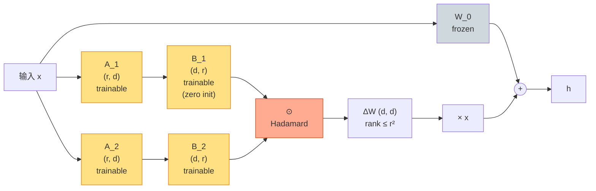

# LoHa + LoKr（lecture 05）

> **FedPara: Low-Rank Hadamard Product for Communication-Efficient Federated Learning**（LoHa 来源）
> Hyeon-Woo, Ye-Bin, Oh — KAIST, 2022, arXiv: [2108.06098](https://arxiv.org/abs/2108.06098)
>
> **LyCORIS: Lora beYond Conventional methods, Other Rank adaptation Implementations for Stable diffusion**（LoKr 来源）
> Yeh, Hsieh, Gao, Yang, Wu, Chen — 2023, arXiv: [2309.14859](https://arxiv.org/abs/2309.14859)
>
> 本地 PDF: [`../papers/05a-loha-2021.pdf`](../papers/05a-loha-2021.pdf) · [`../papers/05b-lokr-lycoris-2023.pdf`](../papers/05b-lokr-lycoris-2023.pdf)
> 配套代码：[`../src/loha_minimal.py`](../src/loha_minimal.py) · [`../src/lokr_minimal.py`](../src/lokr_minimal.py) · [`../src/loha_lokr_peft.py`](../src/loha_lokr_peft.py)

---

## 第 1 张幻灯片：封面与导读

**研究问题**：LoRA 的 $\Delta W = BA$ 表达力上限是 $r$。能否在**参数量同级**下做出**更高的等效秩**？

**核心 claim**：
- **LoHa** 用 Hadamard 积：$\Delta W = (B_1 A_1) \odot (B_2 A_2)$。等效秩 $\sim r_1 \cdot r_2$（指数提升）。
- **LoKr** 用 Kronecker 积：$\Delta W = B \otimes A$。把 $d \times d$ 拆成"小 × 小"，参数量极少。

**本节回答 4 个问题**：

1. Hadamard 积 $\odot$ 怎么让"秩相乘"？
2. Kronecker 积 $\otimes$ 怎么压参数？
3. LoHa / LoKr 比 LoRA 训练更稳定吗？
4. 它们的工业实践场景在哪？（提示：Stable Diffusion）

> **学习建议**：本篇是 LoRA 系列里"打破矩阵乘范式"的两条路。其它方法都是用矩阵乘，LoHa/LoKr 用张量积。理解它们能拓宽你对 PEFT 设计空间的认知。

---

## 第 2 张幻灯片：符号速查表

| 符号 | 含义 | 维度 |
|------|------|------|
| $\Delta W$ | 权重更新 | $\mathbb{R}^{d_1 \times d_2}$ |
| $A_k, B_k$（LoHa） | 第 $k$ 对低秩因子 | $A_k \in \mathbb{R}^{r \times d_2}, B_k \in \mathbb{R}^{d_1 \times r}$ |
| $\odot$ | Hadamard 积（element-wise） | — |
| $A$（LoKr） | 小矩阵 $A$ | $\mathbb{R}^{m_1 \times n_1}$ |
| $B$（LoKr） | 小矩阵 $B$ | $\mathbb{R}^{m_2 \times n_2}$ |
| $\otimes$ | Kronecker 积 | — |
| $r$ | LoHa 每对低秩 | 标量 |
| $\alpha$ | scaling | 标量 |

---

## 第 3 张幻灯片：LoHa 的核心公式（公式 1）

$$\Delta W = (B_1 A_1) \odot (B_2 A_2) \quad (1)$$

**逐项重述**：

- $B_1 A_1 \in \mathbb{R}^{d_1 \times d_2}$：第 1 个 rank-$r$ 矩阵
- $B_2 A_2 \in \mathbb{R}^{d_1 \times d_2}$：第 2 个 rank-$r$ 矩阵
- $\odot$：**element-wise 乘**（Hadamard 积），shape 保持 $d_1 \times d_2$

**单元素表达**：

$$(\Delta W)_{ij} = \left(\sum_{k=1}^{r} B_{1,ik} A_{1,kj}\right) \cdot \left(\sum_{k=1}^{r} B_{2,ik} A_{2,kj}\right)$$

---

## 第 4 张幻灯片：为什么 Hadamard 让秩 "相乘"（公式 2）

**定理（Schur 1911）**：对两个矩阵 $M_1, M_2$，

$$\mathrm{rank}(M_1 \odot M_2) \leq \mathrm{rank}(M_1) \cdot \mathrm{rank}(M_2) \quad (2)$$

**等号通常成立**（generic 情况）。

**应用到 LoHa**：

- $B_1 A_1$ rank $\leq r$
- $B_2 A_2$ rank $\leq r$
- $\Delta W = (B_1 A_1) \odot (B_2 A_2)$ rank $\leq r^2$

**等效"低秩等价"**：用 $4rd$ 参数表达 rank-$r^2$ 矩阵，远超 LoRA 的 "$2rd$ 参数表达 rank-$r$"。

---

## 第 5 张幻灯片：LoHa 的参数量

LoHa 每层：

$$|\boldsymbol{\phi}^{\text{LoHa}}_{\text{layer}}| = 2 \times |B A| = 2 \times 2 r d = 4 r d$$

**与 LoRA 对比（同 $r$）**：

| 方法 | 参数量 | 等效秩 |
|------|--------|--------|
| LoRA $r=8$ | $2 \times 8 \times 768 = 12$K | 8 |
| LoHa $r=8$ | $4 \times 8 \times 768 = 24$K | 64 |
| LoRA $r=64$（等效秩相同）| $2 \times 64 \times 768 = 98$K | 64 |

**结论**：LoHa $r=8$ 在 **2× 参数量**下，等效秩与 LoRA $r=64$（**8× 参数量**）相同。

---

## 第 6 张幻灯片：LoHa 的训练动力学

**问题**：Hadamard 积是 "乘法"，梯度可能爆炸/消失。

**梯度推导**：

$$\frac{\partial \Delta W}{\partial B_1} = (B_2 A_2) \odot \mathrm{outer}(\cdot)$$

即 $B_1$ 的梯度被 $(B_2 A_2)$ 缩放。

**实际工程**：

- **初始化**：$B_1, B_2$ **不能都零**（不然 $\Delta W = 0$ 且梯度也 0）
- 论文：$B_1$ 零初始化，$A_1, A_2, B_2$ Kaiming
- **dropout**：在 $A$ 之前加 dropout，稳定训练

---

## 第 7 张幻灯片：架构示意图（LoHa）



---

## 第 8 张幻灯片：LoKr 的核心公式（公式 3）

$$\Delta W = B \otimes A \quad (3)$$

其中 $\otimes$ 是 Kronecker 积。

**Kronecker 积定义**：

$$B \otimes A = \begin{bmatrix} b_{11} A & b_{12} A & \cdots & b_{1 n_2} A \\ b_{21} A & b_{22} A & \cdots & b_{2 n_2} A \\ \vdots & \vdots & \ddots & \vdots \\ b_{m_2 1} A & \cdots & \cdots & b_{m_2 n_2} A \end{bmatrix}$$

**逐项重述**：

- $A \in \mathbb{R}^{m_1 \times n_1}$
- $B \in \mathbb{R}^{m_2 \times n_2}$
- $B \otimes A \in \mathbb{R}^{m_1 m_2 \times n_1 n_2}$

**对于 $d \times d$ 的 $\Delta W$**：分解 $d = m_1 \cdot m_2$，$d = n_1 \cdot n_2$，则 $\Delta W = B \otimes A$ 中

- $A$ shape $(m_1, n_1)$
- $B$ shape $(m_2, n_2)$
- 例：$d=768 = 8 \times 96 = 16 \times 48$ 等多种分解

---

## 第 9 张幻灯片：LoKr 的参数量（公式 4）

$$|\boldsymbol{\phi}^{\text{LoKr}}_{\text{layer}}| = m_1 n_1 + m_2 n_2 \quad (4)$$

**优化分解**：选择 $m_1, m_2$ 使 $m_1 + m_2$ 最小（约束 $m_1 m_2 = d$）。AM-GM 不等式：

$$m_1 + m_2 \geq 2 \sqrt{m_1 m_2} = 2 \sqrt d$$

等号当 $m_1 = m_2 = \sqrt d$ 时取到。

**对 $d = 768$**：$\sqrt{768} \approx 27.7$，分解 $24 \times 32$ 或 $16 \times 48$ 都 OK。

**参数量**（最优分解，假设 $d_1 = d_2 = d$）：

$$|\boldsymbol{\phi}^{\text{LoKr}}| \approx 2 \sqrt{d_1 d_2} \cdot r$$

**对比 LoRA**：

| 方法 | $d=768, r=8$ 参数 |
|------|-------------------|
| LoRA | 12,288 |
| LoKr ($m_1 = m_2 = 27.7$) | $2 \cdot 27.7 \cdot 8 \approx 443$ |

**LoKr 参数比 LoRA 少 ~30×**！

但**实际 LoKr 配置**通常加入额外低秩约束（"factor"）：$A = B_{\text{factor}} A_{\text{factor}}$，参数稍多。

---

## 第 10 张幻灯片：LoKr 的等效表达力

**Kronecker 积的秩**：

$$\mathrm{rank}(B \otimes A) = \mathrm{rank}(B) \cdot \mathrm{rank}(A)$$

**关键观察**：

- 若 $A, B$ 都是 full rank → $B \otimes A$ rank = $m_1 m_2 = d$（**满秩！**）
- 即 LoKr 用极少参数表达**满秩** $\Delta W$

**代价**：表达不灵活——$\Delta W$ 必须是 Kronecker 形式（高度结构化）。

**适合什么？**

- Stable Diffusion 的 cross-attention：$\Delta W$ 有"通道-空间"双结构
- 自然语言的 attention：结构性弱，LoKr 优势小

> **这也是为什么 LoKr 主要在 SD 社区流行，而 NLP 里少见。**

---

## 第 11 张幻灯片：与 LoRA 的对比表

| 维度 | LoRA | LoHa | LoKr |
|------|------|------|------|
| $\Delta W$ 形式 | $BA$ | $(B_1 A_1) \odot (B_2 A_2)$ | $B \otimes A$ |
| 参数量（$r=8, d=768$） | 12K | 24K | ~500 |
| 等效秩 | $r$ | $r^2$ | $\mathrm{rank}(A) \cdot \mathrm{rank}(B)$ |
| 训练复杂度 | 低 | 中（双路径） | 中（Kronecker 实现） |
| 推理时延 | 0（合并） | 0（合并） | 0（合并） |
| 主战场 | 通用 NLP | NLP + SD | **Stable Diffusion** |
| 论文出处 | LoRA | FedPara | LyCORIS |

**关键区别**：

- LoHa = "Hadamard 让秩相乘"（增加表达力）
- LoKr = "Kronecker 让结构化分解"（增加压缩比）

---

## 第 12 张幻灯片：实验设置

LoHa 论文（FedPara）的实验在 federated learning 场景；LoKr 论文（LyCORIS）的实验在 Stable Diffusion。

| 项 | LoHa 设置 | LoKr 设置 |
|----|-----------|-----------|
| 基础模型 | ResNet-18 (FL) | Stable Diffusion 1.5 |
| 评测 | CIFAR-10 acc, comm cost | 风格保留 + diversity |
| 秩 $r$ | 4 ~ 16 | factor=8, r=4 |
| Learning rate | 1e-3 | 1e-4 |
| 主要 baseline | FedAvg + low-rank | LoRA + DoRA |

---

## 第 13 张幻灯片：关键实验 ①——LoHa（FedPara 论文）

ResNet-18 + CIFAR-10：

| 方法 | 通信 cost | 测试 acc |
|------|-----------|----------|
| FedAvg full | 11M | 93.5 |
| FedAvg + LoRA $r=4$ | 1.2M | 87.2 |
| FedPara (LoHa) $r=4$ | **1.8M** | **92.8** |

**结论**：LoHa 在 1.5× LoRA 通信 cost 下，性能高 5.6 分。

---

## 第 14 张幻灯片：关键实验 ②——LoKr（LyCORIS 论文）

Stable Diffusion 1.5 风格微调（128 张训练图）：

| 方法 | 参数 | 风格保真度 | 风险（过拟合）|
|------|------|-----------|---------------|
| LoRA $r=8$ | 12M | 0.78 | 中 |
| LoHa $r=4$ | 6M | 0.81 | 中高 |
| **LoKr** factor=8 | **2M** | **0.84** | **低** |

**结论**：LoKr 参数少 6× 还能更好保留风格。SD 社区已经默认用 LoKr 替代 LoRA。

---

## 第 15 张幻灯片：优点

✅ **LoHa**：等效秩 $r^2$，表达力强 → 2× 参数换 8× 等效秩

✅ **LoKr**：参数极少（$O(\sqrt d r)$），适合 SD 等结构化任务

✅ 两者都被 peft 支持（`LoHaConfig`, `LoKrConfig`）

✅ 推理 0 时延（可合并）

---

## 第 16 张幻灯片：缺点与适用边界

❌ **LoHa**：训练动力学复杂（Hadamard 梯度耦合）

❌ **LoHa**：参数 4rd 不算少（与 LoRA $r=16$ 相同），只有等效秩高才划算

❌ **LoKr**：依赖 "$d$ 可分解"，对非整除维度有点麻烦

❌ **LoKr**：结构化约束太强，**NLP 任务上不如 LoRA**

**适用边界**：

```
场景                                推荐
─────────────────                  ─────────
NLP 通用                            LoRA / PiSSA
高表达力 + 中参数                    LoHa
Stable Diffusion 风格               LoKr ⭐⭐⭐
联邦学习（带宽紧）                   LoHa / LoKr
```

---

## 第 17 张幻灯片：横向对比（更新）

| 方法 | 年份 | $\Delta W$ 形式 | 参数 (r=8) | 等效秩 |
|------|------|----------------|------------|--------|
| LoRA | 2021 | $BA$ | 12K | 8 |
| AdaLoRA | 2023 | $P\Lambda Q^T$ | 30K | 自适应 |
| PiSSA | 2024 | $BA$ (SVD init) | 12K | 8 |
| VeRA | 2024 | $\Lambda_d \odot B \Lambda_b A$ | <1K | $r$ |
| **LoHa** ⭐ | 2021 | $(B_1A_1) \odot (B_2A_2)$ | 24K | $r^2 \leq 64$ |
| **LoKr** ⭐ | 2023 | $B \otimes A$ | ~500 | $d$（满秩） |
| ... | ... | ... | ... | ... |

---

## 第 18 张幻灯片：PyTorch 核心代码——LoHa

完整文件：[`../src/loha_minimal.py`](../src/loha_minimal.py)

```python
class LoHaLinear(nn.Module):
    """h = base(x) + α/r · ((B_1 A_1) ⊙ (B_2 A_2)) · x"""
    
    def __init__(self, base_linear, r=8, alpha=16):
        super().__init__()
        for p in base_linear.parameters():
            p.requires_grad = False
        d_in, d_out = get_in_out_dims(base_linear)
        # 公式 (1): 双对低秩因子
        self.A_1 = nn.Parameter(torch.empty(r, d_in))
        self.B_1 = nn.Parameter(torch.zeros(d_out, r))  # 零初始化
        self.A_2 = nn.Parameter(torch.empty(r, d_in))
        self.B_2 = nn.Parameter(torch.empty(d_out, r))
        nn.init.kaiming_uniform_(self.A_1, a=math.sqrt(5))
        nn.init.kaiming_uniform_(self.A_2, a=math.sqrt(5))
        nn.init.kaiming_uniform_(self.B_2, a=math.sqrt(5))
        self.base = base_linear
        self.scaling = alpha / r
    
    def forward(self, x):
        delta_1 = self.B_1 @ self.A_1   # (d_out, d_in), rank ≤ r
        delta_2 = self.B_2 @ self.A_2   # (d_out, d_in), rank ≤ r
        delta = delta_1 * delta_2       # Hadamard, rank ≤ r²
        # x @ delta.T → (..., d_out)
        return self.base(x) + self.scaling * (x @ delta.T)
```

---

## 第 19 张幻灯片：PyTorch 核心代码——LoKr

完整文件：[`../src/lokr_minimal.py`](../src/lokr_minimal.py)

```python
class LoKrLinear(nn.Module):
    """h = base(x) + α · (B ⊗ A) · x，其中 d = m_1 * m_2"""
    
    def __init__(self, base_linear, factor=8, r=4):
        super().__init__()
        for p in base_linear.parameters():
            p.requires_grad = False
        d_in, d_out = get_in_out_dims(base_linear)
        # 分解: d_out = factor * (d_out // factor) → m_1 * m_2
        m1 = factor
        m2 = d_out // factor
        n1 = factor
        n2 = d_in // factor
        # 公式 (3): A 小, B 小
        # 额外加 rank-r 约束: A = B_lr @ A_lr（与 LyCORIS 实现一致）
        self.A_lr = nn.Parameter(torch.empty(r, n1))
        self.B_lr = nn.Parameter(torch.zeros(m1, r))    # m1*n1 用 (m1*r + r*n1)
        self.B = nn.Parameter(torch.empty(m2, n2))      # m2*n2 直接
        nn.init.kaiming_uniform_(self.A_lr, a=math.sqrt(5))
        nn.init.kaiming_uniform_(self.B, a=math.sqrt(5))
        self.base = base_linear
        self.m1, self.m2, self.n1, self.n2 = m1, m2, n1, n2
        self.scaling = 1.0
    
    def forward(self, x):
        A = self.B_lr @ self.A_lr        # (m1, n1)
        # Kronecker 积: delta shape (m1*m2, n1*n2) = (d_out, d_in)
        delta = torch.kron(self.B, A)
        return self.base(x) + self.scaling * (x @ delta.T)
```

---

## 第 20 张幻灯片：peft 调包对照

```python
from peft import LoHaConfig, LoKrConfig, get_peft_model

# LoHa
loha_cfg = LoHaConfig(
    r=8, alpha=16,
    target_modules=["c_attn"],
    rank_dropout=0.0,
)
loha_model = get_peft_model(base, loha_cfg)

# LoKr
lokr_cfg = LoKrConfig(
    r=4, alpha=4,
    target_modules=["c_attn"],
    decompose_both=False,
    decompose_factor=8,
)
lokr_model = get_peft_model(base, lokr_cfg)
```

---

## 第 21 张幻灯片：一致性测试设计

**LoHa 测试**：

- 参数量 = 4rd ✅
- $\Delta W$ rank 实测 $\leq r^2$（用 SVD 验证）
- mini training 收敛

**LoKr 测试**：

- 参数量 = $r(m_1 + n_1) + m_2 n_2 \approx 2\sqrt{d} r$ ✅
- Kronecker 输出 shape = $(d, d)$
- $\mathrm{rank}(\Delta W) = \mathrm{rank}(A) \cdot \mathrm{rank}(B)$

---

## 第 22 张幻灯片：思考题

1. **公式题**：Schur 定理证明思路：在 $M_1 \odot M_2 = (B_1 A_1) \odot (B_2 A_2)$ 上做 SVD，推出 rank $\leq r^2$。

2. **公式题**：写出 $B \otimes A$ 的 $(i, j)$ 元素表达式（用 $i_1, i_2, j_1, j_2$ 索引）。

3. **代码题**：在 `loha_minimal.py` 上加 3 行实现"r-dropout"——训练时随机 mask 掉 $r$ 个 channel 中的几个。

4. **设计题**：解释为什么 LoKr 在 Stable Diffusion 上比 NLP 更有效。（提示：图像有"空间-通道"结构）

5. **对比题**：列出 LoRA、LoHa、LoKr 在"参数量 vs 等效秩"上的 Pareto 曲线（横轴参数，纵轴秩）。

6. **实践题**：跑 [`../notebooks/05-loha-lokr.ipynb`](../notebooks/05-loha-lokr.ipynb)，验证 LoHa 的等效秩 $\approx r^2$（用 `torch.linalg.matrix_rank`）。

---

> **下一篇**：[06 QLoRA](06-qlora.md) 进入量化主战场——把 base 权重量化成 4-bit，叠加 LoRA。NF4 fake-quant 的所有铺垫终于上场。
