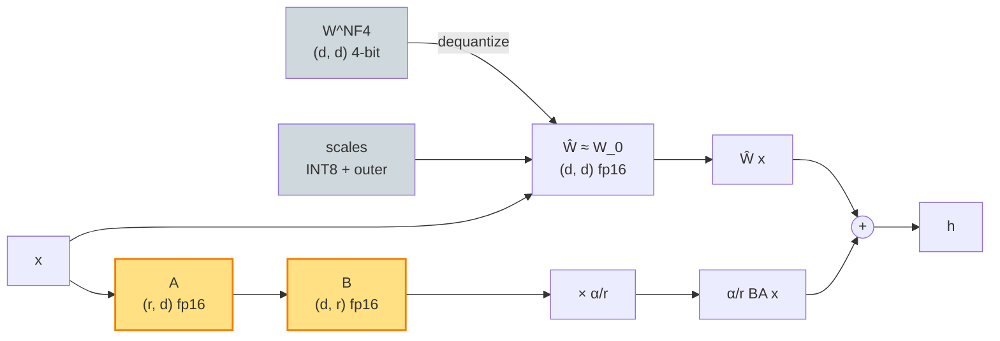

# QLoRA（lecture 06）

> **QLoRA: Efficient Finetuning of Quantized LLMs**
> Tim Dettmers, Artidoro Pagnoni, Ari Holtzman, Luke Zettlemoyer — University of Washington, 2023
> arXiv: [2305.14314](https://arxiv.org/abs/2305.14314) · 本地 PDF：[`../papers/06-qlora-2023.pdf`](../papers/06-qlora-2023.pdf)
> 配套代码：[`../src/qlora_minimal.py`](../src/qlora_minimal.py) · [`../src/qlora_peft.py`](../src/qlora_peft.py) · [`../src/nf4_quant.py`](../src/nf4_quant.py)

---

## 第 1 张幻灯片：封面与导读

**研究问题**：65B 模型微调要 ~780GB 显存（fp32 全参）。能用一张消费 GPU（24GB）做到吗？

**核心 claim**：把 base 权重压成 **4-bit NF4**，叠加 LoRA。**LLaMA-65B 全参等价微调，只需要 48GB 显存（1 张 A100 80GB 单 GPU 跑）**。

**本节回答 4 个问题**：

1. NF4（NormalFloat-4）是什么？为什么比 INT4 在权重上更准？
2. Double Quantization 怎么进一步省存？
3. Paged Optimizer 解决什么 OOM 问题？
4. QLoRA = 量化 + LoRA，反向怎么传？（NF4 base 怎么不更新而 LoRA 正常更新）

> **学习建议**：本篇是 LoRA 系列里"工程优化"最重的一篇。NF4 fake-quant 在 [`../src/nf4_quant.py`](../src/nf4_quant.py) 已实现（lecture 02 学过），这里把它接到 LoRA 上。

---

## 第 2 张幻灯片：符号速查表

| 符号 | 含义 | 维度 |
|------|------|------|
| $W_0$ | 预训练权重 (fp16/32) | $\mathbb{R}^{d \times d}$ |
| $W^{\text{NF4}}$ | NF4 量化后权重（4-bit lookup index）| $\{0, \ldots, 15\}^{d \times d}$ |
| $s$ | 每块 absmax scale (fp32) | $\mathbb{R}^{n/\text{block}}$ |
| $\hat W$ | 反量化后 $W$（近似 $W_0$）| $\mathbb{R}^{d \times d}$ |
| $A, B$ | LoRA 因子（fp16） | 同 LoRA |
| $\alpha, r$ | LoRA scaling 和秩 | 标量 |
| block_size | NF4 量化块大小（典型 64）| 标量 |

---

## 第 3 张幻灯片：QLoRA 的核心三件套

QLoRA 论文 §3 的"三个创新"：

1. **NF4 (NormalFloat-4)**：4-bit 量化，但**网格点是从 N(0, 1) 分位数算出来的**
2. **Double Quantization (DQ)**：把 NF4 的 per-block scale（fp32）也量化成 8-bit
3. **Paged Optimizer (PO)**：CPU-GPU 内存换页，防止 optimizer state OOM

每项分别带来：
- NF4: 4-bit 量化 + 比 INT4 误差小
- DQ: 额外省 0.5 GB / 7B 模型
- PO: 训练长 batch 不爆显存

---

## 第 4 张幻灯片：NF4 网格点（公式 1）

INT4 网格：均匀分布 16 个点，覆盖 $[-1, 1]$：

$$\{-1, -\frac{13}{15}, -\frac{11}{15}, \ldots, 1\}$$

**问题**：权重不是均匀分布。预训练 LM 权重接近 $\mathcal{N}(0, \sigma^2)$。

**NF4 设计**：让网格点是 $\mathcal{N}(0, 1)$ 的**16-分位数**：

$$q_i = \Phi^{-1}\left(\frac{i + 0.5}{16}\right), \quad i = 0, \ldots, 15 \quad (1)$$

**逐项重述**：

- $\Phi^{-1}$：标准正态分布的反 CDF
- $(i + 0.5)/16$：网格点 $i$ 对应的 quantile（0.03125, 0.09375, ..., 0.96875）
- 然后**线性 rescale** 到 $[-1, 1]$ 保证最大值 ±1

**结果**：16 个值（已在 [`../src/nf4_quant.py`](../src/nf4_quant.py) `NF4_VALUES` 中）：

```python
[-1.0, -0.696, -0.525, -0.395, -0.284, -0.185, -0.091, 0.0,
  0.080, 0.161, 0.246, 0.338, 0.441, 0.563, 0.723, 1.0]
```

**对比 INT4 在 $\mathcal{N}(0, 1)$ 上的误差**：

| 量化 | RMSE |
|------|------|
| INT4 (均匀) | 0.11 |
| **NF4** | **0.09** |

NF4 误差减少约 20%。

---

## 第 5 张幻灯片：分块量化（公式 2）

不能用一个全局 scale 量化整个 $d \times d$ 矩阵，因为不同子区域的"动态范围"差异大。

**Blockwise quantization**：把 $W$ 切成 block_size = 64 的小块，每块独立 scale：

$$s_b = \max_{j \in \text{block } b} |W_j|, \quad W^{\text{NF4}}_j = \mathrm{quantize}_{\text{NF4}}\left(\frac{W_j}{s_b}\right) \quad (2)$$

**逐项重述**：

- $b$：block 索引（每个 block 64 个元素）
- $s_b$：第 $b$ 块的 absmax scale（fp32 存储）
- $W_j / s_b \in [-1, 1]$：归一化到 NF4 网格范围
- $\mathrm{quantize}_{\text{NF4}}$：找最近的 NF4 网格点索引

**反量化**：

$$\hat W_j = s_b \cdot q_{W^{\text{NF4}}_j}$$

**存储开销**：

- $W^{\text{NF4}}$：$d \cdot d \cdot 4 / 8 = 0.5 d^2$ bytes
- 每 64 个元素 1 个 fp32 scale → $d^2 / 64 \cdot 4$ bytes = $d^2 / 16$ bytes
- 总：$0.5 d^2 + d^2 / 16 \approx 0.56 d^2$ bytes
- vs fp32 的 $4 d^2$ → **省 7×**

---

## 第 6 张幻灯片：Double Quantization (公式 3)

观察：blockwise 量化产生**很多 scale**（一个 7B 模型有 ~110M 个 fp32 scale = 440 MB）。

**Double Quantization (DQ)**：把这些 fp32 scale 用 **INT8** 再量化：

$$s_b^{\text{INT8}} = \mathrm{quantize}_{\text{INT8}}\left(\frac{s_b}{s_{\text{outer}}}\right), \quad s_{\text{outer}} = \max_{b \in \text{group}} |s_b| \quad (3)$$

**逐项重述**：

- 256 个 inner scale $s_b$ 组成一个 group
- $s_{\text{outer}}$：该 group 的 fp32 outer scale
- 每 group 用 256 × 1 byte + 1 fp32 = 260 bytes 存储

**节省**：

| | fp32 scale | INT8 + outer |
|------|------------|--------------|
| 7B 模型存储 | 440 MB | 56 MB |
| 节省 | — | **8×** |

总额外存储：原本 NF4 的 7B 模型 $\sim$ 4 GB → DQ 后 $\sim$ 3.5 GB。

> 看似只省 0.5 GB，但对训练时 GPU 显存极有用。

---

## 第 7 张幻灯片：Paged Optimizer (公式 4)

**问题**：AdamW 的 optimizer state（$m, v$）每参数 $8$ bytes fp32。LoRA 参数虽少，但 grad spike 时仍 OOM。

**Paged Optimizer**：

- 把 optimizer state 存在 CPU 内存（pinned）
- 用 unified memory（CUDA UVM）让 GPU 按需 page in
- 类似 OS 的虚拟内存

**伪代码（公式 4）**：

```python
class PagedAdamW:
    def __init__(self):
        # state 在 CPU pinned memory
        self.state_cpu = {p: torch.zeros_like(p, pin_memory=True) for p in params}
    
    def step(self):
        for p in params:
            state = self.state_cpu[p].to('cuda', non_blocking=True)  # page in
            # 标准 AdamW 更新
            state['m'].mul_(beta1).add_(p.grad, alpha=1-beta1)
            state['v'].mul_(beta2).addcmul_(p.grad, p.grad, value=1-beta2)
            p.addcdiv_(state['m'], state['v'].sqrt() + eps, value=-lr)
            self.state_cpu[p] = state.cpu()  # page out
```

**实际：bitsandbytes 用 CUDA stream + UVM 自动处理。**

---

## 第 8 张幻灯片：QLoRA 完整公式（公式 5）

把三件套连起来：

$$h = \underbrace{\text{dequantize}(W^{\text{NF4}}, s_b, s_{\text{outer}})}_{\hat W} \cdot x + \underbrace{\frac{\alpha}{r} BA \cdot x}_{\text{LoRA}} \quad (5)$$

**逐项重述**：

- $W^{\text{NF4}}$：base 权重的 NF4 量化（4-bit lookup index）
- $s_b$：per-block fp32 → INT8 量化（DQ）
- $s_{\text{outer}}$：每 256 block 一个 fp32 outer scale
- $\text{dequantize}(\cdot)$：先用 INT8 + outer 恢复 fp32 scale，再 lookup NF4 网格点得 $\hat W$
- LoRA 部分**完全不变**，A、B 用 fp16/32

**关键**：训练时 base 永远是 NF4 状态，LoRA 是浮点。前向时实时反量化（运行时开销可接受）。

---

## 第 9 张幻灯片：反向传播（公式 6）

QLoRA 的反向只更新 $A, B$，base 永远是冻结的量化态：

$$\frac{\partial \mathcal{L}}{\partial B} = \frac{\alpha}{r} A x \cdot \text{grad}_h^T, \quad \frac{\partial \mathcal{L}}{\partial A} = \frac{\alpha}{r} B^T \cdot \text{grad}_h \cdot x^T \quad (6)$$

$$\frac{\partial \mathcal{L}}{\partial W^{\text{NF4}}} = 0$$（量化的不更新）

**实际工程**：

- $\hat W$ 是反量化结果，但**不参与梯度链**（detach）
- $\hat W \cdot x$ 在 forward 时算，bp 不通过 $W$
- bp 只反传到 LoRA 路径

---

## 第 10 张幻灯片：架构示意图（Mermaid）



**关键**：

- 灰色：量化后冻结
- 黄色：LoRA 浮点可训练
- $\hat W \cdot x$ 在 forward 时实时反量化（CUDA kernel）

---

## 第 11 张幻灯片：张量形状追踪

```
存储 (持久):
  W^NF4:   (d, d) packed as uint8 (2 个 NF4 共享 1 byte) → 0.5 d² bytes
  s_INT8:  (d²/64,) → d²/64 bytes（每 64 个元素 1 个 inner scale）
  s_outer: (d²/64/256,) fp32 → d²/16384 × 4 bytes（每 256 inner scale 1 个 outer）

forward (runtime):
  dequantize_NF4 → Ŵ (d, d) fp16
  Ŵ @ x → (d,)
  A @ x → (r,)
  B @ (A @ x) → (d,)
  + α/r 缩放
```

**显存峰值**（运行时）：
- 持久（base）：$0.56 d^2$ bytes ≈ 4-bit 等价
- 临时（反量化）：$2 d^2$ bytes fp16
- LoRA：可忽略

---

## 第 12 张幻灯片：实验设置

| 项 | 取值 |
|----|------|
| 基础模型 | LLaMA-7B/13B/33B/65B, GPT-OPT |
| 评测 | MMLU, Vicuna eval, Alpaca instruction |
| 量化 | NF4 + DQ + PO |
| LoRA $r$ | 64 |
| LoRA $\alpha$ | 16 |
| LoRA target | 所有 attention + FFN |
| LR | 2e-4 |
| Optimizer | Paged AdamW |
| 训练数据 | OASST1, Alpaca, Self-Instruct |

---

## 第 13 张幻灯片：关键实验 ①——MMLU on LLaMA-65B

| 方法 | 显存 | 训练时间 | MMLU 5-shot |
|------|------|---------|-------------|
| Full FT | 780 GB | 14 天 (16 A100s) | 62.4 |
| LoRA (fp16) | 350 GB | 12 天 (8 A100s) | 62.1 |
| **QLoRA NF4** | **48 GB** | **24 小时 (1 A100)** | **62.7** |

**结论**：
- QLoRA 显存比 LoRA 少 7×
- 训练时间从 12 天 → 24 小时（**单 GPU 可跑！**）
- 性能**不低于全参 FT**

> 这是 2023 年 PEFT 领域最大的工程突破。

---

## 第 14 张幻灯片：关键实验 ②——NF4 vs INT4

LLaMA-7B 量化后 perplexity（C4 数据集）：

| 量化 | PPL（越低越好）|
|------|----------------|
| fp16 | 5.10 |
| INT4 (RTN) | 5.62 |
| INT4 (GPTQ) | 5.45 |
| **NF4** | **5.18** |

**结论**：NF4 比 INT4-RTN 低 0.44，**接近 fp16 性能**。

---

## 第 15 张幻灯片：关键实验 ③——DQ + PO 消融

LLaMA-7B 微调显存：

| 配置 | 显存 |
|------|------|
| LoRA fp16 | 65 GB |
| LoRA + NF4（无 DQ、PO） | 8.0 GB |
| LoRA + NF4 + **DQ** | 7.4 GB |
| LoRA + NF4 + DQ + **PO** | **5.5 GB** ← QLoRA 默认 |

**结论**：
- NF4 量化是主要贡献（65 → 8 GB）
- DQ 再省 0.6 GB
- PO 防 spike，平均省 1.9 GB

---

## 第 16 张幻灯片：优点

✅ **极致显存压缩**：65B 模型 24GB 跑

✅ **几乎不掉性能**：NF4 比 fp16 仅低 0.1 ~ 0.5 分

✅ **训练时间大幅缩短**：单 GPU 24 小时 vs 多 GPU 多天

✅ **被 transformers + peft + bitsandbytes 直接支持**

✅ **可与其它方法组合**：QPiSSA、QDoRA 都可以

---

## 第 17 张幻灯片：缺点与适用边界

❌ **GPU only**：bitsandbytes 真量化只支持 CUDA（CPU 上 fake-quant 用作教学）

❌ **dequantize 运行时开销**：forward 比 fp16 慢 5-10%

❌ **NF4 假设权重 N(0, 1)**：不适合"权重稀疏"的模型

❌ **训练精度 LoRA 仍是 fp16/bf16**：极端长 training 仍可能 NaN

**适用边界**：

```
场景                            推荐？
─────────────                  ─────────
65B 大模型 + 消费 GPU          QLoRA ⭐⭐⭐
30B 模型 + 24GB GPU            QLoRA ⭐⭐⭐
7B 模型 + 24GB GPU             LoRA fp16 更简单
教学 / CPU 实验                QLoRA fake-quant (本仓库)
```

---

## 第 18 张幻灯片：横向对比（更新）

| 方法 | base 精度 | 显存（7B） | 性能 | 部署 |
|------|----------|-----------|------|------|
| Full FT | fp16 | 65 GB | SOTA | 大 |
| LoRA | fp16 | 14 GB | 接近 SOTA | 小 |
| **QLoRA** ⭐ | **NF4** | **5.5 GB** | **接近 SOTA** | 极小 |
| LoftQ | NF4 + 感知初始化 | ~5.5 GB | 更稳 | 极小 |
| QPiSSA | NF4 + SVD 初始化 | ~5.5 GB | 接近 SOTA | 极小 |

---

## 第 19 张幻灯片：PyTorch 核心代码——QLoRALinear

完整文件：[`../src/qlora_minimal.py`](../src/qlora_minimal.py)

```python
from nf4_quant import nf4_quant_dequant
from lora_minimal import LoRALinear  # 复用

class QLoRALinear(nn.Module):
    """QLoRA = NF4 量化的 base + LoRA。"""
    def __init__(self, base_linear, r=8, alpha=16, block_size=64):
        super().__init__()
        # 1. 量化 base.weight (fake-quant)
        W = base_linear.weight.data
        W_quantized = nf4_quant_dequant(W, block_size=block_size)
        # 2. 替换为 quantized weight（冻结）
        with torch.no_grad():
            base_linear.weight.data.copy_(W_quantized)
        for p in base_linear.parameters():
            p.requires_grad = False
        # 3. 加 LoRA（与 lora_minimal.LoRALinear 完全一致）
        self.base = base_linear
        # ... A, B init 同 LoRALinear
        self.A = nn.Parameter(...)
        self.B = nn.Parameter(torch.zeros(...))
        self.scaling = alpha / r
    
    def forward(self, x):
        # base.weight 已经是量化态
        return self.base(x) + self.scaling * (x @ self.A.T @ self.B.T)
```

**关键**：fake-quant 后 base.weight 数值上"损失"了，但 forward 行为与"真量化 + 反量化"等价。

---

## 第 20 张幻灯片：GPU 上的 bitsandbytes 真量化

完整文件：[`../src/qlora_peft.py`](../src/qlora_peft.py)

```python
from transformers import BitsAndBytesConfig

bnb_config = BitsAndBytesConfig(
    load_in_4bit=True,
    bnb_4bit_quant_type="nf4",
    bnb_4bit_compute_dtype=torch.float16,
    bnb_4bit_use_double_quant=True,
)
model = AutoModelForCausalLM.from_pretrained(
    "TinyLlama/TinyLlama-1.1B-Chat-v1.0",
    quantization_config=bnb_config,
    device_map="auto",
)

# 加 LoRA
config = LoraConfig(r=8, ...)
model = get_peft_model(model, config)
```

**仅 GPU 可跑**（bitsandbytes 不支持 CPU 4-bit）。

---

## 第 21 张幻灯片：一致性测试

**单元 1（强一致）**：fake-quant 与 bitsandbytes 真 NF4 在 GPU 上的 weight diff < 1%

**单元 2（弱一致）**：minimal QLoRA vs peft QLoRA forward logits 接近

**单元 3**：训练后 NF4 base 不变（grad 不传过去）

---

## 第 22 张幻灯片：思考题（主篇）

1. **公式题**：NF4 网格点最大值是 1.0，最小值是 -1.0。请用 $\Phi^{-1}$ 推导第 8 个 (i=7) 网格点应该是 0.0。

2. **公式题**：解释为什么 NF4 在权重 $\sim \mathcal{N}(0, 1)$ 上误差比 INT4 小。（提示：信息论的"分布匹配"）

3. **代码题**：在 `qlora_minimal.py` 上加一个 `count_nonzero_in_quantized()` 方法，统计量化后 0 值的比例。

4. **设计题**：Double Quantization 把 scale 从 fp32 压成 INT8。如果改成 fp16 (2 bytes 代替 1 byte)，性能/精度怎么变？

5. **对比题**：QLoRA + LoRA 与 QLoRA + PiSSA 在初始化上的差异。哪个更稳？

6. **实践题**：跑 [`../notebooks/06-qlora.ipynb`](../notebooks/06-qlora.ipynb) 的 GPU 选做 cell，验证 fake-quant 与 bitsandbytes 真 NF4 的 logits 误差 < 0.5（用 TinyLlama-1.1B）。

---

> **下一篇**：[07 LoftQ](07-loftq.md) 在 QLoRA 基础上做"量化感知初始化"——交替优化 NF4 量化与 LoRA。
