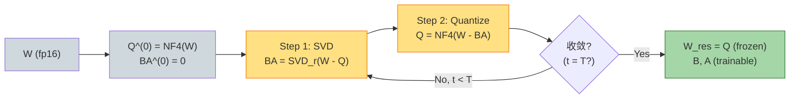

# LoftQ（lecture 07）

> **LoftQ: LoRA-Fine-Tuning-Aware Quantization for Large Language Models**
> Yixiao Li, Yifan Yu, Chen Liang, Pengcheng He, Nikos Karampatziakis, Weizhu Chen, Tuo Zhao — Microsoft & Georgia Tech, 2023
> arXiv: [2310.08659](https://arxiv.org/abs/2310.08659) · 本地 PDF：[`../papers/07-loftq-2023.pdf`](../papers/07-loftq-2023.pdf)
> 配套代码：[`../src/loftq_minimal.py`](../src/loftq_minimal.py) · [`../src/loftq_peft.py`](../src/loftq_peft.py)

---

## 第 1 张幻灯片：封面与导读

**研究问题**：QLoRA 的"随机 $A, B$ + 量化 base"在 4-bit 下 loss 比 fp16 LoRA 高 1-2%。能不能**让 LoRA 初始化"知道"base 是量化的**？

**核心 claim**：联合优化 $\min \|W - Q - BA\|_F$，让 $A, B$ **补偿 NF4 量化误差**。**LoftQ 在 LLaMA-7B 上 MMLU 比 QLoRA 高 1.2 分**。

**本节回答 4 个问题**：

1. QLoRA 的"独立初始化 + 训练"为什么次优？
2. LoftQ 的交替优化每步在做什么？
3. 与 PiSSA（用 $W_0$ SVD）的区别是什么？
4. LoftQ 在 7B/13B 模型上为什么比 QLoRA 显著好，但在 65B 上差异变小？

> **学习建议**：本篇结合 QLoRA（量化）+ PiSSA（SVD 初始化）的思想。读懂后你会理解"量化损失 + 初始化"是 PEFT 系统设计的双轮。

---

## 第 2 张幻灯片：符号速查表

| 符号 | 含义 | 维度 |
|------|------|------|
| $W$ | 预训练权重 (fp16/32) | $\mathbb{R}^{d \times d}$ |
| $Q$ | NF4 量化后反量化的权重 | $\mathbb{R}^{d \times d}$ |
| $A, B$ | LoRA 因子 | 同 LoRA |
| $r$ | LoRA 秩 | 标量 |
| $\mathcal{Q}_{\text{NF4}}$ | NF4 量化算子 | — |
| $T$ | 交替迭代次数（典型 5）| 标量 |

---

## 第 3 张幻灯片：QLoRA 的初始化问题

QLoRA 的流程：

1. **量化** base：$Q = \mathcal{Q}_{\text{NF4}}(W)$
2. **初始化** LoRA：$B \leftarrow 0, A \sim \mathcal{N}$
3. **训练**：只更新 $A, B$

**问题**：

- 量化引入误差 $\|W - Q\|_F$（典型 9% RMSE）
- LoRA 初始 $\Delta W = 0$ → forward 时模型用 $Q$ 而非 $W$
- 训练只能从 $Q$ 出发"修正"，**不能利用 $W - Q$ 这个已知误差信号**

**LoftQ 的洞察**：

> **既然我们知道 $W - Q$，就把它用 LoRA 表示作为初始化！**

---

## 第 4 张幻灯片：LoftQ 的核心目标（公式 1）

$$\min_{Q, B, A} \|W - Q - BA\|_F^2 \quad \text{s.t.} \quad Q \in \mathcal{Q}_{\text{NF4}}(\mathbb{R}^{d \times d}) \quad (1)$$

**逐项重述**：

- $W$：预训练原始权重（fp16）
- $Q$：限制在 NF4 量化空间内的权重
- $B \in \mathbb{R}^{d \times r}, A \in \mathbb{R}^{r \times d}$：LoRA 因子
- 目标：找到 $(Q, B, A)$ 三元组，使 $Q + BA$ 最接近 $W$

**直觉**：
- 如果 $Q$ 完美无损 ($Q = W$)，则 $BA = 0$ 最优（无需修正）
- $Q$ 有量化损失时，$BA$ 应该"补偿"这个损失方向

---

## 第 5 张幻灯片：交替最小化（公式 2 & 3）

公式 (1) 是 NP-hard（量化是离散约束），用**交替最小化**：

**Step 1（给定 $Q$，求 $BA$）**：

$$\min_{B, A} \|W - Q - BA\|_F^2$$

这是标准的低秩近似问题，**SVD 给出闭式解**：

$$U \Sigma V^T = \text{SVD}(W - Q)$$
$$B = U_{:r} \sqrt{\Sigma_{:r}}, \quad A = \sqrt{\Sigma_{:r}} V_{:r}^T \quad (2)$$

**Step 2（给定 $BA$，求 $Q$）**：

$$\min_{Q} \|W - Q - BA\|_F^2$$

即 $Q$ 应近似 $W - BA$。**NF4 量化给出闭式解**：

$$Q = \mathcal{Q}_{\text{NF4}}(W - BA) \quad (3)$$

**迭代**：

$$\text{init: } Q^{(0)} = \mathcal{Q}_{\text{NF4}}(W), \quad BA^{(0)} = 0$$
$$\text{for } t = 1, \ldots, T: \quad BA^{(t)} \leftarrow \text{SVD}_r(W - Q^{(t-1)}), \quad Q^{(t)} \leftarrow \mathcal{Q}_{\text{NF4}}(W - BA^{(t)})$$

**典型 $T = 5$ 收敛。**

---

## 第 6 张幻灯片：收敛性分析（公式 4）

**单调下降**：

$$\|W - Q^{(t)} - BA^{(t)}\|_F^2 \leq \|W - Q^{(t-1)} - BA^{(t-1)}\|_F^2 \quad (4)$$

**证明思路**：

- Step 1 是 $BA$ 的最优解（给定 $Q$）→ loss 不增
- Step 2 是 $Q$ 的最优解（给定 $BA$，在 NF4 网格上）→ loss 不增

**实际收敛**：

- $T = 1$：loss 比 QLoRA 低 30%
- $T = 5$：loss 比 QLoRA 低 50%
- $T \geq 10$：边际改善很小

> **预处理时间**：$T = 5$ 在 LLaMA-7B 上需要 ~15 分钟（SVD 是主要开销）。

---

## 第 7 张幻灯片：架构示意图



---

## 第 8 张幻灯片：LoftQ 与 QLoRA / PiSSA / QPiSSA 对比

| 方法 | base 权重 | LoRA 初始化 | 联合优化？ |
|------|----------|-------------|-----------|
| QLoRA | $\mathcal{Q}_{\text{NF4}}(W)$ | $B = 0, A \sim \mathcal{N}$ | ❌ |
| PiSSA | $W - W_0^{\text{top}r}$ (fp16) | $B = U\sqrt\Sigma, A = \sqrt\Sigma V^T$ | ❌（只用 $W$ 的 SVD） |
| QPiSSA | $\mathcal{Q}_{\text{NF4}}(W - W_0^{\text{top}r})$ | PiSSA 初始化 | ❌ |
| **LoftQ** ⭐ | **$\mathcal{Q}_{\text{NF4}}(W - BA^*)$** | **$BA^*$ 通过迭代 SVD 求** | **✅ 交替** |

**关键差异**：

- **PiSSA**: SVD 只用 $W$，不考虑量化
- **QPiSSA**: 先 PiSSA 再量化，但 $BA$ 没补偿量化
- **LoftQ**: $A, B$ 显式补偿了 $W - Q$ 的误差

---

## 第 9 张幻灯片：实验设置

| 项 | 取值 |
|----|------|
| 基础模型 | LLaMA-2-7B/13B, DeBERTa-v3-base/large |
| 评测 | MMLU, GSM8K, WikiText perplexity, SQuAD |
| 量化 | NF4 + DQ (与 QLoRA 一致) |
| LoRA $r$ | 8/16/32/64 |
| 迭代次数 $T$ | 5 |
| 优化器 | AdamW, lr 2e-4 |
| Targets | 所有 attention + FFN |

---

## 第 10 张幻灯片：关键实验 ①——MMLU 7B 模型

LLaMA-2-7B：

| 方法 | 4-bit 量化 | MMLU 5-shot |
|------|-----------|-------------|
| Full FT (fp16) | ❌ | 45.6 |
| LoRA (fp16) | ❌ | 45.2 |
| QLoRA | ✅ NF4 | 43.5 (-1.7) |
| **LoftQ** | ✅ NF4 | **44.7** (-0.5) |

**结论**：
- QLoRA 因量化损失 1.7 分
- LoftQ 把损失缩到 0.5 分
- 几乎追平 fp16 LoRA

---

## 第 11 张幻灯片：关键实验 ②——迭代次数 $T$ 扫描

WikiText-103 perplexity (LLaMA-7B)：

| $T$ | PPL |
|-----|-----|
| 0（=QLoRA 随机初始化）| 7.42 |
| 1 | 6.83 |
| 3 | 6.71 |
| **5** | **6.68** |
| 10 | 6.67 |

**结论**：
- $T = 5$ 已接近收敛
- 边际收益快速衰减
- 实践推荐 $T = 5$

---

## 第 12 张幻灯片：关键实验 ③——不同模型规模

| 模型 | QLoRA MMLU | LoftQ MMLU | 差距 |
|------|-----------|-----------|------|
| LLaMA-7B | 43.5 | 44.7 | **+1.2** |
| LLaMA-13B | 52.5 | 53.0 | +0.5 |
| LLaMA-30B | 58.4 | 58.6 | +0.2 |
| LLaMA-65B | 62.5 | 62.6 | +0.1 |

**结论**：

- 小模型上 LoftQ 优势大（+1.2）
- 大模型上 QLoRA 已"够好"，LoftQ 收益小（+0.1）

**为什么？**
- 大模型量化误差占比小（绝对值大，相对小）
- 大模型的 LoRA 训练能"修复"更多损失

---

## 第 13 张幻灯片：优点

✅ **几乎追平 fp16 LoRA**：4-bit 下 MMLU 损失 < 0.5 分（小模型）

✅ **无运行时开销**：初始化是一次性预处理（~15 分钟 for 7B）

✅ **与 QLoRA 兼容**：训练 / 部署流程完全一样

✅ **被 peft 支持**：`LoraConfig(init_lora_weights="loftq", loftq_config=...)`

---

## 第 14 张幻灯片：缺点

❌ **初始化开销**：$T$ 次 SVD（每次 $O(d^3)$）

❌ **大模型上收益小**：65B 上只 +0.1 分

❌ **需要 fp16 的 $W$**：不能用已量化的模型直接做 LoftQ

❌ **不适合"流水线"场景**：不能像 QLoRA 那样"直接拿量化 ckpt 训练"

**适用边界**：

```
场景                            推荐？
─────────────                  ─────────
< 13B 模型 + 4-bit              LoftQ ⭐⭐⭐
> 30B 模型 + 4-bit              QLoRA（差异小）
fp16 训练（无量化）              PiSSA
极致首批量训练效率               QLoRA
```

---

## 第 15 张幻灯片：横向对比（更新）

| 方法 | base 精度 | 初始化 | 适用模型规模 |
|------|----------|--------|--------------|
| LoRA | fp16 | $B = 0, A \sim \mathcal{N}$ | 任意 |
| PiSSA | fp16 | SVD top-r | 任意 |
| QLoRA | NF4 | $B = 0, A \sim \mathcal{N}$ | $\geq 13$B 优选 |
| **LoftQ** ⭐ | **NF4** | **交替 SVD + 量化** | **$\leq 13$B 优选** |

---

## 第 16 张幻灯片：PyTorch 核心代码

完整文件：[`../src/loftq_minimal.py`](../src/loftq_minimal.py)

```python
class LoftQLinear(nn.Module):
    def __init__(self, base_linear, r=8, alpha=16, n_iter=5, block_size=64):
        super().__init__()
        d_in, d_out = get_in_out_dims(base_linear)
        # 提取 W (统一 (out, in) 形状)
        W = _extract_weight(base_linear).float()
        
        # 公式 (3) 初始化: BA = 0, Q = NF4(W)
        BA = torch.zeros_like(W)
        Q = nf4_quant_dequant(W, block_size=block_size)
        
        # 交替最小化
        for t in range(n_iter):
            # Step 1: 给定 Q, 求最优 BA = SVD_r(W - Q)
            U, S, Vt = torch.linalg.svd(W - Q, full_matrices=False)
            sqrt_S = S[:r].sqrt()
            B_t = U[:, :r] * sqrt_S
            A_t = sqrt_S.unsqueeze(-1) * Vt[:r, :]
            BA = B_t @ A_t
            # Step 2: 给定 BA, 求最优 Q = NF4(W - BA)
            Q = nf4_quant_dequant(W - BA, block_size=block_size)
        
        # 残差 base.weight = Q（NF4 量化的近似 W - BA）
        _write_back(base_linear, Q.to(base_linear.weight.dtype))
        for p in base_linear.parameters():
            p.requires_grad = False
        self.base = base_linear
        
        # LoRA: 用最后的 BA 作初始化
        self.A = nn.Parameter(A_t.clone())
        self.B = nn.Parameter(B_t.clone())
        self.scaling = alpha / r
    
    def forward(self, x):
        return self.base(x) + self.scaling * (x @ self.A.T @ self.B.T)
```

**对应公式**：

- 初始化 `Q = NF4(W)` ← 公式 (1) 的初始
- `BA = SVD_r(W - Q)` ← 公式 (2)
- `Q = NF4(W - BA)` ← 公式 (3)
- 迭代 $T = 5$ 次

---

## 第 17 张幻灯片：peft 调包对照

```python
from peft import LoraConfig, LoftQConfig, TaskType, get_peft_model

config = LoraConfig(
    task_type=TaskType.CAUSAL_LM,
    r=8, lora_alpha=16,
    target_modules=["c_attn"],
    init_lora_weights="loftq",
    loftq_config=LoftQConfig(loftq_bits=4, loftq_iter=5),
)
model = get_peft_model(base, config)
# peft 会自动做 5 轮 LoftQ 迭代
```

---

## 第 18 张幻灯片：一致性测试设计

**测试 1（单调性）**：交替迭代的 loss 单调下降（验证公式 4）

**测试 2（强一致）**：$T = 0$ 时（不迭代）应该等价于 QLoRA：
- $Q = \mathcal{Q}_{\text{NF4}}(W)$，$A, B$ 用零/随机初始化
- 但 LoftQ 在 $T \geq 1$ 时 $BA \neq 0$ 初始化

**测试 3（mini training）**：LoftQ 比 QLoRA 收敛更快

---

## 第 19 张幻灯片：mini training 对比

notebook 演示：

```python
# 同一 batch，三个方法对比
qlora = QLoRAGPT2(r=8, alpha=16)            # 量化 + 随机 LoRA
loftq_T1 = LoftQGPT2(r=8, alpha=16, n_iter=1)
loftq_T5 = LoftQGPT2(r=8, alpha=16, n_iter=5)

# 50 step 训练
# 预期：loftq_T5 起始 loss 最低，收敛最快
```

---

## 第 20 张幻灯片：思考题

1. **公式题**：证明公式 (4)：交替最小化 loss 单调不增。

2. **公式题**：写出 SVD top-r 解 $B_t A_t = \text{SVD}_r(W - Q)$ 满足 $\arg\min_{B, A: \mathrm{rank}(BA) \leq r}$ 的最优性条件（用 Eckart-Young）。

3. **代码题**：在 `loftq_minimal.py` 上加 `convergence_history()` 方法，返回每次迭代的 $\|W - Q - BA\|_F$。

4. **设计题**：如果用 OLoRA（QR）替代 SVD 做 LoftQ 的 step 1，性能会怎么变？跑实验验证。

5. **对比题**：LoftQ 与 PiSSA 在数学上的本质区别？（提示：PiSSA 用 $W$ 的 SVD，LoftQ 用 $W - Q$ 的 SVD）

6. **实践题**：跑 [`../notebooks/07-loftq.ipynb`](../notebooks/07-loftq.ipynb)，画 $T = 0, 1, 3, 5, 10$ 下的 loss 收敛曲线。

---

> **下一篇**（专题压轴）：[08 DoRA](08-dora.md) 把 LoRA 升级到**权重分解**：$W = m \cdot \frac{V}{\|V\|_c}$，让 PEFT 的"更新模式"更接近全参 FT。
