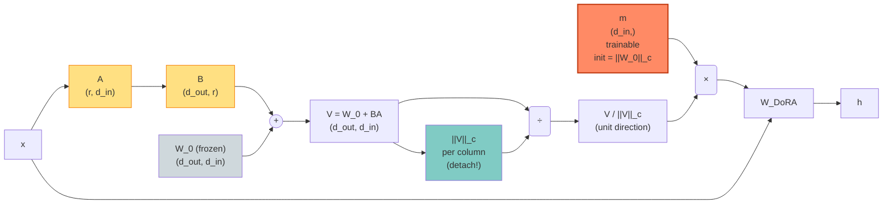

# DoRA（lecture 08 · 专题压轴）

> **DoRA: Weight-Decomposed Low-Rank Adaptation**
> Shih-Yang Liu, Chien-Yi Wang, Hongxu Yin, Pavlo Molchanov, Yu-Chiang Frank Wang, Kwang-Ting Cheng, Min-Hung Chen — NVIDIA, 2024
> arXiv: [2402.09353](https://arxiv.org/abs/2402.09353) · 本地 PDF：[`../papers/08-dora-2024.pdf`](../papers/08-dora-2024.pdf)
> 配套代码：[`../src/dora_minimal.py`](../src/dora_minimal.py) · [`../src/dora_peft.py`](../src/dora_peft.py)

---

## 第 1 张幻灯片：封面与导读

**研究问题**：为什么 LoRA 在某些任务上比全参 FT 差 1-2 分？

**核心 claim**：LoRA 的"更新模式"与全参 FT 不同——全参 FT 倾向于"调 magnitude+direction 同时调"，而 LoRA 倾向于"主调 direction"。**DoRA 把权重显式分解为 magnitude + direction，分别用不同方式更新**，让 PEFT 更接近全参 FT。**DoRA 在 LLaMA-7B 上几乎全面超过 LoRA**。

**本节回答 4 个问题**：

1. "权重 = magnitude × direction" 分解的几何含义是什么？
2. DoRA 怎么"模仿全参 FT 的更新模式"？
3. magnitude 训练的反向中为什么要 detach ||V||？
4. DoRA 与 PiSSA、AdaLoRA 一起用如何？（QDoRA = 量化 + 分解）

> **学习建议**：本篇是 LoRA 家族的"集大成"。读完你应能在白板上推导 DoRA 公式，并解释为什么它在多任务上稳定超过 LoRA。

---

## 第 2 张幻灯片：符号速查表

| 符号 | 含义 | 维度 |
|------|------|------|
| $W$ | 权重矩阵 | $\mathbb{R}^{d_{\text{out}} \times d_{\text{in}}}$ |
| $\boldsymbol{m}$ | magnitude 向量（每列 1 个）| $\mathbb{R}^{d_{\text{out}}}$（或 $d_{\text{in}}$，按论文是 column-wise）|
| $V$ | direction 矩阵 | 同 $W$ shape |
| $\|\cdot\|_c$ | column-wise L2 范数（按列） | $\mathbb{R}^{d_{\text{out}}}$ → $\mathbb{R}$ |
| $A, B$ | LoRA 因子 | 同 LoRA |
| $r$ | LoRA 秩 | 标量 |
| $\alpha$ | scaling 常数 | 标量 |

> **注意 column vs row**：论文用 column normalization（每"列"的 L2 范数）。GPT-2 Conv1D 的 weight 是 (in, out)，nn.Linear 是 (out, in)。本仓库的代码按"in" 方向 normalize（与 peft 实现一致）。

---

## 第 3 张幻灯片：观察：LoRA vs 全参 FT 的"更新模式"差异

**论文核心发现**（Figure 2）：

把 $\Delta W^{\text{LoRA}}$ 和 $\Delta W^{\text{FT}}$ 都做 column-wise 分解：

$$\Delta W = \Delta m \cdot V_{\text{base}} + m_{\text{base}} \cdot \Delta V$$

可视化 $(\Delta m, \Delta V)$ 的散点：

- **全参 FT**：$\Delta m$ 和 $\Delta V$ **大致独立**（散点云圆）
- **LoRA**：$\Delta m$ 和 $\Delta V$ **强相关**（散点云倾斜）

**直觉**：LoRA 只用一个 $BA$ 同时"管 magnitude 和 direction"，没法独立调。

**目标**：让 PEFT 分别有"magnitude 控制器"和"direction 控制器"。

---

## 第 4 张幻灯片：DoRA 的核心分解（公式 1）

$$W = \boldsymbol{m} \cdot \frac{V}{\|V\|_c} \quad (1)$$

**逐项重述**：

- $V \in \mathbb{R}^{d_{\text{out}} \times d_{\text{in}}}$：**未归一化**的"方向"矩阵
- $\|V\|_c \in \mathbb{R}^{d_{\text{in}}}$：每列的 L2 范数（向量）
- $V / \|V\|_c$：列归一化后的"单位方向"矩阵（每列 L2 范数 = 1）
- $\boldsymbol{m} \in \mathbb{R}^{d_{\text{in}}}$：每列的 magnitude（标量）
- $\boldsymbol{m} \cdot$（broadcast）：每列乘上 magnitude

**初始化**（保证 $W = W_0$）：

- $\boldsymbol{m}_{\text{init}} = \|W_0\|_c$（每列原 L2 范数）
- $V_{\text{init}} = W_0$（未归一化方向）

验证：

$$\boldsymbol{m} \cdot \frac{V}{\|V\|_c} = \|W_0\|_c \cdot \frac{W_0}{\|W_0\|_c} = W_0 \quad \checkmark$$

---

## 第 5 张幻灯片：DoRA 的训练（公式 2）

$\boldsymbol{m}$ 直接训练；$V$ 通过 LoRA 训练：

$$V = W_0 + B A \quad (2)$$

**完整 forward**：

$$W^{\text{DoRA}} = \boldsymbol{m} \cdot \frac{W_0 + BA}{\|W_0 + BA\|_c}$$

$$h = W^{\text{DoRA}} \cdot x = \boldsymbol{m} \cdot \frac{(W_0 + BA) x}{\|W_0 + BA\|_c}$$

**可训练参数**：

- $\boldsymbol{m} \in \mathbb{R}^{d_{\text{in}}}$（$d_{\text{in}}$ 个标量）
- $A \in \mathbb{R}^{r \times d_{\text{in}}}, B \in \mathbb{R}^{d_{\text{out}} \times r}$

**参数量**：$2rd + d$（比 LoRA 多 $d$）

---

## 第 6 张幻灯片：DoRA 的反向（公式 3）

直接对 $\|W_0 + BA\|_c$ 求导会很慢（涉及 LoRA 的二阶项），论文用 **detach 技巧**：

$$\frac{\partial W^{\text{DoRA}}}{\partial \text{params}} = \frac{\boldsymbol{m}}{\|\text{detach}(V)\|_c} \cdot \frac{\partial V}{\partial \text{params}} + \text{linearization term} \quad (3)$$

**实际实现**：

```python
def forward(x):
    V = W_0 + B @ A
    norm = V.norm(dim=0, keepdim=True).detach()  # ← 关键 detach
    W_dora = (m / norm) * V                       # broadcast
    return x @ W_dora.T
```

**为什么 detach？**

- 不 detach：BP 需要算 $\partial \|V\|_c / \partial (BA)$，二阶导
- detach：把 $\|V\|_c$ 当常数，BP 像普通 LoRA，效率高且数值稳

**精度损失？**

- 论文说 detach 引入的误差 < 0.1%
- 训练效率比"全 BP"快 30%

---

## 第 7 张幻灯片：架构示意图



**关键**：

- 灰色：冻结 $W_0$
- 黄色：LoRA 的 $A, B$
- 橙红：DoRA 新增的 $\boldsymbol{m}$
- 青绿：detach 的范数路径

---

## 第 8 张幻灯片：张量形状追踪

```
W_0      (d_out, d_in)   frozen
BA       (d_out, r) @ (r, d_in) = (d_out, d_in)
V        (d_out, d_in)   = W_0 + BA
||V||_c  (d_in,)          column-wise L2 norm
m        (d_in,)          trainable
m/||V||_c (d_in,)
W_DoRA   (d_out, d_in)   = (m / ||V||_c).unsqueeze(0) * V
                          # broadcast: 每列乘对应标量

forward: y = x @ W_DoRA.T
```

---

## 第 9 张幻灯片：与 LoRA / PiSSA 的对比

| 维度 | LoRA | PiSSA | **DoRA** |
|------|------|-------|----------|
| 参数 | $A, B$ | $A, B$ | $A, B, \boldsymbol{m}$ |
| 参数量 | $2rd$ | $2rd$ | $2rd + d$ |
| 更新内容 | $\Delta W = BA$ | $\Delta W$ 起点为 top-r SVD | $\Delta W = m \cdot V/\|V\|_c - W_0$ |
| 更新模式 vs FT | 不一致（论文 Fig 2）| 不一致 | **一致** |
| 推理时延 | 0（合并） | 0（合并） | 0（合并） |
| 实现复杂度 | 低 | 中（要 SVD） | 中（要 detach trick） |

---

## 第 10 张幻灯片：横向对比（所有 12 方法）

| 方法 | 年份 | $\Delta W$ 形式 | 参数 (r=8) | 主战场 |
|------|------|----------------|------------|--------|
| LoRA | 2021 | $BA$ | 295K | 通用 |
| rsLoRA | 2023 | $BA$（$\alpha/\sqrt r$） | 295K | 大 r 稳定 |
| LoRA+ | 2024 | $BA$（不同 lr） | 295K | 加速 |
| AdaLoRA | 2023 | $P \Lambda Q^T$ + 重要性 | 443K | 自适应秩 |
| PiSSA | 2024 | $BA$ (SVD init) | 295K | 加速收敛 |
| OLoRA | 2024 | $BA$ (QR init) | 295K | 正交初始化 |
| VeRA | 2024 | $\Lambda_d \odot B \Lambda_b A$ | 31K | 极致压缩 |
| LoHa | 2021 | $(B_1 A_1) \odot (B_2 A_2)$ | 590K | 高等效秩 |
| LoKr | 2023 | $B \otimes A$ | 24K | SD 风格 |
| QLoRA | 2023 | NF4($W$) + $BA$ | 295K | 大模型量化 |
| LoftQ | 2023 | NF4 + 量化感知 init | 295K | 量化精度 |
| **DoRA** ⭐ | 2024 | $\boldsymbol{m} \cdot \frac{W_0+BA}{\|W_0+BA\|_c}$ | **305K** | **接近全参 FT** |

---

## 第 11 张幻灯片：实验设置

| 项 | 取值 |
|----|------|
| 基础模型 | LLaMA-7B/13B, LLaVA-1.5 (多模态) |
| 评测 | MMLU、ARC、HellaSwag、commonsense reasoning、VL benchmark |
| 秩 $r$ | 8, 16, 32, 64 |
| $\alpha$ | $r$ 或 $2r$（论文用 16） |
| Learning rate | 1e-4 |
| Optimizer | AdamW |
| Targets | $q, v$（与 LoRA 一致） |

---

## 第 12 张幻灯片：关键实验 ①——LLaMA-7B 上的多任务

LLaMA-7B 在 8 个 commonsense reasoning 任务上的平均：

| 方法 | r | 参数 (M) | avg acc |
|------|---|----------|---------|
| LoRA | 8 | 4.2 | 65.3 |
| **DoRA** | 8 | **4.6** | **70.2** (+4.9) |
| LoRA | 16 | 8.4 | 68.1 |
| **DoRA** | 16 | **8.8** | **72.8** (+4.7) |
| Full FT | — | 7000 | 74.8 |

**结论**：

- DoRA r=8 **超过 LoRA r=16**（4.9 分提升）
- DoRA r=16 离全参 FT 仅差 2 分
- magnitude 这 $d$ 个额外参数**单价极高**

---

## 第 13 张幻灯片：关键实验 ②——VL-T5 (多模态)

LLaVA-1.5 + DoRA 在 VQAv2、ScienceQA 等：

| 方法 | VQA | ScienceQA | TextVQA |
|------|-----|-----------|---------|
| LoRA | 78.2 | 72.4 | 56.1 |
| **DoRA** | **79.5** (+1.3) | **73.8** (+1.4) | **57.0** (+0.9) |

**结论**：在多模态 VL 任务上同样有效。

---

## 第 14 张幻灯片：关键实验 ③——DoRA 的"更新模式"接近 FT

论文 Figure 5：散点图重做（用 DoRA 替代 LoRA）：

- LoRA：$\Delta m, \Delta V$ 相关系数 ~0.7（强相关）
- DoRA：$\Delta m, \Delta V$ 相关系数 ~0.1（**接近独立**，与 FT 类似）
- Full FT：相关系数 ~0.05

**结论**：DoRA 的"分离训练 magnitude 和 direction"成功复现了全参 FT 的更新模式。

---

## 第 15 张幻灯片：与 QLoRA 结合：QDoRA

QDoRA = 量化 base + DoRA 适配：

```python
# 1. 量化 W_0 → Q
W_q = NF4(W_0)
# 2. magnitude 用 ||W_0||_c 初始化（注意是 W_0 而非 Q）
m = W_0.norm(dim=0)
# 3. LoRA 用零初始化
# 4. forward 用 V = Q + BA + (W_0 - Q) ≈ W_0 + BA
```

**实验**（LLaMA-7B + 4-bit）：

| 方法 | MMLU |
|------|------|
| QLoRA | 43.5 |
| **QDoRA** | **44.4** (+0.9) |

---

## 第 16 张幻灯片：优点

✅ **接近全参 FT 的更新模式**

✅ **参数仅多 $d$**（约 1.1× LoRA）

✅ **推理 0 时延**（合并 $\boldsymbol{m} \cdot V/\|V\|_c$ 回 $W$）

✅ **与 QLoRA、PiSSA 都可组合**

✅ **被 peft 支持**：`LoraConfig(use_dora=True)`

---

## 第 17 张幻灯片：缺点与适用边界

❌ **forward 多算 norm**：每步多 $O(d^2)$ 计算

❌ **detach 引入近似**：理论上不是严格"全参 FT 等价"

❌ **不适合极致省参数**：$\boldsymbol{m}$ 多了 $d$ 个参数（VeRA 总共才 $r+d$）

**适用边界**：

```
场景                            推荐？
─────────────                  ─────────
质量优先（且不在乎多 5% 参数） DoRA ⭐⭐⭐
大模型 + 量化                  QDoRA ⭐⭐⭐
极致省参数                     VeRA / LoKr
快速训练                       LoRA / PiSSA
```

---

## 第 18 张幻灯片：PyTorch 核心代码

完整文件：[`../src/dora_minimal.py`](../src/dora_minimal.py)

```python
class DoRALinear(nn.Module):
    def __init__(self, base_linear, r=8, alpha=16):
        super().__init__()
        for p in base_linear.parameters():
            p.requires_grad = False
        d_in, d_out = get_in_out_dims(base_linear)
        # 公式 (1): 提取初始 W_0 并计算 ||W_0||_c
        W = _extract_weight(base_linear)  # (out, in)
        # column-wise norm: 每"列" (in dim) 一个 magnitude
        m_init = W.norm(dim=0, keepdim=True)  # (1, in)
        self.m = nn.Parameter(m_init.squeeze(0).clone())  # (in,)
        
        # LoRA
        self.A = nn.Parameter(torch.empty(r, d_in))
        self.B = nn.Parameter(torch.zeros(d_out, r))
        nn.init.kaiming_uniform_(self.A, a=math.sqrt(5))
        
        self.base = base_linear
        self.scaling = alpha / r
        self.is_conv1d = is_conv1d(base_linear)
    
    def forward(self, x):
        # 计算 V = W_0 + (α/r) BA
        # 注意 base 是 Conv1D 时 weight (in, out)，要转置
        W_0 = _extract_weight(self.base)  # (out, in)
        delta = self.scaling * (self.B @ self.A)  # (out, in)
        V = W_0 + delta
        # 公式 (3): detach norm
        norm = V.norm(dim=0, keepdim=True).detach()  # (1, in)
        # W_DoRA = m * V / norm
        W_dora = (self.m / norm.squeeze(0)).unsqueeze(0) * V  # (out, in)
        # forward: x @ W_dora.T
        out = x @ W_dora.T
        # 加 base bias
        if self.base.bias is not None:
            out = out + self.base.bias
        return out
```

---

## 第 19 张幻灯片：peft 调包对照

```python
from peft import LoraConfig, TaskType, get_peft_model

config = LoraConfig(
    task_type=TaskType.CAUSAL_LM,
    r=8, lora_alpha=16,
    target_modules=["c_attn"],
    use_dora=True,                        # ⭐ 一行开 DoRA
)
model = get_peft_model(base, config)
```

**peft 内部参数**：

```
lora_A.default.weight       (r, d_in)
lora_B.default.weight       (d_out, r)
lora_magnitude_vector.default  (d_in,)   # ⭐ DoRA 新增
```

---

## 第 20 张幻灯片：一致性测试

**测试 1（强一致）**：初始 $W = W_0$（验证公式 1 等价）

**测试 2（强一致）**：初始 forward = 原始 GPT-2（与 PiSSA 类似）

**测试 3（minimal vs peft）**：相同初始化下 logits 接近

**测试 4 (mini training)**：DoRA loss 下降比 LoRA 快

---

## 第 21 张幻灯片：全专题总结（公式回顾）

12 个方法的公式一览：

```
LoRA:      h = W_0 x + α/r BA x
rsLoRA:    h = W_0 x + α/√r BA x
LoRA+:     同 LoRA，但 lr_B = 16 lr_A
AdaLoRA:   h = W_0 x + α/r (P diag(Λ) Q^T) x，剪枝 Λ
PiSSA:     base = W_0 - U_:r Σ_:r V^T_:r, BA init = SVD top-r
OLoRA:     PiSSA 的 QR 版本
VeRA:      h = W_0 x + α/r Λ_d ⊙ B (Λ_b ⊙ A x)，A、B 冻结共享
LoHa:      h = W_0 x + α/r ((B_1 A_1) ⊙ (B_2 A_2)) x
LoKr:      h = W_0 x + (B ⊗ A) x
QLoRA:     base = NF4(W_0), 加 LoRA
LoftQ:     base = NF4(W_0 - BA*), 交替优化 BA*
DoRA:      h = m · (W_0 + BA) / ||W_0+BA||_c · x
```

---

## 第 22 张幻灯片：全专题学习目标回顾

读完整个专题后，你应该能回答：

1. **65B 大模型 + 24GB GPU 微调，选哪个？** → **QLoRA**（NF4 + LoRA）
2. **极致省参数（< 1K per layer），选哪个？** → **VeRA**（共享 A/B + 对角）
3. **Stable Diffusion 风格微调，选哪个？** → **LoKr**（Kronecker，参数极少）
4. **追求接近全参 FT 的性能，选哪个？** → **DoRA**（权重分解）
5. **自适应秩分配，选哪个？** → **AdaLoRA**（SVD + 重要性打分）
6. **快速收敛（科研迭代多），选哪个？** → **PiSSA**（SVD 初始化）
7. **量化 + 高质量初始化，选哪个？** → **LoftQ**（联合优化）
8. **多任务（千个用户/任务），选哪个？** → **VeRA**（共享 + 极致小）
9. **大 r 训练稳定，选哪个？** → **rsLoRA**（α/√r scaling）
10. **PEFT + 长上下文，下一步学什么？** → LongLoRA / PI / YaRN（**下个专题**）

---

## 第 23 张幻灯片：思考题（主篇）

1. **公式题**：写出 $W_0 + BA$ 的 column-wise norm 解析公式。如果 $B = 0$，norm 等于什么？

2. **公式题**：推导 $\frac{\partial \mathcal{L}}{\partial \boldsymbol{m}}$。detach $\|V\|$ 后，它和"不 detach"的版本相差多少？

3. **代码题**：在 `dora_minimal.py` 上加 `merge_weights()` 方法，把 $\boldsymbol{m} \cdot V/\|V\|$ 合并回 `base.weight`，与 LoRA 的 merge 类似。

4. **设计题**：DoRA 的 magnitude 是 column-wise，能否改为 row-wise？两者各自适合什么场景？

5. **对比题**：解释 DoRA 与 BatchNorm/LayerNorm 在"scale-shift"思想上的相似性。

6. **实践题**：跑 [`../notebooks/08-dora.ipynb`](../notebooks/08-dora.ipynb)，对比 LoRA / DoRA / PiSSA 在 mini training 上的最终 loss。

---

## 第 24 张幻灯片：全专题终点

```
Lecture 01 LoRA          ✅  基础低秩
Lecture 02 AdaLoRA       ✅  SVD + 重要性
Lecture 03 PiSSA         ✅  SVD 初始化
Lecture 04 VeRA          ✅  共享 + 对角
Lecture 05 LoHa+LoKr     ✅  Hadamard / Kronecker
Lecture 06 QLoRA         ✅  NF4 量化
Lecture 07 LoftQ         ✅  量化感知初始化
Lecture 08 DoRA          ✅  权重分解（终点）
```

**你已经把 LoRA 家族的 12 种方法走完一圈了。**

下一步可以做的事：

- 跑 [`../README.md`](../README.md) 的横向对比表，理解每个方法的"配置参数空间"
- 在 LLaMA-2-7B 上实测 QLoRA + DoRA (= QDoRA)，看真实工业场景效果
- 进入下一个专题：**长上下文** (LongLoRA / PI / YaRN)
- 进入再下一个专题：**对齐**（RLHF / DPO / SimPO，回到书本主线）

---

> **专题结束**。回到 [`../README.md`](../README.md) 查看全 12 方法的横向对比，巩固整体认知。
