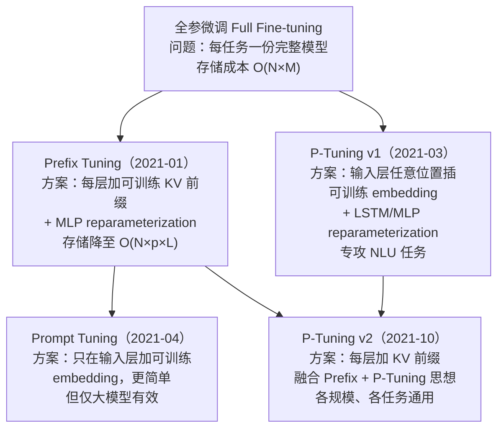

# Prompt-Tuning-Family 专题

> 配套《大模型算法：强化学习、微调与对齐》ISBN 9787121500725 第 2.1.4 节"基于 Prompt 的微调"。

## 1. 专题简介

本专题覆盖"基于 Prompt 的参数高效微调"四篇经典论文。它们共同的核心思想是：**冻结预训练大模型，只训练一小段"软提示"（soft prompt）参数**，从而在多任务部署时大幅降低存储与计算开销。

四篇论文按时间顺序为：

| 序号 | 方法 | 论文 | 时间 | 单位 |
|------|------|------|------|------|
| ① | **Prefix Tuning** | Optimizing Continuous Prompts for Generation | 2021-01 | Stanford |
| ② | **P-Tuning v1** | GPT Understands, Too | 2021-03 | Tsinghua + 智源 |
| ③ | **Prompt Tuning** | The Power of Scale for Parameter-Efficient Prompt Tuning | 2021-04 | Google |
| ④ | **P-Tuning v2** | Prompt Tuning Can Be Comparable to Fine-tuning Universally | 2021-10 | Tsinghua |

## 2. 演进关系图



## 3. 统一记号表

本专题在所有 lecture 中保持以下记号一致：

| 符号 | 含义 | 维度 |
|------|------|------|
| $L$ | Transformer 层数 | 标量（如 GPT-2 base 为 12） |
| $H$ | 注意力头数 | 标量（如 GPT-2 base 为 12） |
| $d$ | 隐层维度 | 标量（如 GPT-2 base 为 768） |
| $d_h$ | 单头维度 = $d / H$ | 标量（如 GPT-2 base 为 64） |
| $n$ | 输入序列长度（不含 prompt） | 标量 |
| $p$ | 可训练 prompt 的长度（token 数） | 标量 |
| $\mathbf{e}_i$ | 第 $i$ 个 token 的 embedding 向量 | $\mathbb{R}^d$ |
| $\mathbf{E}$ | 全部输入 token 的 embedding 矩阵 | $\mathbb{R}^{n \times d}$ |
| $\mathbf{h}_i^{(\ell)}$ | 第 $\ell$ 层 Transformer 输出的第 $i$ 个位置的隐状态 | $\mathbb{R}^d$ |
| $\mathbf{P}$ | 可训练 prompt embedding 矩阵 | 因方法而异 |
| $\boldsymbol{\theta}_{\mathrm{LM}}$ | 预训练 LM 全部参数（**冻结**） | — |
| $\boldsymbol{\phi}$ | 可训练参数（仅 prompt 相关） | — |
| $\mathbf{Q}, \mathbf{K}, \mathbf{V}$ | 自注意力的 query/key/value | $\mathbb{R}^{n \times d_h}$（单头） |

> **每篇 lecture 头部还会给出自己的"扩展记号表"**，但凡用到上述符号，含义保持一致。

## 4. 推荐学习顺序

按**概念由易到难**（推荐）：

1. **Prompt Tuning**（最简单）—— 理解"什么是软提示"
2. **Prefix Tuning** —— 理解"为什么要在每层加"
3. **P-Tuning v1** —— 理解"为什么需要 reparameterization"
4. **P-Tuning v2** —— 理解"如何统一前面三种"

按**论文发表时间**（仅作历史参考）：① → ② → ③ → ④

## 5. 四种方法横向对比

| 维度 | Prefix Tuning | Prompt Tuning | P-Tuning v1 | P-Tuning v2 |
|------|---------------|---------------|-------------|-------------|
| **可训练参数位置** | 每层 KV 前缀 | 仅输入层 embedding | 输入层任意位置 embedding | 每层 KV 前缀 |
| **可训练参数量级**（公式） | $L \cdot p \cdot 2 d$ | $p \cdot d$ | $p \cdot d$ + reparam 网络 | $L \cdot p \cdot 2 d$ |
| **数值示例**（GPT-2，$p=10$） | 184,320 + MLP | 7,680 | 7,680 + ~4M LSTM | 184,320 |
| **reparameterization** | MLP（推理时可丢弃） | 无 | LSTM 或 MLP（推理时可丢弃） | 通常无 |
| **是否需要大模型才有效** | 否 | **是**（需 ≥ 10B） | 否 | 否 |
| **任务类型** | 生成 | 生成 + 分类 | NLU（分类、抽取） | 通用 |
| **与全参微调 gap** | 小 | 大模型下可比 | NLU 任务下可比 | 各规模均可比 |
| **核心 paper claim** | 0.1% 参数追上全参 | scale 越大 gap 越小 | GPT 在 NLU 上也很强 | 一种 prompt 适配所有规模 |

## 6. 使用说明

### 读 lecture
从 [`lectures/02-prompt-tuning.md`](lectures/02-prompt-tuning.md) 开始（最简单），然后 [`01-prefix-tuning.md`](lectures/01-prefix-tuning.md) → [`03-p-tuning.md`](lectures/03-p-tuning.md) → [`04-p-tuning-v2.md`](lectures/04-p-tuning-v2.md)。

### 看代码
每篇方法有两个 .py：
- `*_minimal.py`：**手写最小实现**（不依赖 peft，看清算法本质）
- `*_peft.py`：**peft 调包对照**（看清生产实践）

建议先读 minimal 再看 peft，最后跑一致性测试 `src/tests/test_*_consistency.py`。

### 跑 notebook
```powershell
python -m pip install -r environment/requirements.txt
python environment/verify_env.py
jupyter lab
```
打开 `notebooks/02-prompt-tuning.ipynb` 开始。

### 跑一致性测试
```powershell
python src/tests/test_prompt_consistency.py
python src/tests/test_prefix_consistency.py
python src/tests/test_p_tuning_consistency.py
python src/tests/test_p_tuning_v2_consistency.py
```

## 7. 目录结构

```
prompt-tuning-family/
├── README.md                     # 本文件
├── papers/                       # arXiv 原版 PDF
│   ├── 01-prefix-tuning-2021.pdf
│   ├── 02-prompt-tuning-2021.pdf
│   ├── 03-p-tuning-2021.pdf
│   └── 04-p-tuning-v2-2022.pdf
├── lectures/                     # 中文 PPT 风格教学
├── src/                         # PyTorch 实现
│   ├── common.py                 # 共用工具
│   ├── *_minimal.py              # 手写最小实现
│   ├── *_peft.py                 # peft 调包对照
│   └── tests/                    # 数值一致性测试
├── notebooks/                    # Jupyter 交互教学
└── environment/                  # 依赖与自检脚本
    ├── requirements.txt
    ├── README.md
    └── verify_env.py
```

## 8. 重要技术备注

本专题代码使用 **transformers 5.x** 接口（关键变化：`past_key_values` 类型为 `DynamicCache`）。若您使用 4.x 版，需要把 `DynamicCache(ddp_cache_data=kv_list)` 替换为 `tuple(kv_list)`。详见 [`environment/README.md`](environment/README.md)。
