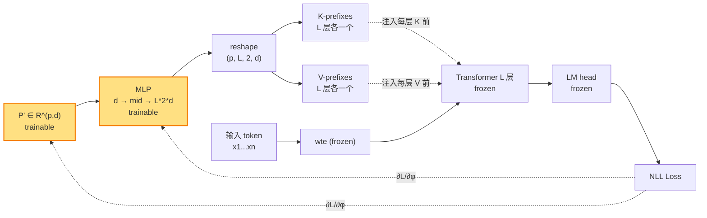

# Prefix Tuning（lecture 01）

> **Prefix-Tuning: Optimizing Continuous Prompts for Generation**
> Xiang Lisa Li, Percy Liang — Stanford NLP, 2021
> arXiv: [2101.00190](https://arxiv.org/abs/2101.00190) · 本地 PDF：[`../papers/01-prefix-tuning-2021.pdf`](../papers/01-prefix-tuning-2021.pdf)
> 配套代码：[`../src/prefix_tuning_minimal.py`](../src/prefix_tuning_minimal.py) · [`../src/prefix_tuning_peft.py`](../src/prefix_tuning_peft.py)

---

## 第 1 张幻灯片：封面与导读

**研究问题**：能否用 0.1% 的可训练参数，让大模型在**生成任务**上追平全参微调？

**核心 claim**：在 Transformer 的**每一层** self-attention 的 K、V cache **前面**拼接一段可训练的连续向量（"prefix"），即可达成。**关键技巧：用 MLP 做 reparameterization 解决直接训练不稳的问题。**

**本节回答 5 个问题**：

1. 与 Prompt Tuning（lecture 02）相比，为什么要 *每层* 都加 prefix？
2. 为什么需要 reparameterization？不用 MLP 直接学行不行？
3. 在 KV 而非 input embedding 上加 prefix，数学上是怎么实现的？
4. 参数量与可压缩到极致是多少？
5. 实验上在哪些场景比 Prompt Tuning 强？

> **学习建议**：如果你已读过 [`02-prompt-tuning.md`](02-prompt-tuning.md)，本篇核心在于"为什么 Prompt Tuning 的'输入层方案'不够，需要扩展到每一层"。

---

## 第 2 张幻灯片：符号速查表（置顶可回查）

| 符号 | 含义 | 维度 | 首次出现 |
|------|------|------|----------|
| $L$ | Transformer 层数 | 标量（GPT-2 base = 12） | 公式 (2) |
| $H$ | 注意力头数 | 标量（GPT-2 base = 12） | 公式 (2) |
| $d$ | 模型隐层维度 | 标量（GPT-2 base = 768） | 公式 (1) |
| $d_h$ | 单头维度 = $d / H$ | 标量（GPT-2 base = 64） | 公式 (1) |
| $n$ | 输入序列长度（不含 prefix） | 标量 | 公式 (1) |
| $p$ | **prefix 长度** | 标量（典型 5-20） | 公式 (2) |
| $\ell$ | 层编号 | $\ell \in \{1, \dots, L\}$ | 公式 (2) |
| $h$ | 头编号 | $h \in \{1, \dots, H\}$ | 公式 (2) |
| $\mathbf{Q}_h^{(\ell)}$ | 第 $\ell$ 层第 $h$ 头的 query 矩阵 | $\mathbb{R}^{n \times d_h}$ | 公式 (1) |
| $\mathbf{K}_h^{(\ell)}, \mathbf{V}_h^{(\ell)}$ | 第 $\ell$ 层第 $h$ 头的 key、value | $\mathbb{R}^{n \times d_h}$ | 公式 (1) |
| $\mathbf{P}_{\theta, h}^{(\ell, K)}$ | **可训练** 的 K-prefix（第 $\ell$ 层第 $h$ 头） | $\mathbb{R}^{p \times d_h}$ | 公式 (2) |
| $\mathbf{P}_{\theta, h}^{(\ell, V)}$ | **可训练** 的 V-prefix（与 K-prefix 独立） | $\mathbb{R}^{p \times d_h}$ | 公式 (2) |
| $\mathbf{P}'_{\theta'}$ | reparameterization 之前的"低维 prefix" | $\mathbb{R}^{p \times d}$ | 公式 (3) |
| $\mathrm{MLP}_\phi(\cdot)$ | reparameterization 的 MLP（推理时可丢） | $\mathbb{R}^d \to \mathbb{R}^{L \cdot 2 \cdot d}$ | 公式 (3) |
| $\boldsymbol{\theta}_{\mathrm{LM}}$ | 预训练 LM 全部参数（**冻结**） | — | 公式 (4) |
| $\boldsymbol{\phi}$ | 可训练参数（$\mathbf{P}'_{\theta'}$ + MLP） | — | 公式 (4) |

> 全篇凡出现 $\mathbf{P}_{\theta, h}^{(\ell, K)}$ 这种花哨记号，它就是"第 $\ell$ 层第 $h$ 头的 K-prefix"，没别的。

---

## 第 3 张幻灯片：背景——生成任务的微调成本

**场景**：用 GPT-2 / BART 做 NLG（自然语言生成），如：

- table-to-text（表格转描述）：WebNLG、DART、E2E
- summarization：XSum、CNN/DM
- dialog

**全参微调的问题**：

- GPT-2 medium（354M） × N 任务 → 存储 N × 1.4 GB
- 每次任务切换都要重载整个模型
- 即使 LoRA（2021 后期才出）也比 prefix tuning 重

**前作 Prompt Design（GPT-3 few-shot）的局限**：

- 离散 token prompt 上限低，在 GPT-2 这种小模型上几乎无效
- prompt 设计需要专家 + 多次试错

**自然问题**：能否找到"自动化、连续、参数极少"的微调范式？

---

## 第 4 张幻灯片：背景——离散 prompt 与"连续 prompt"

GPT-3 文本 prompt：

```
Translate English to French.
English: cheese
French: fromage
English: hello
French: ?
```

**问题**：要让 GPT-2 这种小模型也用 prompt 做生成，离散 prompt 太弱，怎么办？

**作者的想法**：

> 把 prompt 放到**连续空间**，让梯度去"找最优 prompt"。

但只在输入层加（即 Prompt Tuning 的做法）作者**没试过**——这篇论文比 Prompt Tuning 早 3 个月，作者押注的是"每层都需要"。

---

## 第 5 张幻灯片：核心思想（直觉）

> **一句话**：在每一层 Transformer 的 self-attention K、V 缓存**之前**拼接一段可训练 prefix。

**为什么作用在 KV 而非输入 embedding？**

- self-attention 中：$\mathrm{Attn}(Q, K, V) = \mathrm{softmax}(QK^\top / \sqrt{d_h}) V$
- 修改 K、V 等价于"在每个 query 看到的上下文中多塞 $p$ 个虚拟 token"
- 比起改输入 embedding 后让信号经过所有层传递，**直接改 KV 更激进**——每层都强制干预

**为什么每层都加？**

作者用 GPT-2 base（124M）试验，发现只在输入层加（即"embedding-only" baseline）效果差 4-5 BLEU。小模型上"输入层一次干预"不够，需要"每层强制干预"。

---

## 第 6 张幻灯片：核心思想（一图概括）

```
Layer 1:    [ p1_1 p2_1 p3_1 ...| K_1  K_2 ... K_n ]   ← K (with prefix)
            [ q1_1 q2_1 q3_1 ...| V_1  V_2 ... V_n ]   ← V (with prefix)
                  ↑↑↑↑↑↑↑↑                            
            trainable prefix
                  
Layer 2:    [ p1_2 p2_2 p3_2 ...| K_1  K_2 ... K_n ]
            [ q1_2 q2_2 q3_2 ...| V_1  V_2 ... V_n ]
                  ↑↑↑↑↑↑↑↑
                  
   ⋮
   
Layer L:    [ p1_L p2_L p3_L ...| K_1  K_2 ... K_n ]
            [ q1_L q2_L q3_L ...| V_1  V_2 ... V_n ]
                  ↑↑↑↑↑↑↑↑
                  
input ─→  e1, e2, ..., en   ← 原始 token embedding（冻结，不动）
```

每层有**独立**的 K-prefix 和 V-prefix。Query 仍来自原始 token，不修改。

---

## 第 7 张幻灯片：关键设计 ① ——作用在 K、V

**标准 self-attention（无 prefix）**：

$$\mathrm{Attn}(\mathbf{Q}, \mathbf{K}, \mathbf{V}) = \mathrm{softmax}\!\left(\frac{\mathbf{Q}\mathbf{K}^\top}{\sqrt{d_h}}\right) \mathbf{V} \quad (1)$$

**逐项重述**：

- $\mathbf{Q} \in \mathbb{R}^{n \times d_h}$：query 矩阵，$n$ 是序列长度，$d_h$ 是单头维度
- $\mathbf{K} \in \mathbb{R}^{n \times d_h}$：key 矩阵
- $\mathbf{V} \in \mathbb{R}^{n \times d_h}$：value 矩阵
- $\mathbf{Q}\mathbf{K}^\top \in \mathbb{R}^{n \times n}$：注意力 logit 矩阵
- $\sqrt{d_h}$：缩放因子，防止 logit 过大让 softmax 饱和
- 输出 $\in \mathbb{R}^{n \times d_h}$：每个位置的注意力加权 value

（以上 4 行重述了第 2 张速查表中所有用到的符号。）

**Prefix Tuning 的修改**：把 $\mathbf{K}, \mathbf{V}$ 替换为带 prefix 的版本（下一张幻灯片）。

---

## 第 8 张幻灯片：方法公式 (2)——带 prefix 的注意力

$$\mathrm{head}_h^{(\ell)} = \mathrm{Attn}\!\Bigl(\mathbf{Q}_h^{(\ell)},\ \bigl[\mathbf{P}_{\theta, h}^{(\ell, K)}; \mathbf{K}_h^{(\ell)}\bigr],\ \bigl[\mathbf{P}_{\theta, h}^{(\ell, V)}; \mathbf{V}_h^{(\ell)}\bigr]\Bigr) \quad (2)$$

**逐项重述**（每个符号都来自第 2 张速查表）：

- $\mathrm{head}_h^{(\ell)} \in \mathbb{R}^{n \times d_h}$：第 $\ell$ 层第 $h$ 个头的注意力输出
- $\mathbf{Q}_h^{(\ell)} \in \mathbb{R}^{n \times d_h}$：第 $\ell$ 层第 $h$ 头的 query（**不**含 prefix，原始 token 算出来的）
- $\mathbf{K}_h^{(\ell)} \in \mathbb{R}^{n \times d_h}$：第 $\ell$ 层第 $h$ 头的 key（原始 token 算出来的）
- $\mathbf{V}_h^{(\ell)} \in \mathbb{R}^{n \times d_h}$：第 $\ell$ 层第 $h$ 头的 value
- $\mathbf{P}_{\theta, h}^{(\ell, K)} \in \mathbb{R}^{p \times d_h}$：**可训练**的 K-prefix，长度 $p$，给第 $\ell$ 层第 $h$ 个头用
- $\mathbf{P}_{\theta, h}^{(\ell, V)} \in \mathbb{R}^{p \times d_h}$：**可训练**的 V-prefix（与 K-prefix 形状相同但独立）
- $[\,;\,]$：沿序列维度拼接，结果 $\in \mathbb{R}^{(p+n) \times d_h}$
- $\ell \in \{1, \dots, L\}$：层编号；$h \in \{1, \dots, H\}$：头编号

**关键观察**：Q 没动；只是 K、V 的可见上下文长度变成 $p + n$。

**参数量**（朴素版，无 reparameterization）：

$$|\mathbf{P}^{(\cdot, K)}| + |\mathbf{P}^{(\cdot, V)}| = L \cdot H \cdot p \cdot d_h \cdot 2 = L \cdot p \cdot 2 d$$

（因为 $H \cdot d_h = d$）

GPT-2 base、$p=10$：$12 \cdot 10 \cdot 2 \cdot 768 = 184{,}320$ 个可训练参数（约 0.15% 的 LM 参数量）。

---

## 第 9 张幻灯片：关键设计 ②——为什么要 reparameterization？

**朴素做法**：直接定义 `nn.Parameter` of shape $(L, 2, p, d)$，让 AdamW 训练它。

**作者的实验观察**：

- 直接训练**非常不稳定**，loss 容易发散
- 学习率难调：大了爆，小了收敛慢
- 收敛后的解对随机种子敏感

**作者的诊断**：

> 那 $L \times p \times 2 \times d \approx 18$K 个参数虽然不多，但**没有归纳偏置**——它们之间应该有结构（同一层的 prefix 应该相关、相邻层的 prefix 应该相似），直接学不到这些结构。

**解决方案**：把"大 prefix"参数化为"小 prefix + MLP 投影"。

---

## 第 10 张幻灯片：关键设计 ③——MLP reparameterization

**公式 (3)**：

$$\bigl[\mathbf{P}_{\theta}^{(1, K)}; \mathbf{P}_{\theta}^{(1, V)}; \dots; \mathbf{P}_{\theta}^{(L, K)}; \mathbf{P}_{\theta}^{(L, V)}\bigr] = \mathrm{MLP}_\phi\!\bigl(\mathbf{P}'_{\theta'}\bigr) \quad (3)$$

**逐项重述**：

- 等号左边：所有层、所有 K/V 的 prefix **拼接成一个大矩阵**。维度 $\in \mathbb{R}^{p \times (L \cdot 2 \cdot d)}$
- $\mathbf{P}'_{\theta'} \in \mathbb{R}^{p \times d}$：**新引入**的"低维 prefix"，**可训练**，但维度只有 $d$ 而非 $L \cdot 2 \cdot d$
- $\mathrm{MLP}_\phi(\cdot)$：**可训练**的小 MLP，把每个 $d$ 维向量映射到 $L \cdot 2 \cdot d$ 维。典型结构：`Linear(d, mid) → Tanh → Linear(mid, L*2*d)`，$\text{mid} \in [256, 1024]$
- $\theta', \phi$：分别是 $\mathbf{P}'$ 和 MLP 的参数

**为什么这样训练就稳？**

- 同一行 $\mathbf{P}'_i$ 经 MLP 同时产出 $L \times 2$ 个层的 prefix —— 共享 $\mathbf{P}'_i$ 强制让"同一位置 $i$ 的 prefix" 在各层之间有共同的表征
- 优化时梯度先汇聚到 MLP 再分给 $\mathbf{P}'$，更稳

**推理时**：MLP 可以丢弃，只保留它的输出 $\mathbf{P}_{\theta}^{(\ell, K/V)}$ 大矩阵——存储不增、推理不增。

---

## 第 11 张幻灯片：方法公式 (4)——训练目标

$$\boldsymbol{\phi}^{*} = \arg\min_{\boldsymbol{\phi}}\ -\sum_{(\mathbf{x}, y) \in \mathcal{D}}\ \sum_{t=1}^{|y|}\ \log P_{\boldsymbol{\theta}_{\mathrm{LM}}, \boldsymbol{\phi}}(y_t \mid y_{<t}, \mathbf{x}) \quad (4)$$

**逐项重述**：

- $\boldsymbol{\phi}$：可训练参数集合 = $\{\mathbf{P}'_{\theta'}, \mathrm{MLP}_\phi 的全部权重\}$。**仅这部分参与优化**。
- $\boldsymbol{\theta}_{\mathrm{LM}}$：预训练 LM 全部参数，**冻结**。
- $\mathcal{D}$：训练数据集，$(\mathbf{x}, y)$ 是输入-目标对（如 table $\to$ description）。
- $y_t \in \{1, \dots, V\}$：目标 token；$y_{<t}$：已生成的前缀。
- $P_{\boldsymbol{\theta}_{\mathrm{LM}}, \boldsymbol{\phi}}(y_t \mid y_{<t}, \mathbf{x})$：模型在带 prefix 的注意力（公式 2）下对 $y_t$ 的条件概率。

**实现细节**：交叉熵 loss，AdamW 优化，prefix 部分的位置 label 设为 -100 跳过。

---

## 第 12 张幻灯片：参数量精确分析

| 项 | 参数数 |
|----|--------|
| $\mathbf{P}'_{\theta'} \in \mathbb{R}^{p \times d}$（低维 prefix） | $p \cdot d$ |
| MLP Linear 1：$\mathbb{R}^d \to \mathbb{R}^\text{mid}$ | $d \cdot \text{mid} + \text{mid}$ |
| MLP Tanh | 0 |
| MLP Linear 2：$\mathbb{R}^\text{mid} \to \mathbb{R}^{L \cdot 2 \cdot d}$ | $\text{mid} \cdot L \cdot 2 d + L \cdot 2 d$ |
| **训练时总参数** | $\approx 2 L d \cdot \text{mid}$（主导项） |
| **推理时（丢 MLP）** | $L \cdot p \cdot 2 d$ |

**GPT-2 base, $p=10, \text{mid}=512$**：

- 训练时：$10 \cdot 768 + 768 \cdot 512 + 512 \cdot 12 \cdot 2 \cdot 768 + \text{biases} \approx 9.8$M
- 推理时：$12 \cdot 10 \cdot 2 \cdot 768 = 184{,}320$（GPT-2 全参数的 0.15%）

**关键观察**：训练时参数多，但推理时极少。

---

## 第 13 张幻灯片：架构示意图（Mermaid）



**关键点**：

- 黄色 = 可训练（仅 $\mathbf{P}'$ 与 MLP）
- 蓝色虚线 = 梯度回流，**只回到黄色模块**
- 灰色虚线（KV 注入）= 把 MLP 输出按层切分注入到 Transformer 内部

---

## 第 14 张幻灯片：张量形状追踪（端到端）

```
0. P' shape:                  (p, d)           # (10, 768) trainable
                                    │
                                    ▼ MLP
1. MLP out:                   (p, L*2*d)       # (10, 18432) trainable
                                    │
                                    ▼ reshape
2. reshaped:                  (p, L, 2, n_head, d_h)  # (10, 12, 2, 12, 64)
                                    │
                                    ▼ permute + per-layer split
3. per layer K, V:            (n_head, p, d_h) ×2     # (12, 10, 64) 两个
                                    │
                                    ▼ expand batch
4. K, V (per layer):          (B, n_head, p, d_h)     # (B, 12, 10, 64)
                                    │
              ┌───────── 注入到 Transformer 的每层 ─────────┐
              ▼                                              ▼
5. input_ids → embed → Transformer(use prefix KV) → logits → Loss
              (B, n)        (B, n, d)              (B, n, V)
              (注意输出 logits 长度只是 n，不是 p+n，
              因为 prefix 是注入到 KV cache 而非输入序列)
              
6. attention_mask 需要扩展前 p 位为 1（让 prefix 可见）
```

> **核心差异于 Prompt Tuning**：Prompt Tuning 的输出 logits 形状是 $(B, p+n, V)$，因为 prompt 在输入序列中占位；Prefix Tuning 的输出是 $(B, n, V)$，因为 prefix 只塞进 KV cache，不在输入序列中。

---

## 第 15 张幻灯片：实验设置

| 项 | 取值 |
|----|------|
| 基础模型 | GPT-2 (124M, 354M) for table-to-text；BART for summarization |
| 评测任务 | E2E、WebNLG、DART（table-to-text）；XSum（summarization） |
| Prefix 长度 $p$ | 主结果用 $p=10$；扫描 $p \in \{5, 10, 100, 200\}$ |
| reparam MLP mid_dim | 800（GPT-2 base） |
| 学习率 | 5e-5（远小于 Prompt Tuning 的 0.3） |
| Steps | 30,000 |

**对照基线**：

- Full Fine-tuning（FT）
- Adapter Tuning（Houlsby et al. 2019）
- Embedding-only（仅在输入层加，prefix tuning 的退化版，类似于 Prompt Tuning 的雏形）

---

## 第 16 张幻灯片：关键实验 ①——E2E table-to-text

| 方法 | BLEU | NIST | METEOR | ROUGE-L | CIDEr | 可训练参数 |
|------|------|------|--------|---------|-------|-----------|
| Full FT | 68.2 | 8.62 | 0.46 | 71.0 | 2.47 | 354M |
| Adapter (3%) | 68.0 | 8.59 | 0.46 | 70.7 | 2.44 | ~10M |
| **Prefix Tuning (0.1%)** | **70.3** | **8.82** | **0.46** | **72.1** | **2.47** | **350K** |
| Embedding-only | 66.0 | 8.49 | 0.45 | 70.0 | 2.36 | ~80K |

**结论**：

- Prefix Tuning **超过**全参微调（350x fewer 参数）
- Embedding-only（即 prompt-tuning-style 的雏形）显著弱于 Prefix Tuning（-4 BLEU）
- 这是作者主张"必须每层加"的最直接证据

---

## 第 17 张幻灯片：关键实验 ②——summarization (XSum)

| 方法 | ROUGE-1 | ROUGE-2 | ROUGE-L | 可训练参数 |
|------|---------|---------|---------|-----------|
| Full FT | 45.1 | 22.3 | 37.2 | 406M (BART) |
| **Prefix (0.1%)** | 43.5 | 20.9 | 35.7 | 400K |
| Embedding-only | 41.5 | 19.1 | 33.8 | ~80K |

**结论**：summarization 比 table-to-text 难，Prefix Tuning 略低于全参（-1.6 ROUGE-1），但仍显著优于 Embedding-only。

---

## 第 18 张幻灯片：关键实验 ③——prefix 长度扫描

论文 **Figure 4**：固定其他超参，扫 $p \in \{5, 10, 100, 200\}$。

```
BLEU
  ▲
71 │           ┌──────┐
   │      ┌────┘      └──┐
70 │   ┌──┘              └──── Prefix Tuning
   │ ┌─┘                     
69 │ │
   │ │ 
68 ├─┴─────────────────────── Full Fine-tuning baseline
   │
67 │ ⋯ Embedding-only baseline
   │
66 ├─┬─────┬─────────────┬──── p
   2     10            200
```

**观察**：

- $p \leq 5$ 不够，落后全参
- $p = 10$ 已经追上甚至超过
- $p \geq 100$ 收益递减，反而略下降（过拟合）

**结论**：**短 prefix 足够**。推荐 $p \in [10, 20]$。

---

## 第 19 张幻灯片：关键实验 ④——reparameterization 消融

论文 Table 5：

| 方法 | BLEU |
|------|------|
| Prefix Tuning（带 MLP reparam） | 70.3 |
| Prefix Tuning（**直接学**，无 reparam） | 67.1 |
| 差距 | -3.2 |

**结论**：reparameterization 不是可选的；去掉它就退化到与全参微调有 1 个 BLEU 差距。

**但注意**：P-Tuning v2 论文（lecture 04）后来论证，**对 v2 这种"目的是生成 deep prompt"的方法**，reparameterization 反而**不必要**。这是后话。

---

## 第 20 张幻灯片：关键实验 ⑤——低资源场景

论文 Figure 5：在 E2E 训练集上随机采样 50/100/200/500 条做小数据训练。

| 数据量 | Full FT BLEU | Prefix BLEU |
|--------|---------------|-------------|
| 50    | 18.7 | 27.7 |
| 100   | 24.1 | 35.6 |
| 200   | 35.6 | 47.8 |
| 500   | 49.1 | 56.2 |
| 全量  | 68.2 | 70.3 |

**结论**：**Prefix 在低资源下比全参强得多**（50 条数据领先 9 BLEU）。

**直觉**：因为 Prefix 只学 0.1% 参数，过拟合风险低；全参微调在 50 条数据上几乎崩溃。

---

## 第 21 张幻灯片：与 Prompt Tuning 横向对比

| 维度 | Prefix Tuning（本文） | Prompt Tuning |
|------|----------------------|---------------|
| 软提示位置 | 每层 self-attention 的 KV 前 | 仅输入层 embedding 前 |
| 参数量（$p=10$, GPT-2 base） | 184K（推理）/ 9.8M（训练含 MLP） | **7.7K**（无 reparam） |
| reparameterization | **必须**（MLP）| **无** |
| 训练学习率 | 5e-5（小） | 0.3（大，因为参数极少） |
| 最大优势 | 小/中模型上都能追平 FT | 大模型上参数极省 |
| 主战场 | GPT-2 / BART 生成 | T5 各规模 NLU |

> **学习要点**：两者代表了**两条哲学**：
> - **Prefix 派**：模型不够大就要每层都强干预
> - **Prompt 派**：模型足够大，只需要"提示一下输入"

---

## 第 22 张幻灯片：与 P-Tuning v1/v2 对比

| 维度 | Prefix Tuning | P-Tuning v1 | P-Tuning v2 |
|------|--------------|-------------|-------------|
| 软提示位置 | 每层 KV | 输入层（任意位置） | 每层 KV |
| reparam | MLP | LSTM 或 MLP | **可选**，通常无 |
| 主战场 | 生成（NLG） | NLU（分类、抽取） | 通用 |
| 与 Prefix 关系 | — | 同时期，不同应用 | **直接继承** Prefix 思想 |

> P-Tuning v2 论文（lecture 04）会论证：在去掉 reparam 的前提下，"每层 KV prefix" 本身就是 v2 的方法。所以**P-Tuning v2 是去掉了 reparam 的 Prefix Tuning**。

---

## 第 23 张幻灯片：优点

✅ **生成任务的 SOTA-级别替代品**：0.1% 参数追平甚至超过全参

✅ **每层都干预 → 对小模型友好**：GPT-2 base（124M）就能用，不像 Prompt Tuning 需要 10B+

✅ **多任务存储友好**：每任务存一个 $\mathbf{P}'_{\theta'}$（$p \cdot d \approx 8$K 参数）+ MLP（约 10M），平均后只存推理时的 $L \cdot p \cdot 2 d$

✅ **低资源数据下显著优于全参微调**（过拟合更少）

✅ **可与 prompt design 组合**：在 prefix 前后插入离散 token（论文 8.2 节）

---

## 第 24 张幻灯片：缺点与适用边界

❌ **reparameterization 复杂**：训练时 MLP 让参数量 ×100，需更多显存

❌ **推理时 KV 缓存增大**：每层多 $p$ 个虚拟 token，$O((p+n)^2)$ 注意力时间略增

❌ **学习率敏感**：5e-5 偏紧，调超参成本不低

❌ **生成任务好用，NLU 不如 P-Tuning v1**（v1 专为 NLU 设计）

❌ **训练不收敛风险**：直接学（无 reparam）训不动；带 reparam 但 MLP 设计不好也可能卡

**适用边界**：

```
模型大小          推荐方法
─────────────     ─────────────────
< 1B              Prefix Tuning / P-Tuning v2
1B – 10B          任意（看任务）
> 10B             Prompt Tuning（更省）
NLU 任务          P-Tuning v1/v2
NLG 任务          Prefix Tuning / P-Tuning v2
```

---

## 第 25 张幻灯片：PyTorch 核心代码片段

完整文件：[`../src/prefix_tuning_minimal.py`](../src/prefix_tuning_minimal.py)

```python
class PrefixTuningGPT2(nn.Module):
    def __init__(self, prefix_length=10, mid_dim=512):
        super().__init__()
        self.lm = GPT2LMHeadModel.from_pretrained("gpt2")
        for p in self.lm.parameters():
            p.requires_grad = False               # 冻结 LM (θ_LM)
        
        cfg = self.lm.config
        L, H, d = cfg.n_layer, cfg.n_head, cfg.n_embd
        d_h = d // H
        
        # 公式 (3) 中的 P' (低维 prefix)
        self.P_low = nn.Parameter(torch.empty(prefix_length, d))
        nn.init.normal_(self.P_low, std=0.02)
        
        # 公式 (3) 中的 MLP_φ
        self.reparam = nn.Sequential(
            nn.Linear(d, mid_dim),
            nn.Tanh(),
            nn.Linear(mid_dim, L * 2 * d),
        )

    def get_past_key_values(self, B):
        # 公式 (3)：P' → MLP → reshape → 每层的 K, V
        proj = self.reparam(self.P_low)            # (p, L*2*d)
        proj = proj.view(p_len, L, 2, H, d_h)      # (p, L, 2, H, d_h)
        proj = proj.permute(1, 2, 3, 0, 4)         # (L, 2, H, p, d_h)
        proj = proj.unsqueeze(2).expand(-1, -1, B, -1, -1, -1)
        kv_list = [(proj[l, 0], proj[l, 1]) for l in range(L)]
        return DynamicCache(ddp_cache_data=kv_list)  # transformers 5.x

    def forward(self, input_ids, attention_mask, labels=None):
        past = self.get_past_key_values(input_ids.shape[0])
        # mask 前 p 位补 1（让 prefix 可见）
        full_mask = torch.cat([torch.ones(B, p_len), attention_mask], dim=1)
        return self.lm(input_ids=input_ids, attention_mask=full_mask,
                       past_key_values=past, use_cache=False, labels=labels)
```

**对应公式**：

- `self.P_low` ← 公式 (3) 中的 $\mathbf{P}'_{\theta'}$
- `self.reparam` ← 公式 (3) 中的 $\mathrm{MLP}_\phi$
- `kv_list` ← 公式 (2) 中所有 $\mathbf{P}_{\theta, h}^{(\ell, K)}, \mathbf{P}_{\theta, h}^{(\ell, V)}$
- `DynamicCache(...)` ← transformers 5.x 的 KV 缓存接口（旧版用 tuple-of-tuples）

---

## 第 26 张幻灯片：peft 调包对照

完整文件：[`../src/prefix_tuning_peft.py`](../src/prefix_tuning_peft.py)

```python
from peft import PrefixTuningConfig, TaskType, get_peft_model

base = GPT2LMHeadModel.from_pretrained("gpt2")
config = PrefixTuningConfig(
    task_type=TaskType.CAUSAL_LM,
    num_virtual_tokens=10,              # ← 公式中的 p
    encoder_hidden_size=512,            # ← MLP mid_dim
    prefix_projection=True,             # ← 开 reparameterization
)
model = get_peft_model(base, config)
```

**peft 内部结构**（实测打印）：

```
prompt_encoder.default.embedding.weight:    (10, 768)      ← P'
prompt_encoder.default.transform.0.weight:  (512, 768)     ← Linear(d, mid)
prompt_encoder.default.transform.0.bias:    (512,)
prompt_encoder.default.transform.2.weight:  (18432, 512)   ← Linear(mid, L*2*d)
prompt_encoder.default.transform.2.bias:    (18432,)
总: 9,857,024 参数
```

**与手写版的对照**：

- `embedding.weight` ↔ `self.P_low`
- `transform.0` + `transform.2` ↔ `self.reparam` 的两个 Linear（中间是 Tanh）
- peft 的总参数与手写版**在同一量级**，仅差几个 bias

---

## 第 27 张幻灯片：一致性验证（弱一致）

完整文件：[`../src/tests/test_prefix_consistency.py`](../src/tests/test_prefix_consistency.py)

**为什么是"弱一致性"？**

- minimal 与 peft 的 MLP 都是 `Linear(768, 512) → Tanh → Linear(512, 18432)`，结构等价
- **但**：peft 内部可能有微小的初始化顺序差异 + dropout 默认开启即使 eval 模式
- 因此**无法保证 logits bit 精确匹配**

**验证策略**（弱一致）：

1. 同样的随机种子
2. 两边都跑 forward
3. 验证：
   - logits **形状一致**
   - 可训练**参数量同量级**（差距 < 2x）

**期望输出**：

```
minimal trainable=9,856,512, peft trainable=9,857,024, ratio=1.00
[PASS] 形状一致 + 参数量同量级
```

> 如果希望做"强一致"（bit 精确），需要逐 Linear 复制权重；本专题保持简洁，不做这一步。

---

## 第 28 张幻灯片：思考题与延伸阅读

**思考题**（写在 [`01-prefix-tuning.ipynb`](../notebooks/01-prefix-tuning.ipynb)）：

1. **训练参数 vs 推理参数**：若 $p=10, \text{mid}=512, L=12, d=768$，训练时参数是多少？推理时如果"固化 MLP 输出"再丢 MLP，参数变多少？请算清楚再验证。
2. **去掉 reparam 会怎样？** 把 MLP 改成 `nn.Identity()`（要求 $\mathbf{P}'$ 维度等于 $L \cdot 2 \cdot d$），跑 toy 训练，loss 曲线会如何？预测并对比。
3. **Prefix vs Embedding-only**：若把 Prefix Tuning 退化为"只在第 1 层加 KV prefix"，参数量、效果会如何？
4. **DynamicCache 接口**：transformers 4.x 中 past_key_values 是 tuple of tuples，5.x 是 DynamicCache。这一改动对 user code 有什么 implication？
5. **可否同时学 Q 的 prefix？** 论文为什么只在 K、V 上加？

**延伸阅读**：

- 本专题前一篇：[`02-prompt-tuning.md`](02-prompt-tuning.md)——"为什么只在输入层加不够"的对比
- 本专题第三篇：[`03-p-tuning.md`](03-p-tuning.md)——同样有 reparam，但用 LSTM
- 本专题第四篇：[`04-p-tuning-v2.md`](04-p-tuning-v2.md)——去掉 reparam 的 Prefix Tuning
- 反向尝试：搜索 *"adapter tuning"*（Houlsby 2019）—— 另一类参数高效微调

---

> **下一站**：[`03-p-tuning.md`](03-p-tuning.md) → 同期出现的另一种 reparam 方案（用 LSTM）
