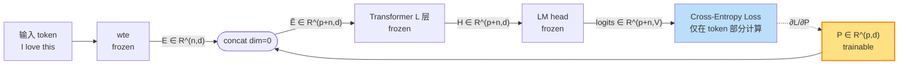

# Prompt Tuning（lecture 02）

> **The Power of Scale for Parameter-Efficient Prompt Tuning**
> Lester, Al-Rfou, Constant — Google Research, 2021
> arXiv: [2104.08691](https://arxiv.org/abs/2104.08691) · 本地 PDF：[`../papers/02-prompt-tuning-2021.pdf`](../papers/02-prompt-tuning-2021.pdf)
> 配套代码：[`../src/prompt_tuning_minimal.py`](../src/prompt_tuning_minimal.py) · [`../src/prompt_tuning_peft.py`](../src/prompt_tuning_peft.py)

---

## 第 1 张幻灯片：封面与导读

**研究问题**：可否只训练**一段很短**的"软提示"向量，就让大模型完成下游任务，效果接近全参微调？

**核心 claim**：**当模型规模足够大（≥10B 参数）时**，仅在输入层加一段长度为 $p$ 的可训练 embedding（典型 $p=20\sim100$），即可媲美全参微调。

**本节回答 4 个问题**：

1. 为什么这是有意义的研究问题？
2. 方法本身有多简单？
3. 实验如何支撑"scale is all you need"的论调？
4. 与 Prefix Tuning / P-Tuning 这些同期方法相比，本方法的位置在哪？

> **学习建议**：本篇是四篇里**最简单**的，请先读它，把"软提示"这一概念建立起来，再去看其他三篇的扩展。

---

## 第 2 张幻灯片：符号速查表（置顶可回查）

本篇全部公式只用以下符号：

| 符号 | 含义 | 维度 | 首次出现 |
|------|------|------|----------|
| $L$ | Transformer 层数 | 标量（GPT-2 base = 12） | 公式 (2) |
| $d$ | 隐层维度 | 标量（GPT-2 base = 768） | 公式 (1) |
| $n$ | 输入 token 序列长度 | 标量 | 公式 (1) |
| $p$ | **可训练 prompt 长度** | 标量（典型 5~100） | 公式 (1) |
| $V$ | 词表大小 | 标量（GPT-2 = 50257） | 公式 (3) |
| $\mathbf{E}$ | 输入 token 经 embedding 层后的矩阵 | $\mathbb{R}^{n \times d}$ | 公式 (1) |
| $\mathbf{P}$ | **可训练 prompt embedding 矩阵** | $\mathbb{R}^{p \times d}$ | 公式 (1) |
| $\widetilde{\mathbf{E}}$ | $\mathbf{P}$ 与 $\mathbf{E}$ 拼接后的矩阵 | $\mathbb{R}^{(p+n) \times d}$ | 公式 (1) |
| $\mathbf{H}$ | Transformer 输出的隐状态序列 | $\mathbb{R}^{(p+n) \times d}$ | 公式 (2) |
| $\boldsymbol{\theta}_{\mathrm{LM}}$ | 预训练 LM 全部参数（**冻结**） | — | 公式 (2) |
| $\boldsymbol{\phi}$ | 可训练参数集合（**仅** $\mathbf{P}$） | — | 公式 (4) |
| $y$ | 目标输出 token 序列 | $\{1,\dots,V\}^m$ | 公式 (4) |

> 全篇凡出现 $\mathbf{P}$，必然是这张表里这个 $\mathbb{R}^{p \times d}$ 的可训练矩阵。若你忘了 $p$ 是什么，请回到本张幻灯片。

---

## 第 3 张幻灯片：背景——为什么需要 prompt tuning？

**问题：全参微调的存储成本**

假设你有 $N$ 个下游任务（如 QA、情感分类、翻译……），用同一个预训练大模型 $M$（参数量 $|\boldsymbol{\theta}_{\mathrm{LM}}| = M_\theta$）做全参微调：

- 每个任务都要存一份完整模型副本
- **总存储开销**：$N \times M_\theta$
- 对 T5-XXL（11B 参数）+ 100 个任务 = 4.4 TB（FP32）

**问题：部署复杂性**

- 模型切换 = 整个权重换载
- 难以做"多任务同时服务"

**目标**：让一个共享主干 + 多个**轻量任务头**就够用。

---

## 第 4 张幻灯片：背景——离散 prompt 的局限

GPT-3 论文（Brown et al., 2020）展示了"prompt design" 的威力：用一段精心设计的自然语言文本（如 *"Translate English to French: {input} →"*）让模型 zero/few-shot 完成新任务。

**但离散 prompt 有 3 个痛点**：

1. **设计成本高**：要靠人工试错或搜索来找到一段好 prompt
2. **效果天花板低**：在 SuperGLUE 上，GPT-3 few-shot 仍比专门微调的小模型差
3. **离散 token 空间不连续**：无法用梯度优化"找到最优 prompt"

**自然想法**：能否把 prompt 放到**连续向量空间**，用梯度训练？

---

## 第 5 张幻灯片：背景——前作 Prefix Tuning 的启示

Li & Liang（2021，本专题 lecture 01）已经提出了类似想法 —— **Prefix Tuning**：

- 在**每一层** Transformer 的 self-attention KV cache 前都加一段可训练前缀
- 参数量约 $L \cdot p \cdot 2d$
- 在 GPT-2/BART 上做生成任务，0.1% 参数追平全参微调

**问题**：为什么要 *每层* 都加？只在输入层加可不可以？

本文的回答：**当模型够大时，只在输入层加就够了**。这是一个非常激进的简化。

---

## 第 6 张幻灯片：核心思想（直觉）

> **一句话**：在 token embedding 序列前面拼接一段**可学习**的连续向量 $\mathbf{P}$，**冻结**整个 LM，仅训练 $\mathbf{P}$。

直觉框图：

```
[已有的] input tokens   "I love this movie"
                              │
                              ▼
[已有的] token embedding (frozen)
                              │
                              ▼  E = (n, d)
[新增的] 可训练 prompt:  P = (p, d)
                              │
              [P; E]  ← 沿序列维度拼接
                              │
                              ▼
[已有的] Transformer (frozen, 不动)
                              │
                              ▼
[已有的] LM head (frozen)
                              │
                              ▼
                          下游 loss
```

**只有黄字"新增的"$\mathbf{P}$ 参与梯度更新**。

---

## 第 7 张幻灯片：核心思想（一图概括，ASCII）

```
                                         ┌─────────────────┐
Input tokens "I love this":              │ frozen Transformer │
  ┌──┬──┬──┐                             │                    │
  │t1│t2│t3│                             │   ┌────────────┐   │
  └──┴──┴──┘                             │   │  Layer 12  │   │
       │                                 │   ├────────────┤   │
       ▼ wte (frozen)                    │   │     ⋮     │   │
  ┌──┬──┬──┐  E ∈ R^(3, 768)             │   ├────────────┤   │
  │e1│e2│e3│  ─────────┐                 │   │  Layer 1   │   │
  └──┴──┴──┘            │                │   └─────▲──────┘   │
                        │ concat         └─────────│──────────┘
  ┌──┬──┬──┬──┬──┬──┐   │                          │
  │p1│p2│p3│p4│p5│ E│ ──┘                  Ẽ ∈ R^(p+n, 768)
  └──┴──┴──┴──┴──┴──┘
   ↑↑↑↑↑↑
   trainable P (5×768)
```

唯一动的就是 $\mathbf{P}$，所有 $e_i$（输入 token embedding）和 Transformer 全部冻结。

---

## 第 8 张幻灯片：数学符号约定（再次重申）

为避免你回滚查第 2 张速查表，这里把公式中要用的所有符号**重述一遍**：

- $\mathbf{E} \in \mathbb{R}^{n \times d}$：**输入 token 的 embedding 矩阵**。来源：把输入 token id $\mathbf{x} = (x_1, \dots, x_n)$ 经 $\mathrm{wte}(\cdot)$ 映射得到。$n$ 是序列长度，$d$ 是隐层维度（GPT-2 base 为 768）。
- $\mathbf{P} \in \mathbb{R}^{p \times d}$：**可训练的 prompt embedding 矩阵**。每行是一个虚拟 token 的 embedding，$p$ 是 prompt 长度（典型 $p \in [5, 100]$），$d$ 同上。
- $[\mathbf{P}; \mathbf{E}]$：沿第 0 维（序列维）拼接，结果 $\in \mathbb{R}^{(p+n) \times d}$。
- $\boldsymbol{\theta}_{\mathrm{LM}}$：预训练 LM 的所有参数（embedding、attention、FFN、LM head、layernorm 等），**全部冻结**，在训练时 `requires_grad = False`。
- $\boldsymbol{\phi}$：可训练参数集合。本方法中 $\boldsymbol{\phi}$ **只包含** $\mathbf{P}$，所以 $|\boldsymbol{\phi}| = p \cdot d$。

> 后续公式所有符号都来自本张幻灯片，**遗忘时请回滚**。

---

## 第 9 张幻灯片：方法公式 (1)——拼接

**公式**：

$$\widetilde{\mathbf{E}} = [\mathbf{P}; \mathbf{E}] \in \mathbb{R}^{(p+n) \times d} \quad (1)$$

**逐项重述**：

- $\widetilde{\mathbf{E}}$：拼接后的输入 embedding 矩阵，作为后续 Transformer 的输入
- $\mathbf{P} \in \mathbb{R}^{p \times d}$：**可训练**的 prompt embedding（参见第 8 张幻灯片）
- $\mathbf{E} \in \mathbb{R}^{n \times d}$：输入 token 的 embedding（**冻结**，来自预训练 LM 的 word token embedding 层）
- $[\,;\,]$：沿第 0 维拼接（即按行堆叠，行数相加，列数不变）
- 结果 $\widetilde{\mathbf{E}}$ 总行数 = $p + n$，每行仍是 $d$ 维向量

**张量形状示意**（GPT-2 base，$p=10$，$n=3$）：

```
P:  (10, 768)
E:  ( 3, 768)
──────────────  concat dim=0
Ẽ:  (13, 768)
```

> **注意**：拼接顺序是 **prompt 在前**，token 在后。这与 Prefix Tuning 一样，便于复用因果注意力 mask。

---

## 第 10 张幻灯片：方法公式 (2)——前向传播

**公式**：

$$\mathbf{H} = \mathrm{Transformer}\!\left(\widetilde{\mathbf{E}};\ \boldsymbol{\theta}_{\mathrm{LM}}\right) \in \mathbb{R}^{(p+n) \times d} \quad (2)$$

**逐项重述**：

- $\mathbf{H}$：Transformer 的最终隐状态序列。每行 $\mathbf{h}_i$ 是 $\widetilde{\mathbf{E}}$ 中第 $i$ 个位置的输出（包括前 $p$ 行对应 prompt 的隐状态，与后 $n$ 行对应原输入 token 的隐状态）。
- $\mathrm{Transformer}(\cdot; \boldsymbol{\theta}_{\mathrm{LM}})$：完整的 $L$ 层 Transformer 前向函数，参数 $\boldsymbol{\theta}_{\mathrm{LM}}$ **全部冻结**。包括 self-attention、FFN、layer norm 等所有子模块。
- $\widetilde{\mathbf{E}}$：来自公式 (1) 的拼接输入
- $\boldsymbol{\theta}_{\mathrm{LM}}$：预训练 LM 参数（参见第 8 张幻灯片）

**张量形状**（同上例）：

```
Ẽ: (13, 768)   →   Transformer (12 层，冻结)   →   H: (13, 768)
```

> Prompt 与原 token **不区分对待**：它们一起走完整个 Transformer，享受每一层的注意力交互。区别仅在于 prompt 的 embedding 是可学习的。

---

## 第 11 张幻灯片：方法公式 (3)——任务头（生成式）

对于**生成任务**（论文采用的 T5 编码-解码形式，这里简化为 GPT 自回归形式）：

$$P_{\boldsymbol{\theta}_{\mathrm{LM}}, \boldsymbol{\phi}}(y_t \mid y_{<t}, \widetilde{\mathbf{E}})
= \mathrm{softmax}\!\bigl(\mathbf{W}_{\mathrm{out}}\, \mathbf{h}_{p+n+t-1}\bigr) \quad (3)$$

**逐项重述**：

- $y_t$：第 $t$ 个待预测的目标 token（如分类标签词 "positive"），$y_t \in \{1, \dots, V\}$，$V$ 是词表大小（GPT-2 = 50257）。
- $y_{<t} = (y_1, \dots, y_{t-1})$：已生成的前 $t-1$ 个 token。
- $\widetilde{\mathbf{E}}$：来自公式 (1) 的拼接输入。
- $\mathbf{W}_{\mathrm{out}} \in \mathbb{R}^{V \times d}$：LM head 投影矩阵，**冻结**，与输入 word embedding 共享权重（GPT-2 设计）。
- $\mathbf{h}_{p+n+t-1} \in \mathbb{R}^d$：Transformer 第 $L$ 层在第 $(p+n+t-1)$ 个位置的隐状态（参见公式 (2)）。下标偏移 $p$ 是因为 prompt 占据了前 $p$ 个位置。
- $\boldsymbol{\theta}_{\mathrm{LM}}$：冻结的 LM 参数；$\boldsymbol{\phi} = \{\mathbf{P}\}$：唯一可训练参数。

> 关键观察：分类问题在论文里被改造成**生成问题**——把"分类标签"当作一段目标 token 序列让 LM 生成出来。这样不用加新的 head。

---

## 第 12 张幻灯片：方法公式 (4)——训练目标

**公式**：

$$\boldsymbol{\phi}^{*} = \arg\min_{\boldsymbol{\phi}}\ -\sum_{(\mathbf{x}, y) \in \mathcal{D}}\ \sum_{t=1}^{|y|}\ \log P_{\boldsymbol{\theta}_{\mathrm{LM}}, \boldsymbol{\phi}}(y_t \mid y_{<t}, \widetilde{\mathbf{E}}(\mathbf{x})) \quad (4)$$

**逐项重述**：

- $\boldsymbol{\phi}^{*}$：训练得到的最优可训练参数。
- $\boldsymbol{\phi}$：可训练参数集合，**仅** $\mathbf{P}$（即 $\boldsymbol{\phi} = \mathbf{P}$）。**整个 LM 都冻结**，不参与优化。
- $\mathcal{D}$：训练数据集，每条是 (输入 $\mathbf{x}$，目标 $y$) 对。
- $\widetilde{\mathbf{E}}(\mathbf{x})$：把输入 $\mathbf{x}$ 转成 token embedding 后再拼上 $\mathbf{P}$，由公式 (1) 给出。
- $P_{\boldsymbol{\theta}_{\mathrm{LM}}, \boldsymbol{\phi}}(\cdot)$：模型对 $y_t$ 的条件概率，由公式 (3) 给出。
- $y_t, y_{<t}, |y|$：目标 token 序列的第 $t$ 项、前 $t-1$ 项、总长度。
- $\boldsymbol{\theta}_{\mathrm{LM}}$：冻结参数（参见第 8 张幻灯片）。

> **关键**：损失函数对 $\boldsymbol{\theta}_{\mathrm{LM}}$ 的梯度被设置为 0（`requires_grad=False`），所以 PyTorch 不会更新它；只有 $\mathbf{P}$ 会被 AdamW 更新。

---

## 第 13 张幻灯片：Prompt 初始化策略

论文比较了 3 种初始化 $\mathbf{P}$ 的方式：

| 策略 | 做法 | 优劣 |
|------|------|------|
| **Random** | $\mathbf{P} \sim \mathcal{N}(0, 0.02^2)$ | 最简单；小模型上效果差 |
| **Sampled Vocab** | 从词表里随机取 $p$ 个真实 token 的 embedding 作为 $\mathbf{P}$ 初值 | 中等；让初始 $\mathbf{P}$ 处于有意义的子空间 |
| **Class Label**（推荐） | 用任务**类别词**的 token embedding 初始化（如分类任务用 "positive" 和 "negative" 的 embedding） | 最稳定；小模型受益最大 |

**经验法则**：

- 模型 < 1B 参数：必须用 Class Label 初始化
- 模型 ≥ 1B：三者收敛后差距很小
- 模型 ≥ 10B：随机初始化都 OK（这是"power of scale"的体现）

> 在我们的 [`prompt_tuning_minimal.py`](../src/prompt_tuning_minimal.py) 里，提供了 Random 和"用一段真实文本初始化"两种，对应 RANDOM 和 TEXT 策略。

---

## 第 14 张幻灯片：与 Prefix Tuning 的差异

| 维度 | Prompt Tuning（本文） | Prefix Tuning |
|------|----------------------|---------------|
| 软提示作用位置 | 仅**输入层** embedding 前 | 每层 self-attention 的 K、V 前 |
| 可训练参数量 | $p \cdot d$ | $L \cdot p \cdot 2 d$ |
| GPT-2 base 数值（$p=10$） | 7,680 | 184,320 |
| reparameterization | **无** | MLP |
| 训练稳定性 | 大模型上很稳，小模型敏感 | 各规模都稳（靠 MLP） |
| 推理延迟 | 几乎为 0（只多 $p$ 个 token） | 略增（需要每层注入 prefix） |
| 对模型规模要求 | **必须大**（≥10B 才能追平全参） | 无（小模型也能用） |

> **本质区别**：Prefix Tuning 通过"在每一层都干预"来增强表达力；Prompt Tuning 押注"足够大的 LM 自身就能消化任何输入层信号"。

---

## 第 15 张幻灯片：架构示意图（Mermaid）



**关键点**：

- 黄色 **P** 是唯一可训练模块
- 反向梯度只回流到 **P**（虚线箭头）
- Loss 只在 token 位置（后 $n$ 个）计算，prompt 位置（前 $p$ 个）label 设为 -100

---

## 第 16 张幻灯片：张量形状追踪（端到端）

```
0. input_ids:           (B, n)                 # B=2, n=3
                              │
                              ▼ wte (frozen)
1. token_embeds:        (B, n, d)              # (2, 3, 768)
                              │
                              │  expand prompt to batch
2. prompt (broadcast):  (B, p, d)              # (2, 10, 768)
                              │
                              ▼ torch.cat(dim=1)
3. inputs_embeds:       (B, p+n, d)            # (2, 13, 768)
                              │
                              │  build full attention mask
4. attention_mask:      (B, p+n)               # (2, 13), prompt 部分全 1
                              │
                              ▼ Transformer (frozen)
5. hidden_states:       (B, p+n, d)            # (2, 13, 768)
                              │
                              ▼ LM head (frozen)
6. logits:              (B, p+n, V)            # (2, 13, 50257)
                              │
                              │  labels 前 p 位填 -100
7. labels:              (B, p+n)               # (2, 13)
                              │
                              ▼ F.cross_entropy(ignore_index=-100)
8. loss:                scalar
                              │
                              ▼ backward
9. grad on P only:      (p, d)                 # (10, 768)
```

> **熟记此图后所有代码都好懂**。后面的 lecture 01/03/04 共用同一套形状语言。

---

## 第 17 张幻灯片：实验设置

| 项 | 取值 |
|----|------|
| 基础模型 | T5（small=60M, base=220M, large=770M, XL=3B, XXL=11B） |
| 评测基准 | SuperGLUE（8 个 NLU 任务） |
| Prompt 长度 $p$ | 1, 5, 20, 100, 150 |
| 学习率 | 0.3（!） |
| Batch | 32 |
| Steps | 30,000 |

注意：

- **学习率非常大（0.3）**——因为只更新 prompt 这小段参数，需要快速移动
- 用 T5 是因为它在 prompt-friendly 的 text-to-text 上预训练
- SuperGLUE 是 NLU 基准，相对挑战大（区别于 GLUE 这种更简单的）

---

## 第 18 张幻灯片：关键实验 ①——Scale Effect

论文 **Figure 1** 的灵魂：

```
SuperGLUE score
   ▲
80 │                                ┌──── Model Tuning (全参微调)
   │                              ╱
   │                            ╱       ┌───── Prompt Tuning（本文）
70 │                          ╱       ╱
   │                        ╱       ╱
60 │  ┌───────────┐       ╱       ╱
   │  │           │     ╱       ╱
50 │  │  小模型上 │   ╱       ╱        Prompt Design (GPT-3 few-shot)
   │  │  prompt  │ ╱       ╱  ┌─────────────────
40 │  │  tuning  │╱       ╱   │
   │  │  落后    │       ╱    │
   │  └──────────┘     ╱      │
30 │  ↑              ╱        │
   │  落后 30 分    ╱          │
20 ├──────┬───────┬───────────┬───────► T5 模型规模
       small    base       large/XL    XXL (11B)
```

**关键观察**：
- $\leq$ base：Prompt Tuning 比全参微调差很多（30+ 分）
- XL：差距缩到 5 分以内
- **XXL**：**Prompt Tuning ≈ 全参微调**

这就是论文标题中 *"Power of Scale"* 的字面证据。

---

## 第 19 张幻灯片：关键实验 ②——Prompt 长度

论文 **Figure 4**：固定 T5-XXL，扫不同 $p$：

| $p$ | SuperGLUE avg |
|-----|---------------|
| 1   | 86.5          |
| 5   | 88.1          |
| 20  | 89.0          |
| 100 | 89.4          |
| 150 | 89.5          |

**结论**：
- **$p=1$ 都能跑出 86 分**（震撼！）
- $p \geq 20$ 收益递减
- 推荐 $p \in [20, 100]$

> 工程含义：prompt 越短，存储越省、推理越快。最小可以到 $p=1$。

---

## 第 20 张幻灯片：关键实验 ③——初始化对比

论文 **Figure 5**：

| 模型 | Random | Sampled Vocab | Class Label |
|------|--------|---------------|-------------|
| T5-small | 56.0 | 64.0 | 70.0 |
| T5-base  | 73.0 | 76.0 | 78.0 |
| T5-XXL   | 89.4 | 89.5 | 89.6 |

**结论**：
- 小模型上初始化策略**致命重要**（差 14 分）
- 大模型上**几乎无关**（差 0.2 分）

> 再次印证 scale 的威力。

---

## 第 21 张幻灯片：关键实验 ④——与其他方法对比

T5-XXL 上的对比：

| 方法 | 可训练参数 | SuperGLUE |
|------|-----------|-----------|
| Full Model Tuning（基线） | 11B | 89.8 |
| Prefix Tuning | ~10M | ~89.5 |
| Prompt Tuning（本文，$p=100$） | **77K** | 89.4 |
| Prompt Design (GPT-3 few-shot) | 0（手工） | 71.8 |

**核心结论**：
- 比全参少 **15 万倍**参数，仅落后 0.4 分
- 比 Prefix Tuning 少 **130 倍**参数，仅落后 0.1 分
- 比手工 prompt 高 17 分

---

## 第 22 张幻灯片：优点

✅ **参数最省**：所有 prompt 类方法里最少（仅 $p \cdot d$）

✅ **最易部署**：
- 无需修改 Transformer 结构
- 只是输入 embedding 多了 $p$ 个 token
- 多任务时存储就是一堆 $(p, d)$ 矩阵

✅ **推理几乎零开销**：序列只多 $p$ 个 token，attention $O((p+n)^2)$ 相对原 $O(n^2)$ 增量很小

✅ **训练简单**：只需要 AdamW + 大学习率，无需 reparameterization 这种复杂技巧

---

## 第 23 张幻灯片：缺点与边界

❌ **必须大模型**：< 1B 参数效果差，与全参 gap > 10 分

❌ **收敛慢**：典型需要 30K steps（远超全参微调）

❌ **对初始化敏感**（小模型上）：Random 与 Class Label 差 14 分

❌ **生成任务效果不如 Prefix Tuning**（Prefix 每层都干预，对长序列生成更稳）

❌ **跨任务不可组合**：每个任务自己学一个 $\mathbf{P}$，无法像 LoRA 那样多任务叠加

**适用边界总结**：

```
模型大小       推荐方法
─────────────  ──────────────────────
< 1B           Prefix Tuning / P-Tuning v2
1B – 10B       任意（看任务）
> 10B          Prompt Tuning（最省）
```

---

## 第 24 张幻灯片：四种方法横向对比

| 维度 | Prompt Tuning（本文） | Prefix Tuning | P-Tuning v1 | P-Tuning v2 |
|------|----------------------|---------------|-------------|-------------|
| 软提示位置 | 输入层 | 每层 KV | 输入层（任意位置） | 每层 KV |
| 参数量 $(p=10, d=768)$ | 7,680 | 184,320+MLP | 7,680+~4M LSTM | 184,320 |
| reparameterization | 无 | MLP | LSTM/MLP | 无 |
| 模型规模门槛 | **≥10B** | 无 | 无 | 无 |
| 主战场 | T5 / 大 LM | GPT-2 生成 | BERT/GPT 的 NLU | 通用 |
| 代码复杂度 | ⭐ | ⭐⭐⭐ | ⭐⭐ | ⭐⭐ |

> **学习建议**：理解了本节的 Prompt Tuning，再去看 Prefix Tuning 时，重点关注"为什么作者觉得必须每层都加"——你会发现答案与"作者用的模型不够大"有关。

---

## 第 25 张幻灯片：PyTorch 核心代码片段

完整文件：[`../src/prompt_tuning_minimal.py`](../src/prompt_tuning_minimal.py)

**算法核心 = 一段 Parameter + 一次 cat**：

```python
class PromptTuningGPT2(nn.Module):
    def __init__(self, prompt_length=10):
        super().__init__()
        self.lm = GPT2LMHeadModel.from_pretrained("gpt2")
        for p in self.lm.parameters():
            p.requires_grad = False        # ← 冻结 LM
        d = self.lm.config.n_embd          # GPT-2 base: 768
        self.prompt_embeddings = nn.Parameter(
            torch.empty(prompt_length, d)  # ← P ∈ R^(p, d)
        )
        nn.init.normal_(self.prompt_embeddings, std=0.02)

    def forward(self, input_ids, attention_mask, labels=None):
        B = input_ids.shape[0]
        token_embeds = self.lm.transformer.wte(input_ids)   # (B, n, d)
        prompt = self.prompt_embeddings.unsqueeze(0).expand(B, -1, -1)
        # ↑ (B, p, d)
        inputs_embeds = torch.cat([prompt, token_embeds], dim=1)  # (B, p+n, d)
        # ... 扩展 attention_mask、labels（前 p 位填 -100）...
        return self.lm(inputs_embeds=inputs_embeds, ...)
```

**对应公式**：
- `nn.Parameter(torch.empty(p, d))` ← 公式 (4) 的 $\boldsymbol{\phi} = \mathbf{P}$
- `torch.cat([prompt, token_embeds], dim=1)` ← 公式 (1) 的 $[\mathbf{P}; \mathbf{E}]$
- `self.lm(inputs_embeds=...)` ← 公式 (2) 的 $\mathrm{Transformer}(\widetilde{\mathbf{E}})$

---

## 第 26 张幻灯片：peft 调包对照

完整文件：[`../src/prompt_tuning_peft.py`](../src/prompt_tuning_peft.py)

**`peft` 库版本**：

```python
from peft import PromptTuningConfig, PromptTuningInit, TaskType, get_peft_model

base = GPT2LMHeadModel.from_pretrained("gpt2")
config = PromptTuningConfig(
    task_type=TaskType.CAUSAL_LM,
    prompt_tuning_init=PromptTuningInit.RANDOM,
    num_virtual_tokens=10,                # ← 公式中的 p
    tokenizer_name_or_path="gpt2",
)
model = get_peft_model(base, config)
# 自动冻结 LM、自动注入 prompt embedding、自动维护 attention mask
```

**peft 内部实现的关键参数**：
- `model.prompt_encoder.default.embedding.weight` 形状 = $(p, d) = (10, 768)$ 
- 与手写版的 `self.prompt_embeddings` **一一对应**

> **学习要点**：peft 抽象了"PromptEncoder"概念，它对 PromptTuning 来说就是一个 `nn.Embedding(p, d)`，对 PrefixTuning 是 embedding+MLP，对 P-Tuning v1 是 embedding+LSTM+MLP。peft 用统一接口包裹了三种"软提示生成器"。

---

## 第 27 张幻灯片：一致性验证（数值结果）

完整文件：[`../src/tests/test_prompt_consistency.py`](../src/tests/test_prompt_consistency.py)

**验证策略**：
1. 用同一随机种子初始化 minimal 和 peft 两个模型
2. 把 minimal 的 `self.prompt_embeddings` 复制到 peft 的 `prompt_encoder.default.embedding.weight`
3. 同样的输入跑 forward，比较 logits 张量

**期望结果**：

```
logits 最大绝对误差: 0.00e+00
[PASS] minimal 与 peft 输出一致
```

由于 Prompt Tuning **无 reparameterization、无 dropout 不可控项**，两者数值应该 bit 精确一致（误差 < 1e-5）。

> 这种"强一致性"是 Prompt Tuning 的福利——后面 Prefix / P-Tuning v1 因为有 MLP/LSTM 的随机层，只能做"弱一致性"（形状 + 参数量级匹配）。

---

## 第 28 张幻灯片：思考题与延伸阅读

**思考题**（写在 [`02-prompt-tuning.ipynb`](../notebooks/02-prompt-tuning.ipynb) 末尾）：

1. **参数量预测**：若把 `prompt_length` 从 10 改到 100，新增可训练参数是多少？为什么是这个数？
2. **初始化对比**：用 `init_text="positive negative"` 初始化 $\mathbf{P}$，与随机初始化在 toy 数据集上跑 50 步，loss 曲线会如何不同？请预测并验证。
3. **peft 内部结构**：打印 `peft_model.prompt_encoder` 的对象，它是什么类？它的 `forward()` 函数到底返回什么？
4. **小模型实验**：把代码改成用 `gpt2`（117M）替代假设的 T5-XXL（11B），SuperGLUE 上分数会是多少？请预测论文 Figure 1 在这个规模上的位置。
5. **多任务**：若有 10 个任务，分别用 Prompt Tuning，总存储增量是多少？与全参微调对比？

**延伸阅读**：

- 本专题下一篇：[`01-prefix-tuning.md`](01-prefix-tuning.md)——"每层都加 prefix"
- 本专题第三篇：[`03-p-tuning.md`](03-p-tuning.md)——加 LSTM 强化软提示
- 论文：原书第 2.1.4 节（你正在读的章节）
- 反向尝试：搜索 *"hard prompt vs soft prompt"* 看 2022-2024 年这个领域的演进

---

> **下一站**：[`01-prefix-tuning.md`](01-prefix-tuning.md) → 理解"为什么作者觉得必须每层都加"
