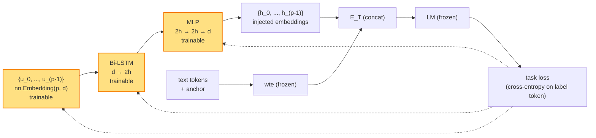

# P-Tuning v1（lecture 03）

> **GPT Understands, Too**
> Xiao Liu, Yanan Zheng, Zhengxiao Du, Ming Ding, Yujie Qian, Zhilin Yang, Jie Tang — Tsinghua + 智源, 2021
> arXiv: [2103.10385](https://arxiv.org/abs/2103.10385) · 本地 PDF：[`../papers/03-p-tuning-2021.pdf`](../papers/03-p-tuning-2021.pdf)
> 配套代码：[`../src/p_tuning_minimal.py`](../src/p_tuning_minimal.py) · [`../src/p_tuning_peft.py`](../src/p_tuning_peft.py)

---

## 第 1 张幻灯片：封面与导读

**研究问题**：GPT 这种**单向自回归**模型，在 NLU（自然语言理解）任务上一直被认为**远不如** BERT。但这是不是因为我们用错了 prompt？

**核心 claim**：**给 GPT 一段"可学习的连续 prompt"（不是离散文本），它在 SuperGLUE 等 NLU 基准上能和 BERT 打平甚至更好。** 关键技巧：**用 LSTM 做 reparameterization**生成 prompt。

**本节回答 4 个问题**：

1. 为什么 GPT 在 NLU 上"先天弱"？是模型问题还是 prompt 问题？
2. P-Tuning 与同期 Prefix Tuning 的差异在哪里？
3. LSTM 在这里起什么作用？为什么不像 Prefix Tuning 用 MLP？
4. 这篇论文在"prompt-based fine-tuning 史"上的地位是什么？

> **学习建议**：本篇与 lecture 02（Prompt Tuning）在思想上接近——都是"输入层加软提示"，但 P-Tuning 多了 LSTM + 任意插入位置，专攻 NLU。

---

## 第 2 张幻灯片：符号速查表

| 符号 | 含义 | 维度 | 首次出现 |
|------|------|------|----------|
| $L$ | Transformer 层数 | 标量 | — |
| $d$ | 隐层维度 | 标量（GPT-2 base = 768） | 公式 (1) |
| $n$ | 文本 token 数 | 标量 | 公式 (1) |
| $p$ | **prompt 长度**（pseudo token 数） | 标量（典型 10-100） | 公式 (1) |
| $\mathbf{x}$ | 输入文本 token 序列 | $\{1,\dots,V\}^n$ | 公式 (1) |
| $\mathbf{e}(x_i)$ | 第 $i$ 个文本 token 经 embedding | $\mathbb{R}^d$ | 公式 (1) |
| $[P_0], [P_1], \dots, [P_{p-1}]$ | **pseudo token** 占位符（虚拟 token） | — | 公式 (1) |
| $\mathbf{u}_i \in \mathbb{R}^d$ | 第 $i$ 个 pseudo token 的"原始可学习 embedding" | $\mathbb{R}^d$ | 公式 (2) |
| $\mathbf{h}_i \in \mathbb{R}^d$ | 经 LSTM/MLP 后的 pseudo token embedding | $\mathbb{R}^d$ | 公式 (3) |
| $\mathrm{LSTM}_\phi$ | reparameterization 用的双向 LSTM | — | 公式 (2) |
| $\mathrm{MLP}_\phi$ | LSTM 后的 MLP head | $\mathbb{R}^{2 h} \to \mathbb{R}^d$ | 公式 (3) |
| $h$ | LSTM 隐层维度 | 标量（典型 256） | — |
| $\boldsymbol{\theta}_{\mathrm{LM}}$ | 预训练 LM 全部参数（**冻结**） | — | 公式 (4) |
| $\boldsymbol{\phi}$ | 可训练参数（$\{\mathbf{u}_i\}$ + LSTM + MLP） | — | 公式 (4) |

---

## 第 3 张幻灯片：背景——GPT 在 NLU 上"先天弱"？

| 任务 | GPT-2 base | BERT base | 差距 |
|------|------------|-----------|------|
| MNLI | 76% | 84% | -8% |
| QQP | 87% | 90% | -3% |
| QNLI | 88% | 91% | -3% |
| SST-2 | 92% | 93% | -1% |

**传统结论**：GPT 是单向自回归，BERT 是双向 Transformer encoder，NLU 任务下 BERT 天然占优。

**但作者的怀疑**：**会不会是 prompt 没设计好？** GPT-3 论文已经展示了好 prompt 的威力（虽然要 175B 参数才行）。能不能让小 GPT 也用上"好 prompt"？

**思路**：让 prompt 也跟着任务一起被优化（梯度下降找最好的 prompt）。

---

## 第 4 张幻灯片：背景——离散 prompt 的痛点

例如 GLUE 的 SST-2 情感分类，传统离散 prompt：

```
"The movie was good. It was [MASK]."   ← 让模型预测 great/terrible
"It was great. Therefore the movie was [MASK]."  ← 改个说法效果就不一样
```

**3 个问题**：

1. **设计成本高**：要靠人工试、靠 prompt mining 工具搜
2. **效果方差大**：换个连接词（"therefore" → "so"）分数可能掉 10%
3. **离散空间不连续**：无法用梯度优化

**作者的解决方案**：把那些 *它*、*great* 这样的"prompt 文字"换成**可训练向量**。

---

## 第 5 张幻灯片：核心思想——pseudo token 模板

**例子**：SST-2 情感分类的模板

```
传统离散 prompt:
    "The movie was good. It was [MASK]."

P-Tuning 模板（[P_i] 是可训练的 pseudo token）:
    "[P_0] The movie was good [P_1] [P_2] [MASK] [P_3]"
                                 ↑↑↑    ↑↑↑↑↑↑↑    ↑↑↑
                              可学习    [MASK] 是离散   可学习
                             连续向量    标签预测位     连续向量
```

**关键 idea**：
1. 模板中可以**穿插**任意数量的可训练 pseudo token（不限于开头）
2. 模板中保留若干"**anchor token**"（真实词，如 "[MASK]"），它们对任务有强先验作用
3. 训练时只更新 pseudo token 对应的 embedding 和 LSTM

---

## 第 6 张幻灯片：与 Prefix Tuning 的差异

| 维度 | P-Tuning v1（本文） | Prefix Tuning（lecture 01） |
|------|---------------------|----------------------------|
| 软提示作用位置 | **仅输入层** embedding | **每层** self-attention 的 KV |
| 模板自由度 | **任意位置插入** pseudo token | 只能放在开头 |
| reparameterization | LSTM + MLP | MLP |
| 主战场 | NLU | NLG |
| 是否包含 anchor token | **是**（关键设计） | 否 |
| 与 BERT 兼容 | 是（论文重点） | 否（论文用 GPT-2/BART） |

> **共同点**：都引入了"可训练的 prompt 向量"+ "reparameterization 网络"。
>
> **核心差异**：P-Tuning **回归 Prompt Tuning 的范式（仅输入层）**，但加了 LSTM 和"任意位置插入"两个新设计，专为 NLU 优化。

---

## 第 7 张幻灯片：为什么需要 LSTM？

**朴素做法**：直接学 $p$ 个 embedding 向量 $\{\mathbf{u}_0, \dots, \mathbf{u}_{p-1}\}$。

**论文观察**：训练不稳，效果差。

**作者的诊断**：

1. **关联性问题**：$\mathbf{u}_i$ 之间是相互独立的随机 vector，但在 prompt 模板里它们的位置是**有序的**（类似一段话），独立的随机向量难以学到合理的"连贯 prompt"
2. **离散性问题**：在自然语言中，"the movie was great" 这样的句子里每个词不是独立随机的；要模拟这种"语言性"，需要让 $\mathbf{u}_i$ 之间**有依赖**

**解决方案**：用 LSTM 把 $\{\mathbf{u}_i\}$ 串起来，让序列建模引入"上下文依赖"。

---

## 第 8 张幻灯片：数学符号约定（再次重申）

避免回滚速查表，把公式要用的符号重述：

- $\mathbf{x} = (x_1, \dots, x_n)$：输入文本 token id 序列
- $\mathbf{e}(x_i) \in \mathbb{R}^d$：第 $i$ 个文本 token 经 embedding，**用预训练 LM 的 wte，冻结**
- $[P_0], [P_1], \dots, [P_{p-1}]$：$p$ 个 pseudo token 占位符（不是真实 token，没有 id）
- $\mathbf{u}_i \in \mathbb{R}^d, i = 0, \dots, p-1$：每个 pseudo token 对应一个"**原始可学习 embedding**"（这相当于"先用一个 (p, d) 大小的 nn.Embedding"）
- $\mathbf{h}_i \in \mathbb{R}^d$：把 $\mathbf{u}_i$ 喂给 LSTM+MLP 得到的 prompt embedding（**这才是真正注入 LM 的向量**）
- $\boldsymbol{\theta}_{\mathrm{LM}}$：LM 参数，冻结
- $\boldsymbol{\phi}$：可训练参数集合 = $\{\mathbf{u}_i\}_{i=0}^{p-1} \cup \text{LSTM 全部权重} \cup \text{MLP 全部权重}$

---

## 第 9 张幻灯片：方法公式 (1)——模板形式化

模板形式化为：

$$\mathcal{T} = [\text{pre}_0] \oplus [\mathbf{x}_{\mathcal{S}_1}] \oplus [\text{pre}_1] \oplus \dots \oplus [\text{pre}_{k}] \oplus [\mathbf{x}_{\mathcal{S}_{k+1}}] \quad (1)$$

**逐项重述**：

- $\mathcal{T}$：完整模板序列（最终送进 LM 的 token 列表）
- $\oplus$：序列拼接
- $[\text{pre}_j]$：**pseudo token 段**，每段长度可任意。例如 $[\text{pre}_0]$ 可能是 3 个 pseudo token $[P_0][P_1][P_2]$
- $[\mathbf{x}_{\mathcal{S}_j}]$：**真实文本片段**或 **anchor token**。$\mathcal{S}_j$ 是输入 $\mathbf{x}$ 的某个子序列（如某句话）或一个 anchor（如 `[MASK]`）

**例子**（SST-2 情感分类）：

```
模板: [P_0] [P_1] [P_2] {sentence} [P_3] [P_4] [MASK] [P_5]
                       ↑↑↑↑↑↑↑↑          ↑↑↑↑↑
                       输入句子           anchor: [MASK]
```

**总长度**：$p + n + |\text{anchors}|$。

---

## 第 10 张幻灯片：方法公式 (2)——LSTM reparameterization

把每个 pseudo token 的"原始可训练 embedding" $\{\mathbf{u}_i\}$ 通过双向 LSTM：

$$(\mathbf{h}_0, \mathbf{h}_1, \dots, \mathbf{h}_{p-1}) = \mathrm{MLP}_\phi\!\Bigl(\mathrm{BiLSTM}_\phi(\mathbf{u}_0, \mathbf{u}_1, \dots, \mathbf{u}_{p-1})\Bigr) \quad (2)$$

**逐项重述**：

- 等号左边 $(\mathbf{h}_0, \dots, \mathbf{h}_{p-1})$：$p$ 个 pseudo token **最终注入 LM 的 embedding**，每个 $\mathbf{h}_i \in \mathbb{R}^d$
- $(\mathbf{u}_0, \dots, \mathbf{u}_{p-1})$：每个 pseudo token 的原始可训练 embedding，每个 $\mathbf{u}_i \in \mathbb{R}^d$（这是一个 `nn.Embedding(p, d)`）
- $\mathrm{BiLSTM}_\phi(\cdot)$：双向 LSTM，输入 $p \times d$，输出 $p \times 2h$（$h$ 是 LSTM 隐层维度，bi-directional 让维度 ×2）
- $\mathrm{MLP}_\phi(\cdot)$：两层 MLP，输入 $\mathbb{R}^{2h}$，输出 $\mathbb{R}^d$。结构：`Linear(2h, 2h) → ReLU → Linear(2h, d)`
- $\boldsymbol{\phi}$：可训练参数集合（参见第 8 张幻灯片）

**为什么不像 Prefix Tuning 用 MLP？**

- Prefix Tuning 的 prefix 散布在 $L$ 层，**层间** 共享一个低维 prefix，所以需要 MLP 把 $d$ 维投到 $L \cdot 2 \cdot d$ 维
- P-Tuning v1 的 prompt 都在**输入层**，相邻 pseudo token 应该有"语言连贯性"，所以用 LSTM 建模**序列依赖**

---

## 第 11 张幻灯片：方法公式 (3)——embedding 替换

模板送进 LM 时，把每个 pseudo token $[P_i]$ 的位置 embedding 替换为 $\mathbf{h}_i$：

$$\mathbf{E}_{\mathcal{T}} = (\mathbf{h}_0, \dots, \mathbf{h}_{p-1}, \mathbf{e}(x_{anchor}), \mathbf{e}(x_1), \dots, \mathbf{e}(x_n), \dots) \quad (3)$$

**逐项重述**：

- $\mathbf{E}_{\mathcal{T}} \in \mathbb{R}^{(p+n+\text{anchors}) \times d}$：模板最终送进 LM 的 embedding 序列
- $\mathbf{h}_i$：第 $i$ 个 pseudo token 的 embedding（来自公式 (2)）
- $\mathbf{e}(x_{anchor})$：anchor token 的 embedding（**冻结**，来自预训练 wte）
- $\mathbf{e}(x_j)$：第 $j$ 个文本 token 的 embedding（**冻结**）
- 顺序：按公式 (1) 的模板顺序排列

**关键**：pseudo token 与文本 token 的 embedding **混编**进同一序列。

---

## 第 12 张幻灯片：方法公式 (4)——训练目标

$$\boldsymbol{\phi}^{*} = \arg\min_{\boldsymbol{\phi}}\ \mathcal{L}\bigl(\mathrm{LM}_{\boldsymbol{\theta}_{\mathrm{LM}}}(\mathbf{E}_{\mathcal{T}}),\ y\bigr) \quad (4)$$

**逐项重述**：

- $\boldsymbol{\phi}$：可训练参数 = $\{\mathbf{u}_i\}$ + LSTM 参数 + MLP 参数（参见第 8 张幻灯片）
- $\boldsymbol{\theta}_{\mathrm{LM}}$：预训练 LM 参数，**冻结**
- $\mathbf{E}_{\mathcal{T}}$：模板 embedding（来自公式 (3)）
- $\mathrm{LM}_{\boldsymbol{\theta}_{\mathrm{LM}}}(\cdot)$：LM 前向
- $\mathcal{L}(\cdot, y)$：任务 loss。对 NLU 分类，把分类问题转成"预测一个 verbalizer token"（如 "positive" / "negative"），用交叉熵
- $y$：任务的目标标签（如情感类别）

---

## 第 13 张幻灯片：anchor token 的关键作用

**anchor token = 模板中保留的真实词**（如 `[MASK]`, "yes/no", "great/terrible"）。

**为什么重要？**

1. **预训练的语言先验**：`[MASK]` 这种 token 在预训练里已经学到了"接下来会预测一个词"的语义
2. **任务定位**：anchor 告诉模型"这是个分类任务，请在此处预测"
3. **稳定性**：去掉 anchor 后只剩 pseudo token，模型很难学到任务结构

**论文 Table 4 消融**：在 LAMA 上去掉 anchor，分数掉 5-10%。

**实践指引**：

- 分类任务用 `[MASK]` 作 anchor（BERT 适用）
- 自回归生成用句末的真实词
- pseudo token 的位置应"包围"或"紧邻" anchor

---

## 第 14 张幻灯片：架构示意图（Mermaid）



黄色 = 可训练。

---

## 第 15 张幻灯片：张量形状追踪

```
0. pseudo token ids:        [0, 1, ..., p-1]      shape (1, p) [常数]
                                  │
                                  ▼ nn.Embedding(p, d)
1. raw u:                   (1, p, d)             # (1, 10, 768)
                                  │
                                  ▼ Bi-LSTM (input=d, hidden=h=256, layers=2)
2. lstm out:                (1, p, 2*h)           # (1, 10, 512)
                                  │
                                  ▼ MLP: Linear(2h, 2h) → ReLU → Linear(2h, d)
3. h:                       (1, p, d)             # (1, 10, 768)   ← pseudo embeddings
                                  │
              ┌── prompt 拼到输入前（简化版） ──┐
              ▼                                  ▼
4. token_embeds:            (B, n, d)            # 文本 token 经 wte
5. inputs_embeds:           (B, p+n, d)          # [h; token_embeds]
                                  │
                                  ▼ Transformer (frozen)
6. logits:                  (B, p+n, V)          # 完整序列
                                  │
                                  ▼ 只在 anchor 位置算 loss
7. loss:                    scalar
                                  │
                                  ▼ backward → 仅梯度到 u、LSTM、MLP
```

> 实际论文支持"任意位置插入" pseudo token；上面简化为"prompt 在前+文本在后"。在我们的 [`p_tuning_minimal.py`](../src/p_tuning_minimal.py) 里采用简化版。

---

## 第 16 张幻灯片：实验设置

| 项 | 取值 |
|----|------|
| 基础模型 | GPT-2 base/medium、BERT base/large、MegatronLM 11B |
| 评测任务 | LAMA（事实知识探测）、SuperGLUE（NLU） |
| Prompt 长度 $p$ | 3-100，主结果用 $p=10$ |
| reparameterization | Bi-LSTM (hidden=256, layers=2) + MLP (Linear-ReLU-Linear) |
| 学习率 | 1e-5 ～ 1e-4（小） |
| Anchor token | 任务相关：分类用 [MASK]，QA 用问号 |

---

## 第 17 张幻灯片：关键实验 ①——LAMA 主结果

LAMA：用 cloze prompt 测语言模型的"事实知识"。例如：

```
"Paris is the capital of [MASK]."   ← 预测 "France"
```

| 模型 | 离散 Manual Prompt | P-Tuning v1 |
|------|--------------------|-------------|
| BERT-base | 31.1 | **48.3** (+17.2) |
| BERT-large | 32.2 | **52.3** (+20.1) |
| GPT-2 base | 4.6 | **40.6** (+36.0) |
| GPT-2 medium | 5.0 | **46.5** (+41.5) |
| MegatronLM 11B | 18.5 | **64.2** (+45.7) |

**结论**：

- 全部模型都涨大分（特别是 GPT 系列）
- 大模型涨幅更大（MegatronLM +45）
- **GPT-2 base + P-Tuning 接近 BERT-base 的水平**（40.6 vs 48.3）

---

## 第 18 张幻灯片：关键实验 ②——SuperGLUE 主结果

| 模型 + 方法 | SuperGLUE avg |
|------------|---------------|
| GPT-2 base + manual prompt | 41.0 |
| GPT-2 base + **P-Tuning** | **56.0** (+15) |
| BERT-base + standard fine-tuning | 65.0 |
| BERT-base + **P-Tuning** | **68.3** (+3.3) |
| MegatronLM 11B + P-Tuning | 78.4（接近 SOTA） |

**结论**：

- GPT 用 P-Tuning 后在 SuperGLUE 上**首次接近 BERT**（论文标题的灵感来源）
- BERT 用 P-Tuning 比标准 fine-tuning 还稍好（+3.3）
- 大模型上 P-Tuning 几乎追上 SOTA

---

## 第 19 张幻灯片：关键实验 ③——prompt 模板消融

论文 Table 4，固定 LAMA，扫描不同模板设计：

| 模板设计 | LAMA P@1 |
|---------|----------|
| 仅 manual prompt（无可训练） | 31.1 |
| 仅 pseudo token，**无 anchor**（"[P0]...[Pk] [MASK]"） | 38.5 |
| pseudo + **1 anchor**（"[P0]...[Pk] [MASK]"） | 45.0 |
| **pseudo + 2 anchors**（"[P0]...[Pk] [MASK] [Pk+1]..."） | **48.3** |

**结论**：

- 没 anchor 提升有限
- anchor 越多（合理范围内），效果越好
- pseudo token 与 anchor 的**位置组合**也影响（论文未深入扫描）

---

## 第 20 张幻灯片：关键实验 ④——reparam 网络对比

| reparameterization | LAMA P@1 |
|--------------------|----------|
| **无**（直接学 $\{\mathbf{u}_i\}$） | 32.0 |
| **MLP 替代 LSTM** | 41.2 |
| **Bi-LSTM + MLP（本文标准）** | **48.3** |

**结论**：

- 直接学：基本没用
- MLP 替代 LSTM：有提升但不够
- LSTM 决定性贡献：**序列建模** 是 P-Tuning v1 的核心，不是可选项

> **对比 Prefix Tuning（lecture 01）**：Prefix Tuning 用 MLP 就够了。差异原因：Prefix Tuning 的 prefix 在每层、相对独立；P-Tuning 的 prompt 全在输入层、相邻位置有强相关，所以需要 LSTM 显式建模序列。

---

## 第 21 张幻灯片：关键实验 ⑤——BERT 上的效果

论文 Table 3：BERT-base + 不同模板。

| 任务 | manual prompt | P-Tuning |
|------|---------------|----------|
| BoolQ | 70.0 | **74.0** |
| CB | 71.4 | **78.6** |
| RTE | 53.4 | **68.5** |
| WiC | 60.0 | **62.7** |

**结论**：

- BERT 也能从 P-Tuning 受益（虽然提升幅度小于 GPT）
- 论文标题虽强调 GPT，但 BERT 的成果也是亮点

---

## 第 22 张幻灯片：与 Prefix Tuning 对比

| 维度 | P-Tuning v1（本文） | Prefix Tuning |
|------|---------------------|----------------|
| prompt 位置 | 输入层（任意位置插入） | 每层 KV（开头） |
| reparam 网络 | Bi-LSTM + MLP | MLP |
| anchor token 设计 | **有** | 无 |
| 参数量（$p=10$, GPT-2 base, $h=256$） | ~4.3M（LSTM 主导） | ~9.8M（MLP 主导） |
| 主战场 | NLU（分类、抽取、事实问答） | NLG（生成、摘要） |
| 与 BERT 兼容 | 是 | 否 |

> **学习要点**：P-Tuning v1 是 Prefix Tuning 的"NLU 表亲"——同时期、不同应用、不同 reparam。

---

## 第 23 张幻灯片：与 Prompt Tuning 对比

| 维度 | P-Tuning v1（本文） | Prompt Tuning（lecture 02） |
|------|---------------------|----------------------------|
| prompt 位置 | 输入层（任意位置） | 输入层（仅开头） |
| reparam 网络 | **Bi-LSTM + MLP** | **无** |
| anchor token | **有** | 无 |
| 模型规模要求 | 任意（**小模型也行**） | **必须大**（≥10B） |
| 任务类型 | NLU | NLG / NLU 都行 |
| 训练复杂度 | 高（LSTM） | 低（仅 embedding） |

> **关键对比**：Prompt Tuning 是"赌大模型自己消化简单输入信号"；P-Tuning v1 是"设计复杂的 prompt encoder 让小模型也能用"。

---

## 第 24 张幻灯片：优点

✅ **首个让 GPT 在 NLU 上接近 BERT 的方法**（论文标题 *GPT Understands, Too* 的命名灵感）

✅ **小模型友好**：GPT-2 base 都能涨 +36 分（LAMA）

✅ **任意位置插入**：模板设计灵活，可以围绕 anchor 包夹

✅ **anchor 设计原创**：把"语言先验"显式引入

✅ **训练稳定**：LSTM + MLP 解决了直接学 $\{\mathbf{u}_i\}$ 不稳的问题

---

## 第 25 张幻灯片：缺点与适用边界

❌ **生成任务弱**：prompt 全在输入层，对长序列生成的控制力不如 Prefix Tuning

❌ **序列标注弱**：v1 论文只测了分类、QA、事实查询；序列标注（NER、POS）效果差（这是 v2 要解决的）

❌ **LSTM 训练开销大**：$h=256, p=10$ 的 LSTM 也有 ~3.5M 参数

❌ **小模型 + 极少数据下不如 Prompt Tuning**：因为 LSTM 容易过拟合

❌ **模板设计仍需经验**：pseudo token 数量、anchor 位置都需要调

**适用边界**：

```
任务            首选
─────────       ────────────
NLU 分类        P-Tuning v1 ⭐
NER / POS       P-Tuning v2（v1 不行）
NLG 生成        Prefix Tuning
极大模型 + NLU  Prompt Tuning（更省）
```

---

## 第 26 张幻灯片：PyTorch 核心代码片段

完整文件：[`../src/p_tuning_minimal.py`](../src/p_tuning_minimal.py)

```python
class PromptEncoder(nn.Module):
    """公式 (2) 的实现：Bi-LSTM + MLP。"""

    def __init__(self, p, d, h=256):
        super().__init__()
        self.embed = nn.Embedding(p, d)        # 公式 (2) 中的 {u_i}
        self.lstm = nn.LSTM(
            d, h, num_layers=2,
            bidirectional=True, batch_first=True
        )                                       # 公式 (2) 的 BiLSTM
        self.mlp = nn.Sequential(
            nn.Linear(2*h, 2*h),                # 公式 (2) 的 MLP 第 1 层
            nn.ReLU(),
            nn.Linear(2*h, d),                  # 公式 (2) 的 MLP 第 2 层
        )

    def forward(self):
        # 取所有 pseudo token id [0, 1, ..., p-1]
        ids = torch.arange(self.embed.num_embeddings).unsqueeze(0)  # (1, p)
        u = self.embed(ids)            # (1, p, d)  ← 公式 (2) 的 u
        lstm_out, _ = self.lstm(u)     # (1, p, 2h)
        return self.mlp(lstm_out).squeeze(0)  # (p, d)  ← 公式 (2) 的 h

class PTuningGPT2(nn.Module):
    def __init__(self, p=10, h=256):
        # 冻结 LM
        # 创建 PromptEncoder
        ...
    def forward(self, input_ids, attention_mask, labels):
        prompt_embeds = self.encoder()       # (p, d)
        token_embeds = self.lm.transformer.wte(input_ids)  # (B, n, d)
        # 简化：prompt 拼到输入前（论文支持任意位置）
        full = torch.cat([prompt_embeds.expand(B, -1, -1), token_embeds], dim=1)
        return self.lm(inputs_embeds=full, ...)
```

---

## 第 27 张幻灯片：peft 调包对照

完整文件：[`../src/p_tuning_peft.py`](../src/p_tuning_peft.py)

```python
from peft import PromptEncoderConfig, PromptEncoderReparameterizationType, TaskType, get_peft_model

config = PromptEncoderConfig(
    task_type=TaskType.CAUSAL_LM,
    num_virtual_tokens=10,                  # ← 公式中的 p
    encoder_reparameterization_type=PromptEncoderReparameterizationType.LSTM,
    encoder_hidden_size=256,                # ← 公式 (2) 中的 h
    encoder_num_layers=2,
)
model = get_peft_model(base, config)
```

**peft 内部结构**（实测）：

```
prompt_encoder.default.embedding.weight:    (10, 768)
prompt_encoder.default.lstm_head.weight_ih_l0/l0_reverse: (1024, 768) ×2  ← 2 层 Bi-LSTM
prompt_encoder.default.lstm_head.weight_hh_l0/l0_reverse: (1024, 256) ×2
prompt_encoder.default.lstm_head.weight_ih_l1/l1_reverse: (1024, 512) ×2
prompt_encoder.default.lstm_head.weight_hh_l1/l1_reverse: (1024, 256) ×2
+ 各自的 bias
prompt_encoder.default.mlp_head.0.weight:   (512, 512)
prompt_encoder.default.mlp_head.0.bias:     (512,)
prompt_encoder.default.mlp_head.2.weight:   (768, 512)
prompt_encoder.default.mlp_head.2.bias:     (768,)
总: 4,342,528 参数
```

**与 minimal 的对照**：

- `embedding.weight` ↔ `PromptEncoder.embed`
- `lstm_head.*` ↔ `PromptEncoder.lstm`
- `mlp_head.*` ↔ `PromptEncoder.mlp`

> peft 的 `mlp_head` 是 `Linear(2h, 2h) → ReLU → Linear(2h, d)`，与 minimal 一致；只是命名上 peft 称 `lstm_head` / `mlp_head`。

---

## 第 28 张幻灯片：一致性验证 + 思考题

**一致性测试**（弱一致）：

完整文件：[`../src/tests/test_p_tuning_consistency.py`](../src/tests/test_p_tuning_consistency.py)

由于 LSTM 内部初始化有随机性（即使 seed 相同，pytorch LSTM 在 CPU 上每次初始化也可能不可复现到 bit 级），仅验证：
- 前向 logits 形状一致
- 参数量同量级

**思考题**：

1. **LSTM 参数量爆炸**：$h=256, p=10$ 的 Bi-LSTM 主要参数从哪里来？算清后预测：把 $h$ 改成 128，参数量降多少？
2. **anchor 测试**：去掉模板里的 [MASK] anchor，构造一个新模板，比较收敛速度。
3. **与 Prompt Tuning 对比**：在 toy 数据集上跑 50 步，P-Tuning v1（4M 参数）vs Prompt Tuning（7K 参数），哪个 loss 下降快？哪个收敛后效果更好？
4. **LSTM vs MLP**：把 reparam 从 LSTM 改成 MLP（peft 通过 `PromptEncoderReparameterizationType.MLP` 提供），参数会怎么变？
5. **任意位置插入**：本 minimal 把 prompt 拼在输入前；如何改成"prompt 围在中间"？需要修改 attention mask 吗？

---

> **下一站**：[`04-p-tuning-v2.md`](04-p-tuning-v2.md) → 把 P-Tuning v1 的思想升级为"每层 KV prefix"，统一前面三种方法
