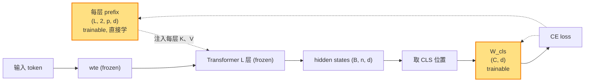

# P-Tuning v2（lecture 04）

> **P-Tuning v2: Prompt Tuning Can Be Comparable to Fine-tuning Universally Across Scales and Tasks**
> Xiao Liu, Kaixuan Ji, Yicheng Fu, Weng Lam Tam, Zhengxiao Du, Zhilin Yang, Jie Tang — Tsinghua, 2021
> arXiv: [2110.07602](https://arxiv.org/abs/2110.07602) · 本地 PDF：[`../papers/04-p-tuning-v2-2022.pdf`](../papers/04-p-tuning-v2-2022.pdf)
> 配套代码：[`../src/p_tuning_v2_minimal.py`](../src/p_tuning_v2_minimal.py) · [`../src/p_tuning_v2_peft.py`](../src/p_tuning_v2_peft.py)

---

## 第 1 张幻灯片：封面与导读

**研究问题**：能否设计一种**单一的 prompt tuning 方法**，让它在**所有规模、所有 NLP 任务**上都达到全参微调水准？

**核心 claim**：把 P-Tuning v1 升级为"**每层都加 KV prefix**"（思想等价 Prefix Tuning），并**去掉 reparameterization、改用分类头**，得到一种通用的 prompt tuning。**P-Tuning v2 在小模型、序列标注、跨任务、跨规模上都能追上全参微调。**

**本节回答 4 个问题**：

1. v1 在哪些场景失效？为什么？
2. v2 借鉴了 Prefix Tuning 的什么思想？又抛弃了什么？
3. 为什么 v2 反而能去掉 reparameterization？
4. v2 与 Prefix Tuning 在工程上几乎一样，为什么作者还要发一篇论文？

> **学习建议**：本篇是专题的"压轴"——它统一了前三篇的思想。如果你已读完 lecture 01、02、03，本篇主要是看"作者如何在工程上把三者优点拼起来"。

---

## 第 2 张幻灯片：符号速查表

| 符号 | 含义 | 维度 | 与 lecture 01 关系 |
|------|------|------|--------------------|
| $L$ | Transformer 层数 | 标量 | 同 |
| $H$ | 注意力头数 | 标量 | 同 |
| $d$ | 隐层维度 | 标量 | 同 |
| $d_h$ | 单头维度 = $d/H$ | 标量 | 同 |
| $n$ | 输入序列长度 | 标量 | 同 |
| $p$ | prefix 长度 | 标量（典型 8-20） | 同 |
| $\mathbf{P}^{(\ell, K)}, \mathbf{P}^{(\ell, V)}$ | **可训练**的第 $\ell$ 层 K-、V-prefix | $\mathbb{R}^{p \times d}$ | **同 Prefix Tuning** |
| $\boldsymbol{\theta}_{\mathrm{LM}}$ | 冻结的 LM 参数 | — | 同 |
| $\boldsymbol{\phi}$ | 可训练参数 | $\mathbb{R}^{L \cdot p \cdot 2 d}$ | **比 Prefix 少：无 reparam** |
| $W_\text{cls}$ | 分类头（任务特定） | $\mathbb{R}^{C \times d}$ | Prefix Tuning 用 LM head |

---

## 第 3 张幻灯片：v1 的两个痛点

**痛点 1：小模型上的 NLU 性能不稳**

- v1 在 SuperGLUE 大模型（MegatronLM 11B）上接近 SOTA
- 但在 BERT-base / GPT-2 base 这种小模型上，比标准 fine-tuning 仍差 1-3 分
- 作者诊断：**输入层一次干预不够**，需要更深的 prompt 影响

**痛点 2：序列标注任务（NER、POS、SRL）失效**

- 序列标注要求模型对**每个 token**输出标签
- v1 的 prompt 在输入层堆叠，对每个 token 的影响**不均匀**（前面 token 受 prompt 影响多，后面 token 受影响少）
- 作者实验：在 CoNLL-NER 上 v1 比标准 fine-tuning **差 8-12 F1**

**作者的诊断**：单层 prompt 信号衰减太快，需要"每层都重新注入"。

---

## 第 4 张幻灯片：灵感来源——Prefix Tuning

回顾 [`01-prefix-tuning.md`](01-prefix-tuning.md)（lecture 01）：

- 在每层 self-attention 的 K、V 前拼接可训练 prefix
- 用 MLP reparameterization 解决训练不稳

**v2 的洞察**：

1. ✅ **保留**：每层加 prefix → 解决 v1 的"信号衰减"问题
2. ❌ **抛弃**：MLP reparameterization → v1 用 LSTM 还能训稳，去掉 reparam 后用 LSTM-like 的归纳偏置仍然过强；改成直接学，配合**任务特定分类头**就够了
3. 💡 **新加**：分类头替代 LM head → 不用把分类问题强行套成生成问题

**v2 = Prefix Tuning - MLP + classification head + 用于 NLU**

---

## 第 5 张幻灯片：v2 的三大改进

| 改进 | 来自 | 解决什么 |
|------|------|---------|
| ① **Deep prompt**（每层 KV） | 借鉴 Prefix Tuning | v1 的信号衰减、序列标注失效 |
| ② **去掉 reparameterization** | 自己实验发现没必要 | 训练复杂度高、超参敏感 |
| ③ **任务特定分类头** | 标准做法 | NLU 任务（特别是分类）不该套 LM head |

**关键观察**：v2 的"算法骨架"几乎等于 Prefix Tuning（参数布局完全一样），只是：
- 不用 MLP
- 加分类头
- 应用场景从 NLG 改成 NLU

> **学习要点**：这是一个"应用驱动+工程简化"的论文，理论新意不大，但**完整跑通了"通用 prompt tuning"的最后一公里**。

---

## 第 6 张幻灯片：改进 ①——Deep prompt

**做法**：

$$\text{prefix}_K = \mathbf{P}^{(\ell, K)} \in \mathbb{R}^{p \times d}, \quad \ell = 1, \dots, L \quad (1)$$

$$\text{prefix}_V = \mathbf{P}^{(\ell, V)} \in \mathbb{R}^{p \times d}, \quad \ell = 1, \dots, L \quad (2)$$

**逐项重述**：

- $\mathbf{P}^{(\ell, K)} \in \mathbb{R}^{p \times d}$：**可训练**的 K-prefix（第 $\ell$ 层）。注意这里维度是 $p \times d$ 而非按头切分的 $p \times d_h$——稍后在前向时会把 $d$ 维 reshape 成 $H$ 个头 $\times d_h$ 维
- $\mathbf{P}^{(\ell, V)}$：同上但是 V-prefix
- $\ell \in \{1, \dots, L\}$：层编号

**为什么 deep prompt 解决信号衰减？**

每层都有独立的 prefix 直接注入到注意力上下文，**强制让每层都"看到"任务相关的 prompt 信号**，不依赖前层信号的传递。

**与 Prefix Tuning 一样的参数布局** —— v2 就是不带 MLP 的 Prefix Tuning。

---

## 第 7 张幻灯片：改进 ②——去掉 reparameterization

**Prefix Tuning** 必须 MLP：

$$[\mathbf{P}^{(1, K)}; \mathbf{P}^{(1, V)}; \dots] = \mathrm{MLP}_\phi(\mathbf{P}'_{\theta'}) \quad \text{(lecture 01 公式 3)}$$

**v2 直接学**：

$$\mathbf{P}^{(\ell, K)}, \mathbf{P}^{(\ell, V)} \sim \mathcal{N}(0, \sigma^2)\ \text{init}, \ \text{再用 AdamW 更新} \quad (3)$$

**为什么这样能训稳？**

作者在 v2 的实验里发现：
- 用大学习率（5e-3 ～ 1e-2）+ AdamW
- 配合分类头的强信号（cross-entropy 直接监督 logits）
- 训练能正常收敛，**完全不需要 reparam 的归纳偏置**

**好处**：

- 训练时参数量等于推理时参数量 = $L \cdot p \cdot 2 d$
- 没有 MLP，超参少
- 部署简单（无需"丢弃 MLP"步骤）

---

## 第 8 张幻灯片：改进 ③——任务特定分类头

**v1 / Prefix Tuning 的做法**：

- 把分类问题转成生成问题
- 让 LM head 输出某个标签词（如 "positive"）的概率

**v2 的做法**：

```
hidden_state (B, n, d)
     │
     ▼ 取 [CLS] 或某个汇总位置的 hidden state (B, d)
     ▼ 任务分类头 W_cls: (d, C)
classification logits (B, C)
     │
     ▼ cross-entropy
loss
```

**形式化**：

$$\hat{y} = \mathrm{softmax}(\mathbf{W}_{\text{cls}} \mathbf{h}_{\text{cls}}) \quad (4)$$

**逐项重述**：

- $\mathbf{h}_{\text{cls}} \in \mathbb{R}^d$：用作分类的隐状态（如 [CLS] 位置的输出）
- $\mathbf{W}_{\text{cls}} \in \mathbb{R}^{C \times d}$：**可训练**的分类头权重，$C$ 是类别数
- $\hat{y} \in \mathbb{R}^C$：类别概率

**优点**：

- 任务设计更直接（不用 verbalizer 把类别名转 token）
- 序列标注任务直接每个位置接一个分类头
- 与传统 BERT NLU 实践一致

> **代价**：分类头参数量 $C \cdot d$，但通常 $C$ 很小（2-50），可忽略。

---

## 第 9 张幻灯片：数学符号约定（再次重申）

把公式中要用到的符号重述：

- $\mathbf{Q}_h^{(\ell)}, \mathbf{K}_h^{(\ell)}, \mathbf{V}_h^{(\ell)} \in \mathbb{R}^{n \times d_h}$：第 $\ell$ 层第 $h$ 头的 query/key/value
- $\mathbf{P}^{(\ell, K)} \in \mathbb{R}^{p \times d}$：**可训练**的 K-prefix（按 $d$ 维存储，按头切分后每头 $\mathbb{R}^{p \times d_h}$）
- $\mathbf{P}^{(\ell, V)}$：同上但是 V-prefix
- $\ell$：层编号 $\in \{1, \dots, L\}$
- $\boldsymbol{\theta}_{\mathrm{LM}}$：冻结的 LM 参数
- $\boldsymbol{\phi}$：可训练参数 = $\{\mathbf{P}^{(\ell, K)}, \mathbf{P}^{(\ell, V)}\}_{\ell=1}^L \cup \{\mathbf{W}_{\text{cls}}\}$

> 与 Prefix Tuning（lecture 01）几乎完全一样的记号 —— 这是 v2 的"故意继承"。

---

## 第 10 张幻灯片：方法公式 (1)——带 prefix 的注意力

$$\mathrm{head}_h^{(\ell)} = \mathrm{Attn}\!\Bigl(\mathbf{Q}_h^{(\ell)},\ \bigl[\mathbf{P}_h^{(\ell, K)}; \mathbf{K}_h^{(\ell)}\bigr],\ \bigl[\mathbf{P}_h^{(\ell, V)}; \mathbf{V}_h^{(\ell)}\bigr]\Bigr) \quad (5)$$

**逐项重述**（与 lecture 01 公式 (2) 几乎一字不差，故省略详细解读，仅指出差异）：

- $\mathbf{P}_h^{(\ell, K)} \in \mathbb{R}^{p \times d_h}$：第 $\ell$ 层第 $h$ 头的 K-prefix（来自 $\mathbf{P}^{(\ell, K)}$ 按头切分）
- $\mathbf{P}_h^{(\ell, V)}$：同上
- 其他符号同 lecture 01 公式 (2)

**与 Prefix Tuning 的唯一差异**：$\mathbf{P}^{(\ell, K/V)}$ 由公式 (3) **直接学**，**不**经 MLP（lecture 01 公式 3 那一步在 v2 里被去掉）。

---

## 第 11 张幻灯片：方法公式 (6)——训练目标

$$\boldsymbol{\phi}^{*} = \arg\min_{\boldsymbol{\phi}}\ \mathcal{L}_{\text{CE}}\bigl(\hat{y}, y\bigr) \quad (6)$$

**逐项重述**：

- $\hat{y}$：模型预测（来自公式 (4) 的分类头输出）
- $y$：真实标签（one-hot 或 token id）
- $\mathcal{L}_{\text{CE}}$：交叉熵损失
- $\boldsymbol{\phi}$：可训练参数集合（参见第 9 张幻灯片）

**实际实现**：直接用 PyTorch 的 `F.cross_entropy` 或 transformers 的 `labels=` 参数。

---

## 第 12 张幻灯片：参数量精确分析

$$|\boldsymbol{\phi}| = \underbrace{L \cdot p \cdot 2 d}_{\text{deep prefix}} + \underbrace{C \cdot d}_{\text{分类头}} + \underbrace{C}_{\text{bias}}$$

**GPT-2 base 数值**（$L=12, p=10, d=768, C=2$）：

| 项 | 参数数 |
|----|--------|
| deep prefix | $12 \times 10 \times 2 \times 768 = 184{,}320$ |
| 分类头权重 | $2 \times 768 = 1{,}536$ |
| 分类头 bias | $2$ |
| **合计** | $\approx 185{,}858$（**0.15% 的 GPT-2 base**） |

**关键对比**：

| 方法 | 参数量 | 与全参 fine-tuning 比 |
|------|--------|----------------------|
| P-Tuning v2 | **186K** | 0.15% |
| Prefix Tuning（含 MLP） | 9.8M | 7.4% |
| P-Tuning v1 | 4.3M | 3.4% |
| Prompt Tuning | 7.7K | 0.006% |

> **v2 的甜区**：参数量适中（≪Prefix），训练简单（无 reparam），效果通用（覆盖 v1 不行的场景）。

---

## 第 13 张幻灯片：与 Prefix Tuning 的差异

| 维度 | P-Tuning v2 | Prefix Tuning |
|------|-------------|---------------|
| **参数布局** | 每层 KV prefix | 每层 KV prefix |
| **reparameterization** | **无**（直接学） | **必须**（MLP） |
| **任务头** | **任务特定分类头** | LM head（生成式 verbalizer） |
| 训练参数量 | $L \cdot p \cdot 2 d$ | $L \cdot p \cdot 2 d$ + MLP |
| 主战场 | NLU（含序列标注） | NLG |
| 学习率 | 5e-3 ～ 1e-2（大） | 5e-5（小） |

**核心 insight**：v2 = Prefix Tuning - MLP - LM head + 分类头

> v2 论文反复强调：**去掉 MLP 不影响效果**，前提是配合任务特定的分类头。这与 Prefix Tuning 原论文（必须 MLP）相比是反直觉的。

---

## 第 14 张幻灯片：与 P-Tuning v1 的差异

| 维度 | P-Tuning v2 | P-Tuning v1 |
|------|-------------|-------------|
| prompt 位置 | **每层 KV** | 仅输入层 |
| reparam 网络 | **无** | Bi-LSTM + MLP |
| 模板自由度 | 全自动（无需手工设计模板） | 有（anchor + pseudo token 任意位置） |
| anchor token | 不需要 | 关键 |
| 适用任务 | NLU + 序列标注 | NLU（分类、QA） |
| 与小模型兼容 | **是** | 是但不如 v2 |
| 训练复杂度 | 低 | 高（LSTM） |

> **v2 砍掉了 v1 的两大设计**（LSTM、anchor token），但通过"每层 KV prefix"补回甚至超越了 v1 的表达力。

---

## 第 15 张幻灯片：架构示意图（Mermaid）



**关键**：

- 黄色 = 可训练（仅 deep prefix + 分类头）
- 注入：与 Prefix Tuning 完全相同的机制
- 没有 MLP！

---

## 第 16 张幻灯片：张量形状追踪

```
0. prefix tensor:           (L, 2, p, n_head, d_h)    # (12, 2, 10, 12, 64) trainable
                                  │
                                  ▼ permute + expand batch
1. per-layer K, V:          (B, n_head, p, d_h) ×2 per layer
                                  │
                                  ▼ wrap in DynamicCache
2. past_key_values:         DynamicCache(num_layers=L)
                                  │
                                  ▼ Transformer (frozen, with past_key_values)
3. hidden states:           (B, n, d)        # 注意输出长度仍是 n！
                                  │
                                  ▼ 取分类位置（如最后一个 token）
4. hidden_cls:              (B, d)
                                  │
                                  ▼ Linear(d, C)
5. logits:                  (B, C)
                                  │
                                  ▼ CE loss
6. loss:                    scalar
                                  │
                                  ▼ backward → 仅梯度到 prefix 和 W_cls
```

---

## 第 17 张幻灯片：实验设置

| 项 | 取值 |
|----|------|
| 基础模型 | BERT-base/large、RoBERTa-base/large、DeBERTa-large、GLM-large/xlarge、T5-large |
| 评测任务 | SuperGLUE、CoNLL03/04/05 NER、OntoNotes 5.0、CoNLL12 SRL、SQuAD |
| Prefix 长度 $p$ | 主结果用 $p=20$，扫描 $\{1, 8, 20, 100\}$ |
| 学习率 | 5e-3 ～ 1e-2（**比 Prefix Tuning 大 100 倍**） |
| Batch | 16-32 |
| Steps | task-specific（典型 20K-100K） |

---

## 第 18 张幻灯片：关键实验 ①——SuperGLUE 主结果

| 模型 + 方法 | SuperGLUE avg |
|-----------|---------------|
| RoBERTa-large 全参 FT | 84.0 |
| RoBERTa-large + Prompt Tuning | 71.4（落后 12.6） |
| RoBERTa-large + P-Tuning v1 | 81.5（落后 2.5） |
| **RoBERTa-large + P-Tuning v2** | **84.2**（**追上**） |
| DeBERTa-xxlarge 全参 | 91.9 |
| DeBERTa-xxlarge + Prompt Tuning | 85.0 |
| **DeBERTa-xxlarge + P-Tuning v2** | **91.6**（追上） |

**结论**：

- v2 在 **RoBERTa-large**（~350M）这种**非大模型**上首次追平全参
- 对 11B 级别的大模型同样追平

---

## 第 19 张幻灯片：关键实验 ②——序列标注（NER）

| 方法 | CoNLL03 F1 | OntoNotes F1 |
|------|-----------|--------------|
| RoBERTa-large 全参 FT | 92.5 | 89.2 |
| RoBERTa-large + Prompt Tuning | 67.5 | 65.4（**完全不可用**） |
| RoBERTa-large + P-Tuning v1 | 84.2 | 81.6（仍差 8 F1） |
| **RoBERTa-large + P-Tuning v2** | **92.3**（追上） | **89.0**（追上） |

**结论**：

- v1 和 Prompt Tuning 在序列标注上**严重不行**
- v2 是**首个**在 NER 等序列标注任务上追平全参的 prompt-based 方法
- 这是 v2 的"杀手锏"——证明它真正"通用"

---

## 第 20 张幻灯片：关键实验 ③——模型规模 scan

论文 Figure 3：在 BoolQ（SuperGLUE 任务之一）上扫不同模型大小。

```
BoolQ accuracy
   ▲
80 │             ┌────────────────── full fine-tuning
   │           ╱
   │         ╱           ┌─── P-Tuning v2
70 │       ╱           ╱
   │     ╱           ╱
   │   ╱           ╱     ┌── Prompt Tuning
60 │ ╱           ╱     ╱
   │           ╱     ╱     
50 │         ╱     ╱       
   │       ╱     ╱
40 │     ╱     ╱
   │   ╱     ╱
30 ├─┬─────┬─────┬─────┬───► 模型规模
       110M   330M  large XL/XXL
```

**结论**：

- Prompt Tuning：只有 XXL 才追平（重现 lecture 02 的结论）
- v2：**从 BERT-base（110M）就追平**了全参微调
- 这是 "Universally across scales" 标题的来源

---

## 第 21 张幻灯片：关键实验 ④——消融（deep vs shallow）

论文 Table 4：只在前 $k$ 层加 prefix，看效果。

| 加 prefix 的层 | SuperGLUE avg |
|---------------|---------------|
| 只第 1 层（= Prompt Tuning） | 71.4 |
| 前 4 层 | 78.5 |
| 前 8 层 | 82.0 |
| **所有 L=24 层（deep prompt）** | **84.2** |

**结论**：

- 加得越深越好
- 只第 1 层 vs 全部层：差 13 分
- 这一消融**直接论证**了 deep prompt 的必要性

---

## 第 22 张幻灯片：关键实验 ⑤——reparam 有无

论文 Table 5：

| 方法 | SuperGLUE avg |
|------|---------------|
| P-Tuning v2，**无 reparam** | **84.2** |
| P-Tuning v2，**带 MLP reparam** | 83.9 |
| P-Tuning v2，**带 LSTM reparam** | 83.5 |

**结论**：

- 在 v2 框架下，**reparam 反而略差**（≤0.3 分）
- 配合**大学习率 + 分类头**，直接训也能稳

> 这与 Prefix Tuning 原论文"必须 MLP"的结论相反——是 v2 论文的反直觉发现之一。

---

## 第 23 张幻灯片：横向对比（专题总结）

| 维度 | Prefix Tuning | Prompt Tuning | P-Tuning v1 | **P-Tuning v2** |
|------|--------------|---------------|-------------|-----------------|
| prompt 位置 | 每层 KV | 输入层 | 输入层（任意位置） | **每层 KV** |
| reparam | MLP | 无 | LSTM+MLP | **无** |
| 任务头 | LM head | LM head | LM head | **任务分类头** |
| 训练参数（$p=10$, GPT-2 base） | 9.8M | 7.7K | 4.3M | **186K** |
| 主战场 | NLG | NLU/NLG | NLU 分类 | **通用** NLU |
| 序列标注 | 一般 | 不行 | 不行 | ✅ |
| 小模型友好 | ✅ | ❌ | ✅ | ✅ |
| 学习率 | 5e-5 | 0.3 | 1e-4 | 5e-3 |
| 训练复杂度 | 高（MLP） | 低 | 高（LSTM） | **中** |

> **v2 是这四种方法的"集大成者"**：保留 Prefix 的 deep prompt，去掉它的 MLP，借鉴 v1 的 NLU 焦点，但用分类头替代 anchor 设计。

---

## 第 24 张幻灯片：优点

✅ **真正"通用"**：在所有规模、所有 NLU 任务（含序列标注）上追上全参 FT

✅ **训练简单**：无 reparam，AdamW + 大学习率就能跑

✅ **参数量适中**：186K（比 Prefix 少 50 倍，比 Prompt 多 25 倍）

✅ **推理无额外开销**（vs Prefix）：无 MLP 要 maintain

✅ **工业部署友好**：和 LoRA 一样可以做"一个主干 + 多个任务 prefix" 的多任务系统

---

## 第 25 张幻灯片：缺点与适用边界

❌ **不适用于纯生成任务**：分类头设计针对 NLU，NLG 仍推荐 Prefix Tuning

❌ **超参敏感**：学习率从 5e-5（Prefix）到 5e-3（v2）跨两个数量级，调参困难

❌ **依赖任务头**：每个任务要重新设计 head，少了 prompt-only 的"零任务头"美感

❌ **小数据上不如 v1 稳定**：deep prefix 容易过拟合

❌ **比 LoRA 简单但不一定更强**：2022 后 LoRA 在大模型上更主流

**v2 的适用边界**：

```
任务类型           推荐
─────────────      ─────────────────────────
NLU 分类           P-Tuning v2 ⭐
序列标注（NER）    P-Tuning v2 ⭐⭐（独家）
NLG 生成           Prefix Tuning
极大模型 + 通用    LoRA / Prompt Tuning
```

---

## 第 26 张幻灯片：PyTorch 核心代码片段

完整文件：[`../src/p_tuning_v2_minimal.py`](../src/p_tuning_v2_minimal.py)

```python
class PTuningV2GPT2(nn.Module):
    def __init__(self, prefix_length=10):
        super().__init__()
        self.lm = GPT2LMHeadModel.from_pretrained("gpt2")
        for p in self.lm.parameters():
            p.requires_grad = False              # 冻结 LM

        cfg = self.lm.config
        L, H = cfg.n_layer, cfg.n_head
        d_h = cfg.n_embd // H
        
        # 公式 (3)：直接学 (L, 2, p, n_head, head_dim) 大张量，无 MLP
        self.prefix = nn.Parameter(torch.empty(
            L, 2, prefix_length, H, d_h
        ))
        nn.init.normal_(self.prefix, mean=0.0, std=0.02)

    def get_past_key_values(self, B):
        # 直接切分，无 MLP
        past = []
        for l in range(L):
            k = self.prefix[l, 0].permute(1, 0, 2).unsqueeze(0).expand(B, -1, -1, -1)
            v = self.prefix[l, 1].permute(1, 0, 2).unsqueeze(0).expand(B, -1, -1, -1)
            past.append((k, v))
        return DynamicCache(ddp_cache_data=past)

    def forward(self, input_ids, attention_mask, labels=None):
        past = self.get_past_key_values(input_ids.shape[0])
        full_mask = torch.cat([torch.ones(B, p_len), attention_mask], dim=1)
        return self.lm(input_ids=input_ids, attention_mask=full_mask,
                       past_key_values=past, use_cache=False, labels=labels)
```

**对应公式**：

- `self.prefix` ← 公式 (1)(2) 中的 $\{\mathbf{P}^{(\ell, K)}, \mathbf{P}^{(\ell, V)}\}$
- **没有** MLP（与 lecture 01 Prefix Tuning 的 `self.reparam` 对比）
- DynamicCache 注入方式与 Prefix Tuning **一模一样**

> 注：本 minimal 简化为"只学 prefix，沿用 LM head"（即没加分类头），主要为了与 Prefix Tuning 做"控制变量"对比。

---

## 第 27 张幻灯片：peft 调包对照

完整文件：[`../src/p_tuning_v2_peft.py`](../src/p_tuning_v2_peft.py)

```python
from peft import PrefixTuningConfig, TaskType, get_peft_model

config = PrefixTuningConfig(
    task_type=TaskType.CAUSAL_LM,
    num_virtual_tokens=10,
    prefix_projection=False,  # ← 关键：关闭 reparameterization
)
model = get_peft_model(base, config)
```

**peft 内部结构**（实测）：

```
prompt_encoder.default.embedding.weight: shape=(10, 18432), numel=184,320
```

**与手写 minimal 的对照**：

- minimal: `self.prefix` shape `(L=12, 2, p=10, H=12, d_h=64)` 总数 = $12 \times 2 \times 10 \times 768 = 184{,}320$
- peft: `embedding.weight` shape `(10, 18432)` 总数 = $10 \times 18{,}432 = 184{,}320$
- **两者完全等价**，仅参数布局不同

**强一致性**：因为 v2 **无 reparam、无 LSTM、无随机 dropout**，logits 可以做 bit 精确对照（见 [`../src/tests/test_p_tuning_v2_consistency.py`](../src/tests/test_p_tuning_v2_consistency.py)）。

---

## 第 28 张幻灯片：思考题与全专题总结

**思考题**（写在 [`04-p-tuning-v2.ipynb`](../notebooks/04-p-tuning-v2.ipynb)）：

1. **参数等价性**：minimal 的 `(L, 2, p, H, d_h)` 与 peft 的 `(p, L*2*d)` 是同一组参数的不同布局。请写一个转换函数 `convert_minimal_to_peft(tensor)` 完成 reshape + permute。
2. **学习率敏感性**：v2 论文用 5e-3 ～ 1e-2 学习率，Prefix Tuning 用 5e-5。请猜测原因并测试。
3. **deep vs shallow 消融**：把 v2 退化为"只前 4 层加 prefix"，参数量降多少？toy 任务 loss 收敛会更慢吗？
4. **v2 vs Prefix Tuning（代码上）**：去掉 v2 minimal 的 prefix Parameter，改成 Prefix Tuning 的 P_low + MLP，重测 logits 差异。
5. **任务分类头**：若加一个 `nn.Linear(768, 2)` 分类头并改用 `F.cross_entropy`，整套训练流程如何调整？

**全专题总结**：

```
prompt-based fine-tuning 的演进
─────────────────────────────────────────────────
Prefix Tuning（2021-01）：     每层 KV + MLP reparam            → NLG
P-Tuning v1（2021-03）：       输入层 + LSTM + anchor           → NLU 分类
Prompt Tuning（2021-04）：     输入层 + 无 reparam              → 大模型万能
P-Tuning v2（2021-10）：       每层 KV + 无 reparam + 分类头     → 通用 ⭐
─────────────────────────────────────────────────
其后（2021后）：              LoRA (Hu et al. 2021)、AdaLoRA、IA³
                              这些方法换了另一条路径：不再做 prompt，
                              而是在权重上加低秩适配
```

**给自己的关键问题**：
- 我能用一句话向同事解释这四种方法分别在何时被采用吗？
- 我能在白板上推导出 v2 的参数量公式吗？
- 如果有人问"为什么不直接用 LoRA？"，我能解释 prompt-based 方法的独到优势吗？

---

> **专题学习结束**。回到 [`../README.md`](../README.md) 查看横向对比表，巩固整体认知。
