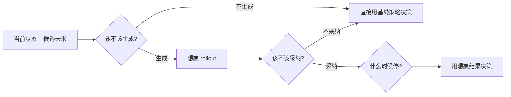
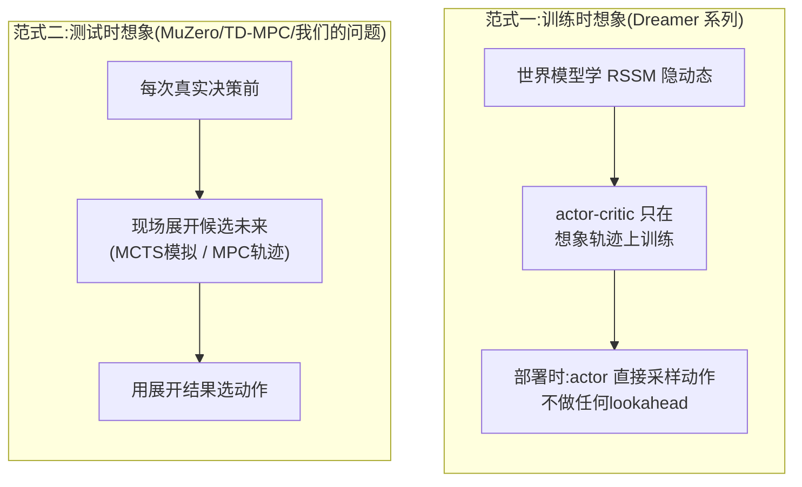
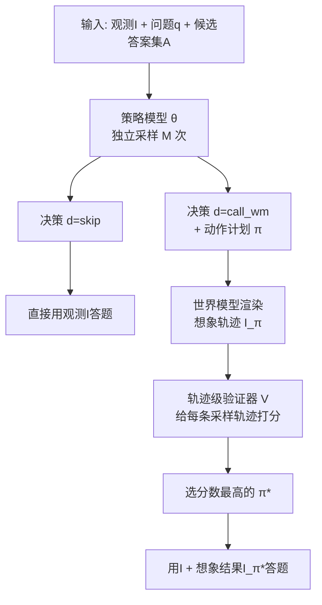
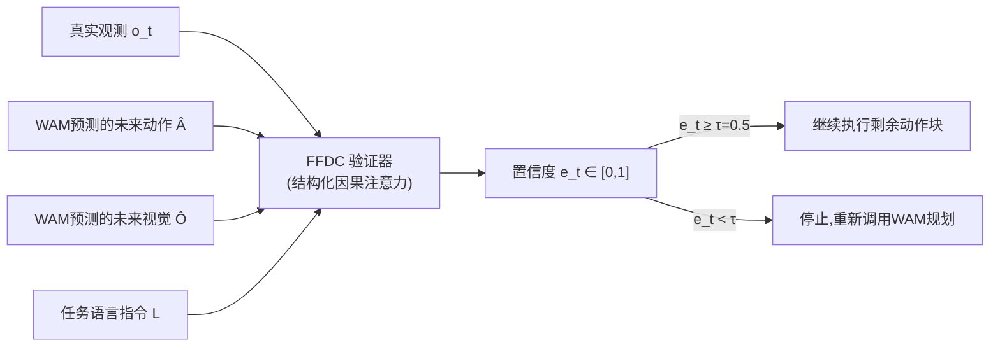
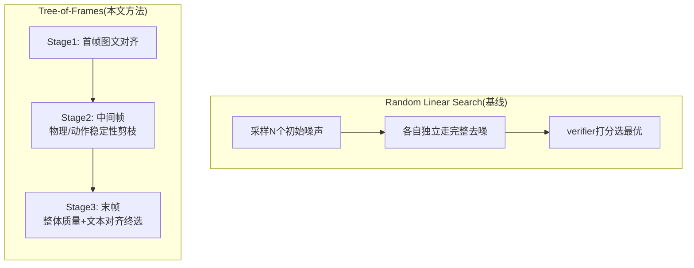
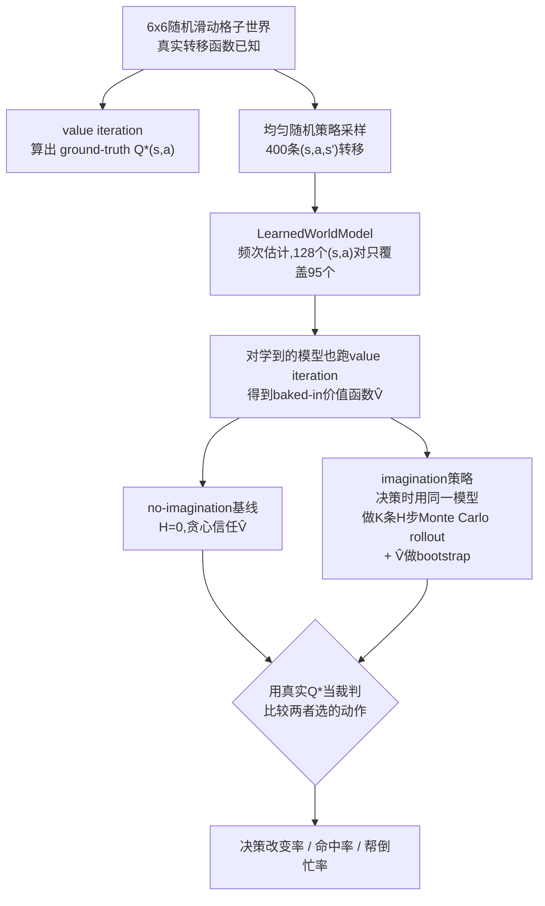

# 测试时想象预算的自适应分配——会前详细简报

> PPT 风格,~30 页量级。写给带去和 Song、Weikai 开会用:每一节都有"要点"先行,细节和公式在要点之后,
> 方向选择本身不在这份文档里做决定——决定权在会议。全部数字均标注出处(论文 §/Table/Fig 或本项目自己
> 的 pilot 结果),不臆造。三篇最近邻工作(AVIC/FFDC/Video-T1)和 DreamerV3 是本次会前准备**逐字读了
> PDF 原文**写的,不是转述 abstract。

---

## 0. 一页说清楚

> **要点**:现有 world model 的"想象"预算(想多久、想几个候选、信不信)几乎全是训练前定死的常数——
> 从 2018 年的 World Models 到 2026 年的 AVIC,这个模式贯穿了 8 年文献。最贴近的三个 2024-2026 年工作
> (AVIC/FFDC/Video-T1)已经证明"选择性想象"确实能省算力、提精度,但没有一个做到我们最初设想的
> **"相对不想象 + 相对其他候选"双重比较**。我们自己的 pilot 在一个受控小环境里进一步发现:**想象要划算,
> 必须在决策那一刻真的比基线多掌握点什么**——单纯多算几步、多采几次样,在信息量不变的前提下只会引入噪声,
> 这条结论有完整的数学推导支撑,不是拍脑袋。

**核心问题(三个决策点)**:

---

## 1. 问题定义与动机

### 1.1 为什么这个问题值得做

> **要点**:不是我们凭空猜"想象预算分配粗糙"——这是贯穿 A 组 16 篇文献(1803.10122→2606.02486)
> 的一条实证证据链,AVIC 论文自己的诊断实验(读原文验证)把这个直觉量化到了具体数字。

AVIC 论文 §3(Analysis of Always-on World Model Calling)在 SAT-Real 数据集上人工把每条样本分成四类
(Fig.2a,数字来自原文):

| 类别 | 占比 | 含义 |
|---|---|---|
| Unnecessary(Case 3) | **54%** | 不调用世界模型也能答对,想象是多余的 |
| Helpful(Case 1) | **14%** | 想象真正带来了正确答案 |
| Misleading(Case 2) | 9% | 想象引入噪声/幻觉,导致答错 |
| All Failed | 23% | 想象与否都答错 |

也就是说,在这个诊断集上,**只有 14% 的情况想象真正帮上忙**,而现有 always-on(逢查必想)策略对全部
100% 的样本都无差别调用世界模型。代价:always-on 想象比不想象只多拿到 **4.6% 的准确率提升,但要多花
近两个数量级的 token、约 30 倍的推理时间**(原文 §3 第三段,Fig.2c)。作者进一步算了一个"选择性想象上界"
(假设一个先知能精确预测该不该想象):baseline 62.0% → always-on 66.6% → 选择性上界 **75.3%**——这
中间近 9 个点的差距就是"该不该想象判断准不准"这件事本身能撬动的空间,也正是我们要做的事。

### 1.2 现有"想象"其实是两套完全不同的范式,不能混为一谈

> **要点**:读完 DreamerV3 原文才确认——**Dreamer 系列的"想象"是训练时机制,不是测试时机制**。
> 部署时它是一个纯 amortized policy,不做任何决策时搜索。这和 MuZero/TD-MPC/我们要做的 controller
> 完全是两回事,之前的资料整理没有把这一层说清楚。

DreamerV3 原文明确写道(Critic learning 一节):"we select actions by sampling from the actor network
**without lookahead planning**"——想象只发生在离线训练阶段,用来产生 λ-return 训练 actor 和 critic
(RSSM 公式:h_t=f_φ(h_{t-1},z_{t-1},a_{t-1}),z_t~q_φ(z_t|h_t,x_t),想象展开的固定长度和 Dreamer/
DreamerV2 一脉相承,量级在十几步)。**这意味着 A 组文献里"想象预算固定"这个证据,一半来自训练时的
固定 horizon(Dreamer 系),一半来自测试时的固定模拟次数/候选数(MuZero/TD-MPC 系)——我们的
controller 要解决的是后者,但前者的证据同样支撑"这个领域普遍没有自适应分配想象计算"这个大前提。**

固定预算的具体证据(全部来自 A 组文献原文,§ 见 papers/INDEX.md):

| 系统 | 固定的是什么 | 数值/证据 |
|---|---|---|
| Dreamer/V2/V3(训练时) | 想象展开步数 | 沿用固定 horizon(十几步量级),跨 150+ 任务同一套超参数不变 |
| MuZero/EfficientZero(测试时) | MCTS 模拟次数 | 每步固定 50-800 次模拟,PUCT 只决定预算内部怎么分,不决定要不要减总量 |
| TD-MPC2(测试时) | MPPI 候选轨迹数 | 固定约 512 条候选,跨 80+ 任务单一配置 |
| AVIC 的 always-on 基线 | 想象视角数 | 逢查必想,平均 8.90 个想象视角/问题(vs AVIC-R 学出来的 3.60) |

---

## 2. 三个最近邻工作深度解析

> **要点**:这三篇是 2024-2026 年里结构上离我们目标最近的工作,分别覆盖"该不该生成"(AVIC)、
> "该不該継续信/何时停"(FFDC)、"想象内部怎么搜索"(Video-T1)三个角度,但没有一篇做到
> "多候选相对比较 + 相对不想象基线"的完整闭环。下面每篇都是读完原文后的精确复述,不是摘要转述。

### 2.1 AVIC——最接近的整体框架,但比较机制是"自洽性"不是"决策价值"

**论文**:Yu et al., *When and How Much to Imagine: Adaptive Test-Time Scaling with World Models for
Visual Spatial Reasoning*, arXiv:2602.08236(2026,UNC Chapel Hill + NTU)。

**机制(原文 §4,公式照抄+解释)**:

- 门控 + 规划一体化(Eq.1):`(d,π) ~ θ(d,π | I,q,A)`,其中 `d∈{skip, call_wm}`,`π` 是一段离散动作
  计划(`d=skip` 时 `π=∅`)。策略采样 M 次,用多数投票聚合出最终决策,这是它处理"决策不确定性"的方式。
- 轨迹级验证(Eq.2):`s^(m)=V(I,q,I_π(m))`,`π*=argmax s^(m)`——**关键点:这 M 条候选轨迹全部来自
  同一个策略对同一个问题的独立重复采样**(self-consistency),验证器选的是"这次采样质量最高的一次尝试",
  不是在几个本质不同的候选未来(比如"往左走" vs "往右走"这种真正会导致不同后果的选择)之间做决策价值比较。
- 训练目标 AVIC-R(Eq.4,GRPO):`r = 1_correct − c|π| − β_s·1_wrong-skip − β_p·1_parse-fail`,
  `c=0.1, β_s=β_p=0.5`。四项里只有 QA 正确性是正向信号,其余全是扣分项:动作长度成本(鼓励精简计划)、
  wrong-skip 惩罚(错误地跳过想象要扣分,防止策略摆烂全部 skip)、格式惩罚。**消融实验(Table 6)证实
  wrong-skip 惩罚是整个方法能训出来的关键——去掉它,策略直接崩溃成"全部 skip",准确率从 77.33% 掉到
  62.67%(掉 14.66 个点)。**

**真实效果(Table 1, Fig.2, Fig.5)**:AVIC-R 用 Qwen2.5VL-7B 做策略模型,平均每题只想象 **3.60 次**
(vs always-on 基线 8.90 次),准确率反而超过用 GPT-4o/GPT-4.1 直接做策略模型的版本。分类别看,想象的
价值高度不均:action-conditioned 类问题(答案依赖假设动作后的场景状态)WM 带来 **+57.1%** 的提升,
但 dynamics-understanding 类(纯参考系变换,不需要真的推演未来)只有 **+28.5%**。消融(Table 4)还
证明"只做二元门控、不做动作长度自适应"反而比 always-on 更差(73.3% vs 77.3%)——**gating 和"想多少"
必须联合优化,单独做 gating 会帮倒忙**,这条对我们自己设计 controller 是硬约束。

**和我们目标的精确差距**(不是泛泛而谈,是读完机制后的具体判断):
1. R2R 导航实验(Table 3)证明 AVIC **确实**能逐步应用到序贯决策场景,但每一步的 gate 决策彼此独立,
   **没有跨步骤的预算调度**(不会因为前面几步省了预算就在后面难的地方多花)——这是比"AVIC 完全不做
   序贯决策"更精确的差距描述,之前的腦暴文档这条写得不够准,这里订正。
2. 验证器比较的是"同一策略的 M 次自洽采样",不是"若干个语义上不同、后果不同的候选未来"之间的决策价值
   比较——用户最初设想的"相对其他候选未来的决策收益"这一半,AVIC 并没有真正做。
3. reward 是 QA 正确性代理,不是显式的 VOC(Value of Computation)目标函数。

### 2.2 FFDC——最接近"何时停/何时该重新想"，但只监控单条轨迹

**论文**:Wang et al., *When to Trust Imagination: Adaptive Action Execution for World Action Models*,
arXiv:2605.06222(2026,南方科技大学 + 港大 + Astribot)。

**机制**:World Action Model(WAM,骨干用 Motus)联合预测未来动作块和未来视觉 token。FFDC 是一个轻量
Transformer 验证器,每隔几步检查一次"已经预测的未来还能不能信":

关键设计:验证器只需要编码"最新一帧真实观测",其余(预测的动作/视觉/语言)全部走 KV cache,**不需要
重跑整个 WAM 就能算出置信度**,这是它能做到高频检查还很便宜的原因(§3.2)。训练是纯二分类:正样本=
真实成功轨迹片段,负样本=失败轨迹 + 人工构造的"腐化"片段(时间交换/夹爪翻转/后段加噪/尾部缩放四种
数据增强)。

**真实效果**:RoboTwin 困难任务上,成功率从 54.20%→**76.40%**(随机场景)、57.80%→**76.00%**(干净
场景);平均减少 WAM 前向调用 **69.10%**,执行时间快 **34.02%**。真实机器人(Astribot S1,25 自由度)
上,成功率从 45%→**80%**(但真实世界下平均调用次数和耗时反而略高于短 chunk 基线——**噪声越大,
FFDC 主动多花的计算换来的可靠性收益越明显,这本身就是"该不该多算"要按情况自适应的直接证据**)。消融
(Table 3)证明去掉"预测的视觉 token"输入,准确率掉得最多(76.4%→71.6%)——**想象出来的未来画面本身
就是最有信息量的信号,不是可有可无的装饰**,这条支撑我们整个项目的前提。

**和我们目标的精确差距**:FFDC 只监控"已经生成的那一条想象轨迹"和真实观测是否一致,决定"继续信"还是
"重新想"——它不涉及**生成多个候选未来、互相比较、挑一个采纳**这个环节,是我们三个决策点里"何时停"
做得最好、但"该不该采纳(在多个候选里选)"完全没碰的一个。

### 2.3 Video-T1——想象内部的搜索结构最像,但优化目标是生成质量不是决策价值

**论文**:Liu et al., *Video-T1: Test-Time Scaling for Video Generation*, arXiv:2503.18942
(2025,清华 + 腾讯)。

**机制**:把视频生成的 test-time scaling 重新表述为在高斯噪声空间里的路径搜索问题。两种搜索算法:

ToF 用多个 verifier(VisionReward/VideoScore/VideoLLaMA3)集成打分,在生成过程中动态分支(branching)+
剪枝(pruning),而不是像 Random Linear Search 那样每个候选独立走到底才比较。复杂度上,Random Linear
Search 是 O(TN)(T=帧数,N=候选数),ToF 是 O(N+T)——**真实 GFLOPs 对比(原文 Table 1)**:Pyramid-
Flow(FLUX)上 Linear Search 需要 5.22×10⁷ GFLOPs,ToF 只要 1.62×10⁷(约省 3.2 倍);NOVA 上约省 2.9
倍。VBench 总分提升:多数模型 TTS 后 +3.4~+5.9 分,但**OpenSora v1.2 反而是 −2.37(TTS 对这个模型
是负收益)**——连纯生成质量的 TTS 文献里,"多算不一定多好"也是真实观测到的现象,不是我们独有的发现。

**和我们目标的精确差距**(这是三篇里差距最本质的一篇):ToF 的 verifier 打分依据是"这个视频候选看起来
好不好、和文本提示符不符"(VBench 那套运动流畅度/语义对齐/美学质量),**整个流程里完全没有下游决策任务
的存在**——它优化的是生成质量,不是决策价值。我们的问题要解决的是"这个想象出来的未来,能不能帮我做出
更好的决策",这是两个不同的优化目标,即便搜索的树结构外形很像,内核完全不同。这条差距值得在故事里
明确强调,避免被认为是"给 Video-T1 换个 verifier"这种表面工作。

### 2.4 三者一张表说清楚差距

| 维度 | AVIC | FFDC | Video-T1 | 我们的目标 |
|---|---|---|---|---|
| 该不该生成 | ✅(gate) | — | — | ✅ |
| 该不该采纳/信 | 部分(verifier选自洽最优) | ✅(核心) | — | ✅ |
| 什么时候停 | 部分(固定动作长度内) | ✅(核心) | ✅(树剪枝) | ✅ |
| 相对不想象基线 | ✅(skip选项) | — | — | ✅ |
| 相对其他候选(语义不同的) | ❌(只是自洽采样) | ❌(单轨迹) | 部分(生成质量维度) | ✅ |
| 序贯决策/跨步预算调度 | 部分(逐步独立) | ✅(在线) | — | ✅(目标) |
| 优化目标是下游决策价值 | ✅ | ✅ | ❌(生成质量) | ✅ |

---

## 3. Idea 10 Pilot:想象到底什么时候真的有用?

> **要点**:在动手做任何新方法前,先在一个真实转移函数已知、可以精确算出"标准答案"的小环境里,
> 干净地测一遍"同一个不完美模型,决策时多想一想到底划不划算"。两个非预设、真实跑出来的发现,
> 其中一个有完整数学推导支撑,直接决定了任何后续 controller 设计都必须满足的前提条件。

### 3.1 为什么用合成环境,不是直接上 Atari/机器人

诊断性研究需要"裁判"——要判断"想象选的动作是不是真的更好",必须有 ground-truth 最优解做参照。真实
Atari/机器人环境里,"哪个动作真的更好"本身就要靠另一套昂贵评测才能估计,会把"测量工具准不准"和"想象
有没有用"两个问题混在一起。合成小环境(转移函数已知,可精确 value iteration)把这个混淆点排除掉了。

### 3.2 实验设计

两个策略刻意共享同一个不完美模型和同一个价值函数 V̂,唯一区别是要不要在决策那一刻多花算力重新搜索。
这是诊断性研究该有的控制变量纪律:先把"同一个模型,搜不搜都一样吗"这个最基础的问题测干净。

### 3.3 真实结果

**扫想象深度 H(固定候选数 K=5),5 个随机种子均值±标准差**:

| H | 决策改变率 | 命中率(改变里) | 帮倒忙率(改变里) |
|---|---|---|---|
| 1 | 0.100±0.046 | 0.440±0.338 | 0.560±0.338 |
| 2 | 0.125±0.056 | 0.300±0.272 | 0.700±0.272 |
| 3 | 0.163±0.067 | 0.397±0.129 | 0.603±0.129 |
| 5 | 0.169±0.058 | 0.287±0.253 | 0.713±0.253 |
| 8 | 0.231±0.047 | 0.272±0.127 | 0.728±0.127 |

**扫候选数 K(固定深度 H=3)**:

| K | 决策改变率 | 命中率(改变里) | 帮倒忙率(改变里) |
|---|---|---|---|
| 1 | 0.356±0.061 | 0.247±0.115 | 0.753±0.115 |
| 3 | 0.169±0.078 | 0.297±0.169 | 0.703±0.169 |
| 5 | 0.181±0.036 | 0.342±0.147 | 0.658±0.147 |
| 10 | 0.100±0.050 | 0.327±0.213 | 0.673±0.213 |

### 3.4 发现一(有完整数学推导):H 越深命中率不升反降,是这套设计的结构性质,不是"想象没用"

第一眼看会觉得"想象越深越帮倒忙",但推导一下会发现这几乎是设计本身决定的:no-imagination 基线用的
V̂,是对**同一个** LearnedWorldModel 精确 value iteration 算出来的不动点;imagination 的 rollout,
续跑策略用的是"贪心 V̂",跑完 H 步后又用 V̂ 做 bootstrap。也就是说,想象 rollout 的期望值,理论上会
沿着 Bellman 不动点方程精确 telescope 回 V̂ 自己算出的那个一步展开值——**和 H 无关**。换句话说,采样
次数趋于无穷时,想象和不想象应该给出完全相同的决策,因为想象从头到尾没有引入任何 V̂ 尚未掌握的新信息,
只是把同一个模型重新采样了几遍。

这精确解释了两个观测模式:K 越大(采样越多、越逼近精确期望)决策改变率越低(35.6%→10.0%);H 越深
(每步都多引入一层采样方差)决策改变率越高(10.0%→23.1%)。而"改变"里帮倒忙比命中常见,是因为 V̂
自己的选择本来就是对这个模型而言最优的,纯噪声偏离,往错误方向偏比往正确方向偏更有可能。

> **这条推论直接是任何 controller 设计必须满足的前提**:想象要划算,决策那一刻必须真的比基线多掌握
> 点什么——更精细/更贵的模型(呼应 FFDC 用完整 WAM 预测视觉 token 比单纯 critic 多的信息量)、任务
> 条件化的额外上下文(呼应 Weikai 提的"task conditioned"方向)、或者一个真正 track 真实误差的不确定性
> 信号。这不是和 FFDC 的发现("想象出来的视觉信息是最有信息量的信号")矛盾——FFDC 的想象来自一个
> 完整生成式 WAM,天然携带比简单 critic 更丰富的信息;我们 pilot 刻意设计成"想象和基线同源",目的
> 就是隔离出"仅仅多算不换新信息"这一种情况下会发生什么。两者合起来是完整的因果链条。

### 3.5 发现二:朴素的"访问次数"不确定性代理,方向和预期相反

用状态被访问次数当"模型置信度"代理分组(固定 K=10,H=5):低置信度组命中率 0.046/帮倒忙率 0.058,
高置信度组命中率 0.068/帮倒忙率 **0.149**——方向和直觉相反,高置信度组反而帮倒忙更多。样本量小
(32 状态、5 种子)是一个原因,但更根本的原因是:value iteration 会把误差通过 Bellman 更新从一个
状态传播到它的所有前驱状态,局部访问次数不能直接反映这个状态的 V̂ 到底准不准。

这恰好呼应文献库里 **Biased Dreams**(arXiv:2604.25416)的警告——该论文发现 Dreamer 式潜空间 rollout
会被拉向"表征良好"(通常高奖励)的吸引子区域,导致 epistemic 不确定性估计系统性偏低。我们用的是完全
不同的机制(表格模型 vs 潜空间神经网络),但落到同一个教训:**不确定性代理的选择本身需要独立验证,
不能想当然选一个就用**——这是 idea 1/3/7 如果要用不确定性做 gating 信号,必须先做的验证工作。

### 3.6 范围声明

这是原型规模的 pilot(32 状态、5 种子、表格模型),不是论文最终实验。下一步如果方向选定,需要打破
"想象与基线同源"这个结构(给想象一个真正的信息优势),换一个更有理论依据的不确定性信号,并把同一套
测量协议(决策改变率/命中率/预算扫描)搬到真实 world model(DreamerV3/TD-MPC2 开源 checkpoint)和
标准任务(DMControl/Atari)上重新跑一遍。完整代码见 `eval-protocol/`,4 个模块各自有独立 sanity check
全部通过,复现命令:`python -X utf8 run_pilot_study.py`。

---

## 4. 10 个候选 idea(精简版,含 §2 深读后的修正)

> **要点**:完整版在 [`00-brainstorm-10-ideas.md`](00-brainstorm-10-ideas.md)。这里只列促进度较高的
> 3 个,并用 §2 深读 AVIC 之后更精确的差距描述替换掉腦暴阶段不够准的版本。

| # | Idea | 一句话 | 关键差异化(已按精读修正) | 2个月可行性 |
|---|---|---|---|---|
| 10 | 诊断性研究 | 系统测量想象何时真的有用 | 本文档 §3 已完成原型验证 | 高,**已启动** |
| 1 | 比较式想象价值控制器 CVI | 多候选相对打分,不只是二元gate | AVIC 的"验证器"比较的是同一策略的自洽采样,不是语义不同、后果不同的候选未来之间的决策价值比较——我们要做的是后者 | 中 |
| 7 | 序贯任务条件化门控 | 补 AVIC 序贯场景的预算调度缺口 | **修正**:AVIC 在 R2R 上确实逐步应用门控(不是完全不做序贯),但每步决策互相独立,没有跨步骤预算调度(省下的预算不能挪到后面更难的步骤用)——这才是精确的缺口 | 中,可复用 AVIC 现成 R2R 评测设施 |

其余 7 个 idea(投机式想象/VOC正则化/conformal校准/免集成分歧估计/观测驱动反应式重规划/预算受限树搜索/
oracle蒸馏)完整描述、差异化判断、可行性表格见 `00-brainstorm-10-ideas.md`,此处不重复。

---

## 5. 时间线与开放问题

```mermaid
gantt
    dateFormat X
    axisFormat %s
    section 会前准备(已完成)
    文献调研68篇+核验     :done, a1, 0, 5
    10个idea腦暴          :done, a2, 5, 3
    idea10 pilot原型      :done, a3, 8, 4
    本简报                :done, a4, 12, 2
    section 会议后(待定)
    方向拍板(Song+Weikai) :active, b1, 14, 3
    Baseline在真实环境复现 :b2, 17, 14
    方法开发+消融          :b3, 31, 21
    写作+投稿准备          :b4, 52, 8
```

**需要会议明确拍板的开放问题**:
1. 10 个 idea 里最终选哪 1-2 个并行推进(§4 给了初步促进,不是决定)。
2. idea 10(诊断性研究)是独立成一篇论文,还是作为方法论文的第一部分?——按 Weikai"先建 eval protocol"
   的要求,这部分工作量已经存在,只是归属问题。
3. 若选 idea 1 或 7,是否需要真实 GPU 集群资源把 pilot 从合成环境搬到 DreamerV3/TD-MPC2 真实 checkpoint?
4. AAAI 已排除,时间线按 ICLR 倒推约 2 个月——上面 Gantt 的"会议后"阶段是否现实,需要 Song/Weikai
   根据实际可用算力/人力判断。

---

## 6. 参考文献索引

完整 68 篇(61 arXiv + 7 经典引用)带机制标注见 [`papers/INDEX.md`](papers/INDEX.md),按 A-E 五路
分组。本文档 §2 深读的 4 篇核心文献:

- Yu et al. *When and How Much to Imagine* (AVIC), arXiv:2602.08236, 2026
- Wang et al. *When to Trust Imagination* (FFDC), arXiv:2605.06222, 2026
- Liu et al. *Video-T1: Test-Time Scaling for Video Generation*, arXiv:2503.18942, 2025
- Hafner et al. *Mastering Diverse Domains through World Models* (DreamerV3), arXiv:2301.04104, 2024
