# 0. 一页说清楚

> **给谁看**:这份文档写给 Song 和 Weikai,目标是把这个研究方向"现在业界做到哪一步、我们瞄准
> 什么问题、凭什么能做、要怎么做才能超过现在的水平"一次性讲透,不需要临场再翻论文。
> **怎么读**:每一节先给"要点",细节、公式、表格跟在要点后面。全部数字都标了出处(论文
> §/Table/Fig,或本项目自己的 pilot 结果),没有一个是凭空编的。11 个最近邻方法(AVIC/FFDC/
> Video-T1/DreamerV3/Astra/ITP/ELASTIC/RARRL/Finding-the-Time-to-Think/ROI-Reasoning/
> World-in-World)**全部逐字通读了完整 PDF 原文(含附录),不是读摘要**——这是本次二次深挖
> 明确要求做到的事。

**三句话版本**:

1. 我们要解决的问题——world model 在决策前"该不该想象未来、想几个候选、该信哪个、什么时候
   停"——目前全行业都是训练前定死的常数或者靠 RL/GRPO 训练一个黑箱门控网络,没有一篇工作给出
   有理论保证的解法,这是一个被三条独立证据线共同确认的方法论空当。
2. 半年内(2026年2月-7月)这个赛道从近乎空白变得拥挤——已经有 8+ 篇论文占据了"经验式门控"
   这条路的不同角落,我们如果还走这条老路,差异化会越来越难讲。
3. 我们自己的三轮 pilot 已经积累了这条新路(理论驱动而非经验驱动)所需要的数学基础和实证
   calibration 数据,提出的具体方向是把经典 Value of Computation 理论从"信息有没有"的二元
   假设,推广成我们实测出来的"信息按通道、按程度连续渗透"的更真实情形。

---

# Part I. 问题背景与动机

## 1.1 核心问题(三个决策点)

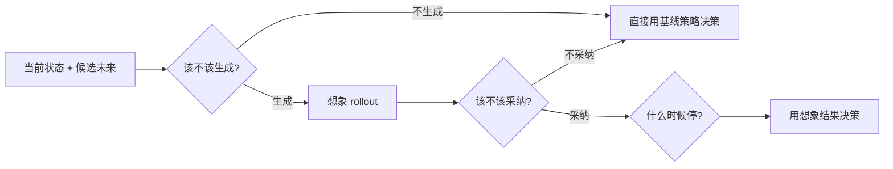

## 1.2 为什么这个问题值得做——两组独立诊断证据

**要点**:不是我们凭空猜"想象预算分配粗糙、经常帮不上忙"——这是两篇独立诊断性论文分别测出来的
硬数字,一篇测视觉推理场景,一篇测通用具身场景,方向完全一致。

**证据 A(AVIC 论文自己的诊断,§3)**:在 SAT-Real 数据集上人工把样本分四类(数字来自原文
Fig.2a):

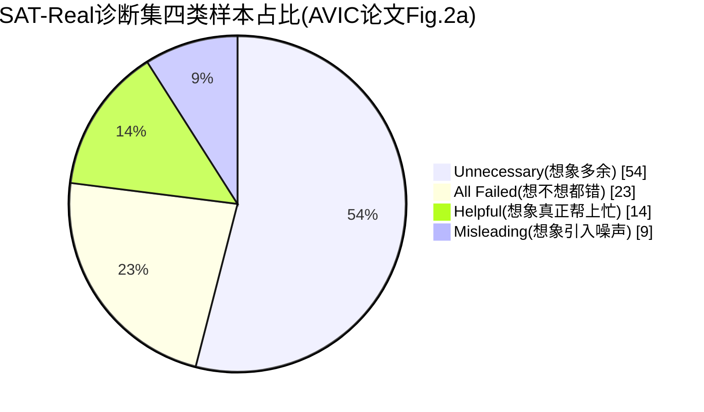

| 类别 | 占比 | 含义 |
|---|---|---|
| Unnecessary(Case 3) | **54%** | 不调用世界模型也能答对,想象是多余的 |
| Helpful(Case 1) | **14%** | 想象真正带来了正确答案 |
| Misleading(Case 2) | 9% | 想象引入噪声/幻觉,导致答错 |
| All Failed | 23% | 想象与否都答错 |

即只有 14% 的情况想象真正帮上忙,但现有 always-on(逢查必想)策略对 100% 样本无差别调用世界
模型。代价:always-on 想象比不想象只多拿到 **4.6% 的准确率提升,但要多花近两个数量级的 token、
约 30 倍推理时间**(原文§3)。"选择性想象上界"(先知式精确判断)能把准确率从 baseline 62.0% →
always-on 66.6% → 选择性上界 **75.3%**——这近 9 个点的差距就是"该不该想象判断准不准"能撬动的
空间。

**证据 B(Current Agents Fail to Leverage World Model as Tool for Foresight,arXiv:2601.03905,
2026.1,已 WebFetch 核验)**:更通用场景下的诊断,原文具体数字:agent 模拟触发率**低于 1%**,
误用预测结果约 **15%**,当模拟被强制使用时性能反而下降最多 **5%**。原文归因:瓶颈在于 agent
缺乏"何时该模拟、如何解读预测结果、如何把预测整合进下游推理"这三方面能力。

两组数字互相独立验证同一个结论:**现有 agent 系统性地不知道该怎么用世界模型想象**,这不是
某一篇论文的孤例。

## 1.3 现有"想象"是两套完全不同的范式

**要点**:Dreamer 系列的"想象"是训练时机制,不是测试时机制——部署时是一个纯 amortized policy,
不做任何决策时搜索。这和 MuZero/TD-MPC/我们要做的 controller 完全是两回事。

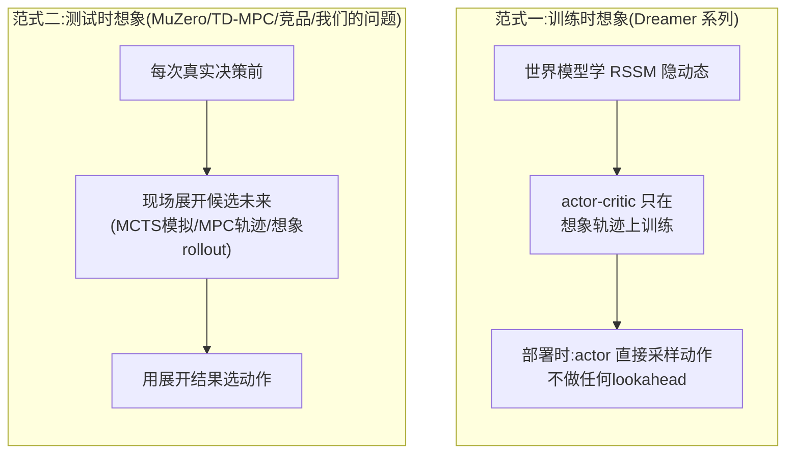

DreamerV3 原文(arXiv:2301.04104)Critic learning 一节明确写道:"we select actions by sampling
from the actor network **without lookahead planning**"。论文自己的 Atari100k 对照表(Table 9)
里有一行"Online planning"属性,横向对比 SimPLe/EfficientZero/SPR/IRIS/TWM/Dreamer 六个方法,
只有 EfficientZero(MuZero 系)标 X,Dreamer 明确标"--"——论文自己就把两个范式区分开了,不是
外部推断。

RSSM 公式(原文逐字):Sequence model $h_t=f_\phi(h_{t-1},z_{t-1},a_{t-1})$;Encoder
$z_t\sim q_\phi(z_t\mid h_t,x_t)$;Dynamics predictor $\hat z_t\sim p_\phi(\hat z_t\mid h_t)$。
想象展开固定长度 H=15(附录超参数表),跨 150+ 任务同一套超参数不变,零人工数据采到 Minecraft
钻石("out of the box with its default hyperparameters")。

---

# Part II. Benchmark 全景

**要点**:这次深挖的 11 个最近邻方法一共用了接近 15 个不同的 benchmark/环境,横跨视觉推理、
导航、机器人操作、Agent 工具使用、实时游戏、数学推理五大类。下表是全景速查,每个 benchmark
后面单独一段说清楚"是什么、测什么、数据什么样、现在最好成绩多少"。

## 2.1 Benchmark 速查表

```{=latex}
\begin{landscape}
```

| Benchmark | 所属方法 | 领域 | 任务类型 | 规模 | 主指标 | 当前最好成绩(表内) |
|---|---|---|---|---|---|---|
| SAT-Real | AVIC | 视觉空间推理QA | 单图/多图空间关系问答 | 诊断集(§3)+主评测集 | 准确率% | AVIC-R 完整版最高(见Part III) |
| R2R | AVIC | 视觉语言导航 | 序贯导航,逐步门控 | 标准R2R验证集 | Success Rate | 见Table 3(Part III) |
| MMSI-Bench | Astra | 多图空间推理 | 跨图空间关系问答 | 1,000条,6类关系 | EM准确率% | 闭源Gemini-3-Flash+Astra-WM: 49.5 |
| MindCube-tiny | Astra | 3D结构化空间推理 | 多视角空间推理 | tiny子集,3类子任务 | EM准确率% | 闭源Gemini-3-Flash+Astra-WM: 72.7 |
| RoboTwin(hard) | FFDC | 机器人操作仿真 | 双臂协作操作任务 | 困难任务子集,随机/干净两种场景 | 成功率% | FFDC: 76.40%(随机)/76.00%(干净) |
| 真实Astribot S1 | FFDC | 真实机器人操作 | 25自由度→**应为34自由度**双臂操作 | 真实机器人试验 | 成功率% | FFDC: 80% |
| VBench | Video-T1 | 视频生成质量 | 多维度生成质量评测 | 标准VBench评测集 | 综合分/维度分 | Pyramid-Flow(FLUX)+ToF: +5.86% |
| ALFWorld/WebShop/ScienceWorld/StableToolBench | ITP | 文本/网页Agent | 家务/购物/科学实验/API工具调用 | 各自标准测试集 | Success Rate | ITP自适应lookahead(见Part III) |
| PushT/PushT-Obstacle | ELASTIC | 机器人操作仿真 | 平面推物到目标位置 | 200个固定初始条件 | 成功率(散点图,无数值表) | 见Part III定性描述 |
| Square PH/MH, Can Paired/Reverse | ELASTIC | 机器人操作仿真(Robomimic) | 插销/抓取分拣 | 200个固定初始条件 | 成功率(散点图) | 见Part III定性描述 |
| LIBERO-10 | ELASTIC | VLA零样本迁移 | 10个长时程操作任务 | 每任务20 trial | 成功率%+延迟 | ELASTIC: 94.0%,BoN: 95.5% |
| 真实Franka+π0.5 | ELASTIC | 真实机器人操作 | 双色杯子分拣 | 20 trial | 成功率% | π0.5基线: 45%,ELASTIC用34%更低延迟追平BoN |
| ALFRED(AI2-THOR) | RARRL | 具身指令跟随 | 导航+检视+取送(自定义3类) | 50 episodes/类别 | TSR%/延迟/token | RARRL: 82.7/76.4/69.5(三类) |
| PacMan/Snake(Jumanji) | Finding-the-Time-to-Think | 实时游戏 | 反应式生存游戏 | 100 episode种子 | 累计得分 | Gate: 2370(PacMan)/16.54(Snake) |
| Real-time Tetris | Finding-the-Time-to-Think | 实时游戏 | 20×10消行 | 100 episode种子 | 累计得分 | Gate: 45.6,最优fixed: 27.6(+65%) |
| Speed Hex/Speed Go(pgx) | Finding-the-Time-to-Think | 实时棋类 | 限时对弈 | 5个共享时钟预算 | 平均期望得分 | Gate: 0.58(Hex)/0.59(Go) |
| GSM8K/MATH/AIME | ROI-Reasoning | 数学推理 | 多题共享预算的序贯解题 | 5000份合成试卷×2难度档 | Score(满分3)/Regret | RARL: Hard/512下0.93(超GPT-4o-mini 3倍) |
| AR/ImageNav/A-EQA/Manipulation(自建) | World-in-World | 具身闭环任务套件 | 主动识别/图像目标导航/主动问答/操作 | 4套件共上千episode | SR%/SPL%/Ans.Score | 见Part III |

```{=latex}
\end{landscape}
```

## 2.2 关键 benchmark 详解(逐个说清楚"在测什么")

**SAT-Real(AVIC)**:视觉空间推理 QA,给一张或多张图像+问题+候选答案,要求回答需要空间想象力
的问题(比如"如果相机往左转,会看到什么")。§3 的诊断实验是在这个数据集上人工标注四类样本
(见 1.2 节),主评测在 Table 1(AVIC-R vs 各种策略模型+baseline)。

**MMSI-Bench / MindCube(Astra)**:都是**已发表的外部 benchmark**(不是 Astra 自建),Astra 论文
在这两个上做迁移评测。MMSI-Bench 1,000 条跨图空间推理样本,6 类参照物关系(相机-物体/相机-
区域/相机-相机/物体-物体/物体-区域/区域-区域);MindCube-tiny 是结构化 3D 环境里的多视角推理
子集。**重要提示**:这两个 benchmark 上绝对分数最高的是闭源 Gemini-3-Flash(45.4/70.5 direct,
49.5/72.7 加 Astra-WM 强制想象后),Astra 的开源贡献是把 Qwen3-VL-8B 从 29.8/36.8 提升到
38.8/42.7,**不是绝对 SOTA**,是"开源同规模模型里最强的自适应想象方案"。

**RoboTwin + 真实 Astribot S1(FFDC)**:RoboTwin 是机器人操作仿真基准,困难任务子集覆盖多种
双臂协作操作;真实机器人是 Astribot S1(**34 自由度**,此前简报误写成 25,本次核实订正)。两个
场景(随机/干净)分别衡量在有干扰和无干扰条件下的鲁棒性。

**ALFWorld/WebShop/ScienceWorld/StableToolBench(ITP)**:四个文本/网页 Agent 标准 benchmark。
ALFWorld=家务任务文本环境,WebShop=模拟网购环境,ScienceWorld=科学实验交互环境,
StableToolBench=API 工具调用评测。ITP 在全部四个上都验证了"自适应想象深度"优于固定/随机预算。

**LIBERO-10 + 真实 Franka(ELASTIC)**:LIBERO-10 是 10 个长时程机器人操作任务集合,用来测 ELASTIC
在 SOTA VLA(π0.5)checkpoint 上的**零样本**表现(不重新训练,只加测试时算力调度);真实机器人
实验是自建的"两个颜色的杯子分拣"任务,π0.5 基线成功率 45%,主要失败模式是"紫杯离相机远时会
认错目标"和"放置时够不到篮子边缘"。

**ALFRED(RARRL)**:标准具身指令跟随 benchmark,基于 AI2-THOR 仿真器。**需要注意**:RARRL 论文
把结果按自定义的"Navigation/Inspection/Delivery"三类汇报,**不是 ALFRED 官方标准的 7 类任务
划分**,不能直接和 ALFRED 官方 leaderboard 对比,是作者在自己动作空间下的内部对照。

**PacMan/Tetris/Snake/Speed Hex/Speed Go(Finding-the-Time-to-Think)**:五个"实时"游戏环境,
"实时"具体体现为:环境按固定帧率持续推进,不管 agent 有没有想清楚;想得越久,commit 步数越多,
世界变化越多。Tetris 是自建的 real-time 变体(标准 Tetris 加了"重力持续下落、不等你想"的约束)。
Speed Hex/Go 是"限时快棋",MCTS 每做一次模拟就消耗一格时钟。

**GSM8K/MATH/AIME(ROI-Reasoning)**:三个难度递增的数学推理数据集(小学应用题→高中竞赛→
奥数),ROI-Reasoning 把三题拼成一份"试卷",在严格全局 token 预算下要求依次解答,测的是"预算
该怎么在多道题之间分配"这个元认知能力,不是单题推理能力本身。

**World-in-World 四套件**:不是套用外部 benchmark,是**自己新构造**的 4 个闭环任务(基于已有
仿真器 Habitat-Sim/CoppeliaSim 和已有场景数据集 Matterport3D/HM3D 等),因为论文的论点是"现有
benchmark 都是 open-loop 的,没有一个测 world model 是否真的能在闭环任务里帮上忙",所以必须
自建。四套件:Active Recognition(主动识别被遮挡物体)、ImageNav(图像目标导航)、
A-EQA(主动具身问答)、Manipulation(RLBench 4 任务)。

**关于"现有 SOTA"这件事需要向导师说明的共性问题**:ELASTIC 和 RARRL 两篇论文都**没有引用外部
文献的 SOTA 数字做对比**,只做了论文自己实现的几个 baseline 之间的内部对照(固定预算/随机预算/
启发式预算 vs 自己的自适应方法)。这是这两篇论文一个客观的局限,如果我们的工作要正面回应"和
SOTA 比怎么样"这个问题,需要比它们做得更完整。

---

# Part III. 十一个最近邻方法逐一深度解析

> 每个方法固定五段式:问题定义 → 架构(图+公式) → Benchmark 与结果 → 消融 → 局限性。
> 全部基于逐字通读完整 PDF(含附录)后整理,不是转述摘要。

## 3.1 AVIC —— 最接近的整体框架,但比较机制是"自洽性"不是"决策价值"

**论文**:Yu et al., *When and How Much to Imagine*, arXiv:2602.08236,2026,UNC Chapel Hill+NTU。

**问题定义**:视觉空间推理 QA 场景下,该不该调用世界模型生成想象视角、调用多少次。

**架构**:

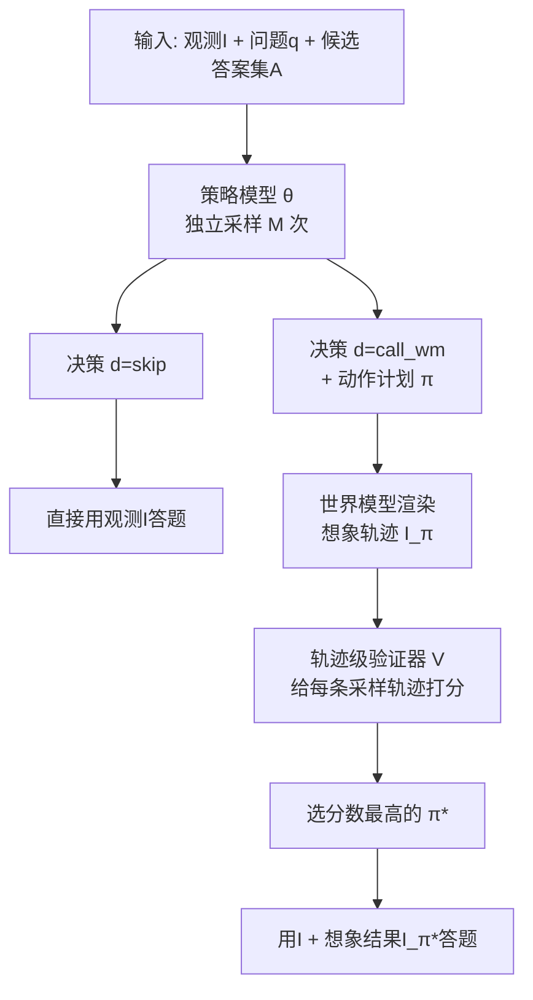

**关键公式**:门控+规划一体化(Eq.1) $(d,\pi)\sim\theta(d,\pi\mid I,q,A)$,$d\in\{\text{skip},
\text{call\_wm}\}$;轨迹级验证(Eq.2) $s^{(m)}=V(I,q,I_\pi^{(m)})$,$\pi^*=\arg\max s^{(m)}$——
**这 M 条候选轨迹全部来自同一策略对同一问题的独立重复采样(self-consistency)**,验证器选的是
"这次采样质量最高的一次尝试",不是几个语义不同、后果不同的候选未来之间的决策价值比较;训练目标
AVIC-R(Eq.4,GRPO) $r=\mathbb{1}_{\text{correct}}-c|\pi|-\beta_s\mathbb{1}_{\text{wrong-skip}}
-\beta_p\mathbb{1}_{\text{parse-fail}}$,$c{=}0.1,\beta_s{=}\beta_p{=}0.5$。

**结果**:AVIC-R(Qwen2.5VL-7B)平均每题只想象 **3.60 次**(vs always-on 基线 8.90 次),准确率
超过 GPT-4o 策略版本(+8.0pp,77.3% vs 69.3%),略超 GPT-4.1(+0.7pp,80.0% vs 79.3%,原文未
单独强调此项)。分类别:action-conditioned 类 +57.1%,dynamics-understanding 类只有 +28.5%。
Table 6 消融:去掉 wrong-skip 惩罚,策略崩溃成全部 skip,准确率 77.33%→62.67%(掉 14.66pp)。
Table 4:只做二元门控、不做动作长度自适应,反而比 always-on 更差(73.3% vs 77.3%)——**gating
和"想多少"必须联合优化**。R2R 导航实验(Table 3)证明能应用到序贯场景,但每步 gate 决策彼此
独立,没有跨步骤预算调度。

**局限性**(读完全文的判断):验证器比较的是自洽采样不是真正的候选未来比较;reward 是 QA 正确性
代理不是显式 VOC 目标函数;没有跨步预算调度。

---

## 3.2 FFDC —— 最接近"何时停/何时该重新想",但只监控单条轨迹

**论文**:Wang et al., *When to Trust Imagination*, arXiv:2605.06222,2026,南方科技大学+港大+
Astribot。

**问题定义**:World Action Model(WAM,骨干 Motus)联合预测未来动作块和未来视觉 token 后,
"已经预测的未来还能不能信"要多久检查一次、什么时候该重新规划。

**架构**:

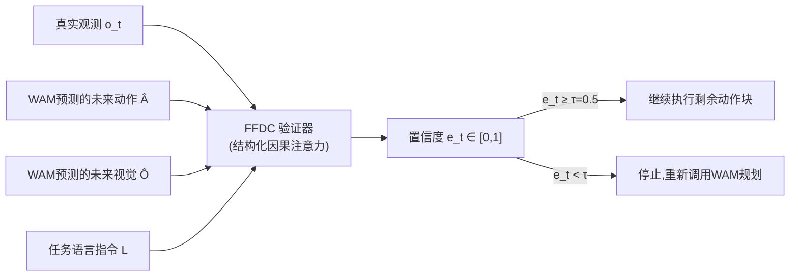

**关键机制**:验证器只需编码最新一帧真实观测,其余(预测动作/视觉/语言)全走 KV cache,不需要
重跑整个 WAM 就能算出置信度(§3.2 "the verifier only encodes the latest real observation O_t
and performs lightweight attention against these cached tokens... without rerunning the full
WAM")。训练是纯二分类:正样本=真实成功轨迹片段,负样本=失败轨迹+人工构造的"腐化"片段(时间
交换/夹爪翻转/后段加噪/尾部缩放)。

**结果**:RoboTwin 困难任务成功率 54.20%→**76.40%**(随机场景)、57.80%→**76.00%**(干净场景);
平均减少 WAM 前向调用 **69.10%**,执行时间快 **34.02%**。真实机器人(Astribot S1,**34自由度**)
成功率 45%→**80%**,但真实世界下平均调用次数和耗时反而略高于短 chunk 基线(28.1秒/16次 vs
25.6秒/14次)——本身就是"该不该多算要按情况自适应"的直接证据。Table 3 消融:去掉预测的视觉
token 输入,准确率掉得最多(76.4%→71.6%)——**想象出来的未来画面本身就是最有信息量的信号**。

**局限性**:只监控"已经生成的那一条想象轨迹",不涉及生成多个候选未来、互相比较、挑一个采纳。

---

## 3.3 Video-T1 —— 想象内部的搜索结构最像,但优化目标是生成质量不是决策价值

**论文**:Liu et al., *Video-T1*, arXiv:2503.18942,2025,清华+腾讯。

**架构**:

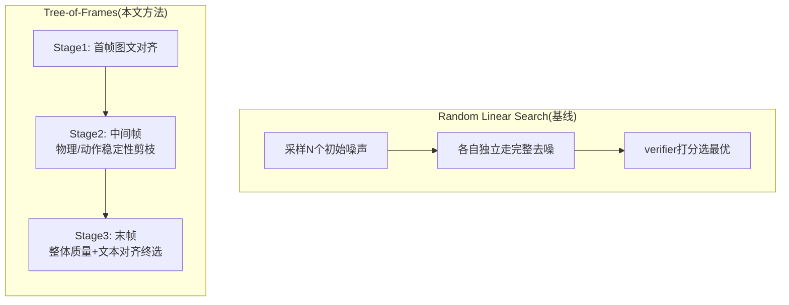

**结果**:PyramidFlow(FLUX)上 Linear Search 需 5.22×10⁷ GFLOPs,ToF 只要 1.62×10⁷(约省3.2倍,
实践简化情形下复杂度可到 O(N+T),worst-case 仍是 O(TN));NOVA 上约省2.9倍。VBench 提升:多数
模型 +3.4%~+5.9%(相对提升百分比);OpenSora v1.2 提升幅度最小(+2.37%,与 Table 2/Figure 6/
正文结论一致——此前简报误引 Figure 2 图注符号笔误的"-2.37"作负收益例子,已订正)。

**局限性(三篇里差距最本质的一篇)**:verifier 打分依据是生成质量(运动流畅度/语义对齐/美学
质量),整个流程完全没有下游决策任务的存在,优化的是生成质量,不是决策价值。

---

## 3.4 DreamerV3 —— 训练时想象范式的代表,不是测试时 controller 的直接竞品

**论文**:Hafner et al., arXiv:2301.04104,2023(Nature 2025)。列在这里是为了确立范式区分
(见 Part I §1.3),不是方法竞争对手——它的"想象"发生在训练阶段产生 λ-return,部署时不做
lookahead。用作后续所有"测试时想象"方法的历史参照系。

---

## 3.5 Astra —— 视觉推理场景下和 AVIC 最像的 2026 年新竞品,资源背景更强

**论文**:Zhu, Lin et al., *Thinking with Imagination*, arXiv:2606.06476,2026.6,港大+上海AI
Lab+SJTU+复旦+北航。

**问题定义**:VLM 面对多视角空间推理任务时无法推断未观测布局——让 VLM 在推理中主动向一个
world simulator 发相机运动查询,获得"想象出来的"新视角观测并整合进推理。

**架构**(Astra-VL 策略 + Astra-WM 世界模拟器,两阶段RL课程):

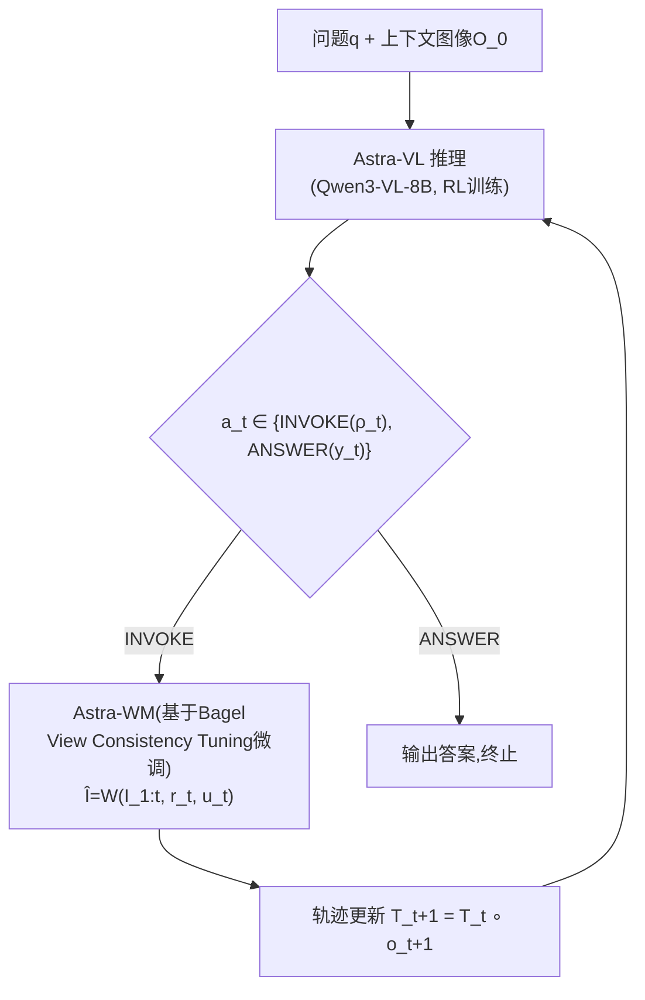

**关键公式**:两阶段 RL 奖励。Phase 1(探索+工具获取):$r^{(1)}=r^{em}+\lambda_{fmt}r^{fmt}+
\lambda_{use}\min(n^{tool},c)$,防止策略在学会调用前就坍缩成"直接短答案"。Phase 2(选择性
想象):引入无工具基线估计增益 $\Delta_i=e_i-e_g^{direct}$,$r^{(2)}=r^{em}+\lambda_{fmt}r^{fmt}
+\lambda_{use}\min(n^{tool},c)+\alpha\max(0,\Delta_i)-\beta\max(0,-\Delta_i)$——只在模拟器交互
真的比直接回答更好时才奖励。

**结果**:MMSI-Bench All 从 backbone 的 29.8 提升到 **38.8**(+9.0pp);MindCube-tiny 从 36.8
提升到 **42.7**(+5.9pp)。**重要澄清**:绝对分数最高的仍是闭源 Gemini-3-Flash(45.4/70.5
direct,49.5/72.7 加想象),Astra 的贡献是"开源同规模最强",不是绝对 SOTA。两阶段课程消融
(Table 3):单阶段只给工具增益奖励会让调用率坍缩到 4.9%;只给使用量奖励会让调用率飙到 98.1%
(几乎无差别想象);完整两阶段课程平衡到 61.5% 调用率、拿到最高分 38.8。

**局限性**(原文 Limitations 四点):无恰当探索机制会坍缩到直接回答或过度使用模拟器;模拟器可能
生成"视觉上说得通但没用"的视角;策略可能混淆原始图像和生成图像索引;奖励是稀疏的精确匹配差值,
捕捉不到"部分有用"的观测。原文收尾判断:"tool use is neither a free reward nor a failure mode:
it is an action whose value depends on the unresolved spatial uncertainty."

---

## 3.6 Imagine-then-Plan(ITP) —— 和 idea 7"该不该想、想多深"重合度最高的框架级实现

**论文**:*Imagine-then-Plan: Agent Learning from Adaptive Lookahead with World Models*,
arXiv:2601.08955,2026.3,港理工+中南大学。

**问题定义**:LLM/VLM agent 每步该不该想象、想多深(K_t)。

**架构**:

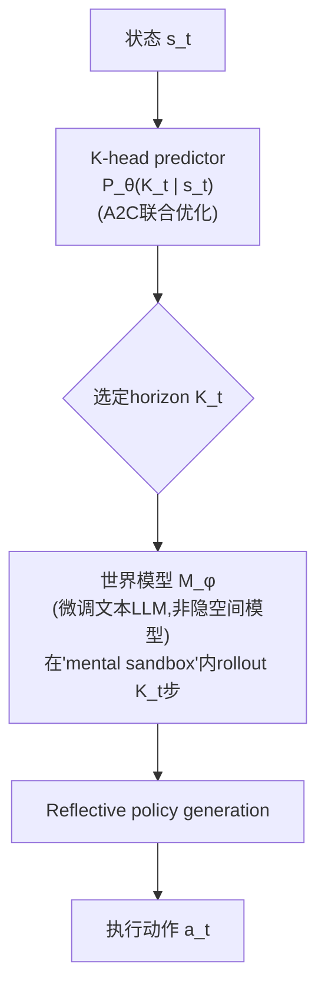

**关键公式**(全部逐字核对 HTML 全文属实):POIMDP 形式化——"we move beyond POMDP toward a
Partially Observable and Imaginable MDP (POIMDP)";策略 $a_t\sim\pi_\theta(\cdot\mid s_t,
\hat\tau_t(K_t))$;伪标签选择准则 $\tilde K_t=\arg\max_{0\le k\le K_{max}}[\log p_{\theta_0}
(a_t^*\mid s_t,\hat\tau_t(k))-\lambda_K\cdot k]$;在线奖励 $r_{t+1}=r_{env}-\lambda_K K_t-
\lambda_{step}$;世界模型 $p_\phi(X\mid x_1,C(A))$(token级自回归文本生成,不是隐空间动力学)。

**结果**:ALFWorld/WebShop/ScienceWorld/StableToolBench 四个 benchmark 全部验证——"fixed-k
lookahead is brittle: success rate peaks at a moderate k then declines, cost rises sharply"、
"adaptive lookahead achieves higher success rates with substantially lower budget"、
"consistently outperforms random strategy"。

**局限性(需要向导师明确的三条差异化空间)**:世界模型是微调文本 LLM,不是隐空间动力学模型;
horizon 一次性预先选定,**没有中途止损机制**(三阶段流程里没有提前终止的设计);**没有跨
episode 步骤的预算结转**——这三点是仍然开放的具体空间。

---

## 3.7 ELASTIC —— 扩散/流式控制策略的测试时算力调度,不涉及想象但同属"自适应算力"家族

**论文**:Li, Swamy, Bisk, Bajcsy, *ELASTIC*, arXiv:2606.31132,2026.6,CMU。

**问题定义**:生成式控制策略(diffusion/flow policy)在测试时可沿两条正交轴扩展算力——
**序列轴**(增加去噪步数精细化单个动作)和**并行轴**(并行采样多个候选、用 verifier 选优)。
该往哪个轴砸算力是状态依赖的,原文举反例:"mug pick-and-place 任务里,若 base policy 不确定
该拿哪个杯子,这本质是 mode selection 问题,序列扩展基本没用,更需要并行采样"。

**架构**(Meta-MDP + SAC,Algorithm 1 完整伪代码):

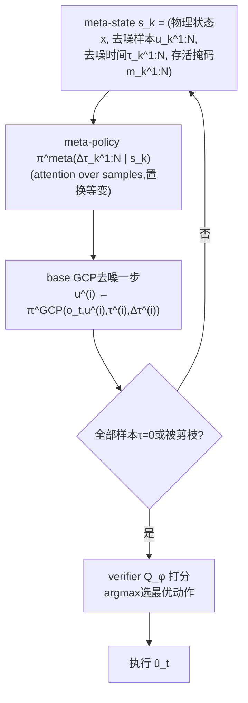

**关键公式**(核心奖励,原文 Eq.1):$r(\xi)=Q^{task}(x,u)-\alpha L(\xi)-\beta(P(\xi)-1)$,其中
序列开销 $L(\xi)=\max_i \ell^{(i)}$(最慢完成样本长度),并行开销 $P(\xi)=\sum_i\ell^{(i)}/L(\xi)
\ge 1$(时间平均活跃样本数)。动作 $\Delta\tau^{(i)}=0$ 定义为永久剪枝该样本,使序列轴与并行轴
能在同一状态相关框架下联合优化。

**结果**:LIBERO-10(SOTA VLA π0.5 checkpoint 零样本迁移)——ELASTIC 94.0% 成功率/64.5ms 延迟,
π0.5基线 91.5%/68.7ms,BoN 95.5%/94.0ms;"ELASTIC recovers performance gains equal to
Sequential with 6.1% less inference latency"。真实机器人:**"ELASTIC can match the
improvements of full BoN scaling with V-GPS while using 34% less inference latency"**。
6 个模拟任务(PushT/Square/Can 系列)只有散点图定性趋势,**没有配套数值表**——这是本文一个
客观的呈现局限。

**局限性**(原文照录):"the primary limiting factor for the effectiveness of our approach is
the learned verifier $Q_\phi$. A noisy verifier masks useful signal...hurting meta-policy
optimization"；且"meta-policy is currently trained per task, which can be costly for
multi-task policies like VLAs"。**没有传统意义的系统性消融表**(不像下面 RARRL)。

---

## 3.8 RARRL —— LLM 高层推理调用的开关+角色+预算三元决策,消融最系统的一篇

**论文**:*When Should a Robot Think?*, arXiv:2603.16673,2026,CMU+东北大学+哈佛等多机构。

**问题定义**:具身系统调用 LLM 高层推理会带来巨大延迟,"该不该想、该用哪种推理角色、该分配
多少预算"三个决策合一,在决策层(不是底层控制层)学习一个编排(orchestration)策略。

**架构**(Figure 1/2):

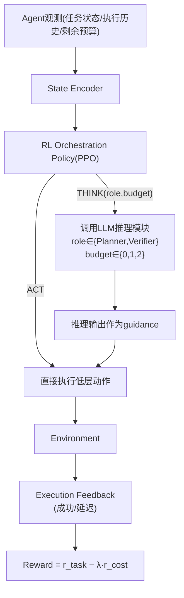

**关键公式**:失败概率随推理增益调制 $P_{fail}^{think}(s,a)=(1-\alpha(s))P_{fail}^{exec}(s,a)$,
$\alpha(s)=\eta u(s)$($\eta$固定环境参数,不可学习,只观测不确定性信号 $u(s)$)。PPO 目标
(Eq.1):$\mathcal{L}_{PPO}(\theta)=\mathbb{E}_t[\min(\rho_t\hat A_t,\text{clip}(\rho_t,1-
\epsilon,1+\epsilon)\hat A_t)]$。预算等级到 LLM 调用的确定性映射:c=0 不调用;c=1 只调 planner
(max_tokens=256);c=2 planner+verifier 依次调用(各 max_tokens=512)。

**结果**(ALFRED+AI2-THOR 真实 LLM 推理,统计显著性检验):RARRL vs Full Reasoning——Navigation
TSR 82.7 vs 84.0(略低)但 LLM 推理时间从 31.5s 降到 **12.3s**(降 61%)、token 从 4100 降到
980;三个任务类别（Navigation/Inspection/Delivery）均类似模式,对应摘要"reduces LLM inference
time by more than 60% while maintaining comparable task success"。抽象任务主结果(Table II)
RARRL 全面超过 Fixed/Heuristic/No/Full Reasoning 各项指标。Budget Shock 鲁棒性(Table III):
资源突降后,Heuristic 基线推理调用次数不降反升(14.2→15.1,不会自适应),RARRL 主动降低
(11.3→7.6),成功率保持更高(74.9 vs 61.8)。

**消融**(Table IV,五项,消融最系统的一篇):去掉预算状态 $b_t$——TSR降6.7pp、推理频率升(缺资源
感知会过度调用);去掉执行历史 $h_t$——降幅最大;Planner-only(83.1)优于 Verifier-only(79.4),
但都不如两者结合(87.6);固定预算(禁用自适应)——成本升、成功率降。

**局限性**(原文照录多条):训练环境是"抽象/程序化的",不是物理仿真器或真实机器人,ALFRED 评测
是训练后的**迁移测试**;主动排除了传感器噪声与执行延迟("we isolate orchestration from sensor
noise and actuation delays...extending the formulation requires incorporating such
uncertainties");软预算约束非硬约束,硬约束("via constrained MDPs or Lagrangian methods")留
未来工作;推理有效性系数 $\eta$ 是固定环境参数不可学习。

---

## 3.9 Finding the Time to Think —— idea 7 最近邻,但用完美模拟器+MCTS,非生成式world model

**论文**:Muppidi, Darwish et al., arXiv:2606.26463,2026.6,牛津(Foerster组)。

**问题定义**:实时 RL 中"思考本身要占用环境推进时间"——世界不会等 agent 想清楚,"该想多久"
是状态依赖的元推理问题。

**架构**(Budgeted Options + Meta-level SMDP):

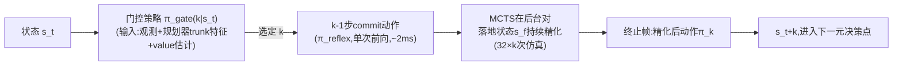

**关键公式**:元 Bellman 方程(Eq.4) $V(s_t)=\mathbb{E}_{k\sim\pi_{gate}}\big[\sum_{j=0}^{k-1}
\gamma^j r_{t+j}+\gamma^k V(s_{t+k})\big]$。GAE 的 holding-time 修正(Eq.7-9,防止长 budget
元步被系统性低估):$\delta_t=R_t+\gamma^{k_t}V(s_{t+k_t})-V(s_t)$,$\hat A_t=\delta_t+
\gamma^{k_t}\lambda\hat A_{t+1}$。

**结果**(5个环境,gate vs 最优 fixed baseline):Pac-Man 2370 vs 2149(+10.3%);Real-time
Tetris 45.6 vs 27.6(**+65%**);Snake 16.54 vs 14.91(+10.9%);Speed Hex 0.58 vs 最优
fixed(k=128)0.43;Speed Go 0.59 vs 最优fixed(k=64)0.51。原文:"random baseline falls well
below every fixed-k policy...confirming that *when* to allocate compute matters as much as
*how much*"。策略画像(Appendix G,可解释性亮点):Real-time Tetris 上 k=3 从未被使用(0%),
形成"要么反应要么深规划"的双峰策略;Snake 上"刚吃到果实、身体刚变长"这一事件让 k=3 使用率从
3.2%跳升到13.5%。

**局限性**(原文三点):协议依赖 MCTS 对**完美模拟器**的忠实模拟,扩展到 MuZero 式学到的动力学
模型是"natural future work";门控策略在**冻结**的 base planner 之上训练,联合优化仍是开放
问题;手工标定的离散 budget 集合。**没有任何形式化的收敛性/regret 理论保证**。

---

## 3.10 ROI-Reasoning —— idea 7"跨步预算调度"机制上最接近的匹配,但用于LLM批量数学推理

**论文**:Zhao, Qi, Sun, arXiv:2601.03822,2026.1,中国人民大学。

**问题定义**:多题共享一个严格全局 token 预算,该怎么在题目之间分配算力——形式化为**Ordered
Stochastic Multiple-Choice Knapsack Problem(OS-MCKP)**:按固定顺序、在代价/收益都不确定的
情况下做不可逆决策。

**架构**(两阶段:MFT监督微调 + RARL强化学习):

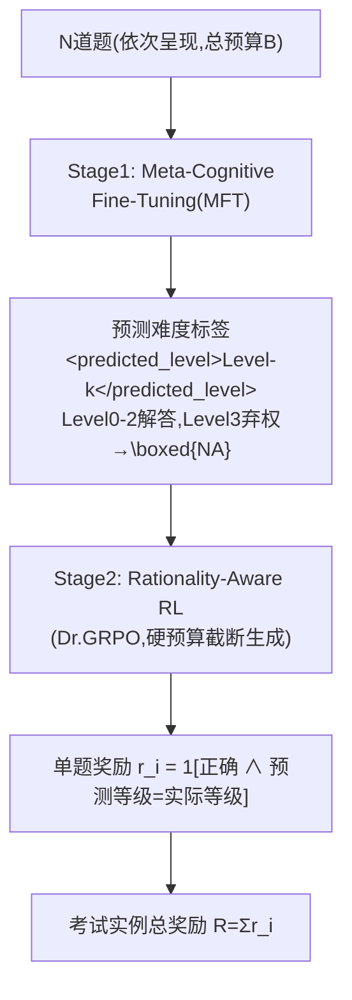

**关键公式**:目标函数(Eq.1) $\max_\pi\mathbb{E}[\sum_i r(\cdot)]\ \text{s.t.}\ \sum_i
c(\cdot)\le B$。Dr.GRPO 目标(Eq.4-5,无 std 归一化的去偏版):$\hat A_{i,t}=R_i-\text{mean}
(\{R_1,...,R_G\})$。regret 指标(经验评测量,非理论保证):$\widetilde{\text{Regret}}=
(\text{Score}_{easy}-\text{Score})/\text{Score}_{easy}$。

**结果**(1.5B 模型 vs 百倍参数量大模型):最亮眼的数字——**Hard/512(最难+最紧预算)设定下,
MFT+RARL 得分 0.93,远超 GPT-4o-mini 的 0.32 和 DeepSeek-V3.2(685B)的 0.49**。Regret 指标上
MFT+RARL 全面最优(Medium/Hard 1024档均为0.02,全表最低)。per-problem 分解(Table 2)显示
baseline 方法在第三题(P3)准确率明显低于第一题(P1),RARL 在 P2/P3 上提升幅度最大——学到的
是"为后面题目预留预算"的长程分配策略。Plan-and-Solve/Least-to-Most 这类**纯提示词**层面的
显式规划,效果甚至差于 base model——说明必须靠训练干预,不能只靠 prompt。

**局限性**:聚焦固定 3 题的数学推理,用 token 数代理成本(不能完全捕捉延迟/工具调用/验证成本);
难度监督依赖粗粒度离散等级;**没有把经典 knapsack 理论的近似比结果迁移/证明到 RL 求解方案上**,
regret 是经验近似指标不是理论保证。

---

## 3.11 World-in-World —— idea 1"多候选比较"表层机制目前最强,ICLR接收状态未证实

**论文**:Zhang, Jiang et al., arXiv:2510.18135,2025.10,JHU+PKU+Princeton+MIT等。

**问题定义**:现有 world model 评测都是 open-loop 的(只看生成质量),没有 benchmark 测"生成的
世界是否真的能帮 agent 做出更好的闭环决策"。

**架构**(policy-guided beam search,proposal→simulation→revision):

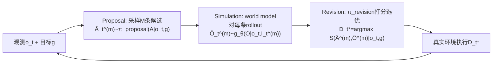

**关键公式**(Eq.1-4):Proposal $\hat A_t^{(m)}\sim\pi_{proposal}(A\mid o_t,g)$;Simulation
$\hat O_t^{(m)}\sim g_\theta(O\mid o_t,I_t^{(m)})$;Revision 一般形式 $D_t^*=\pi_{revision}
(\{(\hat A_t^{(m)},\hat O_t^{(m)})\},o_t,g)$;打分-选择具体实现 $m^*=\arg\max_m S(\hat A_t^{(m)},
\hat O_t^{(m)}\mid o_t,g)$。**比经典 MPC 更通用**——MPC 优化对象被限制为动作序列,这里
$\pi_{revision}$ 可以合成/更新一个新决策。

**结果**(4个自建闭环任务套件,不是套用外部benchmark):Active Recognition 上闭源 Runway Gen4
(zero-shot)SR=64.79%(步数最少4.06),开源最好是post-trained Wan2.2†(A14B) SR=62.43%;
ImageNav 上开源最好 Wan2.1† SR=45.14%/SPL=32.10,Wan2.2†(A14B) SPL全表最高34.61;操作任务上
最好后训练模型SVD† SR=46.5%,仅略高于VLM基线44.5%(原文承认"精细物理动力学和动作条件化的物体
运动仍是开放挑战")。**Scaling law 发现**(摘要重点,Figure 6):后训练数据从400条扩到80K条,
AR成功率单调上升;更大模型(14B)比小模型(1.5B)从数据增加中获益更多、更晚饱和——"scaling
action-conditioned post-training is more effective for embodied utility than upgrading the
pretrained generator"。推理时算力scaling(Figure 7):每episode推理次数从3提到11,SVD† SR从
53.36%升到60.98%。

**消融**:"精细可控性比画面好看更重要"(Figure 5)——生成质量和SR之间没有干净正相关,可控性
(1-LPIPS)和SR才有明确正相关。

**局限性**(Section 4正文四点):世界模型泛化能力是关键瓶颈(可能退回训练先验、忽略动作控制);
长视野规划仍然困难(缺乏积累时空历史的机制);精确建模接触丰富交互(操作任务)仍然困难;
proposal/revision策略本身的强弱决定性能上限。

**ICLR 接收状态——本次专项核实结果**:逐页通读完整 43 页 PDF(正文+参考文献+全部6个附录),
**没有找到任何会议接收信息**——标题页只有普通 arXiv 日期戳,没有"Published/Under review as a
conference paper at ICLR"横幅,全文没有 Acknowledgments 段落,附录逐一确认也无接收状态说明。
**结论:以这份 v1 PDF 为准,无法确认 ICLR 2026 接收/Oral 状态,读起来是标准 arXiv 预印本,如需
在更正式场合引用接收状态,需要另外查 OpenReview 或项目主页确认**。

## 3.12 十一个方法一张总表

```{=latex}
\begin{landscape}
```

| 方法 | 决策粒度 | 训练方式 | 理论保证 | 核心benchmark | 我们的差异化空间 |
|---|---|---|---|---|---|
| AVIC | 单次二元gate+自洽采样 | RL(GRPO) | 无 | SAT-Real/R2R | 真正决策价值比较+跨步预算 |
| FFDC | 单条轨迹信/不信 | 监督二分类 | 无 | RoboTwin+真实机器人 | 多候选比较 |
| Video-T1 | 树搜索剪枝(生成质量) | verifier打分 | 无 | VBench | 决策价值而非生成质量 |
| Astra | 单次二元gate+自洽采样 | RL(两阶段GRPO) | 无 | MMSI-Bench/MindCube | 同AVIC |
| ITP | 每步选想象深度K | RL(A2C) | 无 | ALFWorld等4个 | 中途止损+跨episode结转 |
| ELASTIC | 去噪步数+并行采样 | RL(SAC) | 无 | LIBERO-10+真实机器人 | 非world model,间接参照 |
| RARRL | 开关+角色+预算三元 | RL(PPO) | 无 | ALFRED | 非world model,间接参照 |
| Finding-Time-to-Think | 每元决策点选k | RL(PPO) | 无(仅问题形式化严谨) | 5个实时游戏 | 生成式world model+联合优化 |
| ROI-Reasoning | 每题解答深度/弃权 | 监督+RL(Dr.GRPO) | 无(regret是经验指标) | GSM8K/MATH/AIME | 具身序贯决策场景 |
| World-in-World | 多候选提案比较 | 无(启发式/预训练策略) | 无 | 4个自建套件 | VOC式反事实差值打分 |
| **我们要做的** | **三个决策点统一** | **理论驱动+训练估计** | **VOC/最优停止(目标)** | **合成pilot+真实world model** | — |

```{=latex}
\end{landscape}
```

上表最右列"理论保证"一栏,**11 篇里没有一篇打勾**——这正是 Part V 要展开的核心论点。

---

# Part IV. 我们自己的三轮 Pilot 研究

**要点**:在提出任何新方法前,先在一个真实转移函数已知、可以精确算出"标准答案"的合成环境里,
系统测量"想象到底什么时候真的有用"。三轮 pilot 分别测了三个递进的问题,每轮都预注册了预测,
诚实报告confirmed/disconfirmed。

## 4.1 实验设计(贯穿三轮不变的骨架)

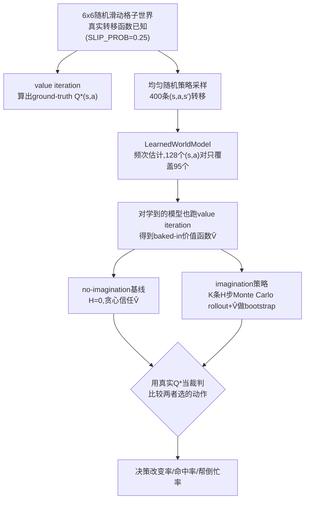

## 4.2 第一轮(表格模型):发现一/二

扫想象深度 H(K=5固定):命中率 44.0%(H=1)→27.2%(H=8),决策改变率10.0%→23.1%单调上升。
扫候选数K(H=3固定):决策改变率35.6%(K=1)→10.0%(K=10)单调下降。

**数学推导(严格证明)**:两个策略共享**同一个**不完美 LearnedWorldModel,imagination 的 rollout
续跑策略用贪心 V̂、bootstrap 也用 V̂——想象 rollout 的期望值会沿 Bellman 不动点方程精确 telescope
回 V̂ 自己的一步展开值,**和 H 无关**。可以用鞅的全方差公式进一步加强:定义 $Y_t=\mathbb{E}
[G_H\mid\mathcal{F}_t]$ 为条件期望过程,这是一个鞅($Y_0=\hat Q(s,a)$,$Y_H=G_H$的实现值),
由全方差公式 $\mathrm{Var}(Y_H)=\sum_{t=1}^H\mathbb{E}[\mathrm{Var}(Y_t\mid Y_{t-1})]$ 严格
非负、非递减——这解释了"H越深、决策改变率越高"这个观测模式是必然的方差累积,不是巧合。

用 visit_count 当不确定性代理分组,方向和预期相反(高置信度组帮倒忙率0.149 > 低置信度组0.058)
——推测是 value iteration 的 Bellman 误差跨状态传播导致局部访问次数不能直接反映 V̂ 准不准,
呼应文献库 Biased Dreams(arXiv:2604.25416)对不确定性代理需要独立验证的警告。

## 4.3 第二轮(神经网络集成模型):定性复现,量级不同

换成5个numpy手写MLP的集成模型,回答"发现一是否表格模型特有的巧合"。决策改变率恒定在65%~81%
高位(神经网络预测天然更"软",注入更多采样方差),不是表格pilot的10%~36%量级;"H越深命中率越低"
这个具体单调模式**没有复现**,命中率的H依赖性证据比表格pilot弱。**member模式**(想象采样时随机
抽一个集成成员,让想象看到基线看不到的集成分歧)**没有带来预期改善**——是条负结果,把"多掌握
信息必须是决策相关的"这条教训精确化:随便什么新的随机性来源(哪怕理论上是货真价实的epistemic
uncertainty)都不够,信息必须真的关于决策本身。集成分歧当不确定性代理,方向上比visit_count更
符合直觉(低置信度组帮倒忙率0.480 > 高置信度组0.388),但样本量撑不住强结论。

## 4.4 第三轮(task-conditioning):三轮里第一次出现的正向发现

给想象一个真正决策相关的信息优势(知道这一局真实任务目标,baseline不知道)。三个候选目标上
命中率全部反超(汇总 **82.0% vs 63.7%,+18.3pp,零例外**)。过程插曲:第一版代码有bug(baseline
和想象共享同一个Vhat参数,悄悄测的是同源结构),数字和心智模型矛盾后定位修复,如实记录在
RESULTS-task-conditioning.md。

**意外发现**:unconditioned想象(对照组)命中率也比前两轮同源实验高很多(56.8%~72.5% vs 前两轮
30%~50%)——推导原因是"即时奖励设计上总用真实目标计算、只有bootstrap过时"这个选择本身,让更深
的rollout在跌回过时bootstrap前先吃到更多真实目标奖励信号,渗透程度随H增加。**这是全篇最重要的
一条经验发现**:给想象多少真实任务信息不是开关式的二元判断,是连续的程度问题,哪怕只开放"奖励
可观测"这一个通道、不动bootstrap,想象也能捡到部分真实信号。

## 4.5 三轮pilot合起来的完整证据链(经二次深挖后重新定位,见Part V)

①同源想象=噪声(有数学推导)②无关随机性救不回来③真正决策相关信息能稳定翻正、渗透程度连续
可调。**重要:①②不是新发现**(见Part V §5.1),是1991年VOC理论的推论;③经穷尽检索确认
无先例,是三条里唯一站得住"新发现"这个说法的。

---

# Part V. Gap 分析:最大的空当在哪里

## 5.1 一个必须先讲清楚的自我纠正

我们pilot的发现一(同源想象=噪声)和发现二(无关随机性救不回来),核心原理正是 Russell &
Wefald(1991)Value of Computation 停止法则的直接推论——"当所有可用计算的 VOC 都不为正,立即
执行当前belief下的最优action",数学上就是"计算不能改变决策则其期望价值恒为零"。这条已经被
Hay, Russell, Tolpin, Shimony 的 *Selecting Computations*(arXiv:1207.5879,**UAI 2012,已经
在我们自己的文献库里**)形式化到 Bayesian selection 问题层级。这次二次深挖新查到的
Grimm et al. *The Value Equivalence Principle*(arXiv:2011.03506,NeurIPS 2020)、
Efroni et al. *Beyond the One-Step Greedy Approach*(arXiv:1802.03654,ICML 2018)从另外
两个独立方向给出相同结论:模型只要 value-equivalent 就足以支撑规划,多步贪婪不天然具有
单调改进保证。**这意味着如果 idea 10 论文把核心贡献叙事锚定在发现一/二本身,审稿人只要熟悉
这条文献脉络(我们自己书架上就摆着最直接的先例),几乎肯定会指出这是 reinvent the wheel**。

**这不是说发现一/二没有价值**:我们做的是第一次在"测试时想象+现代世界模型"这个具体场景里,
把一个30年前的抽象原理用严格数学(鞅的全方差分解)钉实、做出可复现的受控实验——这是合法的
**理论基线与阴性对照**贡献,不是新发现。核心贡献叙事必须搬到发现三上。

## 5.2 竞争格局:半年内从近乎空白变拥挤

Part III 的 11 个方法里,**8 篇是 2026 年 1-7 月这半年内出现的**(Astra/ITP/ELASTIC/RARRL/
Finding-the-Time-to-Think/ROI-Reasoning/AVIC/FFDC)。这些论文两两技术细节不同,但共同构成一个
"自适应测试时算力分配"的密集聚类。头部大厂(DeepMind/Meta FAIR/OpenAI/Berkeley RAIL/Stanford)
暂无直接证据参与这个具体子问题,风险低;但中等资源学术组的聚集密度远超预期。7月最新论文已经
开始转向失败诊断/综述(如Current-Agents-Fail),暗示第一波"想象预算自适应分配"方法论爆发期
可能已过峰值。

## 5.3 三条独立证据线收敛到同一个方法论空当

**证据线1(竞争格局的共性)**:Part III §3.12 总表最右列——**11 篇方法没有一篇在"理论保证"
上打勾**,全部靠 RL/GRPO/PPO/SAC 训练一个经验式门控网络。

**证据线2(已经有人在摸,但没碰到我们的场景)**:这次核验到 Cognitive Friction(arXiv:2603.30031,
2026.3,单作者Davide Di Gioia)用 HJB 启发的最优停止边界处理"该不该继续查询工具",但应用场景
是**通用工具调用agent**,完全没有涉及world model/想象这个具体设定。这篇论文的存在证明理论化
方向不是死胡同,只是还没人接到我们的问题上。

**证据线3(我们自己已经具备理论化叙事需要的实证基础)**:发现一的Bellman telescoping论证本身
就是VOC理论在"同一模型多次采样"这个特殊情形下的严格实例化;发现三揭示了经典VOC理论一个没被
充分处理的维度——**经典VOC/最优停止理论普遍隐含假设信息优势是二元的**,而我们的实测表明信息
优势的渗透是连续、分通道的。

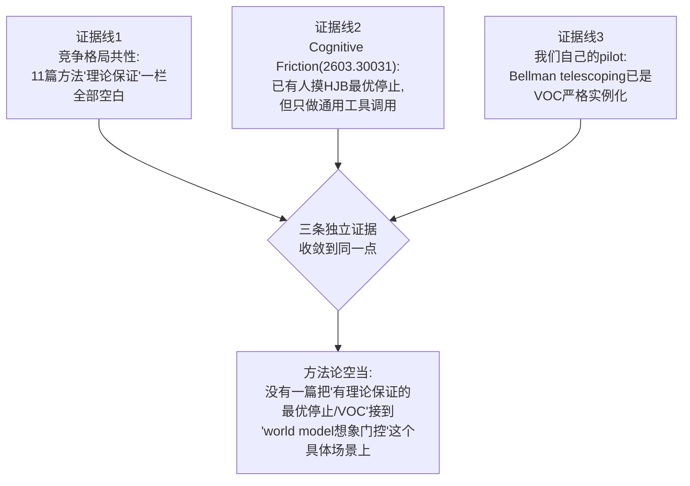

## 5.4 具体提案:把经典二元 VOC 推广成 ε-渗透 VOC

给想象rollout涉及的每个信息通道 c(即时奖励/value bootstrap/转移模型/continuation policy)
赋一个渗透率 $\varepsilon_c\in[0,1]$,表示这个通道携带了baseline不掌握的真任务信息的程度。
$\varepsilon_c=0$(所有通道)精确退化到发现一的Bellman telescoping结果——这不是被推翻,是这个
更一般框架的一个特例。

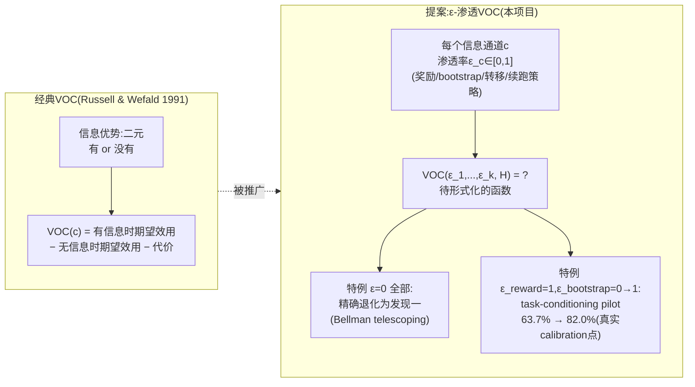

我们三轮pilot其实已经是这个ε空间里的几个采样点(表格/神经网络pilot全部
ε=0;member模式引入了一个ε>0但和决策无关的通道,验证了"ε>0不等于VOC>0";task-conditioning
pilot是$\varepsilon_{reward}$恒为1、$\varepsilon_{bootstrap}$从0变到1的一条轨迹,63.7%和82.0%
是两个具体的calibration数据点)。需要形式化并检验的核心问题:VOC作为$\{\varepsilon_c\}$和
rollout深度H的函数,具体函数形式是什么?是否近似可加?variance随H上升(已证明)和bias随
$\varepsilon$上升这两者的权衡,能不能给出理论上可求解或至少可数值刻画的最优停止深度
$H^*(\varepsilon)$?

**和idea 7的自然衔接**:如果$\varepsilon_c(t)$随episode推进、agent观测越来越多而演化(比如
关于"真实目标是什么"的belief随时间自然更新),"该在哪一步多想、哪一步省"就能表述成一个关于
belief更新的**序贯贝叶斯决策问题**,而不是ROI-Reasoning式的knapsack硬约束或ITP式的每步独立
选K——预算不是被显式"结转"的资源额度,而是隐式体现在belief越确定、越不需要多想这个自然的信念
收敛过程里。这和现有三篇最近邻论文(ITP/ROI-Reasoning/Finding-the-Time-to-Think)的机制都
不同。

---

# Part VI. 我们要怎么才能超越现有 SOTA

## 6.1 不要走的路

不要把方法贡献定位成"又一个RL训练的想象门控"。这条路已经拥挤(Astra/ITP/AVIC都在这条赛道),
资源更强的团队(比如Astra背后的港大+上海AI Lab)会更快把它做大做全,我们2个月的小团队在纯
经验式路线上没有速度优势。

## 6.2 具体的超越路径

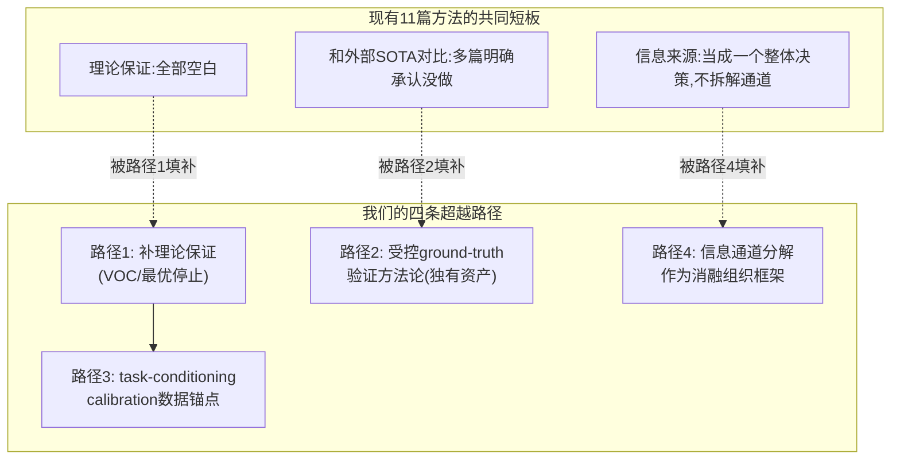

1. **理论保证是11篇竞品共同缺失的维度**——不需要在"想象机制本身"上比谁的工程更精巧,只需要
   在"门控决策有没有可证的最优性/误差界"这一个维度上做到竞品都没做的事。
2. **受控ground-truth验证方法论是我们独有的资产**——11篇竞品里,ELASTIC/RARRL明确承认"没有
   引用外部SOTA做对比,只做内部对照";我们的合成环境+精确value iteration裁判,是目前所有
   11篇论文里**唯一能够精确判断"想象选的动作是否真的更优"**的评测协议,这个方法论本身可以
   反过来验证/校准理论预测,形成"理论预测 vs 受控实测"的闭环——这是11篇里没有一篇做到的。
3. **task-conditioning pilot的calibration数据已经是一个具体的、可扩展的锚点**——不是空谈
   "我们要做理论",而是已经有63.7%/82.0%这两个真实数字可以拿来验证任何提出的$VOC(\varepsilon,
   H)$函数形式对不对。
4. **信息通道分解这个视角,现有11篇论文没有一篇采用**——它们都把"该不该想"当一个整体决策,
   没有拆解"想象内部不同信息来源各自贡献了多少"。这个更细粒度的分解本身就是一个可以独立
   评估的贡献,哪怕理论部分推不出干净闭式解,也能作为消融研究的组织框架。

## 6.3 需要正面回答的问题:这是不是在给已经被判"理论风险大"的 idea 3 硬凑?

不完全是。原判断"理论风险大"是因为没有具体、被逼出来的问题要证明,容易变成"为理论而理论"。
现在的ε-渗透VOC不是凭空提出的理论野心,是被自己三轮pilot的具体实证结果**倒逼**出来的一个
具体、可证伪的延伸问题,而且有具体calibration数据点可以直接用来做初步函数形式拟合——这和
"选一个理论框架往already-decided的方法上贴标签"是不同性质的工作。

---

# Part VII. 还未解决的问题

1. **理论推导本身可能推不出干净的闭式解**——渐变信息VOC这个问题即使在经典决策论文献里也可能
   有已知的困难结果,2个月内能不能拿到"哪怕不完美但站得住"的理论结果,是最大的不确定性。
2. **即使理论成立,"用网络估计通道级$\varepsilon_c(t)$"这个训练目标本身需要重新设计**,理论
   优雅不等于实现容易。
3. **需要把pilot从32状态合成格子世界搬到真实world model(DreamerV3/TD-MPC2)上重新验证**——
   高维环境里"通道"的定义本身可能更模糊。
4. **World-in-World的ICLR接收状态、F2组后6篇论文的逐字核验尚未完成**(见文档03的待办清单)。
5. **严格的"零信息泄露"三方对照组**(即时奖励也故意用默认目标算)仍未做,§4.4的机制推导目前
   基于间接证据,不是独立实验验证。
6. **这次调研没有找到"渐变信息通道VOC延伸"这个具体理论问题的任何已有工作**,但这是"未找到"
   而非"确认不存在"的判断,不排除换个理论社区(信息论/控制论)搜索会有新发现。

---

# Part VIII. 时间线与开放问题

```mermaid
gantt
    dateFormat X
    axisFormat %s
    section 会前准备(已完成)
    文献调研88篇+两轮核验     :done, a1, 0, 8
    10个idea腦暴+3轮pilot     :done, a2, 8, 6
    二次深挖(gap+竞争格局)     :done, a3, 14, 3
    本篇40页完整技术简报        :done, a4, 17, 3
    section 会议后(待定)
    方向拍板(Song+Weikai)     :active, b1, 20, 3
    理论可行性评估(若选ε-VOC路线) :b2, 23, 10
    真实world model上复现pilot :b3, 33, 14
    方法开发+消融               :b4, 47, 21
    写作+投稿准备               :b5, 68, 8
```

**需要会议明确拍板的问题**(汇总 Part V-VII 全部开放项):

1. ε-渗透VOC这个方向,从理论背景判断2个月内拿到"哪怕不完美但站得住"结果的可行性有多高?
2. 如果理论路线可行,是否需要收窄成"理论框架+合成环境验证"这一半,真实world model验证作为
   future work?
3. 如果理论风险太高,§6.2第4点"消融研究框架"降级方案是否可以接受?
4. World-in-World的ICLR接收状态、F2组后6篇论文的逐字核验,谁来做、什么时候做?
5. 10个idea里最终选哪1-2个并行推进(本文档不做决定)。

---

# 参考文献索引

11 个逐字通读全文(含附录)的核心方法论文:AVIC(2602.08236)、FFDC(2605.06222)、
Video-T1(2503.18942)、DreamerV3(2301.04104)、Astra(2606.06476)、ITP(2601.08955)、
ELASTIC(2606.31132)、RARRL(2603.16673)、Finding-the-Time-to-Think(2606.26463)、
ROI-Reasoning(2601.03822)、World-in-World(2510.18135)。理论补强:Hay et al.
Selecting Computations(1207.5879)、Grimm et al. Value Equivalence Principle
(2011.03506)、Efroni et al. Beyond One-Step Greedy(1802.03654)、Cognitive Friction
(2603.30031)、Sezener & Dayan(2002.04335)。诊断性证据:Current Agents Fail to Leverage
World Model(2601.03905)。完整88篇文献库(含A-F六个track)见
[`papers/INDEX.md`](papers/INDEX.md)。本文档所有事实性claim的核验记录见
[`03-novelty-competitive-landscape.md`](03-novelty-competitive-landscape.md)。
