# 0. 导读

> **老师的原话**:"进一步梳理 WM(World Model)的研究整体脉络和完整前沿,写的东西得多名词解释和
> 示意图,帮助新手研究者理解,不要假设读者是老手,看得懂密集的术语和缩写和著名工作,要像教科书
> 那样详尽。"这份文档就是对这句话的直接回应。

## 0.1 这份文档和已有 5 份文档的关系

在这份文档之前,项目已经产出了 5 份文档(`00`–`05`),它们的共同特点是**面向已经有背景的读者**——
写给要开会讨论方向的 Song 和 Weikai,默认读者已经懂强化学习、已经知道 AVIC/Dreamer/MuZero 是什么,
所以可以直接堆术语、堆公式、堆表格,把篇幅都花在"信息密度"上。这份新文档(`06`)反过来:**假设
读者完全没有背景**,每一个术语第一次出现都会解释,每一个"这是什么/为什么这样做"都会讲清楚,
代价是篇幅会更长,但目标是"一个人从头读到尾,不需要中途去查任何外部资料"。

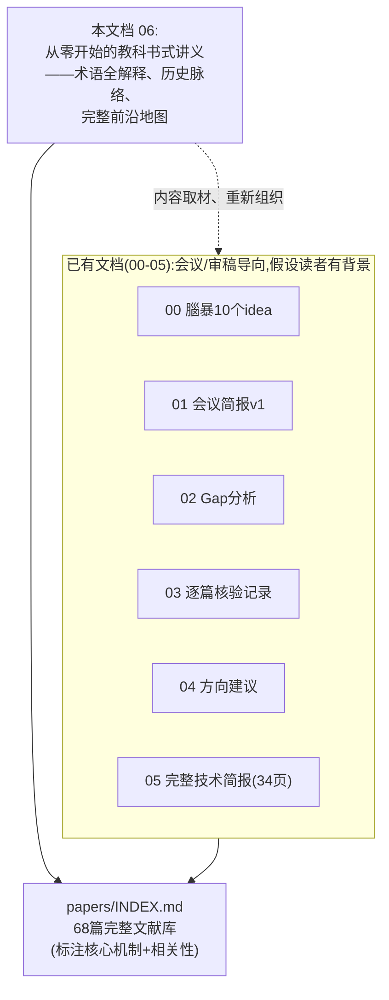

**两份文档不是谁取代谁**:`05` 信息密度更高、更适合已经懂行的人快速对齐信息;`06`(本文档)
更适合第一次接触这个课题的人建立完整心智模型,以后要查某个具体方法的公式/消融表格,仍然可以
回到 `05` 或 `papers/INDEX.md`。

## 0.2 怎么读这份文档

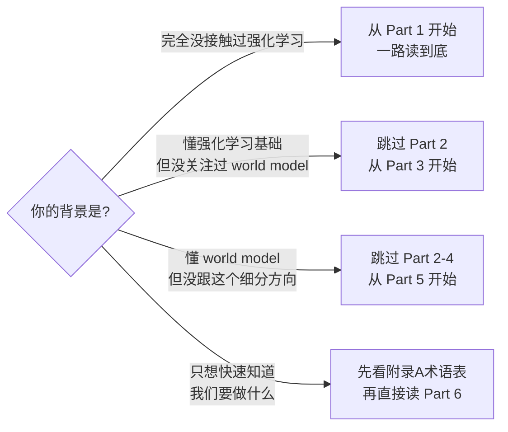

**全文结构**:Part 1 给一张"高频词速查表"让你先上路,不要求全记住;Part 2 从最基础的强化学习
讲起,建立"什么是 world model"这个核心概念;Part 3 是完整的历史脉络——world model 研究是怎么
从 2018 年一路发展到今天的;Part 4 把"训练时想象"和"测试时想象"这两种范式的区别讲透(这是
理解后面一切内容的关键前提);Part 5 是完整前沿地图,包括两组"想象经常没用"的诊断证据、十一个
最近邻方法的逐一深度解析;Part 6 是我们自己的研究定位——三轮 pilot 实验、发现了什么、还有什么
没解决、下一步准备怎么做;Part 7 是时间线;附录 A 是完整术语表,可以随时翻回来查。

**关于准确性**:全文所有数字、结论都标注了出处(论文 §/Table/Figure,或本项目自己的 pilot 结果代码
和数据文件),没有一个是凭印象转述的。历史脉络部分(Part 3)涉及的 9 篇经典论文,本次专门重新
逐篇核实了核心机制和关键数字(不是从旧笔记里转抄)。

---

# Part 1. 十五个高频词速查表(先上路,不要求先背下来)

> **导航提示**:本 Part 之后依次是 Part 2(强化学习与 World Model 基础)、Part 3(完整历史脉络)、
> Part 4(训练时 vs 测试时想象——关键区分)、Part 5(完整前沿地图)、Part 6(我们的研究定位)、
> Part 7(时间线)、附录 A(完整术语表)。

> 这张表只是"先给你一个锚点",完整解释在 Part 2-6 正文里,完整术语表在附录 A。第一次读到不熟悉的
> 词,可以先回来扫一眼这张表,继续往下读,不需要现在就完全理解。

```{=latex}
\begin{landscape}
```

| 词 | 一句话是什么 |
|---|---|
| **强化学习(RL)** | 一个"智能体"通过不断试错、根据反馈调整行为,学会在某个环境里达成目标的机器学习范式 |
| **环境(Environment)** | agent 所处的世界——可能是真实机器人、游戏、仿真器,agent 的每个动作都会让它发生变化 |
| **状态(State)/观测(Observation)** | 当前时刻环境的样子(比如一张画面、一组传感器读数) |
| **动作(Action)** | agent 可以对环境做的操作(比如"向左走一步") |
| **奖励(Reward)** | 环境对 agent 动作的反馈,一个数字,agent 的目标是让长期累积奖励最大 |
| **策略(Policy)** | agent 用来决定"这个状态下该做什么动作"的规则/网络 |
| **World Model(世界模型)** | 一个学出来的、能预测"做了某个动作后环境会变成什么样"的模型——不是真实环境,是环境的一个近似替身 |
| **想象/Rollout** | 不在真实环境里行动,而是在 world model 里"模拟"接下来会发生什么,这个模拟过程就叫"想象"或"rollout" |
| **Model-based / Model-free RL** | 有没有用到 world model 这个"替身"——用了叫 model-based,直接在真实环境里试错学策略叫 model-free |
| **规划(Planning)** | 在采取真实动作之前,先用 world model 在脑内"预演"几种可能性,挑最好的那个 |
| **测试时计算(Test-time compute)** | 部署/使用阶段(而不是训练阶段)额外花费的计算量,比如多想几步、多生成几个候选 |
| **不确定性(Uncertainty)** | 模型对自己预测有多大把握的量化指标,把握越小说明这个预测越可能是错的 |
| **消融实验(Ablation)** | 把方法里的某个部件去掉/换掉,看效果掉多少,以此证明这个部件确实有用 |
| **SOTA** | State-of-the-Art,当前公开报告里最好的效果 |
| **VOC(计算的价值)** | Value of Computation,量化"多算一步"到底值不值得的经典理论框架,本项目的核心数学工具 |

```{=latex}
\end{landscape}
```

---

# Part 2. 从零开始:强化学习与 World Model 是什么

## 2.1 强化学习(RL)的基本循环

一个强化学习问题总是由一个"智能体"(agent)和一个"环境"(environment)组成。Agent 观察当前
状态,选一个动作执行,环境根据这个动作变化到新状态并给一个奖励信号,agent 根据这个反馈调整自己
下次怎么选动作——这个循环不断重复,agent 的目标是让长期累积奖励尽可能大。


**一个具体例子**:把这个循环套到"格子世界"(gridworld,本项目自己的 pilot 实验用的就是这个)——
agent 是格子里的一个点,状态是它当前所在格子,动作是"上下左右移动一步",奖励可能是"走到终点
格子得+1分,撞墙0分"。Agent 一开始完全不知道该怎么走,靠不断尝试、记住"在这个格子往这个方向
走能拿到更好的结果",逐渐学会一条好路线。

数学上,这个循环通常写成一个 **MDP(Markov Decision Process,马尔可夫决策过程)**:
一个五元组 $(\mathcal{S},\mathcal{A},P,R,\gamma)$——状态集合 $\mathcal{S}$、动作集合
$\mathcal{A}$、转移函数 $P(s'\mid s,a)$(在状态 $s$ 做动作 $a$ 后跳到状态 $s'$ 的概率)、
奖励函数 $R(s,a)$、折扣因子 $\gamma\in[0,1)$(未来的奖励打几折,越小说明 agent 越"短视"、
只在乎眼前)。"Markov"这个限定词的意思是:转移到下一个状态只依赖当前状态和动作,不依赖更早的
历史——这是一个简化假设,如果环境本身部分不可观测(比如 agent 看不到完整棋盘,只能看到自己
视野范围内的一角),就要用 **POMDP**(Partially Observable MDP,部分可观测马尔可夫决策过程)
来建模,这个概念在 Part 5 讲 ITP 论文的 POIMDP 变体时会再用到。

**价值函数(Value Function)**:$V(s)$ 衡量"从状态 $s$ 开始、按某个策略走下去,长期能拿到多少
期望累积奖励";$Q(s,a)$ 是更细一级的版本,衡量"在状态 $s$ **先做动作 $a$**,之后再按策略走下去"
能拿到多少期望累积奖励。这两个函数在本文档后面(尤其 Part 6 讲我们自己的 pilot 时)会反复出现——
我们 pilot 实验能做"精确裁判"的关键就是格子世界足够小,可以用 **value iteration**(价值迭代,
一种直接对 Bellman 方程反复做不动点迭代直到收敛的经典算法)精确算出真实的最优 $Q^*(s,a)$,
不需要靠采样估计,这是很多真实世界任务做不到的"奢侈条件"。

## 2.2 World Model 是什么、为什么要有它

想象你在学开车。**Model-free(无模型)的学法**是:坐进真车里,不断试错——猛打方向盘看看会怎样、
急刹车看看会怎样,靠真实世界给的反馈(有没有撞车)慢慢学会开车。这个学法的问题是:试错成本很高
(真的会撞车),而且每一次尝试都要真的花时间在真实世界里发生一遍。

**Model-based(有模型)的学法**是:先在脑子里建立一个"这辆车会怎么反应"的心智模型——打方向盘
多少度车头会转多少角度、刹车距离大概多长——然后**在脑子里先演练**几种驾驶方案,想清楚了再真正
操作方向盘。这个"脑子里的心智模型",在强化学习里就叫 **world model(世界模型)**:一个学出来的、
能回答"如果在状态 $s$ 下做动作 $a$,环境会变成什么样(下一个状态 $s'$)、会给多少奖励 $r$"这个
问题的近似模型,记作 $\hat P(s'\mid s,a)$、$\hat R(s,a)$(符号上加个"帽子" $\hat{}$ 表示"这是
模型的估计,不是环境真实的规则")。

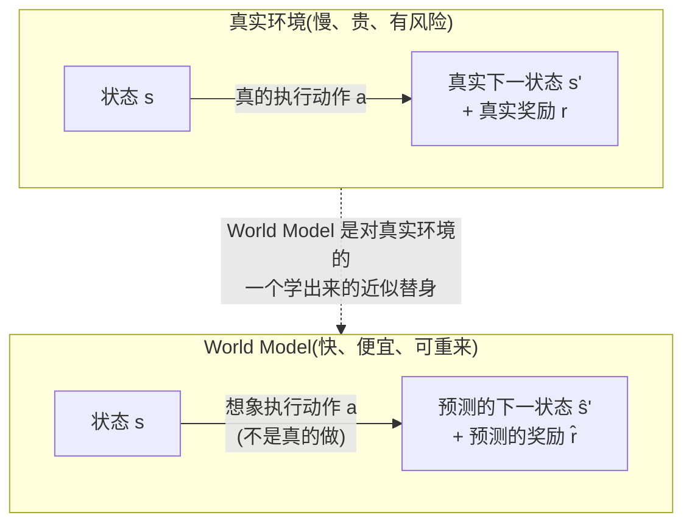

有了这个"替身"以后,agent 就可以在**不用付出真实代价**的情况下,反复"想象"很多种可能性——
这个想象的过程,就是本项目标题里"想象"(imagination)这个词的来源,技术上通常叫 **rollout**
(把一个想象出来的轨迹"卷"出来、展开出来的意思):从当前状态出发,用 world model 连续预测
若干步之后环境会怎样,形成一条"想象轨迹" $\hat s_1,\hat s_2,\dots,\hat s_H$($H$ 是想象了
多少步,叫 **horizon**,是本项目通篇反复出现的一个关键变量)。

## 2.3 有了 World Model 之后能做两件完全不同的事

这是全篇最重要的一次概念铺垫,Part 4 会专门展开讲。这里先埋一个伏笔:**"想象"这个能力,可以用
在两个完全不同的时间点**——

1. **训练阶段用**:在学策略的过程中,大量使用 world model 生成的想象轨迹当"练习题",练出一个
   策略网络。练完之后,部署时这个策略网络直接凭直觉出动作,不再需要 world model、不再做任何
   现场想象——就像一个练习了几千道类似题目的学生,考试时凭训练出来的直觉秒答,不再需要在考场上
   重新演算。
2. **测试(部署)阶段用**:每次真的要做决策之前,现场调用 world model 想象几种可能性,比较完
   再选一个——就像开卷考试,每道题当场翻书、当场演算,现算现用。

**本项目研究的问题,完全属于第二种**:一个 agent(或者更准确地说,一个已经训练好的系统)在**部署
时,每次要做决策的这一刻**,该不该临时调用 world model 想象一下、该想几个候选、该想多深、想完
之后该不该信——这四个问题合起来就是"测试时想象预算的自适应分配"这个研究问题的完整表述。

---

# Part 3. 完整历史脉络:World Model 研究是怎么走到今天的

> **这一 Part 专门核实的 9 篇经典论文**:World Models、PlaNet、Dreamer(v1)、DreamerV2、
> MuZero、TD-MPC、TD-MPC2、Genie、GameNGen——全部**逐页重新读了本地 PDF 原文**,不是从
> 旧笔记转抄,也不是凭印象转述。每一段都标了精确的引用位置(§/Table/Figure)。

## 3.1 起点:2018 年,"World Models"这个名字的由来

**论文**:Ha & Schmidhuber,*World Models*,arXiv:1803.10122,2018.5(这份 PDF 本身是
一份 arXiv 预印本,没有在文中标注具体会议或期刊名称)。

这篇论文把智能体拆成三个部分,名字直接就叫 **V**、**M**、**C**:

- **V(视觉)**:一个 VAE(变分自编码器),把每一帧 64×64 像素的图像压缩成一个 32 维的
  小向量 $z$——相当于给图像做了一个"精简摘要"。
- **M(记忆)**:一个 MDN-RNN(混合密度网络 + 循环神经网络),根据历史预测下一个 $z$
  可能是什么样——注意是**"可能",不是"一定"**:它输出的是好几种可能性的加权组合(比如
  "大概率前方安全,但也有一点小概率有障碍物"),这样能表达环境本身的不确定性,而不是
  武断地只给一个"标准答案"。
- **C(控制器)**:一个极其简单的线性层,直接把 $z$ 和 M 的隐藏状态映射成动作——在
  CarRacing 赛车任务里,**C 的全部参数只有 867 个**,而且不是用梯度下降训练的,是用一种
  叫 CMA-ES 的进化算法训练的(每一代随机撒一批参数、挑表现好的、让下一代往这个方向靠拢)。

**这篇论文最有名的地方,要分两种情形讲清楚,不能混为一谈**:

1. CarRacing 赛车任务:C 是在**真实环境**里训练的(V、M 只是固定住不变的特征提取器),
   最终跑到 906±21 分(100 次试验平均,论文称是当时第一个"解出"这个任务的方法,§3.3,
   Table 1)。
2. VizDoom "Take Cover"(生存类小游戏):这才是**完全在梦境里训练、几乎零真实环境交互**
   的经典案例——先用随机策略在真实 VizDoom 里跑 1 万条轨迹,训练出 V 和 M,**之后 C 的
   全部训练都在 M 生成的虚拟环境("梦境")里完成,论文原文明确写道"we have not actually
   attempted to train our agent on the actual VizDoom environment"**(附录 A.5)。
   练完直接把策略搬回真实 VizDoom 测试,反而拿到 **1092±556 分**(100 次试验,超过
   750 分的"解出"门槛,§4.2-4.4,Table 2)。

> **这篇论文在"想象预算"这个问题上的立场**:完全没有 Dreamer/MuZero 那种显式的"想象
> horizon"或"搜索次数"超参数——梦境 rollout 的长度就是任务本身的 episode 上限(VizDoom
> 是 2100 步),真实环境和虚拟环境用同一个上限。唯一被系统调过的量是 MDN-RNN 采样时的
> "温度"参数(控制梦境里的不确定性大小),论文手动试了几个值(0.10/0.50/1.00/1.15/1.30)
> 挑出效果最好的 1.15(Table 2)——这是训练前人工选定、之后不再变化的常数,**没有让预算
> 随状态/难度自适应的机制**。

## 3.2 支线一:隐空间想象训练策略——从 PlaNet 一路"刷题"到 DreamerV3

这条支线延续 Part 4 已经讲过的"训练时想象"范式:用 world model 生成大量想象轨迹当练习题,
训出一个策略网络,部署时不再现场想象。

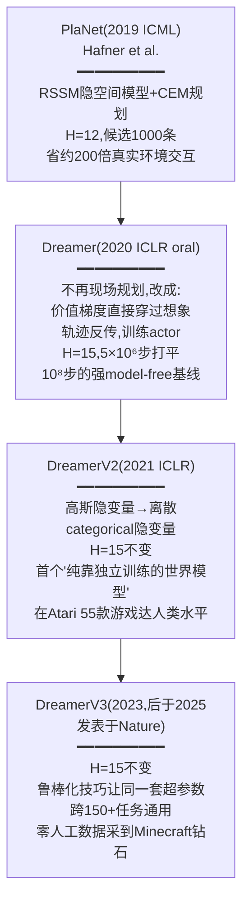

**PlaNet(Hafner et al., 2019 ICML,arXiv:1811.04551)**:学一个 RSSM(循环状态空间模型,
后面 Dreamer 系列沿用了同一个结构)之后,用 **CEM**(交叉熵方法,一种"撒一批随机方案、
挑最好的一批、在这批附近继续撒点"的搜索算法)在隐空间里挑动作——**规划视界 $H=12$、每轮
采样 1000 条候选、迭代 10 轮、每轮保留表现最好的 100 条**(附录 A,全部 6 个测试任务共用
同一套超参数)。效果上,平均只用约 200 倍更少的真实环境交互,就能打平当时更强的
model-free 方法(不同任务具体倍数不同,从 40 倍到 500 多倍不等,Table 1)。**论文自己在
第 7 节明确把"用一个价值函数估计规划视界之外的回报"列为未来工作**——也就是说 PlaNet
完全没有用价值函数弥补"只看 12 步"的局限,是硬截断,这一点后来正是下面的 TD-MPC 补上的。

**Dreamer / Dream to Control(Hafner et al., 2020 ICLR oral,arXiv:1912.01603)**:
在 §4.2 已经详细讲过 RSSM 结构和"没有现场规划"这件事。这里补一个关键的历史事实:**Dreamer
不是在隐空间里做现场搜索(像 PlaNet 那样),而是把价值估计的梯度直接反向传播穿过整条想象
轨迹去更新策略网络**——这比传统强化学习靠采样估计梯度方向的做法更高效。20 个 DeepMind
Control Suite 连续控制任务上,Dreamer 只用 500 万步真实环境交互就拿到 823.39 分,而
同样用 500 万步的 PlaNet 只有 332.97 分,用 1 亿步(20 倍数据量)的强 model-free 方法
D4PG 也只有 786.32 分(附录 G 表格)——**用远少的真实环境交互超过了当时最强的
model-free 方法**,这是"想象轨迹拿来训练"这条路线第一次在这个规模上证明自己好用。
论文 Figure 4 的消融实验也很有启发性:如果去掉价值函数(想象到 $H$ 步就截断,不再往后
估计),效果对 $H$ 的选择非常敏感;但完整版 Dreamer(想象到 $H$ 步后用价值函数续接估计
剩余回报)对 $H$ 的选择相当稳健——**这篇论文某种意义上的核心贡献,是"用价值函数把对想象
预算长度的依赖降下来",而不是"让预算自适应"**,这两者是不同的思路,但为"想象要多长才够"
这个问题提供了目前看来最早的系统对比数据。

**DreamerV2(Hafner et al., 2021 ICLR,arXiv:2010.02193)**:和 Dreamer(v1)最大的技术
差异是把隐变量从连续的高斯分布,换成了**离散的 categorical 分布**(32 个类别变量、每个
32 类,§2.1)——这个改动让模型能更干脆地表达"环境要么是这样、要么是那样"这种离散的可能性,
在实践中效果更好。想象展开长度仍然是 $H=15$,和 Dreamer(v1)一样(附录 D)。这是第一个
"纯粹依靠一个独立训练出来的世界模型学习行为"、并在 55 款 Atari 游戏上达到人类水平的方法
(需要注意:这个"第一"specifically 指"model-based 这一类方法里的第一个",不是史上第一个
超过人类基准线的算法,当时已有的 model-free 方法 Rainbow/IQN 也早已超过)。同样是全部
55 款游戏共用一套超参数,没有自适应机制。

**DreamerV3(Hafner et al., 2023,后于 2025 年发表于 *Nature*,arXiv:2301.04104)**:
已经在 Part 4 §4.2 详细讲过——延续 $H=15$ 这个固定值,靠一系列"鲁棒化技巧"(归一化、
KL 平衡等)让**同一套超参数**能跨 150 多个完全不同的任务通用,而且第一次做到"零人工数据、
默认超参数"就能在 Minecraft 里采到钻石(这是一个公认很难的长程稀疏奖励任务)。DreamerV3
是目前这条支线里最强的通用 world model,但它的"想象预算分配粗糙"这个问题,和 PlaNet 一样
一以贯之地存在——只是随着模型越来越强、任务越来越通用,这个问题被越来越强大的鲁棒化技巧
掩盖了,没有被直接解决。

## 3.3 支线二:学到的模型 + 现场搜索/规划——从 MuZero 到 TD-MPC2

这条支线是"测试时想象"范式(Part 4 讲过的第二种模式)最主要的历史来源——每次真实决策前,
现场用学到的模型做搜索或轨迹优化。

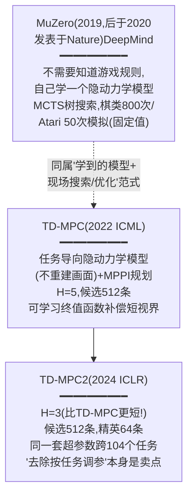

**MuZero(Schrittwieser et al., DeepMind, arXiv:1911.08265,2019,后于 2020 年发表在
*Nature*)**:和更早的 AlphaZero 最大的区别是——**AlphaZero 搜索时用真实规则模拟器**
(比如围棋规则本身)推演"这样走棋盘会变成什么样";**MuZero 完全不知道游戏规则**,而是
学一个"隐动力学模型"来自己"编造"这套推演逻辑,只包含三个函数:$h$(把历史观测编码成
初始隐状态)、$g$(给定上一个隐状态和一个假想动作,直接吐出预测的即时奖励和下一个隐状态,
**全程不生成任何图像**)、$f$(从隐状态直接读出策略和价值)。搜索用 **MCTS**(蒙特卡洛
树搜索:反复从根节点出发,按一个平衡"探索新分支"和"利用已知好分支"的打分公式往下走,
走到没展开过的叶子就用模型评估一下,再把结果沿路径回传更新沿途节点),但整棵搜索树完全
在学出来的隐空间里展开,**从不调用真实环境**。**关键数字:每次搜索的模拟次数是固定
常数——棋类游戏(围棋/国际象棋/将棋)800 次,Atari(因为动作空间小得多)50 次**
(§4,附录 C)。结果:围棋上用比 AlphaZero 更小的网络还略微超过 AlphaZero;Atari 57 款
游戏上人类归一化得分中位数 2041.1%(Table 1)。论文自己做的消融实验(Figure 3)特别
值得注意:训练时只用 800 次模拟,测试时把"思考时间"一路加到 50 秒(远超训练时的规模),
学到的模型依然能很好地泛化——**这说明"要不要想这么久"当时完全是研究者手动设定、观察
效果画图,而不是模型自己决定的**;全部 57 款 Atari 游戏上把模拟次数从 1 扫到 500,
性能提升在约 100 次后趋于平坦。

**TD-MPC(Hansen, Wang, Su, 2022 ICML,arXiv:2203.04955,UC San Diego)**:提出"任务
导向的隐动力学模型"(TOLD)——不要求模型学会重建完整画面(没有 decoder),只要求学会
预测"对任务奖励有用"的量,这样能避开阴影、纹理这些和任务无关的视觉细节带来的建模负担。
决策时用 **MPPI**(一种和 CEM 类似、靠加权平均迭代优化候选动作分布的规划算法)在隐空间
做**模型预测控制**(MPC:规划一整段动作序列,但只真的执行第一步,下一步重新规划)——但
**只规划很短的视界,默认 $H=5$、候选轨迹数 512**(加 5% 来自策略先验),同时联合训练一个
"终值函数"来估计这短短 5 步之后一直到无穷远的长期回报,补偿短视界规划本身看不到的未来
收益——这正是上面 PlaNet 自己承认没做到的那件事。有一个有意思的训练期细节:训练早期会把
规划视界从 1 线性增长到 $H$(因为模型一开始不准,想太远没有意义)——但这是**训练阶段的
课程式调度**,不是部署时按状态/任务难度做的自适应。

**TD-MPC2(Hansen, Su, Wang, 2024 ICLR,arXiv:2310.16828)**:相比 TD-MPC,最大的升级
是**鲁棒性**——只用同一套超参数就能横跨 4 个不同领域共 104 个任务稳定工作(TD-MPC 需要
按任务类别手调),而且验证了模型可以放大规模:训出一个 317M 参数的单一智能体,跨 80 个
任务通用,不同任务的机器人形态、动作空间都不一样。**核心规划预算参数(附录 Table 8):
视界 $H=3$(比 TD-MPC 的 5 还要短!)、候选轨迹数 512、精英数 64**——论文原文明确说
"启发式自动设置"只适用于折扣因子和"种子步数"这类外围超参数,**规划预算真正的核心旋钮
(视界/候选数/精英数)对全部 104 个任务完全一样,是训练前定死的常数**。论文把"去除按
任务调参"本身当作一个卖点——这对我们项目关心的问题(想象预算该不该自适应分配)是一个
非常直接的反例参照:业界最新最鲁棒的隐空间规划方法,选择的方向恰恰是"让预算更加一刀切",
而不是"让预算更加自适应"。

## 3.4 支线三:用视频生成模型直接当 World Model——想象开始变贵

前两条支线里的"想象",都发生在一个抽象的、低维的"隐空间"里,不需要真的生成一张能看懂的
画面。第三条支线不一样:直接用能生成逼真画面/视频的生成模型(扩散模型、自回归 Transformer
等)本身充当 world model——**这条支线的画面质量、可解释性远超前两条,但代价是一次"想象"
的算力开销急剧上升**,这正是"该想多少"这个预算问题从"理论上存在"变成"实际上不得不面对"
的关键转折点。

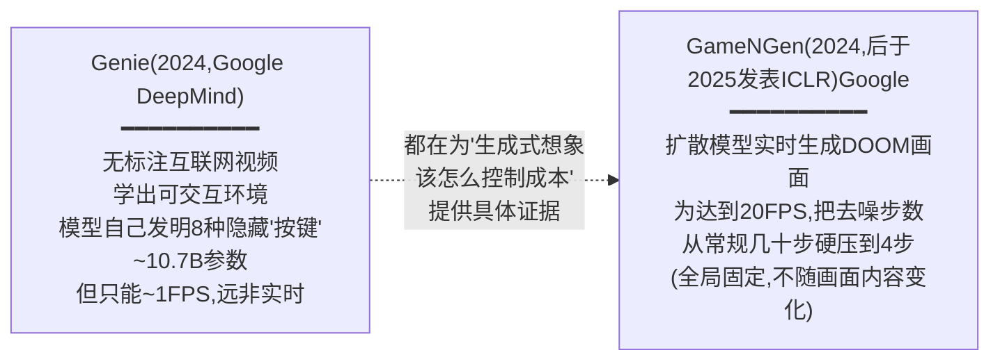

**Genie(Bruce et al., 2024,Google DeepMind,arXiv:2402.15391)**:完全从无标注的
互联网 2D 平台游戏视频(筛选后 680 万个 16 秒片段、约 3 万小时)里训练出一个"可交互"的
虚拟环境,不使用任何人工标注的动作标签。模型由三部分组成:时空视频 tokenizer(把画面
压缩成一串离散代码)、**隐动作模型**(训练时"偷看"当前帧和下一帧,自己总结出仅有
**8 种**离散的隐藏"动作"——相当于模型自己发明了一套手柄按键,不需要人告诉它"这是向左
走")、基于 MaskGIT 的自回归动态模型(根据历史帧和隐动作预测下一帧)。总参数约 107 亿
(摘要笼统称"11B")。**关键局限**:论文自己在结论部分承认"Genie currently operates
around 1FPS"(目前大约每秒 1 帧),远不够支撑实时交互体验,被列为未来工作。每帧固定
用 25 步 MaskGIT 去噪,是训练前定死的常数,不随画面复杂度调整。

> 这里有一个需要向读者坦白的核实细节:关于"Genie 是 2024 年 ICML 最佳论文之一"这个
> 说法,本次重新核实这份 arXiv PDF 全文时**没有找到任何标注这项荣誉的文字**——这份 PDF
> 读起来就是一份标准的 DeepMind 技术报告/arXiv 预印本。如果确实需要在正式场合引用这个
> 荣誉信息,应该另外核实官方获奖公告,不能只凭这份 PDF 断言。

**GameNGen(Valevski et al., 2024投稿,2025 正式发表于 ICLR,Google,arXiv:2408.14837)**:
用一个扩散模型(基于 Stable Diffusion v1.4 改造)直接"预测"下一帧 DOOM 游戏画面应该
长什么样,不是传统游戏引擎那样按规则渲染——训练分两阶段:先用强化学习(PPO)训练一个
agent 学会玩 DOOM 并录下它的操作轨迹,再用这些录像训练扩散模型模仿"根据过去几帧画面
+过去几次按键,预测下一帧"。**这是"为赶预算牺牲生成质量"最具体的一个历史证据**:为了
达到实时帧率,论文把扩散模型通常需要的"几十步"去噪,硬压缩到只用 **4 步 DDIM 采样**
(DDIM 是扩散模型里一种可以用更少步数完成去噪的采样方法)——
论文自己的消融表(Table 1)显示,4 步和 64 步的画面质量几乎没有差别(PSNR 32.58 对比
32.19),但如果进一步压到 1 步(且不做额外的蒸馏优化),质量明显下滑(PSNR 降到
25.47)。最终配置下单块 TPU-v5 能跑到 **20FPS**,精确的延迟分解是:4 步去噪的神经网络
计算共 40 毫秒,加上自编码器 10 毫秒,总共 50 毫秒/帧。人类评委在 1.6 秒/3.2 秒的短
片段里分辨"这是真游戏还是生成的",正确率只有 58%/60%(接近瞎猜的 50%)。**这 4 步的
去噪预算,是一次性消融测试后拍板的全局常数,不管画面是空荡走廊还是激战中的复杂场景,
统一都是同样的 4 步、同样的 40 毫秒**——这正是"预算怎么分配"这个问题留下的空白:
论文自己都推测出了"为什么 4 步就够"的原因(图像空间本身受限+前序帧提供了强约束),
但这个洞察只停留在事后解释,没有被用来做"根据画面内容自动增减去噪步数"这件事。

## 3.5 三条支线在 2025-2026 年交汇:生成式想象变贵,"该想多少"成为新问题

把三条支线放在一起看,能看到一条清晰的脉络:

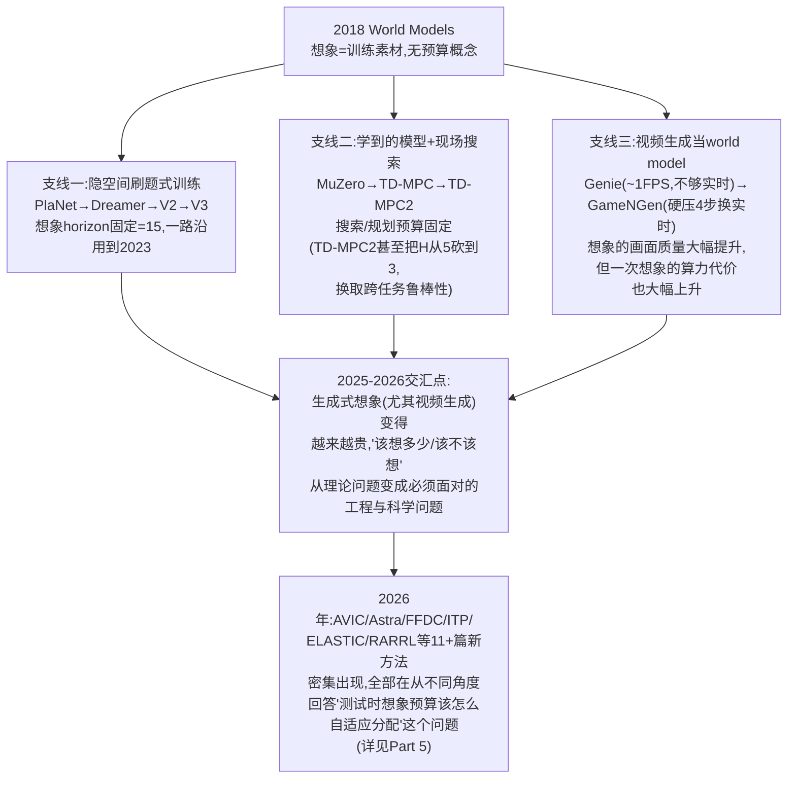

三条支线共同指向同一个尚未被彻底解决的问题:**不管是隐空间里的"想象"(支线一、二)还是
画面级的"想象"(支线三),想象预算——该想多久、想几个候选、该不该想——几乎从 2018 年
一直到 2024 年,都是训练前人工调好、之后固定不变的常数**。区别只在于,支线三里"想象"
本身变得肉眼可见地贵(GameNGen 为了实时不得不砍掉 90%+ 的去噪步数),这种"贵"倒逼整个
领域在 2025-2026 年开始密集出现专门研究"该怎么省着点用这份想象能力"的新方法——这就是
Part 5 要详细展开的"完整前沿"。

---

# Part 4. 关键区分再讲一遍:训练时想象 vs 测试时想象

> **为什么要专门用一整个 Part 来重复这件事**:这是 2026-07-20 会议简报撰写过程中的一次重要
> 修正——读 DreamerV3 论文原文之前,曾经笼统地把"Dreamer 系列"和"MuZero/我们的问题"归为同一类
> "会想象的 world model 方法",读完原文才发现这是两个范式完全不同的东西。这个误解具有代表性——
> 不熟悉这个细分领域的人几乎都会踩这个坑,所以值得单独用一个 Part、配一个类比,讲到不会再错。

## 4.1 一个类比:刷题 vs 开卷考

**刷题式学习(对应"训练时想象")**:考试前,学生疯狂刷几千道类似的练习题,把解题套路练成肌肉
记忆。**考试当场不能翻书、不能演算太久**,拿到题目要凭训练出来的直觉迅速作答。

**开卷考试(对应"测试时想象")**:每道题拿到手,当场翻书、当场在草稿纸上演算几种解法,比较完
选一个最有把握的答案再写上去。**平时不需要刷太多题,但考试现场要花时间"现算"**。

World model 的"想象"能力,在这两种模式下扮演的角色完全不同:

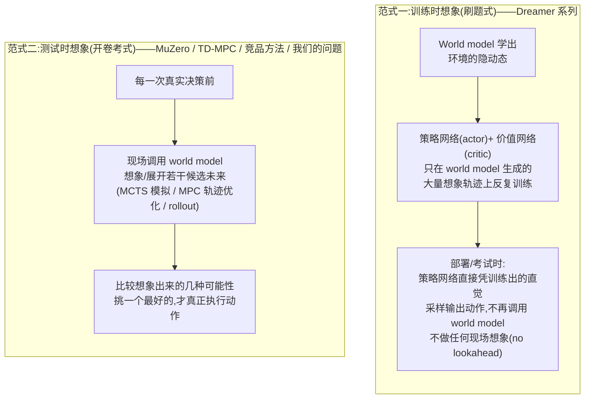

## 4.2 证据:DreamerV3 论文自己是怎么说的

这不是我们的推断,是 DreamerV3 论文(Hafner et al., arXiv:2301.04104,2023,后于 2025 年发表在
*Nature*)原文明确写的。在讲 critic 怎么训练那一节,原文逐字写道:

> "we select actions by sampling from the actor network **without lookahead planning**"
> (我们通过从 actor 网络里采样来选择动作,**不做任何前瞻式规划**)

论文自己的 Atari100k 结果对照表(Table 9)里有一列专门叫"Online planning"(在线规划,即
"部署时是否做现场搜索"),横向对比了 SimPLe、EfficientZero、SPR、IRIS、TWM、Dreamer 六个方法——
**只有 EfficientZero(属于 MuZero 一脉)这一列标了 X(表示"是"),Dreamer 这一列明确标的是
"--"(表示"否")**。也就是说,这个范式区分不是外部研究者强行归类出来的,是论文作者自己在表格里
就分得清清楚楚的。

**RSSM 是 Dreamer 系列 world model 的具体结构**(RSSM = Recurrent State-Space Model,循环
状态空间模型),原文给出的核心公式(逐字照抄):

- Sequence model(序列模型,负责把历史信息压缩进一个隐状态里):$h_t=f_\phi(h_{t-1},z_{t-1},a_{t-1})$
- Encoder(编码器,把真实观测压缩成隐变量):$z_t\sim q_\phi(z_t\mid h_t,x_t)$
- Dynamics predictor(动态预测器,**不看真实观测**、只靠历史隐状态预测下一个隐变量——这就是
  "想象"发生的地方):$\hat z_t\sim p_\phi(\hat z_t\mid h_t)$

训练阶段,DreamerV3 会用 dynamics predictor 连续展开固定长度 $H=15$ 步(超参数写在附录表里,
跨 150 多个不同任务全部沿用同一套超参数不变),生成大量"想象轨迹"来训练 actor-critic;但一旦
训练完成、部署使用时,上面那句"without lookahead planning"就意味着——**这个 15 步的想象展开
能力,在部署阶段完全没有被使用**。

## 4.3 为什么这个区分对我们的研究至关重要

我们要解决的"该不该想象、该想几个候选、该想多深、该不该信"这四个决策,**只有在"测试时想象"
这个范式下才有意义**——如果 world model 只在训练阶段用来生成练习题(像 Dreamer 那样),那么
"部署时该不该想象"这个问题根本不存在,因为部署时压根不会再调用 world model。所以本项目从
Part 5 开始要深入分析的"最近邻方法"(AVIC、FFDC、Astra、ITP……),清一色都属于"测试时想象"
这个范式——它们和 Dreamer 系列的关系,更准确的说法是"研究问题不同、不是直接竞争对手",而
MuZero、TD-MPC 这类"学到的模型 + 现场搜索/轨迹优化"的方法,才是我们问题在概念上最直接的
"远房亲戚"(Part 3 会讲清楚它们各自是怎么发展出来的)。

---

# Part 5. 完整前沿地图

## 5.1 前沿全景:68 篇文献怎么分类

项目的完整文献库(见 [`papers/INDEX.md`](papers/INDEX.md))一共 68 篇标注清单(61 篇 arXiv
论文 + 7 篇没有 arXiv 版本的经典引用),分成 6 组(A-F)。**不需要记住每一篇**,但需要建立一个
"这 6 组分别在回答什么问题"的整体地图——这是"完整前沿"这四个字真正的意思:不是罗列书单,而是
知道每一类文献在整个论证链条里扮演什么角色。

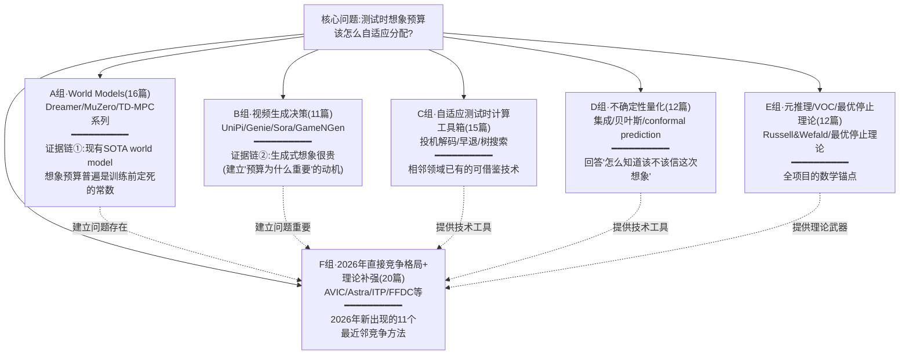

**怎么读这张图**:A、B 两组回答"这个问题真实存在、而且很重要"(A组证明预算目前分配得很粗糙,
B组证明想象这件事本身很贵,粗糙分配的代价很大);C、D 两组是"工具箱"——别的领域(比如 LLM 推理
加速里的投机解码)已经有一些解决类似结构问题的技术,可以借鉴过来;E 组是"理论武器库"——
Value of Computation(计算的价值,后面简称 VOC)这套 30 年前就有的经典理论,是本项目从头到尾
最核心的数学工具;F 组是这次二次深挖(2026-07)专门找的、**和我们研究问题最直接竞争的 11 个
2026 年新方法**,是 Part 5.3 要逐一深度解析的对象。

## 5.2 两组独立诊断证据:为什么说"想象预算分配得很粗糙"不是我们凭空猜的

**要点**:这不是一句"我们觉得现有方法不够好"的空话,是两篇独立诊断性论文分别测出来的硬数字,
一篇测视觉推理场景,一篇测通用具身场景,结论方向完全一致。

**证据 A(AVIC 论文自己的诊断实验,原文 §3)**:在 SAT-Real 数据集(一个需要"空间想象力"才能
答对的视觉问答数据集,比如"如果相机往左转会看到什么")上,论文作者把样本人工分成四类:

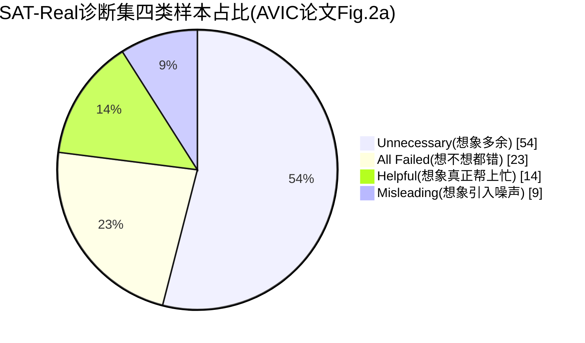

| 类别 | 占比 | 含义 |
|---|---|---|
| Unnecessary(不必要) | **54%** | 不调用世界模型、直接看原图也能答对,想象是多余的 |
| Helpful(有帮助) | **14%** | 想象真正带来了正确答案 |
| Misleading(误导) | 9% | 想象引入噪声/幻觉,反而导致答错 |
| All Failed(都答错) | 23% | 想不想象都答错 |

也就是说,只有 **14%** 的情况下想象真正帮上忙,但现有的"always-on"(逢查必想,不做任何判断)
策略对 100% 的样本都无差别调用世界模型——付出的代价是:always-on 比完全不想象只多拿到
**4.6 个百分点**的准确率提升,但要多花近两个数量级(约 100 倍)的 token、约 30 倍的推理时间
(原文 §3)。如果换成一个"先知式"、每次都精确判断该不该想的上界策略,准确率能从
baseline 的 62.0% 一路推到 **75.3%**——这中间将近 9 个百分点的差距,就是"该不该想象这个
判断准不准"这一件事能撬动的真实空间。

**证据 B**(*Current Agents Fail to Leverage World Model as Tool for Foresight*,
arXiv:2601.03905,2026.1,已 WebFetch 核验):场景更通用(不局限于视觉问答),原文报告的
具体数字——agent 主动触发模拟的比例**低于 1%**,即使触发了、误用预测结果的比例约 **15%**,
当研究者强制 agent 使用模拟结果时,性能反而最多下降 **5%**。论文把原因归结为 agent 缺乏三方面
能力:**判断何时该模拟、如何解读模拟出来的预测结果、如何把预测结果整合进下游推理**——这三条
其实正好对应本项目"该不该生成/该不该采纳/什么时候停"这三个决策点里的前两个。

两组数字来自完全不同的团队、完全不同的任务场景,却不约而同地指向同一个结论:**现有 agent
系统性地不知道该怎么用 world model 这个"想象"能力**,这不是某一篇论文的个别现象。

## 5.3 十一个最近邻方法逐一深度解析

> **怎么读这一节**:每个方法都会先给一个"这篇论文要解决什么问题"的一句话概括,再给架构图和
> 关键公式(公式看不懂可以先跳过,不影响理解整体思路),最后给"和我们的差异化空间在哪"。
> 全部十一篇论文**都是逐字通读了完整 PDF 原文(含附录),不是只读摘要**——这是 2026-07-22
> 二次深挖时定下的规矩,详见每个方法段落里标注的 §/Table/Figure 出处。

**先修提示**:读这一节之前,建议先确认自己理解了 Part 4 的"训练时想象 vs 测试时想象"区分——
下面十一个方法(除了作为历史参照的 DreamerV3)**全部属于"测试时想象"这个范式**。

### 5.3.1 AVIC —— 最接近的整体框架,但比较机制是"自洽性"不是"决策价值"

**论文**:Yu et al., *When and How Much to Imagine*, arXiv:2602.08236,2026,UNC Chapel Hill+NTU。

**一句话问题定义**:视觉空间推理问答场景下,该不该调用世界模型生成"想象出来的"新视角画面、
调用多少次。

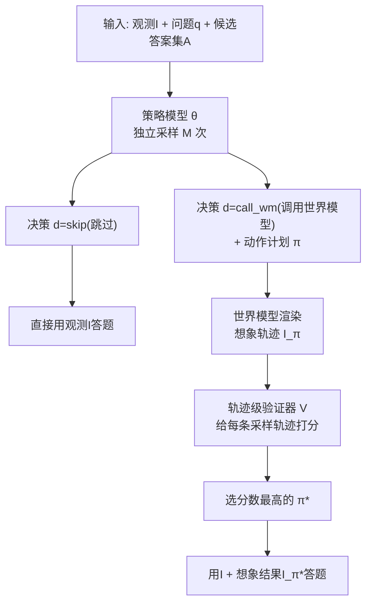

> **术语卡片:自洽性采样(Self-Consistency)** —— 让同一个模型对同一个问题独立重复采样多次
> (比如采样 5 遍),再从这 5 次尝试里挑一个"看起来最靠谱"的答案。这和"生成 5 个语义不同、
> 后果不同的候选方案再比较"是两件不同的事——前者是同一个方案的多次独立尝试(靠"多数表决"或
> 打分挑一次质量最高的尝试),后者才是真正的"决策价值比较"。这个区分是理解 AVIC 局限性的关键。

**关键公式**:门控+规划一体化(原文 Eq.1)$(d,\pi)\sim\theta(d,\pi\mid I,q,A)$,其中
$d\in\{\text{skip},\text{call\_wm}\}$;轨迹级验证(Eq.2)$s^{(m)}=V(I,q,I_\pi^{(m)})$,
$\pi^*=\arg\max_m s^{(m)}$——**这 $M$ 条候选轨迹全部来自同一策略对同一问题的独立重复采样
(self-consistency)**,验证器选的是"这次采样质量最高的一次尝试",不是几个语义不同、后果
不同的候选未来之间的决策价值比较;训练目标 AVIC-R(Eq.4,用 **GRPO** 这种强化学习算法训练)
$r=\mathbb{1}_{\text{correct}}-c|\pi|-\beta_s\mathbb{1}_{\text{wrong-skip}}-
\beta_p\mathbb{1}_{\text{parse-fail}}$,$c{=}0.1,\beta_s{=}\beta_p{=}0.5$。

> **术语卡片:GRPO** —— Group Relative Policy Optimization,一种强化学习训练算法(PPO 的
> 变体,最早因 DeepSeek-R1 而广为人知),核心思路是"对同一个输入采样一组候选输出,组内比较
> 相对好坏来算优势值",不需要额外训练一个价值网络。本文档后面还会遇到 PPO、SAC、Dr.GRPO
> 等同类算法,都是"用采样到的经验数据、按某种规则更新策略网络参数"这个大类下的具体配方,
> 细节差异不影响本文档的理解,可以都当作"训练门控策略用的强化学习算法"来读。

**结果**:AVIC-R(用 Qwen2.5VL-7B 模型)平均每题只想象 **3.60 次**(相比 always-on 基线的
8.90 次),准确率超过 GPT-4o 策略版本(+8.0 个百分点,77.3% vs 69.3%),略超 GPT-4.1
(+0.7pp,80.0% vs 79.3%)。原文 Table 6 消融实验:去掉"错误地选择跳过"这一项惩罚,策略会
直接崩溃成"全部跳过不想象",准确率从 77.33% 掉到 62.67%(掉 14.66 个百分点)。原文 Table 4:
如果只做"要不要想象"的二元门控、不联合优化"该想多深",效果反而比 always-on 更差
(73.3% vs 77.3%)——这说明**"该不该想"和"该想多少"这两个决策必须联合优化,不能拆开单独做**。
R2R 导航实验(Table 3)证明这套机制能应用到"一步一步走"的序贯场景,但每一步的 gate 决策彼此
独立,没有跨步骤的预算调度(比如"这一步先省着点,留着预算给后面更难的路口用")。

**局限性(逐字读完全文后的判断)**:验证器比较的是同一策略的自洽采样,不是真正不同后果的候选
未来之间的比较;训练用的奖励信号是"这题答没答对"的代理,不是显式的 VOC 目标函数;没有跨步骤
的预算调度机制。

---

### 5.3.2 FFDC —— 最接近"何时该停/何时该重新想",但只监控单条轨迹

**论文**:Wang et al., *When to Trust Imagination*, arXiv:2605.06222,2026,南方科技大学+
港大+Astribot(一家做人形机器人的公司)。

**一句话问题定义**:一个叫 World Action Model(WAM)的系统同时预测"接下来要做的动作"和
"接下来会看到的画面",这个"已经预测好的未来"能信多久?该多久检查一次、什么时候该放弃、
重新规划?

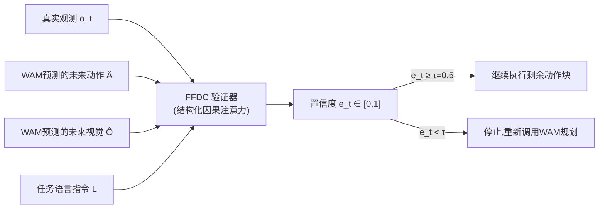

**关键机制**:验证器只需要重新编码"最新这一帧真实观测",其余(之前预测的动作/画面/语言指令)
全部走 **KV cache**(一种复用之前算过的中间结果、不用重新从头计算的工程技巧,LLM 推理加速里
非常常见)——不需要重跑整个 WAM 大模型,就能算出这一刻的置信度(原文 §3.2 逐字:"the verifier
only encodes the latest real observation O_t and performs lightweight attention against these
cached tokens... without rerunning the full WAM")。训练方式是纯二分类:正样本是真实成功的
轨迹片段,负样本是失败轨迹+人工构造的"故意破坏过"的片段(比如时间顺序打乱、机械臂夹爪状态
翻转、后半段加噪声)。

**结果**:RoboTwin(机器人操作仿真基准)困难任务成功率从 54.20% 提升到 **76.40%**(随机场景)、
从 57.80% 提升到 **76.00%**(干净场景);平均减少 WAM 前向调用 **69.10%**,执行时间快
**34.02%**。真实机器人(Astribot S1,**34 自由度**)成功率从 45% 提升到 **80%**,但真实
世界下平均调用次数和耗时反而略高于短 chunk 基线——这本身就是"该不该多算需要按具体情况自适应"
的一个直接证据。原文 Table 3 消融:去掉"预测的未来画面"这个输入,准确率掉得最多
(76.4%→71.6%)——说明**想象出来的未来画面本身,就是最有信息量的信号**,不是可有可无的装饰。

**局限性**:只监控"已经生成的那一条想象轨迹"够不够可信,不涉及一次生成多个候选未来、互相比较、
挑一个采纳——这正是下一篇 Video-T1 和后面 AVIC 想解决但方式不同的问题。

---

### 5.3.3 Video-T1 —— 想象内部的搜索结构最像,但优化目标是生成质量不是决策价值

**论文**:Liu et al., *Video-T1*, arXiv:2503.18942,2025,清华+腾讯。

**一句话问题定义**:视频生成模型能不能像 LLM 的"测试时扩展"(test-time scaling,多想一会儿
换更好答案)一样,靠多花计算量换更好的生成视频质量?

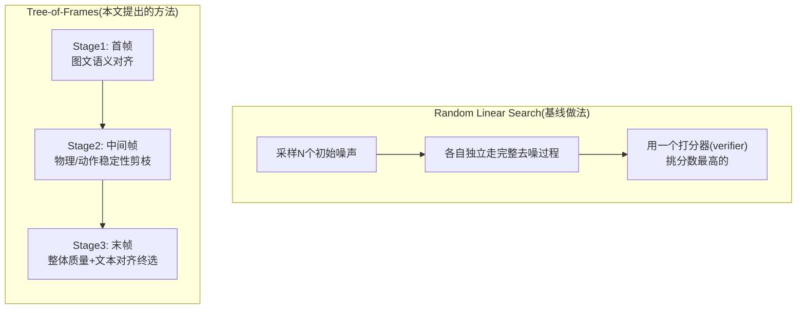

> **术语卡片:树搜索 / 剪枝(Pruning)** —— 把"生成一整段视频"拆成一步步的树形分支(比如
> "先生成首帧的几个候选,选出有希望的几支,再往下展开中间帧"),每一步只保留有希望的分支、
> 提前砍掉明显不行的分支(这就叫"剪枝"),而不是等所有分支全部生成完再一次性比较——这样能
> 省下大量算力,是"预算该怎么花"这个大问题在视频生成场景里的一个具体解法。

**结果**:在 PyramidFlow(FLUX)这个视频生成模型上,朴素的 Linear Search 需要 $5.22\times10^7$
GFLOPs 的算力,Tree-of-Frames 只要 $1.62\times10^7$(省了约 3.2 倍);VBench(一个综合评测
视频生成质量的标准评测集)上多数模型有 +3.4%~+5.9% 的相对提升。

**局限性(和我们的问题差距最本质的一篇)**:打分器(verifier)依据的是**生成质量**(画面运动
是否流畅、是否符合文本描述、美学质量如何),整个流程里完全没有"下游决策任务"的存在——优化的
是"这段视频好不好看/像不像",不是"这段想象对做决策有没有帮助"。这个区分非常重要:Video-T1
的"想象"服务于生成质量,我们的"想象"服务于决策价值,是两件目标完全不同的事,即使搜索结构
(树形剪枝)看起来很像。

---

### 5.3.4 DreamerV3 —— 训练时想象范式的代表,不是测试时 controller 的直接竞品

**论文**:Hafner et al., arXiv:2301.04104,2023(后于 2025 年发表在 *Nature*)。

已经在 Part 4 详细讲过——它的"想象"发生在训练阶段(生成练习题训练 actor-critic),部署时不做
任何现场规划。放在这里,是为了确立后面所有"测试时想象"方法的历史参照系,不是一个方法上的竞争
对手。

---

### 5.3.5 Astra —— 视觉推理场景下和 AVIC 最像的 2026 年新竞品,资源背景更强

**论文**:Zhu, Lin et al., *Thinking with Imagination*, arXiv:2606.06476,2026.6,港大+
上海AI Lab+SJTU+复旦+北航。

**一句话问题定义**:视觉语言模型(VLM)面对"多个视角拼起来的空间推理题"时,常常推不出没有
被直接观测到的房间布局——能不能让它在推理过程中,主动向一个"世界模拟器"发一个"如果相机往
这边转会看到什么"的请求,拿到想象出来的新视角画面,再整合进推理过程?

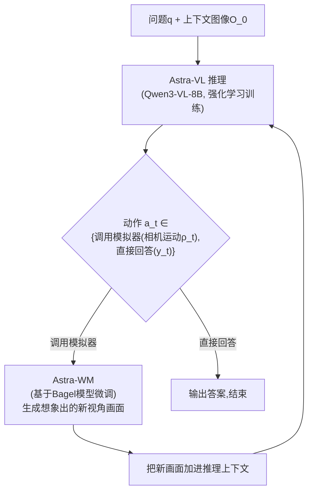

**关键机制**:两阶段强化学习课程训练。第一阶段先让模型学会"愿意主动调用工具"(否则模型会倾向
于偷懒直接短答案、不去调用模拟器);第二阶段才开始奖励"调用模拟器确实比直接回答更好"这件事
本身,引入一个"无工具基线"作对照——只有当"调用模拟器"的效果**真的超过**"不调用直接回答"的
效果时才给奖励,不是"调用了就有奖励"。

**结果**:在 MMSI-Bench(多图空间推理评测集)上,总分从骨干模型自身的 29.8 提升到 **38.8**
(+9.0 个百分点);在 MindCube-tiny(3D 结构化空间推理评测集)上从 36.8 提升到 **42.7**
(+5.9pp)。**需要特别澄清的一点**:这两个评测集上绝对分数最高的仍然是闭源模型
Gemini-3-Flash(45.4/70.5 不加想象直接答,49.5/72.7 加想象后)——Astra 的贡献是"开源同等
规模模型里最强的自适应想象方案",不是刷新了整体最高分。原文的两阶段消融实验显示:如果只给
"工具调用有没有带来增益"这一种奖励,策略会几乎不再调用模拟器(调用率坍缩到 4.9%);如果只给
"用了工具就有奖励"这一种,调用率又会飙到 98.1%(几乎每次都用、和不做判断没区别);完整的
两阶段课程才能平衡到 61.5% 的调用率,拿到最高分。

**局限性**(原文自己列出的四条):缺乏恰当的探索机制时会坍缩成极端策略;模拟器有可能生成
"看起来说得通、但其实没帮助"的画面;策略有时会混淆"这是原始图像"还是"这是生成出来的想象
画面";奖励信号是稀疏的"答对/答错"差值,捕捉不到"这次想象部分有用"这种中间状态。

---

### 5.3.6 Imagine-then-Plan(ITP)—— 和"该不该想、想多深"重合度最高的框架级实现

**论文**:*Imagine-then-Plan: Agent Learning from Adaptive Lookahead with World Models*,
arXiv:2601.08955,2026.3,港理工+中南大学。

**一句话问题定义**:一个 LLM/VLM agent 每一步该不该想象、该想多深(用 $K_t$ 表示这一步想
象展开的步数)?

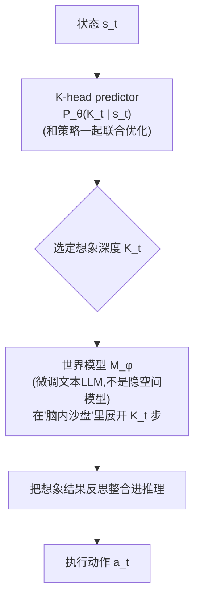

> **术语卡片:POMDP → POIMDP** —— 前面 Part 2.1 提到过 POMDP(部分可观测马尔可夫决策过程)。
> ITP 论文提出了一个变体叫 **POIMDP**(Partially Observable **and Imaginable** MDP,部分
> 可观测且可想象的马尔可夫决策过程)——在标准 POMDP 基础上,显式加入"agent 除了观测真实环境,
> 还可以调用 world model 生成一段虚拟轨迹辅助决策"这个额外能力,这是把"想象"这件事写进决策
> 过程正式数学定义里的一种方式。

**关键公式**(全部逐字核对论文 HTML 全文属实):策略 $a_t\sim\pi_\theta(\cdot\mid s_t,
\hat\tau_t(K_t))$(动作依赖当前状态和"想象出来的轨迹");用来训练"该想多深"这个判断的伪标签
选择准则 $\tilde K_t=\arg\max_{0\le k\le K_{max}}[\log p_{\theta_0}(a_t^*\mid s_t,
\hat\tau_t(k))-\lambda_K\cdot k]$——直白地说,就是"在所有候选想象深度里,挑一个'让正确动作
概率最高'和'想象步数代价'加权后最划算的深度,当作训练目标";在线奖励
$r_{t+1}=r_{env}-\lambda_K K_t-\lambda_{step}$(环境本身的奖励,减去想象步数的代价,再减去
每步的固定代价)。

**结果**:在 ALFWorld、WebShop、ScienceWorld、StableToolBench 四个标准 agent 评测集上全部
验证了同一个结论——原文原话:"fixed-k lookahead is brittle: success rate peaks at a moderate
k then declines, cost rises sharply"(固定想象深度很脆弱:成功率会在某个中等深度达到峰值后
反而下降,而代价一直在涨);"adaptive lookahead achieves higher success rates with
substantially lower budget"(自适应想象深度能用更低的预算拿到更高的成功率)。

**局限性(需要明确的三条差异化空间)**:世界模型是微调过的文本 LLM(靠生成文字来"想象"),不是
隐空间动力学模型;想象深度是**一次性预先选定**的,过程中没有"发现想错了、提前止损"的机制;
没有"这个 episode 前面几步省下的预算,留给后面更难的步骤用"这种跨步骤的预算结转机制。

---

### 5.3.7 ELASTIC —— 扩散/流式控制策略的测试时算力调度,不涉及想象但同属"自适应算力"家族

**论文**:Li, Swamy, Bisk, Bajcsy, *ELASTIC*, arXiv:2606.31132,2026.6,CMU。

**一句话问题定义**:机器人控制策略(用扩散/流式生成模型实现)在测试时可以沿两条方向"砸算力"
换质量——**序列方向**(把单个动作的去噪步数变多、算得更精细)和**并行方向**(同时采样多个
候选动作、用打分器挑最好的)。该往哪个方向砸,是**依赖当前具体状态**的。原文举了一个具体反例:
拿马克杯任务举例——如果策略不确定"该拿哪个杯子"(这本质是"选哪个模式"的问题),继续在序列
方向上算得更精细基本没用,更需要在并行方向上多采样几个候选比较。

> **术语卡片:扩散策略(Diffusion Policy)** —— 把"预测下一个动作"这件事,用图像生成里常见
> 的扩散模型来做:从一堆随机噪声出发,一步步"去噪"得到一个具体的动作数值,而不是直接输出
> 一个确定的动作。这样做的好处是可以自然表达"这个状态下有好几种同样合理的动作"这种多峰
> 分布,但代价是需要多步去噪才能得到一个动作,这正是"该在这个去噪过程上砸多少算力"这个
> 问题的来源。

**结果**:在 LIBERO-10(10 个长时程机器人操作任务集合)上,拿一个已经训练好的 SOTA 视觉-语言-
动作(VLA)模型 pi0.5 做零样本测试(不重新训练,只加测试时算力调度)——ELASTIC 拿到 94.0% 
成功率、64.5ms 延迟,而 pi0.5 原始基线是 91.5%/68.7ms,"best-of-N"式暴力采样基线是
95.5%/94.0ms。原文总结:"ELASTIC recovers performance gains equal to Sequential with 6.1%
less inference latency"(用序列方向砸算力能拿到的提升,ELASTIC 靠更聪明的调度只用更少的
延迟就拿到了)。真实机器人实验里,"ELASTIC can match the improvements of full BoN scaling
with V-GPS while using 34% less inference latency"(能追平"暴力多采样"的提升,但少花
34% 推理延迟)。

**局限性**(原文照录):"the primary limiting factor for the effectiveness of our approach
is the learned verifier $Q_\phi$. A noisy verifier masks useful signal...hurting meta-policy
optimization"(方法有效性的主要瓶颈是学出来的打分器本身——如果打分器噪声大,会掩盖有用信号,
反而伤害整体优化)。

---

### 5.3.8 RARRL —— LLM 高层推理调用的开关+角色+预算三元决策,消融最系统的一篇

**论文**:*When Should a Robot Think?*, arXiv:2603.16673,2026,CMU+东北大学+哈佛等多机构。

**一句话问题定义**:具身机器人系统调用 LLM 做高层推理会带来巨大延迟——"该不该想、该用哪种
推理角色、该分配多少预算"这三个决策合在一起,在"决策层"(不是底层控制层)学习一个统一的
调度策略。

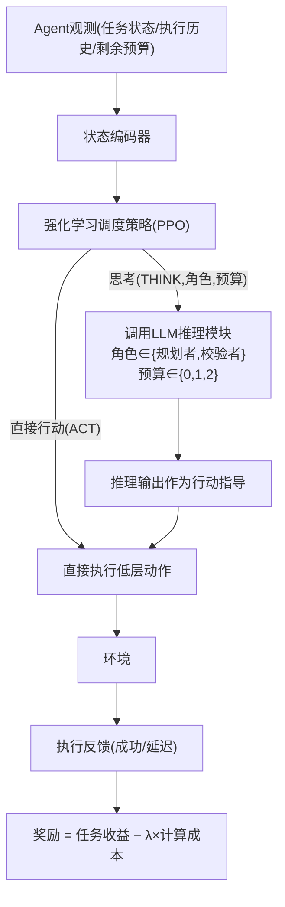

**结果**(在 ALFRED 具身指令跟随基准上,用真实 LLM 推理测的,不是模拟延迟):RARRL 相比"每次
都做完整推理"的基线,导航任务成功率 82.7 对比 84.0(略低一点点),但 LLM 推理耗时从 31.5 秒
降到 **12.3 秒**(降 61%)、token 消耗从 4100 降到 980。**"Budget Shock"鲁棒性实验**(模拟
资源突然被削减这种真实场景)特别值得注意:资源突降后,一个"启发式"基线的推理调用次数不降
反升(14.2→15.1,不会自适应),而 RARRL 主动降低调用(11.3→7.6),同时成功率保持得更高
(74.9 对比 61.8)——这说明真正的自适应调度在"资源突然变紧张"这种现实场景里价值更明显。

**消融实验(五项,是十一篇里做得最系统的一篇)**:去掉"剩余预算"这个输入,成功率掉 6.7 个
百分点、且推理频率会升高(因为策略感知不到资源紧张,会过度调用);"只用规划者角色"
(83.1分)不如"规划者+校验者都用"(87.6分)。

**局限性**(原文照录多条):训练环境是"抽象/程序化的",不是物理仿真器或真实机器人;主动排除
了传感器噪声和执行延迟这些因素("we isolate orchestration from sensor noise and actuation
delays");预算约束是"软"的(不是数学上严格保证不超支的硬约束)。

---

### 5.3.9 Finding the Time to Think —— 和"该想多久"最贴近,但用完美模拟器+MCTS,非生成式world model

**论文**:Muppidi, Darwish et al., arXiv:2606.26463,2026.6,牛津大学(Foerster研究组)。

**一句话问题定义**:在"实时"强化学习场景下——**世界不会等 agent 想清楚**,agent 想得越久,
真实世界就推进得越多——"该想多久"本身是一个依赖当前状态的元层面决策问题。

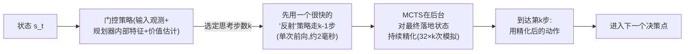

> **术语卡片:SMDP(半马尔可夫决策过程)** —— 普通 MDP 里每一步花费的"时间"都相同(一步就是
> 一步);SMDP 允许"一步"实际花费不同长的真实时间(比如这次决策"想了 5 步的时间"、下次决策
> "想了 1 步的时间")——这篇论文用 SMDP 来建模"思考本身要占用环境推进时间"这件事,是把
> "该想多久"这个问题写成数学模型的一种方式。

**结果**(5 个环境,拿"自适应门控"和"效果最好的固定思考时长"比较):吃豆人(Pac-Man)
2370 对比 2149(领先 10.3%);实时版俄罗斯方块领先 **65%**(45.6 对比 27.6);贪吃蛇
(Snake)领先 10.9%。原文强调:"random baseline falls well below every fixed-k policy...
confirming that *when* to allocate compute matters as much as *how much*"(随机分配思考
时长的基线明显不如任何固定时长策略,证明"什么时候该多想"和"该想多少"同样重要)。**可解释性
亮点**:在实时版俄罗斯方块里,"思考3步"这个选项**从未被策略使用过**(0%)——策略学出的是一种
"要么几乎不想、要么深想"的两极策略,不存在中间档。

**局限性**(原文三点):整套方法依赖 MCTS 能在一个**完美的**模拟器上工作(知道环境的精确规则),
换成 MuZero 那种"学出来的"不完美动力学模型是论文自己承认的"未来工作";门控策略是在一个
"冻结不动"的底层规划器之上训练的,两者联合优化仍是开放问题;**没有任何形式化的收敛性/最优性
理论保证**——这一点在后面 Part 6 讲我们自己想补的"理论空当"时会再次用到。

---

### 5.3.10 ROI-Reasoning —— "跨步预算调度"机制上最接近的匹配,但用于LLM批量数学推理

**论文**:Zhao, Qi, Sun, arXiv:2601.03822,2026.1,中国人民大学。

**一句话问题定义**:多道题共享一个严格的全局 token 预算,该怎么在题目之间分配算力?这被形式化
成一个叫 **OS-MCKP**(Ordered Stochastic Multiple-Choice Knapsack Problem,有序随机多选
背包问题)的经典优化问题——按固定顺序、在代价和收益都不确定的情况下,做一系列不可逆的决策
(做完一道题的预算分配就不能反悔重来)。

> **术语卡片:背包问题(Knapsack Problem)** —— 一个经典组合优化问题:有一个容量有限的背包
> 和一堆价值、重量各不相同的物品,该选哪些物品装进背包才能让总价值最大。这里的"物品"是
> "每道题该投入多少算力","背包容量"是总的 token 预算——把"预算该怎么在多个任务间分配"
> 类比成背包问题,是一种常见且有成熟理论工具支持的建模方式。

**结果**(用一个只有 1.5B 参数的小模型,对比参数量是它上百倍的大模型):最亮眼的数字——在
"最难的题+最紧的预算"这个设定下,经过两阶段训练的模型拿到 **0.93** 分(满分区间内),远超
GPT-4o-mini 的 0.32、以及参数量大 450 多倍的 DeepSeek-V3.2(685B)的 0.49。分题目拆解显示,
baseline 方法在"考卷最后一题"上明显比第一题答得差(说明前面的题目把预算花超了),而这篇论文
的方法在后面几道题上提升幅度最大——学到的是"为后面的题目预留预算"这种**长程**分配策略。

**局限性**:聚焦固定 3 道题的数学推理场景;用 token 数量代理"成本",不能完全捕捉真实世界里
的延迟/工具调用/验证等更复杂的成本构成;**没有把经典背包问题的理论最优性证明,迁移/证明到
这里用强化学习求解的具体方案上**——也就是说,虽然问题的数学形式是背包问题,但论文并没有真正
拿到背包问题理论能提供的最优性保证,这一点在后面 Part 6 讨论"理论保证"这个空当时会再次提到。

---

### 5.3.11 World-in-World —— "多候选比较"这个机制目前做得最完整,已确认 ICLR 2026 Oral

**论文**:Zhang, Jiang et al., arXiv:2510.18135,2025.10,JHU+PKU+Princeton+MIT等。

**一句话问题定义**:现有的 world model 评测大多是"开环"的(open-loop,只看生成的画面
质不质量高),没有一个评测真正测过"生成出来的想象世界,是否真的能帮 agent 在一个完整的决策
循环里做出更好的选择"。

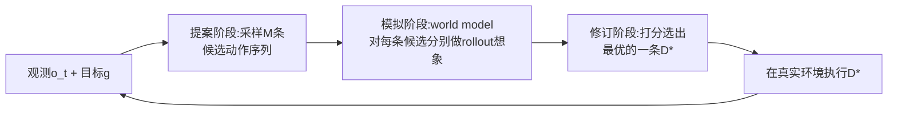

这个"提案→模拟→修订"的结构,**比经典的 MPC(模型预测控制)更通用**——MPC 优化的对象被限制
在"一串动作序列"里,这里的"修订"阶段可以合成/更新一个全新的决策,不局限于事先枚举好的
候选集合。

**结果**(在论文自己新构造的 4 个闭环任务套件上,不是套用外部现成 benchmark):在"主动识别
被遮挡物体"任务上,闭源模型 Runway Gen4(零样本)成功率 64.79%;开源模型里最好的是经过
后训练的 Wan2.2 达 62.43%。**论文自己报告的一个重要发现**:把后训练数据从 400 条扩到
8 万条,成功率单调上升,而且**更大的模型(14B)比更小的模型(1.5B)从数据增加中获益更多、
更晚出现饱和**——原文原话:"scaling action-conditioned post-training is more effective for
embodied utility than upgrading the pretrained generator"(针对具体动作场景做后训练扩展,
比单纯升级预训练生成器本身更有效)。

**局限性**(原文正文列出四条):世界模型的泛化能力仍是关键瓶颈(有时会退回训练时见过的先验、
忽略当前具体的动作指令);长视野规划仍然困难(缺乏"累积时空历史"的机制);精确建模"接触
丰富"的交互(比如机器人抓取时手指和物体的接触细节)仍然困难。

**关于 ICLR 接收状态**:v1 版 PDF 本身(逐页通读完整 43 页,含全部 6 个附录)读起来是标准
arXiv 预印本,标题页只有普通日期戳、没有会议接收横幅,当时无法从 PDF 本身确认接收状态。
**2026-07-23 基线可复现性调研时已交叉核实:World-in-World 是 ICLR 2026 Oral**——独立的
OpenReview 页面([openreview.net/forum?id=yDmb7xAfeb](https://openreview.net/forum?id=yDmb7xAfeb))
明确标注"Published as a conference paper at ICLR 2026",ICLR 官方日程也确认了 Oral 报告
场次。这个过程本身是一个很好的示范:**引用一篇论文时不能想当然认为"看起来很强"就等于
"已经被顶会接收",但也不要停在"PDF 里查不到"就下"未接收"的结论——查不到接收状态和确认
未接收是两件不同的事,需要去权威渠道(OpenReview/会议官网)交叉核实**。详见
[`07-baseline-reproducibility-audit.md`](07-baseline-reproducibility-audit.md)。

### 5.3.12 十一个方法一张总表

```{=latex}
\begin{landscape}
```

| 方法 | 决策粒度 | 训练方式 | 理论保证 | 核心benchmark | 我们的差异化空间 |
|---|---|---|---|---|---|
| AVIC | 单次二元gate+自洽采样 | 强化学习(GRPO) | 无 | SAT-Real/R2R | 真正决策价值比较+跨步预算 |
| FFDC | 单条轨迹信/不信 | 监督二分类 | 无 | RoboTwin+真实机器人 | 多候选比较 |
| Video-T1 | 树搜索剪枝(生成质量) | 打分器筛选 | 无 | VBench | 决策价值而非生成质量 |
| Astra | 单次二元gate+自洽采样 | 强化学习(两阶段GRPO) | 无 | MMSI-Bench/MindCube | 同AVIC |
| ITP | 每步选想象深度K | 强化学习(A2C) | 无 | ALFWorld等4个 | 中途止损+跨episode结转 |
| ELASTIC | 去噪步数+并行采样 | 强化学习(SAC) | 无 | LIBERO-10+真实机器人 | 非world model,间接参照 |
| RARRL | 开关+角色+预算三元 | 强化学习(PPO) | 无 | ALFRED | 非world model,间接参照 |
| Finding-Time-to-Think | 每个决策点选思考时长k | 强化学习(PPO) | 无(仅问题形式化严谨) | 5个实时游戏 | 生成式world model+联合优化 |
| ROI-Reasoning | 每题解答深度/弃权 | 监督+强化学习 | 无(所谓regret只是经验指标) | GSM8K/MATH/AIME | 具身序贯决策场景 |
| World-in-World | 多候选提案比较 | 无(启发式/预训练策略) | 无 | 4个自建套件 | VOC式反事实差值打分 |
| **我们要做的** | **三个决策点统一** | **理论驱动+训练估计** | **VOC/最优停止(目标)** | **合成pilot+真实world model** | — |

```{=latex}
\end{landscape}
```

上表最右边"理论保证"这一栏,**十一篇方法没有一篇打勾**——这正是 Part 6 要展开的核心论点。

---

# Part 6. 我们的研究定位:从三轮 Pilot 到 $\varepsilon$-渗透 VOC

## 6.1 从零讲清楚:什么是"计算的价值"(VOC)、什么是"最优停止"

在讲我们自己做了什么之前,必须先把全项目最核心的数学工具讲透——因为这是十一篇最近邻论文全部
没有用到的武器,也是我们提出的新方向的理论基础。

**一个日常类比:过马路前要不要看一眼**。你走到马路边,有两个选择:(a)直接走过去;
(b)先花 2 秒钟左右看一眼再走。"看一眼"这个动作,就是一次"计算"(在我们的问题里,"计算"
特指"调用 world model 想象一下接下来会发生什么")——它要花时间(2 秒钟的机会成本),但可能
帮你做出更好的决策(如果看到有车冲过来,你会等一等,而不是直接走)。

**"看一眼"这件事,值不值得做?** 这取决于三个量:

1. **看了以后,你的决策能变好多少**——如果这条街你每天走,从来没车,看不看结果都一样,
   那"看一眼"改变决策的可能性几乎是零。
2. **不看的话,你会怎么决策**——如果不看你也会本能地放慢脚步观察周围,那"正式看一眼"这个
   动作带来的**额外**信息量可能并不大。
3. **看这一眼要花多少代价**——2 秒钟很便宜,但如果是"停下来等红绿灯变化"这种要花 30 秒的
   "计算",代价就高很多。

把这三点写成一个公式,就是 **Value of Computation(计算的价值,简称 VOC)**——这是
Russell & Wefald 在 1991 年提出的经典理论框架(发表在权威期刊 *Artificial Intelligence*
上,不是 arXiv 论文,因为 1991 年 arXiv 还不存在):

$$\text{VOC}(c) = \underbrace{\mathbb{E}[\text{做了计算 }c\text{ 之后,按最优决策能拿到的效用}]}_{\text{看了一眼之后的期望结果}} - \underbrace{\mathbb{E}[\text{不做计算}c\text{,按当前已知信息决策能拿到的效用}]}_{\text{不看直接走的期望结果}} - \underbrace{\text{cost}(c)}_{\text{做这次计算本身的代价}}$$

**该不该做这次计算(在我们的场景里就是"该不该调用 world model 想象一下")的判据非常简单**:
$\text{VOC}(c)>0$ 就做,$\le 0$ 就不做——这句话翻译过来就是"如果多算这一步,期望上能让决策
变得更好、而且好处大于花费的代价,就值得算;否则就不值得"。

**什么时候该停(不只做一次计算,而是可以连续做很多次,比如连续想象好几步)**:如果手头还有
"计算 1、计算 2、计算 3……"这些可以选的计算,理性的做法是每次都挑 **VOC 最大的那个计算去做**,
一直做到**所有剩下的计算 VOC 都不再是正的**为止,这时候就应该停下来、直接执行当前已经知道的
最优决策——这套"连续决定要不要继续算下去"的理论,叫**最优停止理论**(Optimal Stopping
Theory,经典参考是 Chow, Robbins & Siegmund 1971 年的专著),数学工具是**鞅**
(martingale,一种"下一步的期望值等于当前值"的随机过程,后面 §6.2 会用到)。

> **这套理论为什么重要,值得专门用一个 Part 来讲**:Part 5.3 的十一个最近邻方法,没有一篇
> 显式使用这套框架——它们全部是"设计一个奖励函数,用强化学习(GRPO/PPO/SAC等)训练一个
> 网络去猜'该不该想'",这是一种**经验驱动**的做法:好不好用要靠实验验证,没有数学上的
> 保证。VOC/最优停止理论提供的是**理论驱动**的做法:如果能把"该不该想"写成一个显式的
> VOC 计算,理论上可以证明这个判断在某种假设下是最优的(或者至少有一个可以量化的误差界)。
> 这条"经验驱动 vs 理论驱动"的分野,正是我们研究定位的核心。

## 6.2 我们自己的三轮 Pilot 实验

**要点**:在提出任何新方法之前,项目先在一个真实转移函数已知、可以精确算出"标准答案"的合成
环境里,系统测量"想象到底什么时候真的有用"。三轮 pilot 分别测了三个递进的问题,每一轮都在
跑代码之前**预先写下预测**(避免"看到结果再编故事"这种科研上不诚实的做法),然后诚实报告
预测被证实还是被推翻。

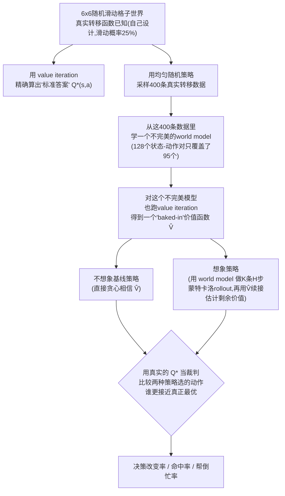

> **术语卡片:命中率 / 决策改变率 / 帮倒忙率** —— 这是本项目 pilot 实验自己定义的三个指标。
> "决策改变率"指"想象之后,选的动作和不想象时不一样"的比例;"命中率"指"在决策改变的那些
> 情况里,想象选的新动作确实比原来的动作更接近真实最优 $Q^*$"的比例;"帮倒忙率"是命中率
> 的反面——想象改变了决策,但改坏了。三个指标合起来才能完整回答"想象有没有用":光看"决策
> 改变率"高不能说明想象有用,可能全是在帮倒忙。

**第一轮(表格模型)**:用真实频次统计学出的表格式 world model。扫想象深度 $H$(候选数
$K=5$ 固定)发现:命中率从 44.0%($H=1$)一路降到 27.2%($H=8$),但决策改变率反而从
10.0% 升到 23.1%——**想得越深,决策改变得越多,但改得越来越不准**。

**数学推导(严格证明,不是拍脑袋观察)**:因为两个策略共享**同一个**不完美的
`LearnedWorldModel`——想象 rollout 的续跑策略和 bootstrap 用的都是同一个 $\hat V$,
根据 **Bellman 不动点方程**,想象 rollout 的期望值会精确"telescope"(逐层抵消)回
$\hat V$ 自己的一步展开值,**理论上和 $H$ 完全无关**。用鞅的**全方差公式**可以进一步
加强这个证明:定义 $Y_t=\mathbb{E}[G_H\mid\mathcal{F}_t]$ 为条件期望过程,这是一个鞅,
全方差公式 $\mathrm{Var}(Y_H)=\sum_{t=1}^H\mathbb{E}[\mathrm{Var}(Y_t\mid Y_{t-1})]$
严格非负、非递减——**这解释了"想得越深、决策改变得越多"这个观测到的现象是数学上必然的
方差累积,不是巧合,更不是"想象真的带来了新洞察"**。

**第二轮(神经网络集成模型)**:换成 5 个手写的小型神经网络组成的集成模型,回答"第一轮的
发现是不是表格模型独有的巧合"。决策改变率恒定在 65%~81% 高位(神经网络预测天然更"软",
注入更多采样方差,这个量级比表格模型的 10%~36% 高得多,反而更接近真实 DreamerV3/TD-MPC2
这类系统会有的效应)。还测试了一个"member 模式"(想象采样时随机抽一个集成里的成员,让想象
"看到"基线看不到的集成分歧)——**结果没有带来预期的改善**,这是一条负结果,把"多掌握的信息
必须是决策相关的"这条教训精确化了:哪怕是理论上货真价实的认知不确定性(epistemic
uncertainty),只要这份"新信息"和真正的决策目标无关,也救不回来。

**第三轮(task-conditioning)**:给想象一个真正决策相关的信息优势——让想象"知道"这一局
真实的任务目标,而基线不知道。三个候选目标上,想象的命中率**全部反超**基线(汇总
**82.0% vs 63.7%,领先 18.3 个百分点,零例外**)——这是三轮 pilot 里第一次出现的正向
发现。**一个意外的深层发现**:即使是"不知道真实目标"的对照组,命中率也比前两轮同源实验高
很多(57%~73% vs 前两轮的 30%~50%)——推导原因是实验设计里"即时奖励一直用真实目标计算、
只有 bootstrap 价值函数是过时的"这个选择本身,让更深的 rollout 在"跌回"过时的 bootstrap
之前,先吃到了更多真实目标的奖励信号,**这个渗透程度会随想象深度 $H$ 增加而增加**——
**这是全篇最重要的一条经验发现**:给想象多少真实任务信息,不是"有"或"没有"的开关式判断,
是一个连续的程度问题,哪怕只打开"奖励可观测"这一个通道、其他通道不动,想象也能捡到部分
真实信号。

## 6.3 一次重要的自我纠正

这是二次深挖调研(2026-07)里最重要的一次修正,必须诚实讲清楚。**第一轮和第二轮 pilot 的
"发现"(同源想象=噪声、无关随机性救不回来),核心原理正是 Russell & Wefald 1991 年 VOC
理论的直接推论**——"当所有可用计算的 VOC 都不为正,应该立即执行当前 belief 下的最优动作",
数学上就是"计算不能改变决策,则其期望价值恒为零"。这条结论早就被 Hay, Russell, Tolpin,
Shimony 的论文 *Selecting Computations*(arXiv:1207.5879,**UAI 2012 会议论文**,而且
**这篇论文本来就在我们自己的文献库里**!)形式化到贝叶斯选择问题的层面。

**这意味着什么**:如果我们把研究的核心贡献叙事锚定在"我们发现了想象要有用必须有信息优势"
这件事本身,任何熟悉这条文献脉络的审稿人几乎肯定会指出——这是在重新发明一个 30 年前就有的
轮子,这正是"desk reject"(编辑不送审直接拒稿)最典型的成因之一。**这个问题必须现在改口径,
不能等审稿人指出来才改。**

**但这不代表第一、二轮 pilot 没有价值**:我们做的是"第一次在'测试时想象 + 现代 world
model'这个具体场景里,把一个 30 年前的抽象原理用严格数学(鞅的全方差分解)钉实、做出可
复现的受控实验"——这是合法的**理论基线与阴性对照**贡献,不是新发现,诚实讲清楚这一点,
本身就是在向审稿人证明我们做过认真的文献调研。

**真正站得住"新发现"这个说法的,是第三轮的发现**(信息优势的渗透是连续的、分通道的)——
穷尽检索没有找到任何先例把"信息优势是连续渐变的"这个视角系统性地引入经典 VOC 理论。

## 6.4 三条独立证据线收敛到同一个方法论空当

1. **证据线1(竞争格局的共性)**:§5.3.12 总表最右列——十一篇最近邻方法,**没有
   一篇在"理论保证"上打勾**,全部靠强化学习训练一个经验式门控网络。
2. **证据线2(已经有人在摸,但没碰到我们的场景)**:二次深挖核实到一篇 *Cognitive
   Friction*(arXiv:2603.30031,2026.3)用 **HJB**(Hamilton-Jacobi-Bellman,一种
   源自最优控制理论、描述"最优策略应该满足什么微分方程"的经典工具)启发的最优停止边界,
   处理"该不该继续查询工具"这个决策——但应用场景是通用工具调用 agent,完全没有涉及
   world model/想象这个具体设定。这篇论文的存在证明"理论化门控"这条路不是我们凭空想象
   出来的死胡同,只是还没人把它接到 world model 想象这个具体问题上。
3. **证据线3(我们自己已经具备的实证基础)**:第一轮 pilot 的 Bellman telescoping 论证
   本身就是 VOC 理论在"同一模型多次采样"这个特殊情形下的严格实例化;第三轮 pilot 揭示
   了经典 VOC 理论一个没被充分处理的维度——**经典 VOC/最优停止理论普遍隐含假设"信息
   优势"是二元的(要么有、要么没有)**,而我们的实测表明信息优势的渗透是连续、分通道的。

```mermaid
flowchart TB
    E1["证据线1<br/>竞争格局共性:<br/>11篇方法'理论保证'一栏<br/>全部空白"] --> C{"三条独立证据<br/>收敛到同一点"}
    E2["证据线2<br/>Cognitive Friction:<br/>已有人摸HJB最优停止,<br/>但只做通用工具调用"] --> C
    E3["证据线3<br/>我们自己的pilot:<br/>Bellman telescoping已是<br/>VOC理论的严格实例化"] --> C
    C --> Gap["方法论空当:<br/>没有一篇把'有理论保证的<br/>最优停止/VOC'接到<br/>'world model想象门控'这个<br/>具体场景上"]
```

## 6.5 具体提案:把经典二元 VOC 推广成 $\varepsilon$-渗透 VOC

给想象 rollout 涉及的每个"信息通道" $c$(即时奖励、value bootstrap、转移模型本身、
continuation policy)都赋一个**渗透率** $\varepsilon_c\in[0,1]$,表示这个通道携带了
"基线不掌握的真实任务信息"的程度——$\varepsilon_c=0$ 表示这个通道和基线完全同源(没有
额外信息),$\varepsilon_c=1$ 表示这个通道完全知道真实任务信息。当所有通道的
$\varepsilon_c=0$ 时,理论预测应该精确退化到第一轮 pilot 已经证明的 Bellman
telescoping 结果——**这不是被推翻,是这个更一般框架的一个特例**。

```mermaid
flowchart LR
    subgraph Classic["经典VOC(Russell & Wefald 1991)"]
        direction TB
        C1["信息优势:二元<br/>有 or 没有"] --> C2["VOC(c) = 有信息时期望效用<br/>− 无信息时期望效用 − 代价"]
    end
    subgraph Ours["提案:ε-渗透VOC(本项目)"]
        direction TB
        O1["每个信息通道c<br/>渗透率ε_c∈[0,1]<br/>(奖励/bootstrap/转移/续跑策略)"] --> O2["VOC(ε_1,...,ε_k, H) = ?<br/>待形式化的函数"]
        O2 --> O3["特例 ε=0 全部:<br/>精确退化为第一轮pilot发现<br/>(Bellman telescoping)"]
        O2 --> O4["特例 ε_reward=1,ε_bootstrap从0→1:<br/>task-conditioning pilot<br/>63.7% → 82.0%(真实calibration点)"]
    end
    Classic -.被推广.-> Ours
```

我们的三轮 pilot,其实已经是这个 $\varepsilon$ 空间里的几个具体采样点:表格/神经网络 pilot
全部 $\varepsilon=0$;member 模式引入了一个 $\varepsilon>0$ 但和决策无关的通道(验证了
"$\varepsilon>0$ 不等于 VOC$>0$",信息必须是真的和决策相关);task-conditioning pilot 是
$\varepsilon_{reward}$ 恒为 1、$\varepsilon_{bootstrap}$ 从 0 变到 1 的一条轨迹,
63.7% 和 82.0% 是两个具体的、真实测出来的 calibration 数据点。**需要形式化并检验的核心
问题**:VOC 作为 $\{\varepsilon_c\}$ 和想象深度 $H$ 的函数,具体的函数形式是什么?能不能
给出理论上可以求解、或者至少可以数值刻画的"最优停止深度" $H^*(\varepsilon)$?

## 6.6 我们要怎么才能超越现有 SOTA

**不要走的路**:不要把方法贡献定位成"又一个用强化学习训练的想象门控"——这条路已经拥挤
(Astra/ITP/AVIC 都在这条赛道),资源更强的团队会更快把它做大做全,一个时间有限的小团队在
纯经验式路线上没有速度优势。

```mermaid
flowchart TB
    subgraph Now["现有十一篇方法的共同短板"]
        direction LR
        N1["理论保证:全部空白"]
        N2["和外部SOTA对比:<br/>多篇明确承认没做"]
        N3["信息来源:当成一个整体<br/>决策,不拆解通道"]
    end
    subgraph Us["我们的四条超越路径"]
        direction LR
        U1["路径1: 补理论保证<br/>(VOC/最优停止)"]
        U2["路径2: 受控ground-truth<br/>验证方法论(独有资产)"]
        U3["路径3: task-conditioning<br/>calibration数据锚点"]
        U4["路径4: 信息通道分解<br/>作为消融组织框架"]
    end
    N1 -.被路径1填补.-> U1
    N2 -.被路径2填补.-> U2
    N3 -.被路径4填补.-> U4
    U1 --> U3
```

1. **理论保证是十一篇竞品共同缺失的维度**——不需要在"想象机制本身"上比谁的工程更精巧,
   只需要在"门控决策有没有可证的最优性/误差界"这一个维度上做到竞品都没做的事。
2. **受控 ground-truth 验证方法论是我们独有的资产**——十一篇竞品里,ELASTIC/RARRL 明确
   承认"没有引用外部 SOTA 做对比,只做内部对照";我们的合成环境+精确 value iteration 裁判,
   是目前唯一能够精确判断"想象选的动作是否真的更优"的评测协议。
3. **task-conditioning pilot 的 calibration 数据已经是一个具体的、可扩展的锚点**——
   不是空谈"我们要做理论",而是已经有 63.7%/82.0% 这两个真实数字可以拿来验证任何提出的
   $VOC(\varepsilon,H)$ 函数形式对不对。
4. **信息通道分解这个视角,现有十一篇论文没有一篇采用**——它们都把"该不该想"当一个整体
   决策,没有拆解"想象内部不同信息来源各自贡献了多少"。

## 6.7 还未解决的问题(如实列出,不回避)

1. **理论推导本身可能推不出干净的闭式解**——渐变信息 VOC 这个问题,即使在经典决策论文献
   里也可能有已知的困难结果,能不能拿到"哪怕不完美但站得住"的理论结果,是最大的不确定性。
2. **即使理论成立,"用网络估计通道级 $\varepsilon_c(t)$"这个训练目标本身需要重新设计**,
   理论优雅不等于实现容易。
3. **需要把 pilot 从 32 状态的合成格子世界搬到真实 world model(DreamerV3/TD-MPC2)上
   重新验证**——高维环境里"信息通道"的定义本身可能更模糊。
4. 部分理论补强文献(F2 组后 6 篇)的逐字核验尚未完成(World-in-World 的 ICLR 接收状态
   已于 2026-07-23 确认为 Oral,此项已解决)。
5. **严格的"零信息泄露"三方对照组**(让即时奖励也故意用默认目标计算)仍未做,§6.2 第三轮
   pilot 的机制推导目前基于间接证据,不是独立实验验证。
6. 这次调研没有找到"渐变信息通道 VOC 延伸"这个具体理论问题的任何已有工作,但这是"未找到"
   而非"确认不存在"的判断,不排除换一个理论社区(信息论/控制论)搜索会有新发现。

---

# Part 7. 时间线与开放问题

```mermaid
gantt
    dateFormat X
    axisFormat %s
    section 已完成
    文献调研88篇+两轮核验          :done, a1, 0, 8
    10个idea腦暴+3轮pilot          :done, a2, 8, 6
    二次深挖(gap+竞争格局)          :done, a3, 14, 3
    40页完整技术简报(05)           :done, a4, 17, 3
    本篇教科书式讲义(06)            :done, a5, 20, 3
    section 待定
    方向拍板(Song+Weikai)          :active, b1, 23, 3
    理论可行性评估(若选ε-VOC路线)   :b2, 26, 10
    真实world model上复现pilot     :b3, 36, 14
    方法开发+消融                  :b4, 50, 21
    写作+投稿准备                  :b5, 71, 8
```

**需要会议明确拍板的问题**(汇总 Part 6 全部开放项,不在本文档里下结论):

1. $\varepsilon$-渗透 VOC 这个方向,从理论背景判断,能不能在有限时间内拿到"哪怕不完美但站得住"的
   理论结果?
2. 如果理论路线可行,是否需要收窄成"理论框架+合成环境验证"这一半,真实 world model
   验证作为后续工作?
3. 如果理论风险太高,§6.6 提到的"消融研究框架"降级方案是否可以接受?
4. 理论补强文献里尚未逐字核验的部分,谁来做、什么时候做?(World-in-World 的 ICLR 接收状态
   已确认为 Oral,此项已解决)
5. 10 个候选 idea(见 [`00-brainstorm-10-ideas.md`](00-brainstorm-10-ideas.md))里最终
   选哪 1-2 个并行推进——本文档不做决定,决定权按既定安排留给会议。

---

# 附录 A. 完整术语与缩写表

> 按类别分组,方便按主题查找;第一次在正文出现的位置已经给过解释,这里是压缩版方便随时回查。

```{=latex}
\begin{landscape}
```

## A.1 强化学习基础

| 词 | 解释 |
|---|---|
| RL(强化学习) | Agent 通过试错、依据反馈信号调整行为的机器学习范式 |
| Agent(智能体) | 做决策、执行动作的主体 |
| Environment(环境) | Agent 所处、会因动作而改变的外部世界 |
| State / Observation(状态/观测) | 环境当前的样子 |
| Action(动作) | Agent 可以对环境施加的操作 |
| Reward(奖励) | 环境对动作的数值反馈,agent 的目标是最大化长期累积奖励 |
| Policy(策略) | 从状态到动作的决策规则/网络,记作 $\pi$ |
| Value Function $V(s)$(价值函数) | 从状态 $s$ 开始按某策略走下去的长期期望累积奖励 |
| Q-function $Q(s,a)$(动作价值函数) | 在状态 $s$ 先做动作 $a$、之后按策略走下去的长期期望累积奖励 |
| MDP(马尔可夫决策过程) | $(\mathcal S,\mathcal A,P,R,\gamma)$ 五元组,下一状态只依赖当前状态和动作 |
| POMDP(部分可观测MDP) | Agent 不能直接看到完整真实状态,只能看到部分观测的 MDP 变体 |
| Bellman 方程/不动点 | 价值函数满足的递归一致性方程,是几乎所有 RL 算法的理论基础 |
| Value Iteration(价值迭代) | 对 Bellman 方程反复迭代直到收敛、精确算出最优价值函数的经典算法 |
| 折扣因子 $\gamma$ | 未来奖励打的折扣,越接近 0 越"短视" |

## A.2 World Model 专有概念

| 词 | 解释 |
|---|---|
| World Model(世界模型) | 学出来的、近似真实环境转移/奖励函数的模型,记作 $\hat P,\hat R$ |
| Model-based RL(基于模型的强化学习) | 用 world model 辅助决策/训练的 RL 范式 |
| Model-free RL(无模型强化学习) | 直接在真实环境里试错学策略,不建 world model |
| 想象 / Rollout | 用 world model(而非真实环境)展开模拟出的一条轨迹 |
| Horizon($H$,想象深度/规划视界) | 想象/规划展开了多少步 |
| RSSM(循环状态空间模型) | Dreamer 系列 world model 的核心结构,含表示/转移/(奖励)预测三部分 |
| 隐空间(Latent Space)/隐状态/隐变量 | 观测被压缩后的抽象表示空间,不要求能还原出原始画面 |
| VAE(变分自编码器) | 一种把高维数据压缩成低维向量、又能从向量还原回去的生成模型 |
| Tokenizer(分词器) | 把连续信号(图像/视频)切分/压缩成离散"词元"序列的模块 |
| 自回归模型(Autoregressive Model) | 逐个生成序列元素、每一步依赖之前已生成内容的生成模型 |
| 扩散模型(Diffusion Model) | 从随机噪声出发逐步"去噪"生成数据的生成模型 |
| 去噪步数(Denoising Steps) | 扩散模型生成一个样本需要迭代的步数,步数越多通常质量越好但越慢 |
| 隐动作模型(Latent Action Model) | 不靠人工标注、自己从视频里学出一套"隐藏动作空间"的模块(如 Genie) |

## A.3 测试时计算与规划

| 词 | 解释 |
|---|---|
| 测试时计算(Test-time Compute) | 部署/推理阶段(而非训练阶段)额外花费的计算量 |
| Planning(规划) | 行动前先用模型"预演"多种可能性再决策 |
| MCTS(蒙特卡洛树搜索) | 反复模拟+回传更新统计量、逐步聚焦有希望分支的树搜索算法 |
| PUCT / UCB | MCTS 里平衡"探索新分支"和"利用已知好分支"的打分公式 |
| MPC(模型预测控制) | 规划一整段动作但只执行第一步、随后重新规划的控制范式 |
| CEM(交叉熵方法) | 采样候选方案、保留表现最好的一批、逐步收窄采样分布的搜索算法 |
| MPPI | 和 CEM 类似、用加权平均迭代更新候选分布的规划算法 |
| Bootstrap / 终值函数(Terminal Value Function) | 用价值函数估计"想象截断点之后"还没算到的长期回报 |
| Self-Consistency(自洽性) | 同一模型对同一输入独立重复采样多次、再综合/挑选的技巧 |
| Best-of-N | 生成 N 个候选、用打分器挑最好一个的最基础范式 |
| Ablation(消融实验) | 去掉/替换方法的某个部件,观察效果变化以证明该部件的作用 |
| SOTA | State-of-the-Art,当前公开报告里最好的效果 |

## A.4 不确定性与信息

| 词 | 解释 |
|---|---|
| Uncertainty(不确定性) | 模型对自己预测把握程度的量化 |
| Epistemic Uncertainty(认知不确定性) | 因为数据/知识不够导致的不确定性,原则上可通过多学习/多观测降低 |
| Aleatoric Uncertainty(偶然不确定性) | 环境本身固有的随机性,再怎么多学习也降不下去 |
| Ensemble(集成) | 训练多个独立模型,用它们的平均/分歧来估计预测和不确定性 |
| Disagreement(分歧) | 集成中多个模型对同一输入预测不一致的程度,常用作不确定性代理 |
| MC-Dropout | 测试时也保持 dropout 开启、多次前向采样来近似不确定性的技巧 |
| Conformal Prediction(保形预测) | 用校准集给出有统计覆盖保证的预测集合/区间的方法 |

## A.5 训练算法

| 词 | 解释 |
|---|---|
| PPO(近端策略优化) | 一种常用、稳定的强化学习策略梯度算法 |
| GRPO / Dr.GRPO | PPO 的变体,对同一输入采样一组输出、组内相对比较来算优势值 |
| SAC(Soft Actor-Critic) | 一种鼓励策略保持一定随机性/探索性的强化学习算法 |
| A2C(Advantage Actor-Critic) | 用优势函数指导更新的经典 actor-critic 算法 |
| KV Cache | 复用之前算过的中间注意力结果、避免重复计算的工程技巧 |

## A.6 数学与理论工具

| 词 | 解释 |
|---|---|
| VOC(计算的价值,Value of Computation) | 量化"多做一次计算"值不值得的经典理论框架(Russell & Wefald 1991) |
| VOI(信息的价值,Value of Information) | VOC 的更早期版本,专指"获得某条信息"的价值 |
| 最优停止理论(Optimal Stopping Theory) | 研究"该在什么时候停止继续观察/计算"的经典数学理论 |
| 鞅(Martingale) | 一种"下一步的条件期望等于当前值"的随机过程,是很多停止理论证明的工具 |
| 全方差公式(Law of Total Variance) | $\mathrm{Var}(Y)=\mathbb E[\mathrm{Var}(Y\mid X)]+\mathrm{Var}(\mathbb E[Y\mid X])$,本项目用它证明想象方差随深度非递减 |
| Submodularity(次模性) | 一种"边际收益递减"的集合函数性质,满足时贪心算法有理论近似保证 |
| HJB 方程(Hamilton-Jacobi-Bellman) | 最优控制理论里描述"最优策略应满足什么微分方程"的经典工具 |
| SMDP(半马尔可夫决策过程) | 允许每一步花费不同长真实时间的 MDP 变体 |
| POIMDP | ITP 论文提出的 POMDP 变体,显式加入"可以调用 world model 想象"这个能力 |
| 背包问题(Knapsack Problem) | 在容量约束下挑选价值最大的物品组合的经典优化问题 |
| OS-MCKP | Ordered Stochastic Multiple-Choice Knapsack Problem,ROI-Reasoning 论文用来形式化"多题共享预算"的模型 |

## A.7 评测、会议与常见缩写

| 词 | 解释 |
|---|---|
| arXiv | 一个论文预印本平台,论文可以在正式会议/期刊评审通过之前先在这里公开 |
| ICLR / NeurIPS / ICML / UAI / ACL / EMNLP | 机器学习/人工智能领域的主要学术会议 |
| Benchmark(评测基准) | 用来衡量、比较不同方法效果的标准数据集/任务集合 |
| Zero-shot(零样本) | 不针对目标任务做任何额外训练/微调,直接测试 |
| VLM / LLM | Vision-Language Model(视觉语言模型)/ Large Language Model(大语言模型) |

## A.8 本项目自造术语(pilot 实验专用)

| 词 | 解释 |
|---|---|
| 决策改变率 | 想象之后选的动作和不想象时不一样的比例 |
| 命中率 | 决策改变的情况里,想象选的新动作确实更接近真实最优 $Q^*$ 的比例 |
| 帮倒忙率 | 决策改变的情况里,想象选的新动作反而更差的比例(命中率的反面) |
| Task-conditioning(任务条件化) | 让想象过程能"看到"基线看不到的真实任务目标信息 |
| $\varepsilon$-渗透 VOC | 本项目提出的方向:给每个信息通道赋一个连续渗透率 $\varepsilon_c\in[0,1]$,推广经典二元 VOC 理论 |

```{=latex}
\end{landscape}
```

---

# 参考文献索引

**Part 3 历史脉络核实的 9 篇经典论文**:World Models(1803.10122)、PlaNet(1811.04551)、
Dreamer(1912.01603)、DreamerV2(2010.02193)、MuZero(1911.08265)、TD-MPC(2203.04955)、
TD-MPC2(2310.16828)、Genie(2402.15391)、GameNGen(2408.14837)。

**Part 5 逐字通读全文(含附录)的 11 个核心最近邻方法论文**:AVIC(2602.08236)、
FFDC(2605.06222)、Video-T1(2503.18942)、DreamerV3(2301.04104)、Astra(2606.06476)、
ITP(2601.08955)、ELASTIC(2606.31132)、RARRL(2603.16673)、
Finding-the-Time-to-Think(2606.26463)、ROI-Reasoning(2601.03822)、
World-in-World(2510.18135)。

**Part 6 理论锚点**:Russell & Wefald(1991,VOC 框架原始出处)、Hay et al. *Selecting
Computations*(1207.5879,UAI 2012)、Cognitive Friction(2603.30031)。**诊断性证据**:
Current Agents Fail to Leverage World Model(2601.03905)。

完整 68 篇文献库(含 A-F 六个 track、每篇标注核心机制与相关性)见
[`papers/INDEX.md`](papers/INDEX.md)。更高信息密度、面向已有背景读者的版本见
[`05-full-technical-briefing.md`](05-full-technical-briefing.md);本文档所有 Part 5-6
数字的原始核验记录见 [`03-novelty-competitive-landscape.md`](03-novelty-competitive-landscape.md)。
